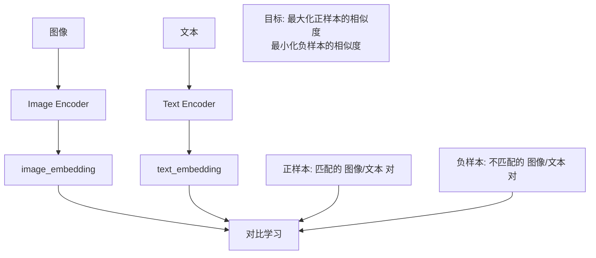
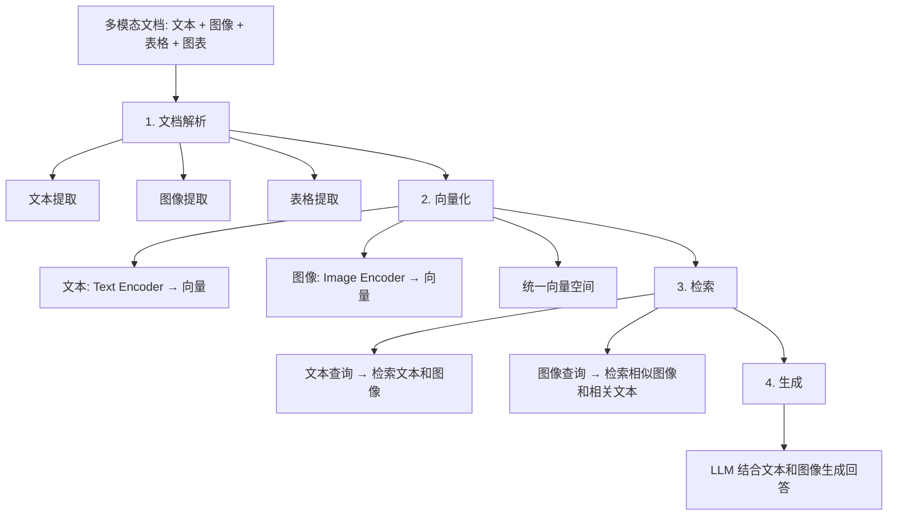
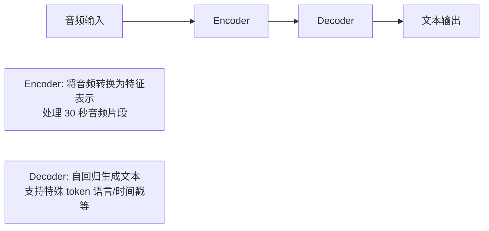
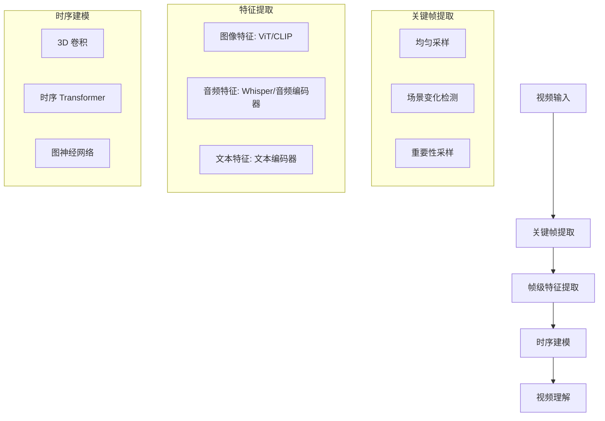
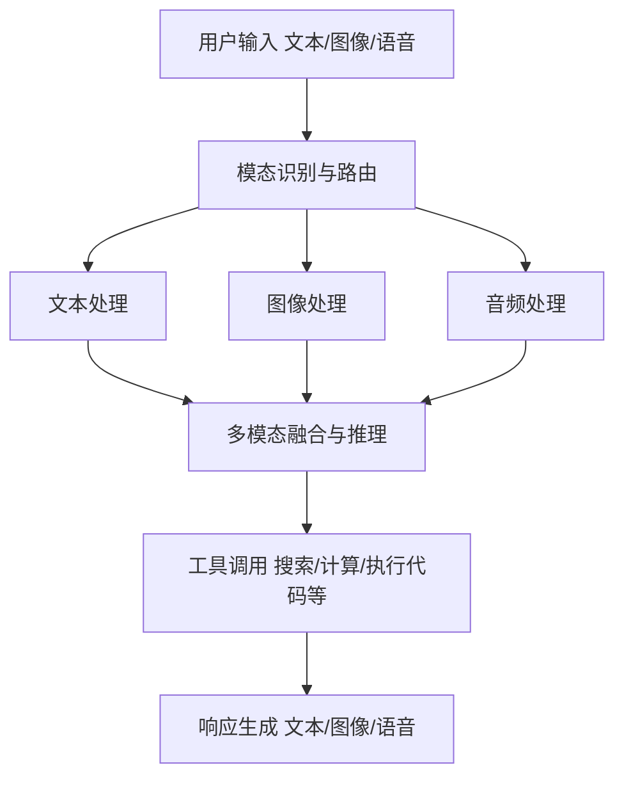

---

title: "多模态模型"

created: "2026-07-13"

tags:

  - 八股文

  - ai

---

# 多模态模型

> **生活化类比**：多模态模型像一个"全感官的人"——不仅读文字，还能看图片、听声音、理解视频，把眼睛、耳朵和嘴巴获得的信息在大脑里统一成一份理解，而不只是"只读文字的书呆子"。

## 核心概念

**多模态模型（Multimodal Models）** 是能够处理和理解多种类型数据（文本、图像、音频、视频等）的 AI 模型。与仅处理文本的 LLM 不同，多模态模型能够跨模态理解和生成内容。

## 多模态架构类型
### 架构对比

| 架构类型 | 描述 | 代表模型 | 特点 |
| --------- | ------ | --------- | ------ |
| 早期融合 | 在输入层就融合多模态信息 | Flamingo | 端到端训练 |
| 晚期融合 | 各模态独立编码后融合 | CLIP | 灵活组合 |
| 交叉注意力 | 不同模态通过注意力交互 | Flamingo | 深度交互 |
| 序列建模 | 将多模态统一为 token 序列 | GPT-4o | 统一架构 |

## 视觉-语言模型（Vision-Language Models）
### CLIP（Contrastive Language-Image Pre-training）
#### 核心思想

通过对比学习，将图像和文本映射到同一个向量空间。



#### CLIP 的应用

| 应用 | 描述 |
| ------ | ------ |
| 零样本图像分类 | 无需训练即可分类新类别 |
| 图像检索 | 根据文本检索图像 |
| 图像标注 | 为图像生成文本描述 |
| 视觉问答 | 基于图像回答问题 |

### GPT-4V（GPT-4 Vision）
## 音频模型
### Whisper
#### 核心特点

| 特性 | 描述 |
| ------ | ------ |
| 多模态输入 | 支持图像 + 文本联合输入 |
| 图像理解 | 理解图表、照片、文档截图 |
| 视觉推理 | 基于图像进行推理和分析 |
| OCR 能力 | 识别图像中的文字 |

#### 图像理解示例

```text

输入：[图像] + "这张图片中有什么问题？"

GPT-4V 分析：

  1. 识别图像内容（如：电路图）

  2. 检测潜在问题（如：接线错误）

  3. 提供修复建议

应用场景：

  - 文档分析（合同、发票）

  - 医疗影像诊断

  - 工业质检

  - 教育辅导

```

## 多模态 RAG
## 多模态 Agent 架构
### 架构设计



### 多模态检索策略

| 策略 | 描述 | 适用场景 |
| ------ | ------ | --------- |
| 文本到图像 | 用文本查询检索图像 | 图像搜索 |
| 图像到文本 | 用图像查询检索文本 | 图像理解 |
| 图像到图像 | 用图像检索相似图像 | 相似图像发现 |
| 跨模态融合 | 结合多种模态的检索结果 | 综合问答 |

#### 核心特点

OpenAI 开源的语音识别模型：

| 特性 | 描述 |
| ------ | ------ |
| 多语言 | 支持 99 种语言 |
| 鲁棒性 | 对口音、背景噪音有较好的鲁棒性 |
| 端到端 | 直接从音频到文本 |
| 开源 | 完全开源，可本地部署 |

#### Whisper 架构



### 多模态音频应用

| 应用 | 描述 | 技术 |
| ------ | ------ | ------ |
| 语音转录 | 将语音转换为文本 | Whisper |
| 语音翻译 | 实时语音翻译 | Whisper + 翻译模型 |
| 语音对话 | 语音输入输出的对话系统 | ASR + LLM + TTS |
| 音频理解 | 理解音频内容和情感 | 多模态音频模型 |

## 视频理解
### 视频处理挑战

| 挑战 | 描述 | 解决方案 |
| ------ | ------ | --------- |
| 时序建模 | 理解视频中的时间关系 | 3D 卷积、Transformer |
| 计算量大 | 视频帧数多，计算成本高 | 关键帧提取、采样 |
| 长视频理解 | 理解长视频的全局内容 | 分层处理、摘要 |
| 多模态融合 | 结合视觉、音频、文本 | 多模态 Transformer |

### 视频理解架构



### 视频应用

| 应用 | 描述 |
| ------ | ------ |
| 视频问答 | 基于视频内容回答问题 |
| 视频摘要 | 生成视频的文字摘要 |
| 视频检索 | 根据文本或视频检索 |
| 动作识别 | 识别视频中的动作 |

### 架构设计



### 多模态 Agent 能力

| 能力 | 描述 | 实现方式 |
| ------ | ------ | --------- |
| 视觉理解 | 理解图像内容 | 多模态 LLM |
| 语音交互 | 语音输入输出 | ASR + TTS |
| 图像生成 | 根据描述生成图像 | 扩散模型 |
| 视频分析 | 理解视频内容 | 视频理解模型 |

##

> ▶ 对应实操：[[12-Self-RAG：自我反思+自纠正闭环|12-Self-RAG：自我反思+自纠正闭环]]

## 速记卡（面试闪卡）

**Q1：一句话讲清「多模态模型」到底是什么？**

A：多模态模型能统一理解文本、图像、音频、视频等多种类型的数据。

**Q2：核心概念 —— 怎么理解？**

A：像一个全感官的人：不只读文字，还能看图片、听声音、懂视频，把眼睛耳朵得到的信息在大脑里统一成一份理解。Multimodal Models（多模态模型）跨模态理解和生成内容。

**Q3：多模态架构类型 —— 怎么理解？**

A：像把不同语言先翻译到同一本字典：早期融合（输入层就融合）、晚期融合（各模态独立编码后融合）、交叉注意力（模态间注意力交互）、序列建模（统一为 token 序列，如 GPT-4o）。

**Q4：视觉-语言模型（Vision-Language Models） —— 怎么理解？**

A：像把图和文字贴上同一个价签：CLIP（Contrastive Language-Image Pre-training，对比语言-图像预训练）用对比学习把图、文映射到同一向量空间，实现零样本分类与跨模态检索。

**Q5：多模态 RAG —— 怎么理解？**

A：像图书馆同时存了文字书、画册和录音：多模态 RAG 用多模态编码器把文本/图像/表格映射到统一向量空间，支持文本到图像、图像到文本等跨模态检索与生成。

**Q6：核心速记主线有哪些？**

- 多模态=全感官 AI，跨模态统一理解生成

- 架构四类：早期/晚期融合、交叉注意力、序列建模

- CLIP 对比学习对齐图文到同一向量空间

- 多模态 RAG 统一向量空间做跨模态检索

**口诀**

A：多模态是全能眼，图文音视都看见；

四种架构各擅长，融合注意序列联；

CLIP 把图对齐字，同一空间好检索；

多模态 RAG 齐搜，跨模理解不费难。

相关链接

- [[八股文学习路线图]]

- [[00-全局导航|全局导航]]

## 常见问题

| 问题 | 回答要点 |
| ------ | --------- |
| CLIP 的核心思想是什么？ | CLIP 通过对比学习将图像和文本映射到同一个向量空间。训练时最大化匹配的（图像，文本）对的相似度，最小化不匹配的对的相似度。这使得 CLIP 可以进行零样本图像分类和跨模态检索。 |
| GPT-4V 如何处理图像输入？ | GPT-4V 将图像转换为视觉 token，与文本 token 一起输入 LLM。模型通过交叉注意力机制理解图像内容，并结合文本进行推理。支持图表、照片、文档截图等多种图像类型。 |
| 多模态 RAG 和传统 RAG 有什么区别？ | 传统 RAG 主要处理文本；多模态 RAG 需要处理文本、图像、表格等多种模态。需要多模态编码器将不同模态映射到统一向量空间，并支持跨模态检索和生成。 |
| Whisper 的架构是什么？ | Whisper 使用 Encoder-Decoder 架构。Encoder 将音频转换为特征表示，Decoder 自回归生成文本。支持 99 种语言，对口音和背景噪音有较好的鲁棒性。 |
| 视频理解的主要挑战是什么？ | 主要挑战：(1) 时序建模，理解视频中的时间关系；(2) 计算量大，视频帧数多；(3) 长视频理解，需要全局理解；(4) 多模态融合，结合视觉、音频、文本。 |
| 多模态 Agent 需要哪些能力？ | 核心能力：视觉理解（图像内容理解）、语音交互（ASR+TTS）、图像生成（扩散模型）、视频分析（视频理解模型）。需要将这些能力集成到统一的 Agent 框架中。 |
| 多模态模型的融合策略有哪些？ | 主要有三种：早期融合（输入层融合）、晚期融合（独立编码后融合）、交叉注意力（模态间注意力交互）。选择取决于任务需求和计算资源。 |
| 多模态 RAG 的检索策略有哪些？ | 四种策略：文本到图像、图像到文本、图像到图像、跨模态融合。实际应用中通常结合多种策略，根据查询类型选择最合适的检索方式。 |

## 相关链接

- [[笔记/AI与Agent/知识/八股/66-大模型安全与伦理|大模型安全与伦理]]

- [[笔记/AI与Agent/知识/八股/64-分布式训练与并行策略|分布式训练与并行策略]]

- [[笔记/AI与Agent/知识/八股/06-MHA-MQA-GQA多头注意力变体|MHA-MQA-GQA多头注意力变体]]

- [[笔记/AI与Agent/知识/八股/24-ReAct框架与规划能力|ReAct框架与规划能力]]

- [[笔记/AI与Agent/知识/八股/10-LLM幻觉与可靠性|LLM幻觉与可靠性]]

