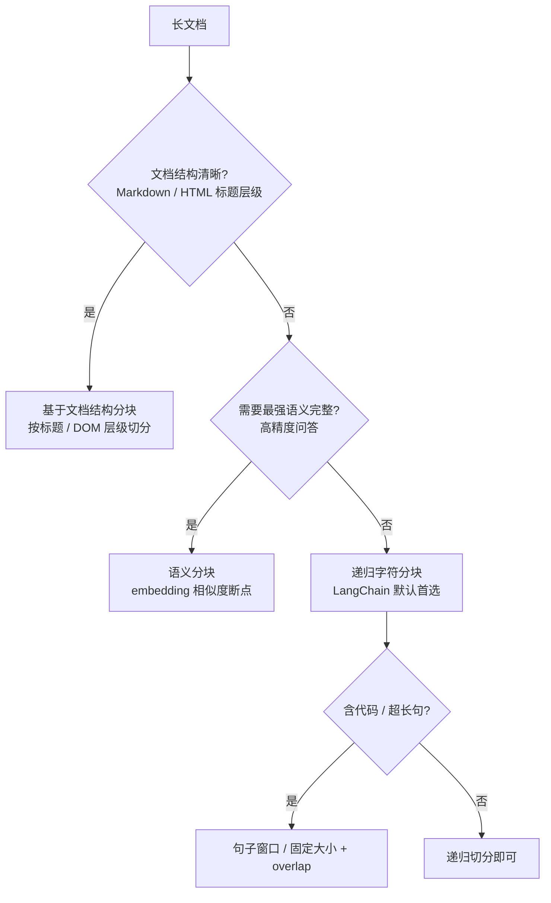

---

title: "文档解析与分块策略"

created: "2026-07-13"

tags:

  - 八股文

  - ai

---

# 文档解析与分块策略

> **生活化类比**：分块就像把一整本电话簿拆成「带标签页的活页」——切得太碎，查一个人要翻好几页；切得太大，一页里混着太多无关信息。RAG 的分块要找「一页刚好讲清一件事」的粒度。

## 核心概念

**文档解析（Document Parsing）** 是将各种格式的文档（PDF、HTML、Markdown 等）转换为结构化文本的过程。

**分块（Chunking）** 是将长文档切分为适合 LLM 处理的较短文本段的过程。分块质量直接影响 RAG 系统的检索和生成效果。

## 文档格式与解析方法
### PDF 解析

| 方法 | 原理 | 优点 | 缺点 |

| ------ | ------ | ------ | ------ |

| PyPDF | 基于 PDF 结构解析 | 简单快速 | 格式支持有限 |

| pdfplumber | 提取文本和表格 | 支持表格 | 复杂布局处理差 |

| Unstructured | 多种解析策略 | 支持多种格式 | 依赖较多 |

| LLM-based | 用多模态模型理解 | 处理复杂布局 | 成本高、速度慢 |

### PDF 解析的挑战

| 挑战 | 描述 | 解决方案 |

| ------ | ------ | --------- |

| 多栏布局 | 文本顺序被打乱 | 使用布局分析模型 |

| 表格提取 | 表格结构丢失 | 专用表格提取工具 |

| 图片中的文字 | OCR 处理 | 集成 OCR 引擎 |

| 扫描件 | 纯图片 PDF | OCR + 版面分析 |

| 数学公式 | LaTeX 或图片 | Mathpix 等专用工具 |

### HTML 解析

```text

HTML → 文本提取 → 清洗 → 结构化文本

常用工具：

  - BeautifulSoup：传统 HTML 解析

  - Readability：提取正文内容

  - Trafilatura：网页正文提取

```

### Markdown 解析

Markdown 解析相对简单，主要挑战是：

- 保留标题层级结构

- 处理代码块

- 解析表格和列表

- 处理嵌入的图片和链接

## 分块策略

> 选择哪种分块策略，本质是「语义完整性 vs. 实现成本」的权衡，可用下面这张决策流快速定位：



```text

方法：按固定字符数或 token 数切分

示例（chunk_size=500, overlap=50）：

  文档：[............|............|............|............]

  块1：[----------]

  块2：    [----------]

  块3：        [----------]

  块4：            [----------]

优点：实现简单，可预测

缺点：可能切断语义单元

```

### 语义分块（Semantic Chunking）

```text

方法：基于语义相似度切分

流程：

  1. 将文档按句子切分

  2. 计算相邻句子的 embedding 相似度

  3. 在相似度下降处切分

示例：

  句子1-3：相似度高 → 同一块

  句子4-6：相似度高 → 同一块

  句子3-4：相似度低 → 切分点

优点：保持语义完整性

缺点：计算成本高

```

### 递归字符分块（Recursive Character Splitting）

```text

方法：按层次结构递归切分

切分优先级：

  1. 按段落（\n\n）

  2. 按句子（.!?）

  3. 按单词（空格）

  4. 按字符

示例：

  文档 → 按段落切分

    ↓ 如果段落太长

  按句子切分

    ↓ 如果句子太长

  按单词切分

优点：尽量保持语义完整性

缺点：块大小不均匀

```

### 基于文档结构的分块

```text

方法：利用文档自身的结构信息

Markdown：

  按标题层级切分

  # H1 → ## H2 → ### H3

HTML：

  按 DOM 结构切分

  <div> → <section> → <article>

PDF：

  按章节、段落切分

优点：自然保持文档结构

缺点：依赖文档格式

```

## 分块参数选择
### 关键参数

| 参数 | 描述 | 典型值 |

| ------ | ------ | ------- |

| chunk_size | 每个块的最大大小 | 200-1000 tokens |

| chunk_overlap | 相邻块的重叠大小 | 10-20% of chunk_size |

| min_chunk_size | 最小块大小 | 50-100 tokens |

### Chunk Overlap 的作用

```text

无 overlap：

  块1：[A B C D E]

  块2：[F G H I J]

  问题：C 和 F 之间的上下文丢失

有 overlap：

  块1：[A B C D E]

  块2：    [D E F G H]

  优势：保留了边界处的上下文

但 overlap 过大：

  块1：[A B C D E]

  块2：      [C D E F G]

  问题：信息冗余，检索效率降低

```

### 不同场景的推荐配置

| 场景 | chunk_size | overlap | 说明 |

| ------ | ----------- | --------- | ------ |

| 问答系统 | 200-500 | 50-100 | 精确匹配问题 |

| 文档摘要 | 500-1000 | 100-200 | 保留更多上下文 |

| 代码检索 | 100-300 | 20-50 | 保持函数/类完整性 |

| 法律文档 | 300-600 | 50-100 | 保持条款完整性 |

## 元数据提取
### 有用的元数据

| 元数据 | 用途 | 提取方法 |

| ------- | ------ | --------- |

| 文档标题 | 检索结果展示 | 文档解析 |

| 作者 | 来源可信度评估 | 文档属性 |

| 创建时间 | 时效性过滤 | 文件属性 |

| 章节标题 | 上下文理解 | 结构解析 |

| 页码 | 定位原文 | PDF 解析 |

| 文档类型 | 过滤和路由 | 文件扩展名 |

### 元数据在检索中的应用

```text

检索查询：

  1. 语义相似度检索 → 候选文档

  2. 元数据过滤：

     - 时间过滤：只要最近 1 年的文档

     - 类型过滤：只要技术文档

     - 来源过滤：只要官方文档

  3. 结合相似度和元数据的综合排序

```

## 特殊内容处理
### 表格提取

```text

PDF 表格 → 结构化数据 → 文本化表示

文本化方式：

  Markdown 表格：

  | 列1 | 列2 | 列3 |

  |-----|-----|-----|

  | A1  | B1  | C1  |

  自然语言描述：

  "在表格中，列1的值为A1时，列2的值为B1，列3的值为C1"

```

### OCR 处理

| OCR 工具 | 语言支持 | 精度 | 速度 |

| --------- | --------- | ------ | ------ |

| Tesseract | 多语言 | 中 | 慢 |

| PaddleOCR | 中英文 | 高 | 快 |

| EasyOCR | 多语言 | 中 | 中 |

### 代码块处理

```text

保留代码的完整性：

  - 不要将代码块切分到不同 chunk

  - 保留代码的缩进和格式

  - 提取代码的语言和注释信息

```

---

> **适用场景**：RAG 系统文本预处理阶段 | **你的角色**：AI Agent 应用开发工程师（求职核心考点）

>

>

>

> **一句话总结**：分块是 RAG 的"第一公里"，决定了检索质量的天花板——模型再强，喂进去的"碎肉"不对，照样答非所问。

>

---

## 一、为什么必须分块？——"自助餐装盘"类比

想象你去吃自助餐，有一整头烤牛（完整文档）。你不能把整头牛塞嘴里（LLM 上下文窗口有限），也不能随便剁成肉泥（语义全断），而是要切成大小合适的牛排块（chunk），每块都带点肥瘦相间的完整口感（上下文保留），这样吃起来才爽（检索精准）。

**分块的三个硬约束：**

1. **模型上下文窗口限制**：Embedding 模型通常只吃 512~8192 tokens，LLM 也有输入上限

2. **检索精度要求**：向量检索是"局部匹配"，chunk 太大则关键信息被稀释，太小则上下文断裂

3. **计算成本控制**：chunk 越多 = 向量存储越大 = 检索越慢 = API 花钱越多

> 💡 **核心金句**："Chunking 不是简单的'切文本'，而是在**上下文完整性、检索精度、计算成本**三者之间做工程取舍。"

>

---

## 二、核心参数：chunk_size 与 overlap
### 2.1 chunk_size（块大小）——"牛排切多大"

chunk_size 是每个文本块的长度（通常以 token 或字符为单位）。它是 RAG 系统中**最核心的超参数之一**，直接决定检索的召回率和准确率。

#### 太大的问题

| 问题 | 通俗解释 | 实际后果 |

| --- | --- | --- |

| 噪声稀释 | 一块牛排里混了太多肥肉（无关内容） | 关键信息被向量空间"平均化"，检索精度下降 |

| 上下文窗口浪费 | 给 LLM 的 prompt 被废话占满 | 生成容易跑偏、啰嗦，甚至幻觉 |

| 计算开销大 | 每块更大 = Embedding 更慢 | 成本飙升 |

> ⚠️ **真实案例**：财报中"净利润 1.2 亿"这个关键数字，如果 chunk_size=2048，它就被淹没在 2000 token 的冗长描述里，向量检索根本定位不到。

>

#### 太小的问题

| 问题 | 通俗解释 | 实际后果 |

| --- | --- | --- |

| 语义腰斩 | "用户登录失败"被切成"用户登录" + "失败" | 检索到了但 LLM 看不懂完整意思 |

| 上下文断裂 | 前提和结论分到不同块 | LLM 只看到结论不知道为什么 |

| chunk 数量爆炸 | 10 万字文档切成 200 token 的块 = 500+ 块 | 向量库膨胀，检索变慢 |

#### 黄金区间与经验法则

| 文档类型 | 推荐 chunk_size | 理由 |

| --- | --- | --- |

| 通用文档/百科/说明书 | 512~1024 tokens | 信息密度适中，中等块兼顾上下文和精度 |

| 法律/合同/强结构化文档 | 256~512 tokens | 条款独立性强，小块即可完整表达一条法规 |

| 长文章/故事/报告 | 1024~2048 tokens | 叙事连贯性强，需要更大上下文 |

| 问答类/FAQ | 400~600 tokens | 问答对天然边界清晰 |

| 技术文档/代码 | 200~300 tokens | 函数/配置步骤通常较短 |

> 💡 **工程金句**："不要为了 5% 的召回率提升，付出 10 倍的 Embedding 成本。"

>

#### 三板斧验证法（可答）

1. **模型边界法**：chunk_size ≤ Embedding 模型上限（如 512）× 90%（留 10% Buffer）

2. **知识单位法**：统计业务文档中独立知识点的平均 token 数（如法律条文"第 3 条"平均 200 tokens）

3. **黄金文档测试**：在 256 / 512 / 1024 三种尺寸下测试，检查答案是否总在 Top-3

#### 动态评估法（进阶）

51CTO 实测文章通过 70 组不同 chunk_size × overlap 的组合，用 Ragas 评估三个指标：

- **上下文召回率**：最佳组合 chunk_size=768, overlap=0.6，得分 0.78

- **上下文相关性**：最佳组合 chunk_size=512, overlap=0.5，得分 0.8

- **答案正确性**：最佳组合 chunk_size=768, overlap=0.6，得分 0.7

**关键发现**：中等 chunk_size（512~896）在所有指标上平均表现最好，过大或过小都会导致性能下降。

#### 查询类型也会影响最优 chunk_size

| 查询类型 | 推荐 chunk_size | 原因 |

| --- | --- | --- |

| 事实型查询（"公司的注册地址"） | 256~512 tokens | 答案集中在一两句话，小块精准命中 |

| 复杂分析查询（"分析 Q3 营收增长原因"） | 1024+ tokens | 需要跨越多段落的上下文推理 |

> 📌 **AI21 实证研究**：不存在通用最优 chunk_size，同一语料库中不同查询的最优粒度差异可达 5 倍。

>

---

### 2.2 chunk_overlap（重叠窗口）——"牛排之间留点拼接缝"

overlap 是相邻两个 chunk 之间重复的内容长度。它的存在是为了防止关键信息恰好落在切分点上被"腰斩"。

#### 为什么需要 overlap？

举个残酷的例子：

```text

原文："用户数据加密采用 AES-256 算法，密钥存放在 HSM 中"

如果 chunk_size=10, overlap=0：

  Chunk 1: "用户数据加密采用"

  Chunk 2: "AES-256 算法，密钥存放在 HSM 中"

用户问："数据用什么加密？" → Chunk 1 被检索到，但答案被切断了

用户问："密钥存在哪？" → Chunk 2 被检索到，但缺少"数据加密"的上下文

有了 overlap=5：

  Chunk 1: "用户数据加密采用 AES-256"

  Chunk 2: "采用 AES-256 算法，密钥存放在 HSM 中"

  → 两个 chunk 都包含完整关键信息

```

> 💡 **一句话理解**：overlap 相当于给 LLM 多一次检索命中的机会——关键内容在多个 chunk 里出现，保证上下文语义完整。

>

#### 经验值

| 来源 | 推荐 overlap 比例 | 对应数值（chunk_size=512） |

| --- | --- | --- |

| 工程通用经验 | chunk_size 的 10%~25% | 50~100 tokens |

| 问答类场景 | 50~80 tokens（固定值） | 50~80 tokens |

| 动态评估最优 | chunk_size 的 50%~60% | 256~307 tokens（偏高） |

> 💡 **推荐回答**："overlap 通常设为 chunk_size 的 10%~20%。太小起不到防切断作用，太大（超过 30%）会导致大量内容重复，引发 Top-K 塌缩和存储膨胀。"

>

#### overlap 太大的副作用（坑点）

| 副作用 | 解释 | 后果 |

| --- | --- | --- |

| Top-K 塌缩 | 检索结果全是重复段落 | 5 个结果都是"系统错误"开头的 100 字，多样性为零 |

| 存储膨胀 | 20% overlap = 向量库体积 +20% | 成本增加 |

| 噪声干扰 | 重复内容干扰模型判断 | 检索精度反降 |

#### 工程补救方案

1. **Jaccard 相似度去重**：相似度 >0.8 的 chunk 自动合并

2. **MMR（最大边际相关性）**：检索时强制结果多样性，避免返回高度相似的 chunk

---

## 三、分块策略全景图——"从蛮力到智能"

**策略层级递进（从简单到复杂）：**

1. **朴素型（Fixed-Size）**：按固定 token 数切分 → 简单粗暴，可能腰斩句子 → 适合快速验证

2. **启发型（Recursive）**：按分隔符层级递归切分（nn → n → 句号 → 空格）→ ✅ **工业界 Baseline**

3. **结构感知型（Structure-Aware）**：按 Markdown 标题/代码块/表格切分 → 保留文档结构

4. **父子索引（Parent-Child）**：小块检索，大块返回 → 兼顾检索精度和上下文完整性

5. **语义型（Semantic）**：按语义相似度找断点 → 上下文保留好但成本高

6. **Late Chunking**：先嵌入后切分 → 2025 前沿方案

7. **Contextual Retrieval**：LLM 为每块生成上下文说明 → 2025 前沿方案

### 策略对比表

| 策略 | 适用场景 | 工程成本 | 核心风险 |

| --- | --- | --- | --- |

| 朴素型（Fixed-length） | 快速验证/PoC | 低 | 语义腰斩 |

| 启发型（Recursive） | **工业界 Baseline** | 低 | 依赖分隔符质量 |

| 结构感知型 | Markdown/代码/技术文档 | 中 | 需解析文档结构 |

| 父子索引（Parent-Child） | 长文档/产品手册 | 中高 | 需额外存储父级 chunk |

| 语义型（Semantic） | 技术文档/复杂文本 | **高** | 成本爆炸、延迟高 |

| Late Chunking | 长文档（8K tokens 以内） | 中 | 依赖长上下文 Embedding 模型 |

| Contextual Retrieval | 超长文档/复杂语境 | **很高** | 每块调一次 LLM，成本可观 |

> 💡 **核心金句**："Baseline 先行——永远从 Recursive Character + 512 Tokens + 15% Overlap 开始，工业界 90% 的问题可以解决。"

>

---

## 四、语义分块（Semantic Chunking）深度解析
### 4.1 核心思想——"按意思断句，而不是按字数断句"

传统分块按固定长度或分隔符切，就像用尺子量着切牛排——不管纹理走向，到点就切。语义分块则是**顺着肉的纹理切**——哪里语义发生了突变，就在哪里下刀。

### 4.2 实现原理

**处理流程（5 步）：**

1. 把文档按句子切分（用 NLTK / spaCy / LangChain 的 sentence splitter）

2. 对每个句子生成 Embedding 向量

3. 计算相邻句子向量的**余弦相似度**

4. 当相似度低于阈值（如 0.6）时，认为语义发生了"突变"，在这里切分

5. 相似度高的相邻句子归入同一个 chunk

**判断逻辑：**

```text

句子1 → Embedding1

句子2 → Embedding2 → cos_sim(emb1, emb2) = 0.85 → 连贯，归入同一 chunk

句子3 → Embedding3 → cos_sim(emb2, emb3) = 0.45 → 突变！在这里断开

句子4 → Embedding4 → cos_sim(emb3, emb4) = 0.78 → 连贯，归入新 chunk

```

### 4.3 代码思路

```python

from sentence_transformers import SentenceTransformer

from sklearn.metrics.pairwise import cosine_similarity

def semantic_chunking(text, similarity_threshold=0.7, min_chunk_size=50):

    # 1. 按句子切分

    sentences = split_into_sentences(text)

    # 2. 对每个句子生成 Embedding

    model = SentenceTransformer('all-MiniLM-L6-v2')

    embeddings = model.encode(sentences)

    # 3. 计算相邻句子的余弦相似度

    chunks = []

    current_chunk = [sentences[0]]

    for i in range(1, len(sentences)):

        sim = cosine_similarity([embeddings[i-1]], [embeddings[i]])[0][0]

        if sim < similarity_threshold:

            # 语义突变 → 断开

            chunks.append(' '.join(current_chunk))

            current_chunk = [sentences[i]]

        else:

            # 语义连贯 → 继续累积

            current_chunk.append(sentences[i])

    if current_chunk:

        chunks.append(' '.join(current_chunk))

    return chunks

```

### 4.4 LangChain 中的语义分块

```python

from langchain_experimental.text_splitter import SemanticChunker

from langchain_openai import OpenAIEmbeddings

text_splitter = SemanticChunker(

    OpenAIEmbeddings(),

    breakpoint_threshold_type="percentile",  # 或 "standard_deviation"

    breakpoint_threshold_amount=95,

)

chunks = text_splitter.split_text(document_text)

```

**断点判定方式**（breakpoint_threshold_type）：

- `percentile`：按相似度分布的百分位数判定（默认 95%）

- `standard_deviation`：按标准差判定

- `interquartile`：按四分位距判定

### 4.5 语义分块的优缺点

| 维度 | 评价 |

| --- | --- |

| **优点** | 上下文保留极好；chunk 边界天然贴合语义；减少"腰斩"问题 |

| **缺点** | 需要额外的 Embedding 计算，成本高；对 Embedding 模型质量敏感；chunk 大小不可控；延迟高 |

| **适用** | 技术文档、学术论文等语义边界清晰的场景 |

| **不适用** | FAQ（天然有边界）、实时系统（延迟要求高） |

> ⚠️ **工程警示**："智能切分并非银弹！需离线批处理、计算开销大，且对 Embedding 模型稳定性高度敏感。"

>

---

## 五、2025-2026 前沿策略
### 5.1 Late Chunking（延迟切分）——"先看书再撕页"

**传统分块**（Early Chunking）的问题：先撕书再分别阅读 → 每页都不知道其他页写了什么。

**Late Chunking** 反其道而行：先把整本书读完（整体 Embedding），再在向量空间里"撕页"（切分向量）。

**对比流程：**

```text

传统 Early Chunking：

  文档 → 先切分 → 逐块 Embedding → 每块向量只含局部语义 ❌ 上下文丢失

Late Chunking：

  文档 → 整篇 Embedding（需长上下文模型）→ 在向量空间切分 → 每块向量含全局语义 ✅

```

**核心步骤：**

1. **整体编码**：将完整文档一次性输入支持长上下文的 Embedding 模型（如 Jina AI 支持 8192 tokens），获取每个 token 的向量表示

2. **延迟切分**：在向量序列上按句子/段落边界切分

3. **片段池化**：对每个片段的 token 向量做平均池化，生成最终 chunk 向量

**效果**：每个 chunk 的向量都"看过"全文，携带全局上下文信息。实验表明，原本与查询"Berlin"余弦相似度只有 0.708 的片段，Late Chunking 后提升到 0.825。

**限制**：依赖长上下文 Embedding 模型，文档超过模型窗口时仍需拆分。

### 5.2 Contextual Retrieval（上下文检索）——"给每块贴个说明书"

由 **Anthropic** 在 2024 年提出，核心思想：用 LLM 为每个 chunk 生成一段上下文说明，拼接到 chunk 前面再 Embedding。

**举例：**

- 原始 chunk："公司收入较上季度增长了 3%"

- LLM 生成的上下文："本段摘自 ACME 公司的 2023 年第二季度财报，上季度营收为 3.14 亿美元。"

- 最终 chunk："本段摘自 ACME 公司的 2023 年第二季度财报...公司收入较上季度增长了 3%"

**效果惊人**：引入 Contextual Retrieval 后，检索失败率下降约 49%，配合 ReRank 总体检索错误率减少 67%。

**成本优化**：利用上下文缓存（如 Claude 的 prompt caching），批量生成上下文的成本可降至原来的 10% 以内。

### 5.3 两种策略对比

| 维度 | Late Chunking | Contextual Retrieval |

| --- | --- | --- |

| 核心思路 | 先嵌入后切分 | 先切分再补上下文 |

| 上下文来源 | Embedding 模型的注意力机制 | LLM 生成的说明文本 |

| 适用文档长度 | ≤ Embedding 模型窗口（如 8K） | 任意长度 |

| 额外成本 | 一次长文本 Embedding | 每块一次 LLM 调用 |

| 效果提升 | 相似度提升 ~12% | 检索失败率下降 ~49% |

| 成熟度 | 较新，依赖长上下文模型 | Anthropic 已验证，工程可落地 |

---

## 六、工程决策框架——"时怎么说"
### 6.1 决策流程

**逐步决策逻辑：**

1. 文档有清晰结构（Markdown/标题/代码块）？→ **是** → 结构感知分块（按标题/段落切分）

2. 是快速验证/PoC？→ **是** → 朴素分块（Recursive + 512 tokens）

3. 检索质量不达标？→ **否** → 保持当前方案

4. 检索质量不达标？→ **是** → 文档 ≤ 8K tokens？→ **是** → Late Chunking（先嵌入后切分）

5. 文档 > 8K tokens？→ 预算充足？→ **是** → Contextual Retrieval（LLM 生成上下文）

6. 预算不足？→ **语义分块**（句子相似度断点）

7. 所有方案 → 设置 chunk_size + overlap → 用 Ragas/TruLens 评估 → 指标达标则上线

### 6.2 参数选择速查表

| 场景 | chunk_size | overlap | 分块策略 | 理由 |

| --- | --- | --- | --- | --- |

| 快速验证 | 512 | 50~100 | Recursive | 工业界 Baseline，覆盖 90% 场景 |

| FAQ/客服 | 400~600 | 50~80 | 句子分块 | 问答对天然有边界 |

| 法律合同 | 256~512 | 50~100 | 结构感知 | 按条款切，保持法律效力 |

| 技术文档 | 200~300 | 30~60 | 结构感知 | 按函数/配置步骤切 |

| 长篇报告 | 1024~2048 | 100~200 | 父子索引 | 需要大上下文做推理 |

| 学术论文 | 512~1024 | 50~100 | 层级分块 | 按章节/段落分层 |

| 超长文档（高级） | 512~1024 | 50~100 | Contextual Retrieval | LLM 补充上下文 |

### 6.3 元数据——"不是附加项，而是系统粘合剂"

> 💡 "没有元数据的 chunk 是失去户口的流浪汉，召回后难以二次定位。"

>

每个 chunk 必须携带：

- **来源信息**：文件名、章节标题、页码

- **时间信息**：文档更新时间（用于时效性过滤）

- **类型信息**：文档类型（法律/技术/FAQ）

- **层级路径**：如 `产品手册 > 安装指南 > 步骤三`

**元数据的核心价值——召回前过滤：**

- 金融场景：查询"2025 年 Q1 业绩" → 过滤 `update_time > 2025-01-01`，直接排除 80% 无关文档

- 法律场景：查询"《个人信息保护法》第 12 条" → 过滤 `doc_type=law` + `section=12`

---

## 七、常见问题速答
### Q1：chunk_size 怎么选？有通用最优值吗？

**答**：没有通用最优值。AI21 研究表明同一语料库不同查询的最优粒度差异可达 5 倍。工程上从 **Recursive + 512 tokens + 15% overlap** 起步，根据文档类型调整：法律/合同用 256~512，通用文档用 512~1024，长文章用 1024~2048。然后用 Ragas 做 256/512/1024 三组对比测试，选答案正确性最高的。

### Q2：overlap 设多少合适？为什么不能设 0？

**答**：通常设 chunk_size 的 10%~20%（如 512 配 50~100）。不能设 0 是因为切分点可能恰好落在关键信息中间，导致"腰斩"。但 overlap 太大（>30%）会导致 Top-K 塌缩（检索结果全是重复段落）和存储膨胀。可以用 MMR 或 Jaccard 去重来缓解。

### Q3：语义分块和固定分块哪个好？

**答**：看场景。语义分块上下文保留更好，适合技术文档/论文等语义边界清晰的场景，但成本高、延迟大、chunk 大小不可控。固定分块（Recursive）简单高效，是工业界 Baseline。**关键点**：不要盲目追求"智能"分块，要先跑通 Baseline 再针对性优化。

### Q4：Late Chunking 和 Contextual Retrieval 有什么区别？

**答**：Late Chunking 是"先嵌入后切分"——用长上下文 Embedding 模型一次性编码整篇文档，再在向量空间切分，每块自带全局语义。Contextual Retrieval 是"先切分再补上下文"——用 LLM 为每个 chunk 生成一段说明性上下文拼到前面。前者适合 ≤8K tokens 的文档，后者适合任意长度但成本更高。Anthropic 数据显示 Contextual Retrieval 检索失败率下降 49%。

### Q5：你的 RAG 项目中分块策略是怎么设计的？

**答（参考模板）：**

1. 先用 RecursiveCharacterTextSplitter + chunk_size=512 + overlap=64 作为 Baseline

2. 对 Markdown 文档改用 MarkdownHeaderTextSplitter 按标题切分，保留结构

3. 为每个 chunk 添加元数据（文件名、章节路径、更新时间）

4. 用 Ragas 评估 Context Recall / Relevance / Answer Correctness

5. 如果检索质量不达标，尝试 SemanticChunker 或调整 chunk_size/overlap

6. 检索阶段用 MMR 保证结果多样性，配合 ReRank 精排

---

## 八、总结：工程取舍金字塔

**四层递进策略：**

1. **第 1 层：Baseline 先行** — Recursive + 512 + 15% overlap（覆盖 90% 场景）

2. **第 2 层：结构优于算法** — 能用 Markdown 标题切就别盲切（省 50% 调参时间）

3. **第 3 层：度量驱动** — 用 Ragas/TruLens 建立评估（别凭感觉调参）

4. **第 4 层：针对性优化** — 语义分块 / Late Chunking / Contextual Retrieval

> 🎯 **最后的忠告**：RAG 的"智商"不是由 Embedding 模型决定的，而是由你如何切分文本决定的。别让"智能切分"成为工程成本的黑洞——在业务场景、精度、成本之间，找到那个"刚刚好"的 chunk。

>

---

##

> ▶ 对应实操：[[14-jieba分词+BM25关键词检索|14-jieba 分词 + BM25 关键词检索]]

> ▶ 对应实操：[[07-分块策略：chunk_sizeoverlap选择、语义分块|07-分块策略：chunk_size overlap 选择、语义分块]]

## 速记卡（面试闪卡）

**Q1：一句话讲清「文档解析与分块策略」到底是什么？**

A：分块（Chunking）是 RAG 的第一公里：把长文档切成语义完整的短块，决定检索质量天花板。

**Q2：一、为什么要分块（自助餐装盘） —— 怎么理解？**

A：整头牛（完整文档）不能塞嘴里，也不能剁成肉泥。分块（Chunking，把长文切短段）像切牛排：每块带点肥瘦相间的完整口感（上下文保留），吃起来才爽（检索精准）。三硬约束：上下文窗口、检索精度、计算成本。

**Q3：二、核心参数 chunk_size 与 overlap —— 怎么理解？**

A：chunk_size（块大小）像牛排切多大：太大噪声稀释、太小语义腰斩。overlap（重叠窗口）像牛排间留拼接缝：防关键信息恰好落在切分点被腰斩；但 >30% 会引发 Top-K 塌缩（检索结果全是重复）和存储膨胀。

**Q4：三、分块策略全景 —— 怎么理解？**

A：从蛮力到智能七档：固定大小→递归字符（Recursive，工业界 Baseline）→结构感知→父子索引→语义分块（Semantic，按相似度断点）→Late Chunking→Contextual Retrieval。口诀：Baseline 先行，从 Recursive+512+15% 起步。

**Q5：四、前沿与决策框架 —— 怎么理解？**

A：Late Chunking（延迟切分）先整篇嵌入再在向量空间撕页，每块带全局语义。Contextual Retrieval（上下文检索，Anthropic 2024）给每块贴说明书，检索失败率降约 49%。元数据（Metadata，来源/时间/类型）是召回前过滤的粘合剂。

**Q6：核心速记主线有哪些？**

- 分块是 RAG 第一公里，chunk_size 与 overlap 是核心超参

- Baseline 先行：Recursive + 512 tokens + 15% overlap

- overlap 防腰斩，但过大引发 Top-K 塌缩与存储膨胀

- 语义分块/Late/Contextual 是进阶，元数据做召回前过滤

**口诀**

A：分块第一公里，牛排切正好；

大小看场景，重叠留拼接。

基线递归起，语义再进阶；

元数据粘合，检索才精准。

相关链接

- [[八股文学习路线图]]

- [[00-全局导航|全局导航]]

## 常见问题

| 问题 | 回答要点 |

| ------ | --------- |

| RAG 系统中文档分块为什么重要？ | 分块质量直接影响检索效果。块太大会引入噪音，太小会丢失上下文。好的分块应该保持语义完整性，大小适合 LLM 上下文窗口，边界处有适当重叠。 |

| 固定大小分块和语义分块各有什么优劣？ | 固定大小分块实现简单、可预测，但可能切断语义单元；语义分块保持语义完整性，但计算成本高、块大小不均匀。实际中常用递归字符分块作为折中。 |

| Chunk Overlap 的作用是什么？ | Overlap 保留了相邻块边界处的上下文，避免信息丢失。但 overlap 过大会导致信息冗余和检索效率降低。通常设置为 chunk_size 的 10-20%。 |

| 如何处理 PDF 中的表格？ | 使用专用表格提取工具（如 pdfplumber、Unstructured）将表格转换为结构化数据，然后文本化为 Markdown 格式或自然语言描述。保留表格的行列结构对检索很重要。 |

| 元数据在 RAG 中有什么作用？ | 元数据用于检索后的过滤和排序。例如按时间过滤过时文档、按类型筛选技术文档、按来源评估可信度。元数据还可以用于展示检索结果时提供额外信息。 |

| 如何选择合适的 chunk_size？ | 取决于具体场景：问答系统用较小的块（200-500 tokens）精确匹配；文档摘要用较大的块（500-1000 tokens）保留上下文。还要考虑 LLM 的上下文窗口大小。 |

| 递归字符分块的原理是什么？ | 按层次结构递归切分：先按段落，段落太长则按句子，句子太长则按单词，最后按字符。这种方法尽量保持语义完整性，同时保证块大小在目标范围内。 |

| 扫描件 PDF 如何处理？ | 需要 OCR 处理。流程：(1) 版面分析识别文本区域；(2) OCR 识别文字；(3) 结构化处理保留文档结构。推荐使用 PaddleOCR 等工具，中英文识别效果较好。 |

## 相关链接

- [[笔记/AI与Agent/知识/八股/17-语义搜索与混合检索|语义搜索与混合检索]]

- [[笔记/AI与Agent/知识/八股/19-Query改写与多轮对话指代消解|Query改写与多轮对话指代消解]]

- [[笔记/AI与Agent/知识/八股/13-RAG检索增强生成|RAG检索增强生成]]

- [[笔记/AI与Agent/知识/八股/22-RAG评估指标|RAG评估指标]]

- [[笔记/AI与Agent/知识/八股/34-工具调用降级策略|工具调用降级策略]]

