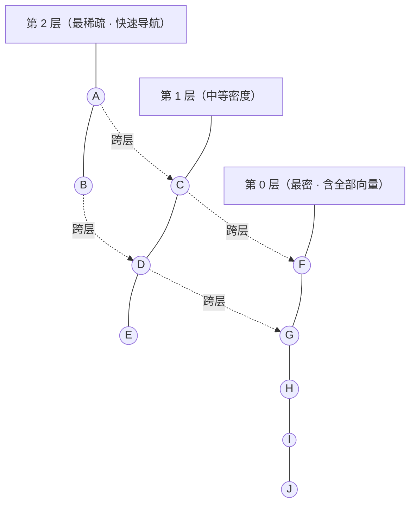
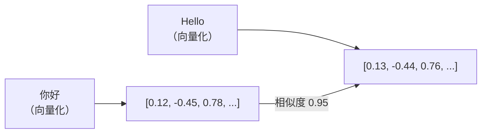
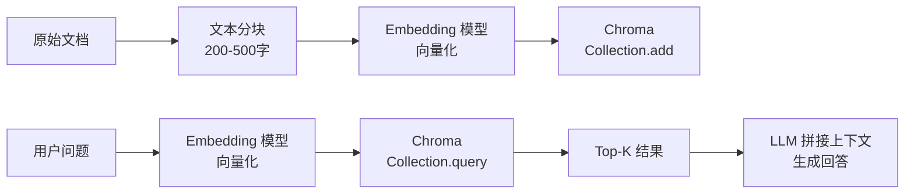

---

title: "向量数据库"

created: "2026-07-13"

tags:

  - 八股文

  - ai

---

# 向量数据库

> **生活化类比**：向量数据库就像一座「按内容相似度排布」的图书馆——找书不再靠编号，而是靠「和我想看的书像不像」，馆员顺着分层索引一路小跑就能定位最近的那几本。

向量数据库是专门为存储和检索高维向量设计的数据库系统，是 RAG 和语义搜索的核心基础设施。

## 为什么需要向量数据库？

传统数据库（MySQL、PostgreSQL）擅长精确匹配和范围查询，但无法高效处理"找到最相似的向量"这种语义检索需求。

| 需求 | 传统数据库 | 向量数据库 |
| ------ | ---------- | ----------- |
| 精确匹配 | SELECT * WHERE id = ? | 不适用 |
| 范围查询 | WHERE price > 100 | 不适用 |
| 语义相似度 | LIKE '%关键词%'（低效） | ANN 近似最近邻搜索 |
| 高维向量 | 索引失效 | 专用索引（HNSW、IVF） |

## ANN 搜索算法
### 精确搜索 vs 近似搜索

| 类型 | 方法 | 时间复杂度 | 精度 |
| ------ | ------ | ----------- | ------ |
| 精确搜索 | 暴力扫描 | O(N × D) | 100% |
| 近似搜索 (ANN) | 索引加速 | O(log N) ~ O(N^0.5) | 95%+ |

### HNSW (Hierarchical Navigable Small World)

**当前最主流的 ANN 索引算法**，基于小世界图理论构建多层导航结构。

**核心思想：**

- 底层（第 0 层）包含所有向量，建立密集连接

- 上层只包含少量向量，建立稀疏连接（用于快速导航）

- 搜索时从最高层开始，逐层下降并精确定位

**关键参数：**

| 参数 | 说明 | 影响 |
| ------ | ------ | ------ |
| M | 每个节点的最大连接数 | 越大精度越高，内存越大 |
| ef_construction | 构建时的搜索范围 | 越大构建越慢但质量越好 |
| ef_search | 搜索时的候选集大小 | 越大精度越高但越慢 |

**优缺点：**

| 优点 | 缺点 |
| ------ | ------ |
| 查询速度快 | 内存占用大 |
| 召回率高 | 构建时间长 |
| 支持动态插入 | 不支持高效的删除 |

**多层小世界图结构示意**（HNSW = Hierarchical Navigable Small World，分层可导航小世界图）：



> 搜索从最高层（节点少、跳得远）进入，逐层下降、逐步聚焦，最终在第 0 层精确定位——类比「先坐高铁到城市，再换地铁到街区，最后步行到门牌」。

### IVF (Inverted File Index)

将向量空间通过聚类（K-Means）划分为若干区域，搜索时只在最近的几个区域内查找。

**关键参数：**

| 参数 | 说明 |
| ------ | ------ |
| nlist | 聚类中心数量 |
| nprobe | 搜索时访问的聚类中心数量 |

```text

搜索流程：

1. 计算 query 与所有聚类中心的距离

2. 选择最近的 nprobe 个聚类中心

3. 只在这些聚类内部进行暴力搜索

```

### PQ (Product Quantization)

将高维向量切分为多个子空间，每个子空间独立量化为码本中的最近中心点，大幅压缩存储。

| 算法 | 内存占用 | 查询速度 | 精度 | 适用场景 |
| ------ | --------- | --------- | ------ | --------- |
| HNSW | 高 | 很快 | 很高 | 追求性能 |
| IVF | 中 | 快 | 高 | 大规模数据 |
| IVF + PQ | 低 | 快 | 中高 | 内存受限 |
| Flat (暴力) | 最高 | 慢 | 100% | 小数据集 |

## 主流向量数据库对比

| 特性 | Milvus | Chroma | Pinecone | Weaviate | Qdrant | pgvector |
| ------ | -------- | -------- | ---------- | ---------- | -------- | ---------- |
| 类型 | 专用数据库 | 嵌入式库 | 云服务 | 专用数据库 | 专用数据库 | PG 扩展 |
| 开源 | 是 | 是 | 否 | 是 | 是 | 是 |
| 部署 | 自部署/云 | 嵌入式 | 仅云 | 自部署/云 | 自部署/云 | PG 插件 |
| 水平扩展 | 支持 | 不支持 | 自动 | 支持 | 支持 | 不支持 |
| 混合检索 | 支持 | 有限 | 支持 | 支持 | 支持 | 支持 |
| 标量过滤 | 支持 | 支持 | 支持 | 支持 | 支持 | 支持 |
| 多租户 | 支持 | 有限 | 支持 | 支持 | 支持 | 支持 |
| 适用规模 | 大规模 | 小规模 | 中大规模 | 中大规模 | 中大规模 | 小规模 |

### 选型建议

| 场景 | 推荐方案 | 理由 |
| ------ | --------- | ------ |
| 快速原型 | Chroma | 嵌入式，零配置 |
| 小规模生产 | pgvector | 已有 PG，无需引入新组件 |
| 大规模生产 | Milvus / Qdrant | 高性能，水平扩展 |
| 全托管服务 | Pinecone | 免运维，开箱即用 |
| 多模态检索 | Weaviate | 原生支持多种模态 |

## 关键概念
### HNSW vs IVF 的选择

| 维度 | HNSW | IVF |
| ------ | ------ | ----- |
| 查询延迟 | 亚毫秒 | 毫秒级 |
| 内存效率 | 低（存图结构） | 高（可配合 PQ 压缩） |
| 构建速度 | 慢 | 快 |
| 动态插入 | 支持 | 需要重建索引 |
| 数据规模 | 中小规模（<1亿） | 大规模（>1亿） |

### 距离度量选择

| 度量 | 公式 | 适用场景 |
| ------ | ------ | --------- |
| Cosine | cos(A,B) | 文本检索（最常用） |
| L2 (Euclidean) | √Σ(a-b)² | 图像特征 |
| Inner Product | Σ(a×b) | 已归一化的向量 |
| Manhattan | Σ|a-b| | 稀疏向量 |

### 索引 vs 数据一致性

| 模式 | 说明 | 适用场景 |
| ------ | ------ | --------- |
| 即时索引 | 写入后立即可检索 | 小数据量 |
| 异步索引 | 写入后延迟索引 | 大批量导入 |
| 批量索引 | 导入完成后一次性建索引 | 初始建库 |

---

---

---

## 一句话理解

> Chroma 就是**向量界的 SQLite**——开箱即用、零配置、轻量级，但能干专业向量数据库 90% 的活。

类比：MySQL 存的是表格（行+列），Chroma 存的是向量（数字列表）。你问"跟这个意思相近的文档有哪些？"，Chroma 翻个底朝天给你找出来。



你和 Chroma 的对话只有四句话：`create_collection` → `add` → `query` → `get`，其他都是这四句的变种。

---

## 一、安装
### 1.1 pip 安装（最常用）

```bash

pip install chromadb              # 完整安装，含默认 Embedding 模型

pip install chromadb --no-deps    # 最小安装，生产用（自己管理依赖）

pip install chromadb==1.5.9       # 指定版本，防升级踩坑

```

> [!warning] 版本锁死警告

> Chroma **数据库迁移不可逆**——升级版本后无法降级。生产环境必须固定版本号。

### 1.2 Docker 部署（多进程/生产用）

```bash

docker pull chromadb/chroma:1.5.3

docker run -p 8000:8000 chromadb/chroma:1.5.3

```

### 1.3 可选依赖

Chroma 默认用 `all-MiniLM-L6-v2`（384 维）做自动向量化，需要 Sentence-Transformers：

```bash

pip install sentence-transformers

```

> 类比：Chroma 是个"快递站"——你扔进去包裹（文本），它自动贴标签（向量化），塞进货架（索引）。Sentence-Transformers 就是那个贴标签的机器。

---

## 二、三种客户端模式

Chroma 提供三个"住法"：

| 模式 | 类 | 数据住哪 | 适合场景 |
|------|---|---------|---------|
| 内存模式 | `chromadb.Client()` | 进程内存，退出没 | 快速试手 / 单元测试 |
| 持久化模式 | `chromadb.PersistentClient(path="./db")` | 磁盘 SQLite，重启还在 | 个人项目 / 生产 |
| 远程模式 | `chromadb.HttpClient(host="...", port=8000)` | 远端 Chroma 服务器 | 分布式 / 多应用共享 |

> 类比：内存模式=**住酒店**（退房就清）、持久化=**买房**（东西一直在）、远程=**租仓库**（东西放别处，远程取）。

```python

import chromadb

# 生产推荐：持久化

client = chromadb.PersistentClient(

    path="./chroma_db",

    settings=chromadb.Settings(

        anonymized_telemetry=False,

        allow_reset=True

    )

)

```

---

## 三、Collection——Chroma 的"表"

Collection 就是 SQL 里的"表"——所有操作都在 Collection 上做。

```python

# 创建（已存在会报错）

collection = client.create_collection(name="my_knowledge_base")

# 幂等创建（推荐）

collection = client.get_or_create_collection(

    name="my_knowledge_base",

    metadata={"description": "我的知识库", "dim": 384}

)

```

**Collection 内部长这样：**

| 字段 | 类型 | 说明 |
|------|------|------|
| `id` | str | 唯一标识，你给或 Chroma 自动生成 |
| `embedding` | float[] | 向量（默认 384 维） |
| `document` | str | 原始文本 |
| `metadata` | dict | 元数据标签（source/type/date 等），用来过滤 |

---

## 四、入库（写入数据）
### 4.1 基础入库

```python

# 单条（自动生成 ID）

collection.add(

    documents=["Chroma 是开源轻量级向量数据库"]

)

# 批量（推荐！性能差 15 倍）

collection.add(

    documents=[

        "RAG 解决大模型幻觉问题",

        "向量数据库是 RAG 核心组件",

        "Chroma 零配置开箱即用"

    ],

    metadatas=[

        {"source": "博客", "type": "RAG"},

        {"source": "博客", "type": "向量数据库"},

        {"source": "官方", "type": "产品"}

    ],

    ids=["doc_001", "doc_002", "doc_003"]

)

```

> [!tip] 批量>单条

> 逐条 add 约 1000 条/秒，批量 ≥ 100 条约 15000 条/秒——**差 15 倍**。这是被问得最多的性能考点。

### 4.2 预生成向量入库

你已经有向量了（比如用 OpenAI 的 `text-embedding-3-small` 算好了 1536 维向量），可以直接塞：

```python

collection.add(

    ids=["vec_001", "vec_002"],

    embeddings=[[0.82, -0.35, ...], [0.67, 0.12, ...]],

    documents=["文档1", "文档2"],

    metadatas=[{"source": "custom"}, {"source": "custom"}]

)

```

### 4.3 更新与删除

```python

# upsert——有就覆盖，没有就新增

collection.upsert(ids=["doc_001"], documents=["新内容"], metadatas=[{"source": "v2"}])

# update——只更新指定字段

collection.update(ids=["doc_001"], documents=["新内容"], metadatas=[{"source": "v3"}])

# 按 ID 删除

collection.delete(ids=["doc_001"])

# 按条件删除

collection.delete(where={"source": "custom"})

```

> `add` vs `upsert`：add = INSERT（重复 ID 报错），upsert = REPLACE（重复 ID 覆盖）。常见陷阱。

### 4.4 入库最佳实践速查

| 实践 | 说明 |
|------|------|
| 批量 ≥ 100 条 | 单次塞越多越快，循环 add 是反模式 |
| 固定版本号 | `pip install chromadb==1.5.9`，升了降不了 |
| 分块 200-500 字 | 保留语义完整性，技术文档可到 3000 |
| 元数据精简 | 只留 source/type/date 必要字段 |
| 持久化 | 生产用 PersistentClient，数据落 SQLite |

---

## 五、自定义嵌入函数

Chroma 默认用 `all-MiniLM-L6-v2`（384 维），但你也可以换别的"贴标签机器"：

```python

from chromadb.utils import embedding_functions

# 本地免费方案（Sentence-Transformers）

ef = embedding_functions.SentenceTransformerEmbeddingFunction(

    model_name="BAAI/bge-small-zh-v1.5"  # 中文优化

)

# 云端方案（OpenAI）

ef_openai = embedding_functions.OpenAIEmbeddingFunction(

    api_key="sk-...",

    model_name="text-embedding-3-small"  # 1536 维

)

collection = client.get_or_create_collection(

    "my_db", embedding_function=ef_openai

)

```

> [!warning] 一山不容二虎

> 同一个 Collection **必须一直用同一个嵌入模型**。混用 = 用尺子量重量，检索全乱套。

**嵌入函数选型对比：**

| 模型 | 维度 | 语言 | 费用 | 适合场景 |
|------|------|------|------|---------|
| all-MiniLM-L6-v2 | 384 | 英文为主 | 免费 | 快速原型 |
| BAAI/bge-small-zh | 512 | 中文优秀 | 免费 | 中文 RAG |
| text-embedding-3-small | 1536 | 多语言 | 💰 | 精度优先 |
| text-embedding-3-large | 3072 | 多语言 | 💰💰 | 最高精度 |

---

## 六、检索
### 6.1 语义搜索（核心）

```python

results = collection.query(

    query_texts=["Chroma 有哪些存储模式？"],

    n_results=5,

    include=["documents", "metadatas", "distances"]

)

for doc, meta, dist in zip(

    results["documents"][0],

    results["metadatas"][0],

    results["distances"][0]

):

    print(f"[距离={dist:.4f}] {doc}")

```

`distances` 越小表示越相似（余弦距离 = 1 - 余弦相似度）。

### 6.2 元数据过滤——先筛再搜

先限范围、再搜语义，精度翻倍：

```python

results = collection.query(

    query_texts=["向量数据库性能"],

    n_results=5,

    where={

        "$and": [

            {"type": "性能优化"},

            {"source": {"$in": ["博客", "官方"]}},

            {"date": {"$gte": "2026-01-01"}}

        ]

    }

)

```

**支持的操作符：**

| 操作符 | 含义 | 示例 |
|--------|------|------|
| `$eq` / `$ne` | 等于/不等于 | `{"type": {"$ne": "广告"}}` |
| `$gt` / `$gte` / `$lt` / `$lte` | 比较 | `{"date": {"$gte": "2026-01-01"}}` |
| `$in` / `$nin` | 在/不在列表 | `{"source": {"$in": ["官方","博客"]}}` |
| `$and` / `$or` / `$not` | 逻辑组合 | 见上例 |

### 6.3 全文过滤（关键词匹配）

```python

results = collection.query(

    query_texts=["AI代理"],

    where_document={"$contains": "Anthropic"}

)

```

> `where` 是**元数据过滤**（结构化字段），`where_document` 是**全文关键词匹配**（文档正文）。两者可以组合用。

### 6.4 按 ID 精确获取

```python

data = collection.get(

    ids=["doc_001", "doc_002"],

    include=["documents", "metadatas", "embeddings"]

)

```

### 6.5 集合管理

```python

count = collection.count()             # 总数

sample = collection.peek(limit=3)      # 预览前3条

collections = client.list_collections() # 列出所有集合

```

---

## 七、HNSW 索引参数调优

Chroma 底层默认用 HNSW（分层可导航小世界图）做索引。如果你嫌默认精度不够，可以自己调：

```python

collection = client.get_or_create_collection(

    name="optimized_db",

    metadata={

        "hnsw:space": "cosine",           # cosine / ip / l2

        "hnsw:ef_construction": 200,       # 建索引精度（默认 100）

        "hnsw:M": 16                        # 每层连接数（默认 16）

    }

)

```

| 参数 | 建议值 | 作用 | 代价 |
|------|--------|------|------|
| `ef_construction` | 100-300 | 索引建得越精细，检索越准 | 建索引变慢 |
| `M` | 8-32 | 每层连接越多，图越稠密 | 内存变大 |
| `hnsw:space` | cosine | 文本类似度首选余弦 | — |

类比：HNSW 就像一个**社交网络**——`M` 是你加了多少好友（好友越多找人越容易），`ef_construction` 是你建好友圈时花了多大力气去认识对的人。

**生产环境实测：** 100 万向量、QPS 2000+、90% 查询 < 50ms、Top-5 召回率 92%。

---

## 八、常见考点速查

| #   | 考点                 | 一句话答案                                                      |
| --- | ------------------ | ---------------------------------------------------------- |
| 1   | Chroma 是什么？        | 开源 AI 原生向量数据库，RAG 场景首选，零配置开箱即用                             |
| 2   | 三种客户端区别？           | Client（内存，测试）/ PersistentClient（磁盘，生产）/ HttpClient（远程，分布式） |
| 3   | Collection 是什么？    | 向量存储的逻辑单元，等价于 SQL 表，隔离不同业务数据                               |
| 4   | 默认嵌入模型？            | `all-MiniLM-L6-v2`（384 维），Sentence-Transformers            |
| 5   | 支持哪些距离度量？          | cosine（默认）、l2（欧氏距离）、ip（点积）                                 |
| 6   | HNSW 是什么？调哪些？      | 分层小世界图；调 `ef_construction` 和 `M` 平衡精度与速度                   |
| 7   | 元数据过滤操作符？          | `$eq/$ne/$gt/$gte/$lt/$lte/$in/$nin/$and/$or/$not`         |
| 8   | add vs upsert 区别？  | add = INSERT（重复报错），upsert = REPLACE（自动覆盖）                  |
| 9   | 为什么批量插入快？          | 批量 ≈ 15000 条/秒 vs 单条 ≈ 1000 条/秒，差 15 倍                     |
| 10  | 分块策略建议？            | 200-500 字保语义，技术文档可到 3000                                   |
| 11  | Chroma 和 FAISS 区别？ | Chroma = 数据库（持久化+元数据过滤+客户端），FAISS = 索引库（纯向量搜索，无存储层）        |
| 12  | 嵌入函数混用行吗？          | ❌ 同一个 Collection 必须用同一个模型                                  |

---

## 九、RAG 链路中的 Chroma



- Embedding 模型详解 → [[15-Embedding向量化]]

- RAG 全链路实战 → [[13-RAG检索增强生成]]

- Agent 架构 → [[23-Agent架构与核心组件]]

---

##

> ▶ 对应实操：[[16-ToolDescription设计铁律|16-Tool Description设计铁律]]

> ▶ 对应实操：[[05-Chroma向量数据库安装入库检索|05-Chroma向量数据库安装入库检索]]

相关链接

- 目录：[[00-AI]]

- 上一篇：[[15-Embedding向量化]]

- 下一篇：[[13-RAG检索增强生成]]

- Embedding 基础 → [[15-Embedding向量化]]

- RAG 全链路 → [[13-RAG检索增强生成]]

- Agent 架构 → [[23-Agent架构与核心组件]]

---

→ [[八股文学习路线图#Embedding 与语义搜索]]

## 速记卡（面试闪卡）

**Q1：一句话讲清「向量数据库」到底是什么？**

A：向量数据库是专为存储检索高维向量设计的库，靠相似度而非精确匹配做语义搜索，是 RAG 核心。

**Q2：像什么生活场景 —— 怎么理解？**

A：像一座「按内容相似度排布」的图书馆——找书不靠编号，而靠「和我想看的书像不像」，馆员顺着分层索引小跑定位最近的几本。

**Q3：怎么快速搜到 —— 怎么理解？**

A：像先坐高铁到城市、再换地铁到街区、最后步行到门牌。主流 ANN 索引 HNSW（Hierarchical Navigable Small World，分层可导航小世界图）靠多层图逐层下降精确定位。

**Q4：主流方案怎么挑 —— 怎么理解？**

A：像买车看需求：Chroma 是零配置嵌入式「SQLite 级」首选原型；Milvus / Qdrant 扛大规模生产；Pinecone 免运维全托管；pgvector 复用已有 Postgres。

**Q5：距离怎么量 —— 怎么理解？**

A：像量两人身高差有不同尺子。Cosine（余弦，文本最常用）、L2（欧氏，图像特征）、Inner Product（内积，已归一化向量）、Manhattan（曼哈顿，稀疏向量）。

**Q6：核心速记主线有哪些？**

- 语义检索靠相似度，非精确匹配

- HNSW 多层图分层导航，PQ/IVF 省内存

- Chroma 零配置、Milvus 扛规模、Pinecone 托管

- 距离度量：Cosine / L2 / IP / Manhattan

**口诀**

A：向量图书馆，相似不靠编号牌

分层小世界图，高铁地铁步行来

Chroma 轻量 Milvus 扛，Pinecone 托管爽

余弦欧氏内积曼，四把尺子量近远

## 相关链接

- [[八股文学习路线图]]

- [[00-全局导航|全局导航]]

---

## 快速问答

| 问题 | 参考答案 |
| ------ | --------- |
| HNSW 的核心原理是什么？ | 基于小世界图理论，构建多层导航结构。高层稀疏用于快速定位，底层密集用于精确搜索。搜索时从高层逐层下降 |
| 为什么不用暴力搜索？ | 暴力搜索时间复杂度 O(N×D)，数据量大时不可接受。HNSW 可以降到 O(log N)，且精度损失很小（>95%） |
| IVF 和 HNSW 的区别？ | IVF 通过聚类划分空间，搜索时只在最近几个聚类内查；HNSW 通过图结构导航。IVF 内存更友好，HNSW 查询更快 |
| Chroma 和 Milvus 怎么选？ | Chroma 适合原型和小规模应用（嵌入式，零配置）；Milvus 适合大规模生产环境（支持水平扩展、高可用） |
| 向量数据库如何做标量过滤？ | 两种策略：① 后过滤（先 ANN 检索再过滤）② 预过滤（将标量条件纳入索引）。Milvus 和 Qdrant 支持标量索引加速过滤 |
| 什么是 PQ（Product Quantization）？ | 将高维向量切分为多个子空间，每个子空间独立量化为码本中心，用中心编号代替原始向量，大幅压缩存储（如 128 维→8 维） |
| 如何评估向量数据库性能？ | 核心指标：① QPS（每秒查询数）② Recall@K（Top-K 召回率）③ 延迟 P99 ④ 索引构建时间 ⑤ 内存占用 |
| pgvector 适合生产环境吗？ | 小规模数据（<100万向量）可以，利用已有 PG 架构。大规模场景建议专用向量数据库 |

