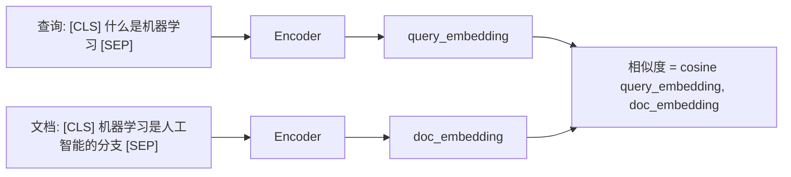
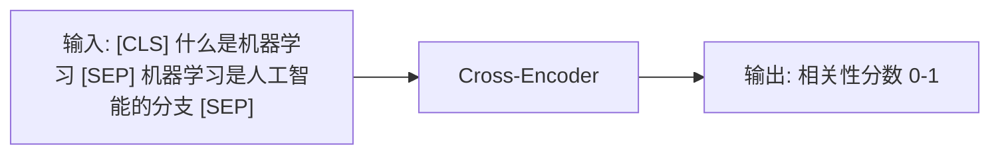
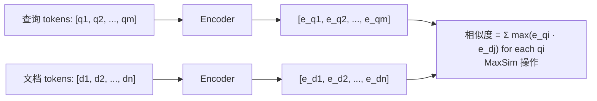
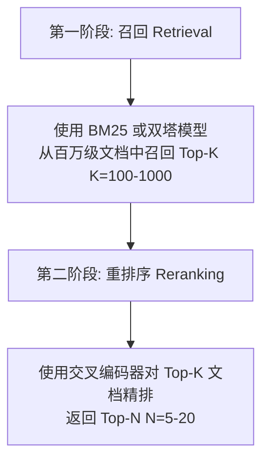
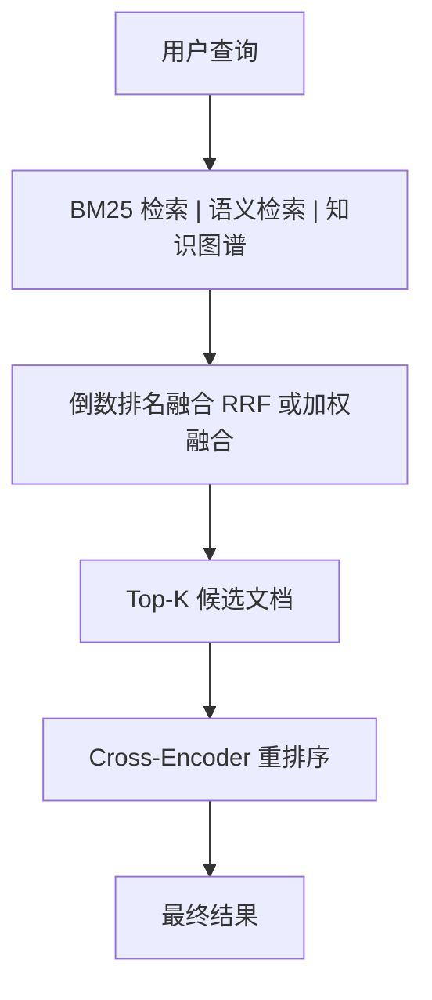
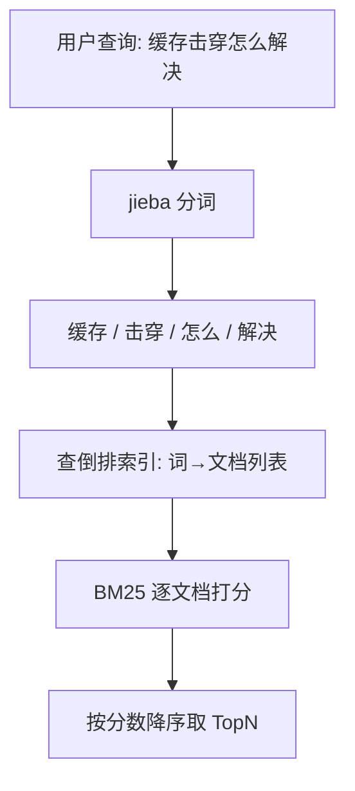
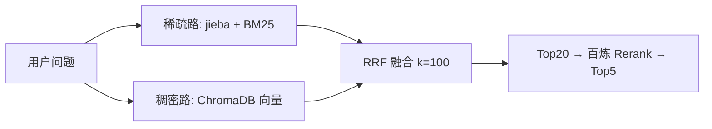

---

title: "语义搜索与混合检索"

created: "2026-07-13"

tags:

  - 八股文

  - ai

---

# 语义搜索与混合检索

> **生活化类比**：语义搜索像一个「懂你意思的同事」——你说「怎么让猫不挠沙发」，它能理解成「宠物行为矫正」，不必你打出一模一样的词；关键词搜索（BM25）则像「照字面查字典」，差一个字就查不到。混合检索 = 俩人一起查，互补长短。

## 核心概念

**语义搜索（Semantic Search）** 基于查询和文档的语义相似性进行检索，理解用户的意图而非仅仅匹配关键词。

**混合检索（Hybrid Search）** 结合关键词搜索和语义搜索的优势，通过融合策略提升检索质量。

## 检索范式对比

| 维度 | 关键词搜索 | 语义搜索 |
| ------ | ----------- | --------- |
| 匹配方式 | 精确词匹配 | 语义相似度 |
| 代表算法 | BM25, TF-IDF | 双塔模型, ColBERT |
| 优势 | 精确匹配、可解释 | 语义理解、同义词匹配 |
| 劣势 | 无法处理同义词 | 可能丢失精确匹配 |
| 计算成本 | 低 | 高（需要 embedding） |
| 适用场景 | 专业术语、精确查询 | 开放域问答、意图理解 |

## BM25 算法详解
### 核心思想

BM25（Best Matching 25）是 TF-IDF 的改进版本，考虑了词频饱和和文档长度归一化。

### 公式

$$BM25(q, d) = \sum_{i=1}^{n} IDF(q_i) \cdot \frac{f(q_i, d) \cdot (k_1 + 1)}{f(q_i, d) + k_1 \cdot \left(1 - b + b \cdot \frac{|d|}{avgdl}\right)}$$

其中：

- $IDF(q_i)$ = 逆文档频率

- $f(q_i, d)$ = 词在文档中的频率

- $k_1$ = 词频饱和参数（通常 1.2-2.0）

- $b$ = 文档长度归一化参数（通常 0.75）

- $|d|$ = 文档长度

- $avgdl$ = 平均文档长度

### 关键特性

| 特性 | 描述 |
| ------ | ------ |
| 词频饱和 | 随着词频增加，贡献逐渐饱和（不像 TF-IDF 线性增长） |
| 长文档惩罚 | 长文档中的词频会被归一化 |
| IDF 加权 | 稀有词的权重更高 |
| 可解释性 | 每个词的贡献可以单独计算 |

## Embedding-based 检索
### 双塔模型（Bi-Encoder）



**优势**：

- 文档 embedding 可以离线计算并缓存

- 查询时只需计算查询 embedding

- 适合大规模检索

**劣势**：

- 查询和文档独立编码，无法捕获细粒度交互

### 交叉编码器（Cross-Encoder）



**优势**：

- 查询和文档直接交互，捕获细粒度语义

- 检索精度通常高于双塔模型

**劣势**：

- 需要对每个（查询，文档）对进行推理

- 计算成本高，不适合大规模检索

### ColBERT（Contextualized Late Interaction）

**核心思想**：在保持双塔效率的同时，引入细粒度的 token 级交互。



**优势**：

- 文档 embedding 可以离线计算

- token 级交互捕获更细粒度的语义

- 检索效率接近双塔，精度接近交叉编码器

## 重排序（Reranking）
### 流程



### Cross-Encoder Reranking

| 指标 | 召回阶段 | 重排序后 |
| ------ | --------- | --------- |
| 召回率 | 70-85% | 85-95% |
| 精度 | 10-30% | 50-80% |
| 计算成本 | 低 | 高 |

## 混合检索架构
### 基本流程



### 倒数排名融合（Reciprocal Rank Fusion, RRF）

$$RRF(d) = \sum_{r \in R} \frac{1}{k + r(d)}$$

其中 $r(d)$ 是文档 $d$ 在排名列表 $r$ 中的位置，$k$ 是平滑参数（通常为 60）。

**示例**：

| 文档 | BM25 排名 | 语义排名 | RRF 得分 |
| ------ | ---------- | --------- | --------- |
| Doc A | 1 | 3 | 1/(60+1) + 1/(60+3) = 0.032 |
| Doc B | 5 | 1 | 1/(60+5) + 1/(60+1) = 0.032 |
| Doc C | 2 | 2 | 1/(60+2) + 1/(60+2) = 0.032 |

### 加权融合

$$Score(d) = \alpha \cdot Score_{BM25}(d) + (1-\alpha) \cdot Score_{semantic}(d)$$

$\alpha$ 的选择取决于查询类型：

- 精确查询（如专有名词）：$\alpha$ 较大

- 开放域查询（如"如何学习"）：$\alpha$ 较小

## 混合检索的优势

| 场景 | 仅 BM25 | 仅语义 | 混合检索 |
| ------ | -------- | -------- | --------- |
| 精确术语查询 | ★★★ | ★ | ★★★ |
| 同义词查询 | ★ | ★★★ | ★★★ |
| 模糊意图查询 | ★ | ★★★ | ★★★ |
| 跨语言查询 | ✗ | ★★★ | ★★★ |
| 专业领域 | ★★★ | ★ | ★★★ |

## 实现考量
### 索引构建

| 组件 | 工具 | 说明 |
| ------ | ------ | ------ |
| 向量数据库 | Milvus, Pinecone, Weaviate | 存储 embedding 向量 |
| 全文检索引擎 | Elasticsearch, Meilisearch | BM25 检索 |
| 元数据存储 | PostgreSQL, Redis | 过滤和附加信息 |

### 查询延迟优化

| 技术 | 原理 | 效果 |
| ------ | ------ | ------ |
| ANN 索引 | HNSW（Hierarchical Navigable Small World，分层可导航小世界图）, IVF, PQ | 向量检索从 O(n) 降低到 O(log n) |
| 缓存 | LRU 缓存常见查询 | 减少重复计算 |
| 异步并行 | BM25 和语义检索并行执行 | 减少总延迟 |
| 量化 | 降低 embedding 维度 | 减少内存和计算 |

---

## 17-语义搜索与混合检索

> **适用场景**：RAG 系统检索阶段 | **你的角色**：AI Agent 应用开发工程师（求职核心考点）

>

>

>

> **一句话总结**：向量检索找"意思相近"，BM25 找"字面对得上"，RRF 把两路结果拼成一份靠谱清单——三剑合璧，召回率和精准率同时起飞。

>

---

## 一、为什么一种检索不够？——"盲人摸象" analogy

想象你和两个朋友一起摸一头大象：

- **BM25（关键词检索）** 像摸到象鼻的朋友："这有个长长的管子，表面粗糙有纹路" → 精确描述局部特征

- **向量检索（语义检索）** 像摸到象腿的朋友："这是个粗壮的柱子，支撑着庞大身躯" → 理解整体语义

如果只信一个人的描述，你对大象的认知是残缺的。混合检索就是让两个人同时描述，再综合成完整画面。

**两类查询的"翻车"现场：**

| 查询类型 | 只用 BM25 | 只用向量检索 | 结果 |
| --- | --- | --- | --- |
| "报销制度"（标题原词） | ✅ 标题精确命中 | ❌ 语义漂移（可能匹配"费用审批""差旅标准"） | BM25 稳 |
| "如何推销保险产品"（口语改写） | ❌ "推销"和"销售"没对上 | ✅ 语义相近匹配到"保险销售技巧" | 向量稳 |
| "404 状态码"（专业术语） | ✅ 精确命中错误码 | ❌ 可能匹配"HTTP 错误""页面不存在"等泛泛内容 | BM25 稳 |
| "现金价值"（保险术语） | ❌ 通用语境下被日常财务内容淹没 | ⚠️ 可能正确，也可能漂移 | 都不稳，需要混合 |

> 💡 **核心金句**："BM25 和向量检索解决的是不同类型的'漏找'问题。BM25 对标题、编号和领域术语这类原词明确的内容更稳定，向量检索更适合用户换了一种说法的情况。"

>

---

## 二、向量检索（Dense Retrieval）——"找意思相近的"
### 2.1 核心原理

把查询和文档都转换成**高维向量**（Embedding），在向量空间里计算相似度。语义相近的内容，向量距离就近。

```text

用户问："如何推销保险产品？"

↓ Embedding 模型编码

Query Vector: [0.12, -0.34, 0.89, ...]  (768/1024/1536 维)

文档库：

  Doc1: "保险销售技巧" → Vector1: [0.15, -0.30, 0.85, ...] → cos_sim = 0.92 ✅

  Doc2: "保险产品介绍" → Vector2: [0.08, -0.20, 0.60, ...] → cos_sim = 0.75

  Doc3: "保险理赔流程" → Vector3: [-0.10, 0.40, 0.20, ...] → cos_sim = 0.30

```

### 2.2 向量检索的优缺点

| 维度 | 评价 |
| --- | --- |
| **优势** | 理解语义和同义词；不受关键词变形影响（"推销"≈"销售"）；能处理口语化查询 |
| **劣势** | 对专业术语/错误码/编号等精确匹配弱；短查询容易语义漂移；依赖 Embedding 模型质量 |
| **适用** | 概念搜索、语义相似性查询、用户换说法的情况 |
| **不适用** | 精确术语匹配、短标题查询、需要原词命中的场景 |

### 2.3 常用 Embedding 模型

| 模型 | 维度 | 特点 | 适用场景 |
| --- | --- | --- | --- |
| text-embedding-3-small | 1536 | OpenAI 出品，性价比高 | 通用场景 |
| text-embedding-3-large | 3072 | 精度更高，成本也高 | 高精度需求 |
| bge-m3 | 1024 | 北京智源，开源可本地部署 | 中文场景优选 |
| Jina Embeddings | 768/1024 | 长上下文支持好 | 长文档检索 |
| all-MiniLM-L6-v2 | 384 | 轻量快速，本地运行 | 资源受限场景 |

---

## 三、BM25 检索（Sparse Retrieval）——"找字面对得上的"
### 3.1 什么是 BM25？

BM25（Best Match 25）是信息检索领域最经典的关键词检索算法，基于**概率模型**，计算查询关键词与文档的相关性分数。

> 💡 **通俗理解**：BM25 就像一个"关键词匹配专家"，它判断文档中包含查询关键词的程度，并给出一个相关性分数。

>

### 3.2 BM25 的核心思想（不用背公式，理解即可）

BM25 公式虽然看起来复杂，但核心就三个要素：

```text

相关性分数 = TF 因子 × IDF 因子 × 长度归一化因子

```

| 因子 | 通俗解释 | 作用 |
| --- | --- | --- |
| **TF（词频）** | 关键词在文档中出现次数越多，越相关 | 但会"饱和"——出现 10 次和 100 次差别不大 |
| **IDF（逆文档频率）** | 关键词在整个文档集合中越稀有，区分度越高 | "发票"比"的"更有区分价值 |
| **长度归一化** | 短文档中出现关键词比长文档中更重要 | 避免 1000 页的书因为词多而获得不公平优势 |

**与 TF-IDF 的区别：**

| 对比维度 | TF-IDF | BM25 |
| --- | --- | --- |
| 词频处理 | 线性增长（词越多分越高） | 饱和函数（超过一定次数不再大幅增长） |
| 文档长度 | 简单归一化 | 更精细的概率模型归一化 |
| 效果 | 基础版本 | 工业标准，效果更稳定 |

### 3.3 BM25 的优缺点

| 维度 | 评价 |
| --- | --- |
| **优势** | 精确匹配关键词；对标题/编号/术语非常稳定；计算速度快；可解释性强 |
| **劣势** | 无法理解语义和同义词；用户换说法就找不到；对长尾查询效果差 |
| **适用** | 精确关键词搜索、文档检索、标题匹配、错误码查询 |
| **不适用** | 语义搜索、同义词查询、口语化表达 |

### 3.4 BM25 在 Python 中的实现

```python

from rank_bm25 import BM25Okapi

import jieba

# 1. 准备文档集

documents = [

    "保险销售技巧与实战",

    "报销制度与费用审批流程",

    "HTTP 404 错误码排查指南",

    "现金价值的计算方法"

]

# 2. 分词（中文用 jieba，英文直接 split）

tokenized_docs = [list(jieba.cut(doc)) for doc in documents]

# 3. 构建 BM25 索引

bm25 = BM25Okapi(tokenized_docs)

# 4. 查询

query = "如何推销保险"

query_tokens = list(jieba.cut(query))

scores = bm25.get_scores(query_tokens)

# 5. 获取 Top-K

import numpy as np

top_indices = np.argsort(scores)[::-1][:3]

for idx in top_indices:

    print(f"Doc {idx}: {documents[idx]} (score: {scores[idx]:.4f})")

```

---

## 四、混合检索架构——"双塔并行，合纵连横"
### 4.1 五步流程

```text

┌─────────────────────────────────────────────────────────────────┐

│                      混合检索五步流程                            │

├─────────────────────────────────────────────────────────────────┤

│  Step 1: 接收用户问题                                            │

│       ↓                                                         │

│  Step 2: 并行检索 ──┬──→ BM25 路线（关键词匹配）                 │

│                    └──→ 向量路线（语义相似度）                    │

│       ↓                                                         │

│  Step 3: 限定资料范围（知识库/文档集过滤）                        │

│       ↓                                                         │

│  Step 4: 融合（RRF / 加权）→ 统一候选清单                        │

│       ↓                                                         │

│  Step 5: 重排序（ReRank）→ 截取 Top-K 交给 LLM                   │

└─────────────────────────────────────────────────────────────────┘

```

### 4.2 关键设计点

**为什么初次检索要多取一些候选？**

> 因为重排只能处理已经找回的内容。如果一开始只拿最终要展示的几条，正确原文排在稍后位置，重排根本看不到它，也就没有机会把它提到前面。

>

**融合 ≠ 重排：**

| 环节 | 职责 | 解决的问题 |
| --- | --- | --- |
| **融合（Fusion）** | 把多路结果放进同一份候选清单 | "有没有把正确证据带回来" |
| **重排（ReRank）** | 重新比较用户问题和每段候选，把更相关的放到前面 | "找到后排得好不好" |

> 💡 **坑点**："重排能不能解决漏召回？" → **不能**。如果正确原文没进入候选集，重排模型再强也找不回来。

>

---

## 五、RRF 融合算法深度解析——"不看分数，只看排名"
### 5.1 为什么要用 RRF？

两路检索返回的分数不是同一种数值：

- BM25 分数：可能是 0~30 的浮点数

- 向量相似度：可能是 -1~1 的余弦相似度

它们像"百分制成绩"和"五分制评价"——直接相加没有任何意义。

**RRF 的聪明之处**：完全抛弃原始分数，只看**排名位置**。

### 5.2 RRF 核心公式

```text

RRF_score(d) = Σ 1 / (k + rank_r(d))

```

| 符号 | 含义 |
| --- | --- |
| `d` | 某个文档 |
| `rank_r(d)` | 文档 d 在第 r 个检索结果列表中的排名（从 1 开始） |
| `k` | 平滑常数（通常 = 60） |
| `Σ` | 对所有检索系统的贡献求和 |

### 5.3 RRF 计算示例

假设同一个文档在两路检索中的排名：

| 文档 | BM25 排名 | 向量排名 | RRF 计算 | 总分 |
| --- | --- | --- | --- | --- |
| DocA | 第 1 名 | 第 3 名 | 1/(60+1) + 1/(60+3) | **0.0323** |
| DocB | 第 2 名 | 第 1 名 | 1/(60+2) + 1/(60+1) | **0.0325** ✅ |
| DocC | 第 3 名 | 第 2 名 | 1/(60+3) + 1/(60+2) | **0.0321** |
| DocD | 未进入 Top | 第 4 名 | 0 + 1/(60+4) | 0.0156 |

**结果**：DocB 在两路中都靠前，RRF 分数最高，排在第一位！

### 5.4 k 值的作用——"平滑因子"

| k 值 | 效果 | 适用场景 |
| --- | --- | --- |
| k = 10 | 高排名文档优势极大，低排名几乎被忽略 | 强调头部精准度 |
| **k = 60** | **平衡头部和尾部，工业标准值** | **通用场景（推荐）** |
| k = 100 | 更保守，低排名文档也有机会 | 数据量大、强调召回 |

> 💡 **推荐回答**："k 通常设为 60，这是经过大量实验验证的经验值。k 越大越保守，低排名的文档贡献不会被过度压制；k 越小头部效应越强。"

>

### 5.5 RRF 的优缺点

| 维度 | 评价 |
| --- | --- |
| **优势** | 不依赖分数归一化（跨系统兼容性强）；简单高效；通过"多系统共识"提升稳健性；无需训练 |
| **劣势** | 忽略原始相关性分数（可能损失细粒度信号）；需要多次检索（额外延迟）；需处理文档去重 |
| **适用** | 混合检索、多查询检索、多模态检索融合 |

### 5.6 RRF Python 实现

```python

from collections import defaultdict

def reciprocal_rank_fusion(result_lists, k=60):

    """

    RRF 融合算法

    result_lists: 多个检索系统的结果列表，每个列表已按相关性排序

                  如 [bm25_results, vector_results]

    k: 平滑常数，默认 60

    """

    scores = defaultdict(float)

    for result_list in result_lists:

        for rank, doc_id in enumerate(result_list, start=1):

            # 核心公式：1 / (k + rank)

            scores[doc_id] += 1.0 / (k + rank)

    # 按 RRF 分数降序排序

    sorted_results = sorted(

        scores.items(),

        key=lambda x: x[1],

        reverse=True

    )

    return sorted_results

# 示例

bm25_results = ["doc_A", "doc_B", "doc_C", "doc_D"]

vector_results = ["doc_C", "doc_A", "doc_E", "doc_B"]

fused = reciprocal_rank_fusion([bm25_results, vector_results], k=60)

print(fused)

# 输出: [('doc_A', 0.0325), ('doc_C', 0.0325), ('doc_B', 0.0323), ...]

```

---

## 六、加权融合 vs RRF——"两种融合策略怎么选"
### 6.1 加权融合（Weighted Score Fusion）

把各路的原始分数归一化后加权求和：

```text

final_score = α × normalize(BM25_score) + β × normalize(vector_score)

```

| 维度 | 说明 |
| --- | --- |
| **优点** | 保留了原始分数的细粒度信息；可以灵活调整权重 |
| **缺点** | 需要分数归一化（Z-score / Min-Max）；权重调参困难；不同系统的分数范围差异大 |
| **适用** | 检索系统少（2~3 路）、分数分布稳定、有调参资源 |

### 6.2 RRF 融合

只看排名，不看分数：

```text

RRF_score = Σ 1 / (k + rank_i)

```

| 维度 | 说明 |
| --- | --- |
| **优点** | 无需归一化；对分数分布不敏感；实现简单；跨系统兼容性强 |
| **缺点** | 丢失原始分数信息；k 值需要一定调参 |
| **适用** | 检索系统多、分数分布差异大、追求快速落地 |

### 6.3 对比总结

| 维度 | 加权融合 | RRF |
| --- | --- | --- |
| 是否需归一化 | ✅ 需要 | ❌ 不需要 |
| 是否保留原始分数 | ✅ 保留 | ❌ 只看排名 |
| 调参复杂度 | 高（权重 + 归一化方法） | 低（只有一个 k） |
| 跨系统兼容性 | 差 | 好 |
| 工业界偏好 | 部分场景 | **主流选择** |

> 💡 **核心金句**："RRF 是工业界的主流选择，因为它简单、稳定、无需调参。加权融合在特定场景下可能更精准，但需要大量实验确定权重，维护成本高。"

>

---

## 七、工程实践——从零搭建混合检索
### 7.1 Milvus 2.5 原生混合检索（推荐方案）

Milvus 2.5 内置了 Sparse-BM25，支持原生混合检索：

```python

from pymilvus import MilvusClient, AnnSearchRequest, RRFRanker

client = MilvusClient(uri="http://localhost:19530")

# 1. 构建稠密向量检索请求

dense_request = AnnSearchRequest(

    data=[query_embedding],      # 查询向量

    anns_field="dense",          # 稠密向量字段

    param={"metric_type": "IP", "params": {"nprobe": 10}},

    limit=50

)

# 2. 构建 BM25 稀疏向量检索请求

bm25_request = AnnSearchRequest(

    data=[query_text],           # 原始查询文本

    anns_field="sparse_bm25",    # BM25 稀疏向量字段

    param={"metric_type": "BM25"},

    limit=50

)

# 3. 使用 RRF 融合

ranker = RRFRanker(k=100)

# 4. 执行混合检索

results = client.hybrid_search(

    collection_name="my_collection",

    reqs=[dense_request, bm25_request],

    ranker=ranker,

    limit=10,

    output_fields=["text"]

)

```

### 7.2 Elasticsearch 混合检索

ES 8.8+ 支持 RRF 原生融合：

```python

# ES 查询示例

POST /my_index/_search

{

  "retriever": {

    "rrf": {

      "retrievers": [

        {

          "standard": {

            "query": {

              "match": {

                "content": "报销制度"

              }

            }

          }

        },

        {

          "knn": {

            "field": "embedding",

            "query_vector": [0.12, -0.34, ...],

            "k": 50

          }

        }

      ],

      "rank_window_size": 50,

      "rank_constant": 60

    }

  }

}

```

### 7.3 纯 Python 实现（教学版）

```python

import numpy as np

from sklearn.metrics.pairwise import cosine_similarity

from rank_bm25 import BM25Okapi

import jieba

class HybridRetriever:

    def __init__(self, documents, embeddings):

        """

        documents: 原始文档列表

        embeddings: 对应的向量列表 (numpy array)

        """

        self.documents = documents

        self.embeddings = np.array(embeddings)

        # 构建 BM25 索引

        self.tokenized_docs = [list(jieba.cut(doc)) for doc in documents]

        self.bm25 = BM25Okapi(self.tokenized_docs)

    def bm25_search(self, query, top_k=50):

        """BM25 关键词检索"""

        tokens = list(jieba.cut(query))

        scores = self.bm25.get_scores(tokens)

        top_indices = np.argsort(scores)[::-1][:top_k]

        return [(idx, scores[idx]) for idx in top_indices if scores[idx] > 0]

    def vector_search(self, query_embedding, top_k=50):

        """向量语义检索"""

        similarities = cosine_similarity(

            [query_embedding],

            self.embeddings

        )[0]

        top_indices = np.argsort(similarities)[::-1][:top_k]

        return [(idx, similarities[idx]) for idx in top_indices]

    def rrf_fusion(self, bm25_results, vector_results, k=60, final_top_k=10):

        """RRF 融合"""

        scores = {}

        # BM25 贡献

        for rank, (doc_idx, _) in enumerate(bm25_results, start=1):

            scores[doc_idx] = scores.get(doc_idx, 0) + 1.0 / (k + rank)

        # 向量贡献

        for rank, (doc_idx, _) in enumerate(vector_results, start=1):

            scores[doc_idx] = scores.get(doc_idx, 0) + 1.0 / (k + rank)

        # 排序并返回

        sorted_docs = sorted(scores.items(), key=lambda x: x[1], reverse=True)

        return sorted_docs[:final_top_k]

    def search(self, query, query_embedding, top_k=10):

        """完整混合检索流程"""

        # 1. 两路并行检索

        bm25_results = self.bm25_search(query, top_k=50)

        vector_results = self.vector_search(query_embedding, top_k=50)

        # 2. RRF 融合

        fused = self.rrf_fusion(bm25_results, vector_results, k=60, final_top_k=top_k)

        # 3. 返回结果

        return [(self.documents[idx], score) for idx, score in fused]

```

---

## 八、参数调优与工程细节
### 8.1 各路检索取多少候选？

| 参数 | 推荐值 | 理由 |
| --- | --- | --- |
| 每路 Top-K | 20~50 | 太少会漏掉正确证据，太多引入噪声 |
| RRF 最终 Top-K | 5~10 | 给 LLM 的上下文窗口有限 |
| RRF k 值 | 60 | 经验标准值，10~100 可调 |

### 8.2 文档去重

跨结果列表需对"同一文档"稳定去重，建议使用复合键：

```python

# 推荐去重键

doc_key = f"{source}:{page}:{hash(chunk_content)}"

```

### 8.3 检索阶段引入重排（ReRank）

RRF 融合后，可以用 Cross-Encoder 做精排：

```text

用户 Query → BM25 Top-50 ──┐

                            ├──→ RRF 融合 Top-20 ──→ Cross-Encoder 重排 ──→ Top-5 给 LLM

用户 Query → 向量 Top-50 ──┘

```

常用 ReRank 模型：

- BGE-Reranker / BGE-Reranker-v2

- Jina Reranker

- Cohere Rerank

---

## 九、常见问题速答
### Q1：已经有向量检索了，为什么还要保留 BM25？

**答**：两路检索解决不同类型的漏找问题。

- **BM25 擅长**：标题原词、编号、错误码、专业术语的精确匹配。用户搜"报销制度"，标题原词命中本身就是强信号。

- **向量检索擅长**：语义相近、同义词、口语改写。用户问"如何推销保险产品"，向量能匹配到"保险销售技巧"。

单独使用任何一路都会漏掉另一部分查询。混合检索让两路互补，召回更全面的候选。

### Q2：BM25 分数和向量相似度不是同一种数值，怎么合并？

**答**：这正是 RRF 的价值所在。RRF 完全抛弃原始分数，只看**排名位置**，用公式 `Score(d) = Σ 1/(k + rank_i(d))` 累加各路的排名贡献。这样无论 BM25 分数是 0~30，向量相似度是 -1~1，都不影响融合。

另一种方式是加权融合，但需要先把分数归一化到同一尺度（如 Z-score 或 Min-Max），然后加权求和。这种方式更灵活但调参复杂。

### Q3：RRF 和 ReRank 有什么区别？

**答**：

| 环节 | RRF（融合） | ReRank（重排） |
| --- | --- | --- |
| 职责 | 把多路结果放进同一份候选清单 | 重新比较用户问题和每段候选，把更相关的放到前面 |
| 输入 | 多路排名列表 | 融合后的候选文档 + 原始查询 |
| 解决的问题 | "有没有找到" | "找到后排得好不好" |
| 关键限制 | 无 | **不能解决漏召回**——正确证据不在候选集里，重排也救不了 |

### Q4：RRF 的 k 值怎么选？

**答**：

- **k = 60** 是工业界标准经验值，在"高排名优先"和"不过度压制低排名"之间平衡

- k 越大（如 100）越保守，低排名文档也有机会贡献分数

- k 越小（如 10）头部效应越强，只有前几名有显著贡献

- 一般从 60 开始，在自己的数据上做对照实验调整

### Q5：混合检索是不是一定优于单路？

**答**：不一定。它增加了候选来源，也增加了参数和排查成本。值不值得保留，要看：

1. 单路检索具体漏了什么类型的查询

2. 混合后是否补回了这些漏掉的证据

3. 系统能否接受新增的复杂度（延迟、维护成本）

验证方法：固定同一批问题和正确原文，分别测试 BM25 单路、向量单路、混合召回、混合+重排四组配置，比较 Recall@K 和 MRR。

### Q6：你的 RAG 项目中检索策略是怎么设计的？

**答（参考模板）**：

1. **双路并行检索**：BM25（关键词）+ 稠密向量（语义），每路取 Top-50

2. **范围过滤**：根据用户权限和知识库范围预过滤文档

3. **RRF 融合**：k=60，合并两路结果为统一候选清单

4. **Cross-Encoder 重排**：用 BGE-Reranker 对 Top-20 精排

5. **截取 Top-5**：作为最终上下文交给 LLM 生成

6. **评估指标**：Recall@10、MRR、Precision@5，按原词/改写/术语/版本问题分组复盘

---

## 十、总结：混合检索的"黄金 Pipeline"

```text

┌─────────────┐    ┌─────────────┐    ┌─────────────┐    ┌─────────────┐

│  用户 Query  │───→│  双路并行    │───→│  RRF 融合    │───→│  ReRank 精排 │───→ LLM

│             │    │  召回 Top-50 │    │  统一 Top-20 │    │  最终 Top-5  │

└─────────────┘    └──────┬──────┘    └─────────────┘    └─────────────┘

                          │

              ┌───────────┴───────────┐

              ↓                       ↓

        ┌─────────┐             ┌─────────┐

        │  BM25   │             │ 向量检索 │

        │ 关键词   │             │ 语义相似 │

        └─────────┘             └─────────┘

```

> 🎯 **总结**：混合检索不是堆方法，而是解决一个具体问题——精确词面和语义改写，可能分别把正确原文带进候选集。RRF 用排名而非分数做融合，简单稳定无需训练，是工业界的主流选择。最后记住：**重排只能调整已找回的内容，不能救回候选集之外的证据**——先检查"有没有找到"，再检查"排得靠不靠前"。

>

---

## 0. 先讲人话（生活化类比开篇）

想象你在一个**没有联网、没有管理员**的图书馆找书。你问管理员：「有没有讲『缓存击穿』怎么解决的书？」

- **语义检索**像什么？像一个特别聪明、但有点较真的助手：他凭「意思」帮你找，看到《如何防止热点数据失效导致数据库被冲垮》这种「意思对但字不对」的书也能拿给你——但你要找的那本标题正好是《缓存击穿解决方案大全》的，他反而可能因为「表述不一样」给漏了。

- **关键词检索像什么？像一个死脑筋但一字不差的勤务员：你把问题拆成「缓存 / 击穿 / 解决」这几个词，他拿着词去书脊上一个字一个字比对，标题里真有「缓存击穿」四个字的书，100% 跑不了**；但《热点数据失效》这种「意思对字不对」的，他翻白眼不认。

那「分词」是啥？中文没有空格，句子是一长串。上面那个勤务员要是拿到「缓存击穿怎么解决」整句话当成一个超长词去比，图书馆里根本没这本「书」叫这名，直接扑空。**分词就是先把这句话切成「缓存 / 击穿 / 怎么 / 解决」几个词**，他才能去比对。英文靠空格天然切好了，中文就得靠 `jieba` 这种分词工具。

**BM25** 又是啥？勤务员比对完，不能只说「有」或「没有」，他得**排个名次**：哪本书最该给你？BM25 就是那个「打分排序」的算法——它比早期的 TF-IDF 聪明在：一个词出现 100 次和出现 10 次，分数不会差 10 倍（词频会「饱和」）；而且短文档不会因为「词少」吃亏、长文档也不会因为「词多」占便宜。

一句话：本篇讲的就是「**中文怎么切词（jieba）+ 怎么按字面匹配打分（BM25）+ 为什么光靠它还不够（要混合）**」。

## 1. 它是什么 / 为什么需要它
### 1.1 关键词检索：专治「字面一致」的查询

**关键词检索（Keyword Search）**：把查询和文档都拆成词，然后做**字面匹配**——谁的词重合多、重合得关键，谁就相关。它擅长「精确标识符」类查询：

- 产品型号：`BGE-M3`、`CUDA_ERROR_OUT_OF_MEMORY`

- 错误码：`Error 0x80070005`

- 专业术语：`缓存击穿`、`CAS 指令`

这些词，语义向量（把文字变成一串数字那种）反而「认不准」——因为训练数据里太少，向量编不进去。但关键词检索一字不差就能命中。**所以它是语义检索必不可少的互补项**。（来源：CSDN《RAG 系统必看！混合检索、关键词、语义一次讲清》2025）

### 1.2 jieba：中文分词的「刀」

**jieba**（结巴分词，名字来自「结巴」——切词切得磕磕巴巴的玩笑）是目前中文 NLP（Natural Language Processing，自然语言处理）最常用的事实标准分词库。它把「深度学习是人工智能的核心技术」切成 `[深度学习, 是, 人工智能, 的, 核心, 技术]`。

⚠️ **关键坑**（来源：CSDN 2026 多篇一致指出）：中文用 BM25 **必须先用 jieba 分词**，否则 BM25 会把整句话当成一个超长词，永远匹配不上。而且默认分词会把「深度学习」拆成「深度 / 学习」——专业词被切碎，召回就垮了。解决办法是加载**自定义词典**：

```python

import jieba

jieba.add_word("深度学习", freq=10000)   # 让整词不被切开

jieba.load_userdict("resume_terms.txt")  # 简历领域专有词表

```

### 1.3 BM25：比 TF-IDF 更懂「分寸」的打分

**BM25 = Best Matching 25（最佳匹配 25）**，是概率检索模型下的打分算法，也是 TF-IDF（Term Frequency-Inverse Document Frequency，词频-逆文档频率）的改进版。它对每个查询词算一个分数再加总：

```text

Score(文档, 查询) = Σ   IDF(w) · [ TF(w)·(k1+1) ] / [ TF(w) + k1·(1−b+b·|D|/avgdl) ]

                      w∈查询

```

别被公式吓到，它其实就三件事（来源：CSDN《RAG 检索系统核心技术深度解析》2025）：

1. **IDF（Inverse Document Frequency，逆文档频率）**：这个词越稀有越值钱。「的」满世界都是，IDF 接近 0；「击穿」很少见，IDF 很高。

2. **词频饱和（k1，默认 1.2）**：一个词出现 100 次 ≠ 比出现 10 次重要 10 倍。BM25 用饱和曲线压住它——出现越多，边际贡献越低，避免「苹果」刷屏碾压优质文档。

3. **文档长度归一化（b，默认 0.75）**：长文档天然包含更多词、容易高分，b 把它拉回来；b=1 完全归一化，b=0 不管长度。

## 2. 原理拆解：从一句话到排行榜

关键词检索的内部流程，本质是先建一张「词 → 哪些文档有它」的表（叫**倒排索引，Inverted Index**），查询时查表、打分、排序。



**倒排索引长啥样**（来源：CSDN 同上）：文档1「猫吃鱼」→ `[猫,吃,鱼]`；文档3「狗吃骨头」→ `[狗,吃,骨头]`。建出「猫→[doc1]」「吃→[doc1,doc3]」「鱼→[doc1]」。查「猫吃鱼」时，doc1 命中 3 个词 → 最相关。就是这么朴实。

**关键词 vs 语义，一张表看清边界**（来源：CSDN《混合检索、关键词、语义一次讲清》2025）：

| 场景 | 纯语义检索 | 纯关键词(BM25) | 混合检索 |
|-|-|-|-|
| 同义词理解（提升代码质量→提高可维护性） | ✅ | ❌ | ✅ |
| 精确术语（BGE-M3 模型） | ❌ | ✅ | ✅ |
| 产品型号/错误码 | ❌ | ✅ | ✅ |
| 长尾罕见词 | ❌ | ✅ | ✅ |
| 口语化/拼写容错 | ✅ | 部分 | ✅ |

结论很明确：**只有混合检索在所有场景都能覆盖**。这也是为什么「生产级 RAG 必须用混合检索」成了共识（来源同上）。

## 3. 混合检索：两路并行 + RRF 融合

既然语义和关键词各有盲区，那就**两路都跑，再把结果合并**。合并最常用 **RRF（Reciprocal Rank Fusion，倒数排名融合）**：不看各自分数绝对值，只看「排名」——排第 1 的权重高，排第 100 的权重低。

```text

RRF_score(文档) = Σ  1 / (k + rank_i(文档))

                 i∈两路

```

k 通常取 60（Milvus 默认），**你项目里取的是 k=100**（来源：你项目 `CLAUDE.md` 调优记录 `rrf_k 60→100`）。排名越靠前，分母越小、分数越高；两路都靠前的文档会被推到最顶。



这条链路几乎就是**你简历项目 `ai-resume-analyzer` 的检索主干**：ChromaDB 稠密余弦（语义）＋ jieba/BM25 稀疏（关键词）→ RRF(k=100) 融合出 Top20 → 百炼 `qwen3-vl-rerank` 精排到 Top5。实测 composite_score 因此 +5.9%（0.5146→0.5448）。（来源：项目 `CLAUDE.md` 六阶段调优）

## 4. 常见误区

- ❌ **「中文 BM25 直接丢原文就行」** → 错。不先 jieba 分词，整句当一个词，零命中。必须 `jieba.cut` 先切。

- ❌ **「BM25 词频越高分越高、线性涨」** → 错。BM25 有词频饱和（k1），刷词不会无限加分。

- ❌ **「语义检索更强，关键词检索过时了」** → 错。错误码、型号、专业术语恰恰是语义的盲区，生产环境几乎都混合。

- ❌ **「RRF 的 k 随便设」** → k 控制排名衰减速度，你项目从 60 调到 100 是实打实的实验结论，不是拍脑袋；换语料要重新测。

## 5. 核心要点

- **BM25 全称**：Best Matching 25；是 TF-IDF 改进版，三大件 = IDF（稀有词加权）＋ 词频饱和（k1≈1.2）＋ 长度归一化（b≈0.75）。

- **jieba 干嘛的**：中文分词；必须配合 BM25，且要加自定义词典保整词（如「深度学习」）。

- **为什么要混合**：语义懂意思但认不准精确标识符；关键词一字不差但不懂同义；两者互补。

- **RRF 是啥**：倒数排名融合，1/(k+rank) 求和，k≈60（你项目 100），只看排名不看分数绝对值。

- **一句话串项目**：ChromaDB 稠密 + jieba/BM25 稀疏 → RRF(k=100) → Top20 → rerank → Top5，composite +5.9%。

## 6. 简历项目绑定：具体改进方向

基于你项目 `ai-resume-analyzer` 的真实检索实现（ChromaDB 稠密 + jieba/BM25 稀疏 → RRF k=100 → 百炼 rerank），对照业界最佳实践，有 3 个**具体可落地的改进点**（来源：CSDN 2025–2026 中文 RAG 检索多篇）：

**改进 1：给 jieba 加载简历领域自定义词典 + 同义词表**

- **差距**：CSDN 多篇明确指出「中文 RAG 自定义词典和同义词扩展近乎刚需」，而你项目目前用 jieba 默认词典，「缓存击穿」「CAS」「AOF」这类简历/技术专有词可能被切碎，召回受损。

- **改动**：在后端检索初始化处加 `jieba.load_userdict("resume_terms.txt")` + 同义词映射（如 `LLM ↔ 大语言模型 ↔ 大模型`）。文件定位：后端混合检索初始化模块（ChromaDB + BM25 装配处）。

- **风险**：词典维护成本（需随知识库更新）；词典过大略拖慢分词。

- **收益**：专业术语整词命中，召回率提升；可直接说「我针对简历语料做了领域词典增强」。

**改进 2：对 BM25 的 k1/b 做网格调参**

- **差距**：你项目已把 RRF 的 k 从 60 调到 100（很好），但 BM25 本身的 k1（默认 1.2）、b（默认 0.75）沿用 `rank_bm25` 默认值，未针对简历语料验证。

- **改动**：在检索调优脚本里网格搜索 `k1∈[1.2,1.5,2.0]`、`b∈[0.5,0.75]`，看 composite_score 变化（复用你已有的六阶段实验框架）。

- **风险**：低；只是离线实验。

- **收益**：可能再榨出 0.x%\~1% 的边际提升，且是「你怎么调参」的 concrete 话术。

**改进 3（演进视角，非必须）：补一条学习型稀疏路线做对比**

- **差距**：当前稀疏路是「jieba + 统计 BM25」；业界还有 SPLADE / BGE-M3 Sparse 这类「学习型稀疏向量」路线，分词可控性更好（来源：CSDN 混合检索对比）。

- **改动**：作为后续实验，用 BGE-M3 同时出稠密 + 稀疏，和现有 jieba/BM25 路做 A/B。

- **风险**：需额外推理服务，增加运维。

- **收益**：若效果更好可平滑替换；能展示「我了解稀疏检索的两类实现路线」。

## 下一篇预告

下一篇 **② RAG vs Agent：本质区别**——本篇你学会了「怎么把相关资料捞出来」，下一篇回答一个更根本的问题：**RAG 和 Agent 到底是不是一回事？** 为什么你的项目叫「Agentic RAG」而不是单纯「RAG」？带着本篇的检索基础，下一篇会非常好懂。

##

> ▶ 对应实操：[[17-工具系统：定义→注册→发现→调用|17-工具系统：定义→注册→发现→调用]]

> ▶ 对应实操：[[08-混合检索：向量+BM25+RRF融合|08-混合检索：向量 + BM25 + RRF 融合]]

## 速记卡（面试闪卡）

**Q1：一句话讲清「语义搜索与混合检索」到底是什么？**

A：语义搜索懂「意思」，BM25 认「字面」，混合检索让两路互补，RRF 按排名融合成一份靠谱候选。

**Q2：一、为什么一种检索不够 —— 怎么理解？**

A：BM25 像摸到象鼻的朋友（精确局部），向量像摸到象腿的朋友（整体语义）。只信一个，对大象的认知是残缺的。混合检索让两人同时描述再综合。

**Q3：二、向量检索：找意思相近 —— 怎么理解？**

A：把 query 和文档都转成高维向量，语义近则向量近。像按「意思」找书，《热点数据失效》能命中「缓存击穿」——但专业术语/错误码它认不准。

**Q4：三、BM25：找字面对得上 —— 怎么理解？**

A：BM25 是「关键词匹配专家」，对标题/编号/术语极稳，但换种说法就找不到。中文必须先 jieba 分词，否则整句当一个词永远零命中。

**Q5：四、混合检索与 RRF 融合 —— 怎么理解？**

A：两路并行召回后，RRF 抛弃原始分数只看排名（1/(k+rank)），k=60 是工业标准。像两位评委不看打分只排座次，共识高的自然顶到前面。

**Q6：核心速记主线有哪些？**

- 两类检索：语义（懂意思）vs BM25（认字面）

- 互补：同义/口语靠向量，术语/编号靠 BM25

- 融合：RRF 看排名不看分数，k≈60

- 精排：Cross-Encoder 重排 Top-K 给 LLM

**口诀**

A：语义懂意思，

BM25 认字面；

两路一起查，

RRF 融合稳。

相关链接

- [[八股文学习路线图]]

- [[00-全局导航|全局导航]]

## 常见问题

| 问题 | 回答要点 |
| ------ | --------- |
| 语义搜索和关键词搜索的核心区别是什么？ | 关键词搜索基于精确词匹配（如 BM25），无法处理同义词和语义相似性；语义搜索基于 embedding 向量的相似度，理解查询意图和文档语义。两者各有优势，混合使用效果最好。 |
| BM25 的核心原理是什么？ | BM25 是 TF-IDF 的改进，通过词频饱和（k1 参数）和文档长度归一化（b 参数）优化检索效果。它计算查询中每个词对文档的相关性分数，然后求和。 |
| 双塔模型和交叉编码器各有什么优劣？ | 双塔模型将查询和文档独立编码，文档可离线缓存，适合大规模检索，但无法捕获细粒度交互；交叉编码器直接处理（查询，文档）对，精度更高但计算成本高，适合重排序。 |
| 什么是 RRF（倒数排名融合）？ | RRF 将多个排名列表融合，通过公式 1/(k+rank) 计算每个文档的分数。它不依赖原始分数的绝对值，只考虑排名位置，对不同检索器的分数尺度差异具有鲁棒性。 |
| 为什么混合检索比单一方法效果更好？ | 混合检索结合了关键词搜索的精确匹配能力和语义搜索的意图理解能力。BM25 擅长处理精确术语，语义搜索擅长处理同义词和模糊意图，两者互补。 |
| ColBERT 如何平衡效率和精度？ | ColBERT 使用双塔架构离线计算文档 embedding（效率），同时在查询时进行 token 级 MaxSim 交互（精度）。它在保持双塔效率的同时，获得了接近交叉编码器的精度。 |
| 重排序阶段为什么必要？ | 召回阶段需要从百万级文档中快速筛选，只能使用轻量模型；重排序阶段对少量候选文档进行精细排序，可以使用计算成本更高但精度更好的模型。两阶段设计平衡了效率和精度。 |
| 如何选择混合检索的权重 α？ | α 的选择取决于查询类型和数据特点。可以通过离线评估（如在标注数据上搜索最优 α）或在线 A/B 测试确定。一般精确查询用较大 α，开放域查询用较小 α。 |

## 相关链接

- [[笔记/AI与Agent/知识/八股/13-RAG检索增强生成|RAG检索增强生成]]

- [[笔记/AI与Agent/知识/八股/14-文档解析与分块策略|文档解析与分块策略]]

- [[笔记/AI与Agent/知识/八股/48-Self-RAG与Reflexion|Self-RAG与Reflexion]]

- [[笔记/AI与Agent/知识/八股/39-记忆系统vs-RAG本质区别|记忆系统vs-RAG本质区别]]

- [[笔记/AI与Agent/知识/八股/15-Embedding向量化|Embedding向量化]]

