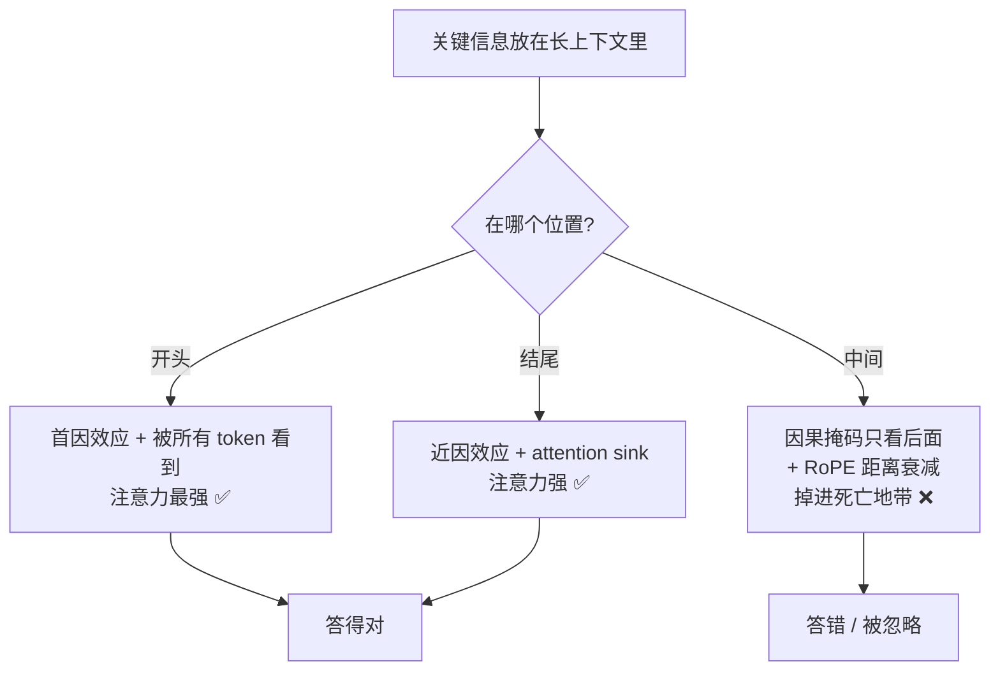
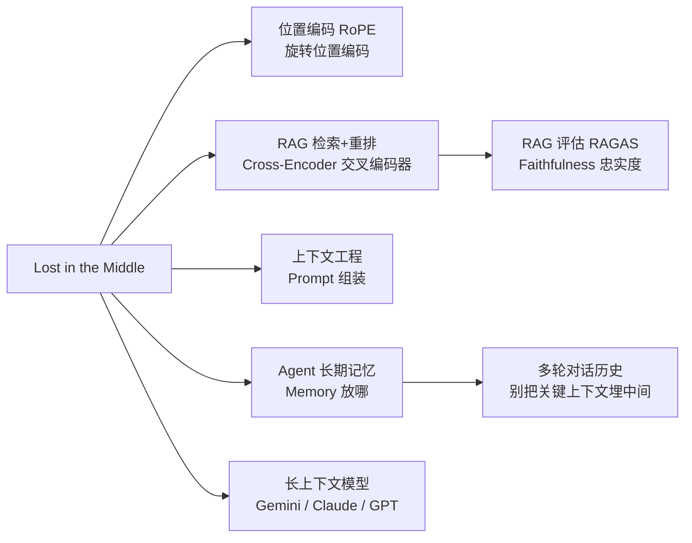

# Lost in the Middle：长上下文里，关键信息会被「埋」在中间 🟡中优

> **一句话总结**：LLM（Large Language Model，大语言模型）并不是「能装下多长，就能用好多长」。当答案藏在超长上下文的**中间**时，模型经常读不到——性能在开头和结尾最高、中间最低，画出来是一条 **U 型曲线**。这个现象叫 **Lost in the Middle（迷失在中间）**。

## 一、先讲个你一定经历过的场景

你有没有背过单词表？回头一测，发现**第一个和最后几个单词记得最牢，中间那一大片**总是模糊。或者你读一份 50 页的合同，老板问你「保修条款在第几页」，你明明扫过第 18 页，却怎么都想不起来具体内容。

LLM 也有一模一样的毛病。这不是比喻——后面你会看到，它背后和人类的「序列位置效应」惊人地相似。

**Lost in the Middle** 说的是：你把一段关键信息放在 prompt（提示词，你发给模型的指令+上下文）的最前面或最后面，模型答得挺好；一旦把它挪到**中间**，同样的模型、同样的信息，正确率可能**掉 20\~30 个百分点**。哪怕上下文窗口有 100K、200K token（token = 模型处理文本的最小单位，可粗略理解成「词块」），中间那段该忽略还是忽略。

> ⚠️ 一个反直觉的结论：把正确答案文档**放在中间**，有时还不如**不给他看**（闭卷）。论文里就出现了这种情况——给中间反而比闭卷正确率还低。

---

## 二、这个名词是哪来的（先认来源，别瞎编）

**Lost in the Middle** 这个术语，来自 2023 年 Stanford、UC Berkeley 和 Samaya AI 合发的一篇论文：  
*Liu et al., "Lost in the Middle: How Language Models Use Long Contexts", arXiv:2307.03172, 2023。*

他们做了个很「轴」的实验：固定一道题和对应的答案文档，**只改变答案文档在上下文里的位置**，看模型答得对不对。结果跨 GPT-3.5、GPT-4、Claude、多个开源模型都成立——U 型曲线是普遍现象，不是某个模型的特例。

---

## 三、论文到底测出了什么（上数据）

实验有两个任务：

- **多文档问答**：给一堆文档，只有 1 篇含答案，其余是干扰项。
- **键值检索**：给一堆随机 UUID（Universally Unique Identifier，通用唯一识别码，一串无语义的乱码 ID）键值对，问某个 key 对应的值。UUID 没语义，纯粹考「能不能精准定位」。

以 **20 篇文档、GPT-3.5-Turbo** 为例（数字来自原论文与 emergentmind 整理）：

| 答案文档位置 | GPT-3.5 准确率 |
|-|-|
| 闭卷（不给文档） | 56.1% |
| 第 1 位（开头） | **75.8%** |
| 第 9 位（中间） | 53.8% |
| 最后 1 位（结尾） | 63.2% |


注意看：**中间那行 53.8% 比闭卷 56.1% 还低**。也就是说，检索系统辛辛苦苦把正确答案找来了，结果因为「放错了位置」，模型反而被干扰得更惨。这就是很多 RAG（Retrieval-Augmented Generation，检索增强生成，后面会讲）线上故障的真凶——你以为模型「没检索到」，其实它「检索到了但没看」。

---

## 四、为什么会这样？（不假设你会 transformer，从直觉讲）

要懂这个，得先认识两个词，我不假设你学过，先通俗讲。

### 4.1 注意力机制 Attention（先打个底）

**Attention（注意力机制）** 是 transformer（一种神经网络架构，当今 LLM 的骨架）的核心：模型生成每个词时，会「回头看」输入里哪些词跟当前任务最相关，并给它们分配不同的「注意力权重」。

直觉类比：你写作文时，每写一句话，脑子里会重点回想前面几句关键内容，而不是平等对待整篇文章。Attention 就是模型的「重点回想」能力。

### 4.2 因果注意力掩码 Causal Attention Masking（MIT 2025 才真正说清）

2023 年论文发现了现象，但「为什么」憋了两年。直到 **2025 年 MIT 的研究**从架构层面给出解释。

**Causal Attention Masking（因果注意力掩码）**：transformer 生成文本是「从左到右」的，第 N 个 token（词块）只能看到它**前面**的 token，不能看后面的。这带来一个结构性后果——

- 第 1 个 token 能被后面**所有** token 看到，积累的注意力权重最多；
- 中间的第 500 个 token，只能被第 501 个往后的 token 看到。

所以**不是模型「觉得」开头重要，而是架构让它「更容易」注意到开头**。偏见是写进注意力掩码里的。

### 4.3 位置编码衰减 RoPE（Rotary Position Embedding，旋转位置编码）

**RoPE（旋转位置编码）** 是现代 LLM 用来「知道每个词在第几个位置」的技术。它有个副作用：**距离越远，注意力分数自然衰减**。

- 结尾的 token：离生成答案最近，有「近因」加成；
- 开头的 token：有「注意力接收器（attention sink）」机制托着；
- **中间的 token**：离两头都远，两头的好处都吃不到，掉进「死亡地带」。

### 4.4 训练数据偏见 + 人类同款毛病

- **训练数据**：人类写文章，重要信息天然放开头（标题、摘要）和结尾（结论、TL;DR），模型学了这个「位置先验」。
- **序列位置效应 Serial Position Effect**：心理学家早发现了——人记列表，首尾记得最牢（首因效应 primacy + 近因效应 recency）。LLM 没被设计成模仿人，却因为架构和训练数据，长出了几乎一样的偏见。



---

## 五、2025/2026 年，新模型治好了吗？

**部分治好，但没断根。**

- **Gemini 2.5/3、Claude 4.x、GPT-5.x** 等原生长上下文模型，needle-in-a-haystack（大海捞针，把一个事实藏进长文本看模型能不能找到的测试）几乎满分，U 型曲线**更平了**。
- 但在**真实多事实、复杂推理**任务里，U 型还是会冒头，只是没那么夸张（中部召回比首尾仍低 5\~20 个百分点，来源：zeroentropy 2026、theneuralbase 2026 验证）。
- FlashAttention-2 实现（Llama 3+、Qwen）曲线比标准注意力**略平**，但效应从未消失。

> **工程结论没变**：短而有序的上下文，永远比长而乱序的上下文更靠谱。把关键信息放在上下文**前 10% 和最后 5%**。

---

## 六、怎么缓解？（生产级打法）

按「性价比」从高到低：

### 6.1 重排序后「首尾放重要信息」（最便宜、最有效）

你检索出 top-K 文档后，别按原始顺序拼。把**最相关的放开头、第二相关的放结尾**，中间的放低相关的。有人直接把 top-1 文档**首尾各放一份**（duplicate to both boundaries），把 U 型曲线「利用」起来而不是对抗它。

> 直觉：既然模型两头注意力强，那就把宝贝都搁两头。

**骨架级片段**（只展示思路，非可运行代码）：

```text
rerank 后得到 [d1, d2, d3, d4, d5]   # d1 最相关
组装顺序 → [d1, d4, d3, d2, d5]      # d1 开头, d5 结尾
# 或激进版：[d1, d4, d3, d2, d1]       # d1 首尾都放
```

### 6.2 两阶段检索 + 精排（Cross-Encoder 交叉编码器）

- 第一阶段：向量检索广撒网（recall 优先，取 20\~100 篇）。
- 第二阶段：**Cross-Encoder（交叉编码器）** 把「问题+文档」**拼在一起**联合打分，比向量检索单独编码准很多。精排后只留最相关的 **3\~5 篇**进 prompt。

> 研究称精排能比纯向量检索提升 15~~30% 准确率。关键是：K 别太大，3~~5 篇足够，多了反而把重要信息挤到中间。

### 6.3 Query-First 提示词

把**用户问题放在上下文最前面**，再放检索内容。缩短「问题 → 证据」的注意力路径，召回率会提升。简单但真有用。

### 6.4 分块控制长度 + 中间压缩

- 长文档切成 200\~500 token 的小块（chunk = 文本切片），只取最相关的几块，别整篇塞。
- 中间那段实在重要的，先**摘要/压缩**（如 LLMLingua 这类 Prompt Compression 提示词压缩工具）再放，比塞原始长文更扛得住。

### 6.5 位置感知测试（插针测试 Needle-in-a-Haystack）

上线前自己做个体检：把一条已知事实分别插在上下文的「开头 / 中间 / 结尾」，测模型能不能答对。如果中间掉得厉害，就调组装策略。

### 6.6 架构层（进阶）

- **Ms-PoE（Multi-scale Positional Encoding，多尺度位置编码）**：不改模型、不微调，给不同注意力头套不同位置缩放，把中部准确率提升 20\~40%（getmaxim.ai 综述）。
- 还有 IN2 训练、attention calibration（注意力校准）等方向。


---

## 七、绑定你的简历项目：AI 简历分析系统 v0.2.0 怎么改

> 目标：让你被追问「你项目还能怎么优化」时，有 concrete（具体）话术，而不是「可以加个重排」这种空话。

**项目现状（据真实架构）**：混合检索 = ChromaDB 稠密 + BM25/jieba 稀疏 → RRF 融合 → top20 → qwen3-vl-rerank（Cross-Encoder 交叉编码器）20→5 → 把 top5 拼进 prompt 生成答案。

**差距**：你现在 `rerank` 出 top5 后，大概率是**按 rerank 分数顺序直接拼进 prompt。这意味着——最相关的文档（rank 1）在开头（✅），但 rank 2/3 可能被挤到中间位置，而它们往往才是真正含答案的**；且一旦出现多文档、多跳问答，关键证据容易落在中部「死亡地带」。

**具体改动（贴合代码结构）**：

1. **在哪改**：`graph.py` 与 `mcp_graph.py` 里 rerank 之后、拼 prompt 之前的「上下文组装」环节。
2. **加什么**：一个 `lost_in_middle_reorder(docs)` 函数，把 `docs` 重排成 `[docs[0], docs[3], docs[2], docs[1], docs[4]]`（最相关置首、次相关置尾），或在配置里加 `LIM_PLACEMENT="u_shaped"` 开关；激进版把 `docs[0]` 首尾各放一次。
3. **为什么**：U 型曲线证明首尾注意力最强，把高 rerank 分文档挪到首尾，直接对抗 lost-in-middle。
4. **潜在风险**：① 文档顺序变了，**来源可溯源**的标注（你项目有「来源可溯源」三层防幻觉之一）要同步调整，避免引用错位；② 首尾重复放 `docs[0]` 可能让模型过度依赖它，需小流量 A/B 验证。
5. **预期收益**：减少「检索对了但答错」的 lost-in-middle 型失败，尤其在长简历、多轮问答场景；可纳入你已有的 **LLM-as-Judge 三维度评估**（完整性/准确性/来源可信度）做前后对比，作为优化证据写进简历。

> 一句话话术（可用）：「我们的 rerank 之后直接按分数拼，存在 lost-in-middle 风险。我计划加一步 U 型重排，把高 rerank 分文档放首尾，并在 LLM-as-Judge 里加位置感知测试验证收益，预计能降低中部信息被忽略导致的答错率。」

---

## 八、核心要点

- **Lost in the Middle 是什么**：长上下文里，答案在中间时模型答得差，首尾好，呈 U 型。
- **谁提的**：Liu et al. 2023（arXiv:2307.03172）。
- **为什么**：因果注意力掩码（开头被看最多）+ RoPE 距离衰减（中间掉死亡地带）+ 训练数据位置先验。
- **新模型好了吗**：曲线更平，但真实任务 U 型仍在（2026 验证）。
- **最便宜的缓解**：rerank 后把最相关文档放首尾（U 型摆放）。
- **和 RAG 的关系**：很多「模型忽略了检索内容」的线上故障，本质就是 lost-in-middle。

---

## 九、求职八股实战（怎么问 + 你怎么答）

> 求职不考你背定义，考你「能不能把知识点讲成一段有逻辑的话，还能接住追问」。下面按真实场景拆。

### 9.1 三种问法（你能预判）

| 问法 | 典型原题 | 你想到的考点 |
|-|-|-|
| 直接问 | 「了解 Lost in the Middle 吗？」 | 现象 + U 型曲线 + 一句话归因 |
| 场景题 | 「你的 RAG 检索对了，但回答还是错，可能为什么？」 | 大概率是 lost-in-middle，不是检索问题 |
| 追问链 | 「新模型上下文这么长了，这问题还在吗？」 | 曲线更平但真实任务仍在，讲工程结论 |

### 9.2 标准回答模板（30 秒速答版）

> 「Lost in the Middle 是说：LLM 对长上下文里**中间位置**的信息利用最差，开头和结尾最好，性能呈 U 型。本质是 transformer 的**因果注意力掩码 Causal Attention Masking**（开头被所有 token 看到）加上 **RoPE（Rotary Position Embedding，旋转位置编码）** 的距离衰减（中间两头不靠），再加训练数据把重要信息放首尾的位置先验。  
> 工程上缓解很简单：检索后**精排**，把最相关的文档放上下文**首尾**（U 型摆放），并控制长度、只留 3\~5 篇。新模型曲线更平了，但真实多事实任务里 U 型仍在，所以这条经验没过时。」

### 9.3 高频追问 + 反杀答案

- **「为什么不是模型笨，是架构问题？」** → 因果掩码让第 1 个 token 被全程看到、积累注意力最多；中间 token 只被后面少数看到。偏见写进掩码，不是模型「主观」忽略。
- **「怎么证明不是检索的锅？」** → 论文里把答案放中间，准确率比**闭卷**还低（53.8% < 56.1%），说明文档确实被检索到了，只是没被用上。
- **「首尾放重要信息，那中间放什么？」** → 放低相关的、或先压缩/摘要再放；关键证据永远在边界。
- **「和 RAG 评估怎么结合？」** → 在评估里加**位置感知测试**（插针测试 Needle-in-a-Haystack）：把已知事实插开头/中间/结尾，看召回；接进 LLM-as-Judge 量化「检索到了但答错」的比例。

### 9.4 跨考点串联（求职最爱「一题串一片」）



> 一句话串：这块能牵出 **RoPE 位置编码（Transformer 八股）、RAG 全流程（检索/重排/评估）、上下文工程**、**Agent 记忆**、**长上下文模型演进**——任意一个都能接着展开，体现你知识成网而非成点。

## 十、下一篇预告（知识串联）

本篇是 RAG 系列的「上下文组装」环节。下一篇可串到 **《RAG 评估指标》**——怎么用 RAGAS 框架（Context Precision/Recall + Faithfulness）量化「检索到了但没用上」这类问题，以及怎么把 lost-in-middle 的位置感知测试接进你的 LLM-as-Judge。

---

## 
> ▶ 对应实操：[[20-MCP Server 实现：FastMCP + JWT 认证中间件 + contextvars|20-MCP Server 实现：FastMCP + JWT 认证中间件 + contextvars]]

相关链接
- [[13-RAG检索增强生成]]
- [[15-Embedding向量化]]
- [[22-RAG评估指标]]
- [[八股文学习清单]]
- [[00-全局导航|全局导航]]

## 速记卡（面试闪卡）

**Q1：一句话讲清「Lost in the Middle：长上下文里，关键信息会被「埋」在中间 🟡中优」到底是什么？**
A：你有没有背过单词表？回头一测，发现**第一个和最后几个单词记得最牢，中间那一大片**总是模糊。或者你读一份 50 页的合同，老板问你「保修条款在第几页」，你明明扫过第 18 页，却怎么都想不起来具体内容。
LLM 也有一模一样的毛病。这不是比喻——后面你会看到，它背后和人类的「序列位置效应」惊人地相似。

**Q2：一、先讲个你一定经历过的场景 —— 怎么理解？**
A：你有没有背过单词表？回头一测，发现**第一个和最后几个单词记得最牢，中间那一大片**总是模糊。或者你读一份 50 页的合同，老板问你「保修条款在第几页」，你明明扫过第 18 页，却怎么都想不起来具体内容。
LLM 也有一模一样的毛病。这不是比喻——后面你会看到，它背后和人类的「序列位置效应」惊人地相似。

**Q3：二、这个名词是哪来的（先认来源，别瞎编） —— 怎么理解？**
A：**Lost in the Middle** 这个术语，来自 2023 年 Stanford、UC Berkeley 和 Samaya AI 合发的一篇论文：  
*Liu et al., "Lost in the Middle: How Language Models Use Long Contexts", arXiv:2307.03172, 2023。

**Q4：三、论文到底测出了什么（上数据） —— 怎么理解？**
A：实验有两个任务：
**多文档问答**：给一堆文档，只有 1 篇含答案，其余是干扰项。
**键值检索**：给一堆随机 UUID（Universally Unique Identifier，通用唯一识别码，一串无语义的乱码 ID）键值对，问某个 key 对应的值。UUID 没语义，纯粹考「能不能精准定位」。

**Q5：四、为什么会这样？（不假设你会 transformer，从直觉讲） —— 怎么理解？**
A：要懂这个，得先认识两个词，我不假设你学过，先通俗讲。
**Attention（注意力机制）** 是 transformer（一种神经网络架构，当今 LLM 的骨架）的核心：模型生成每个词时，会「回头看」输入里哪些词跟当前任务最相关，并给它们分配不同的「注意力权重」。
直觉类比：你写作文时，每写一句话，脑子里会重点回想前面几句关键内容，而不是平等对待整篇文章。Attention 就是模型的「重点回想」能力。

**Q6：核心速记主线有哪些？**
A：抓住这几根：一、先讲个你一定经历过的场景、二、这个名词是哪来的（先认来源，别瞎编）、三、论文到底测出了什么（上数据）、四、为什么会这样？（不假设你会 transformer，从直觉讲）、五、2025/2026 年，新模型治好了吗？、六、怎么缓解？（生产级打法）。

