---

title: "知识图谱与GraphRAG"

created: "2026-07-13"

tags:

  - 八股文

  - ai

---

# 知识图谱与GraphRAG

> **生活化类比**：知识图谱就像一张「人物关系网」——节点是人/物，边是关系（谁提出了什么、谁毕业于哪）。GraphRAG 则给这张网配了个「导游」，既能回答「爱因斯坦的相对论讲了啥」，也能顺着关系网推理出「他老师是谁」。

## 核心概念

**知识图谱（Knowledge Graph）** 是一种用图结构表示知识的方式，由实体（节点）和关系（边）组成。它能够存储结构化的事实知识，支持复杂的推理和查询。

**GraphRAG**（Graph Retrieval-Augmented Generation，基于图谱的检索增强生成）是 Microsoft 于 2024 年提出的一种基于知识图谱的 RAG 方法，通过图结构增强检索和生成质量。

## 知识图谱基础
### 三元组表示

知识图谱的核心是三元组（Triple）：

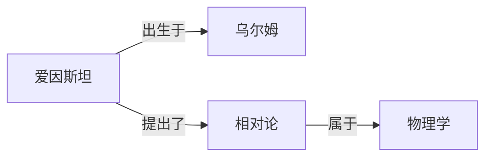

### 知识图谱 vs 关系数据库

| 维度 | 知识图谱 | 关系数据库 |
| ------ | --------- | ----------- |
| 数据模型 | 图（节点+边） | 表（行+列） |
| Schema | 灵活，无需预定义 | 严格，需要预定义 |
| 查询语言 | Cypher, SPARQL | SQL |
| 推理能力 | 支持图推理 | 有限 |
| 适用场景 | 复杂关系、灵活模式 | 结构化数据、事务处理 |

### 知识图谱存储

| 存储类型 | 工具 | 特点 |
| --------- | ------ | ------ |
| 原生图数据库 | Neo4j, JanusGraph | 性能最优，支持图算法 |
| RDF 存储 | Apache Jena, Virtuoso | 标准化，支持 SPARQL |
| 嵌入式 | NetworkX (Python) | 简单，适合小规模 |
| 向量化 | 用于图嵌入 | 支持相似度查询 |

## 实体与关系提取
### 命名实体识别（NER, Named Entity Recognition）

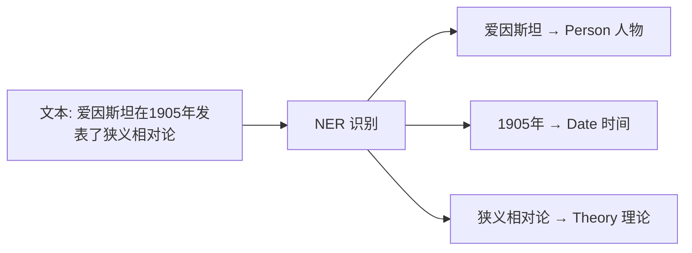

### 关系提取

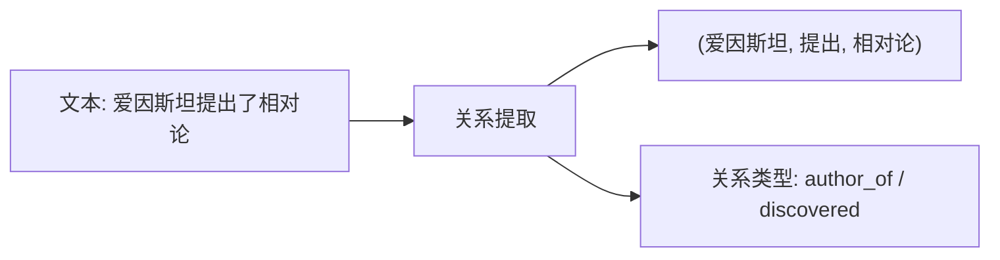

### 提取方法

| 方法 | 描述 | 优缺点 |
| ------ | ------ | -------- |
| 基于规则 | 使用正则表达式、模式匹配 | 精确但覆盖有限 |
| 监督学习 | 训练标注数据的分类器 | 精度高但需要标注 |
| 远程监督 | 利用现有知识库自动标注 | 规模大但有噪音 |
| LLM-based | 使用 LLM 进行提取 | 灵活但成本高 |

## GraphRAG
### 传统 RAG 的局限

| 问题 | 描述 |
| ------ | ------ |
| 全局理解缺失 | 传统 RAG 检索局部片段，难以回答需要全局理解的问题 |
| 关系推理不足 | 难以处理多跳推理和复杂关系查询 |
| 信息分散 | 相关信息分散在多个文档中，难以整合 |

### GraphRAG 的核心思想

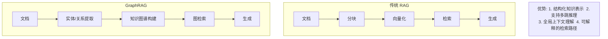

### GraphRAG 流程

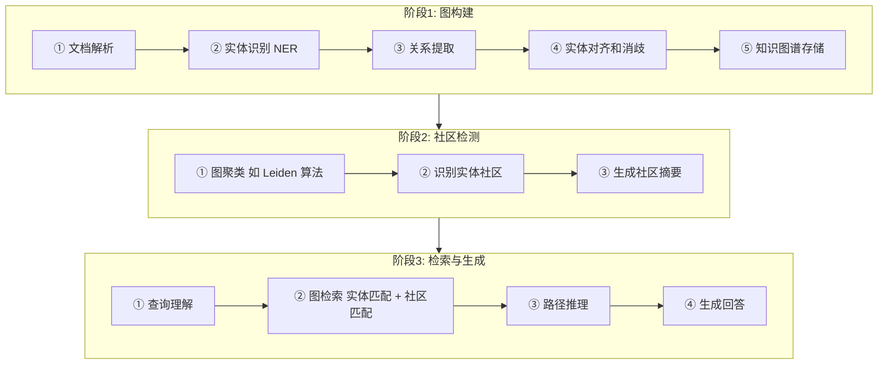

### 社区检测与摘要

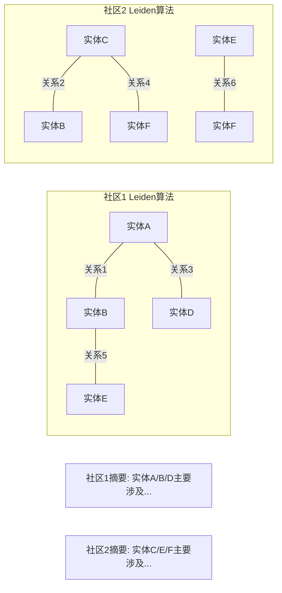

## 图检索策略
### 基于实体的检索

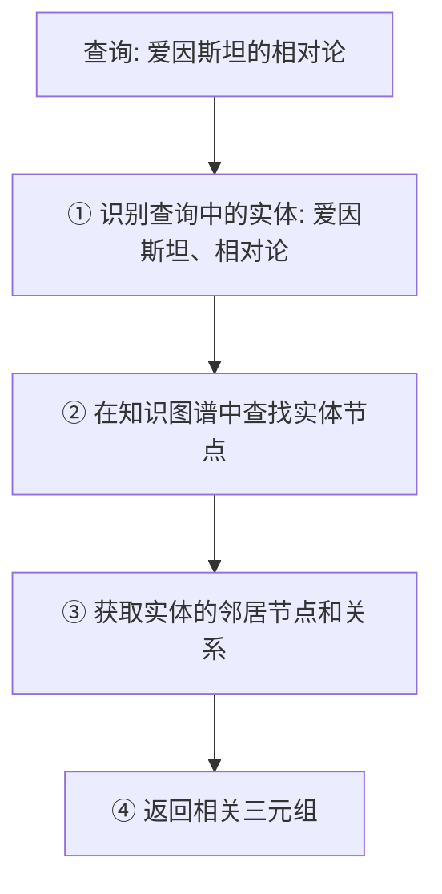

### 基于关系的检索

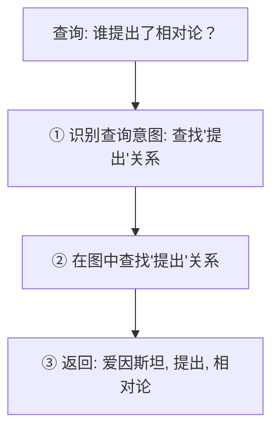

### 多跳推理

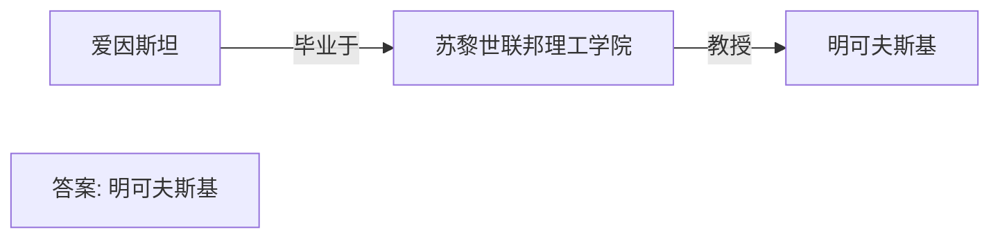

## 图嵌入（Graph Embedding）
### 方法分类

| 方法 | 描述 | 代表模型 |
| ------ | ------ | --------- |
| 转移距离 | 基于距离的嵌入 | TransE, TransR |
| 语义匹配 | 基于相似度的嵌入 | DistMult, ComplEx |
| 图神经网络 | 使用 GNN 学习嵌入 | GCN, GraphSAGE |

### TransE 原理

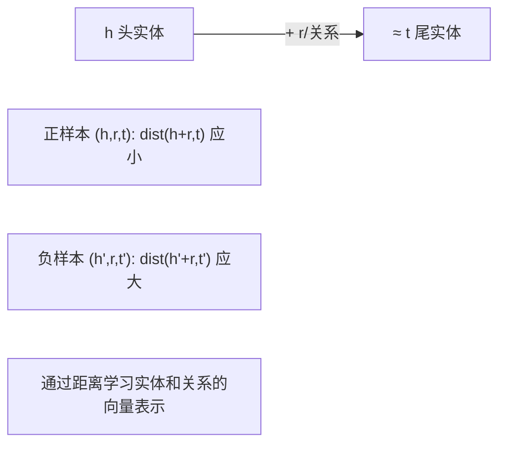

### 一句话说人话

**核心公式：h + r ≈ t**（头实体 + 关系 ≈ 尾实体）

把实体想成地图上的点，关系就是「往某个方向走一步」：

> 🧭 「北京」+「首都→」≈「中国」

> 「爱因斯坦」+「提出了→」≈「相对论」

**训练方式**：猜对了有奖，猜错了挨打

- ✅ **正样本**（事实）：h+r 和 t 离得近 → 表扬，让它们更近

- ❌ **负样本**（瞎编）：h+r 和 t 离得远 → 揍它，让它们更远

**优点**：简单暴力，训练飞快

**缺点**：太单纯，搞不定复杂关系（比如 1 对 N、对称关系），后来被 TransR、RotatE 等更聪明的模型取代。

## 混合知识系统
### 向量数据库 + 知识图谱

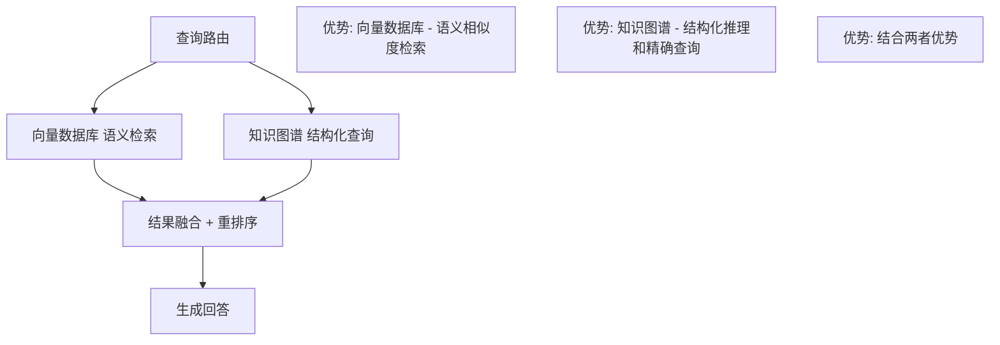

### 选择指南

| 场景    | 推荐方案    |
| ----- | ------- |
| 开放域问答 | 向量数据库为主 |
| 结构化查询 | 知识图谱为主  |
| 复杂推理  | 知识图谱为主  |
| 语义搜索  | 向量数据库为主 |
| 混合需求  | 两者结合    |

## 常见问题

| 问题                       | 回答要点                                                                                      |
| ------------------------ | ----------------------------------------------------------------------------------------- |
| 知识图谱和向量数据库的核心区别是什么？      | 知识图谱用图结构存储实体和关系，支持结构化查询和推理；向量数据库存储 embedding 向量，支持语义相似度检索。两者互补，知识图谱擅长精确查询和推理，向量数据库擅长语义搜索。 |
| GraphRAG 相比传统 RAG 有什么优势？ | GraphRAG 通过知识图谱提供结构化知识表示，支持多跳推理和全局上下文理解。传统 RAG 只检索局部片段，难以处理需要整合多个文档信息的复杂问题。               |
| 实体和关系提取有哪些方法？            | 主要方法：基于规则（正则表达式）、监督学习（标注数据训练分类器）、远程监督（利用现有知识库自动标注）、LLM-based（使用 LLM 提取）。实际中常结合多种方法。       |
| 什么是知识图谱的社区检测？            | 社区检测是将图中的实体聚类成组，组内实体关系紧密，组间关系稀疏。常用 Leiden 算法。社区可以生成摘要，帮助理解知识图谱的全局结构。                      |
| 如何设计混合知识系统？              | 结合向量数据库和知识图谱：语义搜索用向量数据库，结构化查询用知识图谱。需要设计查询路由策略，根据查询类型选择合适的检索方式，然后融合结果。                     |
| TransE 的核心思想是什么？         | TransE 基于"h + r ≈ t"的假设，即头实体加上关系应该接近尾实体。通过最小化正样本的距离、最大化负样本的距离来学习实体和关系的向量表示。               |
| 为什么需要多跳推理？               | 很多问题需要经过多个关系才能得到答案。例如"爱因斯坦的老师是谁"需要：爱因斯坦→毕业学校→教授。传统 RAG 难以处理这种链式推理，知识图谱天然支持。               |
| GraphRAG 的社区摘要有何作用？      | 社区摘要提供了知识图谱的全局视图，帮助回答需要整体理解的问题。例如"这个领域的主要研究方向是什么"需要全局理解，而不仅是单个实体的信息。                      |

## 速记卡（面试闪卡）

**Q1：一句话讲清「知识图谱与GraphRAG」到底是什么？**

A：知识图谱用图存实体和关系，GraphRAG 借它增强检索，支持多跳推理与全局理解。

**Q2：一、知识图谱基础 —— 怎么理解？**

A：知识图谱像一张"人物关系网"：节点是人/物，边是关系（谁提出啥）。三元组（Triple）是基本单位，如 (爱因斯坦, 提出, 相对论)。比起关系数据库，它 schema 灵活、天生会推理。

**Q3：二、实体与关系提取 —— 怎么理解？**

A：从文本里挖实体（NER）和关系，方法从规则、监督学习到 LLM-based。像从一堆新闻里摘出"谁、干了啥、和谁有关"，攒成可查询的知识网。远程监督能自动标注但带噪音。

**Q4：三、GraphRAG 核心思想 —— 怎么理解？**

A：传统 RAG 只捞局部片段；GraphRAG 先抽实体/关系建图谱，再做图检索 + 社区检测（Leiden 算法）生成摘要。优势：结构化表示、多跳推理、全局上下文、可解释路径。

**Q5：四、图嵌入与混合系统 —— 怎么理解？**

A：TransE 核心 "h + r ≈ t"：头实体加关系约等于尾实体，像"北京+首都→≈中国"。混合系统用路由（router）分配：语义搜索走向量库，结构化查询走图谱，结果融合。

**Q6：核心速记主线有哪些？**

- 图谱 = 节点+边的三元组网络

- 提取：NER + 关系，多法结合

- GraphRAG：建图→社区摘要→图检索

- 混合：向量库 + 图谱，路由分流

**口诀**

A：图谱一张关系网，实体边上记端详；

抽实体建图增强，多跳推理不慌张。

TransE 加关系近，混合检索两头忙；

向量图谱相映照，答案靠谱路更长。

相关链接

- [[八股文学习路线图]]

- [[00-全局导航|全局导航]]

## 相关链接

- [[笔记/AI与Agent/知识/八股/12-多模态模型|多模态模型]]

- [[笔记/AI与Agent/知识/八股/10-LLM幻觉与可靠性|LLM幻觉与可靠性]]

- [[笔记/AI与Agent/知识/八股/64-分布式训练与并行策略|分布式训练与并行策略]]

- [[笔记/AI与Agent/知识/八股/61-RLHF与对齐|RLHF与对齐]]

- [[笔记/AI与Agent/知识/八股/11-LLM评估与基准测试|LLM评估与基准测试]]

