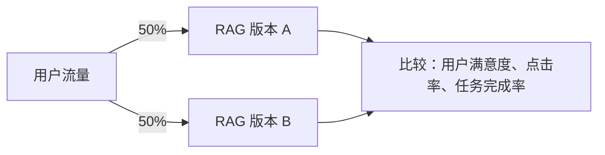
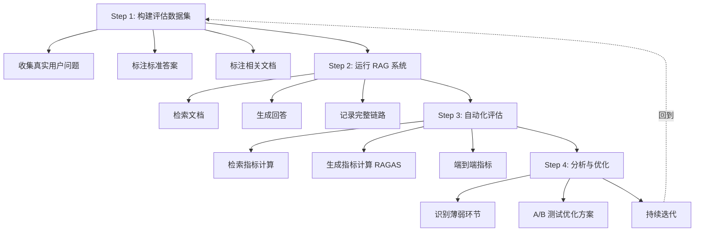

# RAG评估指标


RAG 系统的评估是确保系统质量的关键环节。需要从检索质量和生成质量两个维度进行系统化评估。

> **本篇为评估「概览」**：检索层指标（Recall/Precision/MRR/NDCG）与生成层指标（Faithfulness/Answer Relevance）的逐项定义、公式、达标标准与诊断矩阵详见下文。

## RAG 评估的核心问题

| 问题 | 对应指标 |
| ------ | --------- |
| 检索到的文档相关吗？ | Context Precision / Context Recall |
| 模型回答忠于检索到的内容吗？ | Faithfulness |
| 模型回答切题吗？ | Answer Relevance |
| 系统面对噪声是否鲁棒？ | Noise Robustness |

## RAGAS 评估框架

RAGAS（Retrieval Augmented Generation Assessment）是目前最流行的 RAG 评估框架。

### 核心指标

| 指标 | 公式/说明 | 评估目标 |
| ------ | --------- | --------- |
| Context Precision | 相关文档在 Top-K 中的排名是否靠前 | 检索精度 |
| Context Recall | 参考答案所需的信息是否被检索到 | 检索召回 |
| Faithfulness | 生成内容是否可以从上下文中推导出来 | 忠实度 |
| Answer Relevance | 生成的回答是否与问题相关 | 回答相关性 |

### Context Precision 检索精度

**含义：** 在检索到的 Top-K 文档中，有多少是真正相关的？相关文档的排名是否靠前？

```text
检索到 5 个文档：[相关, 无关, 相关, 无关, 相关]
Precision@5 = 3/5 = 0.6

但如果相关文档排名靠前：
[相关, 相关, 相关, 无关, 无关]
Precision@5 = 3/5 = 0.6（但质量更好）

所以实际计算会考虑排名：
Weighted Score = Σ(precision@k × rel_k) / total_relevant
```

**优化方向：**
- 提高 Embedding 模型质量
- 使用 Re-ranker 重排序
- 优化分块策略

### Context Recall 检索召回

**含义：** 参考答案所需的信息是否都被检索到了？

```text
标准答案需要 3 条信息：A, B, C
检索到的文档覆盖了 A 和 B，遗漏了 C
Recall = 2/3 = 0.67
```

**优化方向：**
- 增加 Top-K 数量
- 使用混合检索（BM25 + 向量）
- 查询扩展（HyDE、多查询）
- 优化文档覆盖度

### Faithfulness 忠实度

**含义：** 模型的回答是否基于检索到的上下文，而非"编造"的内容？

```text
上下文："北京是中国首都，人口约2185万"
生成回答："北京是中国首都，人口约2185万，面积约16410平方公里"

面积信息不在上下文中 → Faithfulness 降低
```

**计算方式：**
1. 将回答拆分为多个独立声明（claims）
2. 对每个声明检查是否可以从上下文中推导出来
3. Faithfulness = 可推导的声明数 / 总声明数

**优化方向：**
- Prompt 中强调"只基于提供的上下文回答"
- 使用更强的 LLM
- 降低 temperature
- 添加"我不知道"的兜底策略

### Answer Relevance 回答相关性

**含义：** 模型的回答是否真正回答了用户的问题？

```text
问题："什么是机器学习？"
回答："深度学习是机器学习的一个子领域..."
→ 部分相关，但没有直接定义机器学习
```

**计算方式：**
1. 根据生成的回答反向生成多个可能的问题
2. 计算生成的问题与原始问题的相似度
3. 相似度越高，回答越相关

## 完整评估指标体系

### 检索层指标

| 指标 | 说明 | 优化方向 |
| ------ | ------ | --------- |
| Hit Rate | Top-K 中是否包含至少一个相关文档 | 增大 K、混合检索 |
| MRR (Mean Reciprocal Rank) | 第一个相关文档的排名倒数 | Re-ranker、优化排序 |
| NDCG | 考虑排名位置的评估 | 排序模型优化 |
| MAP | 所有相关文档的平均精度 | 综合优化 |

### 生成层指标

| 指标 | 说明 | 计算方式 |
| ------ | ------ | --------- |
| Faithfulness | 忠实度 | LLM-as-Judge |
| Answer Relevance | 回答相关性 | 逆向问题生成 + 相似度 |
| Correctness | 正确性 | 与参考答案对比 |
| Completeness | 完整性 | 是否覆盖了所有要点 |

### 端到端指标

| 指标 | 说明 |
| ------ | ------ |
| 任务完成率 | 最终是否成功完成用户任务 |
| 用户满意度 | 人工评估或用户反馈 |
| 响应时间 | 从提问到回答的总延迟 |
| 成本效率 | 每次查询的平均成本 |

## 评估方法

### 1. LLM-as-Judge

使用强 LLM（如 GPT-4）作为评估器：

```python
judge_prompt = """
评估以下回答的质量。

问题：{question}
上下文：{context}
回答：{answer}

请从以下维度评分（1-5分）：
1. 忠实度：回答是否基于上下文
2. 相关性：回答是否切题
3. 完整性：回答是否全面
"""
```

**优点：** 灵活、可扩展、能评估主观质量
**缺点：** 成本高、可能有偏差

### 2. 基准测试

使用标准数据集进行客观评估：

| 数据集 | 评估内容 |
| -------- | --------- |
| MS MARCO | 段落检索、问答 |
| Natural Questions | 真实问题检索 |
| HotpotQA | 多跳推理 |
| TriviaQA | 事实性问答 |

### 3. A/B 测试



### 4. 人工评估

| 维度 | 评分标准 |
| ------ | --------- |
| 准确性 | 信息是否正确 |
| 相关性 | 是否回答了问题 |
| 完整性 | 是否遗漏关键信息 |
| 可读性 | 回答是否清晰易懂 |
| 引用质量 | 引用是否准确、充分 |

## 评估流水线



---


---

<aside>
💡 **一句话总结**一句话总结：RAG 参数调优不是"炼丹"，而是科学实验——先定义参数空间和评估指标，再用网格搜索自动化遍历组合，最终用数据驱动选最优配置。

</aside>

---

## 一、为什么 RAG 需要参数调优？

### 1.1 RAG 有多少参数可调？

一个典型的 RAG 系统涉及**三类可调参数**三类可调参数，组合起来搜索空间爆炸：

| 参数类别 | 具体参数 | 典型取值范围 |
| --- | --- | --- |
| 分块参数 | chunk_size | 128 / 256 / 512 / 1024 / 2048 |
|  | chunk_overlap | 0 / 64 / 128 / 256 |
|  | 分块策略 | 递归切分 / 语义分块 / 结构化 |
| 检索参数 | top_k | 1 / 2 / 3 / 5 / 8 / 10 |
|  | 检索类型 | 纯向量 / 纯BM25 / 混合检索 |
|  | rerank | 无 / bge-reranker / cohere |
|  | similarity_threshold | 0.5 / 0.6 / 0.7 / 0.8 |
| 生成参数 | temperature | 0 / 0.3 / 0.7 |
|  | LLM 模型 | GPT-4o / Claude / 开源模型 |

<aside>
💡 **关键洞察**关键洞察：仅 chunk_size(5) × top_k(5) × 检索类型(3) = **75 种组合**75 种组合。加上 rerank、embedding 模型，组合数轻松破百。手动调参 = 在 Excel 里记几百行数据然后凭感觉选，这不科学。

</aside>

### 1.2 调优的核心原则

<aside>
💡 **核心金句**核心金句："RAG 调优的核心原则是——**先测检索，再调生成**先测检索，再调生成。90% 的效果问题出在检索环节，换 LLM 不如修检索。"

</aside>

调优顺序必须遵循：

<aside>
📈 `[Mermaid 图表]
flowchart TD
    A[确定评估基准线<br/>Baseline] --> B[第一阶段：优化分块策略]
    B --> C[第二阶段：优化检索参数]
    C --> D[第三阶段：优化生成参数]
    D --> E{指标达标?}
    E -->|Yes| F[锁定配置，上线监控]
    E -->|No| G[回退到最弱环节重新调]
    G --> B`

</aside>

---

## 二、分块参数调优

### 2.1 chunk_size 的黄金区间

chunk_size 是 RAG 调优中**影响最大的单一参数**影响最大的单一参数，没有之一。

| chunk_size | 优势 | 劣势 | 适用场景 |
| --- | --- | --- | --- |
| 128~256 | 检索精度极高，噪声少 | 上下文碎片化，语义不完整 | 精确问答、FAQ、事实检索 |
| 256~512 | 精度与上下文的最佳平衡点 | — | 大多数 RAG 场景的首选 |
| 512~1024 | 上下文完整，适合长答案 | 可能引入噪声，检索精度下降 | 报告生成、综合分析 |
| 1024~2048 | 信息覆盖最全 | 噪声严重，LLM 注意力分散 | 探索性搜索、知识浏览 |

<aside>
💡 **经验法则**经验法则：chunk_size 优先从 **512**512 开始试，这是大多数 Embedding 模型的最佳输入范围。

</aside>

### 2.2 chunk_overlap 的选择

| overlap | 效果 | 建议场景 |
| --- | --- | --- |
| 0 | 无重叠，无冗余 | chunk_size 小 + 文档结构清晰 |
| 10%~20% | 最佳平衡点 | 大多数场景的默认选择 |
| >30% | 冗余严重，检索结果高度重复 | 仅当 chunk_size 极大时考虑 |

**经验公式**经验公式：`overlap ≈ chunk_size × 0.15 ~ 0.2`overlap ≈ chunk_size × 0.15 ~ 0.2

例如 chunk_size=512 → overlap=64~128

### 2.3 分块策略对比

| 策略 | 原理 | 优势 | 劣势 | 推荐场景 |
| --- | --- | --- | --- | --- |
| 递归切分 | 按分隔符层级递归切分 | 简单高效，保留语义边界 | 不考虑语义连贯性 | 默认首选 |
| 语义分块 | 基于句子 embedding 相似度断点 | 语义完整性最强 | 计算成本高 | 高精度问答 |
| 结构化分块 | 按文档标题/章节结构切分 | 保留文档层次结构 | 依赖文档格式清晰 | 技术文档/法律文本 |
| 句子窗口 | 单句建索引，命中后扩窗 | 检索精度 + 丰富上下文 | 实现复杂 | 长文档问答 |

---

## 三、检索参数调优

### 3.1 top_k 的选择逻辑

top_k 控制传给 LLM 的上下文数量，直接影响**召回率 vs. 噪声**召回率 vs. 噪声的平衡。

| top_k | 召回率 | 噪声量 | Token 消耗 | 适用场景 |
| --- | --- | --- | --- | --- |
| 1~2 | 低 | 极低 | 少 | 简单事实性问答 |
| 3~5 | 中高 | 可控 | 适中 | 大多数场景的最佳区间 |
| 5~8 | 高 | 较高 | 多 | 复杂分析、多方面问题 |
| 8~10 | 很高 | 高 | 很多 | 探索性搜索、研究调研 |

<aside>
💡 **注意**注意：top_k 不是越大越好。传给 LLM 太多无关内容反而会降低生成质量（"Lost in the Middle" 效应——LLM 对中间位置的信息关注度最低）。

</aside>

### 3.2 检索类型选择

| 检索类型 | 原理 | 擅长 | 不擅长 |
| --- | --- | --- | --- |
| 纯向量检索 | embedding 余弦相似度 | 语义相近的查询 | 精确专有名词、编号 |
| 纯 BM25 | 关键词词频匹配 | 精确术语、编号、代码 | 语义相近但表述不同 |
| 混合检索 + RRF | 向量 + BM25 + 倒数排名融合 | 兼顾语义和精确匹配 | — |

<aside>
💡 **核心金句**核心金句："混合检索是生产环境的标配。纯向量检索在专有名词、编号、代码等精确匹配场景下效果差，加上 BM25 后 Hit@3 通常能提升 15%~25%。"

</aside>

### 3.3 Rerank 的价值

| 配置 | Precision@5 | Faithfulness | 说明 |
| --- | --- | --- | --- |
| 无 Rerank | 0.55 | 0.72 | 基线 |
| 加 Rerank | 0.78 | 0.91 | Precision 提升 42%，幻觉率大幅下降 |

**Rerank 的本质**Rerank 的本质：检索是"粗筛"（从万级文档中选百级），Rerank 是"精排"（从百级中选十级给 LLM）。跳过 Rerank = 把噪声直接喂给 LLM。

---

## 四、多阶段网格搜索实验框架

### 4.1 什么是网格搜索？

网格搜索（Grid Search）的核心思想：**穷举所有参数组合**穷举所有参数组合，每种组合跑一遍评估，选出最优。

<aside>
📈 `[Mermaid 图表]
flowchart LR
    A[定义参数空间] --> B[生成所有组合]
    B --> C[逐个跑评估]
    C --> D[收集指标数据]
    D --> E[排序选最优]`

</aside>

### 4.2 为什么要分阶段？

**全部参数一起网格搜索 = 组合爆炸。**全部参数一起网格搜索 = 组合爆炸。

例子：5 个 chunk_size × 4 个 top_k × 3 种检索 × 2 种 rerank × 3 种 embedding = **360 种组合**360 种组合。每种跑 50 条测试用例 = 18000 次 LLM 调用。

**分阶段调优**分阶段调优 = 每阶段只调 1~2 个参数，大幅缩减搜索空间：

<aside>
📈 `[Mermaid 图表]
flowchart TD
    S[开始] --> P1[第一阶段<br/>只调 chunk_size × overlap]
    P1 --> P1E[固定其他参数<br/>跑网格搜索]
    P1E --> P1R[锁定最优分块配置]
    P1R --> P2[第二阶段<br/>只调 top_k × 检索类型]
    P2 --> P2E[固定其他参数<br/>跑网格搜索]
    P2E --> P2R[锁定最优检索配置]
    P2R --> P3[第三阶段<br/>只调 rerank × similarity_threshold]
    P3 --> P3E[固定其他参数<br/>跑网格搜索]
    P3E --> P3R[锁定最优 Rerank 配置]
    P3R --> P4[第四阶段<br/>微调生成参数 temperature]
    P4 --> E[最终最优配置]`

</aside>

| 阶段 | 调优参数 | 固定参数 | 组合数 |
| --- | --- | --- | --- |
| 第一阶段 | chunk_size × overlap | top_k=5, 向量检索, 无 Rerank | 5×3 = 15 |
| 第二阶段 | top_k × 检索类型 | 最优分块, 无 Rerank | 4×3 = 12 |
| 第三阶段 | rerank × threshold | 最优分块 + 检索 | 3×4 = 12 |
| 第四阶段 | temperature | 全部最优 | 3×1 = 3 |
| 总计 | — | — | 42 |

从 360 缩减到 42，效率提升 **8.5 倍**8.5 倍。

---

### 4.3 完整实验代码框架

```python
import itertools
import numpy as np
from dataclasses import dataclass
from typing import List, Dict, Any

@dataclass
class ExperimentConfig:
    """一组参数配置"""
    chunk_size: int
    chunk_overlap: int
    top_k: int
    retrieval_type: str  # "vector", "bm25", "hybrid"
    use_rerank: bool
    rerank_model: str = ""
    similarity_threshold: float = 0.5

@dataclass
class ExperimentResult:
    """一组实验结果"""
    config: ExperimentConfig
    hit_rate: float
    precision: float
    recall: float
    faithfulness: float
    answer_relevance: float
    latency_ms: float

class RAGGridSearch:
    def __init__(self, documents, test_suite, embed_model, llm):
        self.documents = documents
        self.test_suite = test_suite
        self.embed_model = embed_model
        self.llm = llm
        self.results: List[ExperimentResult] = []

    def build_index(self, config: ExperimentConfig):
        """根据配置构建索引"""
        # 1. 分块
        splitter = RecursiveCharacterTextSplitter(
            chunk_size=config.chunk_size,
            chunk_overlap=config.chunk_overlap
        )
        chunks = splitter.split_documents(self.documents)

        # 2. 建索引
        if config.retrieval_type == "vector":
            index = VectorStore.from_documents(chunks, self.embed_model)
        elif config.retrieval_type == "bm25":
            index = BM25Index.from_documents(chunks)
        else:  # hybrid
            index = HybridSearchIndex.from_documents(chunks, self.embed_model)

        return index

    def run_single_experiment(self, config: ExperimentConfig) -> ExperimentResult:
        """跑单组实验"""
        # 1. 建索引
        index = self.build_index(config)

        # 2. 逐条测试
        hits, precisions, recalls = [], [], []
        faith_scores, rel_scores, latencies = [], [], []

        for case in self.test_suite:
            import time
            t0 = time.time()

            # 检索
            retrieved = index.retrieve(case["question"], top_k=config.top_k)

            # 可选 Rerank
```

```python

            if config.use_rerank:
                retrieved = rerank(retrieved, case["question"], model=config.rerank_model)

            # 过滤低分
            retrieved = [r for r in retrieved if r.score >= config.similarity_threshold]

            latency = (time.time() - t0) * 1000

            # 检索指标
            retrieved_ids = {r.id for r in retrieved}
            relevant_ids = set(case["relevant_chunk_ids"])
            tp = len(retrieved_ids & relevant_ids)
            hits.append(1 if tp > 0 else 0)
            precisions.append(tp / max(len(retrieved_ids), 1))
            recalls.append(tp / max(len(relevant_ids), 1))

            # 生成 + 生成指标
            answer = self.llm.generate(case["question"], [r.text for r in retrieved])
            faith = evaluate_faithfulness(case["question"], [r.text for r in retrieved], answer)
            rel = evaluate_relevance(case["question"], answer)
            faith_scores.append(faith)
            rel_scores.append(rel)
            latencies.append(latency)

        return ExperimentResult(
            config=config,
            hit_rate=np.mean(hits),
            precision=np.mean(precisions),
            recall=np.mean(recalls),
            faithfulness=np.mean(faith_scores),
            answer_relevance=np.mean(rel_scores),
            latency_ms=np.mean(latencies)
        )

    def run_grid_search(self, param_grid: Dict[str, List]) -> List[ExperimentResult]:
        """网格搜索"""
        # 生成所有组合
        keys = list(param_grid.keys())
        values = list(param_grid.values())
        combinations = list(itertools.product(*values))

        print(f"共 {len(combinations)} 种组合待测试")

        for i, combo in enumerate(combinations):
            config = ExperimentConfig(**dict(zip(keys, combo)))
            print(f"\n[{i+1}/{len(combinations)}] chunk={config.chunk_size}, "
                  f"overlap={config.chunk_overlap}, top_k={config.top_k}, "
                  f"retrieval={config.retrieval_type}, 
```

```python
rerank={config.use_rerank}")

            result = self.run_single_experiment(config)
            self.results.append(result)
            print(f"  → Hit={result.hit_rate:.2f}, P={result.precision:.2f}, "
                  f"R={result.recall:.2f}, Faith={result.faithfulness:.2f}")

        return self.results

    def find_best(self, metric: str = "faithfulness") -> ExperimentResult:
        """找最优配置"""
        return max(self.results, key=lambda r: getattr(r, metric))

# ========== 使用示例 ==========
if __name__ == "__main__":
    # 第一阶段：只调分块参数
    grid_phase1 = {
        "chunk_size": [256, 512, 1024],
        "chunk_overlap": [0, 64, 128],
        "top_k": [5],
        "retrieval_type": ["vector"],
        "use_rerank": [False],
        "similarity_threshold": [0.5],
    }

    searcher = RAGGridSearch(documents, test_suite, embed_model, llm)
    results = searcher.run_grid_search(grid_phase1)
    best = searcher.find_best("recall")

    print(f"\n最优配置: chunk_size={best.config.chunk_size}, "
          f"overlap={best.config.chunk_overlap}")
    print(f"Recall={best.recall:.2f}, Precision={best.precision:.2f}")
```

---

## 五、LlamaIndex ParamTuner 实战

LlamaIndex 提供了内置的 `ParamTuner`ParamTuner，可以直接用于 RAG 参数网格搜索。

### 5.1 基本用法

```python
from llama_index.experimental.param_tuner import ParamTuner

# 定义参数网格
param_dict = {
    "chunk_size": [256, 512, 1024],
    "top_k": [1, 2, 5],
}

# 固定参数
fixed_param_dict = {
    "docs": docs,
    "eval_qs": eval_qs[:10],
    "ref_response_strs": ref_response_strs[:10],
}

# 创建调优器
param_tuner = ParamTuner(
    param_fn=objective_function,  # 评估函数
    param_dict=param_dict,
    fixed_param_dict=fixed_param_dict,
    show_progress=True,
)

# 运行网格搜索
results = param_tuner.tune()

# 输出最优结果
best = results.best_run_result
print(f"最优 Score: {best.score}")
print(f"最优 chunk_size: {best.params['chunk_size']}")
print(f"最优 top_k: {best.params['top_k']}")
```

### 5.2 Ray Tune 分布式调优

当参数组合特别多时，可以用 Ray Tune 做分布式并行搜索：

```python
from llama_index.experimental.param_tuner import RayTuneParamTuner

param_tuner = RayTuneParamTuner(
    param_fn=objective_function,
    param_dict=param_dict,
    fixed_param_dict=fixed_param_dict,
)
results = param_tuner.tune()
```

---

## 六、调优结果分析

### 6.1 结果可视化表格

假设我们完成了第一阶段（分块参数）的网格搜索：

| chunk_size | overlap | Hit@5 | Precision@5 | Recall@5 | F1 |
| --- | --- | --- | --- | --- | --- |
| 256 | 0 | 0.72 | 0.68 | 0.58 | 0.63 |
| 256 | 64 | 0.78 | 0.72 | 0.65 | 0.68 |
| 512 | 128 | 0.88 | 0.80 | 0.82 | 0.81 |
| 512 | 256 | 0.86 | 0.74 | 0.84 | 0.79 |
| 1024 | 128 | 0.82 | 0.60 | 0.88 | 0.71 |
| 1024 | 256 | 0.84 | 0.55 | 0.90 | 0.68 |

**分析**分析：

- chunk_size=256 时 Recall 明显不足（信息碎片化）
- chunk_size=1024 时 Precision 低（噪声太多）
- **chunk_size=512 + overlap=128 是最优平衡点**chunk_size=512 + overlap=128 是最优平衡点，F1 最高

### 6.2 多阶段调优结果汇总

<aside>
📈 `[Mermaid 图表]
flowchart LR
    subgraph Phase1[第一阶段：分块]
        A1[256+0 → F1=0.63]
        A2[512+128 → F1=0.81 ✅]
        A3[1024+256 → F1=0.68]
    end
    subgraph Phase2[第二阶段：检索]
        B1[vector+k3 → Hit=0.82]
        B2[hybrid+k5 → Hit=0.91 ✅]
        B3[bm25+k5 → Hit=0.75]
    end
    subgraph Phase3[第三阶段：Rerank]
        C1[无Rerank → Faith=0.78]
        C2[bge-reranker → Faith=0.93 ✅]
    end
    Phase1 --> Phase2 --> Phase3`

</aside>

---

## 七、生产环境调优 Checklist

### 7.1 调优前必做

- [ ] 准备**标准化测试集**标准化测试集（至少 50 条，覆盖正常/边缘/恶意 query）
- [ ] 确定评估指标优先级（Recall 优先还是 Precision 优先？）
- [ ] 建立基线配置（Baseline）
- [ ] 确定参数搜索空间（不要盲目扩大）

### 7.2 调优中注意

- [ ] 每阶段**只调 1~2 个参数**只调 1~2 个参数，控制变量
- [ ] 每组实验至少跑 **3 次取均值**3 次取均值（LLM 输出有随机性）
- [ ] 记录每次实验的**完整配置和指标**完整配置和指标（用 DataFrame 或 CSV）
- [ ] 注意 **Token 成本**Token 成本（评估 100 组 × 50 条 = 大量 API 调用）

### 7.3 调优后验证

- [ ] 最优配置在**测试集之外**测试集之外的数据上也验证通过
- [ ] 关注**延迟指标**延迟指标（调优后的配置不能太慢）
- [ ] 纳入 **CI/CD 回归测试**CI/CD 回归测试（防止后续改动劣化）
- [ ] 灰度上线，收集**线上真实反馈**线上真实反馈

---

## 八、常见问题速答

### Q1：RAG 系统有哪些关键参数需要调优？

<aside>
💡 **答**答：核心参数分三类——**分块参数**分块参数（chunk_size、overlap、分块策略）、**检索参数**检索参数（top_k、检索类型、是否 Rerank）、**生成参数**生成参数（temperature、LLM 选型）。调优顺序是先分块 → 再检索 → 最后生成，因为 90% 的效果问题出在检索环节。

</aside>

### Q2：chunk_size 怎么选？

<aside>
💡 **答**答：黄金区间是 **256~512 tokens**256~512 tokens。太小（<128）会导致语义碎片化，Recall 低；太大（>1024）会引入噪声，Precision 低。建议从 512 开始，结合 overlap=10%~20% 的比例，用网格搜索在 [256, 512, 1024] 中找最优。

</aside>

### Q3：top_k 越大越好吗？

<aside>
💡 **答**答：不是。top_k 增大能提升 Recall，但会引入更多噪声，而且有"Lost in the Middle"效应——LLM 对上下文中间位置的信息关注度最低。大多数场景 **top_k=3~5**top_k=3~5 是最佳区间。

</aside>

### Q4：什么是多阶段网格搜索？为什么不直接全部参数一起搜？

<aside>
💡 **答**答：多阶段网格搜索是**分阶段调优**分阶段调优——每阶段只调 1~2 个参数，固定其余参数。这样做的好处是大幅缩减搜索空间：比如 5×4×3×2 = 120 种组合缩减到 15+12+6+3 = 36 种，效率提升 3 倍多。同时控制变量法更清晰，便于定位哪个参数真正影响了效果。

</aside>

### Q5：如何判断调优是否有效？

<aside>
💡 **答**答：三个标准：① 核心指标（Recall/Precision/Faithfulness）是否有**统计显著**统计显著的提升（不是 0.01 的波动）；② 提升是否在**独立测试集**独立测试集上复现；③ **延迟和成本**延迟和成本是否可接受。调优不能只看一个指标，要综合看 Hit Rate、Precision、Faithfulness 和响应延迟。

</aside>

---

## 九、核心金句

1. **"RAG 调优不是炼丹，是科学实验。先定义评估基准线，再用网格搜索自动化遍历参数组合，用数据驱动选最优配置。"**"RAG 调优不是炼丹，是科学实验。先定义评估基准线，再用网格搜索自动化遍历参数组合，用数据驱动选最优配置。"
2. **"chunk_size 是 RAG 中影响最大的单一参数。黄金区间 256~512 tokens，配合 10%~20% 的 overlap。"**"chunk_size 是 RAG 中影响最大的单一参数。黄金区间 256~512 tokens，配合 10%~20% 的 overlap。"
3. **"多阶段网格搜索的核心思想：每阶段只调 1~2 个参数，控制变量。从 120 种组合缩减到 36 种，效率提升 3 倍。"**"多阶段网格搜索的核心思想：每阶段只调 1~2 个参数，控制变量。从 120 种组合缩减到 36 种，效率提升 3 倍。"
4. **"混合检索是生产环境标配。纯向量检索在精确匹配场景下效果差，加 BM25 后 Hit@3 通常提升 15%~25%。"**"混合检索是生产环境标配。纯向量检索在精确匹配场景下效果差，加 BM25 后 Hit@3 通常提升 15%~25%。"
5. **"Rerank 是检索精排的关键步骤。跳过 Rerank 等于把噪声直接喂给 LLM，Precision 提升 40%+，幻觉率大幅下降。"**"Rerank 是检索精排的关键步骤。跳过 Rerank 等于把噪声直接喂给 LLM，Precision 提升 40%+，幻觉率大幅下降。"

---

## 十、参考资料

| 来源 | 链接 | 内容 |
| --- | --- | --- |
| CSDN - RAGs性能调优实战 | https://blog.csdn.net/gitblog_00658/article/details/151743762 | Chunk Size 与 Top-K 调优策略 |
| CSDN - ParamTuner 超参数优化 | https://blog.csdn.net/ppoojjj/article/details/140310019 | LlamaIndex ParamTuner 网格搜索 |
| CSDN - RAG评估与优化指南 | https://blog.csdn.net/zhangzhentiyes/article/details/148527841 | RAGAS/ARES 评估框架实战 |
| CSDN - RAG 文本切分方法 | https://juejin.cn/post/7545087762838126630 | 分块策略全面对比 |
| LlamaIndex 官方文档 | https://docs.llamaindex.io/ | ParamTuner / RayTuneParamTuner |
| RAGAS 官方文档 | https://docs.ragas.io/ | RAG 评估指标与框架 |

---

<aside>
💡 **关联笔记**关联笔记：

</aside>

<aside>
💡 - [[22-RAG评估指标]]

</aside>

<aside>
💡 - [[14-文档解析与分块策略]]

</aside>

<aside>
💡 - [[17-语义搜索与混合检索]]

</aside>

<aside>
💡 - [[19-Query改写与多轮对话指代消解]]

</aside>

---

<aside>
💡 **一句话总结**一句话总结：RAG 评估分两层——检索层看"找得准不准"（Recall/Precision/MRR/NDCG），生成层看"答得好不好"（Faithfulness/Relevance）。两层拆开测，才能定位问题根因。

</aside>

---

## 一、为什么 RAG 评估必须分两层？

### 1.1 混在一起测 = 盲人摸象

RAG 系统 = **检索器（Retriever）**检索器（Retriever） + **生成器（Generator）**生成器（Generator）。一条 Fail 的用例，可能是：

- 检索没召回对内容（检索层问题）
- LLM 没用好召回的片段（生成层问题）
- 两者都有问题

**混在一起只能得到模糊结论**混在一起只能得到模糊结论，无法指导优化方向。

### 1.2 分层评估的诊断价值

| 症状 | 检索层指标 | 生成层指标 | 问题定位 |
| --- | --- | --- | --- |
| 回答完全错误 | Recall 低 | Faithfulness 低 | 检索没召回 |
| 回答部分正确但有幻觉 | Recall 高 | Faithfulness 低 | LLM 编造 |
| 回答正确但不完整 | Recall 中 | Faithfulness 高 | TopK 太小 |
| 回答跑题 | Recall 高 | Relevance 低 | Prompt 问题 |

<aside>
💡 **核心金句**核心金句："90% 的 RAG 问题出在检索环节。如果 Hit@3 < 0.8，别急着调 prompt，先修 embedding 或 chunk 策略。"

</aside>

---

## 二、检索层指标详解

检索层的核心问题：**给定 query，系统能否从文档库中召回最相关的片段？**给定 query，系统能否从文档库中召回最相关的片段？

### 2.1 混淆矩阵基础

在信息检索中，我们把结果分为四类：

|  | 实际相关 | 实际不相关 |
| --- | --- | --- |
| 被系统检索 | TP（真正例） | FP（假正例） |
| 未被检索 | FN（假负例） | TN（真负例） |

### 2.2 核心检索指标

<aside>
📌 **① Precision（精确率 / 查准率）**

</aside>

**定义**定义：检索到的文档中，有多大比例是真正相关的？

**公式**公式：Precision = TP / (TP + FP)

**通俗理解**通俗理解：你抓回来 10 条结果，有几条是真的有用的？

**RAG 场景意义**RAG 场景意义：Precision 低 = 大量无关片段被召回，干扰大模型，易产生幻觉。必须加 Rerank 过滤。

**理想标准**理想标准：≥ 70%

---

<aside>
📌 **② Recall（召回率 / 查全率）**

</aside>

**定义**定义：所有相关文档中，成功检索到了多大比例？

**公式**公式：Recall = TP / (TP + FN)

**通俗理解**通俗理解：库里有 20 条相关内容，你找回来几条？

**RAG 场景意义**RAG 场景意义：Recall 低 = chunk 切割不合理、Embedding 能力弱、缺少关键词检索。

**理想标准**理想标准：≥ 90%

---

<aside>
📌 **③ Precision@K / Recall@K**

</aside>

**定义**定义：只看 Top-K 结果中的 Precision 和 Recall。

**RAG 场景意义**RAG 场景意义：K 通常取 3 或 5（因为 LLM 上下文有限）。**Recall@K 是 RAG 检索评估的核心指标**Recall@K 是 RAG 检索评估的核心指标。

---

<aside>
📌 **④ F1-Score**

</aside>

**定义**定义：Precision 和 Recall 的调和平均数。

**公式**公式：F1 = 2 × (Precision × Recall) / (Precision + Recall)

**适用场景**适用场景：需要平衡精确率和召回率时。单一指标看 F1，避免"偏科"。

**理想标准**理想标准：≥ 0.8

---

<aside>
📌 **⑤ Hit@K / Hit Rate（命中率）**

</aside>

**定义**定义：有多大比例的查询，在前 K 个结果中至少检索到了一个相关文档？

**公式**公式：Hit@K = 至少有一个相关文档出现在 TopK 的查询数 / 查询总数

**通俗理解**通俗理解：用户提问后，前 K 条结果里有没有"正确答案"？

**适用场景**适用场景：快速验证检索器是否有基本召回能力。

---

<aside>
📌 **⑥ MRR（Mean Reciprocal Rank，平均倒数排名）**

</aside>

**定义**定义：第一个相关文档的排名的倒数，取平均值。

**公式**公式：MRR = (1/|Q|) × Σ(1/rank_i)

其中 rank_i 是第 i 个查询的第一个相关文档的排名。

**通俗理解**通俗理解：第一个正确答案平均排在第几位？排第 1 得 1 分，排第 2 得 0.5 分，排第 3 得 0.33 分...

**RAG 场景意义**RAG 场景意义：问答场景中，通常第一个片段命中最重要。MRR 越高，说明正确答案越靠前。

| rank | 得分 |
| --- | --- |
| 1 | 1.0 |
| 2 | 0.5 |
| 3 | 0.33 |
| 4 | 0.25 |
| 5 | 0.2 |

---

<aside>
📌 **⑦ NDCG（Normalized Discounted Cumulative Gain，归一化折损累积增益）**

</aside>

**定义**定义：综合衡量排序质量，考虑相关性的"分级"（不是简单的是/否）。

**计算步骤**计算步骤：

1. **CG@K**CG@K（Cumulative Gain）：前 K 个结果的相关性得分累加
2. **DCG@K**DCG@K（Discounted CG）：排名越靠后，权重越低（折损）
- 公式：DCG@K = Σ((2^rel_i - 1) / log2(i + 1))
1. **IDCG@K**IDCG@K（Ideal DCG）：最优排序下的 DCG
2. **NDCG@K**NDCG@K = DCG@K / IDCG@K

**适用场景**适用场景：搜索结果需要分级相关性（如：不相关=0，部分相关=1，完全相关=2）。

<aside>
💡 **注意**注意：如果只标相关/不相关（0/1），NDCG 退化为简单的排序评估。

</aside>

---

### 2.3 检索指标对比速查表

| 指标 | 关注重点 | 适用场景 | 公式复杂度 | 是否需要分级标注 |
| --- | --- | --- | --- | --- |
| Precision | 结果纯度 | 控制噪声传入 LLM | 简单 | 否 |
| Recall | 结果覆盖 | 确保不遗漏关键信息 | 简单 | 否 |
| F1 | 平衡性 | 综合评估检索能力 | 简单 | 否 |
| Hit@K | 是否有正确答案 | 快速验证召回能力 | 简单 | 否 |
| MRR | 正确答案位置 | 问答场景 | 简单 | 否 |
| NDCG | 排序质量 | 搜索结果排序 | 复杂 | 是 |

---

### 2.4 检索常见问题诊断

| 指标异常 | 可能原因 | 优化方向 |
| --- | --- | --- |
| Recall 低 | chunk 过大/过小、Embedding 弱、无关键词检索 | 调 chunk_size、换 Embedding 模型、加 BM25 混合检索 |
| Precision 低 | 大量无关片段召回 | 加 Rerank、调相似度阈值、优化 query 改写 |
| MRR 低 | 正确答案排名靠后 | 换更强的 Rerank 模型、调向量检索参数 |
| Hit@3 < 0.8 | 检索器基础能力不够 | 重新选型检索方案 |

---

## 三、生成层指标详解

生成层的核心问题：**基于召回的上下文，LLM 生成的回答是否忠实、相关、有用？**基于召回的上下文，LLM 生成的回答是否忠实、相关、有用？

### 3.1 生成评估的难点

- **没有参考答案**没有参考答案：同一问题可以有多种正确回答
- **语义理解**语义理解：文字相似不代表语义正确
- **幻觉检测**幻觉检测：LLM 可能编造不存在的信息

**解决方案**解决方案：LLM-as-Judge（用大模型当裁判打分）

---

### 3.2 核心生成指标

<aside>
📌 **① Faithfulness（忠实度 / 真实性）**

</aside>

**定义**定义：回答中的每个陈述，是否都能被检索到的文档支持？

**通俗理解**通俗理解：LLM 有没有"胡说八道"？

**评估方式**评估方式：

1. **声明提取**声明提取：把回答拆成一个个事实声明
2. **证据匹配**证据匹配：逐个检查声明是否能在 context 中找到支持
3. **打分**打分：支持的声明数 / 总声明数

**RAG 场景意义**RAG 场景意义：**最核心的生成指标**最核心的生成指标。回答可以不完整，但不能编造。

**理想标准**理想标准：≥ 0.9（生产环境要求幻觉率 ≤ 5%）

<aside>
💡 **核心金句**核心金句："Faithfulness 是 RAG 的第一生成指标。我的优先级是：Faithfulness > Answer Relevance > Context Utilization。"

</aside>

---

<aside>
📌 **② Answer Relevance（答案相关性）**

</aside>

**定义**定义：回答是否贴合用户的问题？有没有答非所问？

**评估方式**评估方式：

1. 把回答反向生成问题（Reverse Query Generation）
2. 比较生成的问题和原始问题的语义相似度
3. 或者用 LLM 直接判断"这个回答是否解决了用户的问题"

**RAG 场景意义**RAG 场景意义：检测"跑题"现象——虽然用了正确的文档，但回答方向偏了。

---

<aside>
📌 **③ Answer Correctness（答案正确性）**

</aside>

**定义**定义：回答与参考答案（Ground Truth）的一致性。

**评估方式**评估方式：

- **语义相似度**语义相似度：用 Embedding 计算回答与参考答案的相似度
- **LLM 判断**LLM 判断：让 LLM 对比回答和参考答案，给出 0~1 的分数

**适用场景**适用场景：有参考答案的测试集（如考试题、FAQ）。

<aside>
💡 **注意**注意：无参考评估时不能用这个指标，需要依赖 Faithfulness + Relevance。

</aside>

---

<aside>
📌 **④ Context Precision（上下文精确度）**

</aside>

**定义**定义：检索到的上下文中，相关片段的比例。反映检索结果的整体相关性密度。

**RAGAS 版本**RAGAS 版本：用 LLM 判断每个片段是否与 query 相关，计算比例。

---

<aside>
📌 **⑤ Context Recall（上下文召回率）**

</aside>

**定义**定义：参考答案所需的参考信息，有多少被检索到了？

**评估方式**评估方式：

1. 把参考答案拆成关键事实点
2. 逐个检查这些事实点是否能在检索到的 context 中找到
3. 计算比例

---

### 3.3 生成指标对比速查表

| 指标 | 评估对象 | 是否有参考 | 核心用途 | 评估方式 |
| --- | --- | --- | --- | --- |
| Faithfulness | 回答 vs Context | 无参考 | 防幻觉 | LLM-as-Judge |
| Answer Relevance | 回答 vs Query | 无参考 | 防跑题 | LLM-as-Judge |
| Answer Correctness | 回答 vs Ground Truth | 有参考 | 测准确性 | Embedding/LLM |
| Context Precision | Context vs Query | 无参考 | 测检索纯度 | LLM-as-Judge |
| Context Recall | Context vs Ground Truth | 有参考 | 测检索覆盖 | LLM-as-Judge |

---

### 3.4 幻觉检测专项

**幻觉类型**幻觉类型：

| 类型 | 定义 | 示例 |
| --- | --- | --- |
| 事实性幻觉 | 编造不存在的事实 | "公司成立于2010年"（实际是2015年） |
| 逻辑性幻觉 | 推理过程错误 | "A>B, B>C, 所以 C>A" |
| 引用性幻觉 | 声称引用文档但文档无此内容 | "根据第3条..."（实际没有） |

**幻觉率计算**幻觉率计算：幻觉率 = 含幻觉的样本数 / 总测试样本数 × 100%

**生产要求**生产要求：幻觉率 ≤ 5%

---

## 四、RAGAS 框架实战

### 4.1 RAGAS 简介

RAGAS（Retrieval-Augmented Generation Assessment）是 RAG 评估的行业标准框架，提供**无参考评估**无参考评估能力。

**核心指标**核心指标：

| 指标 | 类别 | 说明 |
| --- | --- | --- |
| context_precision | 检索 | 上下文精确度 |
| context_recall | 检索 | 上下文召回率 |
| faithfulness | 生成 | 忠实度 |
| answer_relevancy | 生成 | 答案相关性 |
| answer_correctness | 生成 | 答案正确性（需参考） |

### 4.2 安装与基础使用

```python
from ragas import evaluate
from ragas.metrics import (
    context_precision,
    context_recall,
    faithfulness,
    answer_relevancy,
    answer_correctness
)
from datasets import Dataset

# 构造测试数据
data = {
    "question": ["公司年假最多可以休几天？", "如何申请报销？"],
    "answer": ["正式员工每年最多休10天年假", "需要填写报销单并提交发票"],
    "contexts": [
        ["员工手册规定正式员工年假上限10天"],
        ["报销流程：填写报销单 → 提交发票 → 部门审批 → 财务打款"]
    ],
    "ground_truth": ["正式员工年假每年最多10天", "填写报销单并提交发票即可申请报销"]
}

ds = Dataset.from_dict(data)

# 执行评估
result = evaluate(
    ds,
    metrics=[
        context_precision,
        context_recall,
        faithfulness,
        answer_relevancy,
    ]
)

print(result)
# 输出示例：
# {'context_precision': 0.96, 'context_recall': 0.91,
#  'faithfulness': 0.88, 'answer_relevancy': 0.85}
```

---

## 五、完整评估 Pipeline

### Pipeline 架构

<aside>
📈 `[Mermaid 图表]
flowchart TD
    A[测试数据集<br/>question + ground_truth + reference_chunks] --> B[检索模块]
    B --> C[检索层指标<br/>Recall@K / Precision@K / MRR / NDCG]
    B --> D[召回的 Contexts]
    D --> E[生成模块<br/>LLM生成Answer]
    E --> F[生成层指标<br/>Faithfulness / Relevance / Correctness]
    C --> G[评估报告]
    F --> G
    G --> H{指标达标?}
    H -->|Yes| I[通过评估]
    H -->|No| J[诊断根因]
    J --> K[优化检索 / 优化生成]
    K --> A`

</aside>

---

## 六、评估指标达标标准

### 行业参考标准

| 指标 | 合格线 | 优秀线 | 说明 |
| --- | --- | --- | --- |
| Recall@K | ≥ 80% | ≥ 90% | 关键信息不能漏 |
| Precision@K | ≥ 60% | ≥ 75% | 噪声控制 |
| F1-Score | ≥ 0.7 | ≥ 0.85 | 综合平衡 |
| Hit@3 | ≥ 0.7 | ≥ 0.85 | 基础召回能力 |
| MRR | ≥ 0.6 | ≥ 0.8 | 正确答案位置 |
| Faithfulness | ≥ 0.85 | ≥ 0.95 | 防幻觉核心 |
| Answer Relevance | ≥ 0.8 | ≥ 0.9 | 贴合问题 |
| Hallucination Rate | ≤ 10% | ≤ 5% | 越低越好 |

### 诊断矩阵

<aside>
📈 `[Mermaid 图表]
quadrantChart
    title RAG 问题诊断四象限（Recall vs Faithfulness）
    x-axis Low Recall --> High Recall
    y-axis Low Faithfulness --> High Faithfulness
    quadrant-1 检索强 + 生成弱：调 Prompt / 换模型
    quadrant-2 双高：理想状态，保持监控
    quadrant-3 双低：先修检索，再调生成
    quadrant-4 检索弱 + 生成强：优化 Embedding / Chunk / 检索策略`

</aside>

| 象限 | Recall | Faithfulness | 问题定位 | 优化优先级 |
| --- | --- | --- | --- | --- |
| 第一象限 | 高 | 低 | LLM 没用好文档 / Prompt 问题 | 调 Prompt、加约束 |
| 第二象限 | 高 | 高 | 理想状态 | 保持监控 |
| 第三象限 | 低 | 低 | 检索器根本不行 | 换检索方案 |
| 第四象限 | 低 | 高 | 检索召回不够 | 调 chunk、加混合检索 |

---

## 七、常见问题速答

### Q1：如何评估一个 RAG 系统的效果？

<aside>
💡 **答**答：我采用分层评估策略。**检索层**检索层用标准 IR 指标：Recall@K 看召回覆盖、Precision@K 看结果纯度、MRR 看排名质量。**生成层**生成层用 Faithfulness 防幻觉、Answer Relevance 防跑题。两层拆开测，才能定位问题是检索没召回还是 LLM 没用好。

</aside>

### Q2：Faithfulness 和 Answer Relevance 的区别？

<aside>
💡 **答**答：Faithfulness 测"有没有胡说"——回答中的声明是否都能在 context 中找到支持。Answer Relevance 测"有没有跑题"——回答是否真正解决了用户的问题。一个回答可以忠实但不相关（照搬文档但没答问题），也可以相关但不忠实（答了问题但编造了内容）。

</aside>

### Q3：RAGAS 的 Context Precision 和 Context Recall 与传统 IR 指标的区别？

<aside>
💡 **答**答：传统 IR 指标（Precision/Recall）基于人工标注的相关性标签，是确定性的。RAGAS 的 Context Precision/Recall 用 LLM-as-Judge 来判断片段是否相关，属于**代理指标（Proxy Metrics）**代理指标（Proxy Metrics）。它们能反映问题，但精度和稳定性不如传统指标，**两者要搭配使用**两者要搭配使用。

</aside>

### Q4：没有参考答案怎么评估 RAG？

<aside>
💡 **答**答：用**无参考评估**无参考评估指标。RAGAS 的 Faithfulness 和 Answer Relevance 不需要 ground_truth，靠 LLM 来判断回答质量和忠实度。另外可以构建 synthetic test set——用 LLM 基于文档生成问答对，再用来评估。

</aside>

### Q5：hallucination 怎么量化？

<aside>
💡 **答**答：两种方法。一是用 Faithfulness 分数（1 - faithfulness ≈ 幻觉程度）。二是直接定义幻觉率 = 含幻觉样本数 / 总样本数。评估方式是把回答拆成事实声明，逐个验证是否在 context 中有支持。

</aside>

### Q6：Hit@K 和 Recall@K 的区别？

<aside>
💡 **答**答：Hit@K 只关心"有没有"——前 K 条里至少有一条相关就算命中，是二元的。Recall@K 关心"有多少"——前 K 条里相关文档占所有相关文档的比例，是比例的。Hit@K 适合快速验证，Recall@K 适合精确评估覆盖度。

</aside>

---

## 八、核心金句

1. **"RAG 评估必须先分层：检索层和生成层是两回事，混在一起测只能得到模糊结论。"**"RAG 评估必须先分层：检索层和生成层是两回事，混在一起测只能得到模糊结论。"
2. **"90% 的 RAG 问题出在检索环节。Hit@3 < 0.8 时，先修检索再调生成。"**"90% 的 RAG 问题出在检索环节。Hit@3 < 0.8 时，先修检索再调生成。"
3. **"Faithfulness 是第一生成指标。回答可以不完整，但不能胡说。"**"Faithfulness 是第一生成指标。回答可以不完整，但不能胡说。"
4. **"LLM-as-Judge 不是圣杯。开源 Judge 模型在中文场景下表现参差不齐，建议至少做 20% 人工抽检校准。"**"LLM-as-Judge 不是圣杯。开源 Judge 模型在中文场景下表现参差不齐，建议至少做 20% 人工抽检校准。"
5. **"标准 IR 指标和 RAGAS 高阶指标是两套体系，前者衡量检索器本身，后者用 LLM 打分做整体评估，混在一起会得出矛盾结论。"**"标准 IR 指标和 RAGAS 高阶指标是两套体系，前者衡量检索器本身，后者用 LLM 打分做整体评估，混在一起会得出矛盾结论。"

---

## 九、参考资料

| 来源 | 链接 | 内容 |
| --- | --- | --- |
| CSDN - RAG测评系统全链路搭建指南 | https://blog.csdn.net/m0_58868237/article/details/162827441 | 检索+生成指标详解与代码实现 |
| CSDN - RAG评估指标理论篇 | https://blog.csdn.net/ngadminq/article/details/147857146 | 指标公式与定义 |
| CSDN - RAG项目完整效果评估体系 | https://blog.csdn.net/2501_92990656/article/details/162809923 | 三层评估体系与 RAGAS 实战 |
| CSDN - RAGAS 框架详解 | https://blog.csdn.net/u013538542/article/details/158312178 | RAGAS 指标原理与使用 |
| 51CTO - LLM-as-Judge 实现 | https://www.51cto.com/article/816568.html | LLM 评估系统实践 |
| RAGAS 官方文档 | https://docs.ragas.io/ | 官方指标定义与 API |

---

<aside>
💡 **关联笔记**关联笔记：

</aside>

<aside>
💡 - [[17-语义搜索与混合检索]]

</aside>

<aside>
💡 - [[14-文档解析与分块策略]]

</aside>

<aside>
💡 - [[19-Query改写与多轮对话指代消解]]

</aside>

## 
> ▶ 对应实操：[[22-MCP Client：自定义客户端 + JSON-RPC over HTTP + 连接池 + 幂等重连|22-MCP Client：自定义客户端 + JSON-RPC over HTTP + 连接池 + 幂等重连]]


> ▶ 对应实操：[[10-RAG 评估：检索指标 + 生成指标|10-RAG 评估：检索指标 + 生成指标]]

相关链接
- [[八股文学习清单]]
- [[00-全局导航|全局导航]]

---

## 快速问答

| 问题 | 参考答案 |
| ------ | --------- |
| RAG 评估的核心指标有哪些？ | Context Precision（检索精度）、Context Recall（检索召回）、Faithfulness（忠实度）、Answer Relevance（回答相关性）|
| Faithfulness 和 Answer Relevance 的区别？ | Faithfulness 评估回答是否基于检索到的上下文（不编造）；Answer Relevance 评估回答是否切题（回答了问题） |
| RAGAS 框架是什么？ | 开源的 RAG 评估框架，使用 LLM-as-Judge 方法，自动计算 Context Precision/Recall、Faithfulness、Answer Relevance |
| 如何评估检索质量？ | Hit Rate、MRR、NDCG、MAP 等信息检索指标。需要标注相关文档作为 ground truth |
| 什么是 LLM-as-Judge？ | 用强 LLM（如 GPT-4）作为评估器，根据定义的评分标准对 RAG 输出进行打分。灵活但成本高 |
| 如何构建 RAG 评估数据集？ | 收集真实用户问题 → 标注参考答案 → 标注相关文档。建议至少 100-200 条，覆盖多种问题类型 |
| Faithfulness 低怎么办？ | ① Prompt 强调只基于上下文 ② 降低 temperature ③ 增加上下文相关性 ④ 使用 Re-ranker ⑤ 添加兜底策略 |
| 除了 RAGAS 还有哪些评估工具？ | DeepEval（开源）、LangSmith（LangChain 平台）、Phoenix（Arize AI）、TruLens（开源）|

## 速记卡（面试闪卡）

**Q1：一句话讲清「RAG评估指标」到底是什么？**
A：| 问题 | 对应指标 |
| ------ | --------- |
| 检索到的文档相关吗？ | Context Precision / Context Recall |
| 模型回答忠于检索到的内容吗？ | Faithfulness |
| 模型回答切题吗？ | Answer Relevance |
| 系统面对噪声是否鲁棒？ | Noise Robustness |

**Q2：RAG 评估的核心问题 —— 怎么理解？**
A：| 问题 | 对应指标 |
| ------ | --------- |
| 检索到的文档相关吗？ | Context Precision / Context Recall |
| 模型回答忠于检索到的内容吗？ | Faithfulness |
| 模型回答切题吗？ | Answer Relevance |
| 系统面对噪声是否鲁棒？ | Noise Robustness |

**Q3：RAGAS 评估框架 —— 怎么理解？**
A：RAGAS（Retrieval Augmented Generation Assessment）是目前最流行的 RAG 评估框架。
| 指标 | 公式/说明 | 评估目标 |
| ------ | --------- | --------- |
| Context Precision | 相关文档在 Top-K 中的排名是否靠前 | 检索精度 |
| Context Recall | 参考答案所需的信息是否被检索到 | 检索召回 |

**Q4：完整评估指标体系 —— 怎么理解？**
A：| 指标 | 说明 | 优化方向 |
| ------ | ------ | --------- |
| Hit Rate | Top-K 中是否包含至少一个相关文档 | 增大 K、混合检索 |
| MRR (Mean Reciprocal Rank) | 第一个相关文档的排名倒数 | Re-ranker、优化排序 |
| NDCG | 考虑排名位置的评估 | 排序模型优化 |
| MAP | 所有相关文档的平均精度 | 综合优化 |

**Q5：评估方法 —— 怎么理解？**
A：使用强 LLM（如 GPT-4）作为评估器：
**优点：** 灵活、可扩展、能评估主观质量
**缺点：** 成本高、可能有偏差
使用标准数据集进行客观评估：
| 数据集 | 评估内容 |
| -------- | --------- |
| MS MARCO | 段落检索、问答 |
| Natural Questions | 真实问题检索 |
| HotpotQA | 多跳推理 |
| TriviaQA | 事实性问答 |

**Q6：核心速记主线有哪些？**
A：抓住这几根：RAG 评估的核心问题、RAGAS 评估框架、完整评估指标体系、评估方法、评估流水线、一、为什么 RAG 需要参数调优？。

