---

title: "Agent架构与核心组件"

created: "2026-07-13"

tags:

  - 八股文

  - ai

---

# Agent 架构与核心组件

> 类比：把 LLM 想象成一个足智多谋但困在房间里的顾问——他能思考，却够不到门外的工具（查资料、发邮件、跑代码）。Agent 就是给他配上一双双「手」和「眼睛」，让他能自己出门把事办了。

AI Agent（智能体，Agent = 能够自主行动的 AI 程序）是能够自主感知环境、做出决策并采取行动的 AI 系统。Agent 是当前 LLM 应用的最前沿方向，也是 CoT（Chain-of-Thought，思维链）、RAG（Retrieval-Augmented Generation，检索增强生成）之后「让模型真正干活」的关键形态。

## 什么是 AI Agent？

**定义：** 以 LLM 为"大脑"，具备感知（Perception）、推理（Reasoning）、行动（Action）和记忆（Memory）能力的自主系统。

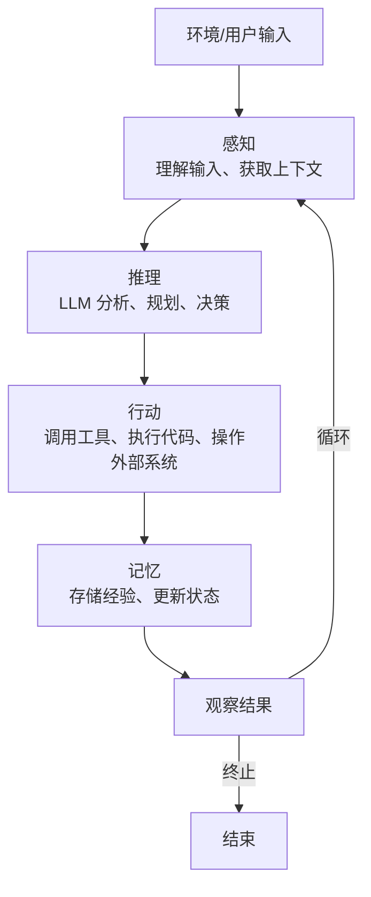

## Agent 四大组件

| 组件 | 说明 | 技术实现 |
| ------ | ------ | --------- |
| Brain (大脑) | 推理和决策 | LLM (GPT-4, Claude 等) |
| Perception (感知) | 接收环境信息 | 用户输入、传感器、API 返回 |
| Action (行动) | 执行操作 | Function Calling、代码执行、API 调用 |
| Memory (记忆) | 存储和检索信息 | 短期记忆（上下文窗口）、长期记忆（向量数据库） |

## Agent vs Chain

| 维度 | Chain | Agent |
| ------ | ------- | ------- |
| 执行方式 | 预定义的线性流程 | 动态决策，自主选择工具 |
| 灵活性 | 低（固定流程） | 高（适应不同输入） |
| 可控性 | 高（流程确定） | 中（依赖 LLM 决策） |
| 适用场景 | 流程明确的任务 | 开放性、探索性任务 |
| 调试难度 | 低 | 高（决策路径不确定） |
| 代表框架 | LangChain LCEL | LangChain Agent, AutoGPT |

## 工具使用 (Tool Use)

> 说明：Agent 调用工具依赖两项核心能力——**Function Calling（函数调用，让 LLM 输出结构化调用请求）** 与 **MCP（Model Context Protocol，模型上下文协议，标准化工具接入方式）**。详见 [[25-Function-Calling工具调用]] 和 [[26-MCP协议核心概念]]。

Agent 的能力很大程度上取决于它可以使用的工具：

| 工具类型 | 示例 |
| --------- | ------ |
| 信息检索 | 搜索引擎、知识库查询 |
| 计算 | 计算器、Python 执行 |
| 数据操作 | SQL 查询、文件读写 |
| API 调用 | 天气查询、股价获取 |
| 系统操作 | 发送邮件、创建文件 |
| 浏览器 | 网页浏览、表单填写 |

详见 [[25-Function-Calling工具调用]] 和 [[26-MCP协议核心概念]]。

## 常见 Agent 框架

| 框架 | 特点 | 适用场景 |
| ------ | ------ | --------- |
| LangChain | 生态最完善，工具最丰富 | 通用 Agent 开发 |
| LangGraph | 基于图的状态机，支持循环 | 复杂工作流 |
| AutoGPT | 全自主，最少人工干预 | 探索性任务 |
| MetaGPT | 多角色协作 | 软件开发 |
| CrewAI | 角色扮演，团队协作 | 多 Agent 协作 |

---

---

> **本篇建立在哪篇之上**：② RAG vs Agent 本质区别（你已知道 Agent 比 RAG 多了「主动规划 + 调工具 + 反馈回路」）。本篇就把这个「能办事的 Agent」拆开，讲清它肚子里四块积木分别干嘛。前置基础：知道 LLM 是「生成文本的大脑」即可，工具/记忆/规划本篇当场讲清。

> **目标**：零基础读者读完，能画出 Agent 的四要素架构图，说清每块职责，并理解为什么少一块都转不起来；能讲 ReAct 循环。

## 0. 先讲人话（生活化类比开篇）

把 Agent 想象成**一个被派去办事的新人同事**。他要能干活，得有四样东西：

- **LLM = 他的大脑**：负责理解老板意图、想下一步咋办、把结果说成人话。

- **工具（Tools）= 他的手和脚**：大脑只能想，不能真去查数据库、发邮件。手脚让他「做得了事」。

- **记忆（Memory）= 他的笔记本**：记着刚才聊了啥、历史经验是啥，不然每次都像失忆重启。

- **规划（Planning）= 他的任务清单**：接到「安排出差」这种大活，得先拆成「查天气→比价→订票→排日程」，再一步步来。

四块的关系一句人话：**规划决定做什么，大脑决定怎么想，手脚负责怎么做，笔记本记住做过啥**（来源：learn2pro.tech《Agent 架构全景》2026；cnblogs《拆解 Agent 的神经系统》）。少一块，这个人就瘸了——没规划就乱撞，没记忆就失忆，没工具就只能嘴炮，没大脑就根本不存在。

## 1. 它是什么 / 为什么需要四要素

一个只会「问答」的 LLM 为什么变不成 Agent？因为 LLM 本身有三个硬伤（来源：腾讯云《解读 Function Calling》2025；meta-intelligence《Function Calling 完全指南》）：

1. **知识会过期**：训练截止后的事它不知道。

2. **碰不了真实世界**：查不了实时股价、调不了 API、改不了数据库——它的输出只是文本 token，不产生任何外部副作用。

3. **不会自主多步办事**：一问一答，不会自己拆任务、看结果、再调整。

四要素就是给 LLM 补齐这三块短板的「外挂套装」。下面逐个拆。

## 2. 四要素逐一拆解
### 2.1 LLM —— 大脑（决策中枢）

**LLM（Large Language Model，大语言模型）** 是 Agent 的推理核心。它读上下文窗口（目标 + 工具结果 + 历史），决定「下一步调哪个工具 / 说什么」。注意：**它只决策，不亲自执行代码、不亲自上网**（来源：devshelfhub《Core Components of an AI Agent》）。

实践里通常用 System Prompt 给它「装操作手册」——设定角色、约束行为边界、规定输出格式。你项目用 DeepSeek V4 Pro 当 Chat 模型，就是这块大脑。（来源：MEMORY 项目事实）

### 2.2 工具（Tools）—— 手脚

**Tools（工具）** 是 Agent 能调用的函数：搜网页、跑代码、查数据库、调 API、读文件、发邮件。**没有工具的 Agent 就是个聊天机器人**——只能说，不能做（来源：learn2pro.tech 2026）。

设计经验（来源 devshelfhub 2025）：每个工具只干一件事、返回纯文本结果；工具总数控制在 10 个以内，超过后 LLM 选择准确率会掉。你项目 MCP 的 5 个 Tool（`search_knowledge_base` / `rerank_results` / `generate_answer` / `analyze_resume` / `rewrite_query`）就是典型「原子化工具」设计。下一篇 ④ 会专门讲工具系统。

### 2.3 记忆（Memory）—— 笔记本

**Memory（记忆）** 分两种（来源：CSDN《如何理解 AI Agent》2026；tyritic《Agent 的核心组件》）：

- **短期记忆（Short-term）**：当前对话的上下文窗口——用户刚说的、Agent 的推理过程、上一步工具返回。受上下文长度限制，长了就摘要/滑动窗口压缩。

- **长期记忆（Long-term）**：跨会话持久化的外部存储，通常用**向量数据库**（你项目用 ChromaDB，每份简历独立 collection）。需要时通过 RAG 检索召回，让 Agent「越用越聪明」。

你项目的 `MemorySaver` checkpointer 就是短期记忆的落盘机制（LangGraph 状态快照），保证 Reflexion 循环里能回看历史步骤。

### 2.4 规划（Planning）—— 任务清单

**Planning（规划）** 是 Agent 区别于「简单问答」的关键标志：把复杂目标拆成可执行子步骤，并根据中间结果动态调整（来源：CSDN 2026；tyritic）。主流规划策略两类：

- **无反馈规划 = ReAct（Reasoning + Acting）**：交替「思考 Thought → 行动 Action → 观察 Observation」，最经典、最常用（覆盖约 80% 场景）。

- **带反馈规划 = Reflexion（反思）**：失败后对原因自我反思、修正策略重来，更接近人类解决问题（来源 tyritic）。你项目 ≤2 轮的 Reflexion 循环就是这类。

## 3. 四要素怎么咬合：ReAct 循环

四要素不是摆设，是靠一个循环转起来的——**ReAct 循环**（来源：Yao et al. 2022；cnblogs 2026）。看这张图：

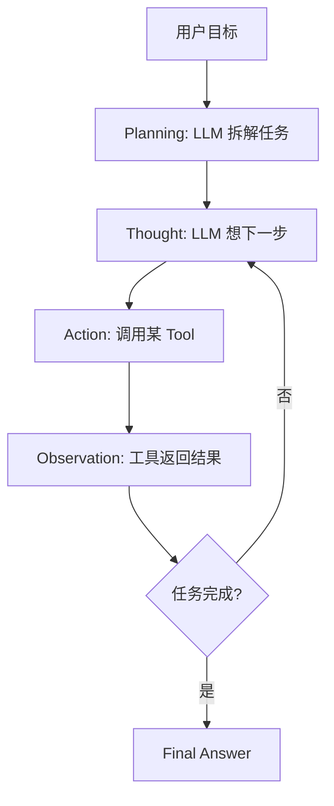

每一步：大脑（LLM）先**想**（Thought），再决定**做**（Action=调工具），工具回**观察**（Observation），大脑基于观察再想下一步。这个「想—做—看」交替，正是 ② 里说的 Agent 那条「带回路的环」。（来源：cnblogs《拆解 Agent 四大要素》）

### 3.1 四要素职责对照表

| 要素 | 类比 | 负责什么 | 没了会怎样 |
|-|-|-|-|
| LLM | 大脑 | 理解意图、推理、决策 | 根本不存在 Agent |
| Tools | 手脚 | 执行真实动作、连外部世界 | 只能嘴炮，不能办事 |
| Memory | 笔记本 | 记上下文/历史经验 | 每次失忆重启，无法多轮 |
| Planning | 任务清单 | 拆任务、定顺序、调策略 | 面对复杂活乱撞 |

（来源综合：learn2pro.tech 2026 / devshelfhub 2025 / CSDN 2026）

## 4. 常见误区

- ❌ **「LLM 自己就能当 Agent」** → 错。裸 LLM 只能生成文本，碰不了真实世界、不会多步办事。四要素缺工具/规划就还是聊天机器人。（来源 learn2pro.tech）

- ❌ **「记忆就是聊天记录」** → 不全对。短期记忆是上下文窗口，长期记忆是外部持久化存储（向量库），二者机制不同；长对话还要靠摘要/压缩，不能无脑塞。

- ❌ **「规划越复杂越好」** → 错。ReAct 已覆盖 80% 场景且最好调试；只有 Agent  consistently 失败在「不会前瞻」时才上 plan-and-execute（来源 devshelfhub）。

- ❌ **「工具越多越牛」** → 错。工具超 10 个，LLM 选择准确率明显下降；每个工具应原子化、描述清晰（来源 devshelfhub 2025）。

## 5. 核心要点

- **四要素**：LLM（大脑/决策）+ Tools（手脚/行动）+ Memory（笔记本/上下文与经验）+ Planning（任务清单/拆解与调整）。

- **关系口诀**：规划定做什么，大脑想怎么想，手脚做怎么做，笔记本记做过啥。

- **ReAct 三拍**：Thought（想）→ Action（调工具）→ Observation（看结果），循环到完成。是 Agent 最主流执行模式（≈80% 场景）。

- **Reflexion**：带反馈的规划，失败后自我反思改策略重来——你项目 ≤2 轮 Reflexion 即此。

- **记忆两类**：短期=上下文窗口（受长度限制）；长期=向量库持久化（RAG 召回）。

- **一句串项目**：DeepSeek V4 Pro（大脑）+ 5 个 MCP Tool（手脚）+ ChromaDB/MemorySaver（记忆）+ LangGraph StateGraph 9 节点规划 + Reflexion（规划反馈）。

## 6. 简历项目绑定：具体改进方向

基于你项目 `ai-resume-analyzer` 真实架构（LangGraph StateGraph 9 节点 + 3 条件边 + MemorySaver + Reflexion ≤2 轮 + 5 个 MCP Tool），对照四要素，有一个**具体可落地的增强点**——把「长期记忆 / 经验复用」从「只有对话级」升级到「跨用户可复用」：

**改进 1：用长期记忆沉淀「高频问题经验库」，让规划更聪明（对应 Memory 要素）**

- **差距**：你项目当前 `MemorySaver` 是**单会话短期记忆**（checkpointer 存本次对话的状态快照，支撑 Reflexion 回看本轮回合）。但它不跨会话沉淀「哪些 query 该走哪条检索策略、哪些简历类型容易触发拒答」这类**长期经验**。每次新会话都从零规划，等于 ② 说的「失忆重启」。

- **具体改动点**：

  - 文件定位：在现有检索/规划模块（`graph.py` 或 `mcp_nodes.py`）新增一个 `experience_retriever`，把每轮的「query 类型 → 最佳检索参数 / 是否拒答」写入 ChromaDB 的一个独立 experience collection（你项目已是「每份简历独立 collection」，加一个全局经验库同机制）。

  - 在 Planning 节点前，先用 `experience_retriever` 召回相似历史经验，作为 LLM 规划时的「Few-shot 参考」注入 System Prompt。

  - 复用现有 `rerank_score < 0.3 拒答阈值` 逻辑：把「触发拒答的 query 模式」沉淀进经验库，下次同类 query 直接预判。

- **风险**：经验库若写入错误经验会「越学越歪」；需加经验置信度过滤（只有被 Final Answer 采纳且用户无追问的经验才入库）。

- **收益**：高频问题规划更稳更快、少走弯路；可讲「我的 Agent 有四要素里的长期记忆，能跨会话积累经验复用，不是每次失忆」——直接回应 ②/③ 的知识点。

- **一句话讲清**：「我项目短期记忆用 LangGraph MemorySaver 做 Reflexion 回看；我还在做长期记忆增强——把每轮『query 类型→检索策略』沉淀进 ChromaDB 经验库，下次同类问题直接召回当 Few-shot，让规划模块越用越聪明。」

## 下一篇预告

下一篇 **④ 工具系统（定义 → 注册 → 发现 → 调用）**——本篇你明白了「工具是 Agent 的手脚，没它只能嘴炮」。下一篇就专门把这块讲透：一个函数怎么变成 LLM 能调用的工具？工具描述（JSON Schema）怎么写模型才调得准？模型调了之后谁来真正执行？带着本篇四要素的框架，下一篇会非常顺。

---

---

## 开篇：Agent 到底多了什么？

Day 14 学了 LLM 的本质（参数做数学运算 → 输出文字）。Day 15 学了 LangChain（把拼消息→调API→拆响应工程化）。

**今天要回答的问题：让 LLM 从"能说"变成"能做"，到底多了什么？**

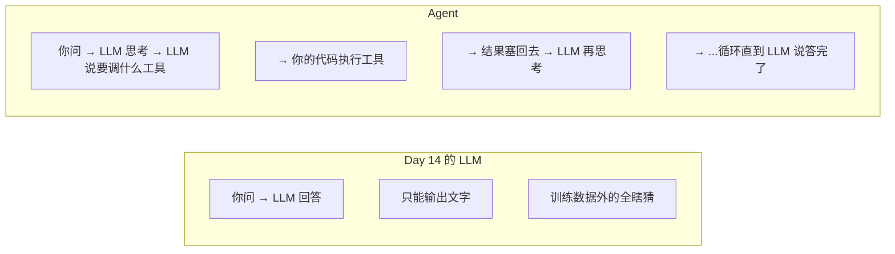

**Agent 多出来的三个东西：**

1. 工具（Tool）— LLM 的手。能查天气、调 API、读文件、写数据库

2. 循环（Loop）— LLM 不是一次回答，而是"想→做→看结果→再想"

3. 决策（Reasoning）— LLM 自己判断"现在该用哪个工具、传什么参数、什么时候停"

> [!note] Agent = LLM + 工具 + 循环。LLM 负责决策（"该调什么"），你的代码负责执行（"真的去调"），循环负责串联。

---

## 第一章：Function Calling — 让 LLM "伸手"的机制
### 一个问题秒懂

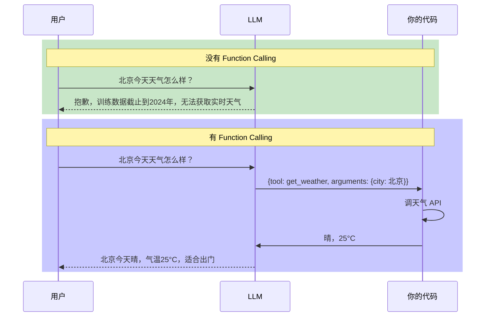

### Function Calling 的物理过程

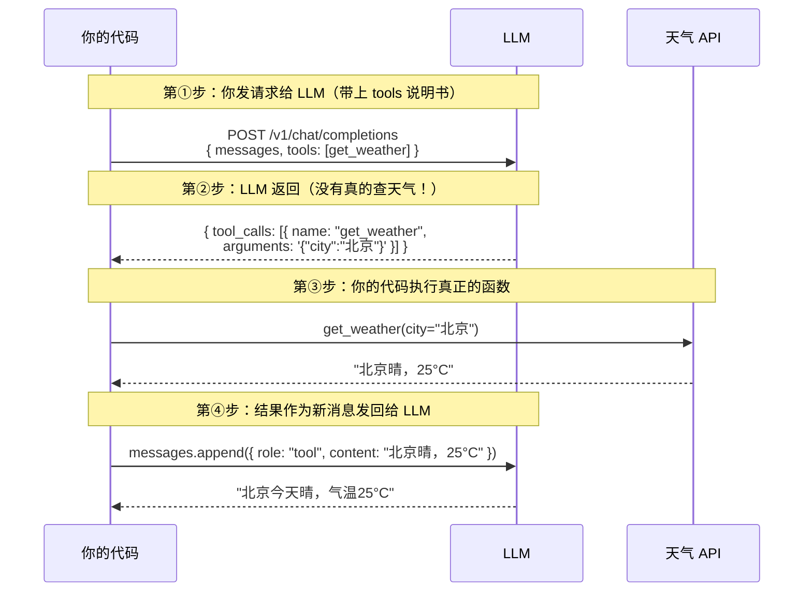

> [!note] LLM **从不执行函数**。它只输出一个 JSON 说"我想调 X 函数，参数是 Y"。你的代码收到这个 JSON 后去执行，结果塞回对话上下文。**模型的职责 = 决策，代码的职责 = 执行。**

### 工具定义的五个要素

```python

tool_definition = {

    "type": "function",

    "function": {

        "name": "get_weather",                 # 工具名：唯一标识

        "description": (                       # 描述：LLM 靠这个判断何时用

            "查询指定城市的实时天气，返回温度、湿度、天气状况。"

        ),

        "parameters": {

            "type": "object",

            "properties": {

                "city": {

                    "type": "string",

                    "description": "城市名，中文，如'北京'",

                },

                "unit": {

                    "type": "string",

                    "enum": ["celsius", "fahrenheit"],

                    "description": "温度单位",

                },

            },

            "required": ["city"],

        },

    },

}

```

| 要素 | LLM 用它做什么 | 写烂了的后果 |
|------|---------------|-------------|
| `name` | 指定"我要调哪个工具" | 名字太像另一个工具 → 选错 |
| `description` | 判断"什么时候该调" | 该调不调，不该调乱调 |
| `parameters.properties` | 知道"要传什么参数" | 参数名写错 → LLM 瞎编 |
| `parameters.enum` | 限制参数取值范围 | `unit: "摄氏度"` |
| `required` | 知道"哪些参数必须传" | 漏传必填参数 → 报错 |

### 手动实现一次 Function Calling

```python

import os

import json

from openai import OpenAI

# ① 真正要执行的函数

def get_weather(city: str, unit: str = "celsius") -> str:

    data = {

        "北京": {"celsius": "晴，25°C", "fahrenheit": "晴，77°F"},

        "上海": {"celsius": "多云，28°C", "fahrenheit": "多云，82°F"},

    }

    return data.get(city, {}).get(unit, f"未找到{city}的天气数据")

def calculator(expression: str) -> str:

    allowed_chars = set("0123456789+-*/().% ")

    if not all(c in allowed_chars for c in expression):

        return "错误：表达式包含不允许的字符"

    try:

        return str(eval(expression))

    except Exception as e:

        return f"计算错误：{e}"

# ② 工具的"说明书"

TOOLS = [

    {

        "type": "function",

        "function": {

            "name": "get_weather",

            "description": "查询指定城市的实时天气。当用户问'某地天气'时使用。",

            "parameters": {

                "type": "object",

                "properties": {

                    "city": {"type": "string", "description": "城市名，中文"},

                    "unit": {"type": "string", "enum": ["celsius", "fahrenheit"]},

                },

                "required": ["city"],

            },

        },

    },

    {

        "type": "function",

        "function": {

            "name": "calculator",

            "description": "计算数学表达式。当用户需要算数时使用。",

            "parameters": {

                "type": "object",

                "properties": {

                    "expression": {"type": "string", "description": "数学表达式"},

                },

                "required": ["expression"],

            },

        },

    },

]

TOOL_MAP = {"get_weather": get_weather, "calculator": calculator}

client = OpenAI(

    api_key=os.environ["DEEPSEEK_API_KEY"],

    base_url="https://api.deepseek.com",

)

# ③ 核心：一次对话回合

def run_agent_turn(messages: list[dict]) -> list[dict]:

    response = client.chat.completions.create(

        model="deepseek-v4-pro",

        messages=messages,

        tools=TOOLS,

        tool_choice="auto",

        temperature=0.0,

    )

    msg = response.choices[0].message

    if not msg.tool_calls:

        messages.append({"role": "assistant", "content": msg.content})

        return messages

    messages.append({

        "role": "assistant",

        "content": msg.content or "",

        "tool_calls": [{"id": tc.id, "type": "function",

                        "function": {"name": tc.function.name, "arguments": tc.function.arguments}}

                       for tc in msg.tool_calls],

    })

    for tc in msg.tool_calls:

        func = TOOL_MAP[tc.function.name]

        args = json.loads(tc.function.arguments)

        result = func(**args)

        print(f"🔧 执行工具: {tc.function.name}({args}) → {result}")

        messages.append({"role": "tool", "tool_call_id": tc.id, "content": result})

    return messages

# 测试

if __name__ == "__main__":

    messages = [{"role": "user", "content": "北京今天天气怎么样？"}]

    messages = run_agent_turn(messages)

    messages = run_agent_turn(messages)

    print(f"最终回复: {messages[-1]['content']}")

```

### Function Calling 运行时变量速查

| 变量 | 类型 | 实际值 |
|------|------|--------|
| `msg.tool_calls` | `list` | `[{id, type, function}]` |
| `tc.function.name` | `str` | `"get_weather"` |
| `tc.function.arguments` | **`str`** | `"{\"city\":\"北京\"}"` ⚠️ 是字符串不是 dict |
| `args = json.loads(...)` | `dict` | `{"city": "北京"}` |
| `func(**args)` | — | `func(city="北京")` |

> [!warning] **最容易搞混的一个**：`tc.function.arguments` 是**字符串**，必须 `json.loads()` 解析后才能当 dict 用。

### 并行调用 vs 串行调用

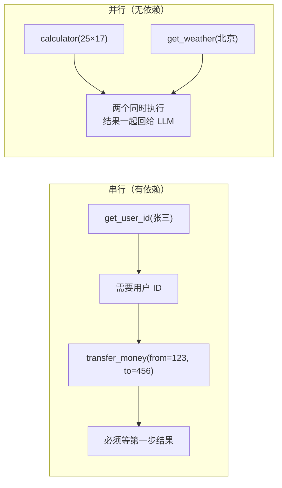

> [!tip] 参数里有没有上一步的输出？有 → 串行。没有 → 可以并行。这是 Agent 效率的核心——尽量让 LLM 把互不依赖的工具调用打包成一轮。

---

## 第二章：ReAct — Agent 的"呼吸节奏"
### ReAct 是什么

> ReAct = Reasoning（推理）+ Acting（行动）。Google + Princeton 2022 年的论文提出。核心思想：让 LLM 交替输出"思考"和"行动"，而不是一步到位给答案。

有 ReAct 的 Agent 工作流程：

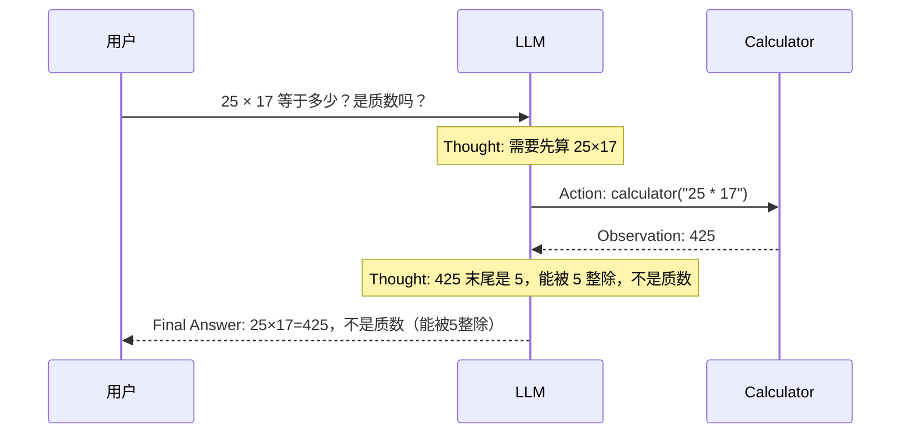

### ReAct 循环的可视化

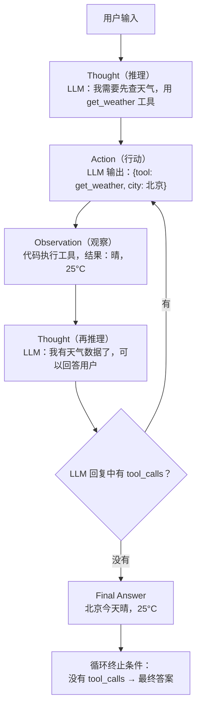

### 所有框架殊途同归的 6 行核心循环

不管你用 LangChain、OpenAI Agents SDK、Anthropic Claude Agent SDK——底层全是这个：

```python

# 这就是 Agent 的全部秘密。六行代码。

while not done:

    response = call_llm(messages, tools)              # ① 调 LLM，带上工具列表

    if response.has_tool_calls():                     # ② LLM 说"我要调工具"？

        results = execute_tools(response.tool_calls)   # ③ 你的代码执行

        messages.extend(results)                      # ④ 结果塞回对话上下文

    else:                                             # ⑤ LLM 没说要调工具

        done = True                                   # ⑥ → 这就是最终答案，停

        return response.text

```

**优雅之处**：tool_calls 的存在与否就是循环的"继续"和"停止"信号。不需要额外的分类器、不需要特殊标记。LLM 决定何时停。

> [!note] Agent 循环不是 LLM 在跑——是你的 `while` 循环在跑。每次循环调一次 LLM。LLM 只负责说"下一步干什么"，你的代码负责执行和判断。

### 为什么 ReAct 比"一步到位"强

| | 一步到位（纯 LLM） | ReAct Agent |
|------|------|------|
| 数学计算 | 靠"记忆"算，大数容易错 | 调 calculator，精确 |
| 实时信息 | 训练数据截止后的全瞎猜 | 调搜索/天气 API |
| 复杂多步任务 | "一口气"回答，中间步骤不可见 | 每步可观察、可纠错 |
| 出错时 | 不知道哪一步错了 | 从 Observation 能看到哪步出问题 |
| Token 消耗 | 1 次调用 | N 次调用（每次带全量上下文） |

**代价也很明显**：Agent 的 Token 消耗是普通对话的 ~4 倍（Anthropic 2026 数据）。

### ReAct 的变体：Plan-and-Execute

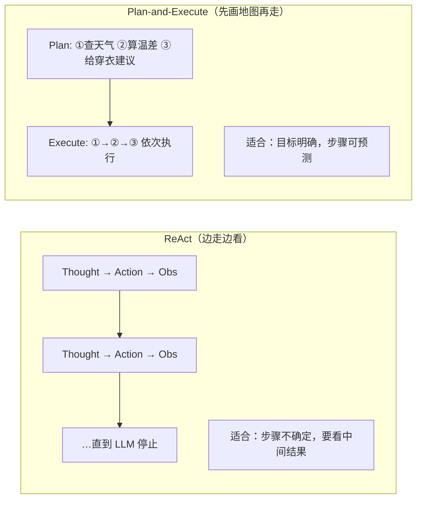

你的简历分析项目就是典型的 Plan-and-Execute——解析→提取→评分→落库，步骤是固定的。

---

## 第三章：Tool 设计原则
### 工具设计铁律

```text

铁律 1: 少而精 > 多而全

  超过 30~50 个工具后，LLM 选错工具的比率线性上升。

铁律 2: 高内聚任务级工具 > 零散 CRUD

  ❌ list_users() + list_events() + create_event()  3 个零散工具

  ✅ schedule_event(user, time, description)        1 个任务级工具

铁律 3: 枚举约束 > 自由文本

  ❌ status: string

  ✅ status: "approved" | "rejected" | "pending"

铁律 4: 数字必须设上下限

  ❌ amount: number

  ✅ amount: number, minimum=1, maximum=100000

铁律 5: 参数命名无歧义

  ❌ from, to           → 容易搞反

  ✅ from_account_id, to_account_id

```

### 工具返回错误的方式

```python

# ❌ 错误：抛异常

def transfer_money(from_id: str, to_id: str, amount: float) -> str:

    if amount <= 0:

        raise ValueError("金额必须大于 0")  # ← LLM 看不到！

# ✅ 正确：返回错误字符串

def transfer_money(from_id: str, to_id: str, amount: float) -> str:

    if amount <= 0:

        return "错误：转账金额必须大于 0。请修正后重试。"

    return f"成功从 {from_id} 向 {to_id} 转账 {amount} 元"

```

> [!tip] Exception → Agent 循环炸了。Error String → LLM 读到错误，自己纠正。**工具的错误信息是给 LLM 看的，不是给你的日志系统看的。**

### 工具的 description 怎么写

```python

# ❌ 糟糕的 description

"获取天气"

# ✅ 好的 description

(

    "查询指定城市的实时天气，返回温度、湿度、天气状况。"

    "当用户询问以下内容时使用此工具："

    "  - 某地当前的天气情况"

    "  - 今天/明天会不会下雨"

    "不要用此工具查询："

    "  - 历史天气（用 get_historical_weather）"

)

```

### 上下文成本真相

Manus 团队的生产数据（2026）：

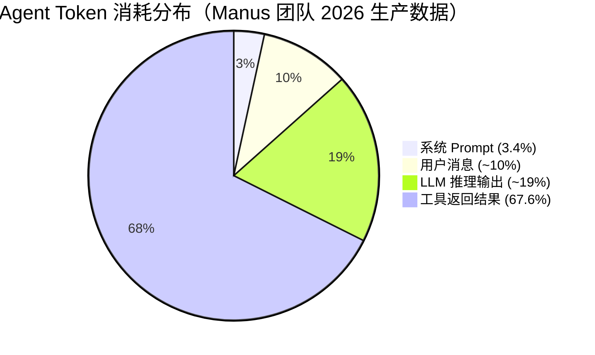

> [!note] 优化工具返回结果的 Token 量，比优化 System Prompt 重要 20 倍。

---

## 第四章：手写一个完整 ReAct Agent（不用框架）

```python

import os

import json

from openai import OpenAI

# ① 定义工具函数

def get_weather(city: str, unit: str = "celsius") -> str:

    data = {

        "北京": {"celsius": "晴，25°C，湿度40%", "fahrenheit": "晴，77°F"},

        "上海": {"celsius": "多云，28°C，湿度65%", "fahrenheit": "多云，82°F"},

    }

    return data.get(city, {}).get(unit, f"未找到{city}的天气数据")

def search_knowledge(query: str) -> str:

    knowledge = {

        "Python": "Python 是一种解释型高级编程语言，广泛用于 Web 开发、数据科学和 AI。",

        "FastAPI": "FastAPI 是一个现代 Python Web 框架，基于 Starlette + Pydantic。",

        "RAG": "RAG 将外部知识库检索结果注入 LLM 上下文，减少幻觉。",

    }

    for key, value in knowledge.items():

        if key.lower() in query.lower():

            return value

    return f"未找到关于'{query}'的相关知识"

def calculator(expression: str) -> str:

    allowed = set("0123456789+-*/().% ^")

    if not all(c in allowed for c in expression):

        return "错误：表达式包含不允许的字符"

    try:

        return str(eval(expression.replace("^", "**")))

    except Exception as e:

        return f"计算错误：{e}"

# ② 工具定义

TOOLS = [{...}, {...}, {...}]  # 与上一章类似，略

TOOL_MAP = {"get_weather": get_weather, "search_knowledge": search_knowledge,

            "calculator": calculator}

# ③ ReAct Agent 核心循环

class SimpleReactAgent:

    def __init__(self, client: OpenAI, model: str, tools: list, tool_map: dict):

        self.client = client

        self.model = model

        self.tools = tools

        self.tool_map = tool_map

        self.max_steps = 10

    def run(self, user_input: str, system_prompt: str = "你是一个有用的助手") -> str:

        messages = [

            {"role": "system", "content": system_prompt},

            {"role": "user", "content": user_input},

        ]

        for step in range(1, self.max_steps + 1):

            print(f"\n--- 第 {step} 轮 ---")

            response = self.client.chat.completions.create(

                model=self.model, messages=messages, tools=self.tools,

                tool_choice="auto", temperature=0.0,

            )

            msg = response.choices[0].message

            if not msg.tool_calls:

                print(f"✅ Agent 回答: {msg.content[:100]}...")

                return msg.content

            tool_call_msgs = []

            for tc in msg.tool_calls:

                tool_call_msgs.append({"id": tc.id, "type": "function",

                    "function": {"name": tc.function.name, "arguments": tc.function.arguments}})

            messages.append({"role": "assistant", "content": msg.content or "",

                             "tool_calls": tool_call_msgs})

            for tc in msg.tool_calls:

                func = self.tool_map[tc.function.name]

                args = json.loads(tc.function.arguments)

                result = func(**args)

                print(f"🔧 {tc.function.name}({args}) → {result[:80]}")

                messages.append({"role": "tool", "tool_call_id": tc.id, "content": result})

        return "错误：Agent 超过最大循环步数"

# ④ 测试

if __name__ == "__main__":

    client = OpenAI(api_key=os.environ["DEEPSEEK_API_KEY"],

                    base_url="https://api.deepseek.com")

    agent = SimpleReactAgent(client=client, model="deepseek-v4-pro",

                             tools=TOOLS, tool_map=TOOL_MAP)

    result = agent.run("北京今天天气怎么样？")

    print(f"\n最终结果:\n{result}")

```

---

## 第五章：LangChain `create_agent` — 一行创建 Agent
### 上手

```python

from langchain.agents import create_agent

from langchain_openai import ChatOpenAI

from langchain_core.tools import tool

@tool

def get_weather(city: str, unit: str = "celsius") -> str:

    """查询指定城市的实时天气。当用户询问某地当前天气时使用。"""

    data = {"北京": "晴，25°C", "上海": "多云，28°C"}

    return data.get(city, f"未找到{city}的天气数据")

@tool

def calculator(expression: str) -> str:

    """计算数学表达式。当用户需要算数时使用。"""

    allowed = set("0123456789+-*/().% ")

    if not all(c in allowed for c in expression):

        return f"错误：表达式含非法字符"

    try:

        return str(eval(expression))

    except Exception as e:

        return f"计算错误：{e}"

model = ChatOpenAI(api_key=os.environ["DEEPSEEK_API_KEY"],

                   base_url="https://api.deepseek.com",

                   model="deepseek-v4-pro", temperature=0.0)

agent = create_agent(

    model=model,

    tools=[get_weather, calculator],

    system_prompt="你是一个有用的助手，可以使用工具来回答用户问题。",

)

result = agent.invoke({

    "messages": [{"role": "user", "content": "北京天气怎么样？25*17等于多少？"}],

})

final_messages = result["messages"]

print(final_messages[-1].content)

```

### `create_agent` 底层在做什么

你调用 `create_agent` 的时候，LangChain 自动在 LangGraph 里构建了这张图：

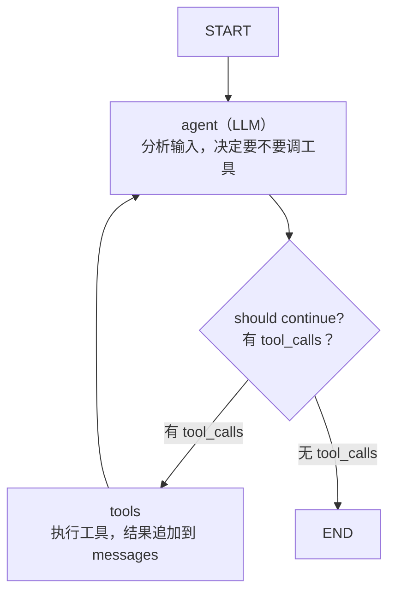

**和手写的区别**：手写是 `while` 循环，`create_agent` 是 LangGraph 的 StateGraph。底层逻辑一模一样，LangGraph 多了持久化/断点续跑/人工审批等能力。

### Middleware：无侵入扩展 Agent

`create_agent` 最大的创新是 Middleware 系统——6 个标准 Hook 点：

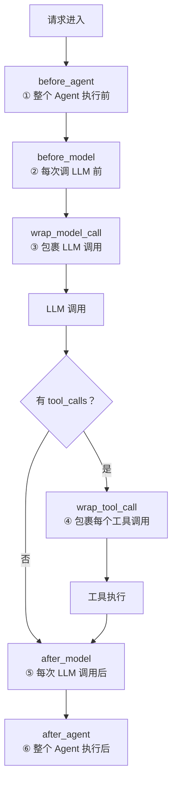

```python

# 实用例子：加人工审批

from langchain.agents.middleware import HumanInTheLoopMiddleware

agent = create_agent(

    model=model,

    tools=[transfer_money, check_balance],

    middleware=[HumanInTheLoopMiddleware()],

)

# 实用例子：自动压缩超长上下文

from langchain.agents.middleware import SummarizationMiddleware

agent = create_agent(

    model=model,

    tools=[...],

    middleware=[SummarizationMiddleware(max_tokens=2000)],

)

```

---

## 第六章：Agent vs Workflow
### 定义

```text

Workflow（工作流）= LLM + 工具 + 固定代码路径

  你提前写好了"第1步→第2步→第3步"，LLM 只在需要推理的地方出场

Agent（智能体）= LLM + 工具 + LLM 自己决定路径

  LLM 自己判断下一步干什么、调什么工具、什么时候停

```

### 决策框架

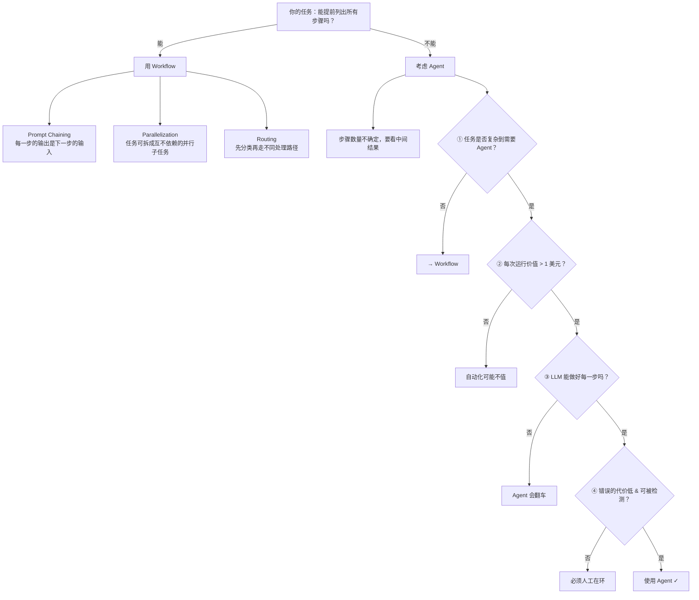

---

## 速查表
### Function Calling 最小请求

```python

response = client.chat.completions.create(

    model="deepseek-v4-pro",

    messages=[{"role": "user", "content": "北京天气？"}],

    tools=[{ "type": "function", "function": { "name": "get_weather", ... } }],

    tool_choice="auto",

)

```

### Agent 循环骨架

```python

while not done:

    response = call_llm(messages, tools)

    if response.tool_calls:

        for tc in response.tool_calls:

            result = execute(tc.name, tc.arguments)

            messages.append({"role": "tool", "tool_call_id": tc.id, "content": result})

    else:

        done = True

        return response.text

```

### LangChain create_agent

```python

from langchain.agents import create_agent

from langchain_openai import ChatOpenAI

agent = create_agent(ChatOpenAI(model="..."), tools=[...])

result = agent.invoke({"messages": [{"role": "user", "content": "..."}]})

```

### Tool 设计速记

```text

✅ 任务级工具（schedule_event）  >  ❌ CRUD 零散工具

✅ enum 约束参数                 >  ❌ 自由文本

✅ minimum/maximum 约束数字       >  ❌ 裸 number

✅ 返回错误字符串                 >  ❌ 抛异常

✅ description 写"何时用何时不用" >  ❌ "获取XX"

✅ 工具返回结果精简               >  ❌ 全量 JSON 原样返回

```

### Agent vs Workflow

```text

能提前列出所有步骤？→ Workflow

步骤数取决于中间结果？→ Agent

```

---

##

> ▶ 对应实操：[[23-MCPTool-Resource定义与注册模式|23-MCP Tool-Resource 定义与注册模式]]

> ▶ 对应实操：[[15-Agent架构与工具调用|15-Agent架构与工具调用]]

相关链接

- 目录：[[00-AI]]

- 上一篇：[[13-RAG检索增强生成]]

- 下一篇：[[31-LangChain框架]]

---

→ [[八股文学习路线图#Agent 架构（核心）]]

## 速记卡（面试闪卡）

**Q1：一句话讲清「Agent 架构与核心组件」到底是什么？**

A：Agent 是以 LLM 为大脑、配工具手脚与记忆笔记本、能自主办事的自主系统。

**Q2：一、什么是 AI Agent 与四大组件 —— 怎么理解？**

A：像给困在房间里的顾问配手脚眼睛：LLM 是大脑(决策)、Perception 是感知(收环境)、Action 是行动(调工具/API)、Memory 是记忆(短期=上下文窗口、长期=向量库)。少一块就瘸——没工具只能嘴炮，没记忆每次失忆。

**Q3：二、Agent vs Chain 与工具使用 —— 怎么理解？**

A：像固定流程 vs 自由探索：Chain 是预定义线性流水线(可控好调试)；Agent 是动态决策自选工具(灵活难调)。工具靠两项能力——Function Calling(让 LLM 输出结构化调用请求)与 MCP(标准化接入)，工具越多选错率越高要原子化。

**Q4：三、ReAct 循环 —— 怎么理解？**

A：像呼吸节奏：Thought(想)→Action(调工具)→Observation(看结果)交替，循环到完成，覆盖约 80% 场景。带反馈的 Reflexion 失败后自我反思改策略重来。规划定做什么、大脑想怎么想、手脚做怎么做、笔记本记做过啥。

**Q5：四、工具设计原则与 Agent vs Workflow —— 怎么理解？**

A：像写工具说明书铁律：少而精(超 30-50 选错率升)、任务级>零散 CRUD、枚举约束>自由文本、数字设上下限、错误返字符串而非抛异常(异常炸循环)。能提前列步骤→Workflow，看中间结果→Agent，且价值>1 刀、错误可检测才上。

**Q6：核心速记主线有哪些？**

- 四积木：LLM(大脑)+Perception+Action+Memory，少一块就瘸

- 四能力：感知/推理/行动/记忆，让模型从"能说"变"能做"

- ReAct：Thought→Action→Observation 三拍循环，80% 场景主流

- 设计：工具原子化返字符串、Agent vs Workflow 按步骤确定性选

**口诀**

A：Agent 四积木，脑感行记齐；

LLM 是大脑，工具当手足。

ReAct 三拍转，想做看循环；

工具原子化，错返字符串不抛异。

## 相关链接

- [[八股文学习路线图]]

- [[00-全局导航|全局导航]]

---

## 快速问答

| 问题 | 参考答案 |
| ------ | --------- |
| Agent 和 Chain 的核心区别？ | Chain 是预定义的线性流程，Agent 是动态决策自主选择工具。Agent 更灵活但更难控制和调试 |
| Agent 的四大组件是什么？ | Brain（LLM推理）、Perception（感知输入）、Action（工具调用）、Memory（记忆存储） |
| 什么时候用 Agent 而不是 Chain？ | 任务流程不确定、需要动态决策、需要调用多种工具、输入变化大时用 Agent。流程固定、确定性强的任务用 Chain |
| 如何评估 Agent 系统？ | ① 任务完成率 ② 步骤效率（用了多少步完成）③ 工具调用准确率 ④ 最终结果质量 ⑤ 安全性 |

