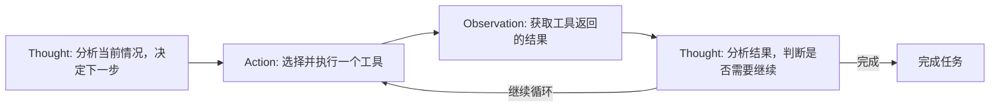
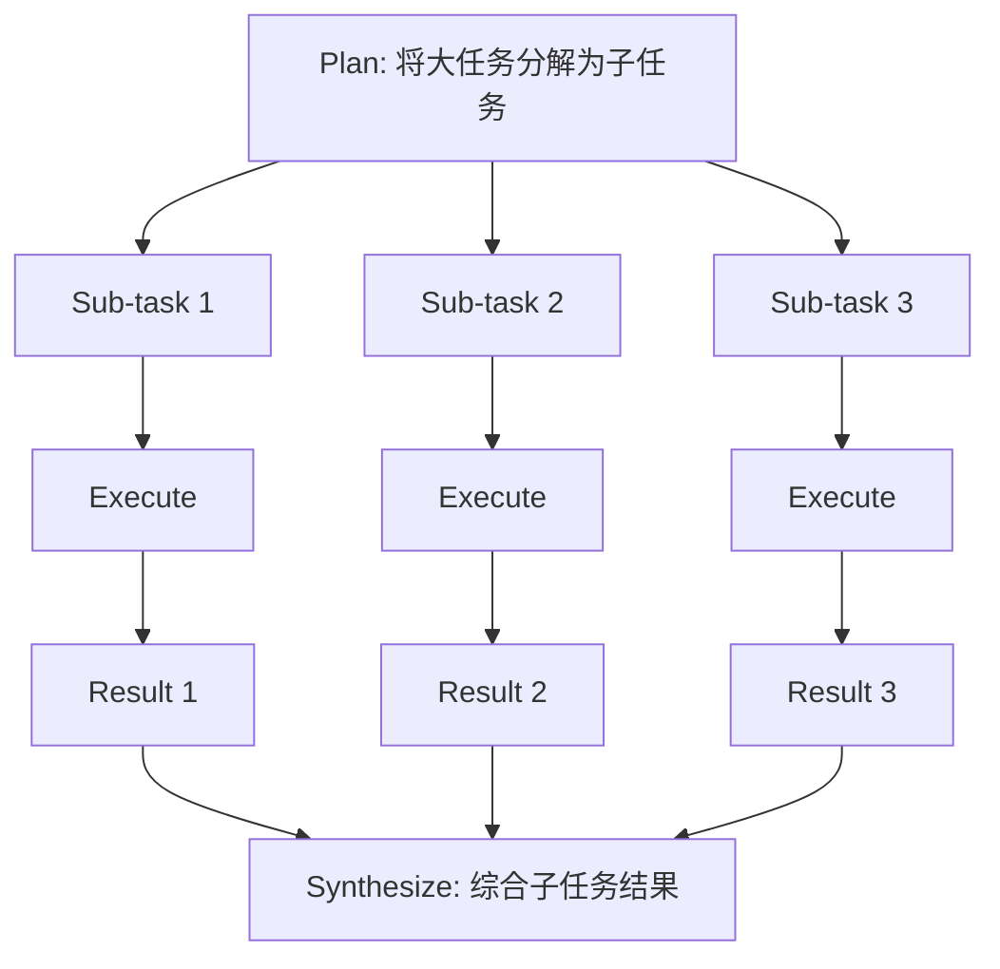

---

title: "ReAct框架与规划能力"

created: "2026-07-13"

tags:

  - 八股文

  - ai

---

# ReAct 框架与规划能力

> ReAct（Reasoning + Acting）是目前最主流的 Agent 推理模式，由 Yao et al. (2022) 提出。核心思想：将**推理（Thought）**和**行动（Action）**交替进行，让 Agent 像人一样"边想边做"。

## ReAct 核心思想

将**推理（Thought）**和**行动（Action）**交替进行：



## ReAct 示例

```text

问题：北京和上海哪个城市人口更多？

Thought 1: 我需要查找两个城市的人口数据

Action 1: search("北京 2024 人口")

Observation 1: 北京常住人口约2185万

Thought 2: 获得了北京的数据，现在查上海

Action 2: search("上海 2024 人口")

Observation 2: 上海常住人口约2487万

Thought 3: 两个数据都有了，可以比较了

Answer: 上海人口（约2487万）多于北京（约2185万）

```

## ReAct vs 其他模式

| 模式 | 说明 | 优缺点 |

| ------ | ------ | -------- |

| ReAct | 推理+行动交替 | 灵活，但可能循环 |

| CoT only | 只推理不行动 | 无法获取外部信息 |

| Act only (Tool use) | 只行动不推理 | 缺乏规划能力 |

| Plan & Execute | 先规划再执行 | 适合复杂任务，但不够灵活 |

## Planning 规划能力
### 简单任务：ReAct 逐步规划

对于简单任务，每一步动态决策即可。

### 复杂任务：分层规划



### 规划策略

| 策略 | 说明 | 适用场景 |

| ------ | ------ | --------- |

| 递归分解 | 将任务不断拆分为更小的子任务 | 复杂多步任务 |

| 任务图 | 构建有向无环图 (DAG)，明确依赖关系 | 并行可执行的任务 |

| 动态重规划 | 根据执行结果调整后续计划 | 不确定性高的任务 |

---

##

> ▶ 对应实操：[[24-Human-in-the-loop：人工介入兜底与敏感操作审批机制|24-Human-in-the-loop：人工介入兜底与敏感操作审批机制]]

> ▶ 对应实操：[[15-Agent架构与工具调用|15-Agent架构与工具调用]]

**口诀**

A：ReAct 边想边动手，

思考行动交替走；

复杂任务分多层，

递归图 DAG 动态谋。

## 速记卡（面试闪卡）

**Q1：一句话讲清「ReAct 框架与规划能力」到底是什么？**

A：ReAct 把"先想再动"交替循环，让 Agent 像人一样边推理边调用工具。

**Q2：一、ReAct 核心：Thought 与 Action 交替 —— 怎么理解？**

A：像做饭时边看菜谱边动手：先想"下一步该放盐"（Thought），再去拿盐（Action），看了结果再想——思考和行动循环推进。英文：Reason + Act。

**Q3：二、ReAct vs 其他模式：灵活但有循环风险 —— 怎么理解？**

A：像四种工作风格：只想不动（CoT）拿不到外部信息；只动不想（Act-only）没规划；先计划再执行（Plan&Execute）稳但僵；ReAct 灵活却可能绕圈。英文：Chain-of-Thought / Plan-and-Execute。

**Q4：三、简单任务：ReAct 逐步动态决策 —— 怎么理解？**

A：像走迷宫边走边看：每步根据当前情况决定下一动作，无需提前排好全部路线，适合短平快的小任务。英文：Step-by-step Reasoning。

**Q5：四、复杂任务：分层规划与三种策略 —— 怎么理解？**

A：像项目经理拆大活：把大任务递归拆成子任务，用 DAG 图标注依赖并行跑，执行中还能动态重规划。英文：Hierarchical Planning / DAG。

**Q6：核心速记主线有哪些？**

- 核心循环：Thought → Action → Observation → 再 Thought

- 对比：CoT 只推理、Act-only 只行动、Plan&Execute 先规划

- 防循环：最大步数 + 重复检测 + 终止条件

- 复杂规划：递归分解 / 任务图 DAG / 动态重规划

**口诀**

A：ReAct 边想边动手，

思考行动交替走；

复杂任务分多层，

递归图谋动态谋。

相关链接

- [[八股文学习路线图]]

- [[00-全局导航|全局导航]]

---

## 快速问答

| 问题 | 参考答案 |

| ------ | --------- |

| ReAct 模式的核心思想？ | 将推理（Thought）和行动（Action）交替进行。每步先思考再执行，根据执行结果继续思考，直到完成任务 |

| 如何解决 Agent 的循环问题？ | ① 设置最大步数限制 ② 检测重复动作 ③ 使用 LangGraph 的状态机控制 ④ 加入终止条件判断 |

| 多 Agent 协作的挑战是什么？ | ① 通信开销 ② 角色分工 ③ 冲突解决 ④ 全局一致性 ⑤ 成本控制 |

## 相关链接

- [[笔记/AI与Agent/知识/八股/71-AI-Agent框架对比|AI Agent框架对比]]

- [[笔记/AI与Agent/知识/八股/06-MHA-MQA-GQA多头注意力变体|MHA-MQA-GQA多头注意力变体]]

- [[笔记/AI与Agent/知识/八股/57-自研Harness与框架选型|自研Harness与框架选型]]

- [[笔记/AI与Agent/知识/八股/32-LlamaIndex框架|LlamaIndex框架]]

- [[笔记/AI与Agent/知识/八股/46-多Agent死循环检测与预防|多Agent死循环检测与预防]]

