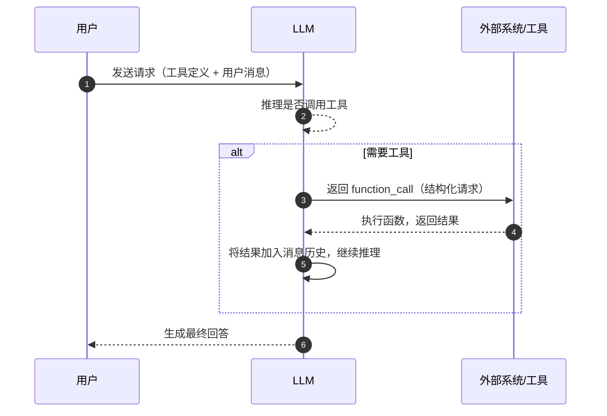

# Function Calling工具调用

> 类比：Function Calling（函数调用）就像给只会说话的顾问配了个「传话秘书」——顾问不直接动手，而是写张便条「去查下北京天气」，秘书真去查了、把结果贴回便条，顾问据此继续对话。LLM 本身永远不执行函数，它只「点单」。

Function Calling 是让 LLM 调用外部工具和 API 的标准机制（OpenAI 于 2023 年提出）。它是构建 Agent 系统的核心能力，也是 [[23-Agent架构与核心组件|ReAct 模式]] 与 [[26-MCP协议核心概念]] 得以运转的底层引擎。

## Function Calling 的本质

LLM 本身只能生成文本，无法直接执行操作。Function Calling 让 LLM **输出结构化的函数调用请求**，由外部系统执行后将结果返回给 LLM。

```text
用户："北京今天天气怎么样？"

LLM 不直接回答，而是输出：
{
  "function_call": {
    "name": "get_weather",
    "arguments": {"city": "北京"}
  }
}

→ 外部系统执行 get_weather("北京")
→ 返回结果：{"temperature": 28, "condition": "晴"}

LLM 基于结果生成：
"北京今天天气晴朗，气温28度。"
```

## 工具定义 Schema

使用 JSON Schema 格式描述可用工具：

```json
{
  "type": "function",
  "function": {
    "name": "get_weather",
    "description": "获取指定城市的天气信息",
    "parameters": {
      "type": "object",
      "properties": {
        "city": {
          "type": "string",
          "description": "城市名称"
        },
        "unit": {
          "type": "string",
          "enum": ["celsius", "fahrenheit"],
          "description": "温度单位"
        }
      },
      "required": ["city"]
    }
  }
}
```

**工具定义的要点：**

| 字段 | 说明 | 最佳实践 |
| ------ | ------ | --------- |
| name | 函数名 | 使用 snake_case，语义清晰 |
| description | 功能描述 | 写给 LLM 看，越清晰越好 |
| parameters | 参数定义 | 使用 JSON Schema 标准 |
| required | 必填参数 | 明确区分必填和可选 |
| enum | 枚举值 | 限定可选范围 |

## OpenAI Function Calling API

### 调用流程



### API 调用示例

```python
response = client.chat.completions.create(
    model="gpt-4",
    messages=[{"role": "user", "content": "北京天气"}],
    tools=[{
        "type": "function",
        "function": {
            "name": "get_weather",
            "description": "获取天气",
            "parameters": {
                "type": "object",
                "properties": {
                    "city": {"type": "string"}
                },
                "required": ["city"]
            }
        }
    }],
    tool_choice="auto"  # auto / none / required / 指定函数
)
```

### tool_choice 参数

| 值 | 说明 |
| ------ | ------ |
| auto | 模型自行决定是否调用工具（默认） |
| none | 强制不调用任何工具 |
| required | 强制必须调用一个工具 |
| {"type":"function","function":{"name":"xxx"}} | 强制调用指定工具 |

## Parallel Function Calls 并行调用

当一个问题需要多个工具协作时，LLM 可以一次性返回多个函数调用：

```json
{
  "tool_calls": [
    {
      "id": "call_1",
      "function": {"name": "get_weather", "arguments": {"city": "北京"}}
    },
    {
      "id": "call_2",
      "function": {"name": "get_weather", "arguments": {"city": "上海"}}
    }
  ]
}
```

**并行调用的优势：**
- 减少 LLM 调用次数（一次请求返回多个调用）
- 减少延迟（多个函数可并行执行）
- 降低 token 消耗

## Function Calling vs RAG

| 维度 | Function Calling | RAG |
| ------ | ----------------- | ----- |
| 目的 | 执行操作 / 获取实时数据 | 检索知识库生成回答 |
| 数据源 | 外部 API / 工具 | 内部文档 / 知识库 |
| 返回内容 | 结构化数据 | 文本片段 |
| 实时性 | 实时 | 取决于索引更新频率 |
| 典型场景 | 查天气、下单、发邮件 | 问答、知识检索 |

**两者可以结合：** 先通过 RAG 检索内部知识，再通过 Function Calling 获取实时信息。

## 错误处理

### 常见错误类型

| 错误 | 处理策略 |
| ------ | --------- |
| 函数不存在 | 返回错误信息，LLM 调整策略 |
| 参数格式错误 | 返回验证错误，LLM 重试 |
| API 超时 | 重试 + 降级方案 |
| 权限不足 | 返回权限错误，LLM 告知用户 |
| 返回结果异常 | 验证结果合理性，异常时告警 |

### 错误处理最佳实践

```text
1. 始终对函数执行结果进行验证
2. 设置合理的超时时间
3. 实现重试机制（指数退避）
4. 提供清晰的错误信息给 LLM
5. 限制可调用工具的范围（最小权限原则）
6. 记录所有函数调用日志（审计追踪）
```

## 安全考量

| 风险 | 防御措施 |
| ------ | --------- |
| Prompt Injection | 输入过滤 + 角色隔离 |
| 越权操作 | 权限最小化 + 白名单 |
| 数据泄露 | 敏感数据脱敏 |
| 无限循环 | 设置最大调用次数 |
| 恶意参数 | 参数验证和清理 |

---

## 
> ▶ 对应实操：[[15-Agent架构与工具调用|15-Agent架构与工具调用]]

相关链接
- [[八股文学习清单]]
- [[00-全局导航|全局导航]]

---

## 快速问答

| 问题 | 参考答案 |
| ------ | --------- |
| Function Calling 的本质是什么？ | LLM 输出结构化的函数调用请求（JSON），由外部系统执行，结果返回给 LLM 继续生成。LLM 本身不执行函数 |
| Function Calling 和 Agent 的关系？ | Function Calling 是 Agent 的核心能力之一。Agent 通过 Function Calling 来调用工具、执行操作 |
| 如何防止 LLM 调用不该调用的工具？ | ① tool_choice="none" 限制 ② 只在需要时暴露工具 ③ 权限最小化 ④ 后端验证每次调用的合法性 |
| 什么是 Parallel Function Calls？ | LLM 一次返回多个函数调用请求，可以并行执行。减少 LLM 调用次数和延迟 |
| Function Calling 的常见错误？ | ① 参数格式不符 ② 函数不存在 ③ API 超时 ④ 返回结果异常。需要完善的错误处理和重试机制 |
| 如何优化 Function Calling 的延迟？ | ① 并行调用 ② 减少工具定义数量（太多影响推理）③ 缓存常见调用结果 ④ 异步执行 |
| Function Calling 对模型有什么要求？ | 需要模型经过 function calling 训练（如 GPT-4、Claude、Qwen 等），普通模型可能无法正确生成调用格式 |
| 如何测试 Function Calling？ | ① 单元测试：验证参数提取正确性 ② 集成测试：端到端调用链路 ③ 边界测试：异常输入、权限验证 |

## 速记卡（面试闪卡）

**Q1：一句话讲清「Function Calling工具调用」到底是什么？**
A：LLM 本身只能生成文本，无法直接执行操作。Function Calling 让 LLM **输出结构化的函数调用请求**，由外部系统执行后将结果返回给 LLM。

**Q2：Function Calling 的本质 —— 怎么理解？**
A：LLM 本身只能生成文本，无法直接执行操作。Function Calling 让 LLM **输出结构化的函数调用请求**，由外部系统执行后将结果返回给 LLM。

**Q3：工具定义 Schema —— 怎么理解？**
A：使用 JSON Schema 格式描述可用工具：
**工具定义的要点：**
| 字段 | 说明 | 最佳实践 |
| ------ | ------ | --------- |
| name | 函数名 | 使用 snake_case，语义清晰 |
| description | 功能描述 | 写给 LLM 看，越清晰越好 |
| parameters | 参数定义 | 使用 JSON Schema 标准 |

**Q4：OpenAI Function Calling API —— 怎么理解？**
A：| 值 | 说明 |
| ------ | ------ |
| auto | 模型自行决定是否调用工具（默认） |
| none | 强制不调用任何工具 |
| required | 强制必须调用一个工具 |
| {"type":"function","function":{"name":"xxx"}} | 强制调用指定工具 |

**Q5：Parallel Function Calls 并行调用 —— 怎么理解？**
A：当一个问题需要多个工具协作时，LLM 可以一次性返回多个函数调用：
**并行调用的优势：**
减少 LLM 调用次数（一次请求返回多个调用）
减少延迟（多个函数可并行执行）
降低 token 消耗

**Q6：核心速记主线有哪些？**
A：抓住这几根：Function Calling 的本质、工具定义 Schema、OpenAI Function Calling API、Parallel Function Calls 并行调用、Function Calling vs RAG、错误处理。

