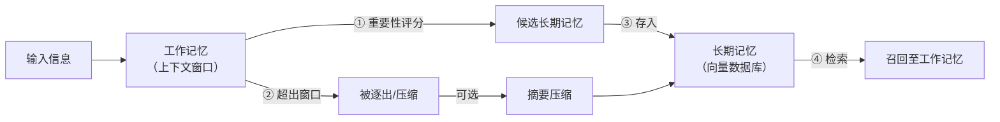
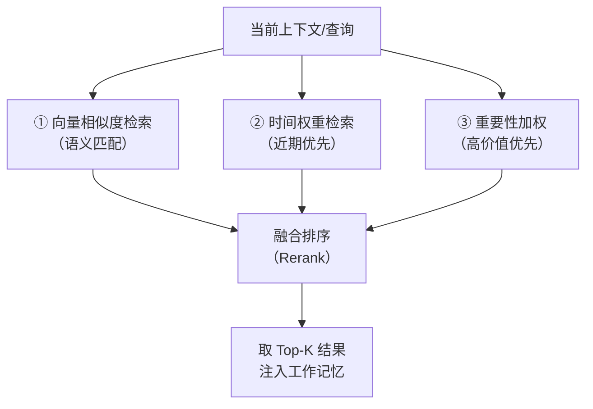
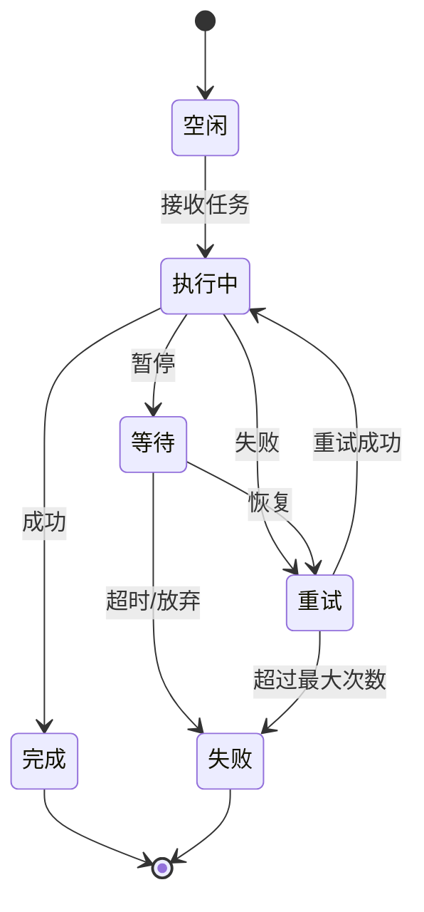
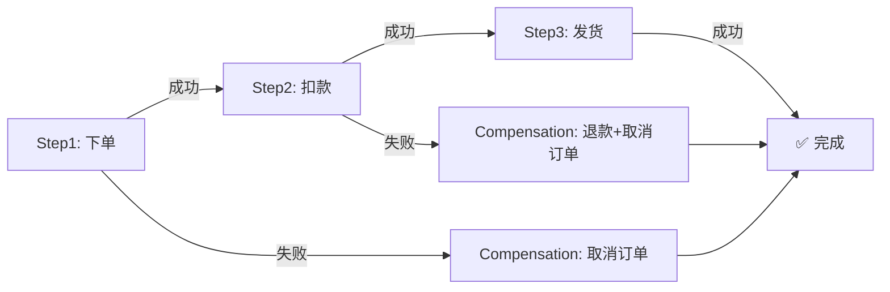
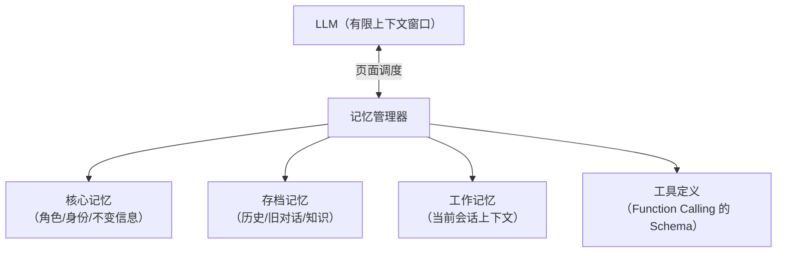

---

title: "Agent记忆基础与状态管理"

created: "2026-07-13"

tags:

  - 八股文

  - ai

---

# Agent 记忆基础与状态管理

> Agent 的「记忆」就像一个人——工作记忆是眼前这张便签（转眼就丢），长期记忆是写进笔记本的档案（跨年都在）。状态管理则是他手边的「当前进度表」。

## 核心概念

**Agent 记忆系统** 是 AI Agent 存储和检索信息的能力，使其能够在多轮交互中保持上下文、学习经验、并做出更好的决策。

**状态管理** 是跟踪和维护 Agent 当前状态、历史行为和环境变化的过程。

### 用"打游戏"理解状态管理

想象你正在打一个**不能存档**的游戏：

| 场景 | 出问题 | 状态管理干了啥 |

|------|--------|---------------|

| 🎮 打到第三关 Boss，停电了 | 从头开始打 😡 | **存档点**（Checkpoint）→ 从 Boss 门口重来 |

| 📋 接了个"买机票+订酒店+租车"的连环任务 | 租车失败，但机票酒店已付款 | **Saga 补偿** → 自动退机票取消酒店 |

| 🤖 跟 AI 助手说"帮我写周报，然后发邮件给老板" | 写到一半断网了 | **状态恢复** → 重连后从"写周报"继续，不从头来 |

| 👨‍🍳 炒菜时接了个电话，回来忘了放盐没有 | 菜可能咸死或淡死 😅 | **状态追踪** → 记录"已放盐，正在翻炒" |

**一句话**：状态管理就是 Agent 的"存档系统 + 进度追踪器"，保证它不会失忆、不会重复劳动、崩了还能续上。

### 现实类比

| 角色 | 状态管理怎么做 |

|------|--------------|

| 🧑‍💻 **程序员** | Git 提交（commit）→ 写崩了能 `git reset` 回滚 |

| 👨‍🍳 **厨师** | 记下"盐已放、正在炖 20 分钟"→ 被打断还记得做到哪了 |

| 📦 **快递员** | 扫描每个包裹状态（已揽收→运输中→已签收）→ 丢件能定位 |

| 🧭 **导航 App** | 实时追踪当前位置 → 走错路自动重新规划路线 |

### Agent 状态管理的三个核心问题

1. **"我现在在哪？"** → 当前执行到任务的哪一步了

2. **"我刚才做了什么？"** → 已经完成的操作和结果

3. **"崩了怎么办？"** → 从断点恢复还是回滚重来

> 记忆是"记住了什么"，状态管理是"做到哪了、怎么继续"——一个管知识，一个管进度。

## 记忆类型
### 工作记忆 vs 长期记忆

| 类型 | 描述 | 容量 | 持久性 | 类比 |

| ------ | ------ | ------ | -------- | ------ |

| 工作记忆 | 当前对话的上下文 | 有限（上下文窗口） | 会话内 | 人的短期记忆 |

| 长期记忆 | 跨会话的知识和经验 | 理论上无限 | 持久化 | 人的长期记忆 |

### 记忆分类框架

| 记忆类型 | 描述 | 实现方式 | 示例 |

| --------- | ------ | --------- | ------ |

| 感觉记忆（Sensory） | 原始输入的短期缓存 | 缓存 | 最近的用户输入 |

| 工作记忆（Working） | 当前任务的上下文 | LLM 上下文窗口 | 对话历史 |

| 情景记忆（Episodic） | 具体事件的经历 | 向量数据库（Vector DB） | "上次用户问过..." |

| 语义记忆（Semantic） | 事实知识 | 知识图谱/向量数据库 | "用户喜欢..." |

| 程序记忆（Procedural） | 技能和操作流程 | 规则引擎/代码 | "处理退款的步骤..." |

### 记忆生命周期



记忆的流转是个闭环：

1. **接收** → 信息进入工作记忆

2. **筛选** → 重要内容标记存入长期记忆

3. **溢出处理** → 超出上下文窗口 → 摘要压缩或 LRU 淘汰

4. **检索** → 下次会话从长期记忆中召回相关内容

### 记忆管理三大机制
#### 1. 记忆巩固（Consolidation）

从工作记忆转移到长期记忆的过程。核心策略：

| 策略 | 做法 | 优缺点 |

|------|------|--------|

| **周期性摘要**（Summarization） | 每 N 轮对话压缩一次历史 | 👍 节省空间 👎 丢失细节 |

| **重要性阈值**（Importance Scoring） | 用 LLM 给每条信息打分，高分存入 | 👍 精准 👎 额外 LLM 调用开销 |

| **反射机制**（Reflection） | Agent 定期反思并提炼洞见 | 👍 深度理解 👎 延迟高、易发散 |

| **时间衰减**（Temporal Decay） | 旧信息逐步降权直至淘汰 | 👍 自然 👎 可能过早丢弃重要信息 |

#### 2. 记忆检索（Retrieval）



常见检索策略组合：

- **Recency + Relevance**：兼顾时效性和语义匹配

- **Importance + Recency**：高价值近期内容优先

- **Hybrid**：向量检索 + 关键词检索（BM25）融合

#### 3. 遗忘与压缩（Forgetting & Compression）

| 机制 | 说明 |

|------|------|

| **滑动窗口**（Sliding Window） | 只保留最近 N 轮对话 |

| **LRU 淘汰** | 最久未被引用者先出局 |

| **摘要压缩** | 将冗长的历史对话压缩为简短摘要 |

| **重要性阈值裁剪** | 舍弃低于重要性阈值的信息 |

## Agent 状态机
### 状态定义

```text

Agent 状态 = {

  任务状态: 进行中 / 暂停 / 完成 / 失败

  上下文: 当前对话历史

  目标: 当前任务目标

  工具状态: 已调用的工具和结果

  错误状态: 遇到的错误和恢复策略

}

```

### 状态转换



### 检查点（Checkpointing）

检查点 = Agent 在某个时间点的完整状态快照，用于崩溃恢复、回滚、调试和分布式 Agent 同步。

| 属性 | 说明 |

|------|------|

| **存储内容** | 上下文窗口、变量值、工具调用栈、任务队列 |

| **触发时机** | 定时（每 N 步）、事件驱动（任务完成/失败前）、手动 |

| **恢复策略** | 从最近检查点重建、回滚至指定检查点、分支重放 |

| **实现工具** | LangGraph Checkpointer、Redis、SQLite、文件快照 |

### 状态管理模式
#### Saga 模式（长任务编排）

Agent 执行多步骤任务时，如果某步失败，需要回滚前面已完成的操作：



**关键**：每步必须定义对应的补偿操作（Compensation Action），形成逆向执行链。

#### 事件驱动的状态机（Event-Driven FSM）

基于事件总线（Event Bus）驱动状态切换，适合异步和多 Agent 协作：

```text

事件: 消息到达 → Agent 从 空闲 → 处理中

事件: API 返回 → Agent 从 处理中 → 结果检查

事件: 超时     → Agent 从 等待 → 失败处理

```

优点：解耦、可扩展、天然支持分布式

#### 层次状态机（Hierarchical State Machine, HSM）

状态嵌套，避免"flat state explosion"（平面状态爆炸）：

```text

执行中 ─┬─ 子状态1: 数据收集

        ├─ 子状态2: 分析推理

        └─ 子状态3: 决策输出

```

外层状态定义共享行为，内层状态处理具体逻辑。

#### 补偿与回滚（Compensation & Rollback）

| 模式 | 用途 | 实现 |

|------|------|------|

| **Try-Confirm/Cancel** | 先尝试，确认成功才提交 | 类似 2PC（两阶段提交） |

| **Saga** | 长事务逐步骤推进，失败时逆向补偿 | 每个步骤有补偿 Handler |

| **Savepoint** | 里程碑位置保存状态，失败回滚到此处 | 与检查点配合 |

| **Idempotency Key** | 同一操作重复执行结果一致 | 通过唯一 Request ID 去重 |

---

## Agent 记忆架构
### 主流框架对比

| 框架 | 记忆机制 | 状态管理 | 适用场景 |

|------|---------|---------|---------|

| **MemGPT (Letta)** | 虚拟上下文管理 + 分层记忆（核心/存档/工作） | 自主页面调度（Paging） | 超长对话、LLM OS |

| **LangGraph** | 基于图的 State 持久化 + Checkpointer | 显示状态机 + 节点/边 | 复杂多步工作流 |

| **AutoGPT** | 向量数据库长期记忆 | 简单的 JSON 状态文件 | 自主任务执行 |

| **CrewAI** | 任务级上下文 + 短期记忆 | 基于任务的执行状态 | 多 Agent 协作 |

| **Claude Code** | 文件式持久记忆（Memory） + 上下文集管理 | 单 Session 多 Agent 有状态编排 | 软件开发 |

### MemGPT 的分层记忆

MemGPT（现名 Letta）提出了**虚拟上下文管理**的概念，核心思想：



- **核心记忆**（Core）：像人的"性格和身份"，几乎不变

- **存档记忆**（Archive）：像你手机里的相册，需要时翻出来

- **工作记忆**（Working）：像桌面的便利贴，用完就换

- **工具定义**（Tool Schema）：Agent 会用的工具说明书

### LangGraph 的状态持久化

LangGraph 把 Agent 执行建模为**有向图**，每个节点是处理函数，边是状态转移条件。核心组件：

| 组件 | 作用 |

|------|------|

| **StateGraph** | 定义状态结构和转换图 |

| **Node** | 处理步骤（LLM 调用、工具执行、条件检查） |

| **Edge** | 状态转移条件（条件边 = if/else 分支） |

| **Checkpointer** | 自动保存每一步的状态快照，支持断点续跑 |

| **Command** | 显式控制下一步走向 |

**考点**：LangGraph 的 State 设计原则——Reducer（归约器）模式。新状态与旧状态通过 Reducer 合并（而非简单覆盖）。

**大白话解释**：Step A 在状态里记了"已查天气"，Step B 记了"已订机票"。如果直接覆盖，A 的记录就丢了；Reducer 合并则两条都在。

| 方式 | 结果 |

|------|------|

| ❌ **覆盖** | Step B 把 Step A 的记录覆盖了 → "已查天气"丢了 |

| ✅ **Reducer 合并** | Step B 追加到 Step A 后面 → 两条都在 |

就像两人填同一张 Excel：覆盖=后一个人删了整张表重填；合并=各追加自己的行。

LangGraph 配置 Reducer 后：

- **列表** → 追加合并（非替换）

- **字典** → 合并 key（非整体覆盖）

- 可自定义合并逻辑

Agent 是多步执行的，**必须用合并**——覆盖意味着中间劳动成果丢失。

---

## 快速问答

| 问题                            | 参考答案                                                                                                                                                                               |

| ----------------------------- | ---------------------------------------------------------------------------------------------------------------------------------------------------------------------------------- |

| Agent 的工作记忆和长期记忆有什么区别？        | 工作记忆是当前对话上下文，存在 LLM 上下文窗口里，容量有限（以 token 计）；长期记忆跨会话持久化，容量理论上无限，通常用向量数据库实现。类比：工作记忆 = 手里拿着的便签，长期记忆 = 书架上归档的笔记本                                                                        |

| Agent 状态机有哪些状态？               | 空闲（Idle）、执行中（Running）、等待（Waiting/Paused）、完成（Completed）、失败（Failed）。状态转换由事件（Event）触发——如接收任务、API 返回、超时等                                                                               |

| 什么是检查点（Checkpoint）？           | Agent 在某个时间点的完整状态快照，用于崩溃恢复、回滚、调试。存储内容包括上下文窗口、变量值、工具调用栈。LangGraph 的 Checkpointer 是典型实现                                                                                              |

| **如何处理上下文窗口溢出？**（高频考点）        | 三种策略：① **滑动窗口** - 只保留最近 N 轮对话，前面的丢弃；② **摘要压缩** - 用 LLM 把历史压缩成摘要，替换原始内容；③ **检索式记忆** - 历史存向量数据库，按需检索相关片段注入上下文。实际系统中常组合使用：滑动窗口保底 + 摘要 + 检索                                            |

| **记忆巩固（Consolidation）的实现方式？** | 从工作记忆→长期记忆的转移过程。常见实现：① **周期性摘要** - 每 N 轮调用 LLM 压缩对话；② **重要性评分** - 让 LLM 给每条信息打分（1-10），超过阈值才存入；③ **反射（Reflection）** - Agent 定期总结自己的行为模式和高价值信息。MemGPT 的"存档记忆"是典型实现                   |

| **Agent 状态管理中 Saga 模式是什么？**   | Saga 模式用于多步骤长任务：每步有对应的补偿操作（Compensation），某步失败时逆向执行补偿。例如：下单(Step1)→扣款(Step2)→发货(Step3)，如果发货失败，需要执行 退款+取消订单 补偿。在 Agent 系统中，每步都必须考虑"失败了怎么撤销"                                          |

| **MemGPT 的虚拟上下文管理怎么理解？**      | MemGPT（Letta）把 LLM 的有限上下文当成"物理内存"，通过操作系统式的页面调度（Paging）机制管理：核心记忆常驻（存身份和指令）、工作记忆存当前对话、存档记忆存在外部存储，需要时换入（Swap In）。本质是操作系统虚拟内存概念在 Agent 记忆上的复刻                                          |

| **LangGraph 如何做状态持久化？**       | LangGraph 用 StateGraph 定义状态结构，每个节点（Node）执行操作后自动通过 Checkpointer 保存状态快照。核心设计是 Reducer 模式：新状态通过 Reducer 函数与旧状态合并（如列表追加、字典更新），而非简单覆盖。支持断点续跑、回滚到任意历史节点                                  |

| **记忆检索的常见策略组合？**              | ① **Recency + Relevance** - 时间衰减因子 × 语义相似度，时效性+相关性；② **Importance + Recency** - 高优先级近期内容优先；③ **Hybrid Search** - 向量检索（语义匹配） + BM25（关键词精确匹配）融合，再用 Reranker 精排。Top-K 结果注入上下文窗口       |

| **什么是层次状态机（HSM）？**            | 状态套状态，避免平面状态爆炸。例如 Agent 在"执行中"状态下可以有子状态：数据收集→分析推理→决策输出。外层定义共享行为（超时处理、错误捕获），内层处理具体逻辑。适用于复杂多阶段任务的 Agent                                                                              |

| **Agent 如何确保操作幂等性？**          | 通过 Idempotency Key（唯一请求 ID）：每个操作生成唯一 Key，执行前检查是否已处理过。配合检查点使用，同一操作若重复执行（崩溃重启后），检测到相同 Key 直接返回缓存结果而非重复执行。这是分布式 Agent 系统不可或缺的设计                                                       |

| **遗忘机制在 Agent 记忆系统中的作用？**     | 防止记忆无限膨胀。策略：① 滑动窗口（只保留最近 N 轮）、② LRU 淘汰（最久未引用的优先清除）、③ 重要性阈值裁剪（低价值信息直接丢弃）、④ 摘要压缩（用更少 token 表示更多信息）。加分：说清楚"遗忘不是缺点，是为了保持检索精度的主动设计"                                                   |

| **多 Agent 系统如何共享状态和记忆？**      | 三种架构：① **共享数据库** - 所有 Agent 读写同一向量数据库/知识图谱（如 CrewAI）；② **消息总线** - Agent 间通过事件传递状态变更（适合解耦）；③ **全局状态协调器** - 一个中心节点管理全局状态，各 Agent 上报/拉取（如 Orchestrator 模式）。核心挑战：一致性（Consistency）和并发控制 |

## 速记卡（面试闪卡）

**Q1：一句话讲清「Agent 记忆基础与状态管理」到底是什么？**

A：Agent 记忆与状态：记"知道啥"用记忆，记"做到哪"用状态。

**Q2：核心概念 —— 怎么理解？**

A：记忆像人：工作记忆是眼前便签（转眼丢），长期记忆是归档笔记本（跨年都在）；状态管理是手边"进度表"。打不能存档的游戏：停电从 Boss 门口重来（Checkpoint）、连环任务失败自动退机票（Saga 补偿）。一个管知识，一个管进度。

**Q3：记忆类型 —— 怎么理解？**

A：两层分法：工作记忆（上下文窗口，会话内有限）vs 长期记忆（向量库，持久无限）。更细分五种：感觉/工作/情景(Episodic)/语义(Semantic)/程序(Procedural)。流转闭环：接收→重要性筛选存入→溢出摘要或 LRU 淘汰→检索召回。Memory Types（记忆类型）是八股常客。

**Q4：Agent 状态机 —— 怎么理解？**

A：状态=任务状态+上下文+目标+工具状态+错误状态。转换：空闲→执行中→完成/重试/等待。检查点（Checkpoint）存完整快照，崩了从最近点续上。Saga 模式长任务每步带补偿操作；层次状态机 HSM 防平面状态爆炸。State Machine（状态机）管"做到哪、崩了咋办"。

**Q5：Agent 记忆架构 —— 怎么理解？**

A：框架对对碰：MemGPT(Letta) 用虚拟上下文+Paging 分层记忆（核心/存档/工作）；LangGraph 用 StateGraph+Checkpointer 持久化，核心考点是 Reducer 合并（列表追加、字典更新，绝不覆盖——像两人各追加 Excel 行）。Reducer（归约器）是多步执行必须。

**Q6：核心速记主线有哪些？**

- 记忆管知识，状态管进度（存档+追踪）

- 记忆分工作/长期，五类细分

- 状态机靠 Checkpoint 断点续跑

- LangGraph 用 Reducer 合并防覆盖

**口诀**

A：记忆管知状态管程，

短期长期两分清；

断点续跑心不慌，

合并防覆盖才稳。

相关链接

- [[八股文学习路线图]]

- [[00-全局导航|全局导航]]

## 相关链接

- [[笔记/AI与Agent/知识/八股/29-多Agent协作基础与框架选型|多Agent协作基础与框架选型]]

- [[笔记/AI与Agent/知识/八股/38-记忆系统三层架构-存储介质与生命周期|记忆系统三层架构-存储介质与生命周期]]

- [[笔记/AI与Agent/知识/八股/71-AI-Agent框架对比|AI Agent框架对比]]

- [[笔记/AI与Agent/知识/八股/43-多Agent编排四种模式|多Agent编排四种模式]]

- [[笔记/AI与Agent/知识/八股/42-记忆污染与纠错机制|记忆污染与纠错机制]]

