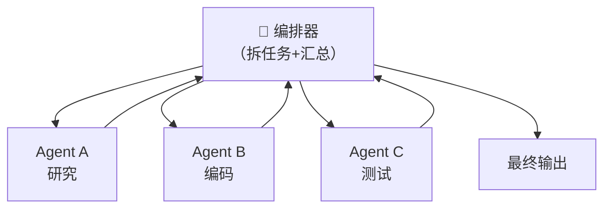
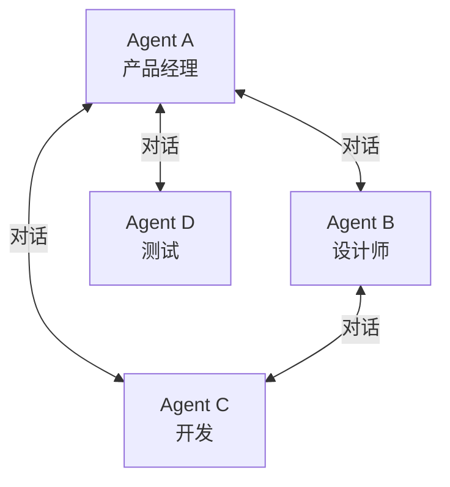
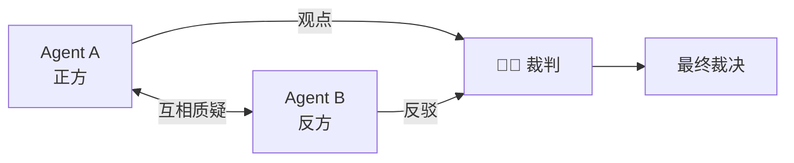
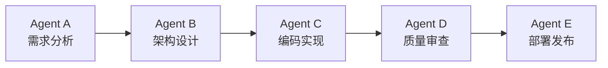

---

title: "多Agent协作基础与框架选型"

created: "2026-07-13"

tags:

  - 八股文

  - ai

---

# 多 Agent 协作基础与框架选型

> 单个 Agent 像一个人既当厨子又当服务员还兼收银，忙不过来；Multi-Agent（多智能体）则是开一家餐厅——主厨、配菜、服务员各司其职、互相配合。

单个 Agent 有其能力上限，多 Agent 协作让多个专精不同领域的 Agent 组成团队，共同完成复杂任务。

## 为什么需要多 Agent？

| 问题 | 多 Agent 的解决方案 |
| ------ | ------------------- |
| 单 Agent 上下文有限 | 不同 Agent 各自维护独立上下文，避免一个 Agent 撑爆 |
| 任务复杂度高 | 拆分为多个子任务并行处理，缩短总耗时 |
| 需要多种专业能力 | 每个 Agent 专精一个领域（搜索、编码、推理等），比大而全更准 |
| 可靠性要求高 | 多 Agent 交叉验证、辩论（Debate），降低幻觉 |
| 处理速度 | 并行执行加速（多个 Agent 同时干活） |
| 故障隔离 | 一个 Agent 崩了不影响其他 Agent 的正常工作 |

### 什么时候不该用多 Agent？

| 场景 | 原因 |
|------|------|
| 简单任务（如单轮问答） | 多 Agent 引入不必要的延迟和复杂度 |
| 对延迟敏感 | Agent 间通信耗时可能超过 LLM 调用本身 |
| 缺乏清晰的子任务边界 | 拆不开的任务强行拆 → Agent 互相打架 |
| 调试能力不足 | 多 Agent 系统出错了很难定位是哪个 Agent 的问题 |

> **常见**：知道"什么时候用"也要知道"什么时候不用"——多 Agent 不是万能药。

## 多 Agent 架构模式
### 1. 编排器模式（Orchestrator/Worker）



| 特点 | 说明 |
|------|------|
| ✅ 结构清晰，职责分明 | 编排器负责拆任务和汇总，Worker 干具体活 |
| ✅ 任务管理集中 | 编排器可做质量控制、重试、优先级调度 |
| ❌ 单点瓶颈 | 编排器可能成为性能瓶颈和单点故障 |
| ❌ 编排器 LLM 调用量大 | 每次拆分和汇总都要 LLM 调用 |

**典型实现**：CrewAI 的 Sequential / Hierarchical Process、LangGraph 的 Supervisor 节点。

### 2. 对话模式（Conversation/GroupChat）



Agent 之间自由对话，像会议室里一群人讨论问题。适用于开放域讨论、头脑风暴。

| 特点 | 说明 |
|------|------|
| ✅ 信息流通自由 | 任何 Agent 可以随时发言 |
| ✅ 适合创造性任务 | 多角度碰撞出更好的方案 |
| ❌ 可能跑题 | 没有管控时容易发散 |
| ❌ Token 消耗高 | 所有对话历史要喂给 LLM |

**典型实现**：AutoGen 的 GroupChat、CrewAI 的 自定义 Process。

### 3. 辩论模式（Debate）



| 特点 | 说明 |
|------|------|
| ✅ 降低幻觉 | 不同立场的 Agent 互相查漏补缺 |
| ✅ 答案更稳健 | 经过多轮辩论和验证的结论更可靠 |
| ❌ 耗时长 | 多轮辩论大幅增加延迟 |
| ❌ 不一定收敛 | 双方可能各执己见，需要裁判打断 |

**典型实现**：多轮 Debate Prompt 工程、ChatDev 的 Chain of Thought。

### 4. 流水线模式（Pipeline）



每个 Agent 完成一个阶段，结果传递给下一个。像工厂流水线。

| 特点 | 说明 |
|------|------|
| ✅ 顺序清晰，职责单一 | 每步只做一件事 |
| ✅ 易调试 | 在哪步出问题一目了然 |
| ❌ 串行执行慢 | 总耗时 = 各 Agent 耗时之和 |
| ❌ 前步错误会传递 | 前面出错后面接着错（错误传播链） |

**典型实现**：LangGraph 的 Sequential Chain、CrewAI 的 Sequential Process。

---

## 多 Agent 通信机制

| 通信方式 | 原理 | 代表框架 |
|---------|------|---------|
| **直接消息传递**（Message Passing） | Agent A 发消息给 Agent B，B 收到后处理 | AutoGen（`send/receive`） |
| **共享记忆/黑板**（Shared Memory） | 所有 Agent 读写同一个状态存储 | LangGraph（Shared State）、CrewAI |
| **事件总线**（Event Bus） | Agent 发布事件，订阅者自动处理 | 自定义实现 |
| **工具回调**（Tool Handoff） | Agent A 通过调用"转交给 Agent B"的工具实现交接 | CrewAI（`delegate_work`） |
| **函数调用**（Function Calling） | 一个 Agent 通过 LLM Function Call 调用另一个 Agent | AutoGen（嵌套 Agent） |

## 多 Agent 的挑战

| 挑战 | 表现 | 应对方案 |
|------|------|---------|
| **协调开销** | Agent 之间频繁通信 → 延迟高 | 减少不必要的 Agent 交互，批量处理 |
| **上下文一致性** | 不同的 Agent 对同一个问题理解不一致 | 共享全局上下文、统一 Prompt 模板 |
| **死锁/活锁** | Agent A 等 B，B 等 A，谁也动不了 | 设置超时、最大轮次、裁判干预 |
| **幻觉传播** | Agent A 乱说 → B 信了 → 错误放大 | 交叉验证、事实检查 Agent |
| **调试困难** | 十几个 Agent 来回对话，定位问题像大海捞针 | 日志追踪、重放（Replay）、检查点 |
| **Token 爆炸** | 多 Agent 的上下文累积消耗大量 Token | 摘要压缩、选择性记忆、滑动窗口 |

---

## 主流框架详解
### CrewAI — 角色扮演驱动

**定位：** 低代码、高易用的多 Agent 框架。核心思想：给每个 Agent 一个"角色"（Role）、"目标"（Goal）、"背景故事"（Backstory），就像 RPG 游戏里的角色设定。

```python

from crewai import Agent, Task, Crew, Process

# 定义 Agent —— 像 RPG 里创建角色

researcher = Agent(

    role="Researcher",

    goal="搜集最新资料并总结",

    backstory="你是一位资深研究员，擅长信息检索",

    tools=[search_tool],

    allow_delegation=True,       # 允许把子任务委托给其他 Agent

    verbose=True                 # 输出详细日志

)

# 定义任务 —— 像 RPG 里接任务

research_task = Task(

    description="研究 2024 年 RAG 技术的最新进展",

    expected_output="一份包含 5 个关键发现的技术报告",

    agent=researcher

)

# 定义团队 —— 像 RPG 里组队

crew = Crew(

    agents=[researcher, coder],

    tasks=[research_task, coding_task],

    process=Process.sequential,   # 或 Process.hierarchical

    verbose=True

)

result = crew.kickoff()  # 出发！

```

**Process 类型**：

- **Sequential**：任务按顺序执行，一个 Agent 做完传给下一个

- **Hierarchical**：有 Manager Agent 做任务分配和汇总（编排器模式）

- **自定义**：通过自定义 Process 类实现任意流程

### AutoGen — 对话驱动

**定位：** 微软推出的多 Agent 对话框架。核心思想：Agent 之间通过**对话**来协作。

```python

from autogen import AssistantAgent, UserProxyAgent, GroupChat, GroupChatManager

# 定义 Assistant Agent（用 LLM 驱动的 Agent）

assistant = AssistantAgent(

    name="Assistant",

    llm_config={"config_list": [{"model": "gpt-4", "api_key": "..."}]}

)

# 定义 UserProxy Agent（模拟人类，执行代码）

user_proxy = UserProxyAgent(

    name="UserProxy",

    human_input_mode="NEVER",           # 完全自动化

    code_execution_config={"work_dir": "coding"}

)

# 多 Agent 群聊

groupchat = GroupChat(

    agents=[assistant, user_proxy, critic],

    messages=[],

    max_round=10

)

manager = GroupChatManager(groupchat=groupchat)

user_proxy.initiate_chat(manager, message="写一个 RAG 系统")

```

**Agent 类型**：

| 类型 | 作用 |
|------|------|
| **AssistantAgent** | LLM 驱动的智能体，负责推理和生成 |
| **UserProxyAgent** | 代理人类执行动作（运行代码、调用 API） |
| **GroupChatManager** | 群聊的管理者，控制发言顺序和轮次 |

**核心机制**：Agent 间通过 `send/receive` 收发消息，支持嵌套对话（一个 Agent 发起子对话）。

### LangGraph — 图状态机

**定位：** 基于有向图（DAG）的超灵活多 Agent 工作流框架。

```python

from langgraph.graph import StateGraph, END

from typing import TypedDict, List

# 1. 定义状态结构（共享的黑板）

class AgentState(TypedDict):

    messages: List[str]

    current_task: str

    results: dict

# 2. 定义节点函数（每个 Agent 是一个 Node）

def researcher_node(state: AgentState) -> AgentState:

    # ... 执行研究任务

    state["results"]["research"] = "RAG 关键论文..."

    return state

def coder_node(state: AgentState) -> AgentState:

    # ... 执行编码任务

    state["results"]["code"] = "实现代码..."

    return state

# 3. 构建图

graph = StateGraph(AgentState)

graph.add_node("researcher", researcher_node)

graph.add_node("coder", coder_node)

graph.add_edge("researcher", "coder")

graph.add_conditional_edges("coder", decide_next, {

    "continue": "researcher",   # 条件分支：继续研究

    "end": END                  # 条件分支：结束

})

app = graph.compile()

```

**关键概念**：

- **StateGraph**：定义状态的 Schema（类型定义），类似"黑板"

- **Node**：每个 Agent 就是一个 Node，读/写共享 State

- **Edge**：状态流转条件，支持条件分支（if/else）

- **Checkpointer**：自动保存每一步的状态快照

- **Reducer**：新状态与旧状态合并（追加而非覆盖）

### 框架对比总表

| 维度 | CrewAI | AutoGen | LangGraph |
|------|--------|---------|-----------|
| **核心理念** | 角色扮演（RPG 式） | 对话驱动（Chat 式） | 图状态机（Graph 式） |
| **学习曲线** | 🟢 低（10 分钟上手） | 🟡 中 | 🔴 高 |
| **灵活性** | 🟡 中 | 🟡 中 | 🟢 高（图结构几乎任意） |
| **状态管理** | 🟢 内置 Task/Process | 🔴 有限（靠对话历史） | 🟢 强大的 State + Reducer |
| **并行能力** | 🟡 有限 | 🟢 GroupChat 可并行 | 🟢 DAG 天然支持并行 |
| **错误处理** | 🟡 重试机制 | 🟡 对话超时 | 🟢 Checkpointer 断点续跑 |
| **生产就绪** | 🟡 中（快速原型首选） | 🟡 中 | 🟢 较高 |
| **调试难度** | 🟢 低 | 🟡 中 | 🔴 高（图复杂时难追踪） |
| **典型场景** | 快速原型、内容生成 | 研究实验、多角色讨论 | 复杂工作流、生产系统 |

### 选型指南

| 你的需求 | 推荐框架 |
|---------|---------|
| 刚接触多 Agent，想快速跑通原型 | **CrewAI** |
| 需要 Agent 之间自由对话、辩论 | **AutoGen**（GroupChat） |
| 复杂工作流、条件分支、循环 | **LangGraph** |
| 生产环境、需要断点续跑 | **LangGraph** |
| 多 Agent 协作写代码 | **AutoGen**（代码执行能力强） |
| 内容生成、自动化报告 | **CrewAI** |
| 需要高灵活度、自定义流程 | **LangGraph** |

---

## 快速问答

| 问题 | 参考答案 |
|------|---------|
| 什么时候需要用多 Agent？ | ① 任务复杂度高，需多种专业能力（搜索+编码+测试）；② 需要并行处理加速；③ 高可靠性场景，交叉验证降幻觉。**反例**：单轮问答、延迟敏感、简单任务不该用 |
| 什么时候不该用多 Agent？ | 简单任务（单 Agent 够用）、延迟敏感场景（通信耗时 > 收益）、缺乏清晰子任务边界（拆不开强拆 → 互相打架）、调试能力不足（很难定位谁出问题） |
| 多 Agent 有哪几种架构模式？ | ① **编排器模式**（Orchestrator/Worker）— 中央调度；② **对话模式**（GroupChat）— 自由讨论；③ **辩论模式**（Debate）— 正反方+裁判；④ **流水线模式**（Pipeline）— 阶段传递 |
| Agent 间有哪些通信方式？ | ① **直接消息传递**（AutoGen send/receive）；② **共享黑板**（LangGraph Shared State）；③ **事件总线**（Event Bus，发布订阅）；④ **工具回调**（通过 Function Call 委托给其他 Agent） |
| 多 Agent 的主要挑战？ | **协调开销**（通信延迟）、**上下文一致性**（各 Agent 理解不同）、**死锁/活锁**（互相等待）、**幻觉传播**（错上加错）、**调试困难**（十几个 Agent 难以追踪）、**Token 爆炸**（多 Agent 上下文累积） |
| CrewAI 的核心概念？ | **Agent**（角色/目标/背景故事）、**Task**（任务描述/期望输出）、**Crew**（团队组合）、**Process**（执行策略：Sequential 顺序执行 / Hierarchical 编排器模式）。像 RPG 组队做任务 |
| AutoGen 的核心概念？ | **AssistantAgent**（LLM 驱动推理）、**UserProxyAgent**（执行代码/调用 API）、**GroupChatManager**（群聊管理者）。核心机制是 Agent 间通过对话协作，支持嵌套对话 |
| LangGraph 相比 CrewAI 的优势？ | LangGraph 基于有向图（DAG），支持**循环、分支、条件路由**；状态管理通过 **State + Reducer**，新状态合并而非覆盖；支持 **Checkpointer** 断点续跑。CrewAI 适合快速原型，LangGraph 适合生产级复杂工作流 |
| 什么是 Agent 辩论模式？效果如何？ | 正反两方 Agent 互相质疑，裁判 Agent 裁决。效果：显著降低幻觉（研究显示错误率可降低 30-50%），但耗时长、不一定收敛。适合：事实核查、决策评审 |
| 如何解决多 Agent 的 Token 爆炸？ | ① **摘要压缩** — 每轮对话后压缩历史；② **滑动窗口** — 只保留最近 N 轮；③ **选择性记忆** — 只存储关键信息；④ **共享上下文** — Agent 间共享摘要而非原始对话 |
| CrewAI 的 Process 类型有什么区别？ | **Sequential**：任务串行执行，Agent 按顺序干活；**Hierarchical**：有 Manager Agent 负责拆分任务和汇总结果（编排器模式）；**自定义**：可自行实现任意流程 |
| 多 Agent 如何避免死锁？ | ① **设置超时** — 每 Agent 有最大响应时间；② **最大轮次** — 限制对话轮数；③ **裁判打断** — 仲裁者 Agent 检测死锁并干预；④ **超时回退** — 超时时执行默认行为或降级方案 |
| LangGraph 的 State 设计为什么比对话历史更优？ | 对话历史是扁平的文本列表；State 是结构化的键值对（用 TypedDict 定义 schema），通过 Reducer 合并更新。好处：精确管理每部分状态（工具调用结果、任务进度、错误信息），支持条件路由和断点续跑 |

## 速记卡（面试闪卡）

**Q1：一句话讲清「多 Agent 协作基础与框架选型」到底是什么？**

A：多 Agent 协作让多个专精不同领域的 Agent 组队并行完成复杂任务，靠编排/对话/辩论/流水线等模式协作。

**Q2：为什么需要多 Agent？ —— 怎么理解？**

A：像开餐厅而非一人包办：单 Agent 上下文有限、复杂任务扛不住；多 Agent 各司其职（搜索/编码/测试）并行加速、交叉验证降幻觉、故障隔离。简单任务别用。

**Q3：多 Agent 架构模式 —— 怎么理解？**

A：像四种组队姿势：编排器模式（Orchestrator 中央调度，单点瓶颈）、对话模式（GroupChat 自由讨论，易跑题）、辩论模式（正反+裁判，降幻觉但慢）、流水线模式（阶段传递，串行慢）。

**Q4：多 Agent 通信机制 —— 怎么理解？**

A：像同事间四种传话方式：直接消息传递（AutoGen send/receive）、共享黑板（LangGraph Shared State）、事件总线（发布订阅）、工具回调（Function Call 委托）。

**Q5：多 Agent 的挑战 —— 怎么理解？**

A：像团队越大坑越多：协调开销（通信延迟）、上下文一致性（理解不一）、死锁/活锁（互等）、幻觉传播（错上加错）、调试困难、Token 爆炸。应对：超时/最大轮次/裁判干预。

**Q6：核心速记主线有哪些？**

- 何时用：任务复杂、需多种能力、并行加速、高可靠降幻觉

- 四种架构：编排器 / 对话 / 辩论 / 流水线

- 通信：消息传递、共享黑板、事件总线、工具回调

- 框架选型：CrewAI 快速原型、AutoGen 对话辩论、LangGraph 复杂生产

**口诀**

A：多体组队开餐厅，各司其职并行；

四种模式任你选，编排对话辩论流；

传话靠黑板消息，总线回调都行；

框架 Crew 快原型，LangGraph 扛生产。

相关链接

- [[八股文学习路线图]]

- [[00-全局导航|全局导航]]

## 相关链接

- [[笔记/AI与Agent/知识/八股/57-自研Harness与框架选型|自研Harness与框架选型]]

- [[笔记/AI与Agent/知识/八股/43-多Agent编排四种模式|多Agent编排四种模式]]

- [[笔记/AI与Agent/知识/八股/47-单Agent-vs-多Agent选型边界判断|单Agent-vs-多Agent选型边界判断]]

- [[笔记/AI与Agent/知识/八股/28-Agent记忆基础与状态管理|Agent记忆基础与状态管理]]

- [[笔记/AI与Agent/知识/八股/71-AI-Agent框架对比|AI Agent框架对比]]

