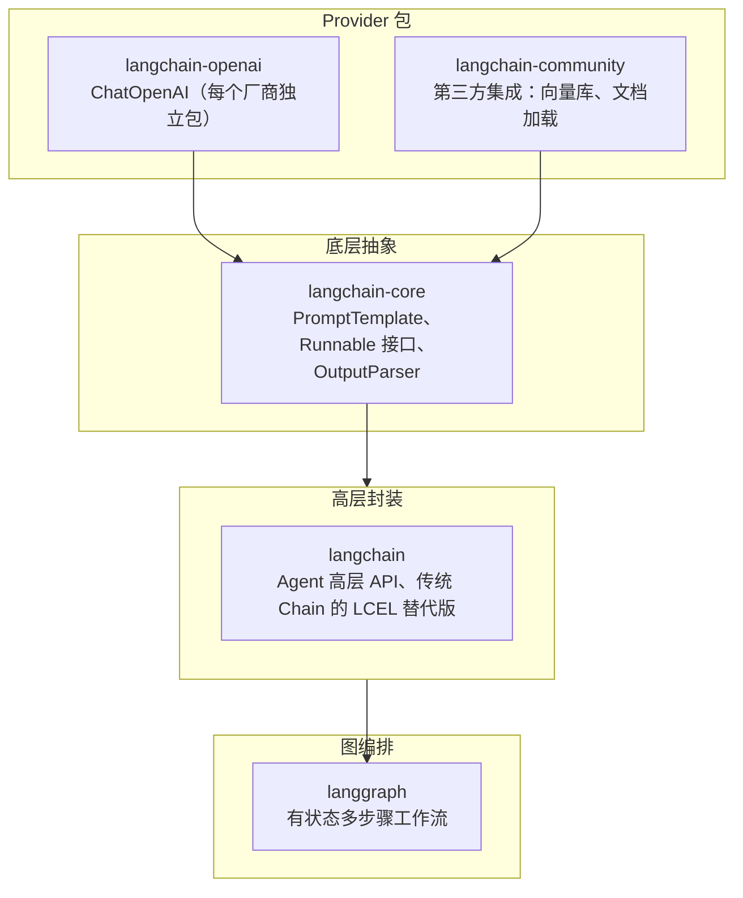

---

title: "LangChain框架"

created: "2026-07-13"

tags:

  - 八股文

  - ai

---

# LangChain 框架

> LangChain（Language + Chain）是目前最流行的 LLM 应用开发框架，提供从 Prompt 模板到 Agent 编排的完整模块化工具链。

## 四层架构



| 包 | 职责 | 必装 |

|------|------|:----:|

| `langchain-core` | Prompt 模板、LCEL 管道、Output Parser | ✅ |

| `langchain` | 高层 Agent 工具 | 🟡 |

| `langchain-openai` | ChatOpenAI 统一接口 | ✅ |

| `langchain-community` | 向量库、文档加载器（按需） | ❌ |

| `langgraph` | 复杂 Agent 工作流（进阶） | ❌ |

> **导入路径**：1.x 必须从 `langchain_openai` / `langchain_core` 导入，`from langchain import ChatOpenAI` 在逐步废弃。

---

## 核心概念
### 1. Models — 统一模型接口

```python

from langchain_openai import ChatOpenAI

model = ChatOpenAI(model="gpt-4", temperature=0.0)

response = model.invoke("你好")        # → AIMessage

```

| 模型类型 | 说明 |

|---------|------|

| **Chat Model** | 对话模型（主推）— GPT-4、Claude、DeepSeek |

| **LLM** | 文本补全模型（旧）— text-davinci |

| **Embedding** | 文本向量化 — OpenAI Embedding、BGE |

### 2. Prompt Templates — 声明式模板

三种模板类型：

| 类型 | 用途 | 示例 |

|------|------|------|

| `PromptTemplate` | 单条消息模板 | `"总结：{text}"` |

| `ChatPromptTemplate` | 多角色对话模板 | `("system","你是{role}"), ("user","{q}")` |

| `MessagesPlaceholder` | 插入历史消息列表 | `MessagesPlaceholder(variable_name="history")` |

**关键规则**：模板用 `{占位符}` 定义，`invoke()` 时才注入值，**禁止**在模板定义时用 f-string 写死变量。

### 3. LCEL 管道 — LangChain 的灵魂

LCEL（LangChain Expression Language）用 `|` 运算符把组件串成链。

```python

chain = prompt | model | parser

result = chain.invoke({"topic": "量子计算"})

# 同步 → invoke | 异步 → ainvoke | 流式 → astream

```

**每个组件都是 Runnable**（统一 `.invoke()` 接口），`|` 做的事 = 把左边输出传给右边的 `.invoke()`。

**LCEL 优势**：

| 特性   | 说明                  |

| ---- | ------------------- |

| 声明式  | 清晰表达数据流             |

| 自动流式 | 一行 `.astream()` 即支持 |

| 并行执行 | 自动识别可并行步骤           |

| 异步原生 | 原生 async/await      |

| 可重试  | 内置重试和回退             |

**管道分叉 — RunnablePassthrough**：

```python

chain = {

    "question": RunnablePassthrough(),      # 原样透传

    "answer": prompt | model | parser       # 管道结果

}

# → {"question": "...", "answer": "..."}

```

这是 **RAG 的标准模式**：`{"context": retriever, "question": RunnablePassthrough()}`。

**插入自定义逻辑 — RunnableLambda**：

```python

chain = prompt | model | parser | RunnableLambda(lambda x: x.upper())

```

### 4. Output Parsers — 结构化输出

| Parser | 输出类型 | 适用场景 |

|--------|---------|---------|

| `StrOutputParser` | `str` | 纯文本输出 |

| `JsonOutputParser` | `dict` | JSON 格式 |

| `PydanticOutputParser` | Pydantic 对象 | **生产级**（类型安全 + 自动校验） |

**PydanticOutputParser 必知**：

- 定义 Pydantic model（每个字段 `Field(description=...)`）

- 调用 `parser.get_format_instructions()` → 自动生成格式指令注入 Prompt

- 输出直接是类型安全的 Pydantic 对象

### 5. Memory — 对话记忆

| 类型 | 策略 | 适用场景 |

|------|------|---------|

| ConversationBufferMemory | 完整对话历史 | 短对话 |

| ConversationSummaryMemory | 摘要压缩 | 长对话 |

| ConversationBufferWindowMemory | 滑动窗口（最近 N 轮） | 中等长度 |

| ConversationEntityMemory | 实体级记忆 | 需记住特定实体 |

| VectorStoreRetrieverMemory | 向量检索 | 语义检索历史 |

### 6. Retrievers — 检索接口

```python

# 向量检索

retriever = vectorstore.as_retriever(search_kwargs={"k": 5})

# 混合检索

retriever = EnsembleRetriever(

    retrievers=[bm25_retriever, vector_retriever],

    weights=[0.3, 0.7]

)

```

### 7. Document Loaders & Text Splitters

| 加载器 | 格式 | 分块器 | 策略 |

|--------|------|--------|------|

| PyPDFLoader | PDF | RecursiveCharacterTextSplitter | **最常用**，按字符递归分块 |

| WebBaseLoader | 网页 | CharacterTextSplitter | 按固定字符 |

| DirectoryLoader | 批量 | TokenTextSplitter | 按 Token 数 |

| CSVLoader | CSV | MarkdownHeaderTextSplitter | 按 Markdown 标题 |

---

## LangGraph — 图工作流引擎

LangGraph 是 LangChain 的扩展，用**有向图**构建有状态的多步骤工作流。

```python

from langgraph.graph import StateGraph

class AgentState(TypedDict):

    messages: list

    next_action: str

graph = StateGraph(AgentState)

graph.add_node("reason", reason_node)

graph.add_node("act", action_node)

graph.add_edge("reason", "act")

graph.add_conditional_edges("act", should_continue)

app = graph.compile()

```

**LangGraph vs 传统 Chain**：

| | 传统 Chain | LangGraph |

|--|-----------|-----------|

| 流程结构 | 线性顺序 | 有向图（DAG） |

| 循环/分支 | ❌ 不支持 | ✅ 条件边、循环 |

| 状态管理 | 无 | ✅ 共享 State + Reducer |

| 断点续跑 | ❌ | ✅ Checkpointer |

| 人工介入 | ❌ | ✅ Human-in-the-loop |

---

## 常见错误（常见）

```python

# ❌ 管道顺序反了

chain = model | prompt | parser  # TypeError

# ❌ 变量名不匹配

prompt = ChatPromptTemplate.from_messages([("user","我叫{name}")])

prompt.invoke({"username": "张三"})  # KeyError

# ❌ 模板定义时用 f-string 写死变量

prompt = ChatPromptTemplate.from_messages([

    ("system", f"你是{role}专家")  # 定义时就写死了！

])

# ❌ Pydantic Field description 不清晰

class Person(BaseModel):

    skills: list[str] = Field(description="技能列表")  # 太模糊

# ✅ 正确

class Person(BaseModel):

    skills: list[str] = Field(description="技术技能如 Python、React")

```

---

## 快速问答

| 问题 | 参考答案 |

|------|---------|

| **LangChain 的核心组件有哪些？** | Models（统一模型接口）、Prompt Templates（声明式模板）、LCEL（管道编排）、Output Parsers（结构化输出）、Memory（记忆管理）、Retrievers（检索）、Document Loaders（加载）、Agents（智能体）、LangGraph（图工作流） |

| **LCEL 是什么？有什么优势？** | LangChain Expression Language，用管道符（`pipe`）声明式构建链。优势：① 自动流式/异步 ② 并行执行 ③ 可重试 ④ 组件统一 Runnable 接口 ⑤ 一行切换 invoke/ainvoke/astream |

| **Runnable 接口的作用？** | 所有组件统一实现 `.invoke()` 方法，管道符本质是自动串联各组件的 invoke 调用。类似"插座标准"，任何实现 Runnable 的组件都能接入管道 |

| **ChatPromptTemplate vs PromptTemplate 区别？** | PromptTemplate = 单条文本模板；ChatPromptTemplate = 多角色对话模板（system/user/assistant 区分）。Chat 模型永远用后者，MessagesPlaceholder 用于插入历史消息 |

| **PydanticOutputParser 为什么比 JsonOutputParser 更适合生产？** | ① 自动生成格式指令注入 Prompt ② 自动校验输出（类型错误时抛出明确异常）③ 输出为类型安全的 Pydantic 对象（IDE 补全 + 运行时校验）④ 减少 json.loads + try/except + 正则救火的体力活 |

| **LangChain 有哪些 Memory 类型？** | BufferMemory（完整历史）、SummaryMemory（摘要压缩）、WindowMemory（滑动窗口）、EntityMemory（实体级）、VectorStoreRetrieverMemory（向量检索）。加分：说出各自的适用场景和 Tradeoff |

| **LangGraph 解决了传统 Chain 什么问题？** | 传统 Chain 线性执行，不支持循环、分支和状态管理。LangGraph 基于有向图，支持：① 条件边和循环（Agent 的典型模式）② 共享状态 + Reducer ③ Checkpointer 断点续跑 ④ Human-in-the-loop |

| **如何用 LangChain 构建 RAG？** | DocumentLoader 加载 → TextSplitter 分块 → Embedding 向量化 → VectorStore 存储 → Retriever 检索 → 注入上下文 + 问题到 Prompt → Model → Parser。核心模式：`{context: retriever, question: input} | prompt | model | parser` |

| **LangChain 的主要缺点？** | ① 抽象层过多，深层调用链难调试 ② 版本迭代快（0.x→1.x API 大改），兼容性差 ③ 过度封装，简单任务也引入大量依赖 ④ 文档更新滞后于代码 ⑤ 自定义逻辑需要 RunnableLambda/Decorator，增加了心智负担 |

| **langchain 0.x 和 1.x 的核心区别？** | 0.x 用 `LLMChain` 类继承、`from langchain import...` 导入；1.x 包拆分（langchain-core/langchain-openai），LCEL 取代传统 Chain，导入路径变更为 `from langchain_openai` / `from langchain_core` |

| **LCEL 管道里如何做条件分支？** | LCEL 本身是线性管道不支持条件分支，需配合 LangGraph 的 `add_conditional_edges` 实现。分支逻辑写在路由函数里，返回下一个节点的名称 |

| **RunnablePassthrough 在 RAG 里的作用？** | 原样透传用户输入到最终输出。RAG 中常见模式：`{context: retriever, question: RunnablePassthrough()}`，retriever 检索上下文，question 原样传给 Prompt 模板，互不干扰 |

| **LangSmith 是什么？** | LangChain 的商业平台，提供调试追踪（观察每一步的输入输出 + 延迟 + Token 消耗）、在线评估、回归测试、Prompt 版本管理。核心价值：解决 LLM 应用"黑盒"问题 |

| **Agent 在 LangChain 里的实现？** | `create_tool_calling_agent(llm, tools, prompt)` 创建 Agent，配合 `AgentExecutor` 执行。核心循环：LLM 决定调用哪个 Tool → 执行 Tool 返回结果 → LLM 判断是否继续 → 直到满足条件或达到最大轮次 |

| **为什么 LCEL 能自动流式？** | 每个组件实现 Runnable 协议中的 `astream` 方法，管道串联时自动逐层传递流式迭代器。模型组件支持 token 级别流式，解析器组件逐 chunk 处理，最终 `chain.astream()` 拿到流式输出 |

## 速记卡（面试闪卡）

**Q1：一句话讲清「LangChain 框架」到底是什么？**

A：LangChain 是套给 LLM 应用搭积木的模块化工具链，统一 Prompt、模型、解析、记忆等零件。

**Q2：四层架构 —— 怎么理解？**

A：1.x 拆成职责清晰包：langchain-core 是地基(提供 Prompt 模板、Runnable 接口、Output Parser，必装)；langchain-openai 这类 provider 给各厂商统一接口(必装)；langchain 高层 Agent 编排(按需)；community 第三方集成(按需)；langgraph 复杂有状态工作流(进阶)。导入路径用 langchain_openai/langchain_core，旧的 from langchain 已废弃。

**Q3：核心概念 —— 怎么理解？**

A：七零件：① Models 统一模型接口(Chat/LLM/Embedding)；② Prompt Templates 用{占位符}声明、invoke 才注入、禁 f-string 写死；③ LCEL 用|串管道，每组件是实现.invoke()的 Runnable；④ Output Parsers 结构化，生产用 PydanticOutputParser；⑤ Memory 五种记忆；⑥ Retrievers 向量/混合；⑦ Loaders+Splitters 加载分块。

**Q4：LangGraph — 图工作流引擎 —— 怎么理解？**

A：LangGraph 是 LangChain 扩展，用有向图(Directed Graph)构建有状态多步骤工作流。解决传统 Chain 只能线性执行的痛点：支持条件边和循环、共享 State+Reducer、Checkpointer 断点续跑、Human-in-the-loop。代码用 StateGraph 定义状态、add_node/add_edge/add_conditional_edges。Chain 是单行流水线，LangGraph 是带岔路回环的地铁图。

**Q5：常见错误（常见） —— 怎么理解？**

A：五坑：① 管道顺序反(model|prompt|parser→TypeError，应 prompt|model|parser)；② 占位符名不匹配(写{name}传 username→KeyError)；③ 模板里用 f-string 写死变量；④ 不用 get_format_instructions() 让 LLM 自猜格式(key 变中文)；⑤ Pydantic Field description 太模糊。

**Q6：核心速记主线有哪些？**

- 四层：core 打底、openai/community 管接入、langgraph 管编排

- 灵魂：LCEL 竖线管道 + Runnable 统一 .invoke() 接口

- 图工作流：LangGraph 条件边/循环/共享状态

- 踩坑：顺序别反、占位符别错、f-string 别写死

**口诀**

A：框架四层分清楚，core 打底 openai 接

管道 LCEL 竖线串，Runnable 接口是灵魂

Pydantic 管输出，LangGraph 跑有状态

占位符别写死，顺序反了就报错

相关链接

- [[八股文学习路线图]]

- [[00-全局导航|全局导航]]

## 相关链接

- [[笔记/AI与Agent/知识/八股/32-LlamaIndex框架|LlamaIndex框架]]

- [[笔记/AI与Agent/知识/八股/71-AI-Agent框架对比|AI Agent框架对比]]

- [[笔记/AI与Agent/知识/八股/57-自研Harness与框架选型|自研Harness与框架选型]]

- [[笔记/AI与Agent/知识/八股/24-ReAct框架与规划能力|ReAct框架与规划能力]]

- [[笔记/AI与Agent/知识/八股/62-Prompt工程与技巧|Prompt工程与技巧]]

