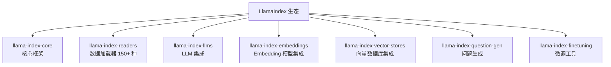
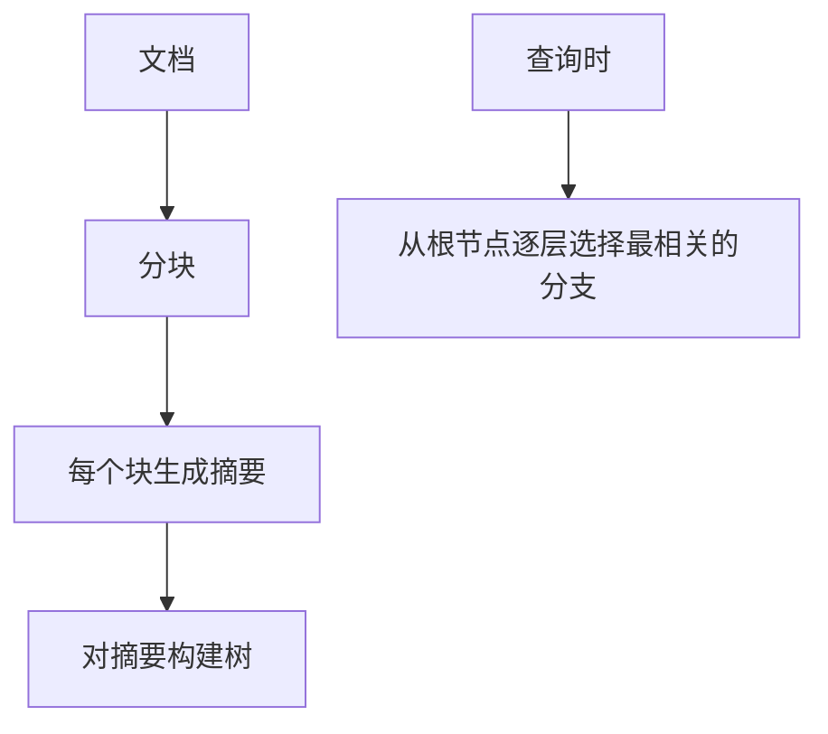
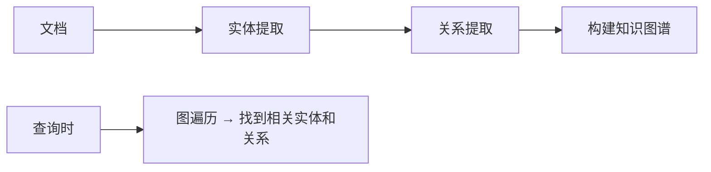
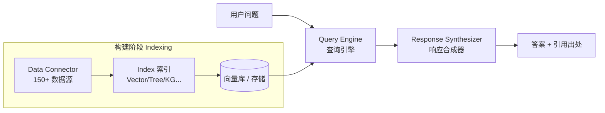
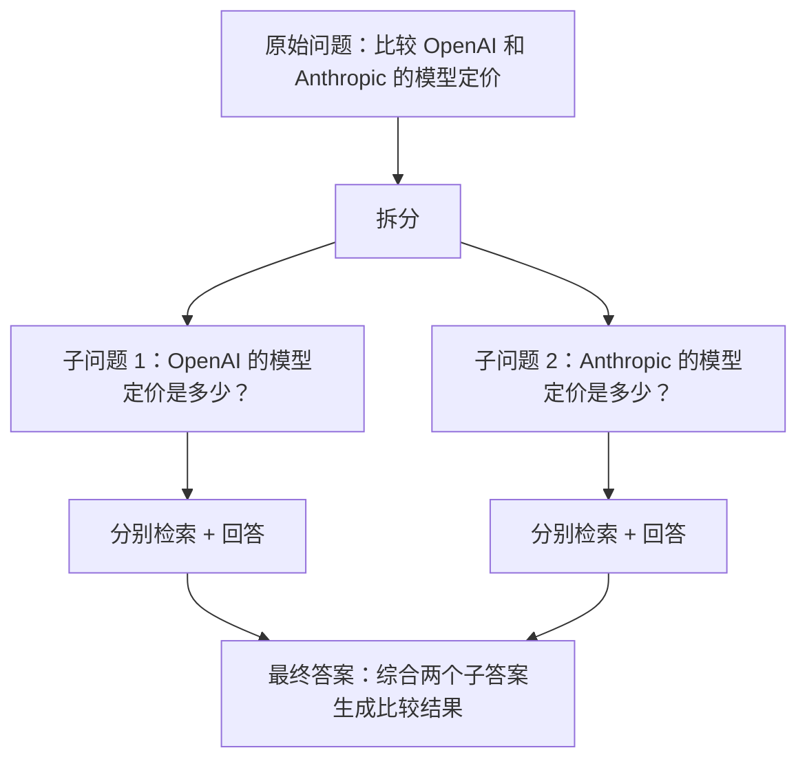
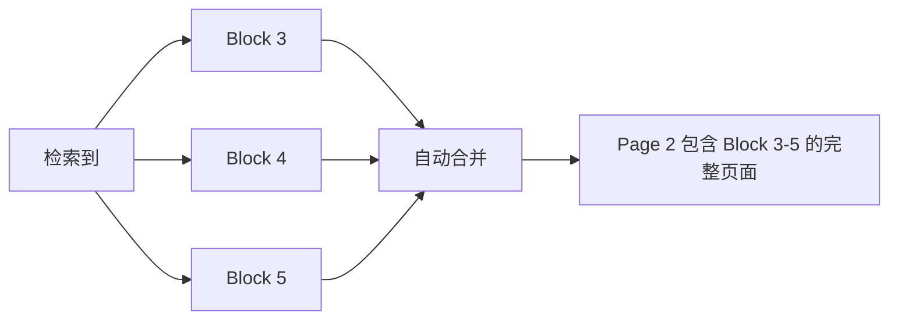

---

title: "LlamaIndex框架"

created: "2026-07-13"

tags:

  - 八股文

  - ai

---

# LlamaIndex框架

LlamaIndex（原名 GPT Index）是专注于 **数据连接和检索** 的 LLM 框架，是构建 RAG 应用的首选工具之一。

## LlamaIndex 定位

一句话：**LlamaIndex 是专门为 LLM 数据索引和检索设计的框架**。

如果说 LangChain 是"瑞士军刀"，LlamaIndex 就是"手术刀"——在数据检索领域更精准、更高效。它**原名 GPT Index**，2023 年更名为 LlamaIndex；其中 "Llama" 借用了大语言模型 LLaMA 的品牌意象（也暗含 Large Language Model 的谐音），强调"为大模型量身打造的数据索引层"。



## 核心组件
### 1. Data Connectors 数据连接器

LlamaIndex 支持 150+ 种数据源：

| 类别 | 加载器 | 支持格式 |
| ------ | -------- | --------- |
| 文件 | SimpleDirectoryReader | PDF, Word, MD, TXT, HTML |
| 数据库 | SQLDatabaseReader | MySQL, PostgreSQL |
| 网页 | WebPageReader | 任意网页 |
| API | GoogleDocsReader, NotionReader | Google Docs, Notion |
| 云存储 | S3Reader, GCSReader | AWS S3, Google Cloud Storage |
| 嵌入式 | WikipediaReader, SlackReader | Wikipedia, Slack |

**最简单的方式：**

```python

from llama_index.core import SimpleDirectoryReader

documents = SimpleDirectoryReader("./data").load_data()

```

### 2. Index 索引类型

LlamaIndex 的核心是将文档组织为不同类型的索引：

| 索引类型 | 原理 | 适用场景 |
| --------- | ------ | --------- |
| Vector Store Index | 向量相似度检索 | 通用 RAG（最常用） |
| Summary Index | 按文档顺序遍历生成摘要 | 摘要、总览任务 |
| Tree Index | 构建文档树，逐层摘要 | 层次化查询 |
| Keyword Table Index | 关键词倒排索引 | 精确关键词匹配 |
| Knowledge Graph Index | 构建知识图谱 | 关系推理、图查询 |

#### Vector Store Index（最常用）

```python

from llama_index.core import VectorStoreIndex

index = VectorStoreIndex.from_documents(documents)

# 自动生成分块 → Embedding → 向量存储

```

#### Tree Index



适合需要"从全局到细节"的查询模式。

#### Knowledge Graph Index



适合需要多跳推理的场景。

### 3. Query Engine 查询引擎

查询引擎 = Index + 查询策略 + 后处理：

```python

# 基础查询引擎

query_engine = index.as_query_engine()

# 带参数的查询引擎

query_engine = index.as_query_engine(

    similarity_top_k=5,        # 检索 Top-5

    response_mode="compact",   # 压缩上下文

    verbose=True

)

response = query_engine.query("什么是RAG？")

```

**response_mode 选项：**

| 模式 | 说明 |
| ------ | ------ |
| refine | 逐个文档精炼答案（质量最高，最慢） |
| compact | 将多个文档压缩为一个 prompt（推荐） |
| tree_summarize | 递归摘要生成最终答案 |
| simple | 只用 Top-1 文档生成答案（最快） |
|accumulate | 将所有文档的答案拼接 |

### 4. Response Synthesizer 响应合成器

负责将检索到的文档片段合成为最终答案：


## LlamaIndex RAG 数据流

LlamaIndex 把"建索引"和"查索引"分成两个清晰阶段，这正是它比通用框架更顺手的原因：



> 索引只在数据变化时重建，查询阶段是无状态轻量推理，因此生产环境可把索引预构建好、查询侧弹性扩容。

## LlamaIndex 高级功能
### Sub-Question Query Engine

将复杂问题拆分为子问题，分别检索后综合：



### Router Query Engine

根据问题类型自动路由到不同的索引/工具：

```python

from llama_index.core.query_engine import RouterQueryEngine

router = RouterQueryEngine.from_defaults(

    query_engine_tools=[

        query_engine_weather,    # 天气查询

        query_engine_news,       # 新闻查询

        query_engine_knowledge  # 知识问答

    ]

)

```

### Auto-Merging Retriever

检索文档块时，如果相邻块都被检索到，则自动合并为更大的上下文：



## LlamaIndex vs LangChain 选型

| 场景 | 推荐 | 理由 |
| ------ | ------ | ------ |
| 纯 RAG 应用 | LlamaIndex | 原生深度支持，开箱即用 |
| 复杂 Agent 工作流 | LangChain + LangGraph | Agent 能力更强 |
| 数据分析/报告 | LlamaIndex | Tree/Summary 索引天然适配 |
| 多工具协作 Agent | LangChain | 工具集成更丰富 |
| 需要监控评估 | LangSmith (LangChain) | 成熟的可观测性平台 |
| 快速原型 RAG | LlamaIndex | 最少代码量 |

**两者可以结合使用：** 用 LlamaIndex 构建检索层，用 LangChain 构建 Agent 编排层。

---

## 快速问答

| 问题 | 参考答案 |
| ------ | --------- |
| LlamaIndex 的核心定位是什么？ | 专注于数据连接和检索的 LLM 框架。核心能力是将各种数据源索引化，并提供高效的查询接口 |
| LlamaIndex 支持哪些索引类型？ | Vector Store（向量）、Summary（摘要）、Tree（树）、Keyword（关键词）、Knowledge Graph（知识图谱） |
| Vector Store Index 和 Tree Index 的区别？ | Vector Store 用向量相似度检索，适合通用场景；Tree 用层次化摘要，适合"从全局到细节"的查询 |
| response_mode 有哪些？怎么选？ | refine（逐个精炼，最慢最好）、compact（压缩上下文，推荐）、tree_summarize（递归摘要）、simple（最快最简单） |
| LlamaIndex 如何处理多模态数据？ | 通过 Data Connector 加载图片/音频，使用多模态 Embedding 模型（如 CLIP）进行向量化，支持跨模态检索 |
| Sub-Question Query Engine 是什么？ | 将复杂问题拆分为多个子问题，分别检索和回答后综合。适合需要多个知识来源的问题 |
| LlamaIndex 的评估工具有哪些？ | FaithfulnessEvaluator、RelevancyEvaluator、CorrectnessEvaluator。可通过 llama-index-evaluation 包使用 |
| LlamaIndex 在生产环境中的挑战？ | ① 索引更新策略 ② 大规模文档的构建时间 ③ 查询延迟优化 ④ 评估指标体系搭建 |

## 速记卡（面试闪卡）

**Q1：一句话讲清「LlamaIndex框架」到底是什么？**

A：LlamaIndex 是专注数据连接与检索的 LLM 框架，RAG 应用首选。

**Q2：LlamaIndex 定位 —— 怎么理解？**

A：像数据检索界的"手术刀"：LangChain 是瑞士军刀啥都能干，LlamaIndex 专攻"把各种数据源索引化并提供高效查询"。原名 GPT Index，2023 年改名，强调为大模型量身打造的数据索引层。

**Q3：核心组件 —— 怎么理解？**

A：像图书馆的采编、排架、借阅三件套：Data Connectors（数据连接器，150+ 数据源）、Index（索引，含 Vector/Tree/Keyword/Knowledge Graph）、Query Engine（查询引擎）、Response Synthesizer（响应合成器）。

**Q4：LlamaIndex RAG 数据流 —— 怎么理解？**

A：像先建好仓库再随时发货：构建阶段把数据接进来、建索引、存向量库；查询阶段无状态轻量推理，直接查索引。所以索引可预构建、查询侧弹性扩容，省时省钱。

**Q5：LlamaIndex 高级功能 —— 怎么理解？**

A：像给图书馆加智能助手：Sub-Question（把难题拆成子问题分别检索再综合）、Router（按问题类型自动路由到不同索引）、Auto-Merging Retriever（相邻块都被命中就自动合并成大上下文）。

**Q6：核心速记主线有哪些？**

- 定位：数据检索手术刀，RAG 首选

- 核心四组件：连接器/索引/查询引擎/合成器

- 数据流：建索引与查索引两阶段分离

- 高级：子问题/路由/自动合并检索

**口诀**

A：LlamaIndex 手术刀，专攻检索效率高；

四件套把数据理，连接索引查问好；

建仓查仓两分离，预建索引弹性跑；

子题路由自动并，RAG 首选错不了。

相关链接

- [[30-Harness与Skill]]

- [[31-LangChain框架]]

- [[13-RAG检索增强生成]]

- [[八股文学习路线图]]

- [[00-全局导航|全局导航]]

## 相关链接

- [[笔记/AI与Agent/知识/八股/31-LangChain框架|LangChain框架]]

- [[笔记/AI与Agent/知识/八股/71-AI-Agent框架对比|AI Agent框架对比]]

- [[笔记/AI与Agent/知识/八股/57-自研Harness与框架选型|自研Harness与框架选型]]

- [[笔记/AI与Agent/知识/八股/24-ReAct框架与规划能力|ReAct框架与规划能力]]

- [[笔记/AI与Agent/知识/八股/29-多Agent协作基础与框架选型|多Agent协作基础与框架选型]]

