>
**本篇定位与前置依赖：**这是「Agent 韧性工程」四层防线的**第一层（重试）专项深挖**，也是面向求职的项目技术学习笔记。读前建议先有这三篇打底：
- ⑥《工具调用失败处理》——重试的入门概念（什么是重试、为什么重试）
- ⑲《工具幂等性与副作用控制》——**为什么重试必须先保证幂等**（否则重复扣款）
- 第20篇《Agent 韧性工程概述》——四层防线全景，本篇是第一层的展开
零基础也能读：我们从「打电话占线」讲起，每个新概念先大白话+类比，再上公式。

# 一、先讲大白话：什么是「重试」，为什么要「退避」？

想象你给朋友打电话，**占线（对方正忙）**。最蠢的做法是——**啪啪啪疯狂连续重拨**。结果呢？对方一直占线，你一直拨，两边都烦，还把对方手机拨到发烫。

把「你」换成你的 Agent，把「朋友」换成「大模型 API / 数据库 / 搜索工具」：

>
**重试（Retry）** = 调用失败后，自动再试一次。但**不能立刻猛试**，得「退避（Backoff）」——也就是**等一会儿再试**。为什么等？因为对方多半是「短暂抽风」（网络抖一下、刚好在重启、被限流了），给它几秒缓口气，往往就活了。**Exponential Backoff（指数退避）**就是把「等待时间」越等越长：第1次等1秒，第2次等2秒，第3次等4秒……翻倍增长。

## 1.1 为什么「立即重试」和「固定间隔」都坑？

- **立即重试（不等待）**：对方已经过载在吐 503 了，你还疯狂补刀，直接把对方彻底打趴， outage 时间被你拉长。
- **固定间隔（每次都等3秒）**：听起来合理？错。想象一万个客户端同时调用，服务在 t=0 挂了，一万个请求同时失败，然后一万个请求**都在第 3 秒整点同时重试** → 服务又被一万并发砸垮 → 又都等3秒 → 又同时砸……这叫**惊群效应（Thundering Herd，直译「雷鸣般的兽群」）**，像一万头牛同时冲向一个快塌的桥，桥永远起不来。

**指数退避解决「负载随时间指数下降」**；但纯指数退避仍有惊群隐患——因为一万头客户端算出的等待时间**完全一样**（都是1、2、4秒），重试依然同步。这就需要 **Jitter（抖动）** 来打碎同步，见第三节。

## 二、指数退避：1s→2s→4s 怎么算、为什么翻倍、要不要封顶

经典公式（base = 基础等待，通常1秒；n = 第几次重试，从0计）：

**第 n 次重试前的等待 = base × 2ⁿ**

| 重试次数 n | 等待上界 | 累计已等待 |
|-|-|-|
| 0（首次调用失败） | 1s | 1s |
| 1 | 2s | 3s |
| 2 | 4s | 7s |
| 3 | 8s | 15s |
| 4 | 16s | 31s |

>
**「1s→2s→4s」是什么？** 它就是前三次重试退避窗口的**上界（天花板）**。注意是「上界」——加上 jitter 后（第三节），实际等待会在这个上界以内随机。累计 1+2+4+8 = 15 秒是「4 次重试预算」的经典总时长，之后就该放弃并向上抛错。

## 2.1 必须封顶：两个硬约束

- **重试次数上限（cap retries 3-5 次）**：超过 5 次，你花在等待上的时间比这步操作本身值当的还多，纯属浪费。放弃，把错误抛给上层处理（进入第20篇讲的第二、三、四层防线）。
- **退避时间上限（cap delay，业界常用 30-60s）**：公式里 base×2ⁿ 若不封顶，第 10 次重试要等 1000×2⁹ ≈ 512 秒（8.5 分钟），荒谬。封顶 30s，到第 10 次也只等 30s。来源：AWS Builders' Library / 各 SDK 默认实践。

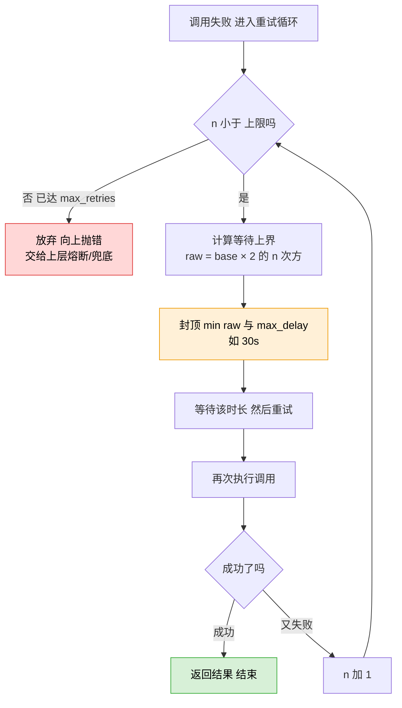

## 三、Jitter 抖动：打碎「同步重试」的杀手锏

**Jitter**（读「机特」，本意「抖动、参差」）= 在算好的退避时间上，加一点**随机扰动**。目的只有一个：**让一万头客户端不再在同一秒重试**，把「同步的惊群」拆成「分散的细雨」。

2015 年 AWS 架构师 Marc Brooker 的经典文章把抖动归纳为三种算法（至今业界标准），用「等待区间」来记最清楚：

| 算法 | 等待怎么算（base=1, 第n次, 上限cap） | 大白话 | 适合场景 |
|-|-|-|-|
| **Full Jitter**   完全随机 | sleep = random(0, base×2ⁿ) | 在「0 到上界」之间完全随机。分散最彻底 | 默认首选，高并发大量客户端（AWS SDK 默认） |
| **Equal Jitter**   折中 | sleep = base×2ⁿ/2 + random(0, base×2ⁿ/2) | 至少等一半上界，剩下一半随机。保证「最少等一会」 | 需要保证最小等待（比如要先释放连接/清空缓冲区） |
| **Decorrelated Jitter**   去相关 | sleep = min(cap, random(base, 上次等待×3)) | 基于「上次等待」算下次，不按次数。自适应 | AWS 实测略优，但需保存上次等待值 |

>
**AWS 实测数据（100 个并发客户端，4 次重试）：**纯指数退避（无 jitter）完成时间最长、峰值并发最高；**Full Jitter 把完成时间缩短约 62%**，**Decorrelated Jitter 缩短约 65%**（略优于 Full）。结论：高并发场景强烈推荐 Full 或 Decorrelated Jitter。来源：AWS Architecture Blog 2015 / 掘金 2026 复现。

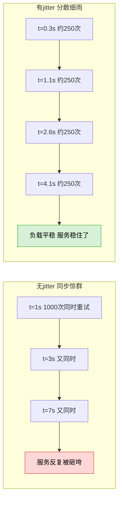

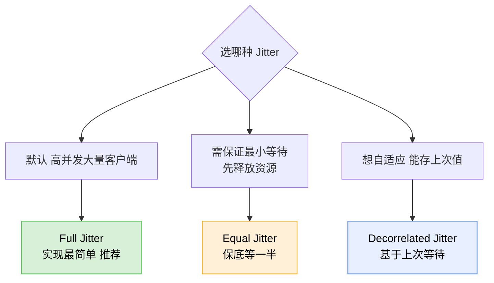

## 四、编程错误 vs 临时故障：重试的「生死线」分类

这是本篇最值钱的一节，也是常见的问题坑。**重试不是「失败就重试」——必须区分错误类型，否则越重试越糟。**

>
**核心原则：**只有「**临时故障（Transient Failure）**」才值得重试；「**编程错误（Programming Error）**」重试一百次也还是错，纯属浪费时间，必须**立即抛出**让开发者看到。

## 4.1 用 HTTP 状态码秒懂

- **临时故障（可重试）**：`429` Too Many Requests（被限流，等会就好）、`500/502/503/504`（服务器临时抽风）。这些是「对方的问题、且会恢复」。
- **编程错误（不可重试）**：`400` Bad Request（你请求写错了）、`401/403`（鉴权失败，重试也没用）、`404` Not Found（资源不存在）。这些是「你的问题、且重试多少次都还是错」。

## 4.2 用 Python 异常类型秒懂

| 分类 | 典型异常 | 重试？ |
|-|-|-|
| 临时故障 | ConnectionError / TimeoutError / 限流异常 / 网络抖动 | ✅ 退避后重试 |
| 编程错误 | TypeError / ValueError / KeyError / AttributeError / IndexError / AssertionError | ❌ 立即抛出 |

**为什么这俩要分开？** 举个生活例子：你按电梯，按钮没反应。**如果是因为「电梯正在维修」（临时故障）**，等几分钟再来按，可能就好了——值得重试。**如果是因为「你按的是墙上的假按钮」（编程错误）**，你按一百遍还是没反应，唯一正确的事是**立刻停止、去修按钮（改代码）**，而不是疯狂拍打墙面。

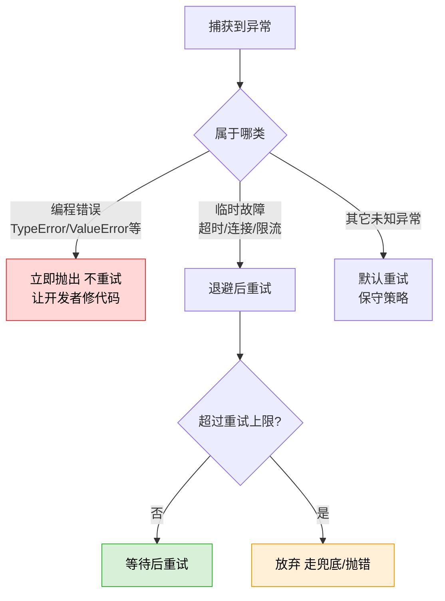

## 4.3 你项目的真实分类体系（比二分更细）

顺带提一句（也为简历绑定铺垫）：你项目里其实已经有一套比「二分」更专业的错误分类——`core/error_types.py` 的 `ErrorCategory` 七分类，外加 `classify_error()` 自动归类：

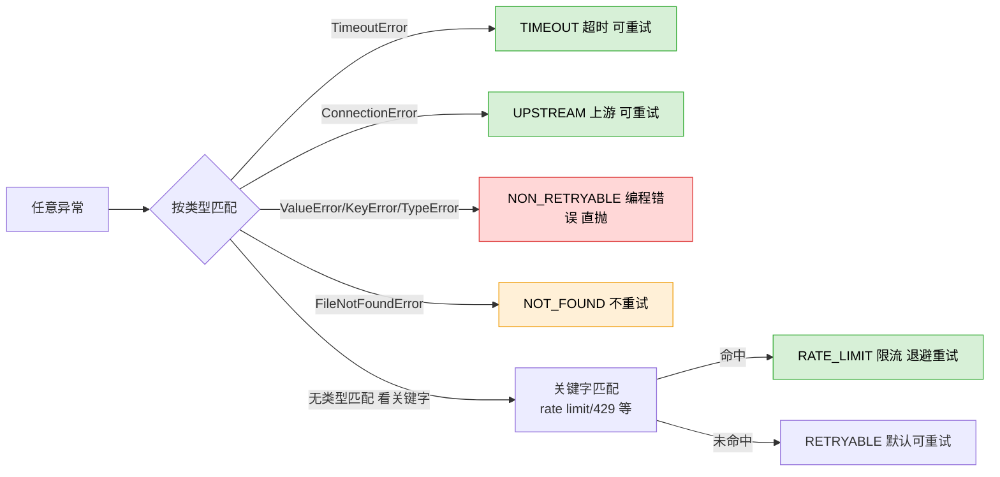

## 5.1 尊重 Retry-After 头

**Retry-After**（直译「多久后再试」）= 服务端在 `429` 响应里回的一个 HTTP 头，明确告诉你「N 秒后再来」。遇到它，**优先听服务器的**，别用自己的退避公式硬刚。这是「礼貌的客户端」标配。

## 5.2 重试必须配幂等（呼应第⑲篇，红线！）

再强调一次：**只有幂等操作（做一遍和做十遍结果一样，如 GET 查询）才能放心重试**。POST 下单、扣款这种有副作用的操作，**必须先加幂等键（Idempotency-Key）**，否则重试 = 重复扣钱。所以工程顺序是：先幂等，再重试。

## 5.3 Hedged Request（对冲请求，了解一下）

**Hedged Request**（直译「对冲请求」）= 同一个调用同时发两份（主+备），谁先回来用谁的，另一个取消。适合延迟敏感场景，是重试之上的进阶玩法（来源：掘金《LLM 应用请求重试工程实践》2026）。求职了解即可，不必深究。

## 六、结合你的简历项目：retry.py 真实体检 + 四个改进

严格基于 `D:\Project\ai-resume-analyzer\backend` 真实代码。先给结论：**你项目的「错误分类」已经做得比多数同学细（七分类 + classify_error），但「重试执行层」还停留在基础阶段——没接分类、没 jitter、没封顶、timeout 字段形同虚设。**

## 6.1 现状盘点（真实代码）

| 能力 | 项目真实实现 | 评价 |
|-|-|-|
| 指数退避 | `retry.py` 的 `delay_for(attempt) = base_delay × 2**attempt`（第40行）；`with_retry` 用 1→2→4s | ✅ 有，但**无封顶** |
| Jitter 抖动 | 全项目 grep `jitter` 零命中 | ❌ **完全缺失** |
| 错误分类 | `error_types.py` 有 `ErrorCategory` 七分类 + `classify_error()` | ✅ 分类体系很专业 |
| 分类是否被重试层使用 | `with_retry` 仍只用硬编码 `NON_RETRYABLE` tuple 二分，**未调用 classify_error** | ❌ 分类与重试**脱节** |
| 超时管控 | `RetryBudget.timeout` 字段已声明（第36行），但 `with_retry` 从未用 `asyncio.wait_for` 落实 | ❌ **声明未执行** |

>
**改进①：给 `delay_for` 加 Full Jitter（一行，收益最大）**
· **现状**：`retry.py:40` 的 `return self.base_delay * (2 ** attempt)` 是确定值，SSE 流式高并发时所有请求同步重试，放大限流。
· **改动**：改为 `import random; return random.uniform(0, min(self.max_delay, self.base_delay * (2 ** attempt)))`，同时加 `max_delay` 字段（如 30s）一并封顶。
· **为什么**：既打碎惊群（见第三节 AWS 实测 -62%），又防止退避爆炸。
· **风险**：极低，纯加随机量。

>
**改进②：让 `with_retry` 接入 `classify_error`（打通分类与重试）**
· **现状**：`with_retry` 只认 `NON_RETRYABLE` tuple（TypeError/ValueError/AttributeError/KeyError/IndexError/AssertionError），所有其他异常一股脑重试；而项目已精心做了七分类却没用上。
· **改动**：给 `with_retry` 增加 `is_retryable` 谓词参数，默认实现为「`classify_error(e)` 命中 RETRYABLE/TIMEOUT/RATE_LIMIT/UPSTREAM 才重试，AUTH/NOT_FOUND/NON_RETRYABLE 立即抛」。（类似 Tenacity 的 `retry_on_exception` 注入式设计）
· **为什么**：让「限流(429/RATE_LIMIT)退避重试、鉴权失败(401/403/AUTH)立即抛、资源不存在(NOT_FOUND)立即抛」成为精细化策略，而不是现在的「全重试 / 仅硬编码 tuple 不重试」二选一。
· **风险**：需回归测试，确认原本靠「其他异常默认重试」兜住的场景不被误判为不重试。

>
**改进③：落实 `RetryBudget.timeout`（真正限制单次调用）**
· **现状**：`RetryBudget` 有 `timeout` 字段（第36行注释「单次调用超时」），但 `with_retry` 执行调用时只 `await fn(...)`，从不用 `asyncio.wait_for(fn, timeout)` 包裹。等于这个字段是摆设。
· **改动**：调用处改为 `await asyncio.wait_for(fn(*args, **kwargs), timeout=self.timeout)`（timeout 为 None 时不限制），超时抛 `TimeoutError` → 被 classify 为 TIMEOUT 走退避。
· **为什么**：目前 LLM 生成层没有进程侧 wall-clock 预算，万一某次 DeepSeek/百炼调用挂起不返回，会一直占着 SSE 连接。落实 timeout 才真正「默认不崩溃」。
· **风险**：timeout 设太短会误杀慢但正常的长生成；需按 P95 延迟调参。

>
**改进④：退避上限封顶（顺带，配合改进①）**
· **现状**：`delay_for` 无上限，理论第 10 次要等 \~512s。
· **改动**：在改进①的 `min(self.max_delay, ...)` 里一并解决，`max_delay` 默认 30s。
· **为什么**：防止极端情况下退避时间失控，符合 AWS 30-60s 实践。

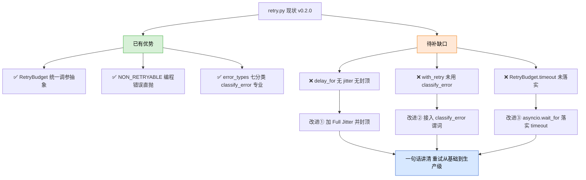

## 七、核心要点

>
**Q：为什么要用指数退避而不是立即重试？**
A：立即重试会在对方已过载时继续补刀、拉长故障；固定间隔仍会同步惊群。指数退避让负载随时间指数下降，给故障服务恢复窗口。
**Q：什么是 Jitter，三种算法？**
A：在退避时间上叠加随机，打碎同步重试。Full=random(0,上限)最分散（AWS默认）；Equal=至少等一半+随机；Decorrelated=基于上次等待×3。AWS实测Full缩短完成时间约62%、Decorrelated约65%。
**Q：为什么要区分编程错误和临时故障？**
A：临时故障（超时/连接/429/5xx）会恢复，值得退避重试；编程错误（TypeError/ValueError/400/401/404）重试多少次都错，必须立即抛出让开发者修。
**Q：重试有哪些必须封顶？**
A：① 重试次数 3-5 次；② 退避时间 30-60s；③ 尊重服务端 Retry-After 头；④ 必须配幂等键才能重试非只读操作。
**Q：你项目重试还能怎么加固？**
A：给 delay_for 加 Full Jitter 并封顶；让 with_retry 接入已有的 classify_error 做精细化分类重试；用 asyncio.wait_for 落实 RetryBudget.timeout。项目已有 error_types 七分类是亮点。

## 八、下一篇预告

本篇把四层防线的「第一层 重试」扒得底朝天。下一层是 **第二层 熔断器（Circuit Breaker）**——当对方是「真宕机」而非「偶发抖」时，重试反而有害，这时要「跳闸快速失败」。下一篇（🔴高优）我们深挖：熔断三态机、per-provider 分层熔断、和重试怎么配合才不会放大负载。它和本篇、第20篇正好串成「第一层 + 第二层」的完整弹性底座。

---

**本篇资料来源（截至 2026-07-18）：**

- AWS Architecture Blog《Exponential Backoff and Jitter》Marc Brooker, 2015（三种 jitter 算法 + 实测对比，业界标准）
- unseel.com《Retry with Exponential Backoff》/ sujeet.pro《Exponential Backoff and Retry Strategy》（惊群效应、退避封顶、可注入 jitter 的 production 实现）
- 掘金《LLM 应用的请求重试工程实践：指数退避、幂等性、Jitter 与 Hedged Request》2026（Full/Equal/Decorrelated 代码 + 62%/65% 数据 + Retry-After + 幂等键）
- Qiita《Exponential Backoff とは?》2026-04（4xx 不重试 / 5xx+429 重试、maxDelay 30s、Retry-After、Idempotency-Key）
- 项目真实代码：`D:\Project\ai-resume-analyzer\backend\core\retry.py`（with_retry / RetryBudget / delay_for）、`core\error_types.py`（ErrorCategory / classify_error）

---

## 补充

<title>工具幂等性与副作用控制：防止重复执行的工程手段</title>

**本篇建立在哪几篇之上：**⑦ 有副作用的工具、④ 工具系统、⑱ Agent 安全防护（权限分级 + 审计日志）。

**你需要先懂什么：**工具是什么（④）、哪些工具会"改世界"即副作用（⑦）、以及高危操作为何要分级与留痕（⑱）。本篇给副作用控制补上"第三块拼图"：**幂等性**——让同一个操作执行一次和执行多次，结果都一样、世界不更乱。

<callout emoji="💡">
**一句话核心判断：**幂等性（Idempotency）就是——**同一件事你做一遍、做十遍，结果都一样，系统不乱**。就像电梯按钮：你按一次和连按五次，到的都是同一层，不会多来几部电梯；但"下单付款"按五次就付五次钱——这就是**非幂等**。Agent 因为会自己重试，特别容易把"付款"这种事干重复，所以得用工程手段把它变成"按多少次都只生效一次"。
</callout>

## 一、先别急着记术语：幂等性到底是什么

我们用最生活的方式理解。想象两件事：

- **按电梯上行键**：你按一下，电梯来；你着急连按五下，电梯还是只来一次。世界没因为多按而变糟。这是**幂等**的。
- **点"付款"按钮**：你点一下付一笔；你以为没反应又点四下，结果付了五笔。世界因为你"重复点"而变糟了。这是**非幂等**的。

数学上给它个正经说法：一个操作 f，如果满足 `f(f(x)) = f(x)`，也就是"做了再做一次，结果和只做一次一样"，它就是幂等的。电梯键满足，付款键不满足。

**为什么这对 Agent 特别要命？**因为 Agent 不像人——人点完付款会看一眼"扣了没"再决定要不要再点；Agent 是程序，它**重试时不带"我刚才是不是已经付过了"的记忆**。所以你得在系统层面替它记住。

## 二、Agent 为什么特别容易"重复执行"：四个来源

实习生干活时，你催一句"那个事办了没？"，他要是记性差，可能就去再办一遍——Agent 也一样，只不过触发"再办一遍"的不是你催，而是下面四种情况：

- **网络超时**：工具其实执行成功了，但回复在路上丢了；重试逻辑一触发，又执行一次。
- **框架默认重试**：比如 LangGraph 默认 3 次指数退避重试，会原样把工具再调一遍。
- **ReAct 重新走**：模型推理时可能绕回同一步，把同一个写工具又调一次。
- **人工重放**：人在回路审批（⑰）时，把 Agent 从早先状态重启，工具被重跑。

来源：theneuralbase《Idempotent operations》(2026-04 验证)、wGrow《Idempotency Keys》(2026)、dev.to 幂等实践。

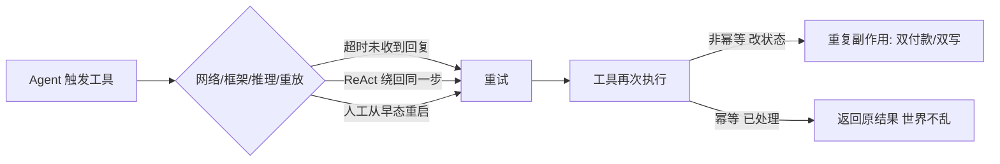

## 3.1 幂等性（Idempotency）—— "电梯按钮原则"

**大白话：**一个操作你执行一次和执行 N 次，造成的后果完全相同。读操作天然幂等（查余额查十次还是那个数）；写操作要**设计**才幂等。

**定义：**对相同输入重复调用产生相同系统状态的操作属性。Agent 系统必须假设"同一工具可能被重复调用"，因此工具要按幂等设计。

## 3.2 幂等键（Idempotency Key / Operation ID）—— "办事取号"

**大白话：**你去政务大厅办事，先取个号（operation_id），后续不管被叫去哪个窗口、重排几次队，都凭这个号识别"这是同一件事"。系统一看"这号办过了"，就直接告诉你结果，不再重办。

**定义：**每次逻辑操作生成一个**稳定且唯一**的 ID，**由应用层在拼 prompt 前生成**（不是让 LLM 现编），贯穿所有重试。下游用它在数据库里查重：见过就返回原结果，没见过才执行。wGrow 强调：绝不能让 LLM 生成这个 ID——它可能每次重试编出不同值，去重就失效了。

## 3.3 at-least-once vs exactly-once —— "至少一次"是默认，"恰好一次"要自己造

**大白话：**现实里系统给你的保证是"**至少跑一次**"——也就是可能跑两次。想要"恰好一次"，得靠"幂等键 + 数据库唯一约束"这套组合拳自己实现，框架不会白送你。

**定义：**Agent 框架默认提供 at-least-once（至少一次）投递；exactly-once（恰好一次）效果只有在"存储层 + 协议设计 + 处理逻辑"三层都强制幂等时才成立。两者的缝隙，正是生产事故高发区（wGrow）。

## 3.4 副作用控制（Side-effect Control）—— "让工具温柔点"

**大白话：**既然重复执行难免，那就想办法让"改世界"的动作尽量可逆、可查、可挡。比如删除用"软删除"（打标记不真删、能恢复）、跨系统多步操作用"补偿"（前一步成了后一步失败就回滚前一步）。

**定义：**通过幂等键、唯一约束、结果缓存、执行前状态校验、软删除、Saga 补偿等手段，把工具对外部系统的不可逆影响降到最低的设计实践。它和 ⑦（识别副作用）、⑱（分级+审计）共同构成"副作用控制三件套"。

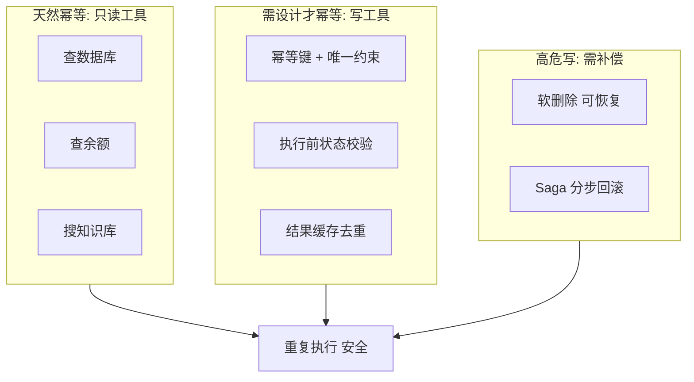

## 手段 1：幂等键 + 数据库唯一约束（最硬核）

**类比：**办事取号（幂等键）+ 系统查重（唯一约束）。工具把 operation_id 写进数据库，表上建唯一索引；重复写入时数据库直接拒绝（报错码如 23505），工具捕获后返回"已处理"，Agent 就不再重试。

**关键：**唯一约束必须在**数据库层**，不能只靠应用层 if 判断——两个重试线程可能同时通过"存在吗"的判断，只有数据库约束能挡住并发（wGrow）。返回前还要确认原记录是"已完成"而非"半成品"。

## 手段 2：结果缓存（Result Cache）

**类比：**同一会话里，同一个问题你刚问过，就直接把上次答案递回来，不再去打扰后台。对**只读**工具特别有用：LLM 推理非确定性，可能同一 invoke 里把 get_balance 调两次（theneuralbase），缓存一下既防重复又省钱。

**适用：**远程不支持幂等键、或你想彻底避免重复网络调用时。

## 手段 3：执行前状态校验（Check-before-act）

**类比：**办手续前先查"这人办过没"，办过了就别再办。对于"更新已有记录"这类操作（不是新建），靠存在性去重不够，得比对**版本号或状态字段**。

## 手段 4：软删除 + Saga 补偿（高危跨系统）

**类比：**删除不真删，打个"已删"标记，万一误删还能恢复；跨多个系统的多步操作（下单→扣款→发货），某步失败就按相反顺序把前面步"补偿"回去。

**适用：**多步跨系统写（如计费）。wGrow 提醒：单靠幂等键不够，需 Saga 模式，但本篇点到为止。

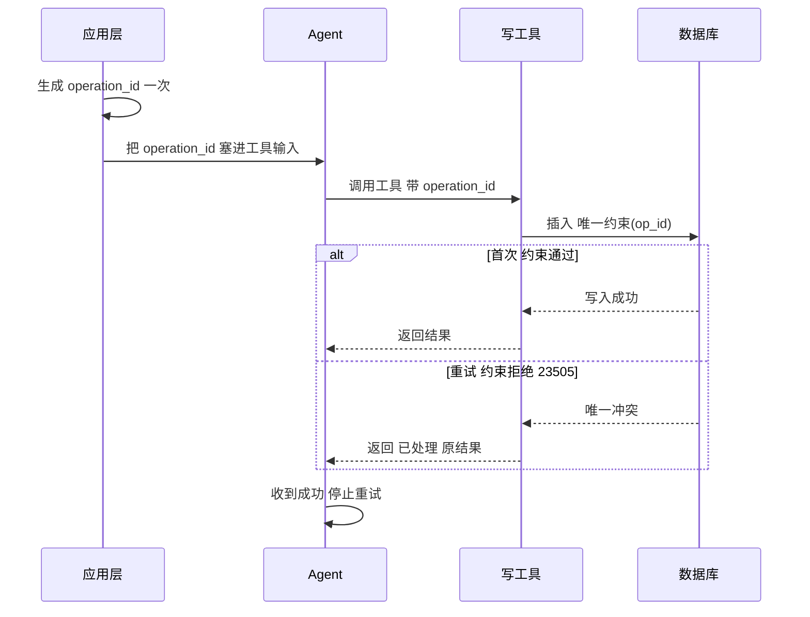

## 五、和前面几篇串起来：副作用控制"三件套"

- **⑦ 有副作用的工具**：先认出"哪些工具会改世界"（识别）。
- **⑱ Agent 安全防护**：给工具贴权限级别 + 每步留痕（分级 + 审计）。
- **⑲ 本篇：幂等性与副作用控制**：让重复执行不闯祸（防重复）。

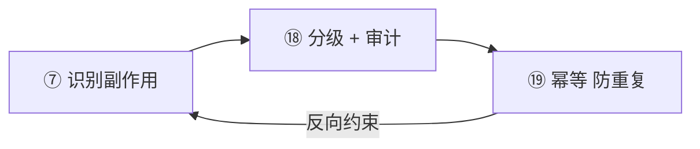

## 六、一个决策树：这个工具该怎么防重复

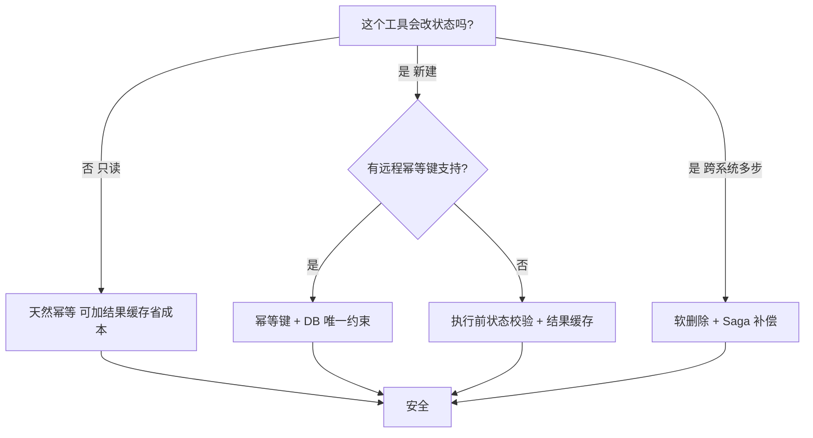

## 七、三个常见误区（常挖）

| 误区 | 真相 |
|-|-|
| 只读工具不用管幂等 | 对结果本身没错，但 LLM 可能重复调同一只读工具浪费资源；加结果缓存更省（且 readonly 天然幂等） |
| 让 LLM 自己生成幂等键 | 错。LLM 每次重试可能编出不同 ID，去重失效；必须由应用层在拼 prompt 前生成并贯穿重试（wGrow） |
| 重试是 bug，应该禁止 | 错。重试是正确行为；问题是底层调用非幂等。正确做法是"接受至少一次，用幂等处理器兜底"，而非禁止重试 |

## 八、速记卡（6 题）

**Q1：什么是幂等性？给个生活例子。**
A：同一操作执行一次和多次结果一致。电梯按钮幂等，付款按钮非幂等。

**Q2：Agent 为什么更容易重复执行工具？**
A：网络超时、框架默认重试（如 LangGraph 3 次）、ReAct 重走同一步、人工从早态重放——四种来源都会让写工具被调多次。

**Q3：幂等键怎么用才对？**
A：应用层在拼 prompt 前生成稳定 operation_id（UUID 或输入哈希），贯穿所有重试传入工具；下游用数据库唯一约束查重，命中返回原结果。

**Q4：at-least-once 和 exactly-once 区别？**
A：框架默认至少一次（可能重复）；恰好一次需幂等键+DB 约束+处理逻辑三层强制才成立。

**Q5：为什么唯一约束必须放数据库层？**
A：应用层 if 判断在并发重试下会竞态（两线程同时通过"存在?"判断），只有 DB 唯一索引能结构性挡住。

**Q6：副作用控制还有哪些手段？**
A：结果缓存去重、执行前状态校验（版本/状态字段）、软删除可恢复、Saga 跨系统补偿。与权限分级(⑱)、副作用识别(⑦)构成三件套。

## 九、简历绑定：你的 AI 简历分析系统怎么补这块

基于你项目真实代码（已核对 backend）：当前有 `core/retry.py` 的 `with_retry`（指数退避 3 次）、`core/request_id.py` 的 per-请求 `request_id`（ContextVar）、`graph.py` 的 Reflexion 循环（search_round <= 2）；5 个 MCP 工具全是读/计算型，目前侥幸安全，但**缺幂等键与 per-operation 去重**。

## 落点 1：给未来写工具加"幂等键 + 唯一约束"底座

**差距：**`with_retry` 只重试不携带幂等键；若将来给 analyze_resume 接"写回分析结果"，超时+重试会双写。

**改动：**新增 `core/idempotency.py` 的 `gen_operation_id(inputs) -> str`（会话ID+工具名+参数指纹 SHA-256，复用 `core/request_id.py` 的 ContextVar 思路）；写工具入参加 `operation_id` 字段，落库时在 operation_id 列建 UNIQUE 约束，捕获 23505 类冲突返回"已处理"。

**风险：**幂等键作用域不能太宽（全局同工具名会碰撞）也不能太窄（每次随机 UUID 等于没用）；正确 scope 是 session_id + 工具名 + 参数指纹。

**收益：**可说"写工具按 operation_id + 唯一约束实现幂等，超时重试不再双写"，直接对应本篇。

## 落点 2：让 with_retry 按副作用级别区别对待

**差距：**`with_retry` 对所有函数一视同仁重试；若套在写工具上且写工具不幂等，就是隐患。

**改动：**在 `with_retry` 加 `side_effect: str = "read"` 参数：read 级照常 3 次重试；write/destructive 级要求调用方传入幂等键，且仅在"幂等安全"前提下重试，否则路由到 ⑰ 的 `human_approval_node` 让人决断（与 ⑱ 分级联动）。

**风险：**改动影响面大（retry 被多处使用），需逐个核对调用点副作用级别，避免误标。

**收益：**把"重试"从盲重试升级为"副作用感知重试"，与 ⑱ 权限分级形成闭环叙事。

## 落点 3：加 in-session 工具结果缓存，省成本防重复读

**差距：**LLM 推理非确定性，可能同一 invoke 内把 search_knowledge_base / rerank_results 重复调多次，浪费 token 与耗时（theneuralbase 已验证）。

**改动：**在 `mcp_graph.py` 或工具封装层加一个以 (工具名 + 参数指纹) 为 key 的 in-session memo（TTL 短，如单次请求生命周期），命中直接返回缓存；只读工具适用，写工具禁用。

**风险：**缓存必须限定只读工具，且 TTL 不能跨请求太久，否则读到过期数据。

**收益：**低成本即见效，可说"对只读工具做结果缓存，避免 LLM 非确定性重复调用、降低延迟与花费"。

<callout emoji="📌">
**下一篇预告：**副作用控制三件套已齐（⑦识别 / ⑱分级审计 / ⑲幂等防重复）。下一站建议讲**提示注入（Prompt Injection）与防御** 🔴高优——它解释了"为什么权限不能在 prompt 层做"、也是 Agent 安全最阴险的攻击面，与 ⑰⑱⑲ 共同构成完整安全体系。备选：沙箱隔离 / AG-UI / 多 Agent 编排框架对比。
</callout>

##
> ▶ 对应实操：[[35-重复状态识别：避免Agent反复读同一文件或重复调用同一工具|35-重复状态识别：避免Agent反复读同一文件或重复调用同一工具]]

## 速记卡（面试闪卡）

**Q1：一句话讲清「一、先讲大白话：什么是「重试」，为什么要「退避」？」到底是什么？**
A：工具幂等性（Idempotency）让同一操作做一遍和十遍结果一样；重试前必须先幂等，否则重复扣款。

**Q2：幂等像什么 —— 怎么理解？**
A：像电梯按钮：按一下和连按五下，到的都是同一层，不会多来几部电梯；但「付款」按五下就付五笔。Agent 重试不带「我付过没」的记忆，得在系统层替它记住。

**Q3：幂等键怎么用 —— 怎么理解？**
A：像政务大厅办事取号（operation_id）。应用层在拼 prompt 前生成稳定唯一 ID（别让 LLM 现编），贯穿所有重试；下游用数据库唯一约束查重，见过就返原结果。

**Q4：重试的生死线 —— 怎么理解？**
A：像按电梯：维修中是临时故障，等会再按就好；墙上假按钮是编程错误，按一百遍也没用，得立刻去修。429 / 5xx 退避重试，400 / 401 / 404 立即抛出。

**Q5：指数退避与抖动 —— 怎么理解？**
A：像一万头牛别同时冲桥。Exponential Backoff（指数退避：等待 1→2→4s 翻倍）给故障服务恢复窗口；Jitter（抖动）加随机，打碎「惊群效应」同步重试。Full Jitter 实测缩短完成时间约 62%。

**Q6：核心速记主线有哪些？**
- 幂等：同操作多遍结果一致，防重复副作用
- 幂等键 + DB 唯一约束是最硬核手段
- 临时故障才重试，编程错误立即抛
- 指数退避封顶 + Jitter 防惊群

**口诀**
A：电梯按钮幂等稳，付款五下五笔坑
取号 operation_id，库约束查重挡重
临时故障才重试，编程错误即抛错
退避封顶加抖动，惊群拆散细雨落

相关链接
- [[23-Agent架构与核心组件]]
- [[33-异常处理与降级策略]]
- [[37-有副作用工具的权限控制]]
- [[八股文学习路线图]]
- [[00-全局导航|全局导航]]
## 相关链接

- [[笔记/AI与Agent/知识/八股/34-工具调用降级策略|工具调用降级策略]]
- [[笔记/AI与Agent/知识/八股/55-Agent安全防护与权限分级|Agent安全防护与权限分级]]
- [[笔记/AI与Agent/知识/八股/36-工具调用死循环检测|工具调用死循环检测]]
- [[笔记/AI与Agent/知识/八股/56-Human-in-the-loop人工介入|Human-in-the-loop人工介入]]
- [[笔记/AI与Agent/知识/八股/33-异常处理与降级策略|异常处理与降级策略]]
