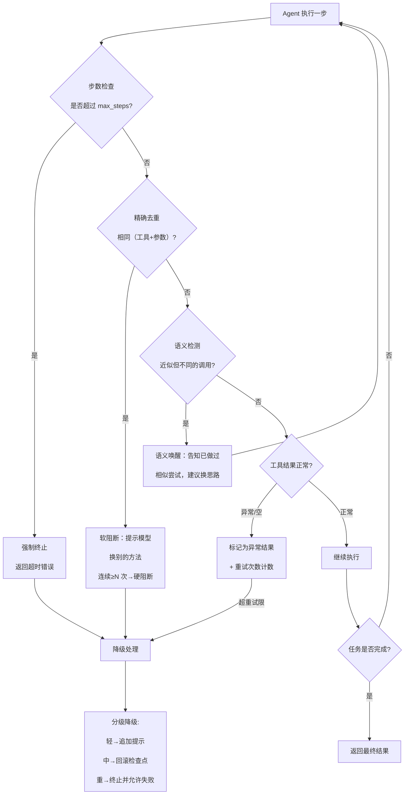
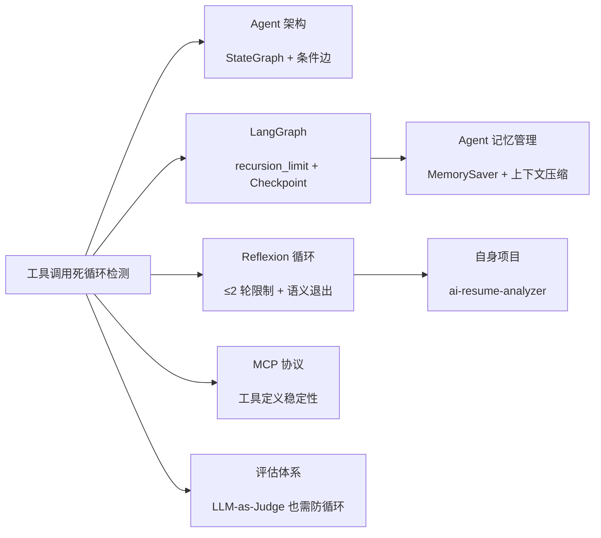

---

title: "工具调用死循环检测"

created: "2026-07-21"

tags:

  - 八股文

  - ai

---

# 工具调用死循环检测：Max Iteration Limit + Loop Detection（重复工具+重复参数）🔴高优

> **一句话总结**：Agent 调用工具时，可能因为任务标准模糊、上下文污染、或工具返回异常而**反复执行相同的（工具 + 参数）**，陷入死循环。防护需要用 **硬步数上限（兜底）** + **精确去重检测（拦截相同调用）** + **语义循环检测（拦截近似调用）**，三层互补，而不是只依赖任何一个。

## 一、场景：你不会想让你的 Agent 打出 47 次同一个 API 调用

你的 Agent 第一天上线表现完美。第二天早上你醒来，发现它**同一个搜索函数调了 47 次**——同样的参数、同样的 URL、同样的空结果——然后才放弃（dev.to Alan West 的真实经历）。

这不是模型变蠢了，是你的 Agent 没有「刹车」。

类比：你让实习生小王去查一份资料。小王去翻文件柜，没找到。**然后又去翻一次**，还是没找到。**又去翻一次**……直到第 47 次你喊停：「够了！没找到就说没找到！」

没有死循环检测的 Agent，就是那个不会自己停下来的实习生。

---

## 二、核心名词与架构（先定义再展开）

先认几个关键概念，后面不重复解释：

- **Agent（智能体）** = LLM + Tools（工具，如搜索、计算、查数据库）+ Orchestration（编排逻辑）。Agent 循环跑：思考→调工具→看结果→再思考。

- **死循环（Infinite Loop / Tool-Call Loop）**：Agent 无法收敛到「任务完成」状态，不断重复调用工具而不推进。

- **Max Iteration Limit（最大迭代上限）**：硬编码的步数天花板，超过即强制退出。

- **Loop Detection（循环检测）**：在运行时实时判断 Agent 是否在重复相同的（或近似的）工具调用模式。

- **Reflexion（反思）**：一种 Agent 自我纠错模式——做完后「反思」结果，然后修改方案——但如果没加好边界，反思本身也会循环。

---

## 三、为什么 Agent 会死循环？（三大根源）

不是模型「想」循环，是三个结构性原因让它走不出来：

### 3.1 任务完成标准模糊（Fuzzy Completion Criteria）

Agent 不知道「什么时候够了」。

> 大多数 Agent 循环的逻辑是：「不断调工具，直到模型说它做完了。」当任务边界不清晰、或模型不确定是否够信息时，「我再查一次确认一下」可以无限重复。

现实类比：让你写一份市场分析报告，但不告诉你「几页算完」。你可能会补充第 47 页数据「以防万一」。

### 3.2 上下文污染与遗忘（Context Degradation）

工具调用结果越长越多，Agent 的上下文窗口被 JSON blob（混乱的 JSON 数据块）填满。到第 20 轮时，原始任务说明和系统提示已经被埋葬，模型**忘了自己已经查过什么**，于是又查一次。

> 这在长链推理中尤其严重——不是模型故意无视，是它真的不记得了。

### 3.3 工具返回异常或不稳定

工具返回空值、异常信息、或格式变化，模型无法确定「是成功了还是没成功」，于是反复重试同一个调用。如果工具返回静默失败（Silent Failure，不报错但返回空内容），模型更可能一直重试。

---

## 四、解决方案全景：四层防护，层层兜底

死循环不是「加一个限制」就能解决的。需要四层：硬上限 → 精确去重 → 语义检测 → 分级降级。每一层解决不同维度的循环。



---

## 五、防护层一：硬步数上限（Max Iteration Limit）—— 兜底安全阀
### 5.1 原理

给 Agent 的执行加一个硬编码的步数天花板。超过则强制中断，并返回"任务未完成，已达最大步数"。

**它不做检测，只管兜底。** 属于「安全的最后一道防火门」，不是「预防机制」。

### 5.2 各框架对比（🔴高优先：横向对比）

| 框架 | 参数 | 默认值 | 超出后的行为 | 精准度 |
|-|-|-|-|-|
| **LangGraph** | `recursion_limit`（invoke 时传入） | 25 | 抛出 `GraphRecursionError` | 步级（图节点调用次数） |
| **OpenAI Agents SDK** | `max_turns`（Runner.run 的配置） | 无默认（需显式设置） | Agent 结束并返回已完成的内容 | 轮级（一轮=LLM 调用 + 可能多次工具调用） |
| **AutoGen** | `max_consecutive_auto_reply` | 无默认 | Agent 停止自动回复 | 消息级 |
| **LangChain** | `max_iterations`（AgentExecutor） | 15（旧 API） | Agent 退出循环 | 步级 |
| **Dify / Coze** | 内置步数限制 | 通常 20\~50 | 截断输出并提示超限 | 步级 |

**关键洞察（Cloudzy 博客，2026）**：

> "LangGraph's recursion_limit is your seatbelt, not your brakes."

> 「LangGraph 的 recursion_limit 是安全带，不是刹车。」

>

> 它默认 25 步——如果 Agent 前 24 步都在循环，第 25 步才被 `GraphRecursionError` 干掉。前面已经浪费了 24 步的 API 成本和安全风险。所以**硬上限必须配合检测机制一起用**。

### 5.3 工程最佳实践

```python

# LangGraph 中的推荐配置

recursion_limit = 2 * max_iterations + 1   # 公式：2×迭代数+1

# 例如：期望最多 5 次 Agent 迭代

recursion_limit = 2 * 5 + 1 = 11

```

> 这个公式（来自 LangGraph 开发者指南）的原因：每次迭代包含 LLM 调用 + 工具调用 = 2 步，+1 包含初始状态。

---

## 六、防护层二：精确循环检测（Exact Loop Detection）—— 拦截「一模一样」的重复
### 6.1 原理

每次工具调用，对 `（工具名 + 序列化参数）` 生成一个指纹（fingerprint）。如果相同的指纹再次出现，说明 Agent 在执行**完全相同的调用**。

### 6.2 骨架实现（fingerprint + dedup）

```python

import hashlib, json

class ToolCallTracker:

    """精确循环检测：基于（工具名+参数）指纹"""

    def __init__(self, max_repeat=2):

        self.history = []           # 指纹历史（滑动窗口）

        self.max_repeat = max_repeat

    def _fingerprint(self, name: str, args: dict) -> str:

        """生成稳定的调用指纹"""

        canonical = json.dumps(

            {"name": name, "args": args}, sort_keys=True

        )

        return hashlib.sha256(canonical.encode()).hexdigest()

    def check(self, name: str, args: dict) -> dict:

        fp = self._fingerprint(name, args)

        consecutive = 1

        for prev_fp in reversed(self.history[-self.max_repeat:]):

            if prev_fp == fp:

                consecutive += 1

            else:

                break

        self.history.append(fp)

        return {

            "is_loop": consecutive > self.max_repeat,

            "consecutive": consecutive,

        }

```

当检测到循环时，有三种阻断方式（按严重程度排序）：

| 策略 | 做法 | 适用场景 |
|-|-|-|
| **软阻断** | 在工具返回结果里追加提示：「你已经执行过同样的调用 X 次，结果无变化，请尝试其他方法或给出最佳回答。」 | 首次或轻微重复 |
| **硬阻断** | 强制结束 Agent 执行，返回出错信息。 | 连续重复 ≥3 次 |
| **忽略并重定向** | 直接不走该工具调用，返回缓存结果 + 警告。 | 纯浪费型重复 |

> 来自 dev.to Alan West 的实测：单加软阻断就减少了约 **70%** 的循环问题（基于约 200 次运行的目视跟踪，非严谨基准测试）。

---

## 七、防护层三：语义循环检测（Semantic Loop Detection）—— 拦截「换皮不换药」的近似调用
### 7.1 为什么需要语义检测？

Agent 有时候不重复完全相同的调用，而是做：

- `search("python async")` → `search("async in python")` → `search("python asyncio")`

参数不同，意图相同。精确指纹抓不到这种循环。

### 7.2 原理

对每次调用生成 embedding（语义向量），计算当前调用与历史调用的 **cosine similarity（余弦相似度）**。若超过阈值（约 0.92），判定为语义循环。

```python

from sentence_transformers import SentenceTransformer

import numpy as np

model = SentenceTransformer("all-MiniLM-L6-v2")

class SemanticLoopDetector:

    def __init__(self, threshold=0.92):

        self.threshold = threshold

        self.history = []

    def check(self, name: str, args: dict) -> str | None:

        repr_str = f"{name}({json.dumps(args, sort_keys=True)})"

        emb = model.encode(repr_str)

        for prev_emb, prev_repr in self.history:

            sim = float(np.dot(emb, prev_emb) /

                        (np.linalg.norm(emb) * np.linalg.norm(prev_emb)))

            if sim > self.threshold:

                return prev_repr   # 检测到循环，返回匹配的历史调用

        self.history.append((emb, repr_str))

        return None

```

> **阈值调参建议**（dev.to / CSDN 多个来源共识）：

>

> - 0.92 ≈ 能抓到真实循环，不会误杀合理探索

> - 调高（如 0.95）：漏过更多循环，但误报更少

> - 调低（如 0.85）：抓到更多循环，但可能误杀正常探索

### 7.3 语义检测 vs 精确检测

| 维度 | 精确检测（指纹） | 语义检测（embedding） |
|-|-|-|
| 检测对象 | 完全相同（工具+参数） | 语义近似但参数不同 |
| 原理 | SHA256 指纹 | embedding + cosine similarity |
| 计算成本 | 极低 | 中（需要推理一次 embedding 模型） |
| 误报率 | 0%（不会把不同调用判为相同） | 有（取决于阈值） |
| 漏报率 | 高（参数不一样就抓不到） | 低 |
| 推荐关系 | **必用，放在最前面** | **进阶防护，按需启用** |

---

## 八、防护层四：分级降级策略（Graded Degradation）

检测到循环后，**不是一律硬断开**，而是按严重程度分级处理。

| 等级 | 触发条件 | 处理策略 | 效果 |
|-|-|-|-|
| 🔵 轻度 | 第一次出现重复 | 软阻断：提示模型改变策略 | 给模型自我修正的机会 |
| 🟡 中度 | 连续重复 ≥3 次 | 回滚到最近检查点（Checkpoint），重新推理 | 清除上下文污染带来的幻觉 |
| 🔴 重度 | 语义检测发现无进展 | 终止任务，整理已收集的信息，返回部分结果 + 失败原因 | 避免无限烧钱，优雅降级 |

> 关键原则（CSDN 企业级实践）：**不要直接中断 Agent 的消息输出**。用户看到的会是一个半截回复，体验极差。优先软阻断，让模型自知并修正。

---

## 九、2025/2026 年进展：从事后兜底到事前预防

- **Claude Code 事故（2025-08，GitHub Issue #6004）**：用户让 Claude Code 为 Go 项目补充测试文件，Agent 陷入死循环，反复调用同一工具。这个公开案例让业界更重视 Agent 执行的可控性。

- **LangChain 引入 `modelCallLimitMiddleware`**：提供 `runLimit`（单次最多 LLM 调用）和 `threadLimit`（整个线程最多 LLM 次数），更精细的迭代控制（2025-2026）。

- **范式正在转移**（CSDN 2026 综述）：Agent 设计从「完全自由探索」走向 **Deterministic Workflow + Agentic Intelligence（确定性工作流 + 智能体决策）**——核心流程用状态机硬编码，只有决策点留给 LLM。在这个范式下，死循环从根本上更少。

- **OpenAI Agents SDK / Google ADK** 等新产品内置 `max_turns` / `max_llm_calls` 作为一等配置，不再需要开发者手写循环保护。

---

## 十、绑定你的简历项目：AI 简历分析系统 v0.2.0 怎么改

> 目标：被追问「Agent 死循环你怎么防」时，有 concrete 话术和 evidence，而不是「我会处理一下」。

**项目现状**：LangGraph StateGraph（9 节点 + 3 条件边 + Reflexion 循环 ≤2 轮 + MemorySaver checkpoint）。工具调用通过 MCP 5 Tool（`search_knowledge_base` / `rerank_results` / `generate_answer` / `analyze_resume` / `rewrite_query`）。

**差距分析**：

| 你已有的 | 缺失的 |
|-|-|
| `recursion_limit` 由 LangGraph 兜底（默认 25） | 没有精确去重检测（指纹+连续重复拦截） |
| Reflexion ≤2 轮限制（评估 score<0.6 → Reflexion） | 没有工具调用层面的循环检测 |
| 异常处理和全局错误格式 | 没有软阻断机制（Agent 不自知重复） |
| 链路追踪（X-Request-ID） | 没有工具调用历史追踪 |

**具体改动方向（贴合代码结构）**：

**改动 1：加 `ToolCallTracker` 中间件**

在 `graph.py` / `mcp_graph.py` 的每个工具节点前插入一个检查函数。维护一个全局（或 state 内）的 `tool_call_history: list[str]`（存储 fingerprint），在每次工具调用前：

```text

fingerprint = sha256(tool_name + json.dumps(args, sort_keys=True))

if fingerprint == state["tool_call_history"][-1]:  # 连续重复

    consecutive += 1

    if consecutive >= 2:

        # 软阻断：给模型的工具返回末尾附加"你已经连续调用同一工具 X 次，结果未变"

        return {"output": result + "[SYSTEM] ..."}

```

**改动 2：加 `no_progress_counter` 到 State**

在 LangGraph 的 State 里加一个字段，每次工具调用结果与上一次相同时递增。当超过阈值（如 3），条件边（conditional edge）直接路由到「终止节点」而非继续。

**改动 3：Reflexion 循环的语义循环检测**

Reflexion ≤2 轮的循环已经很短，但可以加一道保险：如果两次 Reflexion 的 `reflection_text`（反思文本）embedding 相似度 > 0.95，说明模型没有真的从反思中学到新东西，应该在第二次 Reflexion 后强制退出，不再给第三次。

**潜在风险**：fingerprint 基于 `json.dumps(args, sort_keys=True)`，如果工具参数包含动态时间戳、随机数、或 session ID，会导致相同意图不同指纹。需要对参数做**归一化**（如剥离时间戳、随机数）再生成指纹。

**预期收益**：在 LangGraph 的 `recursion_limit`（兜底）之上，提前 3\~5 步拦截循环——减少浪费的 API 调用和推理延迟，尤其在「检索对了但 Agent 就是不自信、反复调用 `search_knowledge_base`」的场景。

> 一句话话术（可用）：「我们的 Agent 有 LangGraph 的 recursion_limit 兜底，但我不满足于等 25 步才被掐断。我加了一个 ToolCallTracker，用 SHA256 指纹做工具调用去重检测，连续重复两次就软阻断提示 Agent 换策略。相当于装了个『先警告、后断电』的机制。」

---

## 十一、核心要点

- **Agent 死循环的三大根源**：任务完成标准模糊（Fuzzy Criteria） + 上下文污染遗忘 + 工具返回异常/静默失败。

- **四层防护**：① 硬步数上限（兜底） ② 精确去重（指纹 + 连续重复） ③ 语义检测（embedding 相似度） ④ 分级降级（软→中→硬）。

- **LangGraph 的关键参数**：`recursion_limit` 默认 25，是 seatbelt 不是 brake；公式 `2×max_iterations+1`。

- **精确检测 vs 语义检测**：指纹 = 0 误报但可能漏近似；embedding = 能抓语义相似但需调阈值（0.92 常见值）。

- **常见追问**：「死循环检测和 reflexion 的关系？」→ reflexion 本身也会循环，所以要加 reflexion 轮次上限（你项目已经 ≤2 轮）；reflexion 内的工具调用同样需要循环检测。

- **2026 趋势**：确定性工作流 + Agentic Intelligence（状态机硬编码流程 + LLM 决策，而非自由 ReAct 循环）。

---

## 十二、求职八股实战

#

##

> ▶ 对应实操：[[36-Reflexion：带自我反思的Agent|36-Reflexion：带自我反思的Agent]]

## 速记卡（面试闪卡）

**Q1：一句话讲清「工具调用死循环检测：Max Iteration Limit + Loop Detection（重复工具+重复参数）🔴高优」到底是什么？**

A：Agent 反复打同一工具会烧钱卡死，需硬步数上限+精确去重+语义检测+分级降级四层互补防护。

**Q2：一、场景：47 次同一个 API —— 怎么理解？**

A：实习生小王翻文件柜没找到，又翻一次还是没有，直到第 47 次你喊停。没死循环检测的 Agent 就是那个不会自己停下来的实习生。

**Q3：二、三大根源 —— 怎么理解？**

A：任务完成标准模糊（不知何时够）、上下文污染遗忘（忘了查过）、工具返回异常/静默失败。不是模型想循环，是结构让它走不出来。

**Q4：三、硬上限与精确去重 —— 怎么理解？**

A：Max Iteration Limit 是兜底安全带（LangGraph recursion_limit 默认 25，是 seatbelt 不是 brake）；精确检测用 SHA256 指纹去重，连续两次相同就软阻断。

**Q5：四、语义检测与分级降级 —— 怎么理解？**

A：语义检测用 embedding cosine≈0.92 抓「换皮不换药」的近似调用；分级降级从追加提示→回滚检查点→强制终止，别直接掐断用户半截回复。

**Q6：核心速记主线有哪些？**

- 三根源：模糊标准/上下文污染/工具异常

- 四防护：硬上限→精确去重→语义检测→分级降级

- 精确：SHA256 指纹，连续重复软阻断

- 语义：embedding 相似度≈0.92 阈值

**口诀**

A：反复调同一工具，

没有刹车烧到哭；

指纹语义双检测，

分级降级才兜底。

相关链接

- [[23-Agent架构与核心组件]]

- [[24-ReAct框架与规划能力]]

- [[46-多Agent死循环检测与预防]]

- [[八股文学习路线图]]

- [[00-全局导航|全局导航]]

## 三种问法

| 问法 | 典型原题 | 考点 |
|-|-|-|
| 直接问 | 「Agent 怎么防死循环？」 | 硬上限 + 循环检测 + 分级降级 |
| 场景题 | 「你的 Agent 检索对了但反复查同一个东西，怎么排查？」 | 知道这是死循环、知道怎么加检测 |
| 追问链 | 「recursion_limit 够吗？」 | 知道它是兜底不是预防，缺精确去重 |

### 30 秒标准回答模板

> 「Agent 死循环有三层原因：任务标准模糊、上下文污染、工具异常。我用的防护体系分四层——最底层是硬步数上限（LangGraph 的 recursion_limit，默认 25 步，超过抛 GraphRecursionError）；上面加精确循环检测，用 SHA256 指纹去重工具调用，连续两次相同就软阻断提示模型换策略；再上面是语义检测，用 embedding cosine similarity≈0.92 阈值抓近似但不同参数的循环；最外层是分级降级，从追加提示到回滚检查点到强制终止。四层互补，不是靠单个参数兜底。」

### 高频追问反杀

- **「那 reflexion 怎么防止自循环？」** → 加轮次上限（你项目 ≤2 轮），并检测两次 reflexion 的反思文本 embedding 相似度，如果 >0.95 说明没学到新东西，强制退出。

- **「语义检测的阈值怎么定？」** → 0.92 是社区常见起点。调高 → 漏更多循环，调低 → 误杀正常探索。需要上线后 trace 数据话调整，用 AUC-PR 曲线定最优 cut。

- **「fingerprint 有什么局限性？」** → 参数里带时间戳/随机数/Session ID 时不同。解决：参数归一化层，先剥离无关动态字段再 hash。

### 跨考点串联



---

## 十三、下一篇预告（知识串联）

本篇是 Agent 可靠性系列的「执行安全性」环节。下一篇可串到 **《Agent 记忆与状态管理》**——MemorySaver / PostgresSaver 的 Checkpoint 机制、Agent 的短期记忆与长期记忆管理、以及怎么通过记忆压缩来缓解上下文污染导致的死循环。

---

## 相关链接

- [[笔记/AI与Agent/知识/八股/34-工具调用降级策略|工具调用降级策略]]

- [[笔记/AI与Agent/知识/八股/46-多Agent死循环检测与预防|多Agent死循环检测与预防]]

- [[笔记/AI与Agent/知识/八股/25-Function-Calling工具调用|Function Calling工具调用]]

- [[笔记/AI与Agent/知识/八股/20-Lost-in-the-Middle问题与缓解|Lost in the Middle 问题与缓解]]

- [[笔记/AI与Agent/知识/八股/52-A2A协议核心概念|A2A协议核心概念]]

