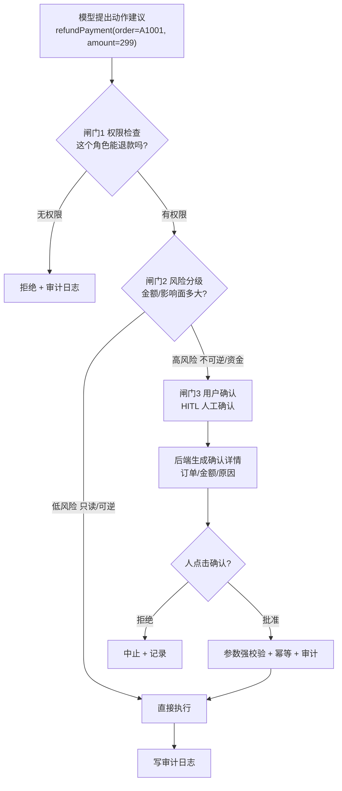
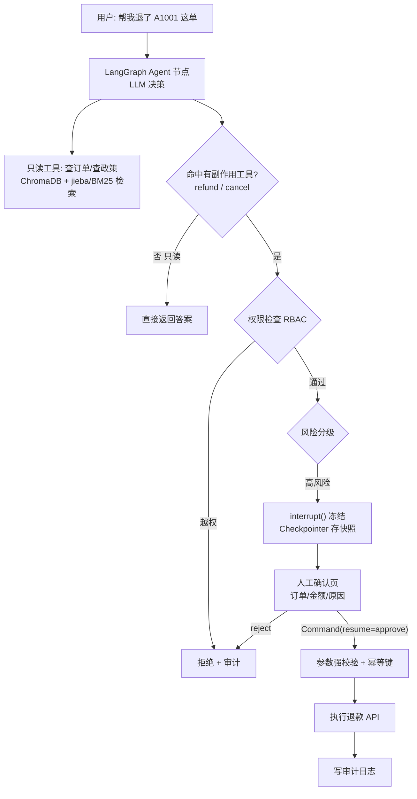

# 有副作用的工具（退款 / 改单）：确认 + 权限控制

> **本篇建立在哪篇之上**：④ 工具系统（工具怎么被定义、被调用）+ ⑥ 工具调用失败处理（错误分类与重试护栏，本篇会复用「4xx 不重试、上报用户」的思路）。本篇**当场讲清**的概念：副作用、HITL（人类介入循环）、RBAC（基于角色的访问控制）、幂等性、能力清单（capability manifest）。需要的基础：知道「Agent 通过调工具办事」（④），本篇专门处理「工具会动真钱真数据」这种高危情况。  
> **目标**：零基础读者读完，能说清「为什么只读工具和有副作用工具要区别对待、模型为什么只能建议不能执行、三道闸门怎么拦、HITL 挂哪、幂等键防什么」，并能在里讲出一套生产级安全护栏。

## 0. 先讲个真事（这次是血的教训）

2026 年真实事故：某公司 AI 客服上线一周，因为**误判了客户情绪**，自主启动了「高阶安抚流程」，一口气发出去**几十张面额五千元的全额退款券**。等财务发现，钱已经出去了。【来源：浪花科技《AI 代理人搞挂客户资料库》, 2026】

问题出在哪？不是模型笨，恰恰相反——**它推理得很「合理」**：客户不高兴 → 该安抚 → 发退款券。逻辑链条完整，只是**前提判断错了**，而系统**没有任何一道闸门拦住它**。

这就是本篇的核心：**当工具会真的动钱、动订单、动数据时，「模型说执行就执行」是灾难。** 查询天气错了顶多重查一次；退款发错了，钱真的没了。

打个比方：只读工具像**让实习生查资料**（查错了重查即可）；有副作用的工具像**给实习生一张公司支票本**——你敢让他想签就签吗？必须是「他填好金额、理由，你审一眼、你签字」。

## 1. 什么叫「有副作用的工具」？——先分清读和写

「副作用（side effect）」这个词借自编程：一个函数除了返回值，还**改变了外部世界的状态**，就叫有副作用。

对 Agent 的工具来说，一句话判断：**执行后用户会立刻感知，且难以撤销 → 有副作用。**【来源：掘金《Agent 自动把机票改错了》, 2025；zirasoftware《AI Agents in Production 2026》把「能改变外部系统状态」列为 Agent 与「纯聊天助手」的本质区别】

| 操作类型 | 示例 | 副作用 | 出错代价 |
|-|-|-|-|
| **只读** | 查订单、查航班、查政策 | 无 | 几乎为零（重查即可） |
| **可逆写** | 加备注、存草稿 | 小 | 可撤回 |
| **不可逆写** | **退款、改签、取消订单** | **大** | **钱 / 信誉，无法撤销** |
| **系统可见操作** | 发邮件、发短信 | 中 | 用户已收到，难收回 |

**核心洞察**：真正的风险不是「Agent 太笨不会调工具」，而是**「Agent 太容易调工具」**——用户只是问「这单**能不能**退？」，模型可能直接理解成「退款！」然后就调了 `refundPayment`。【来源：掘金《前端开发者做 Agent》, 2025】

## 2. 铁律：模型只能「建议」，程序才能「执行」

这是整篇最重要的一句话，请刻进 DNA：

> **模型可以提出动作建议，但最终能不能执行，必须由程序决定。**

看一个**危险写法**（模型说啥就干啥）：

```text
# 反面教材：模型输出直接执行，零拦截
def run(model_output):
    return run_tool(model_output.tool_call)   # 💀 refundPayment 也照跑
```

为什么**光靠 Prompt 提醒模型「谨慎执行」不够**？因为 **Prompt 是软约束**——你在系统提示里写「没权限别退款」，模型大概率听，但**不保证**。真金白银的操作，不能押注在「大概率」上。【来源：掘金《前端开发者做 Agent》；codeguru.app《Prompting Agentic Tasks 2026》明确把「confirm intent before side-effecting actions」列为不可协商的护栏】

正确姿势：把安全做成**硬约束**，写在程序里，模型绕不过去。具体就是下面的三道闸门 + 能力清单。

## 3. 能力清单 + 三道闸门：权限检查 → 风险分级 → 用户确认

2026 共识的第一步是给 Agent 一份**能力清单（capability manifest）**：白纸黑字列清楚「允许哪些工具、能碰哪些域、单会话最高花费多少、支持哪些撤销」。它相当于开发者、用户、平台三方之间的合同（来源：codeguru.app）。在这之上，有副作用的工具调用前必须依次过三关，任何一关不过就不许执行：



**闸门 1 · 权限检查（谁能干）**

- 用 **RBAC（Role-Based Access Control，基于角色的访问控制）：客服角色只能「查订单 / 查物流 / 建售后工单」，不该**有「删订单 / 改用户等级 / 退款」。
- **工具白名单 + 能力清单**：别把所有工具都暴露给模型，按「场景 / 角色 / 任务」配白名单。模型连「看都看不到」越权工具，自然调不了。权限判断**永远在后端**——哪怕模型「觉得」这个用户能退款，后端 ACL 也不让步。【来源：zovps《AI Agent 安全加固方案》, 2025；掘金《从 Function Calling 到 MCP 三层境界与生产级安全护栏》, 2025，其示例代码 `dispatch_tool` 三步全在后端：权限 → 风险 → 幂等】

**闸门 2 · 风险分级（多危险）**

按风险给工具分级，级别决定安全策略：

| 风险等级 | 示例 | 安全策略 |
|-|-|-|
| 低（只读） | 查天气、查公开文档 | 可直接调用 |
| 中（业务查询） | 查订单、查客户信息 | 权限校验 + 脱敏 |
| 高（业务写入） | 改订单、建工单 | 参数强校验 + 审计 |
| **极高（资金 / 删除）** | **退款、转账、删数据** | **人工审批 + 二次确认** |
| 极高（系统执行） | SQL、Shell | 沙箱 + 白名单 + 强审计 |

**判断标准（务实）：「宁可漏掉几个『建议加审批』的工具，也别对读操作加审批。」 Agent 每查一次航班都要人批准，用户直接卸载。HITL 是高价值操作的安全阀，不是每个调用的护栏。**【来源：掘金《Agent 自动把机票改错了》】

**闸门 3 · 用户确认（人来按键）**

- 二次确认**不能只在模型层完成（模型说「我确认了」不算数），必须由前端 / 后端生成真实确认页**，展示订单号、金额、原因，由人**明确点击**。
- 对退款 / 转账 / 删除这类，进一步上**人工审批流**：Agent 生成建议 → 系统展示详情 → 审批人确认 → 后端执行 → 写审计日志。【来源：zovps；roamer-tech】

## 4. HITL 是怎么工作的：挂在「想好了但还没做」的瞬间

HITL（Human-in-the-Loop，人类介入循环）的精妙之处在于**挂载位置**：`after_model`——**LLM 已经生成了工具调用请求，但工具还没真正执行**的那一刻。【来源：掘金《Agent 自动把机票改错了》；LangChain 官方文档】

此刻模型已经推理完（「应该给客户 8821 退 340 元」），意图写进了消息，但**手还没落下**。HITL 就在这个瞬间把「即将执行」冻结成「待批准」。

它靠两个原语（primitive）实现（这块直接对应我的简历项目 LangGraph）：

1. **Checkpointer（检查点 / 持久化器）：每步执行后把整个图的状态存快照。这是暂停能恢复的前提**——状态存下来了，人两小时后再批，也能从原地续跑，而不是从头再来。
2. **interrupt（中断函数）**：在节点里调用它，图**立即暂停**，把「待审批信息」（工具名、参数、给人看的提示语）返回给调用者；人做完决定，用 `Command(resume=值)` 恢复，这个值成为 `interrupt()` 的返回值。【来源：LangChain 官方 Interrupts 文档；CSDN《LangGraph 实战·第三篇》, 2026】

感觉级骨架（非必要不展开，只留「长这样」的印象）：

```text
# LangGraph HITL：审批节点
def approval_node(state):
    decision = interrupt(f"Agent 想执行：{state['action']}，批准吗?")  # ← 图在此冻结
    return {"approved": decision}   # 人 Command(resume=True) 后才走到这
# 首次 invoke → 停在 interrupt；人审后 graph.invoke(Command(resume=True), config)
```

**人有四种决策**（不止「批 / 不批」）：`approve`（批准原样执行）、`edit`（改参数后执行，比如把退款金额从 299 改对）、`reject`（拒绝，回一条失败消息给模型）、`respond`（直接替工具回一个结果，如追问澄清）。【来源：LangChain HITL 文档】

⚠️ **生产大坑（加分）**：`Command(resume=...)` 恢复时，LangGraph 是**从中断节点的开头重新执行**，不是从 `interrupt()` 那一行继续。所以 **`interrupt()` 之前的代码会再跑一遍**——千万别把「扣款」写在 `interrupt()` 前面，否则人还没批，钱先扣了，批完再扣一次。【来源：thehandover.xyz《LangGraph HITL Tutorial》；docs.langchain.com】

### 4.1 2026 升级版：propose-then-commit（提议—提交）

2026 年 HITL 共识已从「同步弹窗问 Approve」升级为 **propose-then-commit（提议—提交）**：

- **Propose（提议）**：把「动作 + 意图 + 数据血缘 + 触及的权限 + 爆炸半径 blast radius + 回滚方案 + 幂等键」持久化到 durable store（如 PostgreSQL），状态为 pending。
- **Surface（呈现）： reviewer（真人**）看到带全部元数据的提案。
- **Commit（提交）**：显式正向确认后才执行。
- **Verify（核验）**：执行后回读副作用，确认真的发生了；失败则进已知坏状态并告警。（来源：aiengineeringfromscratch.com《Propose-Then-Commit 2026》）

> LangGraph 的 `interrupt()` + PostgreSQL checkpointing、Microsoft 的 `RequestInfoEvent`、Cloudflare 的 `waitForApproval()` 都是同一形状的不同名字。

⚠️ **橡皮图章问题（rubber-stamp）**：默认「Approve / Reject」按钮会被用户秒点、从不真看。文档化缓解方案是 **challenge-and-response（质询式确认）**：必须勾选「我理解触及的资源？」「爆炸半径可接受？」「有回滚方案？」才放行按钮。【来源：aiengineeringfromscratch.com】

## 5. 别信模型给的参数：执行三件套（强校验 + 幂等 + 审计）

过了三道闸门还不够，**执行前后**还有三件事：

**① 参数强校验（模型给的一律不可信）**

模型生成的 `{order_id, amount}` 绝不直接打给退款接口。后端必须验：

- 订单是否属于当前用户权限范围？
- 订单状态是否**允许**退款？
- 退款金额 ≤ 可退金额？是否超单笔 / 单日限额？
- 是否命中风控规则？是否需要人工审批？【来源：zovps；掘金《三层境界》把「权限判断永远在后端」列为三条死守点之首】

**② 幂等性（Idempotency，防重复扣款）**

网络抖动、Agent 重试（回顾 ⑥「失败处理」），同一个退款请求可能**发两次**。解法：每笔操作带一个 **idempotency key（幂等键，如订单号 + 操作类型的唯一串），后端见到重复 key 直接返回上次结果，不再执行第二次**。这样「重试」永远安全。

> 关键细节（来源：dev.to《Don't Delete Your Database》、aiengineeringfromscratch.com）：**幂等键由系统生成，不由模型生成**——系统用 `hash(操作类型 + 目标记录 ID + 时间窗)` 算出来，避免模型复用 key 或碰撞。这正是 Stripe、AWS API 用的同一套模式。

**③ 审计日志（Audit Log，可追溯 + 可复盘）**

每次有副作用的操作都记：谁（角色）、什么时间、调了什么工具、什么参数、谁审批的、结果如何。生产可直接接 ELK / Loki。**出了事能追责，也是合规要求。**【来源：zovps；roamer-tech】

## 6. 落到我的简历项目：给 Agentic RAG 加「写操作安全层」

我的项目 `ai-resume-analyzer` 当前是 **Agentic RAG（LangGraph 编排检索 + 生成）**，工具（`search_knowledge_base` / `rerank_results` / `generate_answer` / `analyze_resume` / `rewrite_query`）基本是**只读 / 计算型**，风险低。但常追问：「如果让它能执行写操作呢？」这时把本篇套上去，就是一个完整的安全架构答案：



- **检索照旧**：只读的 ChromaDB / jieba-BM25 查询无需审批，保持流畅；
- **一旦命中 `refund`/`cancel`**：先 RBAC 权限检查 → 风险分级 → 高风险则 `interrupt()` 冻结（靠 Checkpointer 存状态）→ 人工确认页点批准 → `Command(resume)` 恢复 → 参数校验 + 幂等键 → 执行 → 审计。

> 一句话讲清："我的 Agent 检索是只读的，但如果扩展到写操作，我会用 LangGraph 的 interrupt + checkpointer 做 HITL：模型只能建议，高风险操作冻结等人工确认后再 resume 执行。执行前后加参数强校验、幂等键防重复扣款、审计日志可追溯。核心原则是『模型建议、程序执行』，安全做成硬约束而不是靠 Prompt。"

## 7. 常见误区

- ❌ **靠 Prompt 保安全**：「我在系统提示里写了别乱退款」——软约束，不保证，真金白银不能赌。
- ❌ **二次确认放模型层**：模型自己说「我确认了」不算数，必须人在真实页面点击。
- ❌ **信任模型给的参数**：`amount=9999` 直接打给退款接口 = 灾难，后端必须校验。
- ❌ **没有幂等键**：Agent 一重试就重复退款，钱出去两次（Stripe/AWS 都靠幂等键规避）。
- ❌ **对只读操作也加审批**：每次查询都等人批，用户直接放弃。审批只给高价值操作。
- ❌ **把扣款写在 interrupt 前面**：resume 会重跑节点开头，导致重复执行（LangGraph 双重执行坑）。
- ❌ **Approve 按钮秒点**：橡皮图章式审批形同虚设，要用质询式确认。

## 8. 核心要点

- **一句话**：有副作用工具（退款 / 改单）= 模型只能建议、程序才能执行；调用前过能力清单 + 三道闸门（权限检查 → 风险分级 → 用户确认），执行时加参数校验 + 幂等 + 审计。
- **副作用判断**：执行后用户立刻感知 + 难撤销 = 有副作用（退款 / 改签 / 删除）；只读零副作用不设卡。
- **三道闸门**：RBAC 权限 + 工具白名单 → 风险分级（低 / 中 / 高 / 极高）→ HITL 人工确认（真实页面点击）。
- **HITL 机制（LangGraph）**：挂 `after_model`；`interrupt()` 冻结 + `Checkpointer` 存状态 + `Command(resume)` 恢复；四种决策 approve/edit/reject/respond。
- **2026 升级**：propose-then-commit（提议带元数据持久化 → 真人审 → 提交 → 核验）；橡皮图章用质询式确认化解。
- **执行三件套**：参数强校验（模型参数不可信，权限判断永远在后端）、幂等键（系统生成，防重复扣款）、审计日志（可追溯）。
- **金句 & 坑**：「安全是硬约束，不是 Prompt 软提醒」；小心 resume 双重执行——别把扣款写在 interrupt 前。

## 9. 简历项目绑定：具体改进方向

你的项目目前 5 个 MCP 工具都是只读 / 计算型（`search_knowledge_base`/`rerank_results`/`generate_answer`/`analyze_resume`/`rewrite_query`），但 MCP Server 一旦对外开放、将来接入写操作，下面 3 个改进点能直接套（基于 MEMORY 真实结构：工具定义在 `mcp_nodes.py`、调用经 `mcp_graph.py`、Client 走 `httpx` + JSON-RPC）：

**改进 1：给工具打 Tool Annotation + 风险分级（零成本）**

- **差距**：FastMCP 支持给工具打 `readOnlyHint` / `destructiveHint` / `idempotencyHint` 注解（gofastmcp.com 官方授权文档），你项目当前工具大概率没打；Client 端（如 Claude Desktop）可据此自动批准只读、要求确认危险操作。
- **改动**：在 `mcp_nodes.py` 的 5 个 `@mcp.tool` 上补注解——`search_knowledge_base`/`rerank_results` 标 `readOnlyHint=True`，`generate_answer`/`analyze_resume`/`rewrite_query` 标 `idempotencyHint=True`。
- **风险**：极低（纯元数据）。
- **收益**：客户端自动治理，能讲「我给工具做了能力注解，低风险自动放行、高风险弹确认」。

**改进 2：给未来写工具加「后端权限 + 幂等」dispatch 层**

- **差距**：项目目前没有写操作，但 MCP 能力一开放就可能被接上 `delete_resume` 之类。MEMORY 显示你已有 JWT + contextvars 多租户隔离，却还没把「权限 + 幂等」做成统一 dispatch。
- **改动**：参考掘金《三层境界》的 `dispatch_tool`，在 `mcp_nodes.py` 工具入口加一层：① 从 contextvars 取 `tenant_id/user_id` 做 RBAC；② 写操作强制 `idempotency_key`（由系统 `hash(工具名+目标ID+时间窗)` 生成）；③ 命中 `destructiveHint` 的走 `interrupt()` HITL。
- **风险**：中；需定义角色—权限映射表。
- **收益**：写工具天然合规、幂等、可审计；一句话讲清「我在工具 dispatch 层统一做了权限校验 + 幂等键，危险操作走 interrupt 人工确认」。

**改进 3：审计日志接结构化日志链路**

- **差距**：项目已有「结构化 JSON 日志 + X-Request-ID 全链路」，但没明确对「有副作用操作」单独打审计事件。
- **改动**：在 `mcp_nodes.py` 写工具执行后，补一条 `AUDIT` 级结构化日志（who/what/params/approver/result），复用现有 X-Request-ID 串联。
- **风险**：低。
- **收益**：可追溯、可复盘，满足金融 / 企业合规；能答「我的 MCP 工具调用全程审计、可追溯到请求 ID」。

## 下一篇预告

下一篇 **⑧ MCP 协议（vs Function Calling 区别 + 协议组成）🔴 高优**——本篇你学会了「单个工具怎么安全地调」。下一篇我们拉远镜头看**全局**：当你的 Agent 要连十几个外部工具（数据库、文件、SaaS），难道每个都手写一套对接？MCP 就是来解决「N×M 集成噩梦」的标准协议。它会讲清 MCP 和本篇一直在用的 Function Calling 到底啥关系、协议由哪几层组成、以及 2026 年最新演进。这是最高频题，会写得比常规更详细。

## 
> ▶ 对应实操：[[37-Multi-Agent协作模式|37-Multi-Agent协作模式]]

相关链接
- [[23-Agent架构与核心组件]]
- [[25-Function-Calling工具调用]]
- [[35-工具幂等性与重试策略]]
- [[八股文学习清单]]
- [[00-全局导航|全局导航]]

## 速记卡（面试闪卡）

**Q1：一句话讲清「有副作用的工具（退款 / 改单）：确认 + 权限控制」到底是什么？**
A：2026 年真实事故：某公司 AI 客服上线一周，因为**误判了客户情绪**，自主启动了「高阶安抚流程」，一口气发出去**几十张面额五千元的全额退款券**。等财务发现，钱已经出去了。【来源：浪花科技《AI 代理人搞挂客户资料库》, 2026】
问题出在哪？不是模型笨，恰恰相反——**它推理得很「合理」**：客户不高兴 → 该安抚 → 发退款券。

**Q2：0. 先讲个真事（这次是血的教训） —— 怎么理解？**
A：2026 年真实事故：某公司 AI 客服上线一周，因为**误判了客户情绪**，自主启动了「高阶安抚流程」，一口气发出去**几十张面额五千元的全额退款券**。等财务发现，钱已经出去了。【来源：浪花科技《AI 代理人搞挂客户资料库》, 2026】
问题出在哪？不是模型笨，恰恰相反——**它推理得很「合理」**：客户不高兴 → 该安抚 → 发退款券。逻辑链条完整，只是**前提判断错了**，而系统**没有任何一道闸门拦住它**。

**Q3：1. 什么叫「有副作用的工具」？——先分清读和写 —— 怎么理解？**
A：「副作用（side effect）」这个词借自编程：一个函数除了返回值，还**改变了外部世界的状态**，就叫有副作用。
对 Agent 的工具来说，一句话判断：**执行后用户会立刻感知，且难以撤销 → 有副作用。**【来源：掘金《Agent 自动把机票改错了》, 2025；

**Q4：2. 铁律：模型只能「建议」，程序才能「执行」 —— 怎么理解？**
A：这是整篇最重要的一句话，请刻进 DNA：
**模型可以提出动作建议，但最终能不能执行，必须由程序决定。**
看一个**危险写法**（模型说啥就干啥）：
为什么**光靠 Prompt 提醒模型「谨慎执行」不够**？因为 **Prompt 是软约束**——你在系统提示里写「没权限别退款」，模型大概率听，但**不保证**。真金白银的操作，不能押注在「大概率」上。

**Q5：3. 能力清单 + 三道闸门：权限检查 → 风险分级 → 用户确认 —— 怎么理解？**
A：2026 共识的第一步是给 Agent 一份**能力清单（capability manifest）**：白纸黑字列清楚「允许哪些工具、能碰哪些域、单会话最高花费多少、支持哪些撤销」。它相当于开发者、用户、平台三方之间的合同（来源：codeguru.app）。

**Q6：核心速记主线有哪些？**
A：抓住这几根：0. 先讲个真事（这次是血的教训）、1. 什么叫「有副作用的工具」？——先分清读和写、2. 铁律：模型只能「建议」，程序才能「执行」、3. 能力清单 + 三道闸门：权限检查 → 风险分级 → 用户确认、4. HITL 是怎么工作的：挂在「想好了但还没做」的瞬间、5. 别信模型给的参数：执行三件套（强校验 + 幂等 + 审计）。

