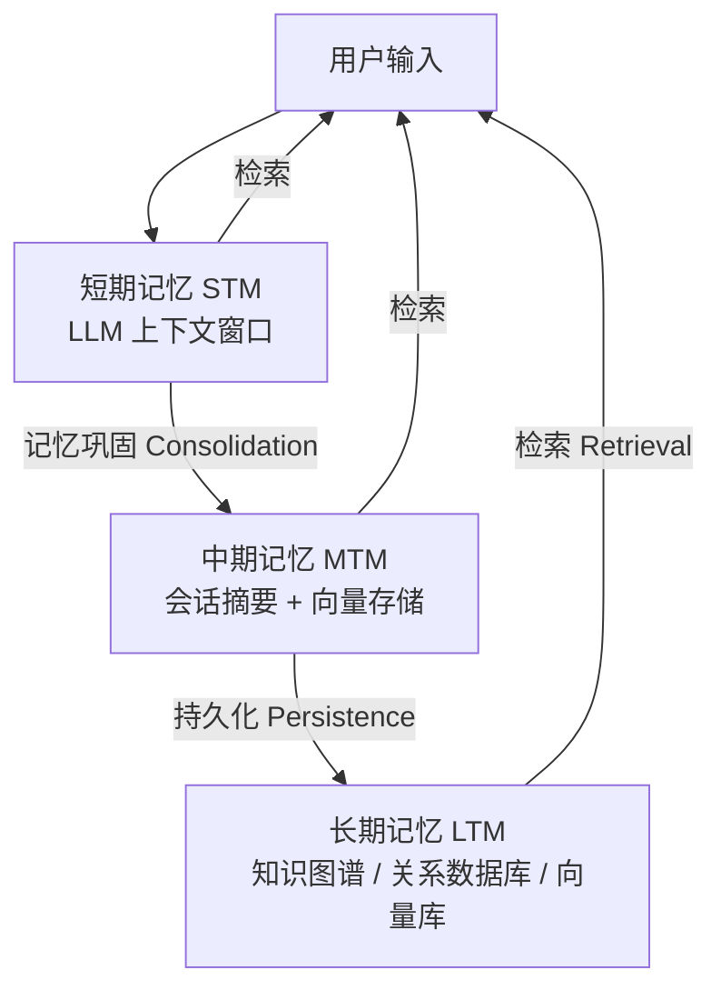
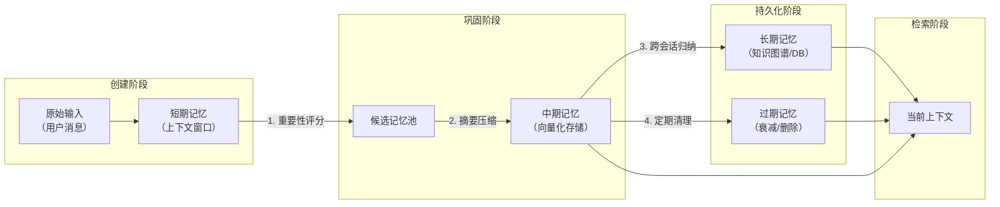
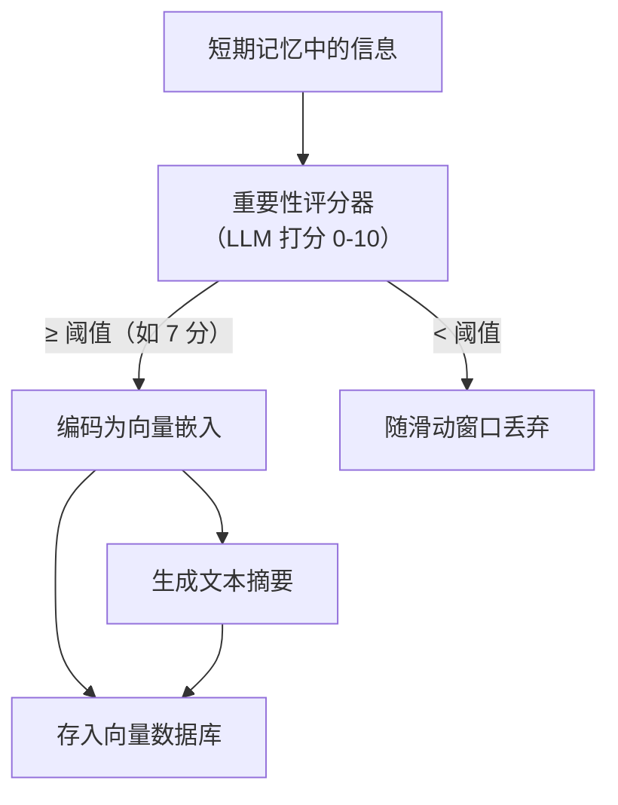
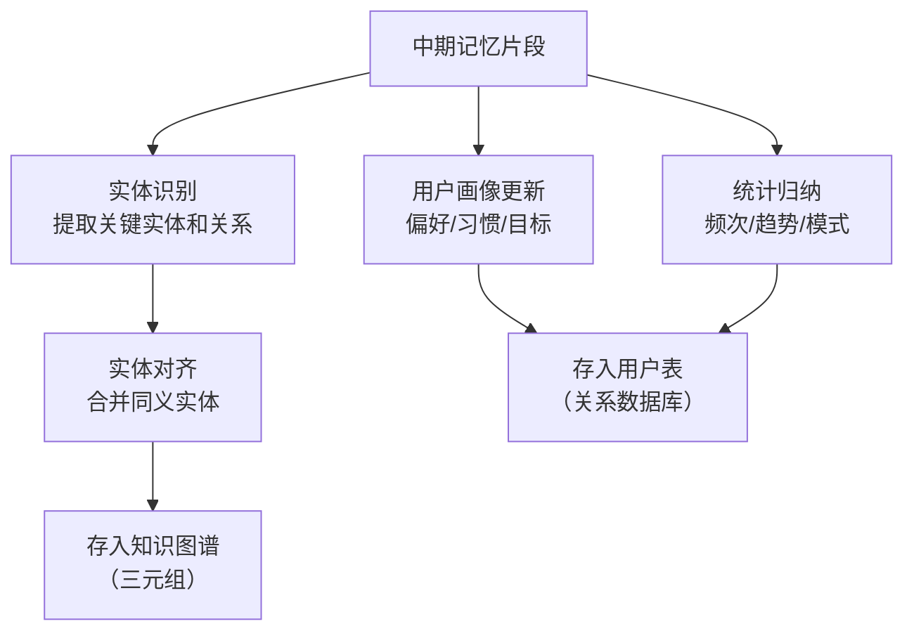

---

title: "记忆系统三层架构-存储介质与生命周期"

created: "2026-07-13"

tags:

  - 八股文

  - ai

---

# 记忆系统三层架构：存储介质与生命周期

> Agent 的记忆系统通常分为三层：短期记忆（会话上下文）、中期记忆（会话摘要）、长期记忆（持久化知识）。每层有不同的存储介质和生命周期。

## 三层架构总览



### 各层详细对比

| 维度 | 短期记忆（STM） | 中期记忆（MTM） | 长期记忆（LTM） |
|------|---------------|---------------|---------------|
| **存储位置** | LLM 上下文窗口（内存） | 向量数据库 / Redis | 知识图谱 / SQL / 对象存储 |
| **容量** | 4K~128K tokens | 数十万~百万条目 | 理论无限 |
| **持久性** | 🌫️ 会话内（几秒~几小时） | 📄 跨会话（天~周） | 🏛️ 永久（月~年） |
| **更新频率** | 每轮对话 → 实时更新 | 会话结束时批量写入 | 事件触发、定期归纳 |
| **访问速度** | 🚀 纳秒级（内存） | ⚡ 毫秒级（向量检索） | 🐢 秒级（图查询复杂推理） |
| **数据结构** | 原始消息列表 | 向量嵌入 + 摘要文本 | 三元组 / 结构化记录 |
| **容量上限** | 超限→滑动窗口淘汰或压缩 | 超限→LRU 淘汰或摘要压缩 | 极少超限 |
| **丢失后果** | 丢了大不了重新检索 | 丢了失去会话级上下文 | 丢了不可恢复 ⚠️ |
| **典型实现** | LangChain BufferMemory | MemGPT 存档记忆 | Neo4j 知识图谱 |

### 生命周期流转图



---

## 各层存储介质深度对比
### 存储介质选型

| 介质 | 读写速度 | 持久性 | 适合存储 | 不适合 |
|------|---------|--------|---------|--------|
| **LLM 上下文窗口** | 极快（内存） | 无 | 当前对话消息列表 | 任何跨会话需求 |
| **向量数据库**（Milvus/Pinecone） | 快（索引+检索） | 持久 | 语义相似的记忆片段 | 精确结构化查询 |
| **关系数据库**（PostgreSQL） | 中 | 持久 | 用户画像、偏好、结构化数据 | 非结构化文本语义检索 |
| **键值存储**（Redis） | 极快 | 可配置 | 会话缓存、最新 N 条历史 | 大规模历史检索 |
| **知识图谱**（Neo4j） | 慢（图遍历） | 持久 | 实体关系、多跳推理 | 高频实时读写 |
| **文件系统**（JSON/Markdown） | 慢（IO） | 持久 | 配置、模板、标记数据 | 频繁检索 |

### 存储介质选型决策树

```text

需要多快？

├─ 纳秒级 → LLM 上下文窗口 / Redis 缓存

└─ 毫秒级 →

   ├─ 需要语义检索 → 向量数据库

   ├─ 需要精确查询 → 关系数据库

   └─ 需要多跳推理 → 知识图谱

```

---

## 记忆生命周期管理
### 1. 创建（Create）

记忆从用户输入或 Agent 推理结果产生，进入短期记忆。

```text

触发条件：

  ├─ 用户发送消息 → 原始输入

  ├─ Agent 生成回复 → 推理结果

  ├─ 工具调用结果 → 事实数据

  └─ 内部反思 → 自我生成的洞见

```

### 2. 巩固（Consolidation）— 短期→中期



**巩固策略对比**：

| 策略 | 做法 | Token 开销 | 信息保真度 |
|------|------|-----------|-----------|
| **原始保存** | 整段对话原样存入 | 🔴 高 | 🟢 最高 |
| **摘要压缩** | LLM 压缩为摘要后存入 | 🟡 中 | 🟡 中（可能丢细节） |
| **重要性过滤** | 只存评分高的片段 | 🟢 低 | 🟡 中（依赖评分准确性） |
| **反射归纳** | Agent 定期反思提炼洞见 | 🔴 高 | 🟢 高（深度理解） |

**考点**：重要性评分通常是个分类任务（让 LLM 判断"这条信息对理解用户有多重要"），而非生成任务，可以用小模型（如 GPT-4o-mini）来做以降低成本和延迟。

### 3. 检索（Retrieval）— 从存储中召回

```text

用户输入 → 生成查询向量 → 多路召回:

  ├─ 向量相似度（语义匹配）

  ├─ 时间权重（近期优先，衰减因子 γ）

  ├─ 重要性加权（高分优先）

  └─ 关键词匹配（BM25 精确命中）

  ↓

融合排序（Rerank）→ 取 Top-K → 注入上下文窗口

```

**检索策略详解**：

| 策略 | 原理 | 代码示意 | 适用场景 |
|------|------|---------|---------|
| **最近优先**（Recency） | 按时间戳降序取最近 N 条 | `.sort(desc_by_time).limit(5)` | 短期对话历史 |
| **语义相关**（Relevance） | 向量余弦相似度最高 | `.similarity_search(query, k=5)` | 事实性知识召回 |
| **重要性优先**（Importance） | LLM 评分高的优先 | `.filter(score > 7).limit(5)` | 高价值信息 |
| **混合检索**（Hybrid） | 向量+BM25 加权融合 | `alpha * vector + (1-alpha) * bm25` | 通用场景（推荐） |
| **时间衰减检索** | 相关性 × exp(-λ·Δt) | `relevance * math.exp(-0.1 * days)` | 时效敏感的上下文 |

### 4. 衰减与遗忘（Decay & Forgetting）

```text

遗忘 = 主动设计，不是缺陷

         ↓

防止记忆库无限膨胀

保持检索精度（噪声越少，命中越准）

```

| 遗忘机制 | 策略 | 触发条件 |
|---------|------|---------|
| **滑动窗口** | 只保留最近 N 轮对话 | 每轮对话后 |
| **TTL 过期** | 设定生存时间（如 7 天） | 定时清理 |
| **LRU 淘汰** | 最久未访问的先淘汰 | 容量超限时 |
| **重要性阈值** | 低于评分阈值的清除 | 周期性扫描 |
| **摘要合并** | 多条旧记录→一条摘要 | 定期维护 |

### 5. 持久化（Persistence）— 中期→长期

长期记忆不是简单地从向量库"复制一份"，而是经过**抽象和结构化**：



---

## 多 Agent 记忆共享
### 三种架构

| 架构 | 示意图 | 优点 | 缺点 | 典型场景 |
|------|--------|------|------|---------|
| **集中式** | 所有 Agent ↔ 共享向量库 | 🟢 一致性强、容易管理 | 🔴 并发控制复杂、单点瓶颈 | 小型团队协作 |
| **分布式** | Agent A → 私有库 A<br>Agent B → 私有库 B | 🟢 简单、隔离性好 | 🔴 信息孤岛、一致性差 | 独立子任务 |
| **混合式** | 共享全局库 + 各 Agent 私有缓存 | 🟢 兼顾共享和隔离 | 🟡 实现复杂 | 生产系统（推荐） |

### 共享一致性挑战

| 问题 | 表现 | 解决方案 |
|------|------|---------|
| **写冲突** | 两 Agent 同时更新同一记忆 | 乐观锁（版本号）/ 最后写入者胜 |
| **读脏数据** | 读到 Agent A 未写完的中间状态 | 读写分离 + 最终一致性 |
| **记忆膨胀** | 多 Agent 写入 → 记忆库快速膨胀 | 统一遗忘策略 + 全局去重 |
| **上下文漂移** | Agent A 更新了用户偏好，B 不知道 | 事件通知 / 定时同步 |

---

## 快速问答

| 问题 | 参考答案 |
|------|---------|
| **记忆系统三层架构是什么？各层区别？** | STM（短期）：LLM 上下文窗口，会话级，存原始消息；MTM（中期）：向量数据库，跨会话，存摘要和嵌入；LTM（长期）：知识图谱/关系库，永久，存结构化知识和用户画像。加分：说出每层的存储介质、容量上限、持久性和访问速度 |
| **如何用向量存储实现 Agent 记忆？** | 三步：① 编码 — 将对话历史/用户偏好编码为向量嵌入 ② 存储 — 存入向量数据库 ③ 检索 — 语义相似度找到相关记忆，注入 LLM 上下文。关键设计：重要性评分决定存不存，混合检索（向量+BM25）决定怎么查，Top-K 截断控制上下文用量 |
| **多 Agent 如何共享记忆？三种架构的选型？** | ① **集中式** — 共享库，一致性强但并发复杂，适合小团队 ② **分布式** — 私有库，简单隔离但信息孤岛，适合独立子任务 ③ **混合式**（推荐）— 全局共享+私有缓存，兼顾共享和隔离，适合生产系统 |
| **什么是记忆巩固（Consolidation）？** | 短期→中期的信息转移过程。核心步骤：重要性评分（LLM 打分 0-10）→ 高分者编码为向量 → 存入数据库 + 生成摘要。关键：用小模型做评分以降低成本。考点：不是所有信息都值得存，要设置评分阈值 |
| **遗忘机制在记忆系统中的作用？** | 本质是"保持检索精度的主动设计"而非缺陷。机制：① 滑动窗口 — 保最近 ② TTL 过期 — 按时间淘汰 ③ LRU — 最久未访问先出 ④ 重要性阈值 — 低分清除 ⑤ 摘要合并 — 多条变一条。加分：说清楚"遗忘 = 信号/噪声比优化" |
| **如何设计记忆检索策略？** | 推荐**混合检索**：向量相似度（语义匹配）+ BM25（关键词精确）+ 时间衰减（近期加权），融合排序后取 Top-K。时间衰减公式：`score = similarity × exp(-λ × days_ago)`。太老的记忆即使语义匹配也不应排前面 |
| **短期记忆溢出了怎么处理？** | 三种策略组合使用：① **滑动窗口** — 只保留最近 N 轮（保底）② **摘要压缩** — 溢出部分压缩为摘要塞回窗口 ③ **检索式记忆** — 溢出部分存向量库，需要时检索。实际系统常：滑动窗口 + 滚动摘要 + 按需检索 |
| **长期记忆的存储格式为什么不是简单的向量？** | 长期记忆需要**抽象和结构化**：原始对话→实体识别→关系提取→实体消歧→存入知识图谱（三元组）。同时更新用户画像（偏好/习惯/目标）。原因：长期需求是精确查询和多跳推理，向量语义匹配不够精准 |
| **记忆系统的存储介质如何选型？** | 决策树：纳秒级→上下文窗口/Redis；毫秒级→看需求：语义检索用向量库、精确查询用关系库、多跳推理用图库。生产系统通常组合使用：Redis 缓存热数据 + 向量库存语义 + 图库存关系 |
| **记忆检索中"时间衰减"如何实现？** | 公式：`final_score = similarity × exp(-λ × Δt)`，其中 λ 是衰减率（如 0.1/天），Δt 是距今天数。效果：3 天前的记忆 relevance 打七折，30 天前的几乎为零。调参策略：时效敏感的任务用大 λ（快速衰减），长期知识用 λ≈0 |
| **Agent 如何做记忆重要性评分？** | 让 LLM 判断"这条信息对理解用户/完成任务有多重要"，输出 0-10 分。实现要点：① 用分类而非生成（小模型即可）② 评分标准要明确（如"用户的明确偏好=9分、闲聊=1分"）③ 设阈值（如 ≥7）才进入中期记忆 ④ 异步批量评分，不阻塞主流程 |

## 速记卡（面试闪卡）

**Q1：一句话讲清「记忆系统三层架构：存储介质与生命周期」到底是什么？**

A：记忆系统三层架构：短期（上下文）、中期（向量摘要）、长期（图谱/库），各用不同介质与生命周期。

**Q2：一、三层架构总览 —— 怎么理解？**

A：像人脑三级：STM=工作台（上下文窗口）、MTM=备忘录（向量库）、LTM=档案室（图谱/库），逐级巩固（STM/MTM/LTM）。

**Q3：二、存储介质深度对比 —— 怎么理解？**

A：纳秒级用上下文/Redis，毫秒级语义检索用向量库、精确查询用关系库、多跳推理用图谱（Decision Tree）。

**Q4：三、生命周期管理 —— 怎么理解？**

A：创建→巩固（重要性评分≥7 才编码）→检索（混合：向量+BM25+时间衰减）→衰减遗忘，遗忘是主动设计（Consolidation）。

**Q5：四、多 Agent 记忆共享 —— 怎么理解？**

A：集中式（共享库）一致但瓶颈、分布式（私有库）隔离但孤岛、混合式（共享+缓存）生产推荐（Consistency Trade-off）。

**Q6：核心速记主线有哪些？**

- 三层：STM 上下文 / MTM 向量摘要 / LTM 图谱库

- 介质：按速度语义查询推理需求选型

- 生命周期：巩固评分 + 混合检索 + 主动遗忘

- 共享：集中/分布/混合三架构，混合推荐

**口诀**

A：记忆三层分得清，短期中期与长期；

上下文窗做工作台，向量摘要记分明；

图谱库里存档案，精确推理它能行；

遗忘主动非缺陷，信号噪声比更清。

相关链接

- [[八股文学习路线图]]

- [[00-全局导航|全局导航]]

## 相关链接

- [[笔记/AI与Agent/知识/八股/28-Agent记忆基础与状态管理|Agent记忆基础与状态管理]]

- [[笔记/AI与Agent/知识/八股/39-记忆系统vs-RAG本质区别|记忆系统vs-RAG本质区别]]

- [[笔记/AI与Agent/知识/八股/40-记忆治理策略-存储召回与冲突解决|记忆治理策略-存储召回与冲突解决]]

- [[笔记/AI与Agent/知识/八股/47-单Agent-vs-多Agent选型边界判断|单Agent-vs-多Agent选型边界判断]]

- [[笔记/AI与Agent/知识/八股/42-记忆污染与纠错机制|记忆污染与纠错机制]]

