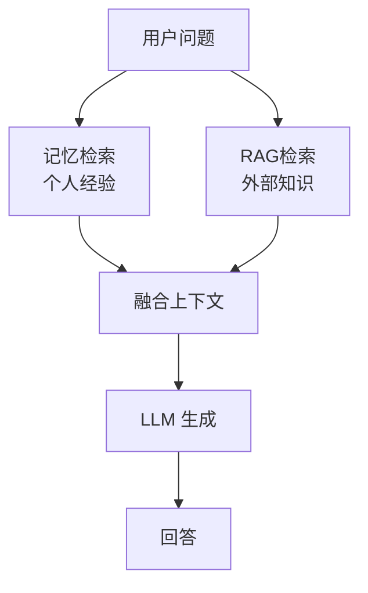
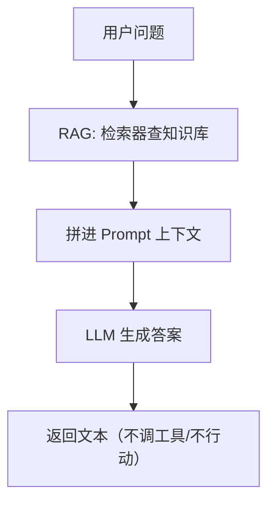
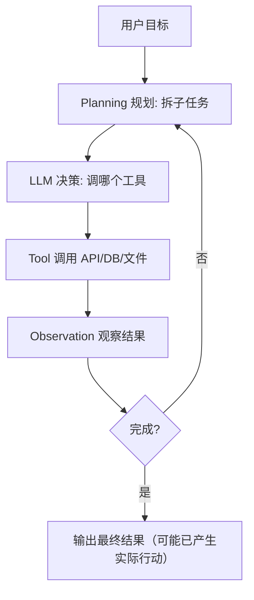

---

title: "记忆系统vs-RAG本质区别"

created: "2026-07-13"

tags:

  - 八股文

  - ai

---

# 记忆系统 vs RAG 本质区别

> 记忆是 Agent 的「私有日记」，RAG 是「公共图书馆」。一个记录个人经历，一个检索外部知识。常见的问题是："Agent 的记忆和 RAG 有什么区别？"

## 核心区别

| 维度 | Agent 记忆 | RAG |

| ------ |------------|-----|

| 数据来源 | Agent 自己的经历和交互 | 外部文档和知识库 |

| 数据所有权 | 私有（属于特定 Agent） | 共享（所有用户可用） |

| 更新方式 | 自动（交互时写入） | 手动（文档更新时重建） |

| 检索目的 | 回忆个人经验 | 获取通用知识 |

| 时效性 | 实时（刚发生的也在） | 取决于文档更新频率 |

| 隐私性 | 高（个人数据） | 低（公开数据） |

## 类比理解

**记忆系统** = 你的个人日记本

- 记录你自己的经历、偏好、决策

- 只有你能看

- 随时更新（每次交互后写入）

- 帮助你"记住过去"做出更好决策

**RAG** = 图书馆的检索系统

- 存储公共知识和文档

- 所有人都能用

- 需要定期更新（新书上架）

- 帮助你"查找信息"回答问题

## 何时用记忆，何时用 RAG？

| 场景 | 推荐方案 | 理由 |

|------|----------|------|

| 个性化推荐 | 记忆 | 需要用户历史偏好 |

| 知识问答 | RAG | 需要外部知识库 |

| 对话上下文 | 记忆 | 需要记住对话历史 |

| 文档检索 | RAG | 需要检索文档内容 |

| 用户画像 | 记忆 | 需要积累用户特征 |

| 实时信息 | RAG | 需要最新数据 |

## 记忆 + RAG 融合

实际应用中，两者往往结合使用：



> **最佳实践**：记忆提供个性化上下文，RAG 提供通用知识。两者互补，缺一不可。

---

---

> **本篇建立在哪篇之上**：① jieba 分词 + BM25 关键词检索（你已知道「检索 = 从资料库捞出最相关几段文字」）。本篇只需要这个直觉即可，会当场讲清 RAG 和 Agent 各自是什么、核心区别在哪。前置基础：你项目里的混合检索主干（ChromaDB 稠密 + jieba/BM25 稀疏 → RRF）就是 RAG 的「检索」那一半，本篇会把它放进更大的画框里看。

> **目标**：零基础读者读完，能说清「RAG 是知识外挂、Agent 是自主行动体」的本质差异，并且能在里讲明白「为什么你的项目叫 Agentic RAG 而不是纯 RAG」。

## 0. 先讲人话（生活化类比开篇）

想象公司里两种人：

- **RAG 像一位「资料员」。你问啥，他先冲去档案室翻资料（检索），把相关几页拍在桌上，然后照着资料念答案。他从不自己拍板做决定**——你让他「订机票」，他只会给你一份《订机票指南》，绝不真的帮你下单。

- **Agent 像一位「办事员」。你给个目标「帮我安排明天的出差」，他自己拆任务：查天气 → 比价订票 → 看日程冲突 → 真去调 API 把票下了，遇到航班取消还自己换一班。他会规划、会调工具、会反复试，直到把事办成**。

一句话：RAG 解决的是「**说对话**」（答案有据），Agent 解决的是「**办成事**」（主动行动）。这俩不是对立关系，更像是「大脑里装了资料库」和「大脑里长了手脚」的区别——后面你会看到，厉害的系统（比如你的简历项目）是把它俩焊在一起的。

## 1. 它是什么 / 为什么需要它
### 1.1 RAG：给大模型外挂一个「资料库」

**RAG = Retrieval-Augmented Generation（检索增强生成）**：先去外部知识库检索相关资料，再把资料拼进提示词，让大模型基于资料作答。它的存在是为了治大模型的「幻觉」和「知识过期」——毕竟模型训练完就「冻住」了，昨天的股价它不知道，公司内部的简历库它更不知道。

RAG 的流水线非常「线性」且「被动」：

```text

用户问题 → 检索相关文档 → 拼进上下文 → 大模型生成答案

```

它本质是「**知识外挂**」：输入一次，输出一次，不维护状态，也不做决策。**资料员，坐等被问**。（来源：GigaSpaces《How Do RAG and AI Agents Differ》2025；百度云《RAG 与 Agent 双引擎技术解析》）

### 1.2 Agent：给大模型装上「规划 + 手脚」

**Agent（智能体）**：能感知环境、自主规划、调用工具、根据结果反复调整，最终把复杂任务办完的系统。它不止「说」，还能「做」——查数据库、调 API、发邮件、操作文件。

Agent 的核心是「**自主决策闭环**」：规划 → 行动 → 观察结果 → 再规划……直到目标达成。它和 RAG 最本质的区别一句话概括（来源 GigaSpaces）：

> **RAG 是一种技术（technique），Agent 是一套系统（system）。一个管「答案靠不靠谱」，一个管「事情办没办成」。**

### 1.3 为什么非得区分清楚？

因为很多初学者（和你项目早期命名）会混淆。常见的延伸追问：「你说你做的是 Agent，那你和普通 RAG 差在哪？」本篇就是给你这个答案的弹药。

## 2. 原理拆解：两条架构线

RAG 和 Agent 不是谁取代谁，而是**分工不同**。下面两张图把「信息流」画清楚。





看出来了吧：**RAG 是一条直线（被动、一次性、只产文本）；Agent 是一个带回路的环（主动、多轮、能产行动）**。Agent 的「回路」就是它区别于 RAG 的灵魂——它根据反馈不断修正，而 RAG 生成完就结束了。（来源：CSDN / 博客园多篇 Agent 架构解析 2025–2026）

### 2.1 核心差异一张表

| 维度 | RAG（资料员） | Agent（办事员） |

|-|-|-|

| 本质 | 技术 / 方法 | 系统 / 框架 |

| 主动性 | 被动响应（你问它答） | 主动规划、主动行动 |

| 是否调工具 | 一般不调（只取资料） | 核心能力，必须调 |

| 记忆与状态 | 多数无状态、一次性 | 维护短期/长期记忆 |

| 决策权 | 流程写死 | 模型自主决定下一步 |

| 产出 | 一段文本 | 文本 + 可能的真实动作 |

| 复杂度 | 较简单 | 较复杂、需治理 |

| 典型用处 | 知识问答、文档检索 | 多步任务、流程自动化 |

（来源综合：Digitalways《RAG vs Agentic AI 2025》对比表；GigaSpaces 2025）

### 2.2 它们怎么结合：Agentic RAG

重点来了——**RAG 和 Agent 不是二选一**。现实里最猛的架构是 **Agentic RAG（智能体式检索增强）**：让 Agent 当「总指挥」，RAG 当它的「资料员」。

- Agent 的规划模块决定「这步该不该检索、检索啥」；

- 检索到了，交给 LLM 基于证据生成；

- 生成完，Agent 还能再判断「证据够不够？不够再查一轮 / 换个问法」。

你简历项目 `ai-resume-analyzer` 就是这条路：用 **LangGraph StateGraph（9 节点 + 3 条件边 + Reflexion 循环 ≤2 轮）** 把「检索 → 重排 → 生成 → 自纠」串成一个带回路的 Agent，而不是「问一次查一次念答案」的纯 RAG。**这就是它叫 Agentic RAG 而不是纯 RAG 的原因**（详见下篇 ③ 四要素）。（来源：百度云《RAG 与 Agent 融合架构 2025》）

## 3. 常见误区

- ❌ **「RAG 和 Agent 是对立技术，选一个就行」** → 错。GigaSpaces 明确：RAG 是 technique、Agent 是 system，二者互补；大多数 Agent 系统内部都嵌着 RAG 做事实支撑。（来源 GigaSpaces 2025）

- ❌ **「用了检索就是 Agent」** → 错。被动一次性检索 ≠ 自主规划。有没有「规划 + 工具调用 + 反馈回路」才是分界线。

- ❌ **「Agent 不需要 RAG」** → 错。Agent 自主决策质量高度依赖环境信息完整性，没 RAG 它就容易凭空编（幻觉）。金融/医疗 Agent 普遍在感知层嵌 RAG。（来源百度云 2025）

- ❌ **「RAG 能处理长任务、做决策」** → 错。RAG 本身是无状态、反应式的，不维护长期状态也不自主决策（来源 Digitalways 2025）。

## 4. 核心要点

- **RAG 全称**：Retrieval-Augmented Generation 检索增强生成；本质「知识外挂」，流水线 = 检索 → 拼上下文 → 生成，被动、线性、无状态。

- **Agent 是什么**：自主规划 + 调工具 + 看反馈反复试，把复杂任务办完的系统；本质是「行动体」。

- **一句话区别**：RAG 是技术（让答案有据），Agent 是系统（让事情办成）。GigaSpaces 原话：「RAG is a technique, whereas an AI agent is a system.」

- **关键差异点**：主动性（被动 vs 主动）、是否调工具、有无记忆/状态、有无反馈回路。

- **Agentic RAG**：Agent 当总指挥、RAG 当资料员；按需检索 + 多轮自我纠正。你项目即此架构（LangGraph StateGraph）。

- **选型口诀**：要「答得准」用 RAG；要「办得成」用 Agent；要又准又成，用 Agentic RAG。

## 5. 简历项目绑定：具体改进方向

基于你项目 `ai-resume-analyzer` 的真实架构（LangGraph StateGraph 9 节点 + 3 条件边 + 混合检索全链路），对照「RAG vs Agent 本质区别」，有一个**非常 concrete 的改进点**——把「Agent 的主动规划」真正落到实处，而不只是名字叫 Agentic：

**改进 1：在 StateGraph 入口加「按需检索路由节点」，体现 RAG vs Agent 的本质分界**

- **差距**：你项目目前是「固定检索 + Agent 编排」——无论问题需不需要查外部资料，都走完整混合检索链路（ChromaDB 稠密 + jieba/BM25 稀疏 → RRF k=100 → 百炼 rerank → Top5）。这其实还是 RAG 的「被动响应」思路（来一个查一个），没发挥出 Agent「该查才查、不该查直接答」的主动规划能力。一个「你好 / 谢谢」也会被拖进全套检索+重排，白烧 token。

- **具体改动点**：

  - 文件定位：后端 LangGraph 装配处 `graph.py`（或 MCP 版 `mcp_graph.py`），目前已有 3 条条件边（`add_conditional_edges`），可复用同一模式。

  - 新增一个 `route_by_intent(state)` 函数作为入口节点：用 LLM 给 query 打标（如 `need_retrieval: bool`），闲聊/纯逻辑推理类 → 直连 `generate_answer` 节点；事实/简历相关类 → 进检索分支。

  - 用 `builder.add_conditional_edges("route_by_intent", ...)` 把两条路接出来，和现有 3 条件边风格一致。

- **风险**：路由判断错误可能「该查没查」导致幻觉。缓解：路由置信度低于阈值时**默认走检索分支（fail-safe）**，不默认跳过。

- **收益**：简单 query 响应更快、省检索+rerank 的 token 成本；更重要的是——被问「你和普通 RAG 差在哪」时，你能甩出「我在 StateGraph 入口实现了意图路由，让 Agent 自主决定要不要检索，这正是 RAG（被动）与 Agent（主动规划）的本质区别」。

- **一句话讲清**：「我的系统不是无脑检索。入口有个规划节点，先判断 query 是否需要外部知识：闲聊直接生成，事实类才进 RAG 链路——这体现 Agent 的『主动按需决策』，而不是 RAG 的『来一个查一个』。」

## 下一篇预告

下一篇 **③ Agent 四要素（LLM + 工具 + 记忆 + 规划）**——本篇你搞清了「Agent 比 RAG 多了主动规划和行动能力」，下一篇就拆开看：一个能自主办事的 Agent，肚子里到底装着哪四块积木？为什么少一块都转不起来？尤其会讲清「工具」和「规划」是怎么让资料员变成办事员的。带着本篇的 RAG vs Agent 框架，下一篇会非常好懂。

##

> ▶ 对应实操：[[39-Agent评测体系：benchmark-case-指标设计|39-Agent评测体系：benchmark-case-指标设计]]

> ▶ 对应实操：[[06-RAG检索增强生成流程|06-RAG检索增强生成流程]]

## 速记卡（面试闪卡）

**Q1：一句话讲清「记忆系统 vs RAG 本质区别」到底是什么？**

A：记忆是 Agent 的私有日记，RAG 是公共图书馆；一个记经历，一个检知识。

**Q2：一、核心区别 —— 怎么理解？**

A：记忆系统像个人日记本（私有、自动写、实时），RAG 像图书馆检索系统（共享、手动更新、靠文档）。维度对比：数据来源、所有权、更新方式、检索目的、隐私性都不同。

**Q3：二、RAG 与 Agent 的本质 —— 怎么理解？**

A：RAG 是"资料员"：你问它翻档案念答案，不拍板；Agent 是"办事员"：给目标自己拆任务、调工具、办成事。一句话：RAG 是技术（technique），Agent 是系统（system）。

**Q4：三、何时用记忆 / 何时用 RAG —— 怎么理解？**

A：个性化推荐、对话历史、用户画像用记忆；知识问答、文档检索、实时信息用 RAG。像私人备忘录 vs 公用百科全书，分工明确。实际系统两者并行检索后融合。

**Q5：四、融合与 Agentic RAG —— 怎么理解？**

A：记忆给个性化上下文，RAG 给通用知识，并行检索融合注入 LLM。Agentic RAG 让 Agent 当总指挥、RAG 当资料员，按需检索 + 多轮自纠（如 LangGraph StateGraph）。

**Q6：核心速记主线有哪些？**

- 记忆=私有日记，RAG=公共图书馆

- RAG 被动检索，Agent 主动行动

- 个性化用记忆，知识问答用 RAG

- Agentic RAG：Agent 指挥、RAG 供给

**口诀**

A：私记对公库，RAG 与记忆殊；

自写个人历，外检百科书。

答准 RAG 助，办成 Agent 赴；

二者若相济，又稳又疾去。

相关链接

- [[八股文学习路线图]]

- [[00-全局导航|全局导航]]

---

## 快速问答

| 问题 | 参考答案 |

| ------ | --------- |

| Agent 记忆和 RAG 的本质区别？ | 记忆是 Agent 私有经验（个人日记），RAG 是外部知识（公共图书馆）。记忆记录个人经历，RAG 检索通用知识 |

| 何时用记忆，何时用 RAG？ | 个性化/历史偏好用记忆，知识问答/文档检索用 RAG。实际应用中两者结合使用 |

| 如何融合记忆和 RAG？ | 并行检索记忆和 RAG，将结果融合为上下文注入 LLM。记忆提供个性化，RAG 提供通用知识 |

## 相关链接

- [[笔记/AI与Agent/知识/八股/53-MCP-vs-A2A本质区别|MCP-vs-A2A本质区别]]

- [[笔记/AI与Agent/知识/八股/48-Self-RAG与Reflexion|Self-RAG与Reflexion]]

- [[笔记/AI与Agent/知识/八股/33-异常处理与降级策略|异常处理与降级策略]]

- [[笔记/AI与Agent/知识/八股/23-Agent架构与核心组件|Agent架构与核心组件]]

- [[笔记/AI与Agent/知识/八股/51-MCP-Streamable-HTTP与SSE全链路|MCP-Streamable-HTTP与SSE全链路]]

