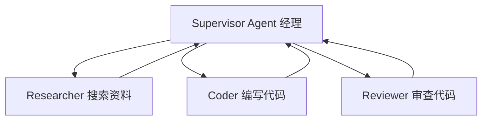
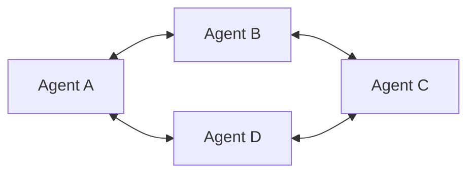
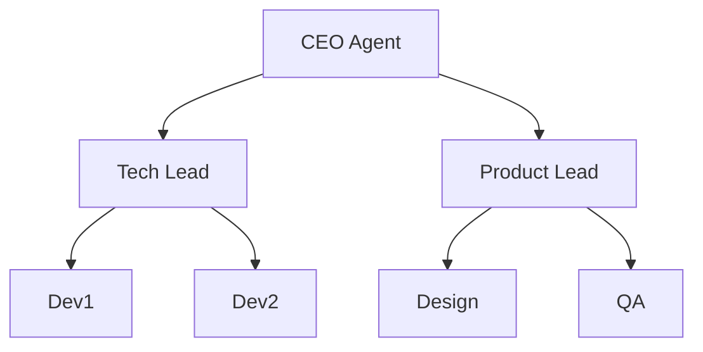
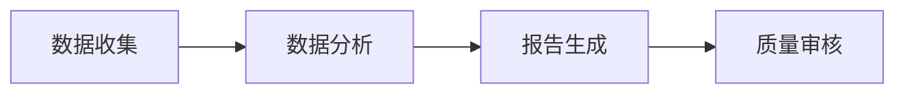

# 多 Agent 编排四种模式

> 多 Agent 系统的核心设计：谁听谁的、谁和谁通信、信息怎么流动。四种经典模式各有适用场景。

## 1. Supervisor 监督者模式

一个"经理" Agent 负责分配任务和协调，其他 Agent 执行具体工作。



**特点：**
- 清晰的层级关系
- Supervisor 负责任务分配和结果汇总
- 适合任务可明确拆分的场景

## 2. Peer-to-Peer 对等模式

所有 Agent 地位平等，通过消息传递协作。



**特点：**
- 无中心节点
- 每个 Agent 可以与其他任意 Agent 通信
- 适合需要多轮讨论达成共识的场景

## 3. Hierarchical 层级模式

多层组织结构，顶层 Agent 管理中层，中层管理底层。



**特点：**
- 适合大型复杂项目
- 层层委派，职责清晰
- 需要完善的通信协议

## 4. Debate 辩论模式

多个 Agent 对同一问题给出不同观点，通过辩论得出最佳答案。

```text
[Agent A]: 我认为方案1更好，因为...
[Agent B]: 反对，方案2在以下方面更优...
[Agent A]: 但方案2有这个缺陷...
[Judge Agent]: 综合考虑，方案1更合适
```

## 5. Pipeline 流水线模式

Agent 按固定顺序依次处理，前一个 Agent 的输出是下一个的输入。



---

##
> ▶ 对应实操：[[43-Agent回归测试体系：基线建立-Case管理-自动化流水线|43-Agent回归测试体系：基线建立-Case管理-自动化流水线]]


> ▶ 对应实操：[[37-Multi-Agent协作模式|37-Multi-Agent协作模式]]


## 速记卡（面试闪卡）

**Q1：一句话讲清「多 Agent 编排四种模式」到底是什么？**
A：多 Agent 编排解决"谁听谁的、谁和谁通信、信息怎么流"，四种经典模式各有场景。

**Q2：1. Supervisor 监督者模式 —— 怎么理解？**
A：像一位经理带仨兵：Supervisor Agent 分配任务、收结果汇总，Researcher/Coder/Reviewer 各干各的，干完回报经理。层级清晰、适合任务能明确拆分的场景。

**Q3：2. Peer-to-Peer 对等模式 —— 怎么理解？**
A：像几个平级同事拉群商量：无中心节点，每个 Agent 能和其他任意 Agent 直接通信，多轮讨论达成共识。灵活但没老大、难管理，适合要反复磋商的对齐场景。

**Q4：3. Hierarchical 层级 / 4. Debate 辩论 —— 怎么理解？**
A：像大公司组织架构：CEO 管中层（Tech/Product Lead），中层管基层 Dev/Design/QA，层层委派职责清，适合大型复杂项目；Debate 则让多个 Agent 各执观点辩论、Judge Agent 综合出最佳答案，适合需多角度权衡的决策。

**Q5：5. Pipeline 流水线模式 —— 怎么理解？**
A：像工厂传送带：Agent 按固定顺序依次处理，前一个的输出是下一个的输入（数据收集→分析→报告→审核）。简单可控、无回环，适合步骤固化、线性依赖的批处理。

**Q6：核心速记主线有哪些？**
- Supervisor：经理协调，适合可拆分任务
- P2P：平等通信，适合多轮共识
- Hierarchical：多层委派，适合大型项目
- Debate / Pipeline：辩论择优 / 流水线线性处理

**口诀**
A：多Agent谁听谁，四种编排各扬威；
经理派活监督位，平级群聊对等飞；
层级委派层层坠，辩论择优裁判推；
流水线串依次过，信息流转不须违。

相关链接
- [[八股文学习路线图]]
- [[00-全局导航|全局导航]]

---

## 快速问答

| 问题 | 参考答案 |
| ------ | --------- |
| Supervisor 模式和 P2P 模式的区别？ | Supervisor 有中心节点负责协调，层级清晰；P2P 所有 Agent 平等通信，更灵活但更难管理 |
| 什么时候用层级模式？ | 大型复杂项目，需要层层委派和清晰职责划分时 |
## 相关链接

- [[笔记/AI与Agent/知识/八股/29-多Agent协作基础与框架选型|多Agent协作基础与框架选型]]
- [[笔记/AI与Agent/知识/八股/46-多Agent死循环检测与预防|多Agent死循环检测与预防]]
- [[笔记/AI与Agent/知识/八股/47-单Agent-vs-多Agent选型边界判断|单Agent-vs-多Agent选型边界判断]]
- [[笔记/AI与Agent/知识/八股/71-AI-Agent框架对比|AI Agent框架对比]]
- [[笔记/AI与Agent/知识/八股/45-多Agent幻觉放大问题与解决方案|多Agent幻觉放大问题与解决方案]]
