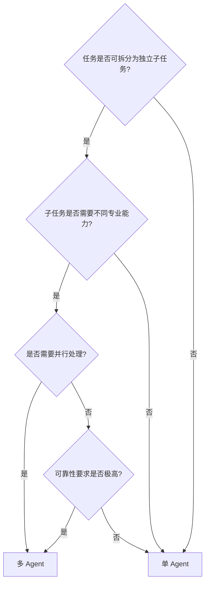

# 单 Agent vs 多 Agent 选型边界判断

> 不是所有问题都需要多 Agent。选型的核心问题：什么时候单 Agent 就够了？什么时候必须上多 Agent？

## 对比分析

| 维度 | 单 Agent | 多 Agent |
| ------ | --------- | ---------- |
| 架构 | 简单 | 复杂 |
| 适用任务 | 简单、明确 | 复杂、需要协作 |
| 可扩展性 | 低 | 高 |
| 调试难度 | 低 | 高 |
| 通信开销 | 无 | 有 |
| 成本 | 低 | 高（多倍 LLM 调用） |
| 可靠性 | 单点故障 | 冗余、容错 |

## 选型决策树

## 选型原则

### 优先单 Agent 的场景

| 场景 | 理由 |
|------|------|
| 任务简单明确 | 单 Agent 足以胜任 |
| 流程固定 | 用 Chain 而非 Agent |
| 预算有限 | 多 Agent 成本高 |
| 需要快速迭代 | 单 Agent 调试简单 |
| 实时性要求高 | 多 Agent 通信有延迟 |

### 应该用多 Agent 的场景

| 场景 | 理由 |
|------|------|
| 复杂多步任务 | 需要拆分并行 |
| 需要多种专业能力 | 不同 Agent 专精不同领域 |
| 可靠性要求高 | 交叉验证降低错误 |
| 需要多轮讨论 | Debate 模式达成共识 |
| 大型项目 | 层级模式委派任务 |

## 混合策略

实际应用中，常见的混合策略：

| 策略 | 说明 |
|------|------|
| 主 Agent + 工具 | 单 Agent 调用多个工具，简单有效 |
| 主 Agent + 专家 Agent | 复杂子任务委派给专家 Agent |
| 分阶段 | 简单阶段单 Agent，复杂阶段多 Agent |

> **核心原则**：从最简方案起步，只在确实需要时才引入多 Agent。多 Agent 带来的复杂度必须被其收益证明是值得的。

---

## 速记卡（面试闪卡）

**Q1：一句话讲清「单 Agent vs 多 Agent 选型边界判断」到底是什么？**
A：| 维度 | 单 Agent | 多 Agent |
| ------ | --------- | ---------- |
| 架构 | 简单 | 复杂 |
| 适用任务 | 简单、明确 | 复杂、需要协作 |
| 可扩展性 | 低 | 高 |
| 调试难度 | 低 | 高 |
| 通信开销 | 无 | 有 |
| 成本 | 低 | 高（多倍 LLM 调用） |

**Q2：对比分析 —— 怎么理解？**
A：| 维度 | 单 Agent | 多 Agent |
| ------ | --------- | ---------- |
| 架构 | 简单 | 复杂 |
| 适用任务 | 简单、明确 | 复杂、需要协作 |
| 可扩展性 | 低 | 高 |
| 调试难度 | 低 | 高 |
| 通信开销 | 无 | 有 |
| 成本 | 低 | 高（多倍 LLM 调用） |
| 可靠性 | 单点故障 | 冗余、容错 |

**Q3：选型原则 —— 怎么理解？**
A：| 场景 | 理由 |
|------|------|
| 任务简单明确 | 单 Agent 足以胜任 |
| 流程固定 | 用 Chain 而非 Agent |
| 预算有限 | 多 Agent 成本高 |
| 需要快速迭代 | 单 Agent 调试简单 |
| 实时性要求高 | 多 Agent 通信有延迟 |
| 场景 | 理由 |
|------|------|
| 复杂多步任务 | 需要拆分并行 |

**Q4：混合策略 —— 怎么理解？**
A：实际应用中，常见的混合策略：
| 策略 | 说明 |
|------|------|
| 主 Agent + 工具 | 单 Agent 调用多个工具，简单有效 |
| 主 Agent + 专家 Agent | 复杂子任务委派给专家 Agent |
| 分阶段 | 简单阶段单 Agent，复杂阶段多 Agent |
**核心原则**：从最简方案起步，只在确实需要时才引入多 Agent。多 Agent 带来的复杂度必须被其收益证明是值得的。

**Q5：核心速记主线有哪些？**
A：抓住这几根：对比分析、选型决策树、选型原则、混合策略、快速问答。

## 相关链接
- [[八股文学习清单]]
- [[00-全局导航|全局导航]]

---

## 快速问答

| 问题 | 参考答案 |
|------|----------|
| 什么时候用单 Agent？ | 任务简单明确、流程固定、预算有限、需要快速迭代、实时性要求高 |
| 什么时候用多 Agent？ | 复杂多步任务、需要多种专业能力、可靠性要求高、需要多轮讨论 |
| 如何选择？ | 从最简方案起步，只在确实需要时才引入多 Agent。多 Agent 的复杂度必须被其收益证明是值得的 |
