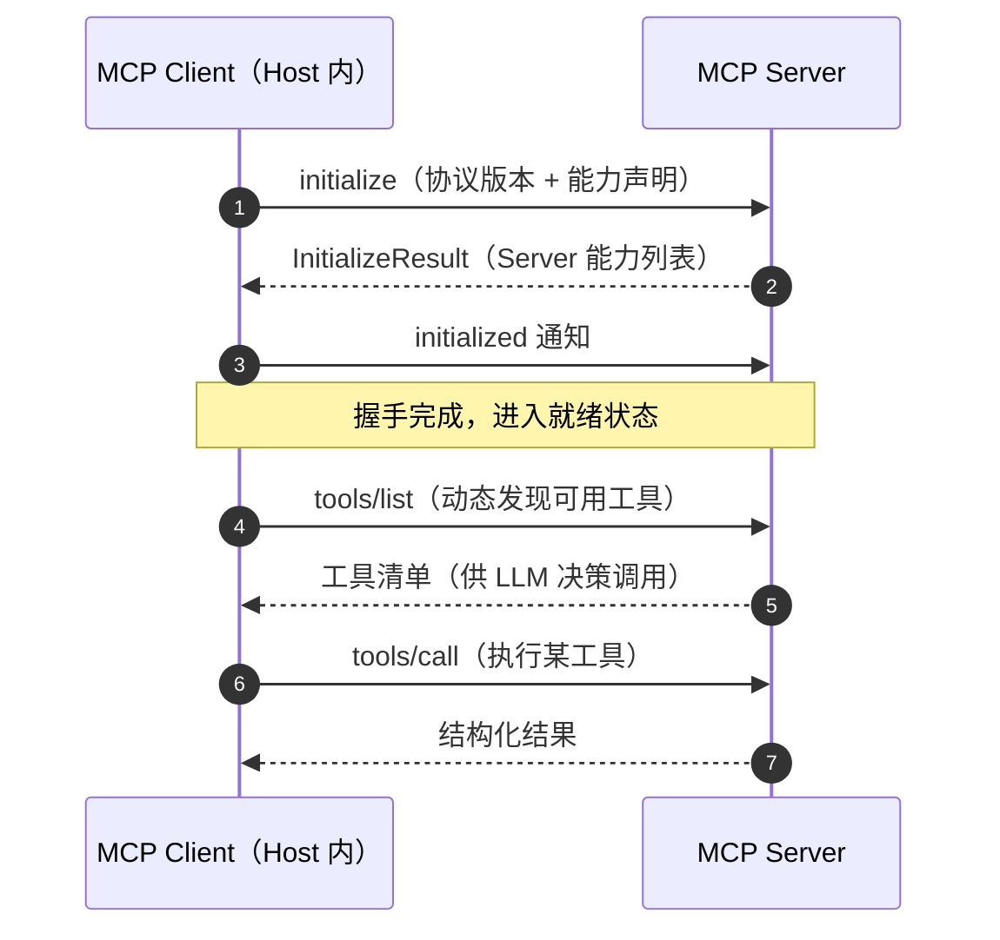
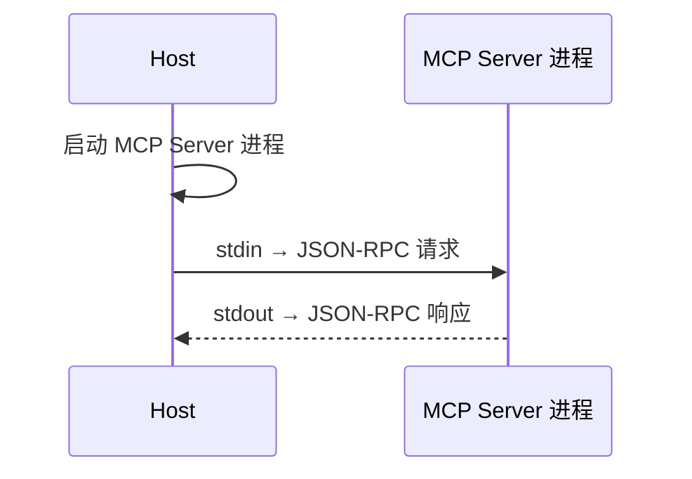
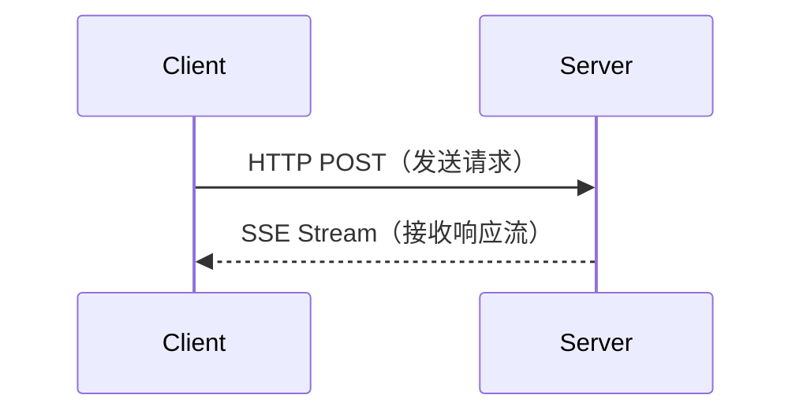
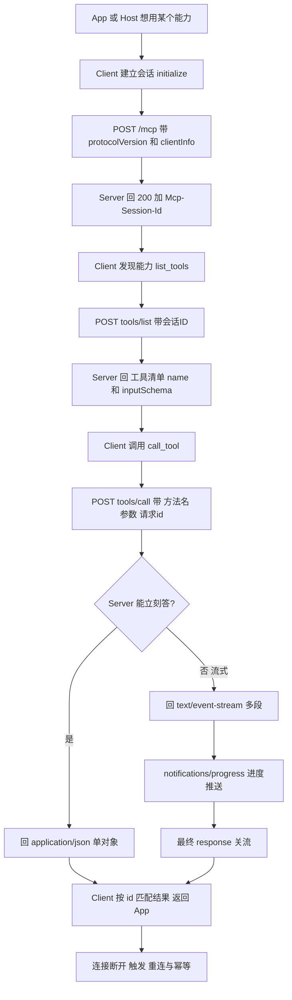
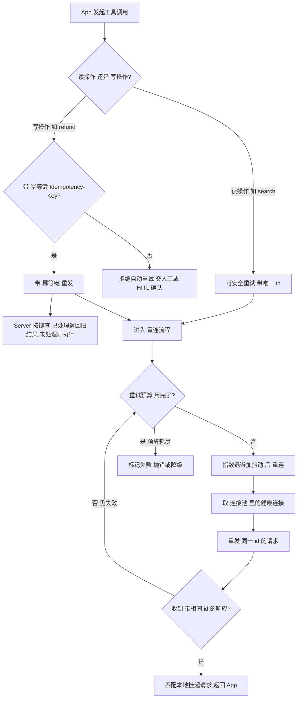
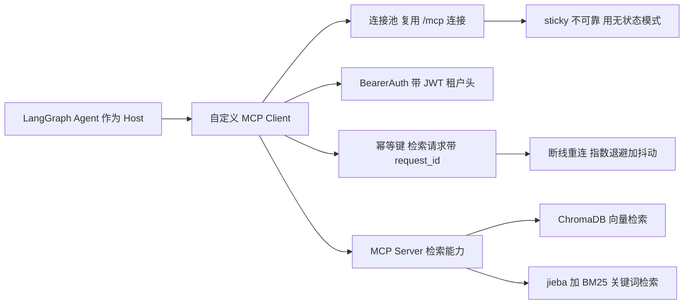

# MCP 协议实现：JSON-RPC 与传输层

> MCP 基于 JSON-RPC 2.0 规范，支持 stdio 和 HTTP+SSE 两种传输方式。理解传输层选型和生命周期管理是实现 MCP Server 的关键。

## MCP 握手与生命周期

Client 与 Server 建立连接后，必须先完成一次「握手（Handshake）」才能交换能力、发起调用：



## 传输方式

| 方式 | 说明 | 适用场景 |
| ------ | ------ | --------- |
| stdio | 标准输入输出 | 本地进程通信 |
| HTTP + SSE | HTTP POST + Server-Sent Events | 远程/网络通信 |

### stdio 模式



适用于本地部署，安全性好（无需网络暴露）。

### HTTP + SSE 模式



适用于远程部署和多客户端场景。

## JSON-RPC 2.0 规范

MCP 使用 JSON-RPC 2.0 作为消息格式：

```json
// 请求
{
  "jsonrpc": "2.0",
  "id": 1,
  "method": "tools/call",
  "params": {
    "name": "get_weather",
    "arguments": {"city": "北京"}
  }
}

// 响应
{
  "jsonrpc": "2.0",
  "id": 1,
  "result": {
    "content": [{"type": "text", "text": "北京今天晴，25°C"}]
  }
}
```

## MCP 开发入门

### Server 端开发

```python
from mcp.server import Server
from mcp.types import Tool

server = Server("my-server")

@server.list_tools()
async def list_tools():
    return [
        Tool(
            name="hello",
            description="打个招呼",
            inputSchema={
                "type": "object",
                "properties": {
                    "name": {"type": "string"}
                }
            }
        )
    ]

@server.call_tool()
async def call_tool(name, arguments):
    if name == "hello":
        return f"Hello, {arguments['name']}!"
```

### Client 端配置（Claude Desktop）

```json
{
  "mcpServers": {
    "github": {
      "command": "npx",
      "args": ["-y", "@modelcontextprotocol/server-github"],
      "env": {"GITHUB_TOKEN": "your-token"}
    }
  }
}
```

---

---

> **本篇建立在哪篇之上**：⑧ MCP 协议（Host/Client/Server 组成、JSON-RPC 是什么）、⑨ MCP Server 实现（FastMCP 怎么当"插座"）、⑩ MCP Transport（Streamable HTTP 单端点 /mcp、Mcp-Session-Id、SSE 流、无状态化）。需要的基础：知道 HTTP 的 POST/响应、知道 JSON 长啥样即可，async/await 直觉本篇会带过，不假设你会。本篇会当场讲清：JSON-RPC over HTTP 的"对话格式"、连接池、幂等重连三防线。  
> **目标**：零基础读者读完，能说清"Client 在 MCP 里扮演什么角色""它怎么和 Server 用 JSON-RPC 对话""为什么重连必须配幂等""生产环境为什么要自定义客户端"，并能讲清连接池与幂等设计。

## 0. 先讲人话：MCP Client 到底是什么？

前面第 ⑧ 篇讲了 **MCP（Model Context Protocol，模型上下文协议）** 是个"统一插头标准"，第 ⑨ 篇写了怎么用 **FastMCP** 当"插座"（Server），第 ⑩ 篇讲了"电线"用哪种（Transport，传输层）。

那今天这篇的 **MCP Client（MCP 客户端）** 是谁？

想象你（Host / App，主机程序）想点一份外卖：

- **你** = 主机程序（Host），比如你的 Agent、你的 RAG 应用
- **商家后厨** = **MCP Server（服务端）**，掌握着真正的工具/数据（查数据库、调 API、读文件）
- **前台接线员** = **MCP Client（客户端）**，负责「拨号连上商家 → 问清楚菜单 → 下单 → 听回复 → 断线了重拨」

你作为顾客，不直接冲进后厨炒菜——你通过"接线员"跟后厨打交道。**MCP Client 就是那个帮你跑腿、打电话、收结果的接线员。**

没有 Client，Host 根本不知道 Server 有啥能力、怎么调、结果咋解析。它是 Host 与 Server 之间的"translator（翻译）+ 接线员 + 重试小能手"三位一体。

> 一句话：MCP 这套协议里，**Server 暴露能力，Client 消费能力**。Host（你的 Agent）左手拽着 LLM 出主意，右手拽着一个或多个 Client 去把主意落地。

## 1. 为什么需要"自定义"客户端？官方的不够吗？

短答：**官方 Client 90% 场景够用，但生产环境你迟早要自己掌控连接。**

FastMCP / 官方 SDK 自带 `Client`，开箱即用：

```python
from fastmcp import Client

client = Client("https://example.com/mcp")   # 自动选 HTTP 传输
async with client:
    tools = await client.list_tools()        # 问菜单
    r = await client.call_tool("search", {"q": "RAG"})  # 下单
```

够简单，但生产里有几个它**默认不帮你兜底**的事，逼你走上"自定义"之路：

| 诉求 | 官方默认 | 自定义客户端要解决 |
|-|-|-|
| 连接池 / 复用 | 仅 STDIO 的 `keep_alive=True` 复用子进程；HTTP 每次 `async with` 重建 | 多 Server 连接池、统一复用、限流 |
| 重连 + 幂等 | Streamable HTTP 有"自动重连"，但**幂等靠你自己** | 写操作重发会重复扣款，需幂等键 |
| 可观测性 | 靠 OpenTelemetry（v3.0+） | 自己埋 trace_id / 耗时 / 失败率 |
| 多 Server 路由 | 手动一个一个连 | `ConnectionPool` 按名字管理多 Server |
| 自定义头部 / 认证 | 支持 `BearerAuth` | 动态 JWT、租户头、`X-*` 透传 |

所以"自定义客户端"不是"重写协议"，而是**在官方 Client 之上包一层工程化外壳**：把连接、重试、幂等、池化、监控都管起来。（来源：fastmcp.wiki 客户端传输、CSDN FastMCP Client 实践、字节 youthcamp 第 9 章）

## 2. JSON-RPC over HTTP：Client 和 Server 到底怎么"对话"

**JSON-RPC（JSON Remote Procedure Call，JSON 远程过程调用）** 是 MCP 的"说话格式"——一种极简的远程调用协议，请求和响应都是 JSON。

**HTTP（HyperText Transfer Protocol，超文本传输协议）** 是"送信的邮路"。把两者拼起来就是：**用 HTTP 这个邮路，寄 JSON-RPC 格式的信**。

### 2.1 一封信长啥样（请求）

```json
{
  "jsonrpc": "2.0",
  "method": "tools/call",
  "params": { "name": "search", "arguments": {"q": "RAG"} },
  "id": 7
}
```

- `jsonrpc: "2.0"` —— 声明用 JSON-RPC 2.0 版本
- `method` —— 要 Server 干啥（`initialize` / `tools/list` / `tools/call` / `resources/read` …）
- `params` —— 参数
- `id` —— **本次请求的唯一编号**。Server 回信时原样带回，Client 靠它把"回信"对上"寄出的信"（这就是后面幂等重连的关键）

### 2.2 两种"信"：有回执 vs 没回执

- **请求（Request）**：带 `id`，Server **必须回**一封同样 `id` 的响应。
- **通知（Notification）：不带 `id`，Server 收到就处理，不回**（如 `notifications/initialized`、进度通知）。Client 发完拉倒。

### 2.3 HTTP 邮路的具体规矩（Streamable HTTP 版，见第 ⑩ 篇）

- 主通道是 **POST** 一个端点（如 `/mcp`），body 是上面的 JSON
- 请求头带 `Accept: application/json, text/event-stream` —— 告诉 Server"我既能收普通 JSON，也能收流式 SSE"
- Server 在 `initialize` 响应头里回 `Mcp-Session-Id`（稳定版）—— **会话身份证**，后续请求都得带上
- 能立刻答就回 `application/json`；要流式推就回 `text/event-stream`（SSE，Server-Sent Events，服务端推送事件）

> 类比：`id` 像快递单号，你寄出时拿单号，收到货时对照单号确认"这是我买的那个"；`Mcp-Session-Id` 像你在这家店的会员会话，点单时得报上会员号，店员才记得你之前点了啥。

⚠️ **准确性硬约束**：**当前稳定版（2025-11-25）不支持 JSON-RPC 批处理**（2025-06-18 已移除，见第 ⑩ 篇）。所以 Client 每个 POST 只发**单个** JSON-RPC 消息，不要写"一次发一批"的过时代码。（来源：MCP 官方 release notes / Speakeasy 版本对照）

## 3. 自定义 Client 的调用全流程

一个"能打"的自定义 Client 核心就四步：**建会话 → 问能力 → 调工具 → 断线重连**。



（图 1：自定义 MCP Client 标准调用流。来源：CSDN 手写 Client、AWS 中文博客、fastmcp.wiki）

## 4. 连接池（Connection Pool）：别每次打电话都重新拨号

### 4.1 为什么需要池

如果你每调一次工具就 `async with client:` 新建连接、握手、建 Session、用完销毁——**开销爆炸**：

- TCP 三次握手 + **TLS（Transport Layer Security，传输层安全协议，即 HTTPS 加密层）** 握手：几百毫秒起步
- MCP `initialize` 建会话：又一轮往返
- 高频调用下，握手时间可能比真正的工具执行还长

**连接池** = 提前建好一批连接放着，谁要用谁拿，用完归还，不销毁。类比：公司不让你每次寄快递都现买手机号，而是给你配一群"长期在线的接线员"，随用随叫。

### 4.2 两种层面的"复用"

| 层面 | 机制 | 说明 |
|-|-|-|
| STDIO 传输 | `keep_alive=True`（默认） | FastMCP 在多个 `async with` 间**复用同一个子进程**，省去反复启动进程（来源：fastmcp.wiki、generalzy） |
| HTTP 传输 | HTTP `keep-alive` + 客户端连接池 | 同一 TCP 连接上复用多个 HTTP 请求；`httpx.AsyncClient` 自带连接池（用 `httpx.Limits` 控大小），省 TCP/TLS 握手 |
| 多 Server | `ConnectionPool` | 一个池管理 N 个 Server 的连接，按名字取（来源：字节 youthcamp 第 9 章） |

> 🔴 高优补充：`httpx.AsyncClient` 本身就是连接池实现——你项目里的 `httpx.AsyncClient` 单例已经天然有池，关键是把"`limits`、`max_connections`、健康检查、多 Server 路由"显式管起来，而不是"有个单例"就完事。

### 4.3 手写一个多 Server 连接池（骨架级）

字节 youthcamp 第 9 章给了一个清晰的 `ConnectionPool` 思路——管理"连接名 → MCPConnection"的字典，每个连接自己负责 `connect / reconnect / 健康检查`：

```python
class ConnectionPool:
    def __init__(self):
        self.connections: dict[str, MCPConnection] = {}

    async def add_server(self, config):
        conn = MCPConnection(config)
        if await conn.connect():
            self.connections[config.name] = conn   # 按名字登记
        return config.name in self.connections
```

池的管理要点（🔴 高优增量）：

- **池大小上限**：别无限建，按下游 Server 承受能力设（如 50），超了排队或报错
- **健康检查**：定期 `client.ping()`，死的踢掉重连
- **粘滞连接**：同一会话尽量落到同一后端（但第 ⑩ 篇说过：HTTP 负载均衡下 sticky session 不靠谱，因为前端 `fetch` 不转发 Cookie → 优先选**无状态模式**，2026-07-28 之后协议层直接无状态）

## 5. 幂等重连（Idempotent Reconnect）：断线重拨，但别重复下单

这是本篇**最值钱**的一块，也是常见坑。

### 5.1 为什么"重连"和"幂等"必须绑在一起讲

网络抖动太常见了。Client 发了个"退款 100 元"的请求，Server 其实**已经执行了**，但响应在半路丢了，Client 以为"没收到 = 失败了"，于是**重发**。结果：用户被退了两次 100 元。

**幂等（Idempotent，指多次执行结果相同）** 就是为解决这个：让"同一个操作执行一次和执行多次，副作用只发生一次"。

> 类比：你打电话让接线员"给张三退 100 元"。如果电话断了你重拨，得让后厨知道"这还是刚才那笔退款，别再退一遍"。怎么让后厨知道？——每笔退款带个**唯一单据号（幂等键）**，后厨看到重复单据号就直接返回上次结果。

### 5.2 三道防线（请求 ID / 幂等键 / 重试预算）



（图 2：连接池 + 幂等重连决策流。来源：AWS 中文博客重试、CSDN 手写 Client 的 reconnect、第 ⑥ 篇失败处理、第 ⑦ 篇幂等键）

三道防线的具体做法：

**① 请求 ID 去重（transport 层）**  
每个请求生成唯一 `id`（自增或 UUID）。Client 本地维护 `id → 挂起 future` 的表；收到响应按 `id` 配对，**同一个 id 的重复响应直接丢弃**。这是 JSON-RPC 协议自带的机制（见 §2.1）。

**② 业务幂等键（Idempotency-Key，应用层）**  
对写操作（退款/改单，见第 ⑦ 篇），Client 生成一个业务幂等键（如 `order_id + action`），放进请求头或参数。Server 端用这个键做去重表（内存/Redis），重复键直接返回首次结果。**键由 Client 生成，Server 去重**——这是"谁发起谁负责"的原则。

**③ 重试预算 + 指数退避 + 抖动（Retry Budget）**

- 别无限重试（会把下游打挂）。设上限，如 3 次
- 退避用**指数退避（Exponential Backoff）**：第 1 次等 1s，第 2 次 2s，第 3 次 4s
- 加**抖动（Jitter）**：在退避时间上叠加随机量，避免一堆 Client 同时重连把 Server 冲垮（"重试风暴"）

```python
from tenacity import retry, stop_after_attempt, wait_exponential

class ResilientClient:
    @retry(stop=stop_after_attempt(3),
           wait=wait_exponential(multiplier=1, min=4, max=10))
    async def send_request(self, **kwargs):
        return await super().send_request(**kwargs)
```

（来源：百度云 MCP 实战的 tenacity 重试示例、AWS 中文博客、第 ⑥ 篇重试）

### 5.3 断线恢复（Resumability）—— 稳定版特性，RC 有变

**稳定版（2025-03-26 至 2025-11-25）**：Streamable HTTP 支持**可恢复性（Resumability）**——SSE 事件带全局唯一 `id`，断线后客户端用 `Last-Event-ID` 头重连，Server 把漏掉的流式事件补发回来，不用整个会话重建。官方 Python SDK 的 `StreamableHTTPTransport`**已内置自动重连**：`DEFAULT_RECONNECTION_DELAY_MS=1000`、`MAX_RECONNECTION_ATTEMPTS=2`，就是靠 `last-event-id` 重放。（来源：deepwiki Python SDK 4.3）

> 🔴 **版本红线（必看）**：2026-07-28 无状态 RC **移除了 Resumable SSE 流**（"Resumable SSE streams via Last-Event-ID are not supported"）。也就是说，无状态化之后，断线恢复不再是协议层能力，要靠应用层自己用"显式 handle（如 basket_id）"做状态恢复（呼应第 ⑩ 篇 3.3）。写代码以 SDK 版本为准。

## 6. 手写 vs 用官方 Client：怎么选（对比表）

| 维度 | 手写 `HttpMCPClient`（如 AWS 示例） | 官方 `fastmcp.Client` |
|-|-|-|
| 上手成本 | 高，要自己拼 JSON-RPC、管 Session | 低，`Client(url)` 一行 |
| 传输选择 | 手动 | 自动推断（HTTP/STDIO/SSE） |
| 连接复用 | 自己写池 | STDIO `keep_alive` 自带；HTTP 靠 httpx 连接池 |
| 重连 / 幂等 | 自己写（reconnect/idempotency-key） | 自动重连自带；幂等仍需自己加 |
| 认证 | 手写 header | `BearerAuth("token")` 辅助类 |
| 适用 | 特殊协议、嵌入式、深度定制 | 90% 生产场景 |

> 实战建议：**先用官方 Client 跑通，再把"池 + 幂等 + 监控"包一层**当自定义 Client。除非你要钻协议细节或塞进受限环境，否则别从零手写（来源：chatforest FastMCP 生产指南、fastmcp.wiki）。

官方 Client 连接示例（含认证与 SSL）：

```python
from fastmcp import Client
from fastmcp.client.auth import BearerAuth

client = Client(
    "https://api.example.com/mcp",
    auth=BearerAuth("your-token-here"),   # 自动加 Authorization 头
)
async with client:
    tools = await client.list_tools()
```

## 7. 简历项目绑定：具体改进方向

基于你项目 `ai-resume-analyzer` 的真实情况（Client=`httpx.AsyncClient` + JSON-RPC 2.0 over HTTP，单例 + 降级；两种调用模式 `graph.py` 与 `mcp_graph.py`+`mcp_nodes.py` 并存），对照最佳实践有 3 个具体改进点：

**改进 1：给 httpx 单例显式配置连接池上限与超时，并加多 Server 路由**

- **差距**：你已有 httpx 单例（天然有连接池），但未显式控 `max_connections`/`max_keepalive_connections`，也没对 `mcp_graph.py` 与 `graph.py` 两套调用统一池管理。
- **改动**：文件 `mcp_graph.py` / 客户端封装处——`httpx.AsyncClient(limits=httpx.Limits(max_connections=50, max_keepalive_connections=20), timeout=httpx.Timeout(30, read=60))`；若未来多 MCP Server，抽一层 `ConnectionPool` 按名路由。
- **风险**：低；仅调参。
- **收益**：避免突发流量打爆下游、连接泄漏；可讲"Client 侧连接池与超时是我显式管控的"。

**改进 2：检索调用加 request_id 幂等键 + 重试预算（指数退避 + 抖动）**

- **差距**：检索是**读操作**，重连安全，但你当前 `降级策略`未显式给每次请求打 `request_id`，断线重连时难做去重与追踪；长检索（流式 SSE）若中断，未用 `Last-Event-ID` 恢复。
- **改动**：文件 `mcp_nodes.py`（MCP 调用节点）——每次 `tools/call` 生成 `request_id=uuid4()` 放进 `params`/`X-Request-ID`；用 `tenacity` 或手写"重试 3 次 + `wait_exponential` + jitter"包裹；SSE 中断时用 `Last-Event-ID` 续传（稳定版）。
- **风险**：中——需确保 Server 端对 `request_id` 做去重（你 FastMCP 工具可加一层 in-memory/Redis 去重表），否则幂等键无效。
- **收益**：断网后检索结果不丢、不重复、可全链路追踪；一句话讲清见下。
- **一句话讲清**："Agent 通过自定义 MCP Client 调检索 Server：① Streamable HTTP 传输，JWT 租户令牌放请求头，配合 contextvars 多租户（第 ⑨ 篇）；② httpx 连接池复用 `/mcp` 连接，避免每次重建会话；③ 检索是读操作，重连带唯一 `request_id` 幂等键，断线指数退避+抖动重连，不重复打下游；④ 因 HTTP 负载均衡不转发 Cookie，Server 侧用无状态模式（第 ⑩ 篇）。"

**改进 3（演进视角，非必须）：为 2026-07-28 无状态化预留 Client 配置**

- **差距**：2026-07-28 RC 移除 `Mcp-Session-Id`、引入 `Mcp-Method` 头；你当前 Client 若依赖会话头，SDK 升级后需改。
- **改动**：在 `mcp_graph.py` 抽象"传输配置"，锁 `protocolVersion=2025-11-25` 直到 SDK 稳定；后续切无状态 + 按 `Mcp-Method` 路由。
- **风险**：低（配置预留）。
- **收益**：展示"我关注 MCP 规范演进，已为无状态 Client 做版本隔离"。



## 8. 常见误区（高频坑）

1. **"重连 = 原样重发就行"** ❌ —— 写操作原样重发会重复副作用，必须带幂等键（第 ⑦ 篇）。
2. **"幂等键由 Server 生成"** ❌ —— 应由 **Client 生成**（Client 才知道"这是同一次用户意图"），Server 只负责按键去重。
3. **"连接池越大越好"** ❌ —— 超下游承受能力会压垮 Server，按容量设上限 + 健康检查。
4. **"STDIO Server 能读到我 shell 的环境变量"** ❌ —— STDIO 子进程在隔离环境，**不继承环境变量**，API Key 必须显式 `env={...}` 传（来源：fastmcp.wiki、CSDN 实践）。
5. **"sticky session 能保会话"** ❌ —— 前端 `fetch` 不转发 Cookie，负载均衡下 sticky 不可靠，优先无状态模式（第 ⑩ 篇）。
6. **"notification 也要等响应"** ❌ —— 通知无 `id`，Server 不回，Client 发了就走，别傻等。
7. **"Resumability 是 2026 新能力"** ❌ —— 它是**稳定版（2025-03-26+）**就有的；2026-07-28 RC 反而**移除**了它。别记反。

## 9. 核心要点

- **MCP Client 角色**：Host 与 Server 之间的"接线员"，负责连接、发现能力、发请求、收结果、重连。
- **JSON-RPC over HTTP**：请求=`{jsonrpc, method, params, id}`，响应带回同样 `id`；无 `id` 的是 notification 不回；**稳定版不支持批处理**。
- **Streamable HTTP 规矩**：POST `/mcp` 主通道；`Accept: application/json, text/event-stream`；`initialize` 回 `Mcp-Session-Id` 会话身份证（稳定版）。
- **连接池价值**：省 TCP/TLS 握手 + MCP 建会话开销；STDIO 靠 `keep_alive` 复用子进程，HTTP 靠 httpx/Linux keep-alive 复用 TCP。
- **幂等三防线**：① 请求 `id` 去重（transport 层）② 业务 `Idempotency-Key`（应用层，Client 生成、Server 去重）③ 重试预算 + 指数退避 + 抖动。
- **断线恢复**：稳定版靠 `Last-Event-ID` + SDK 内置重连（1000ms/2 次）；**2026-07-28 RC 移除 Resumable SSE**，改应用层 handle 恢复。
- **手写 vs 官方**：先用官方 `Client` 跑通，再外包"池+幂等+监控"；除非钻协议细节，别从零手写。
- **简历绑定**：Agentic RAG 检索服务暴露为 MCP Server，Agent 用自定义 Client 连——JWT 头 + httpx 连接池 + 幂等 request_id + 无状态模式。

## 下一篇预告

下一篇 **⑫ MCP Tool/Resource 定义与注册模式（Tool/Resource/Prompt 三原语控制权 + 逐字段拆解 + 三种注册模式 + 版本差异红线）——本篇你搞懂了"接线员"怎么拨号、发现能力、幂等重连，下一篇讲"插座上到底能插哪几种插口"：Tool/Resource/Prompt 三原语的区别、每个字段怎么写、三种注册方式怎么选、以及 2025-06-18 才加的 title/outputSchema/structuredContent 版本红线**。带着本篇的"调用/重试"认知，下一篇的字段语义会非常好懂。

## 
> ▶ 对应实操：21-MCP Transport：Streamable HTTP → ASGI 子应用挂载 + JSON-RPC 2.0

相关链接
- [[八股文学习清单]]
- [[00-全局导航|全局导航]]

---

## 快速问答

| 问题 | 参考答案 |
| ------ | --------- |
| MCP 的两种传输方式？ | stdio（本地进程通信，安全但仅限本地）和 HTTP+SSE（远程通信，支持多客户端） |
| 为什么 MCP 选择 JSON-RPC？ | JSON-RPC 是轻量级的远程过程调用协议，简单、跨语言、易于实现，且支持双向通信 |
| MCP Server 如何被发现？ | Client 在连接时通过 initialize 请求获取 Server 的能力列表，运行时动态发现 |

## 速记卡（面试闪卡）

**Q1：一句话讲清「MCP 协议实现：JSON-RPC 与传输层」到底是什么？**
A：Client 与 Server 建立连接后，必须先完成一次「握手（Handshake）」才能交换能力、发起调用：

**Q2：MCP 握手与生命周期 —— 怎么理解？**
A：Client 与 Server 建立连接后，必须先完成一次「握手（Handshake）」才能交换能力、发起调用：

**Q3：传输方式 —— 怎么理解？**
A：| 方式 | 说明 | 适用场景 |
| ------ | ------ | --------- |
| stdio | 标准输入输出 | 本地进程通信 |
| HTTP + SSE | HTTP POST + Server-Sent Events | 远程/网络通信 |
适用于本地部署，安全性好（无需网络暴露）。
适用于远程部署和多客户端场景。

**Q4：JSON-RPC 2.0 规范 —— 怎么理解？**
A：MCP 使用 JSON-RPC 2.0 作为消息格式：

**Q5：MCP 开发入门 —— 怎么理解？**
A：---
---
**本篇建立在哪篇之上**：⑧ MCP 协议（Host/Client/Server 组成、JSON-RPC 是什么）、⑨ MCP Server 实现（FastMCP 怎么当"插座"）、⑩ MCP Transport（Streamable HTTP 单端点 /mcp、Mcp-Session-Id、SSE 流、无状态化）。

**Q6：核心速记主线有哪些？**
A：抓住这几根：MCP 握手与生命周期、传输方式、JSON-RPC 2.0 规范、MCP 开发入门、0. 先讲人话：MCP Client 到底是什么？、1. 为什么需要"自定义"客户端？官方的不够吗？。

