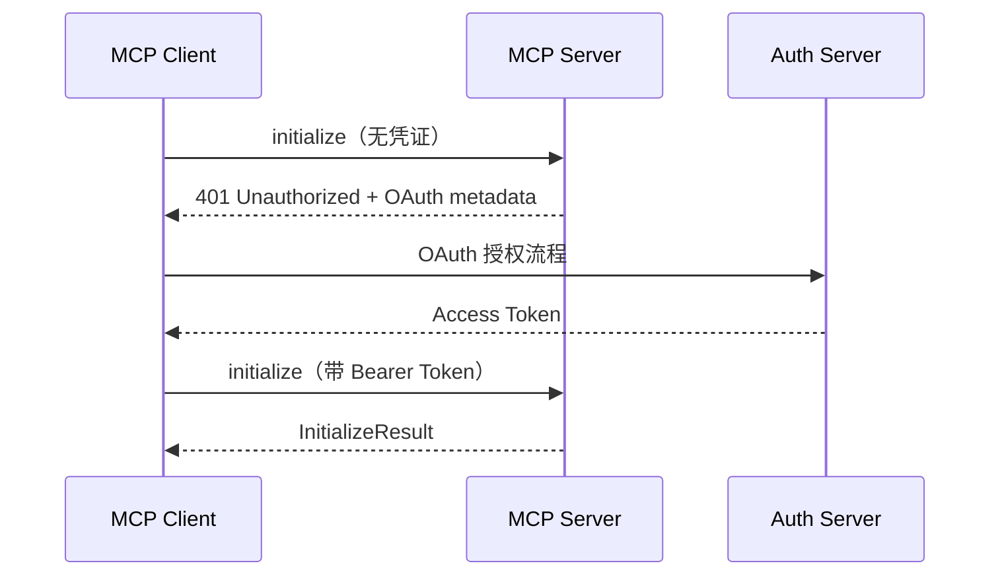
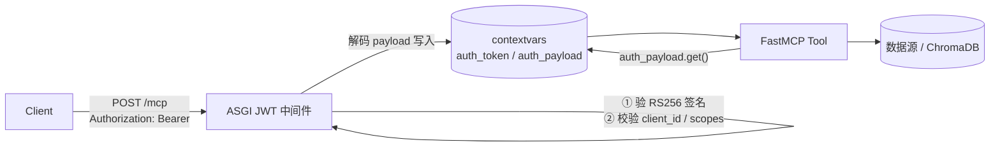
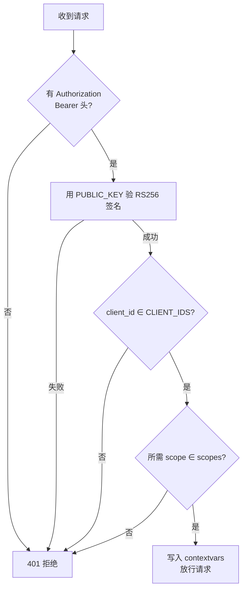

---

title: "MCP认证中间件与安全模型"

created: "2026-07-13"

tags:

  - 八股文

  - ai

---

# MCP 认证中间件与安全模型

> MCP Server 暴露工具和资源给 LLM，安全控制至关重要。本篇讲解 MCP 的安全模型、认证机制和中间件链设计。

## MCP 安全模型

| 安全层面 | 机制 |
| --------- | ------ |
| 传输安全 | TLS 加密、本地 stdio 隔离 |
| 授权认证 | OAuth 2.0 支持 |
| 权限控制 | 工具级别的访问控制 |
| 人类确认 | 敏感操作需要用户确认 |
| 数据隔离 | Server 之间数据不共享 |

## 认证架构
### OAuth 2.0 集成

MCP 协议支持 OAuth 2.0 作为标准认证机制：



### Token 验证

Server 端验证 JWT Token 的关键步骤：

| 步骤 | 说明 |
| ------ | ------ |
| 1. 提取 Token | 从 HTTP Header 或 stdio 元数据中提取 |
| 2. 验证签名 | 使用 JWKS 端点获取公钥验证 |
| 3. 检查过期 | 验证 exp 声明 |
| 4. 权限映射 | 将 token 声明映射到工具权限 |

## 中间件链设计
### ContextVar 请求级上下文

```python

from contextvars import ContextVar

# 请求级上下文变量

current_user: ContextVar[dict] = ContextVar('current_user')

current_scope: ContextVar[list] = ContextVar('current_scope')

async def auth_middleware(request, handler):

    # 认证中间件: 验证 token 并设置用户上下文

    token = extract_token(request)

    user = await verify_jwt(token)

    current_user.set(user)

    current_scope.set(user.get('scopes', []))

    return await handler(request)

async def permission_middleware(request, handler):

    # 权限中间件: 检查工具访问权限

    tool_name = request.params.get('name')

    scopes = current_scope.get()

    if tool_name not in allowed_tools(scopes):

        raise PermissionError(f"无权访问工具: {tool_name}")

    return await handler(request)

```

### Starlette 中间件链

```python

from starlette.applications import Starlette

from starlette.middleware import Middleware

app = Starlette()

app.add_middleware(AuthMiddleware)

app.add_middleware(PermissionMiddleware)

app.add_middleware(LoggingMiddleware)

```

执行顺序：Logging → Permission → Auth → Handler

## 敏感操作确认

对于有副作用的工具调用（退款、发邮件等），需要人类确认：

| 策略 | 说明 |
| ------ | ------ |
| 工具级标记 | 在 tool definition 中标记 `requires_confirmation: true` |
| 运行时拦截 | 中间件拦截标记为敏感的调用 |
| 用户确认 | 通过 Host UI 向用户展示确认对话框 |
| 审计日志 | 记录所有敏感操作的确认和执行 |

---

---

> **本篇建立在哪篇之上**：⑧ MCP 协议（Host/Client/Server 三角色、Tools/Resources/Prompts 三能力、JSON-RPC 2.0、Streamable HTTP、initialize 握手）。本篇**当场讲清**的概念：FastMCP 框架、ASGI 中间件、JWT（JSON Web Token）非对称验签、contextvars 并发隔离、stateless_http、Tool Annotations。需要的基础：知道「MCP Server 是暴露能力的一方」（⑧），本篇把它从规范落到「怎么用 Python 写出来 + 怎么上锁」。

> **目标**：零基础读者读完，能说清 FastMCP 怎么把协议降到装饰器、JWT 中间件在工具之前怎么验身份、contextvars 为什么是并发隔离正解，并能讲出一套生产级多租户安全 Server 的实现。

> **优先级**：🔴 高优 —— 比常规更详细，多拆原理、给边界情形、补生产细节。

---

## 0. 开篇：你家的专属电器，也得能插上标准口

第 8 篇讲了 MCP 是 AI 世界的「USB-C 标准插槽」。但标准再好，得有人去**实现那个插头**——也就是**自己写一个 MCP Server**，把你的能力按规范暴露出去。

生活类比接着用：你给自己家做了个超好用的榨汁机（你的检索 / 查询能力），别人（AI 应用）想用。

- 不按标准？那每台想用它的机器都得给你单独配一根线（N×M 噩梦）。

- 按 MCP 标准做插头（写 MCP Server）？任何支持 MCP 的 Host 插上就能用。

但还有一层：**插头做出来了，不等于谁都能插**。榨汁机接的是 220V 电网，你总不能让路人随便按开关吧？所以 Server 一旦跑在网上、暴露能力，就等于**开门**——不装锁（认证），就是**裸奔**。

本文就讲三件事怎么串起来：

1. **FastMCP** —— 用 Python 几行代码把 MCP Server 写出来（不用手搓 JSON-RPC）。

2. **JWT 认证中间件** —— 在每个请求到达工具前，先验明身份。

3. **contextvars** —— 把验出来的「当前用户」安全地在并发请求间隔离传递，工具随用随取。

---

## 1. FastMCP 是什么：把协议细节降到装饰器

**FastMCP** 是目前用 Python 构建 MCP Server 最顺手的**生产级框架**（源码即 FastMCP 3）。官方 SDK 当然也能写，但 FastMCP 把底层协议（JSON-RPC 2.0、握手、能力发现）全封装了，开发者只写业务逻辑。

最小骨架（感觉级，非生产代码）：

```python

from fastmcp import FastMCP

mcp = FastMCP("Demo Server")          # ① 一个 FastMCP 实例 = 一个 Server

@mcp.tool                              # ② 普通函数 + 装饰器 = 一个 Tool

def add(a: int, b: int) -> int:

    """Add two numbers"""             # ③ docstring 就是给模型的「使用说明」

    return a + b

if __name__ == "__main__":

    mcp.run(transport="http", port=8000)   # ④ 跑成 HTTP 服务

```

关键点（常见问题）：

- **自动 Schema**：FastMCP 根据函数签名 + docstring 自动生成工具的 JSON Schema，客户端（和模型）直接看懂怎么调、怎么传参。

- **三类能力装饰器**：`@mcp.tool`（可执行动作）、`@mcp.resource(...)`（只读数据，如 `config://version`）、`@mcp.prompt`（提示词模板）。

- **Context 参数**：工具里加 `ctx: Context` 就能用日志、进度、读资源、反向调 LLM（Sampling）。

- **传输选择**：`stdio`（本地，Server 作子进程）、`streamable-http`（生产推荐，单 `/mcp` 端点）、`sse`（旧，兼容）。

> 一句话：FastMCP 让「写 MCP Server」从「手写协议」变成「写普通 Python 函数 + 贴装饰器」。

### 1.1 三能力怎么注册（骨架级）

```text

@mcp.tool()                 def search_kb(q: str) -> list: ...   # Tools：动作，模型自主触发

@mcp.resource("resume://list")  def list_resumes() -> list: ... # Resources：只读数据，按需读

@mcp.prompt()               def review_template() -> str: ...   # Prompts：提示词模板，Host 复用

```

> 工具描述（docstring）写错，模型就选错工具——这是第 8 篇反复强调的「工具描述即 API 文档」。

---

## 2. 为什么 MCP Server 必须认证（不装锁 = 裸奔）

暴露一个 MCP Server，等于把一个能力入口挂到网上。不认证的后果：

- **任意人可调用**：你的 `delete_all_data` 工具谁都能触发。

- **多租户数据泄露**：A 公司的请求读到了 B 公司的知识库（如果你的 RAG 服务多客户共用）。

- **无法审计**：出了事查不到是谁干的。

### 2.1 JWT 是什么（先拆全称）

**JWT = JSON Web Token（JSON 网络令牌）**，是一种把「身份信息 + 权限」编码进令牌、并用密码学签名防篡改的开放标准。客户端每次请求在头里带 `Authorization: Bearer <JWT>`，Server 验签即可信其身份，**无需查库**。

> MCP 规范本身推荐 **OAuth 2.1 + PKCE**（用户面对的应用，如用 Google/GitHub 登录）。但 JWT Bearer 是**服务间通信 / 编程环境**的实用方案——FastMCP 从 2.6.0 起内置 `BearerAuthProvider` 支持它，用**非对称加密**（RS256）验签：Server 只持公钥，私钥在签发方（IdP），互不暴露。

### 2.2 两条路：内置 vs 自定义中间件（加分）

| 方式 | 做法 | 适合 |
|-|-|-|
| **内置 `BearerAuthProvider`** | `BearerAuthProvider(jwks_uri=..., issuer=..., audience=..., required_scopes=[...])`，工具内 `get_access_token()` 取声明 | 大多数场景，省心、合规、JWKS 自动轮换 |
| **自定义 ASGI JWT 中间件 + contextvars** | 自己写中间件验签，把 payload 写进 `contextvars`，工具 `auth_payload.get()` 取 | 需要完全控制、或要和现有网关 / contextvars 体系打通（本文重点） |

> 经验法则：**能用内置就别自己造**。但你要理解和能讲清楚中间件机制——这正是想听的「你知道它底层怎么回事」。

---

## 3. JWT 认证中间件：在工具之前验明正身

中间件（middleware）夹在「请求到达工具」之前，统一做一件事：**先验身份，再放行**。它是 ASGI 层的一个包装函数，拦截每个 `POST /mcp` 请求。

骨架（感觉级）：

```python

from contextvars import ContextVar

auth_token: ContextVar = ContextVar("auth_token", default=None)

auth_payload: ContextVar = ContextVar("auth_payload", default=None)

async def jwt_middleware(app, scope, receive, send):

    headers = dict(scope.get("headers", []))

    auth = headers.get(b"authorization", b"").decode()       # ① 取 Bearer 头

    payload = verify_rs256(auth, PUBLIC_KEY)                 # ② 用 PUBLIC_KEY 验 RS256 签名，失败即 401

    check_claims(payload)                                     # ③ 校验 client_id / scopes

    auth_token.set(auth)                                      # ④ 验过即写入 contextvars，放行

    auth_payload.set(payload)

    await app(scope, receive, send)

```

中间件做的四步（对应上面注释）：

1. 取 `Authorization: Bearer <token>`；

2. 用 **PUBLIC_KEY** 验 **RS256** 签名（篡改即失败 → 401）；

3. 校验业务声明：`client_id ∈ CLIENT_IDS`、所需 `scopes`（如 `client_super`）满足；

4. 把原始 token + 解码 payload 写进 **contextvars**，放行请求。



---

## 4. contextvars：每请求隔离的「上下文保险箱」

这是本文第二个核心，也是很多初学者会写错的地方。

### 4.1 它解决什么问题

工具函数需要「当前是谁在调用」——用来做租户隔离、权限判断、审计日志。最直觉的写法是用**全局变量**存 user_id。但 MCP Server 是**异步并发**的：一个事件循环同时服务很多请求。全局变量会**跨请求串味**——请求 A 刚写完 user=A，请求 B 一覆盖，A 的工具读到就成了 B 的用户。**这是生产级数据泄露 bug**。

### 4.2 为什么不用 threading.local

`threading.local` 是「每线程一份」的变量。但 **asyncio 下协程可能在不同线程间跳**，而且单线程事件循环里多个协程共享同一线程——`threading.local` 在异步并发里**不可靠**。

### 4.3 contextvars 才是对的

**contextvars（上下文变量）** 是 Python 专为「asyncio 并发下每请求隔离」设计的机制：

- 每个请求 / 协程有自己的**上下文副本**；

- 在中间件里 `auth_payload.set(payload)`，只有**当前这次请求链路**能 `.get()` 到；

- 请求结束自动隔离，**绝不串到别的请求**。

工具里随用随取（无需把 user_id 当参数层层传）：

```python

@mcp.tool

def greet(name: str) -> str:

    payload = auth_payload.get()        # 当前请求的 JWT 声明，并发安全

    user_id = payload["sub"]            # 不会读到别的请求的用户

    return f"Hello {user_id}!"

```

> 关键结论：**工具不依赖 HTTP 请求对象**，保持传输无关（transport-agnostic）——换 stdio / http 都不用改工具代码。这正是 contextvars 比「传参」优雅的地方。

---

## 5. 三者怎么串成一条链（核心架构）

一次调用完整走通：

```text

Client ──POST /mcp + Bearer JWT──▶ JWT 中间件

                                      │ ① 验 RS256 签名

                                      │ ② 查 client_id / scopes

                                      │ ③ 解码 payload → 写 contextvars

                                      ▼

                                  FastMCP Tool

                                      │ ④ auth_payload.get() 取当前用户

                                      ▼

                                  数据源（ChromaDB / 业务库）

```

价值总结：

- **认证集中**：所有工具不用各自写验签逻辑。

- **身份随用随取**：工具不碰 HTTP 对象，靠 contextvars 拿当前用户，并发安全。

- **传输无关**：stdio / http 下工具代码一致。

---

## 6. JWT 中间件校验决策流（边界情形）

把中间件的判断画清楚，讲边界时直接用：



边界情形（高优补充，**只验签名远远不够**）：

- **无 token / 格式错**（不是 `Bearer xxx`） → 401，连工具都进不去。

- **签名对但已过期（exp）** → 验签阶段必须查 `exp`，过期即拒（JWT 自带过期声明）。

- **签名对但 issuer / audience 不对** → 拒绝（防 A 系统签的 token 拿来调 B 系统；2026-07-28 RC 进一步要求按 RFC 9207 校验 `iss`）。

- **scope 不够** → 拒绝（最小权限，不是「能验过就全放行」）。

- **算法混淆攻击** → 强制用 RS256 验签，拒绝 `alg: none` 或把 RS256 当 HS256 的混淆请求。

---

## 7. 内置 BearerAuthProvider：不想自写中间件时用它

如果不需要完全自定义，FastMCP 内置更省心（生产推荐 JWKS 自动轮换密钥）：

```python

from fastmcp import FastMCP

from fastmcp.server.auth import BearerAuthProvider

from fastmcp.server.dependencies import get_access_token

auth = BearerAuthProvider(

    jwks_uri="https://idp/.well-known/jwks.json",  # 公钥自动轮换

    issuer="https://idp", audience="my-mcp",

    required_scopes=["data:read"],

)

mcp = FastMCP("Secure Server", auth=auth)

@mcp.tool

async def get_user_data(user_id: str):

    token = get_access_token()          # 框架已帮你验过并注入

    if f"data:read:user:{user_id}" not in token.scopes:

        raise ToolError("权限不足")       # 细粒度再校验

    return {...}

```

对比小结：内置方案框架帮你做验签 + 注入 `AccessToken`；自定义中间件方案你自建 contextvars 通道。两者目标一致——**让工具拿得到「已验证的当前用户」**。

---

## 8. 生产细节（高优补充，安全审查必问）

- **Stateless HTTP 模式**：水平扩容时开启 `stateless_http=True`。MCP 默认 Streamable HTTP 维护服务端 session（内存），多实例 + 负载均衡下请求可能被路由到不同实例导致失败；无状态模式每次请求新建上下文，无需会话亲和。⚠️ 注意 2026-07-28 RC 已把「协议级会话」整体移除（见第 8 篇），届时无状态成为默认——**应用状态请用 JWT / 显式句柄携带，别依赖协议会话**。

- **显式句柄模式（explicit handle）**：RC 下跨调用要保状态，工具返回一个 `handle_id`，模型后续调用当普通参数传回（如 `basket_id`）。这比藏在传输元数据里的会话状态更可见、可组合。

- **密钥走环境变量**：`PUBLIC_KEY`、`CLIENT_IDS` 等绝不硬编码，用 env 注入（conduid.com / mcpmarket.cn 示例均如此）。

- **Host 校验**：FastMCP 默认只放 `localhost / 127.0.0.1 / host.docker.internal`，防 Host 头攻击 / DNS 重绑定（2026 spec 还要求校验 `Origin` 头，失败返 403）。

- **Tool Annotations（工具注解）**：给工具打 `readOnly / destructive / idempotent / openWorld` 元数据，客户端层据此自动批准只读、要求确认危险操作——治理基础（gofastmcp.com）。

- **审计日志**：谁在什么时候调了什么工具（Permit.io 等中间件可接，fastmcp.wiki 示例），金融 / 企业场景强制。

- **默认拒绝（default-deny）**：未认证看不到任何工具；未知分组只看到公开工具——「默认关闭」比「默认开放」强得多（coles.codes）。

- **测试不依赖 IdP**：用 `StaticTokenVerifier` 或 `RSAKeyPair.generate()` 本地造真 JWT；或直接 `auth_context_var.set(...)` 注入测试身份，全程离线可跑（coles.codes）。

---

## 9. 常见误区

1. **「工具里直接读全局 user 变量就行」** —— 异步并发下跨请求串味，数据泄露。必须用 contextvars。

2. **「验过签名就全放行」** —— 还要查 `exp` / `iss` / `aud` / `scopes`，最小权限；防 alg 混淆。

3. **「threading.local 也能隔离」** —— asyncio 下不可靠，contextvars 才是正解。

4. **「RSAKeyPair 生成的密钥能上生产」** —— 仅开发测试；生产用正规 IdP / OAuth 2.1。

5. **「认证是工具自己的事」** —— 应集中在中间件 / 框架层，工具只消费已验证的身份。

6. **「应用状态塞进 MCP 会话」** —— 2026-07-28 无状态 RC 下会断；改用 JWT / 显式句柄。

---

## 10. 核心要点

- **FastMCP**：Python 生产级 MCP Server 框架；`@mcp.tool` / `@mcp.resource` / `@mcp.prompt` 装饰器 + 自动 Schema；`mcp.run(transport=...)`。

- **为什么认证**：暴露能力 = 开门，不装锁 = 裸奔；多租户泄露。

- **JWT**：JSON Web Token，Bearer 头带令牌，RS256 非对称验签（Server 只持公钥）。

- **中间件四步**：取 Bearer → 验 RS256 → 查 client_id/scopes → 写 contextvars 放行；边界还要查 exp/iss/aud/alg。

- **contextvars**：asyncio 并发下「每请求隔离」的上下文；解决全局变量串味、threading.local 在异步失效。

- **工具取身份**：`auth_payload.get()`，传输无关，不用碰 HTTP 对象。

- **内置替代**：`BearerAuthProvider(jwks_uri=...)` + `get_access_token()`，生产推荐 JWKS 自动轮换。

- **生产要点**：stateless_http 扩容、显式句柄保状态、env 存密钥、host 校验、tool annotations、审计、default-deny、离线测试。

---

## 11. 简历项目绑定：具体改进方向

你的项目 `ai-resume-analyzer`（v0.2.0）**已真实实现**本篇三件套：FastMCP + JWT 中间件 + contextvars，Streamable HTTP 挂载 `/mcp`（`main.py` 里 `mount("/mcp", mcp_sub_app)`）；5 Tool + 2 Resource；Client 走 `httpx` + JSON-RPC 2.0 + 单例 + 降级；JWT 双 token（access 30min + refresh 7d，401 静默刷新）。基于本篇实现细节，有 3 个**具体可落地的改进点**：

**改进 1：开启 stateless_http 并对齐 2026-07-28 无状态 RC**

- **差距**：你当前 Streamable HTTP 若依赖协议级会话，多实例 + 负载均衡下请求可能落到不同实例失败；且 7/28 定稿的 RC 会移除会话。

- **改动**：在 `main.py` 的 FastMCP 配置开 `stateless_http=True`；确认 tenant_id 已通过 JWT + contextvars 每请求携带（你已实现，天然契合无状态），不依赖会话存状态。需要跨调用状态时改用具名 `handle_id` 显式句柄（如问答会话 id 由工具返回、模型后续传回）。

- **风险**：中；需先在 staging 双环境验证，避免破坏现有有状态调用路径。

- **收益**：可跑在普通轮询 LB 后、免粘性会话、水平扩容无忧；一句话讲清「我给 MCP Server 开了无状态模式，应用状态走 JWT contextvars，提前对齐 2026 无状态 RC」。

**改进 2：中间件补 exp/iss/aud/alg 全量校验（最小权限硬化）**

- **差距**：你现有 JWT 中间件大概率验了 RS256 + client_id + scopes，但可能漏了 `exp`（过期）、`iss`/`aud`（跨系统冒用）、`alg` 混淆（none / HS256 误用）这几道边界校验。

- **改动**：在 `main.py` 的 ASGI 中间件 `verify_rs256` 步骤补：拒绝 `alg: none` 与算法不匹配、校验 `exp` 未过期、`iss` 等于签发方、`aud` 等于本服务；scope 不足即拒（最小权限）。文件定位：JWT 中间件验签函数。

- **风险**：低；纯校验增强。

- **收益**：堵住令牌冒用 / 过期重用 / 算法混淆三类攻击；能讲「我的中间件做了 exp/iss/aud/alg 全量边界校验，不只验签名」。

**改进 3：加审计中间件 + Resource 缓存元数据（可观测 / 治理）**

- **差距**：你已有结构化 JSON 日志 + X-Request-ID，但没对「MCP 工具调用」单独打审计事件；2 个 Resource 没标缓存新鲜度。

- **改动**：参考 Permit.io 式 `add_middleware` 在 `main.py` 给 MCP Server 加审计中间件（who/what/params/approver/result，复用 X-Request-ID 串联）；给 `resume://list` / `qa_history://{resume_id}` 的读响应补 `ttlMs`+`cacheScope`（SEP-2549），并在 `mcp_graph.py` 的 JSON-RPC 调用里把 X-Request-ID 透传到 `_meta.traceparent`（SEP-414）。

- **风险**：低。

- **收益**：工具调用全程审计可追溯、Resource 减少重复拉取、调用链在 OpenTelemetry 成树；一句话讲清「我给 MCP Server 加了审计中间件和 trace 透传，工具调用可审计、链路可观测」。

---

## 下一篇预告

下一篇 **⑩ MCP Transport（Streamable HTTP → ASGI 子应用挂载 + JSON-RPC 2.0）🔴 高优**——本篇你学会了「Server 怎么写、怎么上锁、怎么隔离租户」。下一篇我们钻进最底层的**传输**：Streamable HTTP 到底怎么把 MCP 挂成一个 ASGI 子应用、JSON-RPC 2.0 消息怎么在 POST/SSE 里流动、以及 2026-07-28 RC 把 GET 流端点移除后传输层发生了什么变化。带着本篇的 Server 实现基础，下一篇的传输细节会非常好懂。

##

> ▶ 对应实操：[[20-MCPServer实现：FastMCP+JWT认证中间件+contextvars|20-MCP Server 实现：FastMCP + JWT 认证中间件 + contextvars]]

## 速记卡（面试闪卡）

**Q1：一句话讲清「MCP 认证中间件与安全模型」到底是什么？**

A：MCP 认证中间件给暴露到网上的 Server 上锁：FastMCP 写服务、JWT 验身份、contextvars 隔离租户。

**Q2：1. FastMCP 是什么：把协议细节降到装饰器 —— 怎么理解？**

A：像把写协议变成贴便利贴：@mcp.tool 普通函数即工具，docstring 自动变使用说明加 JSON Schema（FastMCP，快速 MCP）。

**Q3：2. 为什么 MCP Server 必须认证（不装锁 = 裸奔） —— 怎么理解？**

A：像开门不装锁：谁都能调 delete_all_data、多租户数据互读、出事查不到谁干的（Authentication，认证）。

**Q4：3. JWT 认证中间件：在工具之前验明正身 —— 怎么理解？**

A：像进门先验票：取 Bearer、用公钥验 RS256、查 client_id/scopes、写 contextvars 放行（JSON Web Token，JWT）。

**Q5：4. contextvars：每请求隔离的「上下文保险箱」 —— 怎么理解？**

A：像每单专属便签：异步并发下全局变量会串味，contextvars 每请求独立副本不泄露（Context Variables，上下文变量）。

**Q6：核心速记主线有哪些？**

- FastMCP：装饰器写 Server，自动 Schema，传输可选 stdio/http

- 为什么认证：暴露等于开门，不认证等于裸奔、多租户泄露

- JWT 中间件四步：取 Bearer、验 RS256、查声明、写 contextvars

- contextvars：每请求隔离，避开全局变量串味与 threading.local 失效

**口诀**

A：Server 开门要上锁，FastMCP 管写；

Bearer 头先验身，RS256 公钥验；

exp iss aud scope，四道边界缺一不可；

全局变量会串味，contextvars 保隔离。

相关链接

- [[八股文学习路线图]]

- [[00-全局导航|全局导航]]

---

## 快速问答

| 问题 | 参考答案 |
| ------ | --------- |
| MCP 的安全模型有哪些？ | 传输加密（TLS）、授权认证（OAuth 2.0）、权限控制、人类确认、数据隔离 |
| ContextVar 在 MCP 认证中的作用？ | 用于存储请求级的用户身份和权限信息，在中间件链中传递，避免显式参数传递 |
| 如何实现 MCP 的敏感操作确认？ | 工具级标记 + 中间件拦截 + Host UI 确认对话框 + 审计日志 |

## 相关链接

- [[笔记/AI与Agent/知识/八股/26-MCP协议核心概念|MCP协议核心概念]]

- [[笔记/AI与Agent/知识/八股/49-MCP协议实现-JSON-RPC与传输层|MCP协议实现-JSON-RPC与传输层]]

- [[笔记/AI与Agent/知识/八股/39-记忆系统vs-RAG本质区别|记忆系统vs-RAG本质区别]]

- [[笔记/AI与Agent/知识/八股/48-Self-RAG与Reflexion|Self-RAG与Reflexion]]

- [[笔记/AI与Agent/知识/八股/51-MCP-Streamable-HTTP与SSE全链路|MCP-Streamable-HTTP与SSE全链路]]

