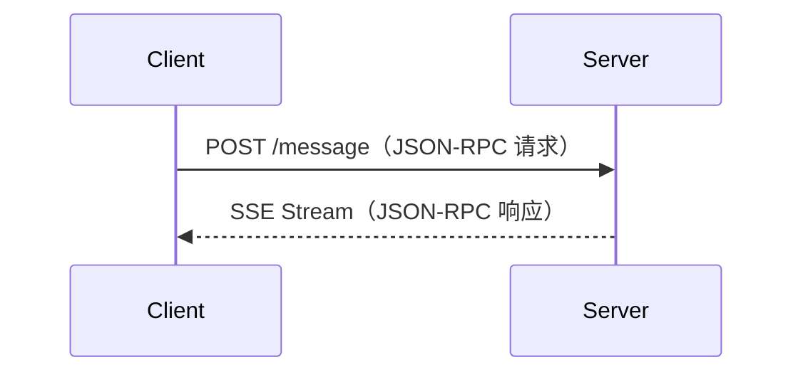
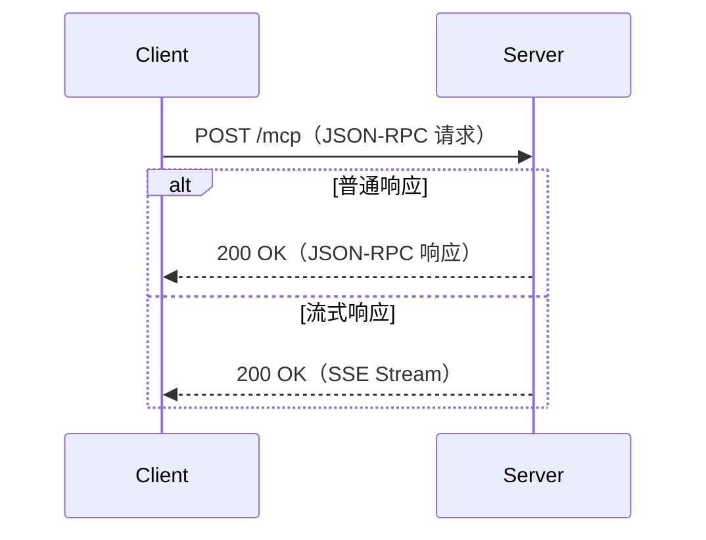
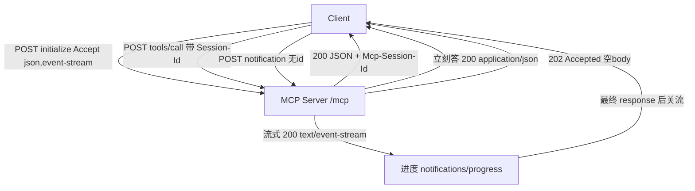
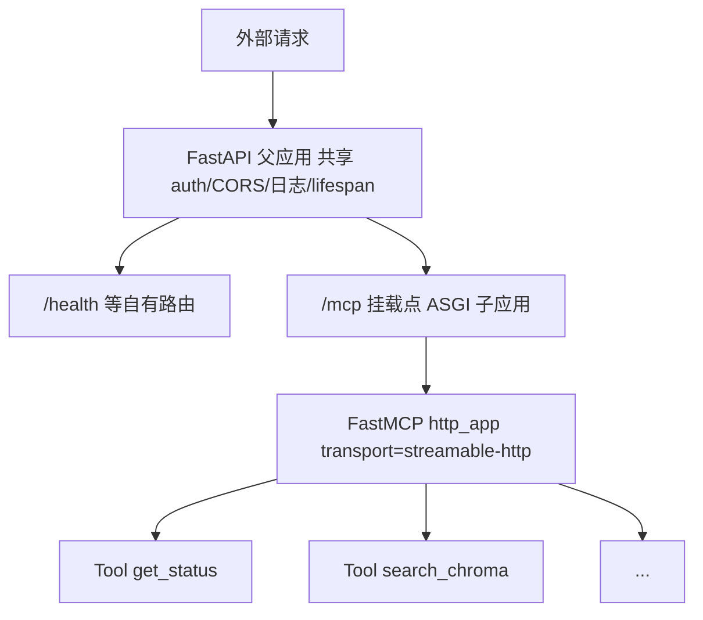

---

title: "MCP-Streamable-HTTP与SSE全链路"

created: "2026-07-13"

tags:

  - 八股文

  - ai

---

# MCP Streamable HTTP/SSE 全链路实现

> MCP 的 HTTP 传输层经历了从 HTTP+SSE 到 Streamable HTTP 的演进。Streamable HTTP 是 MCP 2025 年引入的新传输方式，解决了纯 SSE 的局限性。

## 传输层演进

| 阶段 | 方式 | 特点 |

| ------ | ------ | ------ |

| 初始 | HTTP + SSE | POST 发请求，SSE 接响应流 |

| 当前 | Streamable HTTP | 单端点、可升级、更灵活 |

## HTTP + SSE 模式（传统）



**局限性：**

- 需要维护两个端点（POST + SSE）

- SSE 连接管理复杂

- 不支持断线重连

## Streamable HTTP 模式（新）

**核心改进**：单端点处理所有请求，响应可以是普通 HTTP 或 SSE 流。



### 关键特性

| 特性 | 说明 |

| ------ | ------ |

| 单端点 | 所有请求发往同一个 URL |

| 可升级响应 | 从普通 HTTP 升级为 SSE 流 |

| 断线重连 | 支持 Last-Event-ID 恢复 |

| 会话管理 | 通过 Mcp-Session-Id Header |

### ASGI 挂载

```python

from starlette.applications import Starlette

from mcp.server import Server

mcp_server = Server("my-server")

app = Starlette()

# 挂载 MCP 端点

app.mount("/mcp", MCPEndpoint(mcp_server))

```

### 路径重写

在生产环境中，可能需要将 MCP 端点挂载在子路径下：

```nginx

location /api/mcp/ {

    proxy_pass http://localhost:8080/mcp/;

    proxy_http_version 1.1;

    proxy_set_header Connection "";

    proxy_buffering off;

}

```

### 认证链

Streamable HTTP 的认证流程：

| 步骤 | 请求 | 响应 |

| ------ | ------ | ------ |

| 1. 发现 | GET /mcp/.well-known/oauth-authorization-server | OAuth 元数据 |

| 2. 授权 | OAuth 2.0 流程 | Access Token |

| 3. 连接 | POST /mcp（带 Bearer Token） | Mcp-Session-Id |

| 4. 通信 | POST /mcp（带 Session-Id） | JSON-RPC 响应/SSE |

## 两种传输方式的选择

| 场景 | 推荐方式 | 理由 |

| ------ |----------| ------ |

| 本地开发/CLI | stdio | 简单、安全、无网络暴露 |

| 单用户桌面应用 | Streamable HTTP | 灵活、支持流式 |

| 多用户远程服务 | Streamable HTTP | 会话管理、断线重连 |

| 嵌入式/边缘设备 | stdio | 资源占用最小 |

---

---

> **本篇建立在哪篇之上**：⑧ MCP 协议（vs Function Calling、协议组成 Host/Client/Server、JSON-RPC 是什么）、⑨ MCP Server 实现（FastMCP + JWT + contextvars 多租户隔离）。需要的基础：知道「JSON-RPC 2.0 是一种用 JSON 写『远程调用请求/响应』的格式」即可（本篇会当场讲清），以及一点点「FastAPI/ASGI 是 Python Web 的异步接口」直觉（本篇也会当场讲清，不假设你会）。本篇会当场讲清：Streamable HTTP 传输、单端点 POST、会话头、以及把 MCP 当 ASGI 子应用挂进 FastAPI。

> **目标**：零基础读者读完，能说清「stdio / HTTP+SSE / Streamable HTTP 三种传输的区别」「为什么 Streamable HTTP 成了官方默认」「怎么把 MCP 挂进现有 FastAPI 一个进程搞定」，并能在里讲清 2026-07-28 无状态化的演进。

## 0. 先讲人话：传输层 = "信怎么送到"

想象大模型（LLM）是个**远在总部的老板**，MCP Server 是**楼下仓库的管理员**。老板要给管理员下指令、管理员要回话——**内容**（JSON-RPC 消息）都一样，但"信怎么送"有几种选法：

- **stdio（Standard Input/Output，标准输入输出）**：老板和管理员坐同一间办公室，直接递纸条。快、安全，但**人必须在一个屋檐下**（只能本地、父子进程）。

- **旧 HTTP+SSE（Server-Sent Events，服务端推送事件）**：老板用两个管道——一根一直通着的**广播喇叭（/sse 长连接）**听仓库回话，一根**投递口（/message POST）**发指令。喇叭不能断，断了就漏消息。

- **Streamable HTTP（流式 HTTP）**：只留**一个收发口（/mcp）**。老板每次要啥都 POST 过去；仓库能立刻答就回一张纸（单个 JSON），要慢慢算就打开一段**流式播报（SSE 流）**边算边报，报完就关。不用常年占着喇叭。

本篇主角就是第三种——它解决了前两种"喇叭不能断、负载均衡怕断流"的痛点，是**目前官方推荐的新项目默认传输**。

## 1. 它是什么 / 为什么需要它
### 1.1 传输层 = 信封和管道，不关心信里写啥

MCP 可以拆成三层看（别被术语吓到，就是一个"信封—管道—内容"的关系）：

| 层 | 是什么 | 生活类比 |

|-|-|-|

| **协议层（Protocol）** | 定义消息长啥样、有哪些方法（tools/call、resources/read…） | 信封上写"收件人/寄件人/正文格式"的规矩 |

| **传输层（Transport）** | 定义消息**怎么在网线上跑** | 用平信、快递还是当面递 |

| **能力层（Capabilities）** | 服务端具体提供哪些 Tools/Resources/Prompts | 仓库里实际有哪些货 |

> **关键认知**：传输层只负责"把一段 JSON-RPC 文本可靠送达"，**不关心里面是调用工具还是读资源**。所以换传输层（stdio → Streamable HTTP）时，上层协议和能力**一行都不用改**——这正是"分层"的价值。（来源：MCP 官方规范 Transports 章节）

### 1.2 stdio 的天花板：本地 demo 无敌，一上远程就露怯

stdio 在本地调试无敌，但生产场景一上"远程"就三个硬伤：

1. **必须同机同进程**：老板和管理员得在一台机器、用子进程拉起。想让云端大模型调你本地的 Server？不行。

2. **不跨网络**：没有端口、没有 HTTP，防火墙/CDN/网关全用不上。

3. **一对一**：一个 Server 只能被一个 Client 当儿子养，没法多租户。

而真实生产是：**云端 Agent → 远程 MCP Server（部署在服务器、多客户端连、前面有 nginx/网关）**。这就必须上 HTTP 系传输。

## 2. 三种传输横向对比

| 维度 | stdio | HTTP+SSE（旧，2024-11-05） | **Streamable HTTP（新，2025-03-26）** |

|-|-|-|-|

| 端点数 | 无（走 stdin/stdout） | 2 个：`/sse` 长连接 + `/message` POST | **1 个：`/mcp`（POST 为主）** |

| 长连接 | 不需要 | **必须常年保持 /sse** | 不需要，按需开 SSE 流 |

| 断流后果 | 进程级，整段断开 | **丢消息、要重连重发** | 每段请求独立，断哪段重哪段 |

| 负载均衡 | 不适用 | 脆弱（长连接绑死实例） | **友好（可无状态）** |

| 是否远程 | 否（本地） | 是 | 是 |

| 会话 | 无会话概念 | 有会话但要维持 | **Mcp-Session-Id header 可选会话（稳定版）** |

| 现状 | 仍在用 | **已废弃（2025-11-25 官方标记）** | **官方推荐默认** |

> ⚠️ **版本红线**：网上不少老教程说"HTTP+SSE 在 2025-05 废弃"，**准确说法是 2025-11-25 规范正式把 HTTP+SSE 标记为废弃**（来源：MCP 规范版本史 / yuuine 生态盘点 2026）。写代码请以你依赖的 SDK 实际支持版本为准。


## 3. Streamable HTTP 核心机制拆解
### 3.1 单端点 + POST 为主

客户端**每个 JSON-RPC 消息都是一次新的 HTTP POST** 到 `/mcp`。服务器看情况二选一返回：

- 能立刻答：返回 `Content-Type: application/json` 的**单个 JSON 对象**；

- 要慢慢推（进度、多消息）：返回 `Content-Type: text/event-stream` 的 **SSE 流**，报完关掉。

就像去窗口办事：能马上办完就当场给回执（单 JSON）；要排队慢慢办的，就给你开个"实时进度广播"（SSE 流），办完广播就关。

### 3.2 会话用 `Mcp-Session-Id` header（稳定版 2025-03-26 \~ 2025-11-25）

`initialize`（初始化握手）时，服务器**可能**在响应头回一个 `Mcp-Session-Id`；客户端后续所有请求**必须原样带上**。服务器用它挂"每会话状态"（限流计数、作用域凭证、审计日志）。这个 ID 必须是全局唯一且密码学安全的（UUID 或 JWT），且只含可见 ASCII（0x21–0x7E）。

> Auth0 / 官方安全建议把它编码成 **JWT（JSON Web Token，一种自包含的凭证令牌）**，这样服务器不用查库就能验真——呼应第 ⑨ 篇的 JWT 话题。

### 3.3 🔴 2026-07-28 无状态化巨变（当前是 RC，最终版 2026-07-28 发布）

这是 🔴 高优必须展开的最新演进。**2026-07-28 发布候选（Release Candidate）是 MCP 自发布以来最大的一次修订**，核心是"协议层无状态化"。它**移除了**：

- `initialize` / `notifications/initialized` 握手（SEP-2575）—— 协议版本、clientInfo、capabilities 改由每个请求的 `_meta` 携带；新增 `server/discover` 让客户端主动拉取服务端能力。

- 协议级会话与 `Mcp-Session-Id` 头（SEP-2567）—— 任意请求可落到任意实例，之前 sticky session、共享会话存储全不需要了。

- `GET` 流端点、`resources/subscribe`/`unsubscribe` —— 改成 `subscriptions/listen` 单一长流。

- **Resumable SSE（可恢复 SSE 流）被移除** —— 注意！稳定版里服务器可用 `Last-Event-ID` 做断线重放，但 2026-07-28 草案明确"Resumable SSE streams via Last-Event-ID are not supported"。

它**新增了**：

- **MRTR（Multi Round-Trip Requests，多轮往返请求，SEP-2322）**：服务器不再在 SSE 上反向发请求（sampling/elicitation/roots），而是返回一个 `InputRequiredResult`（含 `inputRequests` + `requestState`），客户端拿答案后**带着 `inputResponses` 重发原请求**。

- **可路由头 `Mcp-Method` / `Mcp-Name`**：负载均衡、网关、限流器不用读 body 就能按"方法"路由（来源：MCP 2026-07-28 RC 官方博客）。

- **缓存 `ttlMs` / `cacheScope`**：`tools/list`、`resources/read` 等返回带新鲜度提示，客户端可缓存（来源：hivebook / Mamezou 解读）。

- **JSON Schema 默认 2020-12**（SEP-1613）。

> 🔴 **实战含义**：这是 RC（候选版），最终规范 2026-07-28 才发布。写代码**务必以你用的 SDK 版本为准**：用 FastMCP 新版时，别再依赖 GET 长流、别假设 `Mcp-Session-Id` 一定存在；生产系统在上 RC 前建议**锁在 2025-11-25 稳定版**。

### 3.4 无状态模式（水平扩容关键）

若你的工具是**纯函数**（无会话状态，状态都在数据库），可开 `stateless_http=True`：不要求 `Mcp-Session-Id`，**任意 worker 都能处理任意请求**，直接多进程 `--workers 4` 扩容。代价是客户端不能"续上"上一个会话。（来源：FastMCP 部署文档 / MCP Python SDK）

## 4. JSON-RPC 2.0 在 HTTP 上怎么跑

MCP 所有消息都是 **JSON-RPC 2.0**（一种无状态的远程调用格式：一个 `jsonrpc:"2.0"` 字段 + `method` + 可选 `id` + `params`）。在 Streamable HTTP 上：

- **请求**：`POST /mcp`，`Accept: application/json, text/event-stream`（必须同时声明两种，表明"你回单个 JSON 或开流我都接"）。

- **响应**：单 JSON 对象，或 SSE 流（流里先发 `notifications/progress` 这类进度通知，最后发最终响应，随后关流）。

- **通知（notification，无 id 的消息）**：服务器收下回 `202 Accepted` 空 body；拒收回 4xx。

- **取消**：客户端关掉 SSE 响应流 = 取消该请求（每段请求独立，断哪段取哪段，不会误伤别的）。



⚠️ **准确性硬约束（必看）**：当前**稳定版（2025-11-25）不支持 JSON-RPC 批处理（batching）**。批处理曾在 2025-03-26 短暂引入，但**2025-06-18 即被移除**（官方理由："没有 compelling use case"）。所以你在 Streamable HTTP 上**每个请求都是单个 JSON-RPC 消息**，不要写"body 可放 JSON 数组批量发"的过时代码。（来源：MCP 官方 release notes / Speakeasy 版本对照 / 掘金 2025-06-18 详解）

```json

POST /mcp  HTTP/1.1

Content-Type: application/json

Accept: application/json, text/event-stream

Mcp-Session-Id: 1a2b3c4d

{ "jsonrpc": "2.0", "id": 2, "method": "tools/list" }

```

## 5. ASGI 子应用挂载
### 5.1 为什么"挂载"而不是"另起服务"

很多教程把 MCP 当**独立服务**跑：单独端口、单独 auth、单独 CORS、单独监控。可你**本来就有个 FastAPI 主服务**啊——再加一个 MCP 服务，等于多一套"攻击面（surface area）"：多一个端口、多一个健康检查、多一套鉴权路径。生产环境本来就够吵了。

**正解：把 MCP 当子应用（sub-application）挂进现有 FastAPI/Starlette 里**——一个进程、一个端口、一套 auth/监控。MCP 不是兄弟服务，是**挂在你 App 下的一个挂载点（mount）**。

### 5.2 代码骨架（极简，只留感觉）

```python

from fastapi import FastAPI

from fastmcp import FastMCP

mcp = FastMCP("API Tools")

@mcp.tool

def get_status() -> str:

    return "ok"

# 1) 生成 MCP 的 ASGI app，路径用根 "/"

mcp_app = mcp.http_app(path="/", transport="streamable-http")

# 2) 父应用复用 MCP 的 lifespan（生命周期），无需额外包装

app = FastAPI(lifespan=mcp_app.lifespan)

@app.get("/health")

def health():

    return {"status": "ok"}

# 3) 把 MCP 挂到 /mcp 下

app.mount("/mcp", mcp_app)

# 跑父应用即可：uvicorn main:app --host 0.0.0.0 --port 8000

```

挂载后：你的 API 仍答 `/health`，MCP 答 `/mcp`。**auth/CORS/日志全走外层 FastAPI 中间件**，MCP 自动复用——不用给 MCP 单独再写一套。

> **ASGI（Asynchronous Server Gateway Interface，异步服务器网关接口）** 是 Python Web 的异步标准接口；FastAPI/Starlette 都是 ASGI 应用，`app.mount()` 就是把一个 ASGI 应用挂到另一个的路径下。`mcp.http_app()` 吐出的正是个标准 ASGI 应用，所以能被挂。（来源：FastMCP 部署文档 / ekky.dev《Mount, Stream, Authenticate FastMCP with FastAPI》2026-05）

### 5.3 可挂多个 MCP Server



`FastAPI`/`Starlette` 下能 `mount` 多个 MCP 子应用（如 `/mcp-echo`、`/mcp-math`），各自独立工具集，共享外层 auth——多租户/多能力模块化就靠它。（来源：orchome《Python 使用 FastAPI 挂载多个 MCP 服务》/ MCP Python SDK 多 Server 示例）

## 6. 演进时间线（🔴 高优）

| 时间 | 版本 | 关键变化 |

|-|-|-|

| 2024-11-05 | 初版 | 引入 `stdio` + `HTTP+SSE` 双端点 |

| 2025-03-26 | 大改 | **Streamable HTTP** 登场，单端点 `/mcp`；引入 tool annotations；短暂加 JSON-RPC 批处理 |

| 2025-06-18 | 精修 | 结构化输出 `outputSchema`/`structuredContent`/`title`；**移除批处理**；Elicitation；强制 `MCP-Protocol-Version` 头 |

| 2025-11-25 | 当前稳定版 | HTTP+SSE **正式废弃**；OAuth/OIDC 增强；治理结构化；JSON Schema 2020-12 默认 |

| 2026-07-28 | RC（最终版同日发布） | **无状态化**：去握手、去会话；MRTR；`Mcp-Method`/`Mcp-Name` 头；`ttlMs`/`cacheScope` 缓存；**移除 Resumable SSE**；Roots/Sampling/Logging 标记废弃 |

> 实战：Atlassian 已于 2026-06-30 关闭其远程 MCP 的 SSE 端点——旧传输退场是实打实的（来源：agenticwire《FastMCP Streamable HTTP》）。

## 7. 生产落地细节（🔴 高优）

这些是高优才展开、和上线都用得上的"坑位清单"：

1. **Origin 校验防 DNS rebinding（DNS 重绑定攻击）**：服务器**必须校验 `Origin` 请求头**，非法就回 `403 Forbidden`。否则攻击者可用 DNS 重绑定从远程网页调你本地的 MCP Server。本地运行**只绑 `127.0.0.1`**，别绑 `0.0.0.0`。（来源：MCP 规范 Security / mcp.directory 审计——"Origin 校验是自定义 Server 最常被漏掉的一行"）

2. **CORS（Cross-Origin Resource Sharing，跨域资源共享）头**：浏览器/多源场景要放行 `mcp-session-id`、`mcp-protocol-version`、`Authorization`、`Content-Type`，并 `expose_headers=["mcp-session-id"]`。

3. **nginx 反代**：`proxy_buffering off`（缓冲会毁掉流式增量响应；或用 `X-Accel-Buffering: no` 头让 nginx 主动关缓冲）、`proxy_read_timeout` 调大到 300s（默认 60s 长工具会断）。

4. **EventStore（事件仓库）**：长耗时工具 > 客户端读超时，需要它存进度事件以便断线重连重放（稳定版特性）；多 worker 用 **Redis 后端**让事件跨进程存活。

5. **stateless_http 水平扩容**：纯函数工具开无状态，直接 `--workers 4`；否则多实例下会话在内存、请求被负载均衡分到不同实例会 404。

6. **sticky session（会话保持）不靠谱**：Cursor、Claude Code 等客户端内部用 `fetch()`，**不转发 Cookie**，负载均衡器认不出该路由到哪台——所以优先无状态，而非依赖粘性会话。（2026-07-28 之后连这个烦恼都没了，协议层直接无状态。）

7. **断线重连（稳定版）**：SSE 事件带 `id`，断了用 `Last-Event-ID` 头重连，服务器只重放此后的事件（不重不漏）；重试用指数退避。官方 Python SDK 的 `StreamableHTTPTransport` 已内置自动重连（`DEFAULT_RECONNECTION_DELAY_MS=1000`、`MAX_RECONNECTION_ATTEMPTS=2`）。（来源：deepwiki Python SDK 4.3）

## 8. 常见误区

- ❌ "MCP 和 JSON-RPC 是两套东西" → 错。**MCP 消息格式就是 JSON-RPC 2.0**，传输层只是把 JSON-RPC 文本搬来搬去。

- ❌ "Streamable HTTP 一定要长连接" → 错。它**默认不要求长连接**，只是服务器"需要时"才开一段 SSE 流，用完即关。

- ❌ "换传输层要重写工具" → 错。传输层与能力层解耦，换 stdio→Streamable HTTP，Tools 代码一行不动。

- ❌ "MCP 必须独立部署" → 错。用 ASGI `mount` 挂进现有 FastAPI，一个进程搞定，攻击面更小。

- ❌ "GET 长流是标准用法" → **过时**。2026-07-28 草案移除 GET 流端点；且当前 Resumable SSE 在 RC 也被移除。以你 SDK 版本为准。

- ❌ "可以在一个 POST 里批量发多个 JSON-RPC" → ❌ **当前稳定版不支持批处理**（2025-06-18 已移除）。每请求单消息。

## 9. 核心要点

- **Transport 是什么**：MCP 分层里的"管道层"，只管 JSON-RPC 消息怎么送达，与上层协议/能力解耦。

- **三种传输**：stdio（本地）、HTTP+SSE（旧/2025-11-25 废弃）、Streamable HTTP（新/默认）。

- **Streamable HTTP 三特征**：单端点 `/mcp`、POST 为主、服务器按需开 SSE 流、可选 `Mcp-Session-Id` 会话（稳定版）。

- **JSON-RPC over HTTP**：`Accept: application/json, text/event-stream`；请求单 JSON 或 SSE 流；通知回 202；**不支持批处理（2025-06-18 移除）**。

- **ASGI 挂载**：`mcp.http_app()` 生成 ASGI 子应用 → `app.mount("/mcp", mcp_app)` → 复用父应用 auth/CORS/lifespan，一个进程一个端口。

- **2026-07-28 巨变**：去握手、去会话（无状态核心）、MRTR 多轮往返、`Mcp-Method` 头、缓存 `ttlMs`、移除 Resumable SSE。

- **生产三件套**：Origin 校验防 DNS rebinding、nginx `proxy_buffering off`、stateless_http 水平扩容（或 Redis EventStore）。

## 10. 简历项目绑定：具体改进方向

基于你项目 `ai-resume-analyzer` 的真实情况（FastMCP Server + JWT + contextvars，Streamable HTTP 挂载 `/mcp`，5 Tool + 2 Resource；Client = httpx + JSON-RPC over HTTP），对照业界最佳实践有 3 个具体改进点：

**改进 1：把 MCP 子应用用 ASGI `mount` 真正并入主 FastAPI（而非另起端口）**

- **差距**：你项目目前 MCP Server 是独立 `mount("/mcp", mcp_sub_app)`（`main.py`），方向已对；但确认 JWT 校验与 CORS 是否完全复用外层 FastAPI 中间件、没有给 MCP 单独再开一套 auth。

- **改动**：文件 `main.py`——确认 `mcp_sub_app` 复用了父应用的 `lifespan` 与 JWT 中间件（`mcp_app.lifespan` 已挂到 `FastAPI(lifespan=...)`）；若 MCP 单独又包了一层鉴权，删掉，统一走外层。`app.mount("/mcp", mcp_sub_app)` 即可。

- **风险**：低；挂载后需回归测试 `/mcp` 路径下的鉴权与 CORS 头。

- **收益**：攻击面更小、部署单元合一、可直接讲"一个进程一套 auth 管两边"。

- **一句话讲清**："MCP Server 不是独立服务，我用 `app.mount('/mcp', mcp_sub_app)` 挂进现有 FastAPI，JWT 在外层中间件统一拦截、contextvars 透传 user_id 做多租户，一套 auth 管 API 和 MCP 两边。"

**改进 2：对长耗时工具验证 `stateless_http` 与 EventStore（水平扩容准备）**

- **差距**：你检索工具（`search_knowledge_base` 等）是纯函数式（状态在 ChromaDB），理论上可开 `stateless_http=True` 直接多 worker 扩容；但需确认 `main.py` 是否已开、以及长检索（>60s）在 nginx 下是否会因 `proxy_read_timeout` 断流。

- **改动**：文件 `main.py` / MCP 初始化——若工具无会话状态，设 `FastMCP(..., stateless_http=True)`；`nginx.conf` 加 `proxy_buffering off; proxy_read_timeout 300s;`（或 `X-Accel-Buffering: no`）；多 worker 用 Redis EventStore 跨进程存进度事件。

- **风险**：中——无状态后客户端不能续上"上一个会话"，若你有依赖会话状态的逻辑（如 sampling）需改显式 handle 模式。

- **收益**：可跑在普通 round-robin 负载均衡后（呼应 2026-07-28 无状态方向），高并发扛得住。

- **一句话讲清**："检索是无状态的，我开 stateless_http 直接多 worker；长查询靠 nginx 关缓冲 + EventStore 重放进度，避免被网关超时掐断。"

**改进 3（演进视角，非必须）：为 2026-07-28 无状态化预留开关**

- **差距**：2026-07-28 RC 移除 `Mcp-Session-Id` 与 GET 流，引入 `Mcp-Method` 头与 `ttlMs` 缓存。你当前若依赖会话头，未来 SDK 升级要改。

- **改动**：在 `main.py` 抽象一层"传输配置"，锁 `protocolVersion=2025-11-25` 直到 SDK 稳定支持 RC；后续再切 `stateless` + `Mcp-Method` 路由。

- **风险**：低（只是配置预留）。

- **收益**：展示"我关注 MCP 规范演进，已为无状态化做版本隔离"。

## 下一篇预告

下一篇 **⑪ MCP Client（自定义客户端 + JSON-RPC over HTTP + 连接池 + 幂等重连）——本篇你搞懂了"电线"（Transport）怎么走，下一篇讲"接线员"：客户端怎么拨号连上 Server、发现能力、发请求、断线了怎么幂等重拨**。带着本篇的 `Mcp-Session-Id`、SSE 流、无状态化认知，下一篇的连接池与重连会非常好懂。

##

> ▶ 对应实操：21-MCP Transport：Streamable HTTP → ASGI 子应用挂载 + JSON-RPC 2.0

## 速记卡（面试闪卡）

**Q1：一句话讲清「MCP Streamable HTTP/SSE 全链路实现」到底是什么？**

A：MCP 传输层（Transport）是搬 JSON-RPC 消息的管道：Streamable HTTP 用单端点 /mcp，取代了需长连接的旧 HTTP+SSE。

**Q2：一、先讲人话（信怎么送） —— 怎么理解？**

A：老板（LLM）给仓库管理员（MCP Server）下指令：stdio 像同屋递纸条；旧 HTTP+SSE 像常年占着的广播喇叭（断了漏消息）；Streamable HTTP 只留一个收发口 /mcp，能立刻答就回单 JSON，要慢算就开一段 SSE 流播报完即关。

**Q3：二、三种传输横向对比 —— 怎么理解？**

A：stdio 本地父子进程，不跨网络一对一；HTTP+SSE 双端点（/sse+/message），长连接绑死实例，2025-11-25 已废弃；Streamable HTTP 单端点 /mcp，按需开 SSE 流，断哪段重哪段，负载均衡友好，官方默认。

**Q4：三、核心机制与会话 —— 怎么理解？**

A：单端点 POST 为主：服务器二选一返回单 JSON 或 SSE 流。稳定版用 Mcp-Session-Id（会话头，常编码成 JWT 自包含令牌）做每会话状态。2026-07-28 RC 巨变：去握手、去会话、无状态化，引入 MRTR 多轮往返与 Mcp-Method 路由头。

**Q5：四、ASGI 挂载与生产落地 —— 怎么理解？**

A：ASGI（异步网关接口）挂载：mcp.http_app() 生成子应用，app.mount('/mcp', ...) 并入现有 FastAPI，一个进程一套 auth/CORS。生产三件套：Origin 校验防 DNS 重绑定、nginx 关缓冲、stateless_http 水平扩容或 Redis EventStore。

**Q6：核心速记主线有哪些？**

- 传输层只搬 JSON-RPC，换传输上层协议零改动

- Streamable HTTP 单端点 /mcp，取代废弃的 HTTP+SSE

- 稳定版 Mcp-Session-Id 会话；RC 无状态化去握手去会话

- ASGI mount 挂进 FastAPI，Origin 校验 + 无状态扩容

**口诀**

A：传输只搬信，换管零改动；

单口 /mcp，旧 SSE 退休。

会话 JWT，RC 去握手；

挂载进 FastAPI，无状态扩容。

相关链接

- [[八股文学习路线图]]

- [[00-全局导航|全局导航]]

---

## 快速问答

| 问题 | 参考答案 |

| ------ | --------- |

| Streamable HTTP 相比传统 HTTP+SSE 的改进？ | 单端点处理所有请求，支持从普通HTTP升级为SSE流，支持断线重连和会话管理 |

| MCP 目前的局限性？ | ① 协议还在演进中 ② 生态尚不成熟 ③ 远程部署的安全性需加强 ④ 缺乏成熟的监控和治理工具 |

| 如何选择 MCP 传输方式？ | 本地用 stdio（简单安全），远程用 Streamable HTTP（灵活支持流式和会话管理） |

## 相关链接

- [[笔记/AI与Agent/知识/八股/48-Self-RAG与Reflexion|Self-RAG与Reflexion]]

- [[笔记/AI与Agent/知识/八股/49-MCP协议实现-JSON-RPC与传输层|MCP协议实现-JSON-RPC与传输层]]

- [[笔记/AI与Agent/知识/八股/39-记忆系统vs-RAG本质区别|记忆系统vs-RAG本质区别]]

- [[笔记/AI与Agent/知识/八股/26-MCP协议核心概念|MCP协议核心概念]]

- [[笔记/AI与Agent/知识/八股/33-异常处理与降级策略|异常处理与降级策略]]

