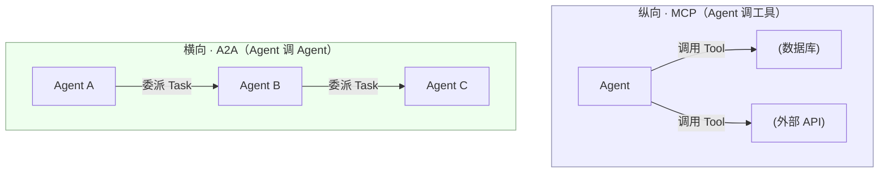
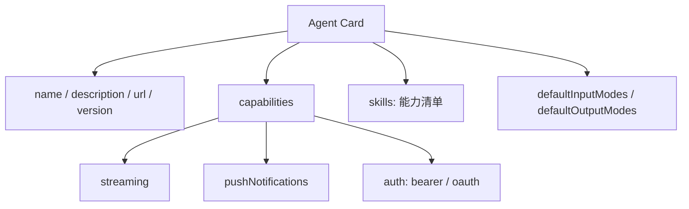
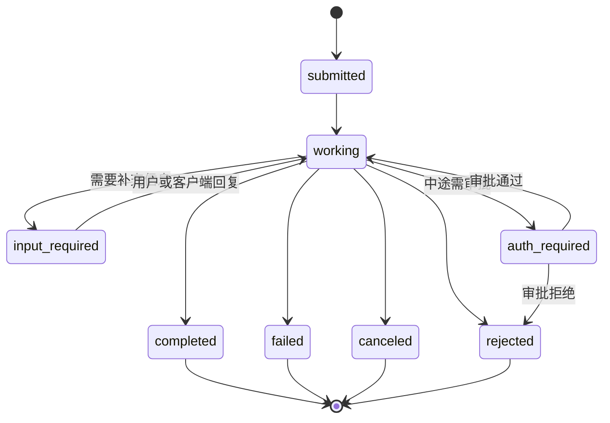
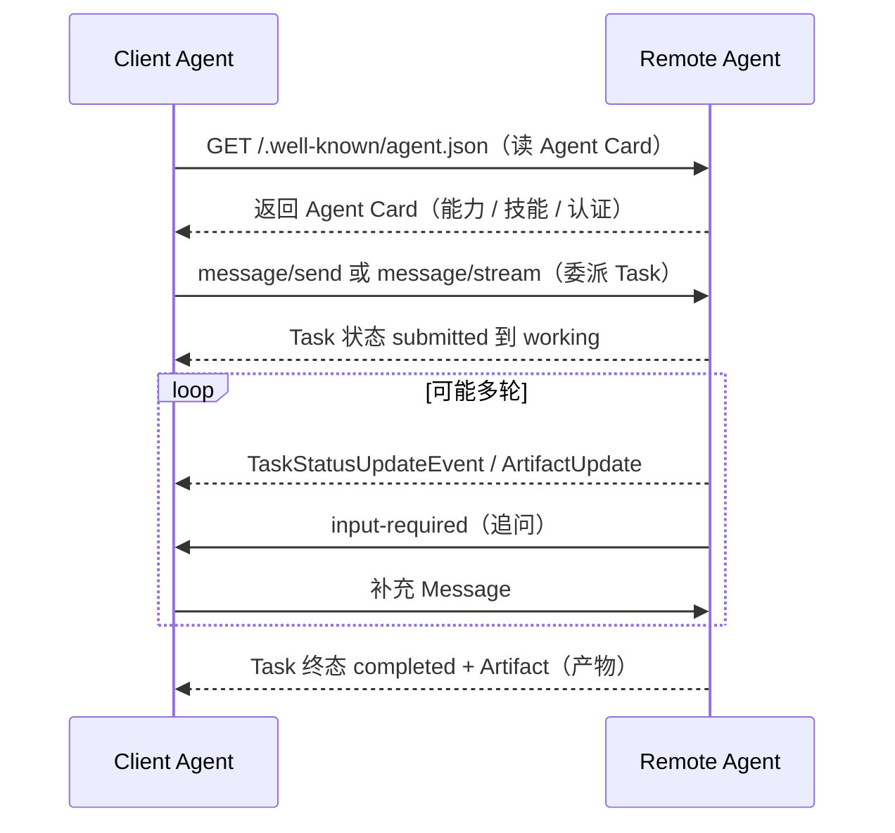
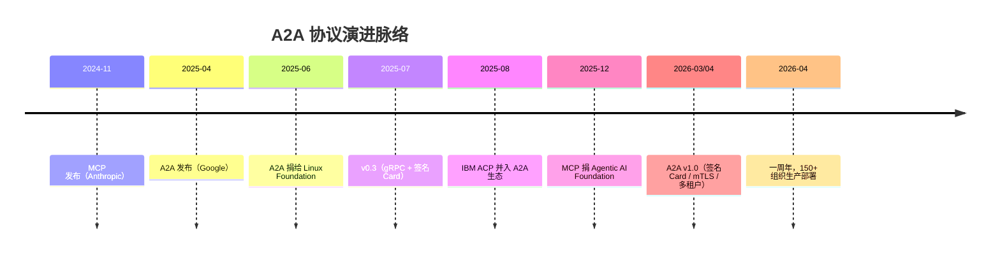

这是「AI Agent / RAG 求职学习资料」系列的第 13 篇，主题是 **A2A 协议（Agent2Agent Protocol，Agent 对 Agent 协议）**。它和前几篇讲的 MCP 经常被一起提起，但很多人分不清——本篇帮你把这条线彻底理清楚。

>
**本篇建立在哪篇之上 / 你需要什么基础：**
① 前置篇：**⑧ MCP 协议**（已经讲过 MCP vs Function Calling、协议组成、JSON-RPC、Transport）。A2A 在那篇里作为「横向对比点」出现过，本篇把它展开成完整体系。
② 需要的铺垫知识：**③ Agent 四要素**（知道 Agent 是什么）、**⑤ Self-RAG**（里面讲过「状态机 / 状态图」的思维方式，本篇 Task 状态机会复用）、一点点 HTTP 与 JSON 常识。如果这几篇还没读，建议先补，否则会遇到生词卡壳。

# 一、为什么需要 A2A：从「一个人干活」到「一群人协作」

先说一个生活化场景。你让一个员工同时做「查简历、算薪资、写报告、发邮件」，他会累瘫，而且任何一环卡住整条线全停。更聪明的做法是：招一个简历专员、一个薪资专员、一个报告专员、一个邮件专员，大家各干各的，需要时就互相派活。AI Agent 也是一样——当一个任务复杂到超过单个 Agent 的能力边界，就需要多个 Agent 像团队一样协作。

这里的关键分水岭是：**工具（Tool）和 Agent 是两种完全不同的东西**。工具是无状态、原子、被同步调用的「能力」（比如查数据库、发邮件）；而 Agent 是有自主推理、会自己发起动作、可能长时间运行的「对等体（peer）」。你让一个 Agent 去「调工具」，和让一个 Agent 去「找另一个 Agent 派活」，这两件事的协议需求完全不同。

举个真实的翻车案例（来源：今日头条技术文章，2026 年上半年）。有个团队上了三个 Agent——风控、对账、异常处理——结果它们仨用同步 HTTP 互相调用，全在互相等，整条链路卡死。作者点评得很到位：你用 RESTful 思维去搭 Agent 系统，相当于「用自行车链条去连高铁车厢」。Agent 和微服务最大的区别是：微服务被动响应外部请求，Agent 会自己发起动作。所以架构师的思维要从「我调用你」变成「我订阅你」——底层跑异步事件，而不是同步请求。

A2A 要解决的，正是这个「Agent 之间怎么协作」的问题。它和 MCP 不是竞争关系，而是技术栈上的两层。下面用一张图把这两种关系摆清楚。



## 一、A2A 是什么：给 Agent 一张「数字名片」

**A2A（Agent2Agent Protocol，Agent 对 Agent 协议）**是 Google 在 2025 年 4 月提出的开放标准，目的是让**互相独立、可能由不同厂商用不同模型构建的 Agent** 能够发现彼此、安全通信、协作完成任务。不到两个月后的 2025 年 6 月，Google 把它捐给了 Linux Foundation（Linux 基金会），放到中立治理下；到 2026 年 4 月，A2A 已经发布 **v1.0 稳定生产标准**，据 Linux Foundation 数据，已有 150 多家组织在生产环境部署，覆盖供应链、金融、保险、IT 运维，并集成进 Microsoft Azure AI Foundry、AWS Bedrock AgentCore、Google Cloud 等云平台。

一个好记的类比：**HTTP 之于网页，A2A 之于 Agent**。当年网页之间能互相跳转，靠的是每个网站有个标准地址、用 HTTP 说同一种「请求-响应」语言。A2A 干的事类似——它规定每个 Agent 都挂一张「数字名片」，别的 Agent 读了这张名片，就能决定要不要「雇佣」它来完成某个子任务。

这里有个非常关键、但初学者常忽略的点：**A2A 标准化的是「通信信封」，不是「对话语义」**。所谓信封，就是「怎么发现对方、怎么派活、任务状态怎么流转」这一套 plumbing（管道）。至于两个 Agent 聊的具体内容（业务语义），A2A 不管——它先把「能不能对话」解决掉，再谈「对话质量」。先有信封，后有内容，这个顺序是对的。

## 二、五个核心概念：先类比，再定义

为避免一上来堆术语，我们用一个招聘场景把它们串起来：你是「主 Agent（Client Agent，客户端 Agent）」，想找个「简历分析 Agent（Remote Agent，远程 Agent）」帮忙。沿着「招聘」这条线，A2A 的五个核心概念就都出来了。

**1. Agent Card（智能体名片）**：相当于对方的 LinkedIn 简历。它是一份 JSON 格式的元数据文档，描述「我是谁、能干什么、怎么找到我、需要什么认证」。别的 Agent 靠它来判断「要不要雇佣这个人」。后面第四节会拆它的字段。

**2. Task（任务）**：相当于你派出去的一张工单。当客户端发一条消息、而服务端判断这事需要多步才能完成时，就会生成一个有状态的 Task，分配一个唯一 ID，并经历一套生命周期（提交→工作中→完成/失败）。Task 可以包含多轮消息往来。

**3. Message（消息）**：相当于一封信，是客户端和服务端之间一次单轮的通信单元。它带一个 role 字段——「user」表示客户端发的，「agent」表示服务端发的；每条 Message 里装着一个或多个 Part。

**4. Part（内容片段）**：相当于信里的一页纸，是 Message 或 Artifact 里内容的最小原子单元。有三种类型：TextPart（纯文本）、FilePart（文件，可以是内联 base64 或外部 URI）、DataPart（结构化 JSON，比如表单、参数）。

**5. Artifact（产物）**：相当于同事交回来的成果文件，是任务最终生成的可交付产出。它不可变，由一个或多个 Part 组成，而且可以增量流式返回（比如一个大文件分块传）。

一句话串起来：你读对方的 **Agent Card** 决定雇佣 → 委派一个 **Task** → 来回发 **Message**（每条含若干 **Part**）→ 对方交回 **Artifact**。

## 三、Agent Card 长什么样

Agent Card 是一份挂在固定地址（通常是 `/.well-known/agent.json`）的 JSON。下面先用图看它的整体结构，再给字段表。



| 字段 | 含义 | 例子 |
|-|-|-|
| name / description | Agent 的名字与一句话介绍 | "AI 简历分析助手" |
| url | A2A 服务端点（客户端往这发 Task） | https://api.example.com/mcp/a2a |
| version | Agent / 协议版本 | 0.2.0 / 1.0 |
| capabilities.streaming | 是否支持 SSE 流式推送 | true |
| capabilities.pushNotifications | 是否支持 webhook 异步通知 | true |
| capabilities.auth | 支持的认证方式 | bearer（JWT / OAuth2） |
| skills[] | 具体能力清单（id、描述、输入输出模式） | analyze_resume / search_kb |
| defaultInputModes / defaultOutputModes | 默认输入/输出内容类型 | text、file |

一个极简骨架感受一下（只留结构，不追求完整字段）：

```json
{
  "name": "ai-resume-analyzer",
  "description": "分析简历并回答相关问题的 Agent",
  "url": "https://api.example.com/a2a",
  "version": "0.2.0",
  "capabilities": { "streaming": true, "pushNotifications": true },
  "skills": [
    { "id": "analyze_resume", "description": "分析指定简历" }
  ]
}
```

**🔴 高优补充（v1.0 重要变化）：**在 v0.x 时代，Agent Card 是自声明的——任何 Agent 都能声称自己是任何人，没有信任可言。A2A v1.0 引入了**签名 Agent Card（Signed Agent Card）**：用 JWS（JSON Web Signature，JSON 网页签名）对 Card 做密码学签名，配合 JSON Canonicalization（JSON 规范化）。这样客户端在跨组织信任边界委派任务前，能先验证「这张名片确实来自它声称的域名」。这是 A2A 从「有意思的草案」走向「企业敢路由真金白银」的关键一步。

## 四、Task 状态机：一次协作任务的生命周期（重点）

这是 A2A 的心脏。Task 不是「发出去就完了」，而是有完整生命周期的有状态对象。下面这张状态图是必背的。



逐状态解释，配上「工单」类比：

**submitted（已提交）**：Task 刚创建，服务端已接收。就像工单刚进系统。

**working（工作中）**：Agent 正在处理。这是最长期的状态，可能持续很久（长任务）。

**input-required（需要输入）**：Agent 卡住了，需要客户端补信息（比如「请确认要分析哪份简历」）。注意它和 working 之间可以来回跳——补完信息继续干，干到又缺信息再问。这是一个循环，不是一次性的。

**completed（完成）/ failed（失败）/ canceled（取消）/ rejected（拒绝）**：四个终态。completed 是正常交付；failed 是执行出错；canceled 是客户端主动撤单；rejected 是服务端拒单（比如没权限、不接这活）。

**auth-required（需要认证，v1.0 新增）**：任务跑到一半，某步操作需要人工或客户端审批。它给了 Agent 一个「中途要授权」的标准兜底，审批通过回到 working，拒绝则进 rejected。这个状态对金融、企业场景特别重要。

**三种交互机制（怎么驱动这个状态机）：**

① **请求-响应 / 轮询（message/send）**：客户端发 message/send，服务端可能先回一个 working；客户端之后周期性调用 tasks/get 轮询，直到 Task 到终态。适合能保持短连接、偶尔查一次的场景。

② **SSE 流式（message/stream）**：客户端发 message/stream 并同时订阅该 Task 的更新；服务端保持 HTTP 连接（Content-Type: text/event-stream），持续推送 TaskStatusUpdateEvent（状态变化）和 TaskArtifactUpdateEvent（产物分块，带 append / lastChunk 字段方便重组）。任务到终态时服务端设 final:true 并关闭连接。适合长任务实时看进度、或交互式对话。

③ **Push 通知（webhook）**：针对超长任务（分钟/小时/天）或没法保持长连接的客户端（移动端、Serverless）。客户端提供一个 HTTPS webhook URL，服务端在状态重大变化时主动 POST 通知，客户端再 tasks/get 拉全量。相当于「干完了打电话告诉我，我再来取件」。

断线怎么办？如果 SSE 连接中途断了、Task 还活着，客户端可以用 SubscribeToTask 重新订阅，接着收更新——容错到位。

## 五、一次完整的横向握手：时序拆解

把上面概念串成一条时间线，就是 A2A 的一次完整协作。下面用时序图展示，并配「招聘」类比。



类比招聘流程：你先读对方的 Agent Card，就像看 JD（职位描述）判断「这人能干啥」；然后委派 Task，相当于投简历派活；对方在 working 中如果 input-required，就像实践中追问你细节；最后 completed + Artifact，相当于发 offer 并交来成果。整套流程标准化、可发现、有状态——这就是 A2A 相对「裸调 HTTP API」的价值。

## 六、A2A vs MCP：深度对比与选型

这是最高频的问题。先把关键维度摆成一张表，再给判断口诀。

| 维度 | MCP | A2A |
|-|-|-|
| 提出方 / 时间 | Anthropic，2024-11 | Google，2025-04 |
| 所处层级 | 纵向：Agent 调工具 / 数据 | 横向：Agent 调 Agent |
| 架构 | 客户端-服务端（Client-Server） | 对等体（Peer-to-Peer） |
| 发现机制 | Host 暴露可用 Tool / Resource | Agent Card 挂在 /.well-known 自动发现 |
| 状态模型 | Tool 无状态；2025-11 起加 Tasks 扩展做异步 | 有状态，显式 Task 生命周期 |
| 传输 | JSON-RPC over stdio / Streamable HTTP | JSON-RPC over HTTP(S)，亦支持 gRPC、SSE |
| 典型用途 | 给单个 Agent 接工具、接数据（RAG 首选） | 多个 Agent 委派、协调长任务 |
| 治理 | Agentic AI Foundation（Linux Foundation，2025-12 捐） | Linux Foundation（2025-06 捐） |
| 2026 成熟度 | 非常成熟，万级社区服务器 | v1.0 已生产，适合多 Agent 试点 / 落地 |

**判断口诀（背下来）：**MCP 是「USB-C for AI」——给一个 Agent 接上各种工具的通用口；A2A 是「HTTP for Agents」——让不同 Agent 之间能对话。二者不是二选一，而是同一技术栈的两层。**一个严肃的 Agent 部署，两层都会跑**：用 MCP 把单个 Agent 接好工具，用 A2A 把多个 Agent 编排成团队。

更具体的选型：如果你要做的是「给一个强大 Agent 接上公司数据 / 工具、跑 RAG 流水线」——选 MCP，ROI 来得快。如果你要做的是「让一群各有所长的 Agent 协作完成跨步骤长任务（比如分析市场数据→起草报告→安排会议）」——上 A2A。现实里多数企业 2026 年先上 MCP，等架构从「单个助手」演进到「真·多 Agent 系统」时，再把 A2A 作为互补层加上去。

## 七、工程实践与边界情形（🔴高优）

落到工程，有几个容易踩坑、也常问的点，单独拎出来讲。

**传输选择。**A2A 默认走 JSON-RPC over HTTP(S)（和 MCP 的 Streamable HTTP 同源思路）；v0.3 起加入 gRPC 支持，适合对延迟极敏感、同生态内紧耦合的多 Agent（有资料称 LangGraph 紧耦合场景下 A2A 可达 sub-100ms 交接）；SSE 用于流式。选哪种看你是「跨厂商松耦合」还是「同栈高性能」。

**安全（v1.0 重头戏）。**A2A v1.0 做了几件企业关心的事：移除不安全的 OAuth implicit / password 流，加入 Device Code（RFC 8628）+ PKCE；引入原生多租户（multi-tenancy）；加入 mTLS（双向 TLS）；正式化 Agent Card 签名（JWS）。再配合 auth-required 状态，让「任务中途要审批」有了标准兜底。对跨组织委派，这些不是可选项，是前提。

**长任务与流式容错。**SSE 流式 + webhook 推送覆盖「一直在线」和「没法一直在线」两类客户端；断线用 SubscribeToTask 重连。设计长任务时必须想清楚：超时怎么处理、产物分块怎么重组（append + lastChunk）、失败怎么回退。

**四个常见误区（别踩）：**

① 把 A2A 当同步 RPC 用——错。它是异步、有状态的，靠 Task 生命周期推进，不是「调一下等返回」。

② 以为 A2A 取代 MCP——错。两者互补，层级不同，前面讲透了。

③ 忽略 Agent Card 里的 auth 字段——这是安全漏洞。Card 描述了认证要求，客户端必须遵守，否则等于把能力暴露给不该调用的人。

④ 以为 A2A 规定了 Agent 之间的「业务语义」——错。它只标准化通信信封（发现、委派、状态流转），聊什么内容由上层应用决定。

## 八、演进脉络：一张正在收敛的协议栈

把时间线拉直，能看清整个 Agent 互操作标准圈的走向。



一个有意思的趋势：几乎所有严肃协议都在约 12 个月内走向基金会治理（MCP 捐给 Agentic AI Foundation，A2A 在 Linux Foundation，IBM 的 ACP 也并入 A2A）。这恰恰说明行业在「收敛」而不是「打标准之战」。另外，IBM 曾提过竞品 ACP（Agent Communication Protocol，Agent 通信协议），但 2025-08 并入了 A2A；还有 Cisco 牵头的 AGNTCY / OASF，专门做 Agent 身份与发现层。所以未来不是「一个协议通吃」，而是一张分层协议栈：**MCP 工具层 + A2A/ACP Agent 层 + OASF 身份发现层**。

## 九、核心要点

**Q1：A2A 和 MCP 的核心区别是什么？**
A：层级不同。MCP 是纵向——一个 Agent 怎么接工具 / 数据；A2A 是横向——一个 Agent 怎么和另一个对等 Agent 协作。MCP 没有「对等 Agent」的概念，Tool 是无状态被动能力，Agent 是有自主推理的对等体。

**Q2：Agent Card 是什么？作用？**
A：一份挂在 /.well-known/agent.json 的 JSON 元数据，描述 Agent 的身份、能力（skills）、端点、认证要求。作用是支持自动发现与安全协作；v1.0 起可签名（JWS），让客户端能验证身份、防止冒充。

**Q3：Task 有哪些状态？**
A：submitted → working →（input-required ⇄ working）→ completed / failed / canceled / rejected；v1.0 还加了 auth-required（中途需审批）。

**Q4：A2A 怎么处理长任务？**
A：三种机制——轮询（message/send + tasks/get）、SSE 流式（message/stream 持续推送状态 / 产物分块）、Push 通知（webhook，服务端主动 POST）。断线可用 SubscribeToTask 重连。

**Q5：为什么 A2A 不直接调对方 API，而是走 Card + Task？**
A：因为跨组织、跨厂商，需要标准化的「发现 + 有状态委派 + 安全边界」。Agent Card 解决「发现谁、能不能信」，Task 解决「一次协作怎么有状态地推进到完成」。

## 十、简历绑定：你的 AI 简历分析系统 v0.2.0

下面是基于你项目**真实代码**（不是泛泛而谈）给出的可落地改进点。我已核查：项目目前是「能调工具的 Agent」，还缺「能和其他 Agent 协作的 Agent」这一层。

**现状核查（基于代码）：**

① 纵向层（已有）：`backend/mcp_server/` 是 FastMCP 服务端（5 个 Tool + 2 个 Resource，JWT 认证中间件，挂载到 `/mcp`）；`backend/mcp_client/` 是客户端（httpx.AsyncClient + JSON-RPC over HTTP + 连接池）。`server.py` 里那段中文 `instructions` 其实已经是「proto Agent Card」的雏形。

② 编排层（已有）：`services/agentic_rag/graph.py` 的 `create_agentic_rag_graph` 是一个 9 节点 + 3 条件边 + Reflexion ≤2 轮 + MemorySaver checkpointer 的单 Agent LangGraph；`mcp_graph.py` 是它的 MCP 调用变体（节点换成 mcp_search / mcp_rerank / mcp_generate）。

③ 横向层（缺失）：全项目 grep 确认，没有任何 a2a / AgentCard / agent2agent / .well-known 痕迹。系统还没有「对外暴露能力 + 委派他人」的能力。

**差距 1：没有 Agent Card，外部 Agent 无法发现 / 信任它。**

**改动点：**新建 `backend/agent_card.py`，构造 Agent Card JSON（name="ai-resume-analyzer"、version="0.2.0"、
capabilities:{streaming:true, pushNotifications:true}、auth:{schemes:["bearer"]}、
skills 复用 `server.py` 里 instructions 的 search_knowledge_base / analyze_resume / rewrite_query 等、
defaultInputModes:["text","file"]、defaultOutputModes:["text"]）；
在 `main.py` 新增路由 `app.add_route("/.well-known/agent.json", agent_card_handler)`，
并让它走 MCPAuthMiddleware 做 Bearer 校验；MVP2 再用 JWS 对 Card 签名以满足 v1.0 身份可验证。

**为什么 / 风险 / 收益：**让简历分析 Agent 成为「可被雇佣」的 peer，能嵌入更大的 HR-tech Agent 网格（会眼前一亮）。风险是 /.well-known 路由必须纳入 JWT 鉴权，否则技能清单暴露成信息泄露；签名需管理密钥。收益是你能说「我的系统不仅用 MCP 接工具，还能以 A2A Agent Card 形式被其他 Agent 发现与委派」，体现对完整 Agent 技术栈的理解。

**差距 2：单 Agent，无横向委派（最值得做）。**

**改动点：**在 `graph.py` 的 StateGraph 增加一个 `A2A_DELEGATE_NODE`（如 `a2a_delegate_node`），并在 `_route_after_route` 增加分支——当 route_decision 判定某子任务更适合外部 peer（如「市场薪资对标」需外部 market-data Agent、「职业规划建议」需 career-advisor Agent）时进入该节点：① GET 目标 peer 的 /.well-known/agent.json 读 Card；② 用 message/send 或 message/stream 委派 Task；③ 把返回的 Artifact 合并进 AgenticRAGState（新增字段 `delegated_results`）；④ 失败 / 超时回退本地 RAG 兜底。传输可复用 `backend/mcp_client/client.py` 的 httpx.AsyncClient + JSON-RPC over HTTP 底座（A2A 同走 JSON-RPC over HTTP），改动量小。

**为什么 / 风险 / 收益：**把「单 Agent RAG」升级成「Agentic RAG + 多 Agent 协作」，真正体现 Agent 网络的 value，且贴合 2026 生产现实（A2A v1.0）。风险是引入异步 Task 生命周期（轮询 / SSE / push）会增加复杂度与潜在延迟；对通常 2 秒内的简历问答，滥用委派会拖慢。缓解：只对明确长时 / 外部子任务委派，设超时与本地兜底，保持现有 search_round 上限纪律。收益：这是常见的延伸追问的「你项目还能怎么改进」的 concrete 话术，且落地成本可控。

**差距 3：现有 MCP client 未抽象成「协议无关传输层」。**

**改动点：**把 `backend/mcp_client/client.py` 的 JSON-RPC over HTTP 客户端抽成可复用 transport（如 `core/a2a_transport.py` 或扩展原 client），A2A client 直接复用，避免重复造轮子，也体现工程化素养。

## 十一、下一篇预告

下一篇讲 **ACP（Agent Communication Protocol，Agent 通信协议）**——IBM 提出、2025-08 并入 A2A 生态的「竞合者」，以及 **AGNTCY / OASF：Agent 身份与发现层**。你会看到 A2A 不是孤立标准，而是一张正在收敛的分层协议栈（MCP 工具层 + A2A/ACP Agent 层 + OASF 身份发现层）。如果你想先把「横向协作」落到代码，也可以先讲 **LangGraph 多 Agent 编排实战**，把本篇的 Agent Card + Task 思想用代码跑起来。

---

**资料来源（截至 2026-07-16）：**A2A 官方规范 a2a-protocol.org / a2acn.com；beam.ai《Agent2Agent vs MCP 2026》；AppScale《MCP vs A2A vs ACP 2026》；iceberglakehouse《State of Agentic AI Standards 2026》；web3aiblog《Agent Interop War 2026》；今日头条《Agent 握手了，你的系统还在排队》（2026 上半年）。协议时间线与 v1.0 安全特性以官方 spec 与 Linux Foundation 公告为准，具体字段以你部署时的 A2A 版本文档为准。

##
> ▶ 对应实操：[[37-Multi-Agent协作模式|37-Multi-Agent协作模式]]


## 速记卡（面试闪卡）

**Q1：一句话讲清「一、为什么需要 A2A：从「一个人干活」到「一群人协作」」到底是什么？**
A：A2A 是 Agent 之间协作的开放协议：靠 Agent Card 互相发现、用有状态的 Task 委派活儿，像团队分工而非一个人单干。

**Q2：Agent Card 是什么？ —— 怎么理解？**
A：像招聘时的 LinkedIn 简历挂在 /.well-known/agent.json，别的 Agent 读了它才知道你干啥、怎么联系、要不要验身份。英文全称 Agent Card（智能体名片），v1.0 起可用 JWS 签名防冒充。

**Q3：Task 状态机怎么理解？ —— 怎么理解？**
A：像一张工单：submitted 刚进系统、working 在处理、input-required 追问你补材料、最后 completed 交成果或 failed 撤单。英文全称 Task（任务）是有状态对象，能多轮来回。

**Q4：A2A 怎么处理长任务？ —— 怎么理解？**
A：像点外卖等配送：轮询是隔会儿刷新看进度，SSE 是实时推送"骑手已出发"，Push 是到了打电话通知你再来取。英文全称 SSE（Server-Sent Events，服务端推送事件）和 webhook（回调通知）。

**Q5：A2A 和 MCP 到底啥关系？ —— 怎么理解？**
A：MCP 是"USB-C for AI"给单个 Agent 接工具，A2A 是"HTTP for Agents"让 Agent 互相对话。英文全称 Agent2Agent Protocol（Agent 对 Agent 协议）。两者是技术栈两层，不是二选一。

**Q6：核心速记主线有哪些？**
- 定位：A2A 解决 Agent↔Agent 协作，MCP 解决 Agent↔工具
- 发现：Agent Card 挂 /.well-known 自动发现 + JWS 签名验身
- 协作：Task 有状态生命周期 + 三种交互（轮询/SSE/Push）
- 选型：单 Agent 接工具用 MCP，多 Agent 编排用 A2A

**口诀**
A：A2A 是 Agent 互相聊，
Card 名片先亮招；
Task 工单有状态，
长活靠推不靠吵。

相关链接
- [[26-MCP协议核心概念]]
- [[53-MCP-vs-A2A本质区别]]
- [[54-ANP协议概念]]
- 54
- [[八股文学习路线图]]
- [[00-全局导航|全局导航]]

相关链接
54

**Q2： —— 怎么理解？**
A：▶ 对应实操：
相关链接
54

**Q3：核心速记主线有哪些？**
A：抓住这几根：。
## 相关链接

- [[笔记/AI与Agent/知识/八股/26-MCP协议核心概念|MCP协议核心概念]]
- [[笔记/AI与Agent/知识/八股/54-ANP协议概念|ANP协议概念]]
- [[笔记/AI与Agent/知识/八股/54.5-MCP-A2A-ANP三层协议栈|MCP-A2A-ANP三层协议栈]]
- [[笔记/AI与Agent/知识/八股/36-工具调用死循环检测|工具调用死循环检测]]
- [[笔记/AI与Agent/知识/八股/49-MCP协议实现-JSON-RPC与传输层|MCP协议实现-JSON-RPC与传输层]]
