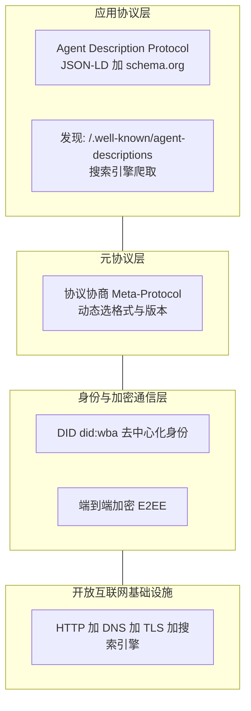
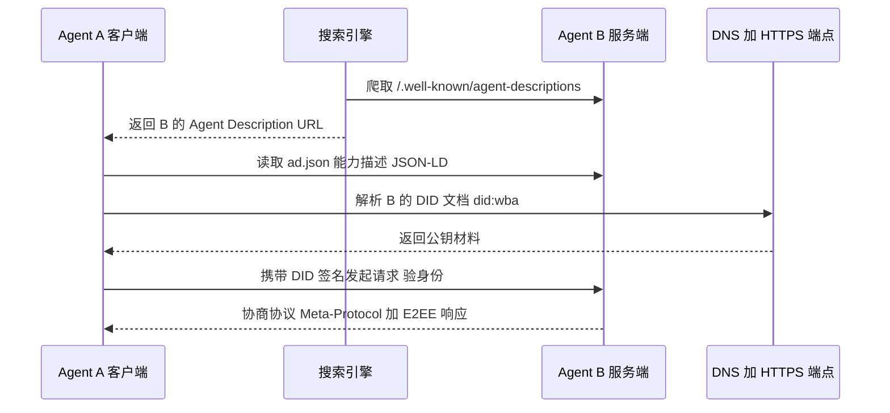
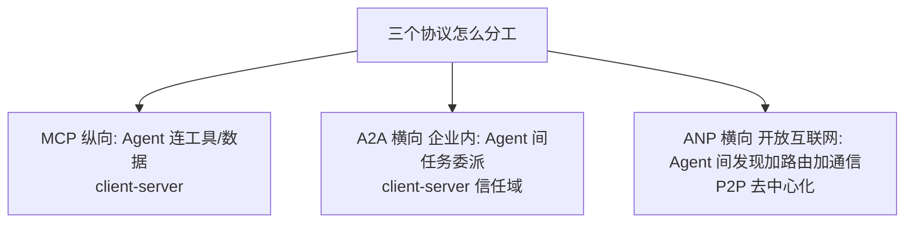

# 前置说明：本篇站在哪篇之上、需要什么基础

本篇是第 15 篇，🟡中优主题。它建立在两篇前置之上：

- **⑬ A2A 协议**——你已经知道 A2A 是企业内 Agent 横向协作的协议；
- **⑭ MCP vs A2A**——你已经知道 MCP 纵向连工具、A2A 横向连 Agent，两者互补。

本篇引入第三个协议 **ANP（Agent Network Protocol，智能体网络协议）**，讲它和前两者的关系，并聚焦它的独特定位：**「大规模 Agent 发现与路由的网络基础设施」**。结论先行——**如果说 MCP 是 Agent 的「电源插座」、A2A 是「公司内网」，那 ANP 就是「整个智能体互联网的 HTTP + DNS + 护照」：给每个 Agent 发去中心化身份证、让陌生 Agent 也能在开放互联网上被搜索发现、安全地对话。**

> 
读前 30 秒速览：**ANP** = ANP 开源技术社区 2025-05 发布，目标是「智能体互联网时代的 HTTP」。三层架构：身份与加密层（DID / did:wba）/ 元协议层（协议协商）/ 应用层（Agent 描述与发现，JSON-LD）。和 MCP、A2A 互补——**MCP 连工具、A2A 企业内协作、ANP 开放互联网互联**。

# 一句话核心判断

> Use MCP to connect tools or resources, A2A for agent collaboration within enterprises, and ANP for agent connections on the open internet.（用 MCP 连工具/资源，用 A2A 做企业内 Agent 协作，用 ANP 做开放互联网上的 Agent 互联。）—— ANP 官方指南，2026

记住这句话，你就能把三个协议一次性摆对位置：**MCP 是「纵向接工具」、A2A 是「横向（企业内）接 Agent」、ANP 是「横向（开放互联网）接 Agent 的网络地基」。**

# 类比开场：从「公司内网」到「全球互联网」

把前几篇的类比接着往下推（rhkb / ANP 白皮书思路）：

- **MCP = 你家的电源插座**：Agent 向下插工具（数据库、API），即插即用。
- **A2A = 公司内网**：同一个信任域里的 Agent 互相认识、有固定通讯录（Agent Card 放已知 URL），委派任务。适合企业内部工作流。
- **ANP = 整个互联网 + DNS + 护照 + 黄页**：Agent 要跟**完全陌生、跨公司跨平台**的其他 Agent 打交道。它不知道对方在哪、长啥样，于是需要：① 一张全球可验证的「数字护照」（DID）；② 一个「黄页」（Agent Description，搜索引擎能爬）；③ 一套「见面先查护照、再协商怎么说」的规则。

一句话：**A2A 假设「双方已经在通讯录里」；ANP 解决「两个陌生人怎么在开放世界里互相找到、验明正身、安全通话」。**这就是「网络基础设施」的含义。

# 概念拆解：为什么需要「网络基础设施层」

## 先类比建立直觉

今天的互联网是**为人设计的**——网页是给人看的 GUI（图形界面），数据锁在各个 App 的「数据孤岛」里。Agent 要用现有服务，要么模拟人去点网页（又慢又易错），要么等对方给自己单独开发 API。

ANP 的野心是：**为 Agent 原生（AI-native）重新设计一层互联网基础设施**，让 Agent 像人访问网站一样自然地去发现、连接、协作——只是它读的是结构化描述、用的是协议，不是肉眼看网页。

## 再给严格定义：ANP 解决哪三个问题

ANP 用三大机制对应「我是谁 / 你在哪 / 我们怎么聊」：

**1. 我是谁 —— DID（Decentralized Identifier，去中心化标识符）**  
每个能收发消息的 Agent 必须持有一个 `agent_did`。ANP 采用 **did:wba**（Web-Based Agent，基于 Web 的 Agent）方法：把 DID 文档挂在一个公开可解析的 HTTPS 端点上，公钥材料也在里面。这样身份解析直接复用现有 Web 基础设施，**不依赖任何中央平台**。再配合 **WNS（Web Name Service，网络名称服务）**，把 `alice.example.com` 这种人类可读的 Handle 映射到 did:wba 身份，支持双向验证。类比：DID 是 Agent 的「数字护照」，WNS 是护照上的「姓名」。

**2. 你在哪 —— Agent Description（ADP，Agent Description Protocol，智能体描述协议）+ 发现**  
每个 Agent 发布一份能力描述文件（JSON-LD 格式，基于 schema.org 语义本体），放在域名的 `/.well-known/agent-descriptions`。发现有两种方式：**主动发现**（直接查对方域名的 well-known 端点）和**被动发现**（搜索引擎像爬网页一样爬这些描述文件并建立索引）。类比：这是 Agent 的「黄页名片」，搜索引擎当「黄页公司」。

**3. 我们怎么聊 —— Meta-Protocol（元协议 / 协议协商层）**  
两个 Agent 见面不假定对方讲同一种「方言」。它们先交换结构化需求、**动态协商**用哪个协议格式和版本，再正式通信。这点是 A2A 没有的——A2A 用固定的 JSON-RPC 2.0，而 ANP 的元协议让通信格式可协商、更灵活。

# Mermaid 图 1：ANP 三层架构

读图要点：从下往上——先有开放互联网底座（HTTP/DNS/TLS），之上是身份与加密层（DID + E2EE），再上是元协议层（协商），最上是应用层（描述与发现）。实现方可先接基础能力，再按需加消息、发现、支付。

# Mermaid 图 2：ANP 发现与连接流程

读图要点（ANP 官方 Getting Started）：整个过程**不依赖中央平台**。搜索引擎当「黄页」让 A 找到 B；A 用 B 的 DID 文档里的公钥验证 B 身份；双方协商协议后加密通信。这正是「开放互联网规模发现与路由」的含义。

# 三者全景对比表

| 维度 | MCP | A2A | ANP |
|-|-|-|-|
| 解决问题 | Agent 连工具/数据（纵向） | 企业内 Agent 任务委派（横向） | 开放互联网 Agent 互联（横向·基础设施） |
| 拓扑 | client-server | client-server（信任域） | 对等 P2P（去中心化，无中央注册表） |
| 身份模型 | Token + TLS（隐式） | Agent Card（自发布 JSON） | W3C DID（did:wba，可验证、去中心化） |
| 发现机制 | 静态 URL / 手动配置 | 已知 URL（/.well-known/agent-card.json） | DID + 搜索引擎爬取（/.well-known/agent-descriptions） |
| 传输/格式 | JSON-RPC 2.0 over stdio/HTTP | HTTP + JSON-RPC 2.0 + SSE | HTTP + JSON-LD |
| 协议灵活性 | 固定 | 固定 JSON-RPC | 元协议动态协商 |
| 中心化程度 | 中（有服务器） | 低（对等） | 极低（完全去中心化） |
| 适用场景 | LLM 调工具 | 组织内多 Agent 工作流 | 开放智能体市场 / 跨组织 |
| 成熟度 | 生产级（千级 Server） | v1.0 生产（150+ 组织部署） | 早期提案（无生产级 SDK，未入 Linux Foundation） |

来源：agent-network-protocol.com 官方 spec v1.1 / guide / 白皮书；virtua.cloud、zylos.ai、CSDN（garyond）、eulerai.au 2026 对比文综合整理。

# Mermaid 图 3：三个协议怎么分工

读图要点：**不是三选一，是三个层次/场景互补**。MCP 解决「Agent 怎么用工具」，A2A 解决「企业内 Agent 怎么协作」，ANP 解决「开放互联网上陌生 Agent 怎么互相发现并安全连接」。一个开放生态里的 Agent，底层可能用 MCP 接工具、企业内用 A2A、跨出组织边界用 ANP。

# 边界与诚实声明：ANP 现在到哪一步了

> 
**重要边界（必须诚实）：**ANP 目前仍是**提案 / 早期开发阶段**——有 GitHub 开源仓库、W3C 社区组白皮书、arXiv 技术白皮书（2508.00007），但**尚无生产级 SDK、未获 Linux Foundation / AAIF 治理、采用度远低于 A2A**。A2A 在 2026-04 已一周年、150+ 组织生产部署。所以：**企业内真实落地先用 A2A；ANP 是面向「智能体互联网」未来的基础设施愿景与早期标准。**别在里把 ANP 说成已经 production——会被追问穿帮。

**什么时候该认真考虑 ANP？** 当你的场景是**开放互联网、跨组织、需要去中心化发现与路由**（比如一个公开的 Agent 市场，陌生 Agent 互相找服务）时。如果你的场景是单租户内部系统，A2A + MCP 已经够用，引入 ANP 是过度设计。

# 常见误区

## 误区 1：「ANP 会取代 A2A / MCP」

**错。** ANP 官方自己定位三者互补：MCP 连工具、A2A 企业内协作、ANP 开放互联网互联。它们解决不同规模/信任域的问题。

## 误区 2：「ANP 已经 production 了」

**错。** 如前所述，ANP 仍处早期提案，无生产级 SDK、未入 Linux Foundation。别高估它的当前成熟度。

## 误区 3：「ANP 和 A2A 一样是 client-server」

**错。** A2A 是 client-server（信任域内已知 URL）；ANP 是 **P2P 去中心化**——无中央注册表，靠 DID + 搜索引擎爬取做发现。控制面是去中心化的（传输仍复用 HTTP）。

# 核心问答

**Q1：ANP 一句话是什么？**  
A：面向「智能体互联网」的开放协议栈，目标是成为 Agent 互联网的 HTTP；给 Agent 发去中心化身份（DID）、支持开放互联网规模的发现与路由、动态协商协议、端到端加密通信。

**Q2：ANP 和 A2A 核心区别？**  
A：① 范围——A2A 企业内信任域，ANP 开放互联网跨组织；② 身份——A2A 用自发布 Agent Card，ANP 用 W3C DID（did:wba，可验证去中心化）；③ 发现——A2A 已知 URL，ANP 靠 DID + 搜索引擎爬取；④ 拓扑——A2A client-server，ANP P2P 去中心化；⑤ 协议——A2A 固定 JSON-RPC，ANP 有元协议协商层。

**Q3：ANP 三层架构？**  
A：身份与加密通信层（DID + E2EE）/ 元协议层（协议协商）/ 应用协议层（Agent Description + 发现，JSON-LD）。底层复用 HTTP/DNS/TLS/搜索引擎。

**Q4：什么时候用 ANP？**  
A：开放互联网、跨组织、需要去中心化发现与路由的场景（如公开 Agent 市场）。企业内部用 A2A + MCP 就够了，上 ANP 是过度设计。

**Q5：ANP 现在成熟度如何？**  
A：诚实答——早期提案阶段，有开源仓库和白皮书，但无生产级 SDK、未入 Linux Foundation，采用度远低于已生产部署的 A2A。是面向未来的基础设施标准。

# 简历绑定：你的项目怎么借 ANP 思路补「网络层」

**差距分析（基于真实代码核查）：**你的 `D:\Project\ai-resume-analyzer` 是**单 Agent LangGraph + MCP 垂直集成**——`backend/mcp_server/server.py` 用 FastMCP 暴露 5 个工具，`backend/mcp_client/client.py` 是 JSON-RPC 客户端，`backend/main.py` 把 MCP 挂到 `/mcp`；全仓**零 A2A、零 agent 身份(DID)、零发现/路由层**。LLM 直接靠 MCP 的 `tools/list` 选工具。ANP 概念点出的是你架构里最缺的一块——**「发现与路由」的基础设施视角**。

## 改动点 1：在协议分层图里补「网络基础设施层」（低成本、高认知收益）

- **加什么：**在 ⑭ 规划但未落地的 `docs/protocol-layering.md` 里补第三行「ANP 风格网络层（规划中）」，把协议栈画成：MCP 工具层 / A2A Agent 层 / ANP 网络基础设施层。显式说明「当前项目只到 MCP 层，A2A/ANP 是开放生态演进方向」。
- **为什么：**展示你理解 infra（网络/身份/发现）↔ app（工具/协作）的分层，而不是只会用一个 MCP。
- **风险：**极低，纯文档。
- **预期收益：**一句话讲清「我项目现在是纵向 MCP，A2A/ANP 是我理解的下一代横向与网络层演进」。

## 改动点 2：加一个轻量 AgentRegistry（借鉴 ANP 的「描述 + 发现」思想）

- **加什么：**新建 `backend/agent_registry/registry.py` + `agent_description.json` schema，把现有 5 个 MCP tool（search_knowledge_base / rerank_results / generate_answer / analyze_resume / rewrite_query）描述为「可被发现的 capability 清单」（类似 ANP 的 Agent Description，但本地简化版，不引入 DID/JSON-LD 全套）。若后续按 ⑭ 计划接入 peer Agent，它们不用硬编码端点，而是查这个 registry 发现彼此能力。
- **为什么：**为横向层补齐「发现」这一环——这正是 ANP 相对 A2A 多出来的核心能力（A2A 假设已知 URL，ANP 解决未知发现）。
- **风险：**当前单 Agent 阶段属于 premature abstraction（提前抽象）；若长期不接多 Agent，registry 会成摆设。可先实现为进程内字典，不引外部依赖。
- **预期收益：**把 ANP「发现与路由」概念落到你架构的真实缺口上，被问「你项目还能怎么改进」时有 concrete 话术。

## 改动点 3：把 ANP 的「人/agent 授权分界」落到 MCP 工具授权上

- **加什么：**ANP 区分「人类授权」与「Agent 授权」：低风险操作（查公开信息）Agent 自动授权，高风险操作（转账）需显式人类授权。你的项目 MCP 已有 JWT 中间件 + contextvars 用户上下文；可在此基础上给工具加**授权分级**——当前 5 个工具都是只读/生成（低风险，Agent 自动授权即可），但若未来新增「自动投递简历」「发送邮件」类**写操作**工具，必须加 human-in-the-loop（人在回路）确认。
- **为什么：**把 ANP 的安全理念（最小信息披露 + 高风险需人授权）延伸到你已有的授权体系，而不是另起炉灶。
- **风险：**需定义「风险等级」判定规则，避免过度拦截影响体验；写操作工具当前不存在，属前瞻性设计。
- **预期收益：**体现你对 Agent 安全边界的思考，安全类追问（如「怎么防止 Agent 乱发邮件」）能直接接住。

> 
**追问话术储备：**「我研究过 ANP 的思路——它补的是 MCP/A2A 都没收口的『开放互联网发现与路由』层（DID 身份 + 搜索引擎式发现 + 元协议协商）。我的项目目前是单 Agent + MCP，没有发现层；我规划的分两步演进是：先在协议分层图里显式标出 ANP 风格网络层，再加一个本地 AgentRegistry 借鉴它的『描述即发现』思想，并为未来写操作工具引入 ANP 的人/agent 授权分界。这样从『会用 MCP』升级到『理解 Agent 互联网的分层基础设施』。」

# 下一篇预告

协议族已经讲全：MCP（工具）→ A2A（企业内 Agent）→ ANP（开放互联网网络层）→ 还差「用户交互层」和「多 Agent 编排」两块拼图。下一篇建议三选一：

- **① AG-UI 协议**：Agent ↔ 用户界面交互层（流式事件 / 状态同步 / 人类介入），把 ⑭ 提的「三层协议栈」补齐到四层；
- **② Multi-Agent 编排框架对比**：LangGraph vs CrewAI vs OpenAI Agents SDK（直接贴你项目的 `graph.py`，最贴简历）；
- **③ Agent 安全专题**：间接提示注入 + 人类授权边界（把 ANP 的「人/agent 授权分界」和 ⑭ 的「间接提示注入共通风险」合成一篇）。

你定方向，我开写。

---

**资料来源（均为 2026 年公开资料，检索于 2026-07-16）：**agent-network-protocol.com 官方 spec v1.1（identity-discovery / guide / 白皮书，arXiv:2508.00007）、virtua.cloud《MCP, A2A, and ANP》、zylos.ai《多智能体信任与协调协议 2026-04》、CSDN（garyond）《一文了解 MCP/ACP/A2A/ANP》、eulerai.au《ANP Reshapes the Internet》。关键数据：ANP 由开源社区 2025-05 发布、规范迭代至 v1.1、目前仍处早期提案（无生产级 SDK、未入 Linux Foundation）；A2A 2026-04 一周年 150+ 组织生产部署。成熟度表述以官方/社区最新状态为准。

## 速记卡（面试闪卡）

**Q1：一句话讲清「前置说明：本篇站在哪篇之上、需要什么基础」到底是什么？**
A：今天的互联网是**为人设计的**——网页是给人看的 GUI（图形界面），数据锁在各个 App 的「数据孤岛」里。Agent 要用现有服务，要么模拟人去点网页（又慢又易错），要么等对方给自己单独开发 API。

**Q2：先类比建立直觉 —— 怎么理解？**
A：今天的互联网是**为人设计的**——网页是给人看的 GUI（图形界面），数据锁在各个 App 的「数据孤岛」里。Agent 要用现有服务，要么模拟人去点网页（又慢又易错），要么等对方给自己单独开发 API。
ANP 的野心是：**为 Agent 原生（AI-native）重新设计一层互联网基础设施**，让 Agent 像人访问网站一样自然地去发现、连接、协作——只是它读的是结构化描述、用的是协议，不是肉眼看网页。

**Q3：再给严格定义：ANP 解决哪三个问题 —— 怎么理解？**
A：ANP 用三大机制对应「我是谁 / 你在哪 / 我们怎么聊」：
**1. 我是谁 —— DID（Decentralized Identifier，去中心化标识符）**  
每个能收发消息的 Agent 必须持有一个 。ANP 采用 **did:wba**（Web-Based Agent，基于 Web 的 Agent）方法：把 DID 文档挂在一个公开可解析的 HTTPS 端点上，公钥材料也在里面。

**Q4：误区 1：「ANP 会取代 A2A / MCP」 —— 怎么理解？**
A：**错。** ANP 官方自己定位三者互补：MCP 连工具、A2A 企业内协作、ANP 开放互联网互联。它们解决不同规模/信任域的问题。

**Q5：误区 2：「ANP 已经 production 了」 —— 怎么理解？**
A：**错。** 如前所述，ANP 仍处早期提案，无生产级 SDK、未入 Linux Foundation。别高估它的当前成熟度。

**Q6：核心速记主线有哪些？**
A：抓住这几根：先类比建立直觉、再给严格定义：ANP 解决哪三个问题、误区 1：「ANP 会取代 A2A / MCP」、误区 2：「ANP 已经 production 了」、误区 3：「ANP 和 A2A 一样是 client-server」、改动点 1：在协议分层图里补「网络基础设施层」（低成本、高认知收益）。

## 相关链接
- [[52-A2A协议核心概念]]
- [[53-MCP-vs-A2A本质区别]]
- 54
- [[八股文学习清单]]
- [[00-全局导航|全局导航]]
