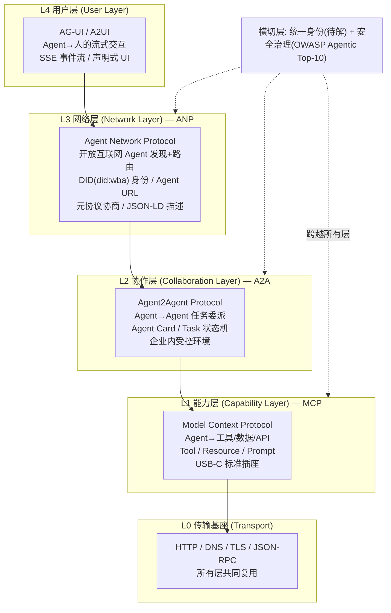
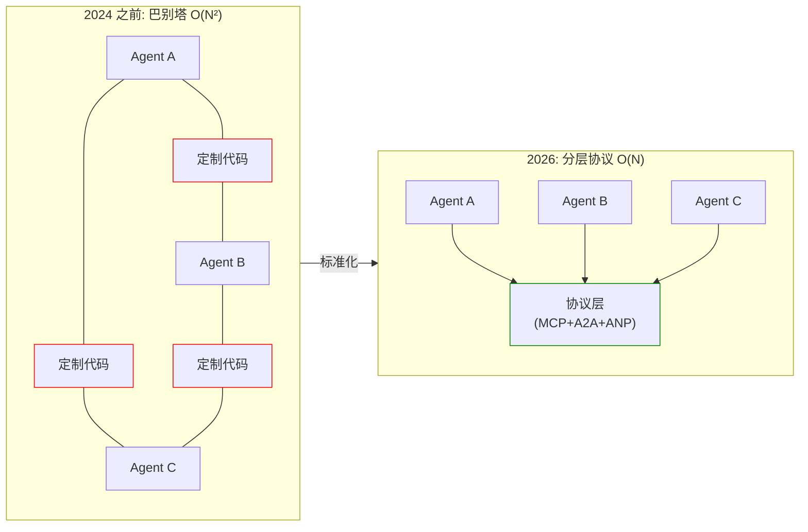
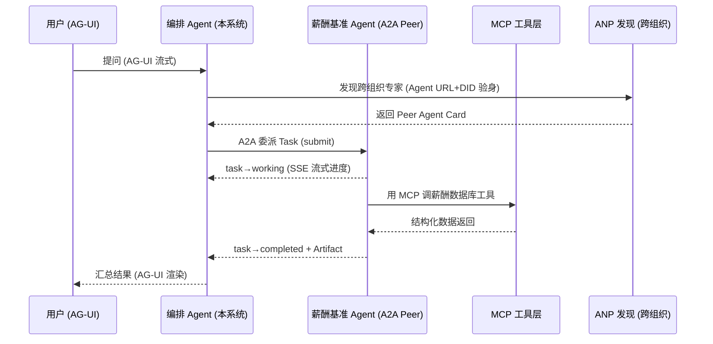
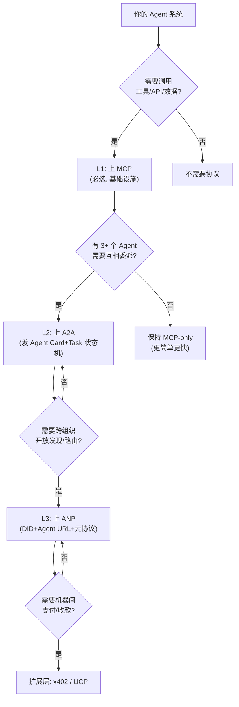
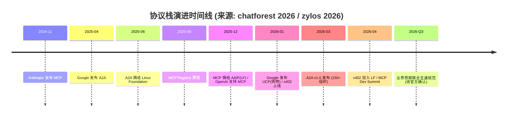

> 
**本篇建立在哪篇之上：**⑧ MCP 协议、⑬ A2A 协议、⑭ MCP vs A2A 本质区别、⑮ ANP 协议。建议先读完这四篇再来——本篇是它们的"收口"，把三个协议拼成一个可落地的统一架构。
**需要什么基础：**知道 MCP 是"Agent 连工具"、A2A 是"Agent 连 Agent（企业内）"、ANP 是"开放互联网上 Agent 互相发现"。本文不再重复单协议细节，只讲它们怎么分层拼装。如果这三点还模糊，先回看 ⑧⑬⑮。

# 一、先说结论：不是"选一个"，而是"叠三层"

很多人学完 MCP、A2A、ANP 会陷进一个误区：**"这三个到底用哪个？"** 错。业界的共识结论非常清楚——

**它们不是一个赛道里的三个选手，而是同一栋楼里的三层：地基、楼层、楼顶。你不是选一层住，而是三层都得有。**

> 
一句记住：**MCP 解决"Agent 能干什么"（接工具），A2A 解决"Agent 之间怎么协作"（委派任务），ANP 解决"Agent 怎么在开放互联网上找到彼此"（发现+身份）。**三者轴向不同、互补非竞争。2026 年主流架构参考模型就是 **MCP + A2A 双层**（Linux Foundation 已 crystallize 为参考模型），ANP 是面向开放互联网的第三层长期赌注（来源：zylos.ai 2026-03 协议融合研究、chatforest 2026 协议栈全景）。

## 1.1 一个生活化类比：智能城市

把"Agent 社会"想成一座城市，三层协议正好对应城市的三套基础设施：

- **MCP（能力层）= 每家每户的标准水电插座。** 你家的电器（工具）只要插上这个标准接口就能用，不用为每个电器单独拉一根线。Agent 想用数据库、API、文件系统，统统走 MCP 这个"标准插座"。
- **A2A（协作层）= 公司/园区内网 + 对讲机。** 同一个园区（同一家企业、同一个受控环境）里的同事（Agent）之间，用对讲机委派活儿、汇报进度。你不需要知道对方用什么牌子的对讲机，只要协议一致就能协作。
- **ANP（网络层）= 城市路网 + 门牌号 + 身份证。** 你要找的是另一座城市（跨组织、开放互联网）的某个人，得靠 DNS 一样的"门牌号"（Agent URL）和公安局发的"身份证"（W3C DID 去中心化身份）才能找到并验明正身。
- **AG-UI（用户层，附赠）= 大楼前台的大屏。** 以上三层都是 Agent 之间的事，但 Agent 总得把结果展示给"人"看——AG-UI 就是那块负责实时把进度、结果流式推给用户界面的大屏（来源：CopilotKit AG-UI、dev.to 2026 协议栈分析）。

看图说话：**越往下越"物理"（接工具、走网络），越往上越"社交"（协作、对人）。** 一个真正能干的 Agent，往往是"顶在天台用 AG-UI 跟人说话，脚踩 MCP 插座用工具，左手 A2A 跟同事协作，右手 ANP 跟外单位联络"。

# 二、主线框架：一次请求的"五个连续动作"

CSDN/gitcode 2026-05 的一篇分层解析给了一个极好用的思考框架：**任何"Agent 通信"，都能拆成五个连续动作**（来源：gitcode《Agent通信协议大揭秘：MCP、A2A、ANP分层解析》，2026-05-20 快照）。用这五个动作当"尺子"，量一下每个协议管到哪一步，三层分工一目了然：

| 动作 | 含义 | MCP（L1） | A2A（L2） | ANP（L3） |
|-|-|-|-|-|
| **① 发现 Discovery** | 我怎么知道某个工具/Agent 存在？ | ✅ 工具注册表/Server 列表 | ✅ Agent Card（/.well-known/agent.json） | ✅✅ 开放互联网爬取+寻址 |
| **② 理解 Understanding** | 它能力是什么、要什么输入、返什么？ | ✅ Tool Schema | ✅ Agent Card 能力描述 | ✅ Agent Description(ADP) |
| **③ 委托 Delegation** | 怎么把任务交给它并执行？ | ⚠️ 仅"调用工具"（被动） | ✅ Task 生命周期委派 | ✅ 跨组织委派 |
| **④ 跟踪 Tracking** | 做到哪一步？要不要补信息？ | ❌（一次性返回） | ✅ Task 状态机+流式 | ✅ 跨组织跟踪 |
| **⑤ 治理 Governance** | 限权、审计、失败处理？ | ⚠️ OAuth/工具级授权 | ✅ 企业级鉴权+审计 | ⚠️ DID 验身（早期） |

> 
**关键洞察：**MCP 主要覆盖前 **2.5 个**动作（发现工具、理解工具、调用工具），工具是"被动"的——你叫它干嘛它干嘛，没有自己的大脑。A2A 覆盖后 **3 个**更完整的动作（委托、跟踪、治理），因为它是 Agent 对 Agent，对方有自己的推理和自主权。ANP 把"发现和身份"从企业内部推到**开放互联网**。这就是为什么它们必须三层叠用，而不是二选一。

# 三、为什么说"三层"：从巴别塔到 O(N)

在 MCP/A2A 出现之前，N 个 Agent 要互相打通，每对都得写定制集成代码——复杂度是 **O(N²)**。3 个 Agent 是 3 对，10 个 Agent 是 45 对。这就是 Agent 通信的"巴别塔"问题（来源：gitcode 2026-05）。

**MCP 把"Agent↔工具"标准化，A2A 把"Agent↔Agent"标准化，两者把复杂度从 O(N²) 降到 O(N)**——每个 Agent 只要会说协议，就能连上协议层，不用跟每个伙伴单独适配。ANP 再把"跨组织发现"也标准化，让 O(N) 扩展到全互联网规模。

# 四、端到端实战：一个请求怎么穿过三层

光讲分层有点虚。跑一个真实场景过一遍全栈（参考 iceberglakehouse 2026 "一次请求穿过整个协议栈"案例，我把它简化成简历分析语境）：

**场景：**用户问"帮我分析这份简历的技术匹配度，并找行业薪酬基准 Agent 给个对标"。

注意这条链路的"分层美学"：

- 最上层 **AG-UI** 负责跟人对话（流式 token / 工具事件 / 生命周期信号）。
- 编排 Agent 用 **ANP** 在开放互联网上发现并验身一个跨组织的"薪酬基准 Agent"（DID 验明正身，避免连到假冒 Agent）。
- 用 **A2A** 把任务委派过去，靠 Task 状态机跟踪进度（working → completed），而不是"发完就忘"。
- 被委派的 Agent 自己又用 **MCP** 去连它的薪酬数据库工具——**A2A 的 peer 内部照样用 MCP 接工具**，两层是嵌套的，不是互斥的。

> 
**核心金句：**"A2A 的 peer Agent 内部仍然用 MCP 接自己的工具。三层是嵌套关系——上层协议调度下层协议，下层协议是上层的能力底座。"这句话能瞬间体现你对协议栈的理解深度。

# 五、体系设计原则：怎么把三层搭得不被坑

知道三层是什么之后，真要做"体系设计"，有几条 2026 年已经被踩出来的原则（综合 zylos / chatforest / dev.to / iceberglakehouse）：

## 5.1 按需叠加，不要为三层而三层

行业里一句很实用的经验法则：**"只有 3 个以上 Agent 才上 A2A；3 个以下，纯 MCP 栈更简单更快"**（来源：Digital Applied 分析，经 agentlux.ai 引用）。ANP 更是只有"需要跨组织开放发现"才值得碰。结论：**从 MCP 起步，复杂度涨了再加 A2A，要做开放生态才加 ANP。**

| 你的系统 | 该用 | 为什么 |
|-|-|-|
| 单个 Agent 调工具 | **MCP** | 标准工具接口，框架支持最广 |
| 多 Agent 互相委派 | MCP + **A2A** | 工具用 MCP，协作用 A2A |
| 开放互联网 Agent | MCP + A2A + **ANP** | ANP 管发现，A2A 管协作 |
| 要机器付费/收款 | + **x402** | HTTP 原生微支付（Base/Solana 已上线） |
| 卖给 AI Agent 的商家 | + **UCP** | Google 购物面标准化语言（2026-01 NRF） |

## 5.2 协议翻译层（Protocol Hub）：屏蔽异构

一旦系统里同时跑 MCP、A2A，甚至 ANP，最该加的是一个**协议翻译/路由层**（zylos 称之为 "Agent Communication Hub"）。它的价值是：**让一个为 MCP 写的 Agent，能透明地委派给一个 A2A Agent，而不必懂 A2A 的 Task 生命周期**——Hub 在底下做协议翻译。OASF 的元描述语言想做的就是"所有 Agent 用统一能力表示，路由逻辑只看一套模型"。

> 
**安全警示（横切，所有层都中招）：**OWASP 已发布 Agentic 应用 Top-10。每个协议都在"标准化攻击面"——工具描述成了提示注入载体（MCP）、Agent 间委派成了机器速度的"confused-deputy"（A2A 冒名委派）、支付自治放大了每次上游妥协的代价。协议让 Agent 可组合，**可组合性恰恰是攻击者的组合方式**。做体系设计时，安全必须是横切层，不是事后补丁。

## 5.3 诚实的边界：统一身份还是空白

2026 年体系设计最大的"未解题"：**没有统一身份层**。MCP 用 OAuth，A2A 用 Agent Card，ANP 用 W3C DID，x402 用钱包地址——**没有一种身份能横跨所有协议**。iceberglakehouse 直言："统一的跨层身份，将是 2027 年标准之争的主战场。"做架构时要诚实标注这块是 gap，别假装已解决。

# 六、三大常见误区（必考）

| 误区 | 真相 |
|-|-|
| "MCP 和 A2A 二选一" | ❌ 错。轴向不同（纵向工具 vs 横向 Agent），互补。A2A 的 peer 内部仍用 MCP。 |
| "ANP 会取代 A2A/MCP" | ❌ 错。ANP 管开放互联网发现+身份，A2A 管企业内协作，MCP 管工具——三层各管一段。 |
| "上了协议就不需要 REST" | ❌ 错。MCP Server 常包 REST，A2A Agent 常前置常规服务。协议标准化的是"Agent 行为"，底层 REST/GraphQL/gRPC 照旧。 |

# 七、速记卡（6 题）

> 
**Q1：MCP / A2A / ANP 分别在协议栈的哪一层？各解决什么？**  
A：L1 能力层 MCP（Agent↔工具，USB 插座）；L2 协作层 A2A（Agent↔Agent 任务委派，企业内）；L3 网络层 ANP（开放互联网发现+路由+身份）。底层复用 HTTP/DNS/TLS，上层另加 AG-UI 对人。
**Q2：为什么三个不是竞争关系？**  
A：轴向不同——MCP 纵向接工具，A2A 横向连受控环境的 peer，ANP 横向连开放互联网的 peer。覆盖"五个动作"的不同阶段，必须叠加。
**Q3：A2A 的 Agent 内部还用 MCP 吗？**  
A：用。被委派的 Agent 照样用 MCP 连自己的工具/数据库。两层嵌套，不是互斥。
**Q4：什么时候该上 A2A？什么时候该上 ANP？**  
A：3+ Agent 互相委派才上 A2A；只有"跨组织、开放互联网发现"才上 ANP。3 个以下纯 MCP 更简单。
**Q5：三层体系最大的未解问题是什么？**  
A：没有统一身份层（MCP=OAuth、A2A=Agent Card、ANP=DID、x402=钱包），跨层身份是 2027 标准之争焦点。安全（OWASP Agentic Top-10）是横切难题。
**Q6：你们项目怎么落地三层？**  
A：（见下方简历绑定段——用"先 MCP、再加 A2A 协作层、最后补 ANP 轻量发现层"的演进蓝图回答， Concrete 不空泛。）

# 八、简历绑定：把你项目演进成三层体系（3 个 Concrete 改动点）

你的 **AI 简历分析系统 v0.2.0** 现在的状态（我已核对真实代码）：

- **已有 L1 能力层：**`backend/mcp_server/` 用 FastMCP 暴露 5 个 tool（`search_knowledge_base` / `rerank_results` / `generate_answer` / `analyze_resume` / `rewrite_query`），`backend/mcp_server/transport/http.py` 已有传输抽象；`backend/main.py:120` 通过 `app.mount("/mcp", get_mcp_app())` 挂到 `/mcp`；`backend/mcp_client/client.py` + `tools.py` 是 httpx 异步客户端 + JSON-RPC，带单例与降级。
- **缺 L2 协作层：**`backend/services/agentic_rag/graph.py` 是单 Agent 的 LangGraph StateGraph（9 节点 + 3 条件边 + Reflexion ≤2 轮），**没有任何横向 Agent 委派**。
- **缺 L3 网络层：** 全仓零 A2A / 零 AgentCard / 零 ANP 痕迹。

> 
**改动点 1：补 L2 协作层——把现有 5 个 MCP tool "翻牌"成一个 A2A Agent**
**加什么：** 新建 `backend/protocols/collaboration/agent_card.py`，由那 5 个 tool 的 schema 自动生成 Agent Card JSON；在 `main.py` 的 `mount("/mcp")` 附近新增 `app.add_route("/.well-known/agent.json", ...)` 暴露卡片。`graph.py` 增加 `a2a_delegate_node` + 一条条件边（当意图是"需其他专家 Agent"时路由）。
**为什么：** 现在你只有"单 Agent 用工具"，补上 L2 后你能讲"我在 MCP 之上叠加了 A2A 协作层，支持 Agent 间任务委派"。
**风险：** 单 Agent 场景收益有限，可能显得过度设计。
**预期收益：**  concrete 话术；为后续接真实 peer（如薪酬基准 Agent）铺好链路。可先让 peer = 自身镜像验证闭环。

> 
**改动点 2：补 L3 网络层——轻量发现层，明确指向 ANP 作生产目标**
**加什么：** 新建 `backend/protocols/network/registry.py`，落地一个最小 `AgentRegistry`（借鉴 ANP "描述即发现"思想：用 AgentDescription/Agent Card 列表做本地注册 + 可选 HTTP 拉取）；`main.py` 暴露 `GET /agents` 返回已注册 Agent 列表（含自身）。
**为什么：** 证明你理解"开放互联网发现"这一层；且诚实标注：完整 ANP（did:wba + 元协议 + JSON-LD）是 production 目标，简历项目先用轻量版，避免引入 DID 负担。
**风险：** 过早抽象，若没有真实跨组织场景则价值存疑。
**预期收益：** 延伸提问"还能怎么改进"，你能答出"下一步补开放发现层，业界标准是 ANP，我先做了轻量注册表验证思路"。

> 
**改动点 3：体系收口——ProtocolHub 翻译层 + docs/protocol-layering.md**
**加什么：** 新建 `backend/protocols/hub.py`，提供统一接口 `route(target, payload)`，内部按 target 类型分发到 MCP client / A2A client /（未来）ANP client，屏蔽协议差异（即 zylos 说的 Protocol Hub 思路）。并在仓库写 `docs/protocol-layering.md`，画出本文的三层协议栈图。
**为什么：** 这是"体系设计"的实体交付——把零散的单协议升级成"可演进的分层架构"，而非堆功能。
**风险：** 抽象过度；缓解：只做 thin adapter，不引入消息总线/重型中间件。
**预期收益：** 实践中能完整讲出"从单协议 MCP → 叠加 A2A 协作层 → 补 ANP 轻量发现层 → 用 Hub 屏蔽异构"的演进路线，体现架构视野。

> 
**追问"你项目还能怎么改进"的标准答法：**"我现在是 L1 能力层（MCP）就绪。下一步一是加 L2 协作层，把 5 个 tool 翻牌成 A2A Agent Card，让单 Agent 能横向委派；二是加 L3 轻量发现层，对齐 ANP 的开放发现思路；三是用 ProtocolHub 把三层路由统一，避免业务代码耦合具体协议。完整 ANP 的 DID 身份我评估对当前规模过重，作为 production 演进方向标注。"——既 concrete 又诚实，不吹已完成。

# 九、下一篇预告

协议栈讲完，下一步可选任一条线深入：

- **AG-UI / A2UI：Agent 与人交互的协议层**——把"流式输出、人在环（human-in-the-loop）、声明式 UI"标准化，补全协议栈最顶那块（CopilotKit，最 nascent 但最贴近用户体验）。
- **多 Agent 编排框架对比**——LangGraph / CrewAI / AutoGen 怎么在协议栈之上做编排，和你项目用的 LangGraph 直接对应。
- **Agent 安全专题**——OWASP Agentic Top-10、间接提示注入、confused-deputy、委托链审计，横切所有层的硬骨头。

你定方向，我继续。

---

> 
**资料来源（截至 2026-07-17，均为 2026 年公开资料）：**
① zylos.ai《Agent Interoperability Protocols 2026》(2026-03)；
② chatforest.com《The AI Agent Protocol Stack 2026》(2026-04)；
③ cheesecat.net《2026 AI Agent protocol stack panorama》(2026)；
④ pilotprotocol.network《Agent Communication Protocols》(2026-03, v1.0)；
⑤ gitcode/CSDN《Agent通信协议大揭秘》(2026-05-20 快照)；
⑥ zylos.ai《Multi-Agent Communication Protocols 2026》(2026-01)；
⑦ iceberglakehouse.com《The State of Agentic AI Standards in 2026》(2026)；
⑧ dev.to/sanjvij《The Agentic Protocol Stack》(2026)；
⑨ agentlux.ai《The Agent Protocol Stack in 2026》(2026)。
**待验证标注：**"2026-Q3 联合互通规范"为业界预期，以官方公告为准；ANP 仍处早期采用阶段（非生产级 SDK），A2A v1.0 / MCP v2025-11-25 已生产可用。

## 相关链接
- [[26-MCP协议核心概念]]
- [[52-A2A协议核心概念]]
- [[53-MCP-vs-A2A本质区别]]
- [[54-ANP协议概念]]
- [[八股文学习清单]]
- [[00-全局导航|全局导航]]
