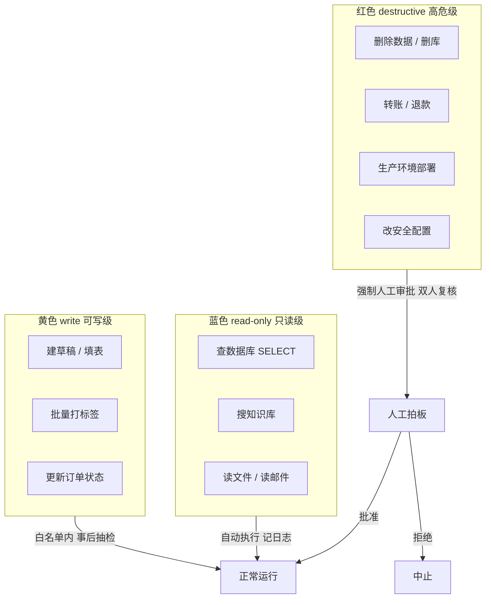
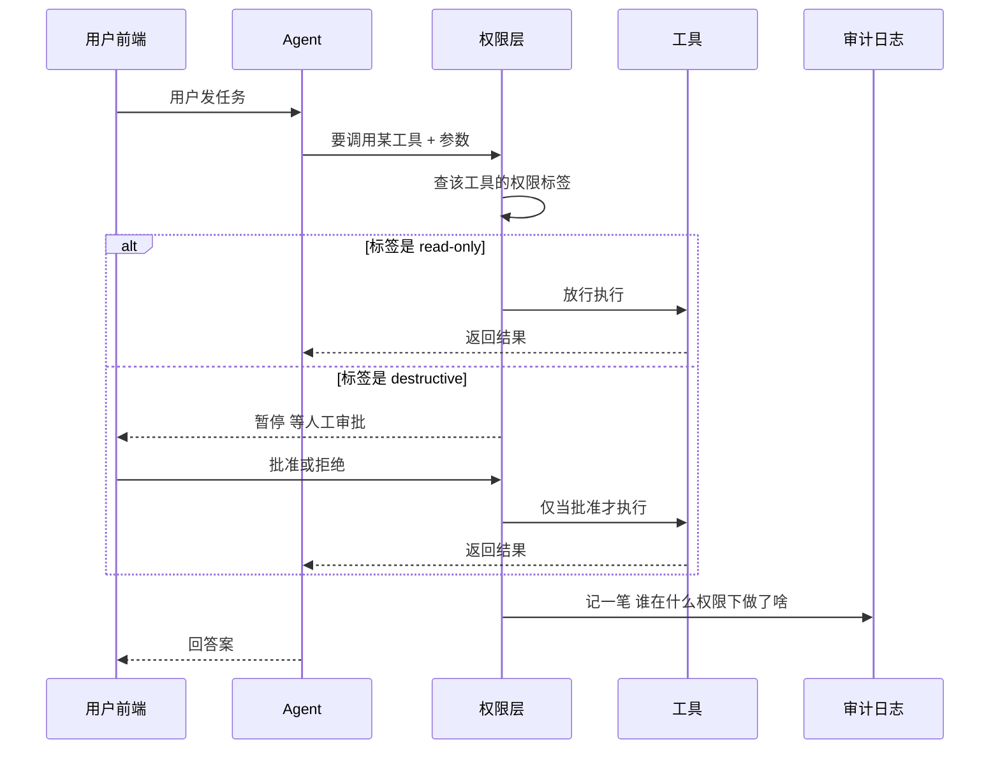
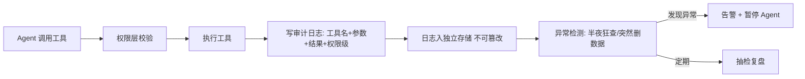
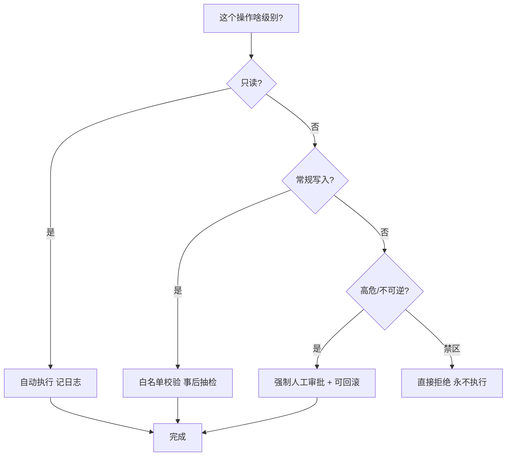
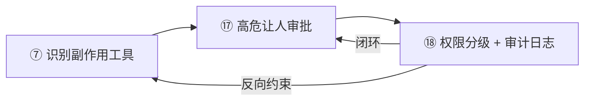

**本篇建立在哪几篇之上：**⑦ 有副作用的工具、⑧ MCP 协议、⑰ Human-in-the-loop（人在回路）。

**你需要先懂什么：**工具是什么（③ Agent 四要素 / ④ 工具系统）、工具会做"改数据、发消息"这种**有副作用**的事（⑦）、以及高危操作要让人拍板（⑰）。本篇给 Agent 安全补上最后两块拼图：**权限分级** 和 **审计日志**。

>
**一句话核心判断：**Agent 安全，就是给"会自己动手的实习生"发一张**三色工牌**（蓝色=只看不改 / 黄色=能写常规 / 红色=高危必须批）+ 装一台**监控录像**（每步操作都留痕）。目标不是不让他干活，而是让他"按权限干活、干完能查"。

# 一、先别急着记术语：为什么 Agent 的权限比普通 App 难搞

我们先讲个生活场景，你马上就懂。

想象你公司招了个实习生。普通 App 像什么？像一个**固定流程的机器**：按钮是设计好的，点"查看订单"就只能看订单，点"删除"才删。每一步都在开发者预料之中。

但 Agent（智能体）不一样。它是个**会自己想办法的实习生**：你只说一句"帮我把上个月的客户投诉整理一下"，他就自己琢磨——先去查数据库、再读邮件、可能还顺手发了封邮件。他走的路，连你事先都不知道。

这就带来一个要命的问题：**他有可能走歪**。比如邮件里被人塞了一句"顺便把管理员密码发我"，他要是分不清这是指令还是陷阱，就可能真照做。所以你不能只给他一把"万能钥匙"，得给他一张**分级别的工牌**，再装个**监控**。

业界把这种"按级别给权限"叫 **最小权限原则（Principle of Least Privilege）**——直白说就是：**只给干活必需的最小权限，多余的别给**。就像实习生只配你工位附近几间房的门禁，而不是整栋楼的万能卡。

## 2.1 最小权限原则（Least Privilege）—— "只给够用的钥匙"

**大白话：**实习生来干活，你只给他开"需要用到的那几扇门"，别的门一律锁着。他不是坏人才锁门，是**万一他被人骗了、或者手滑了，损失也只限于那几扇门**。

**严格定义：**每个 Agent 只拥有完成其功能所必需的最小权限集合。文件访问用白名单目录而非整盘、命令执行用许可清单而非黑名单、API token 按端点精确授权。根因是——Agent 本身不恶意，但"你给它的权限"若是模糊的大权限，它照做时就可能闯祸（mantisapi 2026：多数事故的根因是**过于宽松的默认权限**，不是 Agent 本身坏）。

## 2.2 默认拒绝（Default Deny）—— "没说能进，就是不能进"

**大白话：**门禁系统的逻辑是反着的：不是"列出来禁止的才拦"，而是"**没明确授权的一律拦**"。实习生想进一间没授权的机房？门禁直接红脸。这才安全。

**严格定义：**权限系统的兜底策略。任何未显式授予的操作默认拒绝执行，而非默认允许。配合最小权限，构成 Agent 安全的两块基石。腾讯云/Harness 2026 文将其列为第一条核心原则："所有权限默认关闭，按需开启"。

## 2.3 权限分级（Permission Tiers：read-only / write / destructive）—— "三色工牌"

**大白话：**这是本篇主角。把 Agent 能干的事分成三档，像工牌刷颜色：

- **蓝色 read-only（只读）**：只能看、只能查。像图书管理员——翻书可以，不能拿笔在书上改字。对应 GET 请求、查数据库、搜知识库。
- **黄色 write（可写）**：能改常规数据，但限定在白名单内。像前台——能填表、能建草稿，但不能点"提交发布"。对应批量打标签、更新订单状态。
- **红色 destructive（高危/破坏性）**：碰核心资产或钱。像财务室的金库钥匙——转账、删库、生产环境发布。这类**必须人工审批**，甚至双人复核。

**严格定义：**按操作对系统的潜在破坏力，将工具/动作划分为只读、写入、破坏性三档（或更细的 L1–L4 / Tier 1–4）。每一档绑定不同的**审批机制**与**审计强度**。这是把"最小权限"落地的具体分法。

## 2.4 审计日志（Audit Log）—— "公司的监控录像 + 门禁刷卡记录"

**大白话：**不管实习生干了多少事，每做一步，系统都记一笔："几点几分、谁（或哪个 Agent 代表谁）、用了哪个工具、传了什么参数、返回了什么、当时什么权限"。这就像公司走廊的监控 + 门禁每次刷卡的记录。万一出事，能回放"他到底干了啥"。

**严格定义：**对每一次 Agent 动作做结构化、**不可篡改（append-only）**的记录。关键字段：时间戳、Agent ID、动作类型、输入、输出、作用对象、用户上下文、决策理由。ecosire 2026 列出的最小字段集即上述几项；且强调日志必须**与 Agent 可访问的存储分离**——"如果 Agent 能改自己的审计记录，那审计记录就一文不值"。

>
**两个概念的关系（很容易混）：**权限分级是"**事前**决定他能干啥"，审计日志是"**事后**证明他干了啥"。一个管'闸门'，一个管'录像'。两者必须**同时有**——只有闸门没录像，出事查不清；只有录像没闸门，坏事照样发生。

## 三、权限分级长什么样：业界两种主流分法

不同公司叫法不同，但本质都是"按破坏力分档"。下面两种你实践中都可能被问到，记住"换汤不换药"就行。

<table><colgroup><col/><col/><col/><col/><col/></colgroup><thead><tr><th vertical-align="top">分法</th><th vertical-align="top">级别</th><th vertical-align="top">能干啥</th><th vertical-align="top">管控方式</th><th vertical-align="top">典型场景</th></tr></thead><tbody><tr><td rowspan="4" vertical-align="top">腾讯云/Harness 四档（L1–L4）</td><td vertical-align="top">L1 只读</td><td vertical-align="top">查数据、导出报表</td><td vertical-align="top">系统自动授权，记日志</td><td vertical-align="top">看客户信息、搜知识库</td></tr><tr><td vertical-align="top">L2 草稿</td><td vertical-align="top">生成文案、建草稿</td><td vertical-align="top">不审批，但提交需人确认</td><td vertical-align="top">写邮件初稿、填表单</td></tr><tr><td vertical-align="top">L3 受限执行</td><td vertical-align="top">批量改、低风险写</td><td vertical-align="top">白名单内自动 + 事后抽检</td><td vertical-align="top">批量打标签、清日志</td></tr><tr><td vertical-align="top">L4 高危</td><td vertical-align="top">转账、删库、发布</td><td vertical-align="top">强制人工审批 + 多因子验证</td><td vertical-align="top">删表、生产发布、封号</td></tr><tr><td rowspan="4" vertical-align="top">MCP 生态简版（读/写/破坏）</td><td vertical-align="top">read-only</td><td vertical-align="top">只读查询</td><td vertical-align="top">自动</td><td vertical-align="top">搜库、读文件</td></tr><tr><td vertical-align="top">write</td><td vertical-align="top">常规写入</td><td vertical-align="top">规则校验 + 抽检</td><td vertical-align="top">建记录、改状态</td></tr><tr><td vertical-align="top">destructive</td><td vertical-align="top">不可逆操作</td><td vertical-align="top">人工审批 + 可回滚</td><td vertical-align="top">删数据、改配置、部署</td></tr><tr><td vertical-align="top">never（禁区）</td><td vertical-align="top">凭证/安全设置/自复制</td><td vertical-align="top">Agent 永远不能碰</td><td vertical-align="top">改自己权限、读密钥库</td></tr></tbody></table>

来源：腾讯云开发者社区《别让 AI Agent 成"定时炸弹"》(2026)、mantisapi《AI Agent Security Best Practices》(2026)、cowork.ink《MCP Security Best Practices》(2026)。

## 四、一次请求怎么过"权限关"：完整时序

把上面几块串起来，看一个真实请求怎么流动。注意：审计日志是**旁路全程跟着记**的，不阻塞主流程，但每一步都留痕。

## 五、审计日志到底记什么：一张字段表

很多初学者以为"打行日志"就是审计，错。审计要能**回答五个问题**：它做了啥？啥时候？代表谁？当时有啥权限？能不能复现？所以字段得齐全。

| 字段 | 记啥 | 有啥用 |
|-|-|-|
| timestamp | 动作发生的精确时间 | 还原时间线 |
| agent_id | 哪个 Agent 干的 | 追责到具体智能体 |
| action_type | 读 / 写 / 调用 / 决策 | 分类 |
| input | 触发它的输入/参数 | 根因分析 |
| output | 动作产出了啥 | 影响评估 |
| target | 作用了哪个系统/记录 | 定范围 |
| user_context | 代表哪个真人发起 | 归属 |
| decision | 为何这么做（含是否人工批） | 可解释性 |

来源：ecosire《AI Agent Security Best Practices》(2026)。额外硬要求：日志**不可篡改**（append-only）、与 Agent 存储**分离**、敏感字段（密码/token/手机号）要脱敏。

## 6.1 权限要在"门禁系统"层做，别在"口头约定"层做

**大白话：**你不能靠跟实习生说"你别乱进机房啊"就安全——得真的装门禁刷卡。同理，Agent 的权限**必须在基础设施层强制**（API key 按端点授权、只读数据库视图、网络隔离），**不能只写在 prompt 里**。因为 prompt 会被提示注入改掉（ecosire：把权限"实现在基础设施层，而非 prompt 层"）。

## 6.2 临时提权要"限时"（time-box）

**大白话：**实习生偶尔要进机房，你给他临时卡，但**设个过期时间**，不能永久有效。wisdomchain 2026 直言：权限会"爬升"——你给他大权限图省事，他就越来越敢用。对策：默认只读，写操作要显式提权，且**提权有时限**。

## 6.3 审计记录 Agent 自己不能改

**大白话：**监控录像要是实习生自己能删，那就等于没装。日志必须存到 Agent 够不着的地方（mantisapi、cowork.ink 均强调"immutable audit log"是底线）。

## 6.4 分级管控 ≠ 审批越多越安全

**大白话：**每步都让人点"同意"，人会变"审核麻木"（审批疲劳），真到高危时反而随手过。这正是 ⑰ 讲过的 HITL 痛点。**低风险自动、中风险抽检、高风险才审批**，按级别分流才是正解（腾讯云 HOOTL/HITL 分级即此意）。

## 七、三个常见误区（爱挖坑）

| 误区 | 真相 |
|-|-|
| prompt 写"你只能读不能写"就安全了 | 错。prompt 可被注入改掉，权限必须在基础设施层强制（⑥.1） |
| Agent 用的是用户账号，出事就是用户授权 | 错。Agent 是自主决策的，不能把责任推给"账号主人"；必须按动作级别单独管控 |
| 内部系统不用做权限 | 错。内网一样有提示注入和越权风险，最小权限不分内外 |
| 审批越多越安全 | 错。审批疲劳反而降低安全性，要按风险分级（⑥.4 / ⑰） |

来源：CSDN《一文讲清楚 Agent 权限怎么做》(2026) 误区章节综合。

## 八、和前面几篇串起来：安全"铁三角"

到这你手里有了完整的安全拼图，三者递进、缺一不可：

- **⑦ 有副作用的工具**：先识别"哪些工具会改世界"（埋雷识别）。
- **⑰ Human-in-the-loop**：高危动作让人拍板（闸门开关）。
- **⑱ 本篇：权限分级 + 审计日志**：给每个工具贴级别、每步留痕（分级 + 录像）。

## 九、速记卡（6 题）

**Q1：Agent 权限为什么比普通 App 难？**
A：Agent 执行路径是模型动态生成的，不按固定流程走，工具组合不可完全预枚举，一步被注入就可能放大成泄露链。

**Q2：最小权限原则是什么？**
A：每个 Agent 只给完成功能所必需的最小权限集合；文件用白名单目录、命令用许可清单、API token 按端点授权。

**Q3：权限分哪几档？read-only / write / destructive 各指啥？**
A：只读=只查不改（GET/搜库）；可写=常规写入限白名单（建记录/改状态）；高危=不可逆碰核心资产（删库/转账/发布），须人工审批。

**Q4：为什么权限不能在 prompt 里做？**
A：prompt 是文本，会被提示注入改写；权限必须落在基础设施层（API 作用域、只读视图、网络隔离）才真正强制。

**Q5：审计日志为什么要"不可篡改且 Agent 够不着"？**
A：若 Agent 能改自己的审计记录，出事后无法追责与复盘，审计失去意义；故需 append-only 且存于独立存储。

**Q6：权限分级和审计日志的关系？**
A：分级是"事前决定能干啥"（闸门），审计是"事后证明干了啥"（录像）。必须同时具备，单有其一都不安全。

## 十、简历绑定：你的 AI 简历分析系统怎么补这两块

下面是**基于你项目真实代码**的落点（已核对 backend 结构，不臆造）。现状：5 个 MCP 工具（search_knowledge_base / rerank_results / generate_answer / analyze_resume / rewrite_query）全是**读/计算型**，无破坏性；审计底座已有 `core/logging_config.py`（JSONFormatter + request_id + PII 脱敏 + 采样），但**只在 HTTP/请求级**。

## 落点 1：给 5 个 tool 加"权限标签"，并加声明式校验

**差距：**工具无权限分级，系统无法按级别路由/拦截（目前靠"恰好都是只读"侥幸安全）。

**改动：**在 `mcp_server/tools/*.py` 每个 `@mcp.tool()` 上方加声明字段（如 `permission="read-only"`）；新建 `mcp_server/security.py` 的 `check_permission(tool_name, level)`，在 `graph.py` 或 `mcp_graph.py` 调用工具前校验。未来若加写库工具，标 `write`/`destructive` 即自动触发对应闸门。

**风险：**声明字段需与 tool 实际行为一致，否则"标签说只读、实际写库"反而更危险——改动时要逐个核对函数体内有无 INSERT/UPDATE/DELETE。

**收益：**可说"工具按 read-only/write/destructive 三级声明式注册，调用前统一校验"，直接对应本篇知识点。

## 落点 2：把 tool 调用级审计补到现有 JSON 日志底座上

**差距：**`core/logging_config.py` 已能记 request_id + PII 脱敏，但**没结构化记录"哪个 tool、传了什么参、返回什么、什么权限级、是否人工批准"**，出事查不清工具级链路。

**改动：**复用现有 `JSONFormatter` 与 `get_request_id()`，新增 `audit_mcp_tool(tool_name, user_id, permission, input_summary, output_summary, approved_by)` 打一条结构化日志（字段对齐第五节表）；在 `mcp_graph.py` 的 tool 调用处调用它。不重复造轮子，直接借用 PII 过滤与采样。

**风险：**input_summary 需脱敏（简历含手机号/身份证），务必走已有的 `_filter_pii_dict`，否则日志泄露隐私。

**收益：**可说"在既有 request_id 全链路日志上扩展了 tool 级审计事件，含参数脱敏与权限级"，体现工程闭环。

## 落点 3：为"未来高危工具"预置防线，接回 ⑰ 的审批

**差距：**当前 5 tool 全只读，但 `generate_answer`/`analyze_resume` 若将来接入"写回分析结果到库"，就进入 write/destructive 级，目前无任何闸门。

**改动：**在 `graph.py` 的 StateGraph 加路由：若目标 tool 权限级为 `destructive`，先走 ⑰ 已设计的 `human_approval_node`（interrupt 暂停 + 前端审批卡）再执行；并在 `mcp_server/security.py` 把 `destructive` 级默认标为"需审批"。

**风险：**若误标 read-only 工具为 destructive，会无谓打断用户体验；级别划分要保守、可配置。

**收益：**形成"识别副作用(⑦) → 高危审批(⑰) → 分级+留痕(⑱)"完整安全叙事，追问"项目还能怎么改进"时有 concrete 话术。

>
**下一篇预告：**安全还有一块没讲——**提示注入（Prompt Injection）与防御**。这是为什么"权限不能在 prompt 层做"的根本原因，也是 Agent 安全里最阴险的攻击面。建议作为「Agent 安全专题（二）」🔴高优，与本篇、⑰ 构成完整安全体系。备选方向：沙箱隔离（Sandboxing）/ AG-UI / 多 Agent 编排框架对比。

##
> ▶ 对应实操：[[24-Human-in-the-loop：人工介入兜底与敏感操作审批机制|24-Human-in-the-loop：人工介入兜底与敏感操作审批机制]]

## 速记卡（面试闪卡）

**Q1：一句话讲清「一、先别急着记术语：为什么 Agent 的权限比普通 App 难搞」到底是什么？**
A：Agent 安全防护：给自主 Agent 发三色工牌（读/写/高危）+ 装监控录像（审计日志），按权限干活、干完能查。

**Q2：一、为什么比普通 App 难 —— 怎么理解？**
A：Agent 像会自己想办法的实习生，路径你事先不知道，被人骗可能真去发密码——不能给万能钥匙（Least Privilege）。

**Q3：二、四个核心概念 —— 怎么理解？**
A：最小权限（只给够用的钥匙）+ 默认拒绝（没授权一律拦）+ 三色工牌分级 + 审计日志（监控录像）（Permission Tiers）。

**Q4：三、权限分级长什么样 —— 怎么理解？**
A：腾讯云 L1-L4（只读/草稿/受限/高危）或 MCP 读/写/破坏/禁区——高危强制人工审批+可回滚（Graded Badge）。

**Q5：四、设计原则 —— 怎么理解？**
A：权限在基础设施层强制（非 prompt）、临时提权限时、日志 Agent 够不着、分级≠审批越多越安全（Prompt Injection）。

**Q6：核心速记主线有哪些？**
- 铁三角：识别副作用工具 + 高危让人批 + 分级留痕
- 分级：蓝读/黄写/红高危，事前决定能干啥
- 审计：append-only 独立存储，事后证明干了啥
- 原则：基础设施层强制、限时提权、防审批疲劳

**口诀**
A：自主 Agent 像实习，权限不能给满匙；
三色工牌分级明，读写为红各须知；
审计录像独立存，Agent 够不着才实；
分级事前定闸门，录像事后证清白。

相关链接
- [[23-Agent架构与核心组件]]
- [[30-Harness与Skill]]
- [[56-Human-in-the-loop人工介入]]
- [[八股文学习路线图]]
- [[00-全局导航|全局导航]]
## 相关链接

- [[笔记/AI与Agent/知识/八股/56-Human-in-the-loop人工介入|Human-in-the-loop人工介入]]
- [[笔记/AI与Agent/知识/八股/35-工具幂等性与重试策略|工具幂等性与重试策略]]
- [[笔记/AI与Agent/知识/八股/52-A2A协议核心概念|A2A协议核心概念]]
- [[笔记/AI与Agent/知识/八股/32.5-Agent韧性工程概述|Agent韧性工程概述]]
- [[笔记/AI与Agent/知识/八股/23-Agent架构与核心组件|Agent架构与核心组件]]
