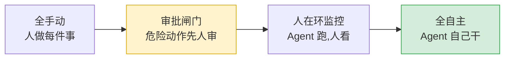
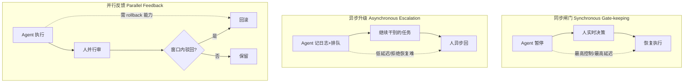
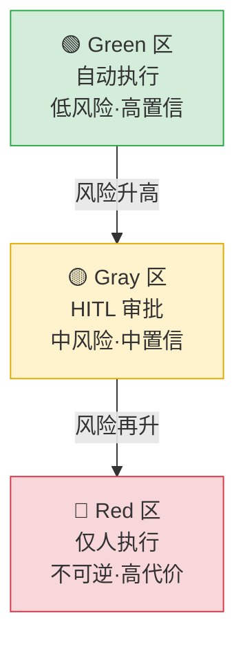
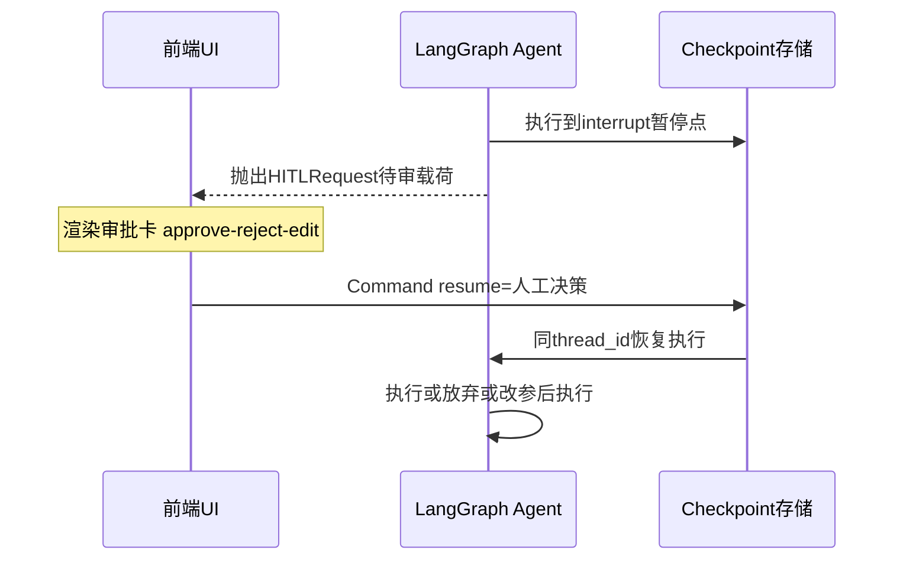
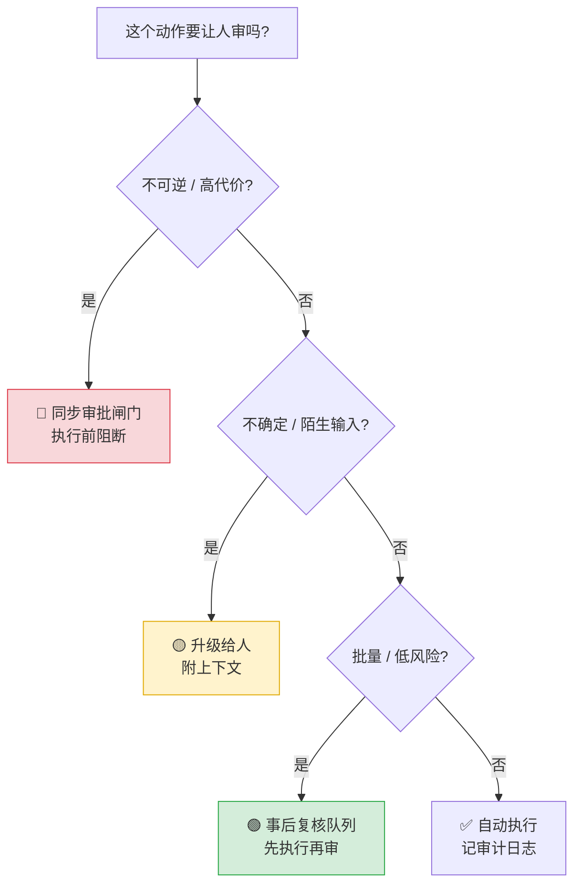
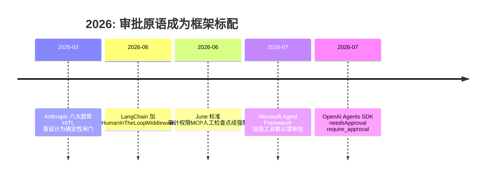

# 写在前面：本篇站在哪几篇的肩膀上

本篇是「Agent 安全闭环」收口的关键一环，建立在下面几篇之上：

- **③ Agent 四要素**——你已经知道 Agent 是个「LLM 循环调工具」的自动机（规划→调工具→看结果→再循环）。
- **④ 工具系统**——工具分「只读」和「会改世界」两类。
- **⑦ 有副作用的工具**——你已经知道有些工具（删库、发邮件、转账）一旦执行就收不回。
- **⑧ MCP 协议**——工具是通过 MCP 这类协议接进 Agent 的，意味着「工具来源」本身可能不可信。

**本篇要补的拼图**：前面讲了「Agent 会自己循环」「有些工具很危险」，但还没讲——**怎么在危险发生之前把车刹住**。这就是 Human-in-the-loop（人在回路，简称 HITL）。

> 
**核心判断（一句话）**：HITL 不是把 Agent 关掉变回人肉工具，而是给自动机装一个**可控的刹车 + 方向盘**——平时它自己跑，遇到危险/不确定的事先让你点个头，或出问题了交给你兜底。2026 年的共识是：生产级 Agent 几乎必须有人兜底，否则一次幻觉就是一次事故。

# 一、先用大白话讲清：HITL 到底是什么

**生活化类比**：把你的 Agent 想象成一个**刚拿驾照、能力很强但容易上头的实习生**。它能帮你查资料、写报告、甚至下单，但你不会让它第一次就独立去「给全公司发邮件」或「删生产数据库」——你会在它干这些危险事前，先瞄一眼、点个「准」。HITL（Human-in-the-loop，人在回路）就是这套「让人在关键节点进回路把关」的机制。

更精确一点：HITL 是**在 Agent 自动执行流程里，预设几个「暂停点」**，到了这些点就停下来等人类决策（批准 / 拒绝 / 改一改 / 直接回答），人类给完信号，Agent 再从原地接着跑。它把「要不要让人把关」从「写在 prompt 里求它别忘了」升级成**框架级别的硬性原语**。

## 为什么这件事 2026 年突然成了刚需

三个递进的理由，从「常识」到「被迫」：

1. **不可逆操作收不回**：删库、清数据、发邮件、执行转账——出了事没法回滚，而 Agent 在推理时并不知道「这个参数填错了」意味着什么后果（呼应 ⑦ 有副作用的工具）。
2. **LLM 的判断不总是对的**：工具调用参数不总是符合预期，你的感知往往是「事后报警」才来的。
3. **2026 年的「供应链攻击」逼出审批闸门**：2026 上半年多项研究发现，公开技能/MCP 市场里约 **25%–33%** 的技能带 prompt injection（提示注入）载荷（Snyk ToxicSkills、dreaming.press 2026-07 综述）。关键点在于：**一个技能的恶意载荷常常不是代码，而是一句话指令**——它让模型以 Agent 的全部权限去执行。沙箱能关住「进程」，但关不住「一句在模型脑子里执行的指令」。审批闸门不试图让技能变安全，而是**拦住它想触达的那个动作**，这是沙箱做不到的。



上面是「自治谱（autonomy spectrum）」：从左到右，人类参与越来越少。绝大多数生产 Agent 应该待在**中间偏右**——低风险自己跑，高风险先人审，而不是两端极端。

# 二、先讲清四个基础概念，再展开机制

下面每个概念都先给「大白话 + 直觉类比」，再给严格定义。不假设你已经懂。

## 2.1 中断 / 检查点 / 恢复——LangGraph 的 HITL 三原语

**大白话**：这仨是 LangGraph 实现「暂停等人」的最小积木。

- **中断（interrupt）**：类比「打印机卡纸，亮灯等你处理」。Agent 跑到某个节点，主动 yield 控制权，把「待审信息」抛给调用方，自己停住。
- **检查点（checkpoint）**：类比「游戏存档」。暂停那一刻，把整个图的状态（对话、变量、走到哪了）全盘落盘。所以你刷新页面、换个人审批，Agent 都能从**原处**续上，而不是从头重跑。
- **恢复（resume）**：类比「读完存档接着玩」。人给完决策，用 `Command(resume=...)` 把信号喂回同一个 thread（对话线程），Agent 从暂停点继续。

**严格定义**：在 LangGraph 中，`interrupt()` 是显式暂停点原语，触发时把 HITLRequest 抛给客户端；Checkpoint 由 checkpointer（MemorySaver / Postgres / Redis）在中断点保存完整 graph state；`Command(resume=value)` 在同 `thread_id` 下恢复执行。三者不是 workaround，而是**一等架构原语**（niteagent.com 2026）。

## 2.2 审批闸门（Approval Gate）

**大白话**：类比「公司财务章」——凡是要盖章的动作（付款、删库、发对外邮件），必须经过这道关，人点头才生效。

**严格定义**：在 Agent 执行**特定（通常是不可逆/高代价）工具调用前**，暂停并等待人类显式批准才执行的控制点。与之相对的是「事后复核队列」（先执行再给人看），闸门是**执行前阻断**。

## 2.3 升级（Escalation）

**大白话**：类比「客服搞不定的单子转给主管」。Agent 自己没把握、卡住、或遇到陌生情况时，不硬猜，而是把问题连同上下文打包交给人。

**严格定义**：当 Agent 置信度低于阈值、重试多次、或遇到分布外输入时，将任务或决策权转交人类 reviewer 的模式（waxell.ai 2026）。与闸门区别：闸门是「动作可逆性」触发，升级是「不确定性/能力边界」触发。

## 2.4 SA-ROC 三区（Safe / Gray / Red）

**大白话**：把 Agent 所有可能干的事，按「危险程度」分三个抽屉：  
🟢 **绿区**：低风险高置信，让它自己跑（如内部排程、查公开资料）；  
🟡 **灰区**：中风险中置信，必须人审（如起草对外邮件、调整订单）；  
🔴 **红区**：不可逆高代价，「执行按钮」根本不交给 AI（如最终临床诊断、大额转账），只由人操作（agixtech.com 2026）。

**严格定义**：SA-ROC（Safe-Action / Risk-Observation / Critical-Control）框架把 Agent 行为按风险分桶，自治度是**连续谱而非黑白二元**，灰区是 HITL 设计最关键的战场。



三种架构模式（waxell.ai 2026），各自权衡不同：

| 模式 | 什么时候用 | 代价 |
|-|-|-|
| 同步闸门 | 不可逆、代价高的动作（删库/转账） | 延迟最高；依赖 reviewer 在线 |
| 异步升级 | 中风险、可并行的决策 | 拒绝后的恢复路径要预先设计 |
| 并行反馈 | 低风险常规操作 + 异常触发 | 必须动作可回滚，否则别用 |

现实里多数系统用**混合**：不可逆动作走同步闸门，中等风险走异步，常规走并行反馈 + 异常触发。



# 三、LangGraph 的中断-恢复是怎么跑起来的

先看整体时序，再拆四种决策类型。这是常见点。



LangChain 官方 HITL 文档（docs.langchain.com 2026）定义四种决策类型，前端审批卡就是按它们渲染按钮的：

| 决策 | 含义 | 工具是否执行 |
|-|-|-|
| approve 批准 | 按原样执行 | 是 |
| reject 拒绝 | 不执行，附原因反馈给 Agent | 否 |
| edit 修改 | 人改了参数再执行 | 是（用改后参数） |
| respond 回答 | 人直接给结果，工具本身不执行 | 否（人话当工具结果） |

> 
**骨架级示意（非生产代码，只给「感觉」）**：
```python
def approval_node(state):
    decision = interrupt({"action": state["pending_action"]})  # 暂停,等人
    if decision["approved"]:
        return Command(goto="execute")   # 恢复后走执行
    return Command(goto="reject")         # 否则走拒绝分支
# 恢复: agent.invoke(Command(resume={"approved": True}), config)

```
核心就三样：`interrupt()` 抛、`Command(goto=...)` 分流、`Command(resume=...)` 续命。checkpointer 负责存盘。

# 四、生产级 HITL 的五件事（不止「加个审批按钮」）

光加一个 approve 按钮是远远不够的。2026 年的工程实践把 HITL 拆成「5 大模式 + 设计原则」。

## 4.1 五个生产模式（aimadetools.com / opennash.com 2026）

1. **审批闸门（Approval Gates）**：特定动作（deploy / delete / send_email / 改库）执行前必审。
2. **置信度阈值（Confidence Thresholds）**：高置信自动跑，低置信暂停给人。适合写代码类 Agent（格式化高置信、架构决策低置信）。
3. **升级流（Escalation Flows）**：Agent 卡住 / 遇陌生输入时转交人，而非硬猜。
4. **事后复核（Review Queues）**：低风险动作先执行，全部进队列等人定期审。高吞吐、低实时控制。
5. **渐进授权（Staged / Graduated Autonomy）**：新能力先「全审批」，数据证明可靠后「毕业」到自主；出问题再降回审批（像带新人：先盯后放）。

## 4.2 三个不能省的设计原则

- **防审批疲劳（Approval Fatigue）**：一天弹 200 个审批请求，等于制造「 Liability 生成器」（waxell.ai）。人会默认点同意，闸门变成假安全感。**解法**：按工具类别 + 参数检查来 Gate（删 workspace 外的路径才拦，读文件直接放），把信任从「包」移到「具体这次调用」；只给 reviewer 看「要决定的动作 + 置信度 + 触发信号」，别甩 40 行上下文。
- **分级路由（Tiered Routing）**：审批按动作类别和 reviewer 专长分派——财务合规官和后端工程师不是可以互换的「人」。
- **审计轨迹（Audit Trail）**：每一次升级、每一个决策、谁审的，从第一天就落日志。用途：① 合规（EU AI Act 第 14 条要求记录「谁、何时、为何」决策，thehandover.xyz 2026）；② 校准——批准率 >90% 说明闸门太宽，<70% 太窄。

> 
**超时与 SLA 必须设计**：如果 4 小时 / 24 小时没人响应怎么办？生产级 HITL 要有超时策略（自动拒绝 / 升级到另一人 / 保留待审）。OpenAI Agents SDK 实战里，团队常因漏掉「通知 + 超时 + 审计」这三块基础设施，部署后才发现审批人根本不知道 Agent 在等他（thehandover.xyz）。



# 五、2026 大事件：三大框架统一了「先人审」原语

这不是某家的一家之言。2026 上半年，最大的三个 Agent 框架**不约而同**把「工具调用前可暂停交人审批」做成了标配原语（dreaming.press 2026-07-07 综述）：

| 框架 | 审批 API | 默认姿态 |
|-|-|-|
| Microsoft Agent Framework | 工具审批中间件 | 技能提供方带来的工具**默认需审批** |
| LangChain / LangGraph | HumanInTheLoopMiddleware（interrupt_on 映射） | 默认关，按工具开 |
| OpenAI Agents SDK | needsApproval（本地工具）/ require_approval（MCP 服务器） | 按工具/MCP 逐个开 |

**为什么是现在**：根因是技能 / MCP 供应链的 prompt injection（25%–33% 带毒）。沙箱拦不住「一句指令」，审批闸门直接拦「动作」——这是 2026 安全范式的关键转向。Anthropic 也把「**MCP 协议级 HITL 标准化**」列进 2026 路线图（sdd.sh 2026-03 八大趋势）。



# 六、三个常见误区（别踩）

- **误区 1：HITL 就是「Agent 变笨、人全包」**——错。它是自治谱中间的**可控点**，目标是 95% 自动、5% 高危才停（agixtech 2026）。全审批的 Agent 只是「带多余步骤的建议引擎」。
- **误区 2：在 prompt 里写「请先确认再操作」就够了**——错。那是隐式约定，LLM 会忘、会被注入绕过。必须上升为 SDK/协议级显式原语（neodrop.ai）。
- **误区 3：闸门越严越安全**——错。 blanket approval 会养出审批疲劳，闸门退化成点头机器，反而最危险。要按工具类别 + 参数精细 Gate（dreaming.press）。

# 七、速记卡（6 题高频）

1. **Q：什么是 Human-in-the-loop？为什么 Agent 需要它？**  
A：在 Agent 自动流程里预设暂停点，危险/不确定动作先等人决策。需要它是因为不可逆操作收不回、LLM 不总对、且 2026 技能供应链 25–33% 带注入，审批闸门是拦「动作」而非拦「代码」，沙箱做不到。
2. **Q：LangGraph 怎么实现 HITL？**  
A：三原语——interrupt 暂停抛 HITLRequest、Checkpoint 落盘状态、Command(resume=决策) 同 thread 恢复。四种决策：approve / reject / edit / respond。
3. **Q：审批闸门 vs 升级 vs 事后复核 区别？**  
A：闸门是「执行前阻断不可逆动作」；升级是「不确定/卡住时转交人」；复核是「先执行低风险动作再批量给人看」。分别买「实时控制 / 不确定性兜底 / 高吞吐」。
4. **Q：怎么避免审批疲劳？**  
A：按工具类别 + 调用参数精细 Gate（不是 blanket），只给 reviewer 关键决策信息，分级路由，配审计轨迹校准阈值。
5. **Q：2026 年框架在 HITL 上有什么共识？**  
A：LangChain / Microsoft / OpenAI 三大框架统一了「工具调用前可暂停交人审批」原语；MCP 协议级 HITL 标准化也被列入路线图。根因是技能/MCP 供应链 prompt injection。
6. **Q：如果没人审批怎么办？**  
A：必须设计超时/SLA——自动拒绝、升级他人、或保留待审。生产级还缺「通知 + 超时 + 审计」三块基础设施，否则审批人根本不知道在等他。

# 八、📎 简历项目绑定：你的 AI 简历分析系统还能怎么加 HITL

先说**诚实的现状差距**：你的项目（`D:\Project\ai-resume-analyzer`）目前是**单 Agent + MCP 垂直集成，零人工审批 gate**。具体看：

- `backend/services/agentic_rag/graph.py`：LangGraph StateGraph（9 节点 + 3 条件边 + Reflexion ≤2 轮 + MemorySaver checkpoint）——**已有 checkpoint 底座，但没有任何 interrupt 节点**。
- `backend/mcp_server/tools/`：`search / rerank / generate / analyze / rewrite` 五个工具，全为**读/计算型，无破坏性副作用**——所以当前确实「暂时不需要」闸门。
- `graph.py` 拒答逻辑：`rerank_score < 0.3` 时**硬拒绝**，没有「升级人工」的兜底路径，用户体验是断崖式「我答不了」。
- 前端（React + SSE 流式）无任何审批 UI 组件。

下面是三个**具体、可落地、贴合你真实代码**的改进点，追问「你项目还能怎么改进」时可直接用：

## 改进点 1：加 HITL 审批节点，为「未来副作用工具」兜底

**加什么 / 改什么**：在 `graph.py` 的 StateGraph 里新增 `human_approval_node`，对 `state.pending_risky_action` 调 `interrupt()` 暂停；前端收到 HITLRequest 后渲染审批卡（approve/reject/edit）。后端用 `Command(resume=...)` 恢复。

**为什么**：你现在五个工具都是只读，但一旦要加「导出报告 / 发送邮件 / 删除简历」这类动作，就必须有闸门，否则一次幻觉就真删了。

**风险**：interrupt 必须配持久化 checkpointer——你现在是 MemorySaver（内存），**生产应换 Postgres/Redis**；且 resume 必须带同一 `thread_id`。

**预期收益**：未来加副作用工具时天然合规、可审计，且复用你已有的 checkpoint 底座，改动小。

## 改进点 2：把「硬拒答」升级为「人工兜底」分支

**加什么 / 改什么**：改 `graph.py` 里 `rerank_score < 0.3` 的拒答路径——不再直接拒，而是进入 `human_review_node`，把「问题 + 检索到的片段 + 低置信度提示」推给前端，由人工补答或确认拒答。

**为什么**：当前硬拒答体验差、回答覆盖率有损失；「exception-based escalation」（异常才升级，Anthropic 趋势 4）是 2026 最佳实践。

**风险**：增加延迟；需设计超时（如 24h 无响应则自动拒绝），避免任务卡死。

**预期收益**：挽回本可被拒答丢掉的疑难问题，提升覆盖率，且正好呼应你项目已有的「防幻觉三层 + 拒答阈值」设计，实践中能讲成「从硬拒答演进到人工兜底」的完整故事。

## 改进点 3：把审批做成 MCP 「human tool」+ 补审计轨迹

**加什么 / 改什么**：在 `backend/mcp_server/tools/` 新增 `request_human_review.py` 工具；在 `mcp_graph.py` / `mcp_nodes.py` 的调用链里，把「需要人判断」封装成一个 MCP 工具，Agent 像调其它 tool 一样调它（human-as-tool 模式）。同时，在你已有的**结构化 JSON 日志 + X-Request-ID 全链路**底座上，补 HITL 审计字段（approver / decision / reason / timestamp）。

**为什么**：① 复用现有 MCP Client 调用链，改动最小；② 满足 EU AI Act 第 14 条对「谁、何时、为何决策」的强制记录；③ 贴合你已建的 JWT + 限流 + 链路追踪工程化底座，一句话讲清连贯。

**风险**：前端需加审批组件；审计表要落库（MySQL 你已有）。

**预期收益**：把「人工兜底」变成项目一等公民，且审计轨迹能反向校准你的拒答阈值（批准率 >90% 说明阈值太宽），形成数据飞轮。

> 
**一句话总结**：「我项目现在五个 MCP 工具都是读/计算型，所以还没上 HITL；但架构上已有 LangGraph checkpoint 底座，我设计的三步演进是——① 加 interrupt 审批节点兜未来副作用工具，② 把硬拒答升级成人工兜底分支，③ 把审批封装成 MCP human tool 并补审计轨迹。底层用 Postgres checkpointer 保证生产级持久化。」

# 九、下一篇预告

Agent 安全闭环已讲到「人兜底」。下一步可选方向：

- **Agent 安全专题：提示注入（Prompt Injection）与防御**——本篇反复提到的「25–33% 技能带毒」到底怎么回事，怎么防（输入净化 / 权限最小化 / 输出校验）。🔴高优候选。
- **AG-UI：Agent 与用户界面的实时交互协议**——你项目前端用 SSE 流式，AG-UI 是更标准的「Agent↔前端」事件协议，正好接本篇的审批卡渲染。
- **多 Agent 编排框架对比（LangGraph vs CrewAI vs AutoGen）**——把前面 ⑬–⑯ 的协议族落到「怎么选编排框架」。

你定方向，我继续。

---

**资料来源（均标注，搜索于 2026-07-17）**：
LangChain 官方 HITL 文档（docs.langchain.com，2026）；niteagent.com《Building Agentic Workflows with HITL》(2026)；
waxell.ai《Approval Workflows for AI Agents》(2026)；agixtech.com《HITL Enterprise Blueprint / SA-ROC》(2026)；
aimadetools.com《HITL Patterns 2026》；opennash.com《5 Patterns When AI Should Ask Permission》；
cordum.io《HITL 5 Production Patterns》；dreaming.press《Agent Frameworks Now Ask Before They Act》(2026-07-07)；
neodrop.ai《OpenAI Agents SDK HITL #14》；thehandover.xyz《HITL Missing Production Layer / EU AI Act Art.14》；
sdd.sh《Anthropic 8 Agentic Coding Trends》(2026-03)；contextstudios.ai《AI Agents 2026 Guide》(June 2026)。
其中「技能供应链 25–33% 含 prompt injection」「三大框架 2026 统一审批原语」「EU AI Act 第 14 条」均来自上述公开来源；具体 SDK API 名称以各框架官方文档为准。

## 
> ▶ 对应实操：[[24-Human-in-the-loop：人工介入兜底与敏感操作审批机制|24-Human-in-the-loop：人工介入兜底与敏感操作审批机制]]

相关链接
- [[23-Agent架构与核心组件]]
- [[55-Agent安全防护与权限分级]]
- [[30-Harness与Skill]]
- [[八股文学习清单]]
- [[00-全局导航|全局导航]]
