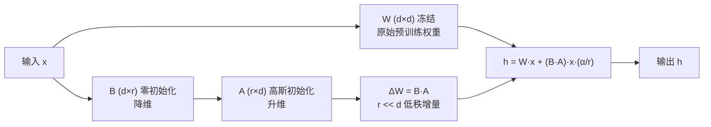

---

title: "LoRA微调"

created: "2026-07-13"

tags:

  - 八股文

  - ai

---

# LoRA微调

> 类比：微调大模型就像给一台成熟的专业相机（已训练好的基础模型）加装一个轻巧的滤镜转接环（LoRA 增量），而不是重新造一台相机。我们只训练这个小小的转接环——既省算力，又能随时换风格、随时拆下。

LoRA（Low-Rank Adaptation，低秩适配）是目前最流行的参数高效微调（PEFT, Parameter-Efficient Fine-Tuning）方法，让普通开发者也能在消费级 GPU 上微调大语言模型。

## 为什么需要 LoRA？
### 全量微调的问题

| 问题 | 说明 |
| ------ | ------ |
| 显存不足 | 7B 模型全量微调需要 ~56GB 显存（FP16 + Adam） |
| 存储开销 | 每个任务保存一份完整模型副本 |
| 训练速度 | 更新所有参数，梯度计算量大 |
| 灾难性遗忘 | 大幅更新参数可能损害模型通用能力 |

### LoRA 的解决方案

**核心思想：** 冻结原始模型权重，只训练低秩分解的增量矩阵。

```text

原始权重 W (d × d)  →  冻结，不更新

增量 ΔW = A × B      →  可训练

  A: (d × r)  随机高斯初始化

  B: (r × d)  零初始化

r << d（如 r=8, d=4096），参数量大幅减少

```

## LoRA 数学原理
### 低秩分解

任何矩阵都可以近似为低秩矩阵的乘积。对于权重矩阵 W ∈ R^(d×d)：

```text

W' = W + ΔW = W + A × B

其中：

  A ∈ R^(d×r)   → 降维矩阵

  B ∈ R^(r×d)   → 升维矩阵

  r 是秩（rank），通常 r ∈ {4, 8, 16, 32, 64}

```

### LoRA 结构示意图



> 训练时只有 A、B 参与梯度更新（可训练参数仅占 0.1%~2%），W 始终冻结；推理时可将 ΔW 合并回 W，不引入额外延迟（Hu et al., LoRA 论文 2021）。

### 参数量对比

| 方法 | 7B 模型可训练参数 | 显存需求 |
| ------ | ------------------ | --------- |
| 全量微调 | 70 亿 (100%) | ~56 GB |
| LoRA (r=8) | ~2000 万 (~0.3%) | ~16 GB |
| LoRA (r=16) | ~4000 万 (~0.6%) | ~18 GB |
| LoRA (r=64) | ~1.6 亿 (~2.3%) | ~22 GB |

### LoRA 应用到 Transformer

```text

原始：h = W_q × x

LoRA：h = W_q × x + (A_q × B_q) × x × (alpha/r)

其中 alpha 是缩放因子，控制 LoRA 增量的影响程度

```

**通常对哪些矩阵应用 LoRA？**

| 矩阵 | 效果 | 参数占比 |
| ------ | ------ | --------- |
| Q, V | 基础配置 | 0.2% |
| Q, K, V, O | 推荐配置 | 0.4% |
| Q, K, V, O + Gate/Up/Down | 完整配置 | 1.5% |

## QLoRA（Quantized LoRA，量化 LoRA）量化 LoRA

QLoRA 在 LoRA 基础上进一步压缩，让 7B 模型在单张 24GB 消费级 GPU 上微调。

### 三个关键技术

| 技术 | 说明 |
| ------ | ------ |
| 4-bit NormalFloat (NF4) | 将模型权重量化为 4-bit NF4 格式 |
| 双重量化 | 对量化常数再次量化，进一步节省显存 |
| 分页优化器 | 使用 CPU-GPU 分页处理显存峰值 |

### 显存对比

| 方法 | 7B 模型显存 | 最低 GPU |
| ------ | ----------- | --------- |
| 全量 FP16 | ~56 GB | A100-80G |
| LoRA FP16 | ~16 GB | RTX 4090 |
| QLoRA NF4 | ~6 GB | RTX 3060-12G |
| QLoRA NF4 (70B) | ~24 GB | RTX 4090 |

## 训练数据准备
### 数据格式

**Alpaca 格式（最常用）：**

```json

{

  "instruction": "请解释什么是机器学习",

  "input": "",

  "output": "机器学习是人工智能的一个分支，它使计算机能够从数据中学习..."

}

```

**ShareGPT 格式（对话数据）：**

```json

{

  "conversations": [

    {"from": "human", "value": "你好"},

    {"from": "gpt", "value": "你好！有什么可以帮你的？"},

    {"from": "human", "value": "解释量子计算"},

    {"from": "gpt", "value": "量子计算是利用量子力学原理..."}

  ]

}

```

### 数据质量要求

| 原则 | 说明 |
| ------ | ------ |
| 质量 > 数量 | 1000 条高质量数据 > 10 万条低质量数据 |
| 多样性 | 覆盖多种任务类型和难度 |
| 一致性 | 回复风格和格式统一 |
| 准确性 | 内容必须正确，避免训练出错误知识 |

### 数据清洗流程

```text

原始数据 → 去重 → 格式标准化 → 质量过滤 → 人工抽检 → 最终数据集

```

## 关键超参数

| 参数 | 推荐值 | 说明 |
| ------ | -------- | ------ |
| rank (r) | 8-64 | 秩越大表达能力越强，但参数越多 |
| alpha | 16-32 | 缩放因子，通常设为 2×rank |
| learning_rate | 1e-4 ~ 3e-4 | LoRA 比全量微调用更大 LR |
| batch_size | 12-64 | 根据显存调整 |
| epochs | 2-5 | 避免过拟合 |
| target_modules | q_proj, v_proj | 通常对注意力层应用 LoRA |

## 常见微调框架

| 框架 | 特点 | 适用场景 |
| ------ | ------ | --------- |
| Hugging Face PEFT | 官方库，兼容性好 | 通用微调 |
| LLaMA-Factory | 中文友好，Web UI | 中文模型微调 |
| Axolotl | 配置驱动，功能丰富 | 高级用户 |
| Unsloth | 极速优化，2x 加速 | 追求速度 |

## 评估与部署
### 微调效果评估

| 方法 | 说明 |
| ------ | ------ |
| Loss 曲线 | 观察训练/验证 loss 下降趋势 |
| 人工评估 | 随机抽样回复质量打分 |
| 自动评估 | 用 GPT-4 等强模型评分 |
| 基准测试 | MMLU、C-Eval 等标准测试集 |
| A/B 测试 | 对比微调前后在实际任务上的表现 |

### LoRA 合并与部署

```python

# LoRA 权重合并到原始模型

merged_model = model.merge_and_unload()

# 合并后就是一个标准模型，部署时无需额外推理框架

```

**部署选项：**

| 方式 | 说明 |
| ------ | ------ |
| 合并后部署 | 标准模型，兼容所有推理框架 |
| LoRA 热插拔 | 不同任务加载不同 LoRA 权重 |
| vLLM + LoRA | vLLM 支持运行时动态加载 LoRA |

---

## 速记卡（面试闪卡）

**Q1：一句话讲清「LoRA微调」到底是什么？**

A：LoRA 冻结原模型权重，只训低秩增量矩阵，省算力可热插拔的轻量微调法。

**Q2：一、为什么需要 LoRA —— 怎么理解？**

A：像给成熟相机加滤镜转接环而非重造相机：全量微调 7B 要 ~56GB 显存、每任务存整模、易灾难性遗忘。LoRA 只训小转接环——既省算力，又能随时换风格、随时拆下，普通消费级 GPU 就能跑。

**Q3：二、LoRA 数学原理 —— 怎么理解？**

A：像在主干旁接一条旁路：冻结 W(d×d)，只训低秩增量 ΔW=A×B，A(d×r) 降维、B(r×d) 升维，r<<d(如 8)。可训练参数仅占 0.1%~2%；推理时 ΔW 合并回 W，不引入额外延迟(Hu et al., 2021)。

**Q4：三、QLoRA 量化压缩 —— 怎么理解？**

A：像把相机再压成便携版：QLoRA 在 LoRA 上用 4-bit NF4 权重量化+双重量化+分页优化器，让 7B 模型在单张 24GB 消费级 GPU 微调(显存 16GB→6GB)。代价是精度略降，换的是人人可微调。

**Q5：四、数据准备与超参 —— 怎么理解？**

A：像备料与火候：数据用 Alpaca(指令)/ShareGPT(对话)格式，质量>数量；超参 rank(r=8-64 控表达)、alpha(≈2×r 缩放)、LR(比全量大)、target_modules 通常 q/v 投影。LoRA 合并后标准部署，也可热插拔多任务。

**Q6：核心速记主线有哪些？**

- 核心：冻结 W，只训低秩 ΔW=A×B，参数量 0.1%~2%

- 动机：省显存/存储、防遗忘，消费级 GPU 可跑

- QLoRA：4-bit NF4+双重量化+分页，显存降到 6GB

- 工程：Alpaca/ShareGPT 数据、rank/alpha 超参、合并或热插拔部署

**口诀**

A：LoRA 轻量调，冻结主干绕；

低秩增量小，A乘B旁路妙。

QLoRA 再压，四比特显存少；

合并无延迟，热插拔换貌。

## 相关链接

- [[八股文学习路线图]]

- [[00-全局导航|全局导航]]

---

## 快速问答

| 问题 | 参考答案 |
| ------ | --------- |
| LoRA 的核心思想是什么？ | 冻结原始模型权重，只训练低秩分解的增量矩阵 ΔW = A×B。A(d×r) 和 B(r×d) 的参数量远小于原始 W(d×d) |
| 为什么 LoRA 有效？ | 大模型的微调具有低秩特性，权重更新可以用低秩矩阵近似。实验表明 r=8-16 就能覆盖大部分微调效果 |
| QLoRA 比 LoRA 省显存的原因？ | QLoRA 将原始模型量化为 4-bit NF4 格式，加上双重量化和分页优化器，显存从 16GB 降到 6GB |
| LoRA 的 rank 如何选择？ | 任务简单（风格调整）r=8 即可；任务复杂（新知识学习）r=32-64。一般从 r=16 开始实验 |
| alpha 参数的含义？ | 缩放因子，控制 LoRA 增量的影响程度。实际缩放比例 = alpha/rank。通常设 alpha = 2 × rank |
| LoRA 微调需要多少数据？ | 简单任务 500-2000 条，复杂任务 5000-10000 条。关键是数据质量而非数量 |
| LoRA 和全量微调的效果差距？ | 在大多数任务上 LoRA 接近全量微调（95%+）。但在需要大量新知识的任务上，全量微调仍有优势 |
| 如何判断是否过拟合？ | ① 验证集 loss 上升 ② 回复变得模板化 ③ 在训练集外的输入上表现退化。解决方案：早停、降低 epochs、增加数据多样性 |

