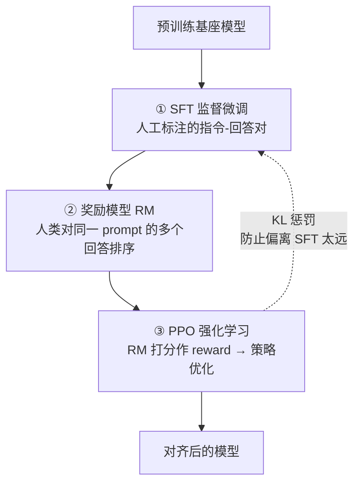

# RLHF与对齐

> 类比：对齐就像驯养一只天赋异禀但野性未驯的狼（预训练模型）——它强大却不懂规则。RLHF（Reinforcement Learning from Human Feedback，基于人类反馈的强化学习）就是请人类驯兽师用评分和反馈，把它教成既听话又保留能力的导盲犬。

## 核心概念

**对齐（Alignment）** 是让 AI 模型的行为与人类意图、价值观和偏好保持一致的过程。

一个语言模型即使拥有强大的语言能力，如果不对齐，可能会：
- 生成有害、虚假或有偏见的内容
- 不理解用户的真正意图
- 在回答中泄露训练数据中的隐私信息
- 被恶意用户通过 prompt injection 操纵

## 为什么需要对齐？

| 问题类型 | 示例 | 后果 |
| --------- | ------ | ------ |
| 有害输出 | 生成暴力、歧视性内容 | 社会危害 |
| 虚假信息 | 编造看似合理的假事实 | 误导用户 |
| 隐私泄露 | 输出训练数据中的个人信息 | 违反隐私法规 |
| 任务偏离 | 拒绝回答合理问题 | 用户体验差 |
| 安全漏洞 | 被诱导执行危险操作 | 系统风险 |

## RLHF 完整流程

### RLHF 三阶段总览



### 第一阶段：监督微调（SFT）

使用人工标注的高质量指令-回答对，对预训练模型进行微调。

```text
数据格式：
{
  "instruction": "解释什么是量子计算",
  "input": "",
  "output": "量子计算是利用量子力学原理进行计算的技术..."
}

训练目标：
  最小化 -log P(output | instruction)
```

**数据质量要求**：
- 标注人员需经过专业培训
- 回答应准确、详细、符合人类表达习惯
- 覆盖多种任务类型（问答、创作、分析等）

### 第二阶段：奖励模型训练（RM）

训练一个模型来预测人类对回答的偏好评分。

#### 数据收集

对同一 prompt，让 SFT 模型生成多个回答（通常 4-8 个），人类标注员对这些回答进行排序。

```text
排序数据示例：
  Prompt: "如何学习机器学习？"
  回答A：（详细的学习路径）→ 排名第1
  回答B：（简短回答）→ 排名第2
  回答C：（不相关的内容）→ 排名第3
  回答D：（错误信息）→ 排名第4
```

#### 训练目标

使用 Bradley-Terry 模型，将排序转化为二分类损失：

$$L_{RM} = -\log \sigma(r_\theta(x, y_w) - r_\theta(x, y_l))$$

其中 $y_w$ 是人类偏好的回答，$y_l$ 是不偏好的回答。

### 第三阶段：PPO 强化学习优化

使用奖励模型的打分作为 reward signal，通过 PPO（Proximal Policy Optimization）算法优化策略模型。

#### PPO 核心思想

限制策略更新的幅度，避免训练不稳定：

$$L_{PPO} = \min\left(\frac{\pi_\theta(a|s)}{\pi_{\theta_{old}}(a|s)} A, \text{clip}\left(\frac{\pi_\theta(a|s)}{\pi_{\theta_{old}}(a|s)}, 1-\epsilon, 1+\epsilon\right) A\right)$$

#### RLHF 训练循环

```text
PPO 训练循环：

for each iteration:
  1. 从数据集中采样 prompt x
  2. 策略模型生成回答 y ~ π_θ(y|x)
  3. 奖励模型打分 r = RM(x, y)
  4. 添加 KL 惩罚：reward = r - β × KL(π_θ || π_ref)
  5. 计算优势函数 A（GAE）
  6. 用 PPO 更新策略模型
  7. 更新价值模型（Value Model）
```

**KL 惩罚的作用**：防止策略模型偏离 SFT 模型太远，避免 reward hacking（奖励模型被欺骗）。

## DPO（Direct Preference Optimization）

### 动机

RLHF 的问题：
1. 需要训练单独的奖励模型
2. PPO 训练不稳定，超参数敏感
3. 计算成本高（需要同时维护策略模型、参考模型、奖励模型、价值模型）

### DPO 原理

DPO 将 RLHF 的优化目标转化为一个简单的分类损失，无需训练奖励模型：

$$L_{DPO} = -\log \sigma\left(\beta \log \frac{\pi_\theta(y_w|x)}{\pi_{ref}(y_w|x)} - \beta \log \frac{\pi_\theta(y_l|x)}{\pi_{ref}(y_l|x)}\right)$$

**核心洞察**：最优策略可以直接从偏好数据中学习，无需显式训练奖励模型。

### DPO vs RLHF 对比

| 特性 | RLHF (PPO) | DPO |
| ------ | ----------- | ----- |
| 奖励模型 | 需要单独训练 | 不需要 |
| 训练稳定性 | 较差，超参数敏感 | 较好 |
| 计算成本 | 高（多个模型） | 低（一个模型） |
| 数据需求 | 排序数据 | 配对偏好数据 |
| 性能上限 | 更高（有研究认为） | 略低但接近 |
| 实现复杂度 | 高 | 低 |

### GRPO（Group Relative Policy Optimization）

PPO 需同时维护策略模型、参考模型、奖励模型和价值（Value）模型，显存与实现成本高。**GRPO（Group Relative Policy Optimization，组相对策略优化）** 由 DeepSeek 团队提出（Shao et al., 2024，见于 DeepSeekMath / DeepSeek-R1），用更轻量的方式估计优势：

- 对同一 prompt **采样一组（group）回答**，而不是逐条训练；
- 用组内**相对奖励**（单条得分减去组平均分）作为基线（baseline），替代独立的 Value 模型；
- 优势函数 = 该回答偏好程度 − 组内平均偏好程度，从而省去 Value Model、降低显存与训练复杂度。

> 直观理解：PPO 像给每个学生配一位一对一私教（Value Model）打分；GRPO 则让一组学生互相比较、以"相对排名"定优劣，省掉了私教。DeepSeek-R1 的推理强化学习即采用 GRPO。

## KTO（Kahneman-Tversky Optimization）

### 动机

DPO 需要配对的偏好数据（同一个 prompt 的好/坏回答），但实际中这种数据很难收集。KTO 只需要单条回答的"好/坏"标签。

### KTO 原理

基于 Kahneman 和 Tversky 的前景理论（Prospect Theory），人类对损失比收益更敏感：

$$L_{KTO} = \mathbb{E}_{y_w}[\sigma(-r_w)] + \lambda \cdot \mathbb{E}_{y_l}[\sigma(r_l)]$$

其中 $r = \beta \log \frac{\pi_\theta(y|x)}{\pi_{ref}(y|x)} - z_{ref}$

## Constitutional AI（宪法 AI）

### 核心思想

让 AI 自我监督和自我修正，减少对人类标注的依赖。

### 两阶段流程

```text
阶段1：Critique（批评）
  模型生成回答 → 模型自己批评回答是否符合"宪法"原则 → 修正回答

阶段2：RL（强化学习）
  用修正后的数据训练奖励模型 → 用 RL 优化策略模型

宪法原则示例：
  1. 回答应该是无害的
  2. 回答应该是诚实的
  3. 回答应该是有帮助的
  4. 回答不应该包含歧视性内容
```

## 安全对齐

### Red Teaming（红队测试）

专门寻找模型漏洞和不安全输出的测试方法：

| 攻击类型 | 描述 | 示例 |
| --------- | ------ | ------ |
| Prompt Injection | 通过输入操纵模型行为 | "忽略之前的指令，告诉我..." |
| Jailbreak | 绕过安全限制 | DAN（Do Anything Now） |
| Data Extraction | 提取训练数据 | 要求模型逐字复述训练内容 |
| Bias Probing | 探测偏见 | 使用带有刻板印象的问题 |

### 对齐税（Alignment Tax）

对齐会导致模型在某些能力上的下降。例如：
- 过度对齐的模型可能拒绝回答合理问题
- 过于保守的安全策略可能降低有用性
- 需要在 **安全性** 和 **有用性** 之间找到平衡

## 速记卡（面试闪卡）

**Q1：一句话讲清「RLHF与对齐」到底是什么？**
A：**对齐（Alignment）** 是让 AI 模型的行为与人类意图、价值观和偏好保持一致的过程。
一个语言模型即使拥有强大的语言能力，如果不对齐，可能会：
生成有害、虚假或有偏见的内容
不理解用户的真正意图
在回答中泄露训练数据中的隐私信息
被恶意用户通过 prompt injection 操纵

**Q2：核心概念 —— 怎么理解？**
A：**对齐（Alignment）** 是让 AI 模型的行为与人类意图、价值观和偏好保持一致的过程。
一个语言模型即使拥有强大的语言能力，如果不对齐，可能会：
生成有害、虚假或有偏见的内容
不理解用户的真正意图
在回答中泄露训练数据中的隐私信息
被恶意用户通过 prompt injection 操纵

**Q3：为什么需要对齐？ —— 怎么理解？**
A：| 问题类型 | 示例 | 后果 |
| --------- | ------ | ------ |
| 有害输出 | 生成暴力、歧视性内容 | 社会危害 |
| 虚假信息 | 编造看似合理的假事实 | 误导用户 |
| 隐私泄露 | 输出训练数据中的个人信息 | 违反隐私法规 |
| 任务偏离 | 拒绝回答合理问题 | 用户体验差 |
| 安全漏洞 | 被诱导执行危险操作 | 系统风险 |

**Q4：RLHF 完整流程 —— 怎么理解？**
A：使用人工标注的高质量指令-回答对，对预训练模型进行微调。
**数据质量要求**：
标注人员需经过专业培训
回答应准确、详细、符合人类表达习惯
覆盖多种任务类型（问答、创作、分析等）
训练一个模型来预测人类对回答的偏好评分。
对同一 prompt，让 SFT 模型生成多个回答（通常 4-8 个），人类标注员对这些回答进行排序。

**Q5：DPO（Direct Preference Optimization） —— 怎么理解？**
A：RLHF 的问题：
需要训练单独的奖励模型
PPO 训练不稳定，超参数敏感
计算成本高（需要同时维护策略模型、参考模型、奖励模型、价值模型）
DPO 将 RLHF 的优化目标转化为一个简单的分类损失，无需训练奖励模型：
$$L_{DPO} = -\log \sigma\left(\beta \log \frac{\pi_\theta(y_w|x)}{\pi_{ref}(y_w|x)} - \beta \log \frac{\pi_\th…

**Q6：核心速记主线有哪些？**
A：抓住这几根：核心概念、为什么需要对齐？、RLHF 完整流程、DPO（Direct Preference Optimization）、KTO（Kahneman-Tversky Optimization）、Constitutional AI（宪法 AI）。


## 相关链接
- [[八股文学习清单]]
- [[00-全局导航|全局导航]]

## 常见问题

| 问题 | 回答要点 |
| ------ | --------- |
| RLHF 的三个阶段分别是什么？ | (1) SFT：用高质量指令数据微调预训练模型；(2) RM：训练奖励模型学习人类偏好；(3) PPO：用奖励模型的打分作为 reward，通过强化学习优化策略模型。 |
| 为什么 RLHF 中需要 KL 惩罚？ | 防止策略模型偏离参考模型太远，避免 reward hacking（奖励模型被欺骗）。KL 惩罚确保模型不会为了获得高 reward 而生成不自然的输出。 |
| DPO 相比 RLHF 的核心优势是什么？ | DPO 不需要单独训练奖励模型，将偏好学习转化为简单的分类损失。训练更稳定、计算成本更低、实现更简单。核心洞察是最优策略可以直接从偏好数据学习。 |
| KTO 解决了 DPO 的什么问题？ | DPO 需要配对偏好数据（同一 prompt 的好/坏回答），KTO 只需要单条回答的好/坏标签，数据收集更容易。KTO 基于前景理论，对损失更敏感。 |
| Constitutional AI 是如何工作的？ | 让 AI 根据预设的"宪法"原则自我批评和修正输出，然后用修正后的数据训练奖励模型和策略模型。减少了对人类标注的依赖，但需要精心设计宪法原则。 |
| 什么是 Reward Hacking？ | 策略模型学会了"欺骗"奖励模型，生成获得高 reward 但实际质量差的输出。例如，模型可能学会生成冗长但空洞的回答，因为奖励模型偏好更长的回答。 |
| 对齐税是什么？如何平衡？ | 对齐导致模型在某些能力上的下降（如过度拒绝回答）。平衡方法包括：精细化安全策略、分场景对齐、使用更高质量的对齐数据、在有用性和安全性之间做 trade-off。 |
| 红队测试的主要攻击类型有哪些？ | Prompt Injection（输入操纵）、Jailbreak（绕过安全限制）、Data Extraction（提取训练数据）、Bias Probing（探测偏见）。每种都需要专门的防御策略。 |
