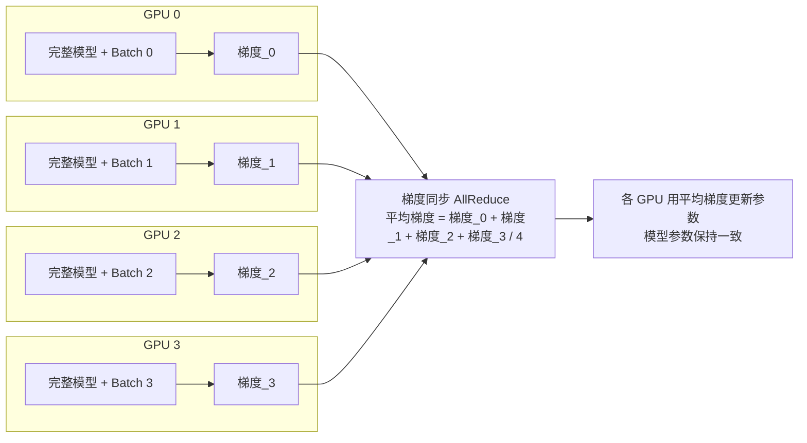
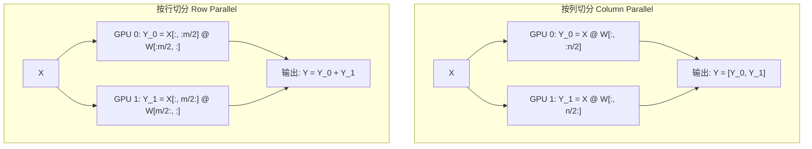
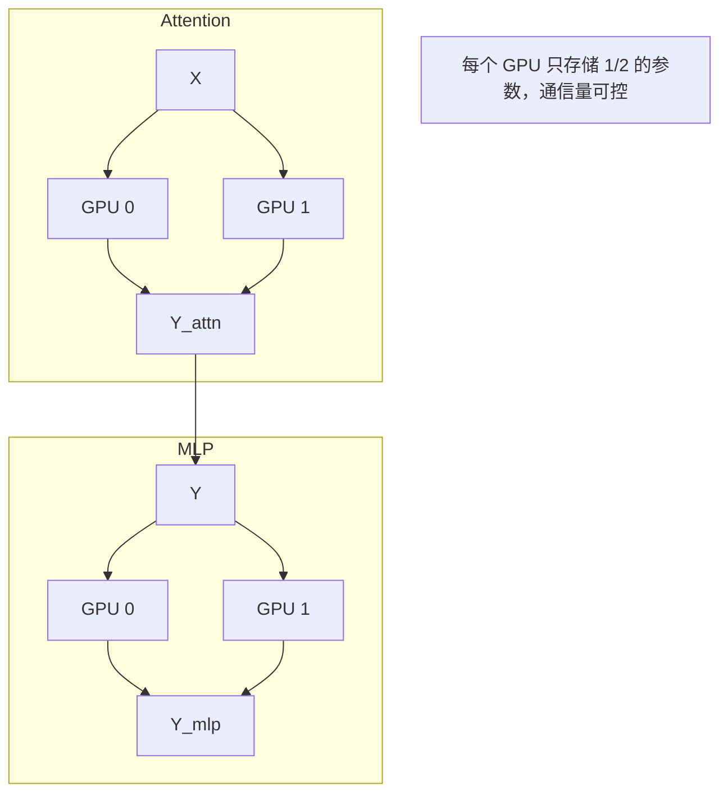
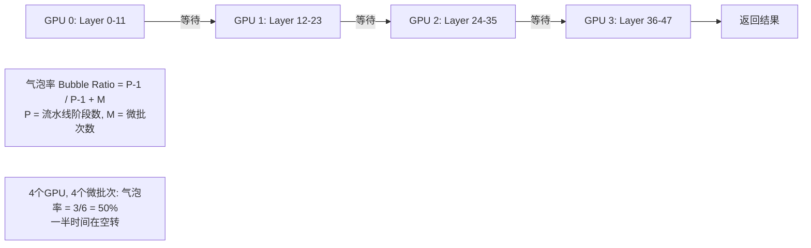
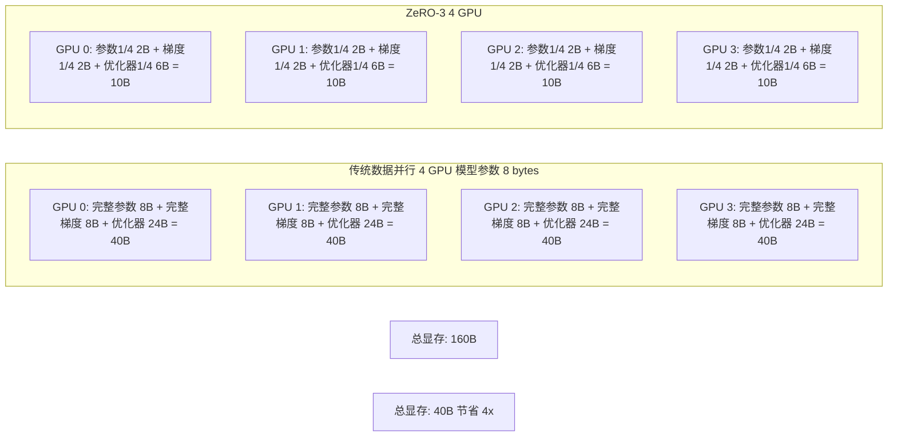
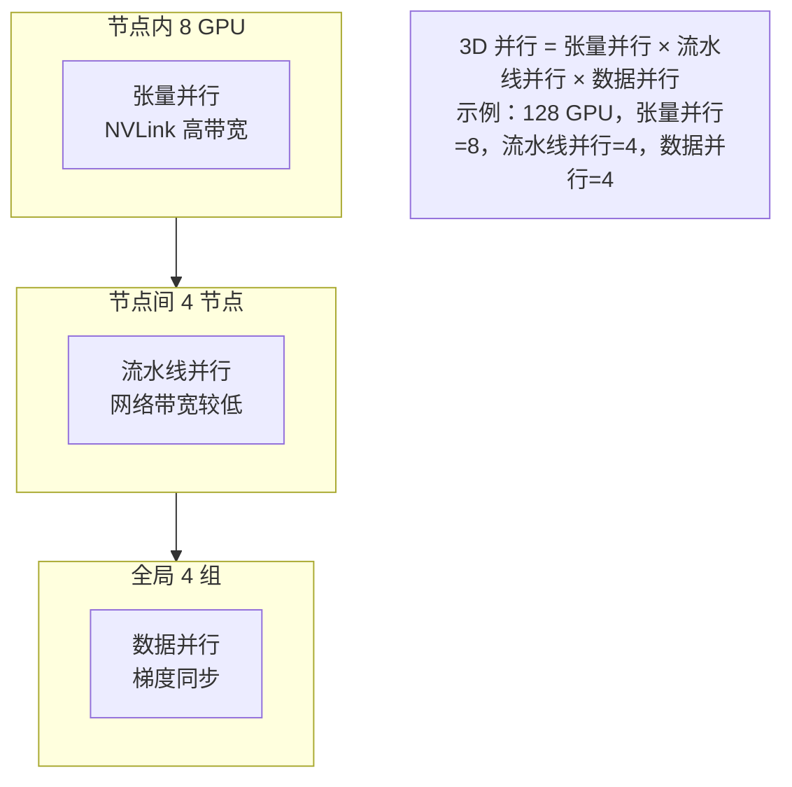
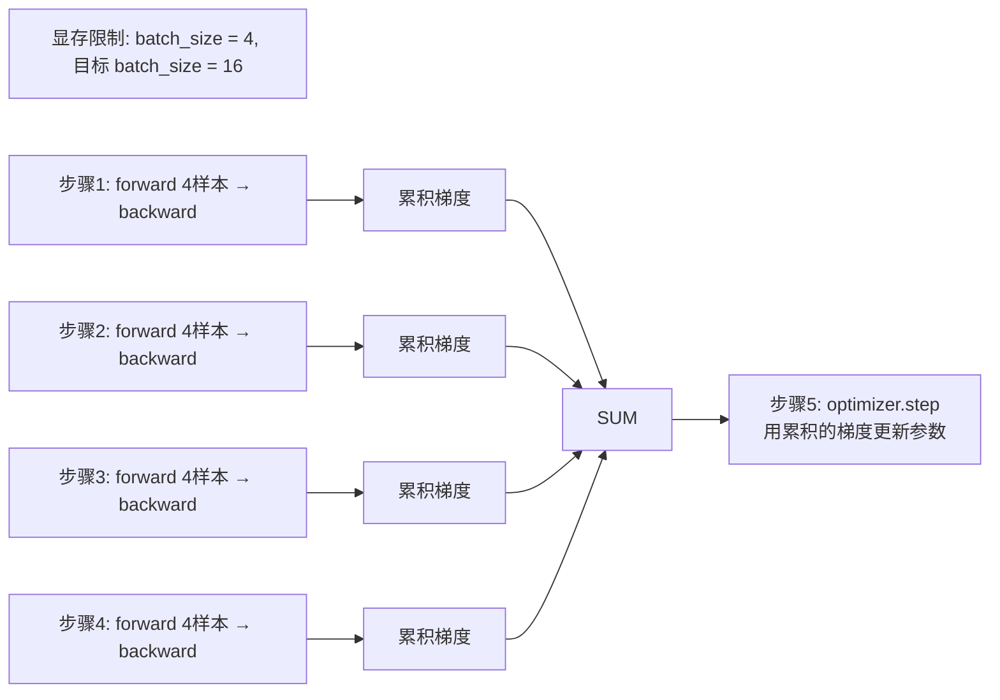

# 分布式训练与并行策略

> 类比：训练大模型就像搬家——一个人搬不动（单 GPU 显存不够），于是叫上几个朋友分工：有人负责把所有箱子各搬一部分（数据并行）、有人专门扛大件家具（模型并行）、还有人边搬边记清单避免重复劳动（ZeRO）。不同分工组合，决定了整体效率。

## 核心概念

大模型训练的核心挑战：**单个 GPU 的显存和算力无法满足训练需求**。例如 GPT-3 175B 参数模型，仅存储参数就需要 350GB 显存（FP16），远超单张 GPU 的 80GB 显存上限。

分布式训练通过将计算分布到多个 GPU/节点上，解决显存不足和训练时间过长的问题。

## 为什么需要分布式训练？

### 显存分析

训练一个模型需要存储：

| 内存项 | 占用大小 | 说明 |
| ------- | --------- | ------ |
| 模型参数 | 2N bytes（FP16） | N 为参数量 |
| 优化器状态 | 4N-12N bytes | Adam 需要 momentum + variance |
| 梯度 | 2N bytes（FP16） | 与参数大小相同 |
| 激活值 | 取决于 batch size 和序列长度 | 可通过梯度检查点优化 |
| **总计** | **8N-16N bytes** | 训练比推理需要更多内存 |

**示例**：LLaMA-70B 训练
- 参数：70B × 2 bytes = 140 GB
- 优化器（AdamW）：70B × 12 bytes = 840 GB
- 梯度：70B × 2 bytes = 140 GB
- 总计：约 1.1 TB（不含激活值）
- 需要 14+ 张 A100-80GB GPU

## 数据并行（Data Parallelism）

### 基本原理

每个 GPU 持有完整模型副本，将训练数据切分到不同 GPU 上并行计算梯度，然后同步梯度。

### 通信开销

AllReduce 操作的通信量：$2 \times (N-1)/N \times D$（N 为 GPU 数量，D 为参数量）

对于 70B 模型，每次 AllReduce 需要传输约 280GB 数据（FP16）。

## 模型并行

### 张量并行（Tensor Parallelism）

将单层的计算切分到多个 GPU 上。

**线性层切分**：

**Megatron-LM 的并行策略**：

### 流水线并行（Pipeline Parallelism）

将模型的不同层分配到不同 GPU 上，形成流水线。

**朴素流水线的问题**：

**GPipe 优化**：将 batch 切分为更多微批次（micro-batch），降低气泡率。

```mermaid
gantt
    title GPipe 4个微批次
    dateFormat  X
    axisFormat  %s
    section GPU 0
    前向 B0 :a0, 0, 1s
    前向 B1 :a1, 1, 1s
    前向 B2 :a2, 2, 1s
    前向 B3 :a3, 3, 1s
    空闲 :gap0, 4, 3s
    反向 B3 :a4, 7, 1s
    反向 B2 :a5, 8, 1s
    反向 B1 :a6, 9, 1s
    反向 B0 :a7, 10, 1s
    section GPU 1
    空闲 :gap1a, 0, 1s
    前向 B0 :b0, 1, 1s
    前向 B1 :b1, 2, 1s
    前向 B2 :b2, 3, 1s
    前向 B3 :b3, 4, 1s
    空闲 :gap1b, 5, 2s
    反向 B3 :b4, 7, 1s
    反向 B2 :b5, 8, 1s
    反向 B1 :b6, 9, 1s
    反向 B0 :b7, 10, 1s
    section GPU 2
    空闲 :gap2a, 0, 2s
    前向 B0 :c0, 2, 1s
    前向 B1 :c1, 3, 1s
    前向 B2 :c2, 4, 1s
    前向 B3 :c3, 5, 1s
    空闲 :gap2b, 6, 2s
    反向 B3 :c4, 8, 1s
    反向 B2 :c5, 9, 1s
    反向 B1 :c6, 10, 1s
    section GPU 3
    空闲 :gap3a, 0, 3s
    前向 B0 :d0, 3, 1s
    前向 B1 :d1, 4, 1s
    前向 B2 :d2, 5, 1s
    前向 B3 :d3, 6, 1s
    反向 B3 :d4, 7, 1s
    反向 B2 :d5, 8, 1s
    反向 B1 :d6, 9, 1s
    反向 B0 :d7, 10, 1s
```

## ZeRO（Zero Redundancy Optimizer）

### 核心思想

数据并行中，每个 GPU 都存储了完整的模型参数、梯度和优化器状态，造成大量冗余。ZeRO 将这些状态切分到不同 GPU 上。

### 三个阶段

| 阶段 | 切分内容 | 内存节省 | 通信量 |
| ------ | --------- | --------- | ------- |
| ZeRO-1 | 优化器状态 | 4x | 与 DP 相同 |
| ZeRO-2 | 优化器状态 + 梯度 | 8x | 与 DP 相同 |
| ZeRO-3 | 优化器状态 + 梯度 + 参数 | Nx | 1.5x DP |

### ZeRO-3 详解

## FSDP（Fully Sharded Data Parallel）

PyTorch 原生的 ZeRO-3 实现，由 PyTorch 团队维护。

### 核心机制

1. **参数分片**：每个 GPU 只存储 1/N 的参数
2. **按需聚合**：前向/反向传播时，通过 AllGather 操作临时获取完整参数
3. **梯度切分**：反向传播后，ReduceScatter 操作将梯度切分到各 GPU
4. **优化器更新**：每个 GPU 只更新自己负责的参数分片

### FSDP vs DeepSpeed

| 特性 | FSDP | DeepSpeed ZeRO |
| ------ | ------ | --------------- |
| 维护方 | PyTorch 官方 | Microsoft |
| 集成度 | PyTorch 原生 | 需要额外安装 |
| 混合精度 | 原生支持 | 原生支持 |
| offload | 支持 CPU/NVMe | 支持 CPU/NVMe |
| 生态兼容 | 更好 | 需要适配 |

## Megatron-LM

### 核心特点

NVIDIA 开源的大模型训练框架，专注于高效的张量并行和流水线并行。

### 3D 并行策略

Megatron-LM 支持三种并行维度的组合：

## 梯度累积（Gradient Accumulation）

### 基本思想

在显存不足以容纳大 batch 时，通过多次前向-反向传播累积梯度，然后一次性更新参数。

**等效性**：累积 4 次梯度等效于使用 4 倍大的 batch，但显存占用不变。

## 训练稳定性与挑战

### 梯度问题

| 问题 | 表现 | 解决方案 |
| ------ | ------ | --------- |
| 梯度爆炸 | Loss 突然变为 NaN | 梯度裁剪（Gradient Clipping） |
| 梯度消失 | 训练停滞 | 使用残差连接、合理初始化 |
| 梯度震荡 | Loss 波动大 | 降低学习率、增大 batch size |

### 训练技巧

1. **学习率 Warmup**：训练初期逐渐增大学习率，避免早期不稳定
2. **余弦退火**：学习率随训练进程逐渐衰减
3. **混合精度训练**：FP16/BF16 计算 + FP32 主权重，兼顾速度和稳定性
4. **梯度裁剪**：限制梯度范数不超过阈值（通常为 1.0）

## 速记卡（面试闪卡）

**Q1：一句话讲清「分布式训练与并行策略」到底是什么？**
A：大模型训练的核心挑战：**单个 GPU 的显存和算力无法满足训练需求**。例如 GPT-3 175B 参数模型，仅存储参数就需要 350GB 显存（FP16），远超单张 GPU 的 80GB 显存上限。
分布式训练通过将计算分布到多个 GPU/节点上，解决显存不足和训练时间过长的问题。

**Q2：核心概念 —— 怎么理解？**
A：大模型训练的核心挑战：**单个 GPU 的显存和算力无法满足训练需求**。例如 GPT-3 175B 参数模型，仅存储参数就需要 350GB 显存（FP16），远超单张 GPU 的 80GB 显存上限。
分布式训练通过将计算分布到多个 GPU/节点上，解决显存不足和训练时间过长的问题。

**Q3：为什么需要分布式训练？ —— 怎么理解？**
A：训练一个模型需要存储：
| 内存项 | 占用大小 | 说明 |
| ------- | --------- | ------ |
| 模型参数 | 2N bytes（FP16） | N 为参数量 |
| 优化器状态 | 4N-12N bytes | Adam 需要 momentum + variance |
| 梯度 | 2N bytes（FP16） | 与参数大小相同 |

**Q4：数据并行（Data Parallelism） —— 怎么理解？**
A：每个 GPU 持有完整模型副本，将训练数据切分到不同 GPU 上并行计算梯度，然后同步梯度。
AllReduce 操作的通信量：$2 \times (N-1)/N \times D$（N 为 GPU 数量，D 为参数量）
对于 70B 模型，每次 AllReduce 需要传输约 280GB 数据（FP16）。

**Q5：模型并行 —— 怎么理解？**
A：将单层的计算切分到多个 GPU 上。
**线性层切分**：
**Megatron-LM 的并行策略**：
将模型的不同层分配到不同 GPU 上，形成流水线。
**朴素流水线的问题**：
**GPipe 优化**：将 batch 切分为更多微批次（micro-batch），降低气泡率。

**Q6：核心速记主线有哪些？**
A：抓住这几根：核心概念、为什么需要分布式训练？、数据并行（Data Parallelism）、模型并行、ZeRO（Zero Redundancy Optimizer）、FSDP（Fully Sharded Data Parallel）。

## 相关链接
- [[八股文学习清单]]
- [[00-全局导航|全局导航]]

## 常见问题

| 问题 | 回答要点 |
| ------ | --------- |
| 数据并行和模型并行的核心区别是什么？ | 数据并行每个 GPU 持有完整模型副本，处理不同的数据切片，通过梯度同步保持一致；模型并行将模型本身切分到不同 GPU 上，每个 GPU 只存储和计算模型的一部分。 |
| ZeRO-3 相比数据并行节省了多少显存？ | ZeRO-3 将优化器状态、梯度和参数都切分到不同 GPU 上，N 个 GPU 的总显存需求从 N×(参数+梯度+优化器) 降低到 (参数+梯度+优化器)，即节省 N 倍。但通信量增加到 1.5 倍。 |
| 为什么大模型训练常用 BF16 而不是 FP16？ | BF16 的指数位与 FP32 相同（8位），动态范围更大，不容易出现溢出；FP16 的指数位只有 5 位，动态范围小，容易出现梯度溢出。BF16 是大模型训练的首选混合精度格式。 |
| 梯度累积为什么等效于大 batch？ | 梯度累积在多次前向-反向传播中累加梯度，然后一次性更新参数。数学上等效于在更大 batch 上计算梯度，因为梯度是线性的：∇L(∪B_i) = ∑∇L(B_i)。 |
| Megatron-LM 的 3D 并行是如何设计的？ | 节点内用张量并行（NVLink 高带宽），节点间用流水线并行（网络带宽有限），全局用数据并行（梯度同步开销可控）。这种设计充分利用了不同层级的通信带宽特点。 |
| FSDP 和 DeepSpeed ZeRO-3 有什么区别？ | 核心思想相同，都是将参数/梯度/优化器状态切分到不同 GPU。FSDP 是 PyTorch 原生实现，集成度更好；DeepSpeed 是 Microsoft 的独立框架，功能更丰富但需要额外安装适配。 |
| 训练大模型时为什么需要梯度裁剪？ | 大模型训练中梯度可能因数值不稳定而爆炸，导致参数更新过大，训练发散。梯度裁剪将梯度范数限制在阈值内（如 1.0），防止训练不稳定。 |
| 什么是流水线并行的气泡率？如何降低？ | 气泡率是流水线中 GPU 空闲等待的时间比例。计算公式：(P-1)/(P-1+M)，P 为阶段数，M 为微批次数。降低方法：增加微批次数 M，或使用 1F1B 等调度策略。 |
