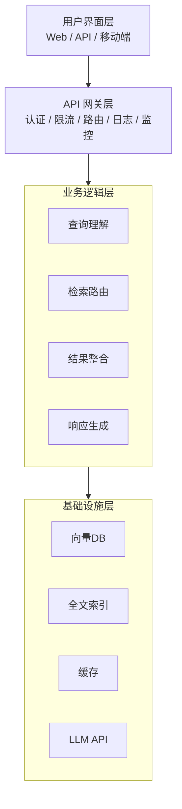
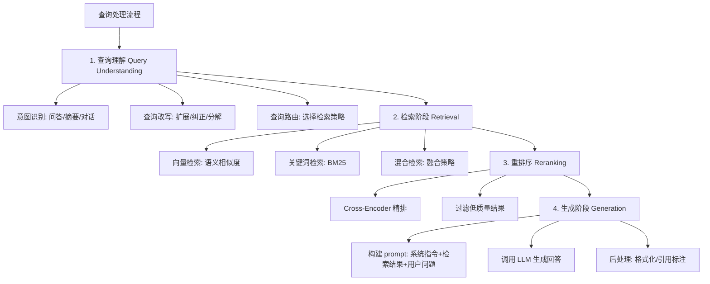
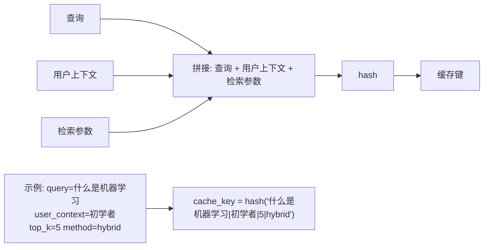
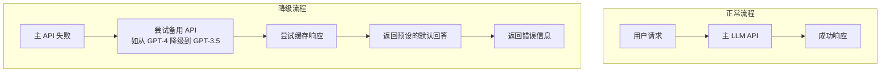
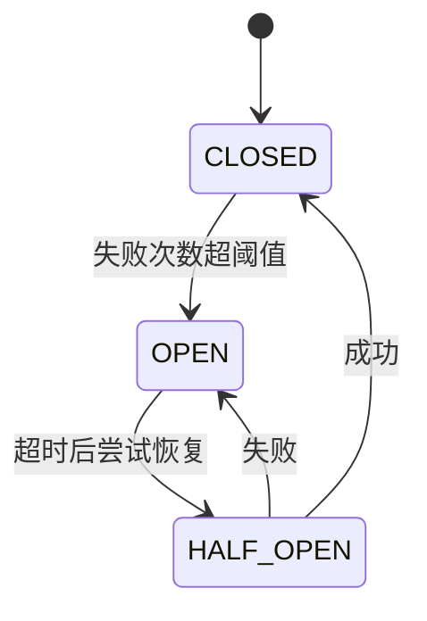
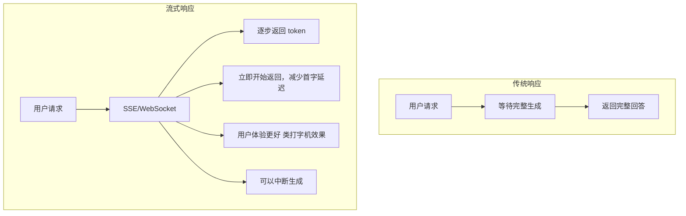
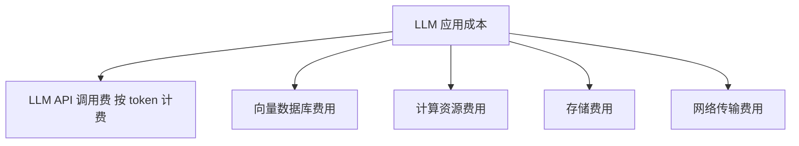
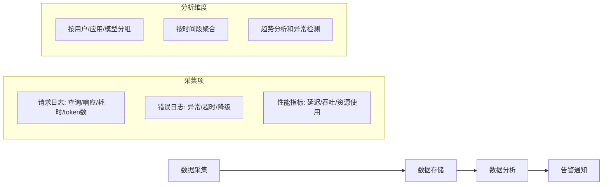

# AI应用架构设计

> 类比：设计 AI 应用架构就像设计一家餐厅的后厨——顾客（用户）只看到前厅，但真正决定出餐速度与口味的是后厨动线（RAG 管道）、备菜缓存（Cache）、以及高峰期主备灶台切换（Fallback）。架构好不好，用户感知得到。

## 核心概念

AI 应用架构设计是将 LLM 能力集成到生产环境中的系统工程。核心挑战包括：**延迟优化、成本控制、可靠性保障、可观测性**。

## 端到端 RAG 架构

### 整体架构

### RAG 管道详细设计

## API 网关设计

### 核心功能

| 功能 | 描述 | 实现方式 |
| ------ | ------ | --------- |
| 认证授权 | 验证用户身份和权限 | JWT / OAuth2 |
| 限流 | 控制请求频率 | 令牌桶 / 滑动窗口 |
| 路由 | 分发请求到不同后端 | 负载均衡 / 灰度发布 |
| 日志 | 记录请求和响应 | 结构化日志 |
| 监控 | 性能指标收集 | Prometheus / Grafana |

### LLM 限流策略

| 策略 | 原理 | 适用场景 |
| ------ | ------ | --------- |
| RPM（每分钟请求数） | 限制请求次数 | 简单场景 |
| TPM（每分钟 token 数） | 限制 token 消耗 | 成本敏感场景 |
| 并发数限制 | 限制同时处理的请求数 | 资源受限场景 |
| 动态限流 | 根据系统负载调整 | 高可用场景 |

## 缓存策略

### 缓存层级

| 层级 | 缓存内容 | TTL | 说明 |
| ------ | --------- | ----- | ------ |
| 查询缓存 | 相同查询的结果 | 1-24h | 减少重复 LLM 调用 |
| 检索缓存 | 检索结果 | 1-6h | 减少向量检索开销 |
| Embedding 缓存 | 文本的向量表示 | 长期 | 减少编码计算 |
| 响应缓存 | 完整回答 | 1-24h | 最快响应 |

### 缓存键设计

### 缓存失效策略

| 策略 | 描述 | 适用场景 |
| ------ | ------ | --------- |
| TTL 过期 | 固定时间后失效 | 知识更新不频繁 |
| LRU 淘汰 | 最近最少使用时淘汰 | 内存受限场景 |
| 主动失效 | 知识更新时主动清除 | 实时性要求高 |
| 版本化 | 知识库更新时递增版本号 | 精确控制 |

## Fallback 策略

### 多级降级

### 熔断器模式

## 流式响应

### 实现方式

### 流式响应的优势

| 指标 | 传统响应 | 流式响应 |
| ------ | --------- | --------- |
| 首字延迟 | 数秒 | 毫秒级 |
| 用户感知 | 等待焦虑 | 即时反馈 |
| 资源利用 | 等待完成 | 边生成边返回 |
| 中断支持 | 不支持 | 可随时中断 |

## 成本优化

### 成本构成

### 优化策略

| 策略 | 描述 | 预期节省 |
| ------ | ------ | --------- |
| 查询缓存 | 减少重复调用 | 30-50% |
| Prompt 压缩 | 减少输入 token | 20-40% |
| 模型降级 | 简单任务用小模型 | 50-70% |
| 批处理 | 合并多个请求 | 10-20% |
| 异步处理 | 非实时场景异步调用 | 10-30% |

## 监控与可观测性

### 关键指标

| 类别 | 指标 | 说明 |
| ------ | ------ | ------ |
| 性能 | 延迟（P50/P95/P99） | 响应时间 |
| 性能 | 吞吐量（QPS） | 每秒请求数 |
| 质量 | 回答准确率 | 用户满意度 |
| 质量 | 幻觉率 | 错误回答比例 |
| 成本 | 每请求 token 数 | 成本效率 |
| 成本 | 每请求成本 | 单次调用费用 |
| 可靠性 | 成功率 | 请求成功比例 |
| 可靠性 | 错误率 | 错误请求比例 |

### 监控架构

## 速记卡（面试闪卡）

**Q1：一句话讲清「AI应用架构设计」到底是什么？**
A：AI 应用架构设计是将 LLM 能力集成到生产环境中的系统工程。核心挑战包括：**延迟优化、成本控制、可靠性保障、可观测性**。

**Q2：核心概念 —— 怎么理解？**
A：AI 应用架构设计是将 LLM 能力集成到生产环境中的系统工程。核心挑战包括：**延迟优化、成本控制、可靠性保障、可观测性**。

**Q3：API 网关设计 —— 怎么理解？**
A：| 功能 | 描述 | 实现方式 |
| ------ | ------ | --------- |
| 认证授权 | 验证用户身份和权限 | JWT / OAuth2 |
| 限流 | 控制请求频率 | 令牌桶 / 滑动窗口 |
| 路由 | 分发请求到不同后端 | 负载均衡 / 灰度发布 |
| 日志 | 记录请求和响应 | 结构化日志 |
| 监控 | 性能指标收集 | Prometheus / Grafana |

**Q4：缓存策略 —— 怎么理解？**
A：| 层级 | 缓存内容 | TTL | 说明 |
| ------ | --------- | ----- | ------ |
| 查询缓存 | 相同查询的结果 | 1-24h | 减少重复 LLM 调用 |
| 检索缓存 | 检索结果 | 1-6h | 减少向量检索开销 |
| Embedding 缓存 | 文本的向量表示 | 长期 | 减少编码计算 |
| 响应缓存 | 完整回答 | 1-24h | 最快响应 |

**Q5：核心速记主线有哪些？**
A：抓住这几根：核心概念、端到端 RAG 架构、API 网关设计、缓存策略、Fallback 策略、流式响应。

## 相关链接
- [[八股文学习清单]]
- [[00-全局导航|全局导航]]

## 常见问题

| 问题 | 回答要点 |
| ------ | --------- |
| RAG 系统的完整架构是怎样的？ | 分四层：用户界面层、API 网关层（认证/限流/路由）、业务逻辑层（查询理解/检索/重排序/生成）、基础设施层（向量DB/缓存/LLM API）。核心是查询处理管道。 |
| 如何设计 LLM API 的限流策略？ | 可用 RPM（每分钟请求数）、TPM（每分钟 token 数）、并发数限制。TPM 更精确地控制成本，RPM 更简单。高可用场景可用动态限流根据系统负载调整。 |
| 缓存在 RAG 中的作用是什么？ | 缓存可以显著减少重复的 LLM 调用，降低成本和延迟。多级缓存：查询缓存（最有效）、检索缓存、Embedding 缓存。需要设计合理的缓存键和失效策略。 |
| 流式响应相比传统响应有什么优势？ | 流式响应通过 SSE/WebSocket 逐步返回 token，首字延迟从秒级降低到毫秒级，用户体验更好，支持中断生成，资源利用更高效。 |
| 如何设计 LLM 应用的 Fallback 策略？ | 多级降级：主 API → 备用 API → 缓存响应 → 默认回答 → 错误信息。配合熔断器模式，在主 API 故障时自动切换到备用方案，保证服务可用性。 |
| LLM 应用的成本优化有哪些策略？ | 查询缓存（减少重复调用）、Prompt 压缩（减少输入 token）、模型降级（简单任务用小模型）、批处理（合并请求）、异步处理（非实时场景）。 |
| 如何监控 LLM 应用的质量？ | 关键指标：延迟、吞吐量、回答准确率、幻觉率、每请求成本、成功率。需要建立完整的监控体系，包括日志采集、数据分析、告警通知。 |
| API 网关在 LLM 应用中的作用？ | 提供认证授权、限流控制、请求路由、日志记录、监控指标收集等功能。是保护后端服务、管理流量、提供可观测性的关键组件。 |
