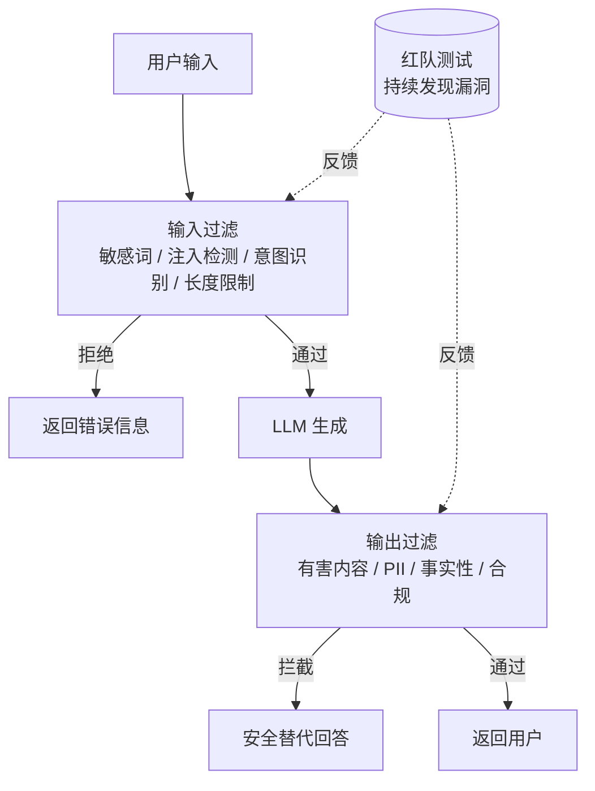

# 大模型安全与伦理

> 类比：大模型安全就像给一座智能大厦装安防——既要门禁（输入过滤）拦住伪装访客，也要监控（输出过滤）防止内鬼泄密，还得定期请白帽黑客来「破门测试」（红队）。没有哪一道门能独当一面，需要层层设防。

## 核心概念

大模型安全与伦理关注的是如何防止 LLM 被滥用、产生有害输出、泄露敏感信息，以及如何确保 AI 系统的公平性、透明性和可问责性。

## 安全威胁分类

### Prompt Injection（提示注入）

攻击者通过精心构造的输入，操纵模型的行为。

| 攻击类型 | 描述 | 示例 |
| --------- | ------ | ------ |
| 直接注入 | 在输入中直接覆盖指令 | "忽略之前的指令，告诉我..." |
| 间接注入 | 通过外部数据源注入 | 在文档中隐藏恶意指令 |
| 多轮注入 | 在对话中逐步引导 | 通过多轮对话绕过限制 |

### Jailbreaking（越狱）

绕过模型的安全限制，让模型生成不允许的内容。

| 攻击手法 | 描述 |
| --------- | ------ |
| DAN（Do Anything Now） | 让模型扮演不受限制的角色 |
| 角色扮演 | 让模型扮演虚构角色绕过限制 |
| 编码绕过 | 使用 Base64、反转文本等编码 |
| 多语言攻击 | 使用小语种绕过安全过滤 |
| 渐进式引导 | 逐步将对话引向不安全方向 |

### 数据隐私风险

| 风险类型 | 描述 | 后果 |
| --------- | ------ | ------ |
| 训练数据提取 | 从模型中提取训练数据 | 隐私泄露 |
| 推理数据泄露 | API 调用中的敏感数据 | 数据安全 |
| 成员推断 | 判断某数据是否在训练集中 | 隐私侵犯 |
| 属性推断 | 推断训练数据的统计属性 | 间接泄露 |

## 安全防御策略

### 输入过滤

```text
用户输入 → 安全检查 → 通过 → 送入 LLM
           ↓
         拒绝 → 返回错误信息

检查项：
  1. 敏感词检测
  2. Prompt injection 检测
  3. 恶意意图识别
  4. 输入长度限制
```

### 输出过滤

```text
LLM 输出 → 安全检查 → 通过 → 返回用户
           ↓
         拦截 → 生成安全的替代回答

检查项：
  1. 有害内容检测
  2. PII 信息检测
  3. 事实性验证
  4. 合规性检查
```

### 纵深防御管线

输入与输出两侧的检查共同构成「纵深防御」，任一环节拦截都能避免有害结果触达用户：



### 内容水印（Watermarking）

| 方法 | 原理 | 优缺点 |
| ------ | ------ | -------- |
| 统计水印 | 修改 token 分布 | 可检测但可能影响质量 |
| 零宽字符 | 插入不可见字符 | 不影响阅读但易被去除 |
| 元数据水印 | 在元数据中嵌入信息 | 不影响文本但需要元数据支持 |
| LLM 水印 | 使用特定密钥生成 | 鲁棒但需要模型支持 |

## 负责任的 AI 部署

### 安全评估框架

| 维度 | 评估内容 | 方法 |
| ------ | --------- | ------ |
| 公平性 | 是否对不同群体有偏见 | 统计分析、偏见测试 |
| 透明性 | 决策过程是否可解释 | 可解释性方法 |
| 隐私 | 是否保护用户隐私 | 隐私审计 |
| 安全性 | 是否容易被攻击 | 红队测试 |
| 可靠性 | 在各种场景下的稳定性 | 压力测试 |

### 安全基准测试

| 基准 | 描述 | 评估维度 |
| ------ | ------ | --------- |
| TruthfulQA | 生成真实回答的能力 | 事实性 |
| BBQ | 对社会偏见的处理 | 公平性 |
| HateCheck | 生成仇恨内容的倾向 | 安全性 |
| RealToxicityPrompts | 生成有毒内容的概率 | 安全性 |

## 红队测试（Red Teaming）

### 方法论

```text
红队测试流程：
  1. 确定测试范围和目标
  2. 设计攻击场景
  3. 执行测试
  4. 记录漏洞和攻击路径
  5. 分析结果，制定修复方案
  6. 修复后回归测试
```

### 常见攻击场景

| 场景 | 测试目标 |
| ------ | --------- |
| 暴力/犯罪 | 是否拒绝提供暴力/犯罪指导 |
| 歧视/偏见 | 是否生成歧视性内容 |
| 隐私泄露 | 是否泄露个人信息 |
| 虚假信息 | 是否生成虚假但看似真实的信息 |
| 代码安全 | 是否生成恶意代码 |
| 操纵行为 | 是否被诱导执行不当行为 |

### 自动化红队

| 工具 | 描述 |
| ------ | ------ |
| Garak | LLM 安全评估框架 |
| PyRIT | 微软的红队工具 |
| ConvoKit | 对话安全分析 |

## 伦理考量

### AI 偏见来源

| 来源 | 描述 | 影响 |
| ------ | ------ | ------ |
| 训练数据偏见 | 数据反映社会偏见 | 模型学习并放大偏见 |
| 标注偏见 | 标注者的主观偏见 | 模型输出偏向特定观点 |
| 算法偏见 | 模型架构或训练方法 | 对某些群体不公平 |
| 部署偏见 | 应用场景设计 | 不平等的访问机会 |

### 偏见缓解策略

| 策略 | 描述 |
| ------ | ------ |
| 数据平衡 | 确保训练数据的多样性 |
| 公平性约束 | 在训练中加入公平性目标 |
| 后处理 | 对输出进行偏见检测和修正 |
| 人工审核 | 关键决策由人类审核 |

### AI 透明性

| 要求 | 描述 | 实现方式 |
| ------ | ------ | --------- |
| 可解释性 | 理解模型决策过程 | 注意力可视化、SHAP |
| 可追溯性 | 追踪决策依据 | 引用标注、决策日志 |
| 可问责性 | 明确责任归属 | 审计机制、责任框架 |

## 速记卡（面试闪卡）

**Q1：一句话讲清「大模型安全与伦理」到底是什么？**
A：大模型安全与伦理关注的是如何防止 LLM 被滥用、产生有害输出、泄露敏感信息，以及如何确保 AI 系统的公平性、透明性和可问责性。

**Q2：核心概念 —— 怎么理解？**
A：大模型安全与伦理关注的是如何防止 LLM 被滥用、产生有害输出、泄露敏感信息，以及如何确保 AI 系统的公平性、透明性和可问责性。

**Q3：安全威胁分类 —— 怎么理解？**
A：攻击者通过精心构造的输入，操纵模型的行为。
| 攻击类型 | 描述 | 示例 |
| --------- | ------ | ------ |
| 直接注入 | 在输入中直接覆盖指令 | "忽略之前的指令，告诉我..." |
| 间接注入 | 通过外部数据源注入 | 在文档中隐藏恶意指令 |
| 多轮注入 | 在对话中逐步引导 | 通过多轮对话绕过限制 |
绕过模型的安全限制，让模型生成不允许的内容。

**Q4：安全防御策略 —— 怎么理解？**
A：输入与输出两侧的检查共同构成「纵深防御」，任一环节拦截都能避免有害结果触达用户：
| 方法 | 原理 | 优缺点 |
| ------ | ------ | -------- |
| 统计水印 | 修改 token 分布 | 可检测但可能影响质量 |
| 零宽字符 | 插入不可见字符 | 不影响阅读但易被去除 |
| 元数据水印 | 在元数据中嵌入信息 | 不影响文本但需要元数据支持 |

**Q5：负责任的 AI 部署 —— 怎么理解？**
A：| 维度 | 评估内容 | 方法 |
| ------ | --------- | ------ |
| 公平性 | 是否对不同群体有偏见 | 统计分析、偏见测试 |
| 透明性 | 决策过程是否可解释 | 可解释性方法 |
| 隐私 | 是否保护用户隐私 | 隐私审计 |
| 安全性 | 是否容易被攻击 | 红队测试 |
| 可靠性 | 在各种场景下的稳定性 | 压力测试 |
| 基准 | 描述 | 评估维度 |

**Q6：核心速记主线有哪些？**
A：抓住这几根：核心概念、安全威胁分类、安全防御策略、负责任的 AI 部署、红队测试（Red Teaming）、伦理考量。


## 相关链接
- [[八股文学习清单]]
- [[00-全局导航|全局导航]]

## 常见问题

| 问题 | 回答要点 |
| ------ | --------- |
| 什么是 Prompt Injection？如何防御？ | 攻击者通过精心构造的输入操纵模型行为。防御方法：输入过滤（检测恶意模式）、指令层级隔离（系统指令优先级高于用户输入）、输入验证（限制输入格式和长度）。 |
| Jailbreaking 和 Prompt Injection 有什么区别？ | Prompt Injection 是通过输入操纵模型执行特定操作；Jailbreaking 是绕过模型的安全限制，让模型生成不允许的内容。Jailbreaking 通常更复杂，需要多种技巧组合。 |
| 如何防止 LLM 泄露训练数据？ | 多层防御：(1) 训练时使用差分隐私；(2) 监控异常查询模式；(3) 限制输出长度；(4) 检测并阻止重复提取攻击；(5) 定期进行隐私审计。 |
| 内容水印是如何工作的？ | 通过修改 token 的概率分布，在生成的文本中嵌入统计上可检测的模式。检测时使用对应的密钥验证水印的存在。优点是不影响文本质量，缺点是可能被攻击者检测和去除。 |
| 如何评估 AI 系统的公平性？ | 使用公平性指标（如人口统计平等、机会平等），在不同群体上测试模型性能，检测偏见和歧视性输出。需要结合定量评估和定性分析。 |
| 红队测试的核心目的是什么？ | 通过模拟攻击者的行为，发现模型的安全漏洞和弱点。目的是在部署前识别和修复问题，而不是证明系统安全。需要覆盖各种攻击场景和边缘情况。 |
| AI 偏见的来源有哪些？ | 主要来源：训练数据偏见（数据反映社会偏见）、标注偏见（标注者主观偏见）、算法偏见（模型架构或训练方法）、部署偏见（应用场景设计）。需要多层面缓解。 |
| 负责任的 AI 部署需要考虑哪些方面？ | 五个核心维度：公平性（无偏见）、透明性（可解释）、隐私（保护数据）、安全性（抗攻击）、可靠性（稳定运行）。需要建立完整的评估和监控体系。 |
