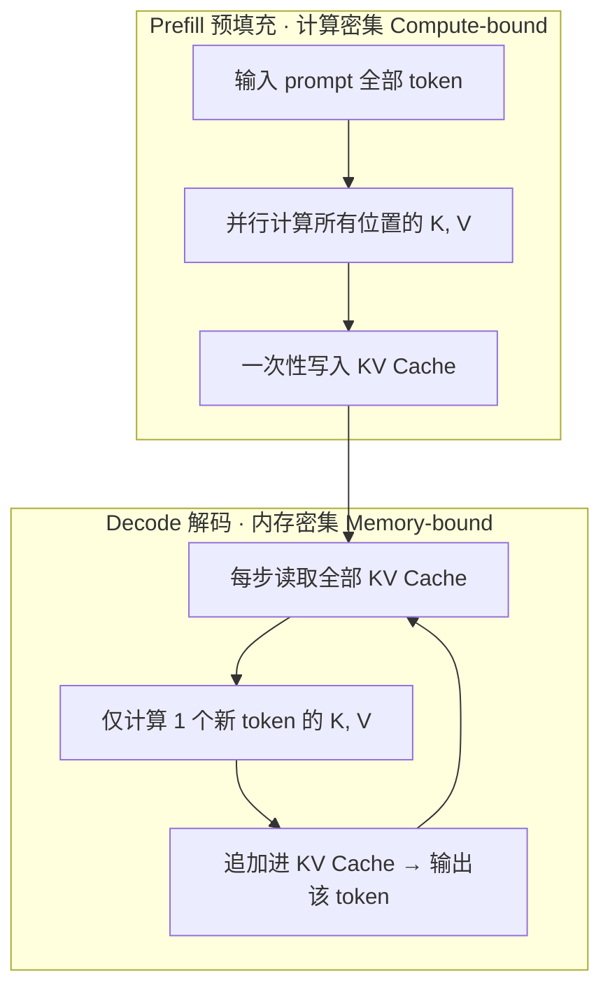

---

title: "LLM推理优化"

created: "2026-07-13"

tags:

  - 八股文

  - ai

---

# LLM推理优化

> 类比：LLM 推理像公司开会——Prefill 是开场把整份材料（prompt）一次性过一遍，算得快但费劲（计算密集）；Decode 是逐条发言，每次都要重新翻阅整本会议记录（KV Cache），翻得慢就成了瓶颈（内存密集）。优化就是让「翻记录」更快、更省。

## 核心概念

LLM 推理优化的核心挑战是：**模型巨大（数十亿到万亿参数）、内存占用高、生成速度慢、成本高昂**。

优化目标：在保持模型质量的前提下，提升吞吐量、降低延迟、减少显存占用。

## 推理性能瓶颈分析

LLM 推理分为两个阶段，各有不同的性能瓶颈：

| 阶段 | 特点 | 瓶颈 |

| ------ | ------ | ------ |

| Prefill（预填充） | 处理整个输入 prompt，计算所有 token 的 KV | **计算密集型**（Compute-bound） |

| Decode（解码） | 逐 token 生成，每步只处理一个新 token | **内存密集型**（Memory-bound） |

Decode 阶段为什么是 memory-bound？因为每生成一个新 token，都需要读取整个 KV Cache，但只做少量计算。GPU 的算力远超内存带宽。

## KV Cache（关键值缓存）
### 基本原理

在 Transformer 的自回归生成中，每生成一个新 token，都需要与之前所有 token 计算注意力。但之前 token 的 Key 和 Value 不会改变，因此可以缓存起来避免重复计算。

```text

无 KV Cache（朴素实现）：

  步骤1：处理 [A] → 计算 K_A, V_A

  步骤2：处理 [A, B] → 重新计算 K_A, V_A, K_B, V_B

  步骤3：处理 [A, B, C] → 重新计算 K_A, V_A, K_B, V_B, K_C, V_C

  计算量：O(n² × d)

有 KV Cache：

  步骤1：处理 [A] → 计算 K_A, V_A，缓存

  步骤2：处理 [B] → 只计算 K_B, V_B，拼接缓存

  步骤3：处理 [C] → 只计算 K_C, V_C，拼接缓存

  计算量：O(n × d)（每步）

```

### Prefill 与 Decode 阶段对比



> Decode 阶段显存带宽成为瓶颈：每生成一个 token 都要从显存搬回整个 KV Cache，而计算量极小。因此 KV Cache 的容量与访问效率直接决定长上下文推理的可行性与速度。

### KV Cache 内存计算

KV Cache 内存占用公式：

$$KV\_Cache = 2 \times L \times n \times d \times b \times \text{bytes\_per\_param}$$

其中：

- L = 层数

- n = 序列长度

- d = 隐藏维度

- b = batch size

- 2 = Key 和 Value 两部分

**示例**：LLaMA-70B，128K 上下文，FP16，单条请求

- 2 × 80 × 128000 × 8192 × 1 × 2 bytes = **335 GB**

- 这就是为什么长上下文推理需要特殊优化

### KV Cache 优化技术

| 技术 | 原理 | 效果 |

| ------ | ------ | ------ |

| MQA（Multi-Query Attention） | 多个 head 共享一组 KV | KV Cache 减少到 1/h |

| GQA（Grouped-Query Attention） | 分组共享 KV | 折中方案，h/n_groups |

| KV Cache 量化 | 将 KV Cache 量化为 INT8/INT4 | 内存减少 50%-75% |

| KV Cache 驱逐 | 基于注意力分数驱逐不重要的 KV | 支持更长上下文 |

## 模型量化（Quantization）
### 量化原理

将模型参数从高精度（FP32/FP16）转换为低精度（INT8/INT4），减少内存占用和计算量。

| 精度 | 每参数字节数 | 相对 FP16 | 适用场景 |

| ------ | ------------ | ---------- | --------- |

| FP32 | 4 bytes | 1x | 训练 |

| FP16/BF16 | 2 bytes | 0.5x | 训练+推理 |

| INT8 | 1 byte | 0.25x | 推理 |

| INT4 | 0.5 byte | 0.125x | 边缘部署 |

### 主流量化方法
#### PTQ（Post-Training Quantization）

训练后量化，无需重新训练：

| 方法 | 原理 | 特点 |

| ------ | ------ | ------ |

| GPTQ | 基于 Hessian 矩阵的逐层量化 | 精度高，需要校准数据 |

| AWQ（Activation-aware Weight Quantization） | 保留对输出影响大的权重通道 | 对模型质量影响最小 |

| SqueezeLLM | 非均匀量化 + 稀疏存储 | 兼顾压缩率和精度 |

#### QAT（Quantization-Aware Training）

训练时模拟量化，在训练中学习低精度表示：

- 精度通常优于 PTQ

- 但需要完整的训练流程

- 适用于需要极致压缩的场景

### 量化对模型质量的影响

| 量化精度 | 中文任务影响 | 英文任务影响 | 代码任务影响 |

| --------- | ------------ | ------------ | ------------ |

| INT8 | 几乎无损 | 几乎无损 | 几乎无损 |

| INT4 (GPTQ) | 轻微下降 | 轻微下降 | 轻微下降 |

| INT4 (AWQ) | 极小下降 | 极小下降 | 极小下降 |

| INT3 | 明显下降 | 明显下降 | 明显下降 |

## 推测解码（Speculative Decoding）
### 基本思想

使用一个小模型（Draft Model）快速生成多个候选 token，然后用大模型（Target Model）并行验证。如果验证通过，一次就生成多个 token。

```text

传统自回归：

  t1 → t2 → t3 → t4 → t5（每步1个token，共5步）

推测解码：

  小模型快速生成：t1, t2, t3, t4, t5（5步，但每步很快）

  大模型并行验证：[✓, ✓, ✓, ✗, -]（1步，但并行计算）

  结果：一次获得3个正确token，从t4重新开始

```

### 关键优势

- **理论加速**：可达 2-3x（取决于验证通过率）

- **无损**：输出分布与直接使用大模型完全一致

- **可与 KV Cache 结合**：进一步提升效率

### Draft Model 选择

| 策略 | Draft Model 来源 | 优点 |

| ------ | ----------------- | ------ |

| 同族小模型 | LLaMA-7B 作为 LLaMA-70B 的 draft | 共享词表，兼容性好 |

| 独立小模型 | 专门训练的小模型 | 可针对特定任务优化 |

| 自草稿 | 用大模型自身的早期层 | 无需额外模型 |

| Medusa | 在大模型上加多个预测头 | 无需额外模型，多头并行 |

## Continuous Batching（连续批处理）
### 问题背景

传统 Static Batching 中，一个 batch 内的所有请求必须同时开始、同时结束。短请求必须等待最长请求完成，造成 GPU 资源浪费。

### 解决方案

Continuous Batching 允许在生成过程中动态加入新请求、移除已完成的请求。

```text

Static Batching：

  请求1：[████████████░░░░]  ← 短请求等待长请求

  请求2：[████████████████]

  请求3：[████░░░░░░░░░░░░]  ← 浪费大量 GPU 时间

  GPU利用率：40%

Continuous Batching：

  时间片1：[请求1, 请求2, 请求3]

  时间片2：[请求1, 请求2, 请求4]  ← 请求3完成，请求4加入

  时间片3：[请求1, 请求2, 请求5]  ← 请求4完成，请求5加入

  GPU利用率：85%

```

## PagedAttention（vLLM）
### 核心思想

借鉴操作系统的虚拟内存分页机制管理 KV Cache。

**传统问题**：KV Cache 需要连续内存分配，但序列长度未知，导致：

- 预分配过多内存 → 浪费

- 预分配过少内存 → 需要重新分配 → 碎片化

**PagedAttention 方案**：

- 将 KV Cache 分成固定大小的 Block

- 按需分配，无需连续内存

- 通过 Page Table 映射逻辑位置到物理 Block

### 效果对比

| 指标 | 传统实现 | vLLM (PagedAttention) |

| ------ | --------- | ---------------------- |

| 内存浪费 | 60%-80% | 4%（接近最优） |

| 吞吐量 | 基准 | 提升 2-4x |

| 并发请求数 | 受限于预分配 | 动态分配，支持更多并发 |

## FlashAttention
### 核心问题

标准注意力的内存访问模式：需要将完整的注意力矩阵 $S = QK^T$ 写入 HBM（高带宽内存），然后再读回来进行 softmax 和与 V 的乘法。

### 解决方案

FlashAttention 通过 **Tiling（分块）** 技术，将计算分块在 SRAM（片上缓存）中完成，避免将完整的注意力矩阵写入 HBM。

```text

标准注意力：

  Q, K, V → HBM → 计算 S=QK^T → HBM → softmax → HBM → O=PV

  HBM 读写次数：多次

FlashAttention：

  Q, K, V → HBM → SRAM（分块计算） → HBM（直接输出）

  HBM 读写次数：大幅减少

```

### 性能提升

| 指标 | 标准注意力 | FlashAttention |

| ------ | ---------- | --------------- |

| 内存使用 | O(n²) | O(n) |

| 运行速度 | 基准 | 2-4x 加速 |

| 最大序列长度 | 受限于显存 | 可处理更长序列 |

## 张量并行与流水线并行
### 张量并行（Tensor Parallelism）

将单个层的计算分布到多个 GPU 上：

```text

线性层 Y = XW 的张量并行：

GPU 0：Y_0 = X @ W[:, :half]  →  Y_0

GPU 1：Y_1 = X @ W[:, half:]  →  Y_1

结果：Y = [Y_0, Y_1]（拼接）

```

适用场景：层内计算量大，层间通信频繁。

### 流水线并行（Pipeline Parallelism）

将模型的不同层分配到不同 GPU 上：

```text

GPU 0：Layer 0-11 → 输出传递给 GPU 1

GPU 1：Layer 12-23 → 输出传递给 GPU 2

GPU 2：Layer 24-35 → 输出传递给 GPU 3

GPU 3：Layer 36-47 → 最终输出

```

适用场景：模型太大无法放入单个 GPU，层间通信开销可控。

## 综合优化策略

| 优化技术 | 延迟优化 | 吞吐优化 | 显存优化 | 实现难度 |

| --------- | --------- | --------- | --------- | --------- |

| KV Cache | ★★★ | ★★ | ★★ | 低 |

| INT8 量化 | ★★ | ★★★ | ★★★ | 低 |

| INT4 量化 | ★ | ★★★ | ★★★ | 中 |

| 推测解码 | ★★★ | ★ | ★ | 中 |

| Continuous Batching | ★ | ★★★ | ★ | 中 |

| PagedAttention | ★ | ★★★ | ★★★ | 高 |

| FlashAttention | ★★★ | ★★ | ★★★ | 高（但有库） |

| 张量并行 | ★ | ★★ | ★★ | 高 |

| 流水线并行 | ★ | ★★ | ★★ | 高 |

## 速记卡（面试闪卡）

**Q1：一句话讲清「LLM推理优化」到底是什么？**

A：LLM 推理优化是在保质量前提下，提升吞吐量、降延迟、减显存的一系列技术。

**Q2：推理性能瓶颈分析 —— 怎么理解？**

A：推理分两阶段各有瓶颈：Prefill(预填充)一次性算整个 prompt 所有 token 的 KV，是计算密集型(Compute-bound)；Decode(解码)逐 token 生成、每步只算一个新 token 却要读整个 KV Cache，GPU 算力远超带宽，是内存密集型(Memory-bound)。类比：开会开场过材料快但费劲，逐条发言慢在翻记录。

**Q3：KV Cache（关键值缓存） —— 怎么理解？**

A：自回归每出新 token 都要和之前所有 token 算注意力，但之前 Key/Value 不变，缓存避免重复算，每步复杂度从 O(n²×d) 降到 O(n×d)。代价是显存怪兽：LLaMA-70B+128K+FP16 单条约 335GB，所以长上下文必优化。省显存手段：MQA 共享一组 KV(减到 1/h)、GQA 分组、KV 量化 INT8/INT4(省 50–75%)、按注意力分数驱逐不重要 KV。

**Q4：模型量化（Quantization） —— 怎么理解？**

A：把参数从 FP32/FP16 降精度到 INT8/INT4，直接减显存算力。INT8 几乎无损适合推理；INT4 适合边缘部署质量略降。两类：PTQ 训练后量化无需重训(GPTQ 基于 Hessian 逐层、AWQ 保留对输出影响大的权重通道质量最好、SqueezeLLM 非均匀+稀疏)；QAT 量化感知训练精度更优但要完整训练。

**Q5：推测解码（Speculative Decoding） —— 怎么理解？**

A：小模型(Draft)快速起草多个候选 token，大模型(Target)一次并行验证，通过就一次性拿多个 token。三优点：理论加速 2–3x(看通过率)、无损(拒绝采样保证输出分布与大模型完全一致)、可和 KV Cache 结合。Draft 可选同族小模型、独立小模型、自草稿(用大模型早期层)、Medusa(加预测头并行)。

**Q6：核心速记主线有哪些？**

- 两阶段瓶颈：Prefill 计算密集 / Decode 内存密集

- KV Cache：缓存 Key/Value 降复杂度，但显存怪兽

- 量化：PTQ(GPTQ/AWQ)无损减压，QAT 更优

- 提速：推测解码无损 2–3x + Continuous Batching + PagedAttention

**口诀**

A：Prefill 算得狠，Decode 搬得慢

KV Cache 先缓存，量化压体积

推测解码小带大，无损快三倍

连续批加 PagedAttention，Flash 分块切多卡

## 相关链接

- [[八股文学习路线图]]

- [[00-全局导航|全局导航]]

## 常见问题

| 问题 | 回答要点 |

| ------ | --------- |

| 什么是 KV Cache？它解决了什么问题？ | KV Cache 缓存了之前 token 的 Key 和 Value，避免自回归生成时重复计算。它将每步的计算复杂度从 O(n²×d) 降低到 O(n×d)，是 LLM 推理的基础优化。 |

| 推理时为什么 Decode 阶段是 memory-bound？ | Decode 阶段每步只生成一个 token，但需要读取整个 KV Cache（可能数百 GB）。计算量很小但内存读取量巨大，GPU 的内存带宽成为瓶颈。 |

| FlashAttention 如何加速注意力计算？ | 通过 Tiling 技术将注意力计算分块在 SRAM 中完成，避免将 O(n²) 的注意力矩阵写入 HBM。减少了 HBM 的读写次数，显著降低内存访问延迟。 |

| GPTQ 和 AWQ 的核心区别是什么？ | GPTQ 基于 Hessian 矩阵进行逐层最优量化，追求全局最优；AWQ 关注激活值分布，保留对输出影响大的权重通道，更注重模型质量保持。AWQ 通常质量略优。 |

| 推测解码为什么是无损的？ | 推测解码通过拒绝采样（Rejection Sampling）保证输出分布与大模型一致。小模型生成的 token 被大模型验证，不满足分布的 token 被拒绝并重新采样。 |

| vLLM 的 PagedAttention 解决了什么问题？ | 解决了 KV Cache 的内存碎片化问题。借鉴 OS 虚拟内存的分页机制，将 KV Cache 分成固定大小的 Block 按需分配，消除了内存浪费，支持更多并发请求。 |

| Continuous Batching 相比 Static Batching 的优势？ | Static Batching 中短请求必须等待最长请求完成，造成 GPU 资源浪费。Continuous Batching 允许在生成过程中动态加入/移除请求，显著提升 GPU 利用率和吞吐量。 |

| 张量并行和流水线并行的适用场景有何不同？ | 张量并行将单层计算分布到多 GPU，适合层内通信频繁、显存不足的场景；流水线并行将不同层分配到不同 GPU，适合模型太大无法放入单 GPU、层间通信可控的场景。 |

