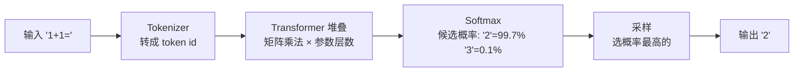
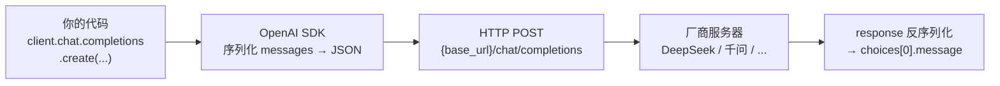
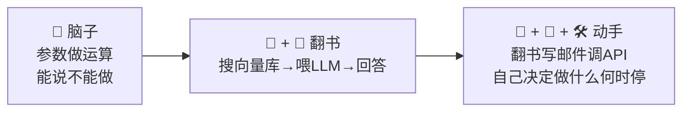
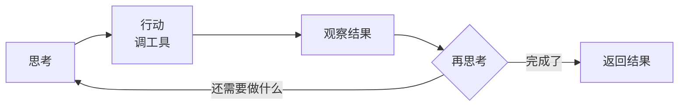
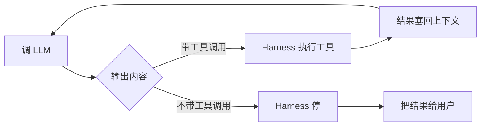
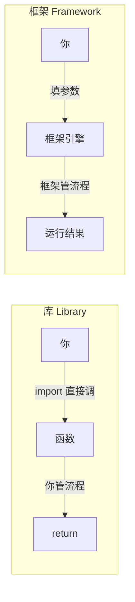

---

title: "LLM 本质 + API 调用封装（OpenAI SDK、流式 vs 非流式）"

created: "2026-07-21"

tags:

  - 技术学习

  - ai

  - llm

---

# LLM 本质 + API 调用封装（OpenAI SDK、流式 vs 非流式）

> **一句话**：LLM 本质是参数化统计模型，API 调用不过是一次 HTTP 请求——但工程上需封装流式/非流式、重试、并发、结构化输出等生产级细节。

---

## 一、LLM 的本质

学了 Token、Temperature、System Prompt，知道怎么用，但 LLM 底层到底是什么？

### 参数 = 数字

不是比喻。DeepSeek V4 Flash ≈ 2840 亿个数字，存成一个几百 GB 的文件。

```text

参数文件里全是这样的数字:

  0.02341

  -0.00152

  0.98723

  ... × 2840 亿个

```

### 推理 = 数学运算



没有思考，没有逻辑模块，从头到尾就是数学运算。

### 训练学的是什么

不是学"事实"，是学"统计规律"——给定上文，下一个字大概率是什么。

```text

学了:

  "今天天气真__" → 后面大概率接"好/差/热"

  "def quick_sort(" → 该接参数列表和冒号

  "因为下雨所以地上" → "湿"概率远高于"干"

没学:

  你公司的退款规则、今天的新闻、你的个人偏好

  → 训练数据里没有的东西，它不知道

```

"推理"是副产品。训练数据里有太多人写的推理过程（论文、代码、教科书……），模型把"推理文本的模式"也学进去了。当你给它一个需要推理的问题，参数被调成的状态恰好能走完那个推理模式——于是你看到了"它在推理"。

> [!note] LLM 的参数记的是"全世界文本的统计规律"，不是"知识条目列表"。复杂推理只是模式补全的副作用。

### API 调用的物理过程

你在 Python 里调 `client.chat.completions.create()`，实际发生了：

```text

你的 Python 脚本

  → openai 库把 messages 序列化成 JSON

  → 操作系统建立 TCP/TLS 连接到 api.deepseek.com

  → HTTP POST，API Key 在 Header 里（加密的）

  → 互联网路由到 DeepSeek 数据中心

  → 负载均衡器分到一台空闲 GPU 服务器（装了 8 张 H100 显卡）

  → GPU 加载模型参数到显存，跑推理，逐个生成 token

  → 结果原路返回 → 你的 Python 进程拿到 response

```

**全程就是一次 HTTP 请求。所有兼容 OpenAI 的厂商，底层都是 HTTP + JSON。**

### Transformer 一句话

LLM 骨架是 **Transformer = Self-Attention + Feed-Forward**。Attention 让每个词看到所有其他词，Feed-Forward 是每个 token 独立消化信息。叠多层形成深层理解。

### 自回归生成

LLM 生成方式叫 **Autoregressive（自回归）**：一次生成一个 token，下一个 token 依赖所有已生成的 token。上下文越长，Attention 计算量 O(n²) 越大。

### 预训练 vs 微调 vs 推理

| 环节 | 干什么 | 数据量 | 硬件 |

|------|--------|--------|------|

| **预训练** | 从零学语言规律 | TB 级文本 | 几千张 GPU，几个月 |

| **微调** | 学特定任务/风格 | 几百~几万条 | 1~8 张 GPU，几小时 |

| **推理** | 用已有参数回答问题 | 0 | 1 张 GPU，几秒 |

---

## 二、LLM API 调用
### 选哪个 API？DeepSeek vs 通义千问

| 维度 | DeepSeek V4 | 通义千问 (Qwen 3.7) |

|------|-------------|---------------------|

| **注册地址** | platform.deepseek.com | 阿里云百炼控制台 |

| **API 兼容性** | ✅ 完全兼容 OpenAI SDK | ✅ 完全兼容 OpenAI SDK |

| **免费额度** | 注册即送少量余额 | 新用户有免费额度 |

| **Python 调用** | 改 `base_url` 即可 | 改 `base_url` 即可 |

| **推荐模型** | `deepseek-v4-pro`（旗舰）| `qwen3.7-plus`（均衡） |

| **特色** | 1M token 超长上下文 | 多模态/联网搜索/超长文本 |

> [!warning] 两个 API 都兼容 OpenAI SDK！你只需要改 3 个参数：`api_key`、`base_url`、`model`。**不学厂商私有 SDK**，一把 `openai` 库吃遍天。

### 注册 & 获取 Key

**DeepSeek**：

1. 打开 [platform.deepseek.com](https://platform.deepseek.com) → 注册账号

2. 左侧 → **API Keys** → 创建新 Key，复制保存（只显示一次！）

3. 充值几块钱够用很久（国内支付宝）

4. Base URL: `https://api.deepseek.com`

**通义千问（阿里云百炼）**：

1. 打开 [阿里云百炼控制台](https://modelstudio.console.alibabacloud.com) → 登录阿里云账号

2. 左侧 → **API密钥管理** → 创建密钥

3. Base URL: `https://dashscope.aliyuncs.com/compatible-mode/v1`

### Python 调用 DeepSeek（完整例子）

```bash

pip install openai

```

```python

import os

from openai import OpenAI

# ① 创建客户端 — 改 base_url 就能用 DeepSeek

client = OpenAI(

    api_key=os.environ["DEEPSEEK_API_KEY"],  # 从环境变量读，别硬编码！

    base_url="https://api.deepseek.com",      # 唯一和 OpenAI 不同的地方

)

# ② 发起对话 — 和 OpenAI 完全一样的调用方式

response = client.chat.completions.create(

    model="deepseek-v4-pro",

    messages=[

        {"role": "system", "content": "你是专业的 Python 工程师，只回答代码问题。"},

        {"role": "user", "content": "用 Python 写一个斐波那契数列函数"},

    ],

    temperature=0.0,  # 代码生成 → 温度拉到最低，要精确

    stream=False,

)

# ③ 提取回复

answer = response.choices[0].message.content

print(answer)

```

### 🔧 手写封装函数

```python

import os

from openai import OpenAI

def call_llm(

    user_prompt: str,

    system_prompt: str = "你是一个有帮助的助手",

    model: str = "deepseek-v4-pro",

    temperature: float = 0.0,

    stream: bool = False,

) -> str:

    """

    通用 LLM 调用封装，兼容 OpenAI / DeepSeek / 千问等一切 OpenAI 兼容 API。

    换厂商只要改 client 初始化的 api_key 和 base_url。

    """

    client = OpenAI(

        api_key=os.environ["DEEPSEEK_API_KEY"],

        base_url="https://api.deepseek.com",

    )

    messages = [

        {"role": "system", "content": system_prompt},

        {"role": "user", "content": user_prompt},

    ]

    response = client.chat.completions.create(

        model=model,

        messages=messages,

        temperature=temperature,

        stream=stream,

    )

    if stream:

        full_answer = ""

        for chunk in response:

            delta = chunk.choices[0].delta

            if hasattr(delta, "content") and delta.content:

                print(delta.content, end="", flush=True)

                full_answer += delta.content

        print()

        return full_answer

    else:

        return response.choices[0].message.content

```

### ❌ 常见错误 vs ✅ 正确写法

```python

# ❌ 错误1：API Key 硬编码在代码里

client = OpenAI(api_key="sk-abc123...")

# ✅ 正确：从环境变量读取

import os

client = OpenAI(api_key=os.environ["DEEPSEEK_API_KEY"])

# ❌ 错误2：代码生成用高温

response = client.chat.completions.create(

    model="deepseek-v4-pro",

    messages=[{"role": "user", "content": "写一个快排"}],

    temperature=1.2,

)

# ✅ 正确：代码/JSON 场景用 temperature=0

response = client.chat.completions.create(

    model="deepseek-v4-pro",

    messages=[{"role": "user", "content": "写一个快排"}],

    temperature=0.0,

)

# ❌ 错误3：不设 max_tokens，让 AI 无限输出

response = client.chat.completions.create(

    model="deepseek-v4-pro",

    messages=[{"role": "user", "content": "写一篇小说"}],

)

# ✅ 正确：限制最大输出长度

response = client.chat.completions.create(

    model="deepseek-v4-pro",

    messages=[{"role": "user", "content": "写一篇小说"}],

    max_tokens=500,

)

```

### 流式 vs 非流式：什么时候用哪个？

| 维度 | 非流式 `stream=False` | 流式 `stream=True` |

|------|----------------------|---------------------|

| **用户体验** | 憋半天一次性吐出来 | 一个字一个字蹦，像 ChatGPT |

| **等待时间** | 等全部生成完（10~30s） | 首字延迟 ~200ms，后续持续输出 |

| **代码复杂度** | ⭐ 简单 | ⭐⭐ 需要遍历 chunk |

| **适用场景** | 批量处理、后端 API、定时任务 | 聊天界面、前端展示、长内容 |

### OpenAI SDK 兼容原理

OpenAI SDK 把 messages 序列化成 JSON → HTTP POST 到 `{base_url}/chat/completions` → 解析 JSON 响应。



所有兼容 OpenAI 的厂商，只要响应体结构一样，客户端就能直接换。

### 流式调用的底层——SSE 协议

流式不是"WebSocket 长连接"，而是 **SSE（Server-Sent Events）**——HTTP 长连接，server 持续往同一个连接里写数据块。

```text

非流式响应：

  ← {"choices":[{"message":{"content":"完整的一段话"}}]}

流式响应（SSE）：

  ← data: {"choices":[{"delta":{"content":"这"}}]}

  ← data: {"choices":[{"delta":{"content":"是"}}]}

  ← data: {"choices":[{"delta":{"content":"流"}}]}

  ← data: {"choices":[{"delta":{"content":"式"}}]}

  ← data: [DONE]

```

每行 `data: ...` 是一个 chunk，客户端逐个拼接。`[DONE]` 标记结束。

#### 生产者-消费者模式——流式转生成器

```python

def stream_response(prompt: str):

    """把流式 API 包装成一个生成器，逐 chunk 产出"""

    client = OpenAI(api_key=os.environ["DEEPSEEK_API_KEY"],

                    base_url="https://api.deepseek.com")

    response = client.chat.completions.create(

        model="deepseek-v4-pro",

        messages=[{"role": "user", "content": prompt}],

        stream=True,

    )

    for chunk in response:

        delta = chunk.choices[0].delta

        if delta and delta.content:

            yield delta.content

# 调用方：可以逐段处理，不用等全部生成完

for chunk in stream_response("写一篇 500 字文章"):

    print(chunk, end="", flush=True)

```

#### 超时 / 重试 / 退避

生产环境绝对不能裸调 API。网络抖动、服务器过载、限流——都要处理。

```python

from openai import OpenAI, APITimeoutError, RateLimitError, APIStatusError

import time

def call_llm_with_retry(

    prompt: str,

    model: str = "deepseek-v4-pro",

    max_retries: int = 3,

    timeout: int = 30,

) -> str:

    client = OpenAI(

        api_key=os.environ["DEEPSEEK_API_KEY"],

        base_url="https://api.deepseek.com",

        timeout=timeout,             # 总超时

        max_retries=max_retries,     # 自动重试次数

    )

    try:

        response = client.chat.completions.create(

            model=model,

            messages=[{"role": "user", "content": prompt}],

            temperature=0.0,

        )

        return response.choices[0].message.content

    except APITimeoutError:

        return "[Error: 请求超时]"

    except RateLimitError:

        return "[Error: 触发限流，请稍后再试]"

    except APIStatusError as e:

        return f"[Error: API 返回 {e.status_code}]"

```

| 异常类型 | 触发条件 | 处理方式 |

|---------|---------|---------|

| `APITimeoutError` | 网络不通 / 服务器超时 | 重试 + 指数退避 |

| `RateLimitError` | 请求太频繁，触发额度限制 | 等待 + 降速 |

| `APIStatusError` | 服务端错误（500） | 重试，但限制次数 |

| `APIConnectionError` | DNS / TLS 连接失败 | 检查网络 / base_url |

> **工程铁律**：OpenAI SDK 的 `max_retries` 默认就用退避算法，但只在 500 / 429 / 网络错误时重试。**4xx 客户端错误（400/401/403）不重试**——那是你代码写错了，重试一万遍也没用。

#### 并发控制——别被 API 限流

```python

import asyncio

from openai import AsyncOpenAI

async_client = AsyncOpenAI(

    api_key=os.environ["DEEPSEEK_API_KEY"],

    base_url="https://api.deepseek.com",

)

async def ask_llm(prompt: str) -> str:

    response = await async_client.chat.completions.create(

        model="deepseek-v4-pro",

        messages=[{"role": "user", "content": prompt}],

        temperature=0.0,

    )

    return response.choices[0].message.content

# 并发 5 个请求

prompts = ["问题1", "问题2", "问题3", "问题4", "问题5"]

results = await asyncio.gather(*[ask_llm(p) for p in prompts])

```

> **工程铁律**：并发量要看厂商限流文档。DeepSeek 免费用户 ≈ 10 RPM（每分钟请求数），加钱才能升。`asyncio.Semaphore` 做本地限流。

#### Token 用量追踪——不记账你永远不知道花了多少

```python

response = client.chat.completions.create(

    model="deepseek-v4-pro",

    messages=[{"role": "user", "content": "写一个快排"}],

)

print(f"输入 tokens:   {response.usage.prompt_tokens}")        # 送进去多少

print(f"输出 tokens:   {response.usage.completion_tokens}")      # 吐出来多少

print(f"总计 tokens:   {response.usage.total_tokens}")           # 总和

# 估算费用（DeepSeek ≈ ¥1 / 1M token，仅供参考）

cost = response.usage.total_tokens / 1_000_000 * 1

print(f"预估费用:      ¥{cost:.6f}")

```

> **工程铁律**：每次 API 响应都必含 `usage` 字段。线上记录到日志，月终算总账。**别等欠费了才发现代码死循环在调 API。**

#### 结构化输出——JSON Mode / Response Format

不用正则从自然语言里"拆" JSON：

```python

response = client.chat.completions.create(

    model="deepseek-v4-pro",

    messages=[{"role": "user", "content": "鲁迅原名是什么？"}],

    response_format={"type": "json_object"},  # 强制输出 JSON

)

import json

data = json.loads(response.choices[0].message.content)

# → {"answer": "周树人", "birth": "1881"}

```

> `response_format` 告诉模型"输出必须解析成合法 JSON"。不保证 schema 完全匹配你想要的——要想精确约束，用 **Function Calling**（后续 Agent 篇展开）。

### 通义千问同样调用（只改 3 行）

```python

client = OpenAI(

    api_key=os.environ["DASHSCOPE_API_KEY"],

    base_url="https://dashscope.aliyuncs.com/compatible-mode/v1",

)

response = client.chat.completions.create(

    model="qwen3.7-plus",

    messages=[...],

    temperature=0.0,

)

```

---

## 三、LLM vs RAG vs Agent — 三个层次

学了 Embedding，自然引出 RAG；RAG 再进一步就是 Agent。三者到底什么关系？



### RAG 的本质

LLM 不知道你的私有文档 → 你把文档 Embedding 存向量库 → 提问时搜相关段落 → 拼进 Prompt → LLM 照着回答。

关键澄清：

- **LLM 参数 ≠ 向量数据库**。两个完全独立的系统。LLM 参数记的是"训练时看过的公开文本的统计规律"；向量库是你自己搭的，存的是你传进去的私有文档坐标

- 喂给 LLM 的内容它**不会记住**。下次再问还得重新搜。RAG 喂进去的东西只在当次对话有效

- RAG 省钱不是因为"不用喂"，是因为"只喂相关的 500 字，不喂整本 100 万字"

**你平时手动贴上下文给我，本质上就是人肉 RAG**——你自己判断需要什么资料、自己翻文件、自己 Ctrl+V。RAG 就是把你这套动作自动化。

### Agent 的本质

把"调 LLM → 拿结果 → 判断下一步 → 再调 LLM"这个循环从你的代码搬进 LLM 自己的决策里。



不是 LLM 自己在循环。**Harness** 在跑循环，每次循环调一次 LLM：



Agent 没有新魔法。底层还是 LLM + 工具调用 + 循环。Prompt 教它怎么想，工具让它能动手，Harness 管着它不让它乱来。

### 框架 vs 库



| | openai 库 | LangChain（框架） |

|------|------|------|

| 调用 | `client.chat.completions.create()` | `llm.invoke("问题")` |

| 谁说了算 | 你决定什么时候调、怎么处理结果 | 框架内部跑完整个链 |

| 帮你省什么 | HTTP 封装、JSON 解析 | 切分策略、向量索引、Prompt 模板、重试、状态管理 |

### 主流框架一览

| 框架 | 定位 | 关系 |

|------|------|:----:|

| **LangChain** | RAG/Chain/Agent 全链路，1000+集成 | ✅ 主线 |

| **LlamaIndex** | 专注数据索引+检索，比 LangChain 更擅长"怎么切、怎么搜" | 🟡 进阶可选 |

| **LangGraph** | 复杂 Agent 工作流编排，状态图 + 持久化 + 时间旅行调试 | 后续学习 |

| **CrewAI** | 角色扮演多 Agent，"研究员→写手→审核"流水线 | ❌ 暂时不用 |

| **AutoGen** | 微软，已进入维护模式 | ❌ 不推荐 |

---

##

> ▶ 对应原理：[[01-大语言模型LLM原理|01-大语言模型LLM原理]]

> ▶ 对应原理：[[05-Encoder-Only-vs-Decoder-Only架构对比|05-Encoder-Only-vs-Decoder-Only架构对比]]

> ▶ 对应原理：[[06-MHA-MQA-GQA多头注意力变体|06-MHA-MQA-GQA多头注意力变体]]

## 速记卡（面试闪卡）

**Q1：一句话讲清「LLM 本质 + API 调用封装（OpenAI SDK、流式 vs 非流式）」到底是什么？**

A：LLM 本质是参数化统计模型，API 调用只是一次 HTTP 请求，工程上需封装流式/重试/并发等细节。

**Q2：一、LLM 的本质 —— 怎么理解？**

A：像几千亿个数字的算式本：参数即数字、推理即矩阵乘法，学的是统计规律非事实（Transformer，变换器）。

**Q3：二、LLM API 调用 —— 怎么理解？**

A：像打一次电话：SDK 把 messages 序列化 JSON、TLS 连厂商 POST，只改 api_key/base_url/model 三参数（OpenAI SDK）。

**Q4：三、LLM vs RAG vs Agent — 三个层次 —— 怎么理解？**

A：像脑子到翻书到动手：LLM 能说不能做、RAG 加检索、Agent 加工具循环，真正跑循环的是 Harness（Harness，脚手架）。

**Q5：流式与非流式调用 —— 怎么理解？**

A：像憋完对比逐字蹦：流式 SSE 首字约 200ms 适合聊天，非流式憋 10–30s 适合批量（Server-Sent Events，SSE）。

**Q6：核心速记主线有哪些？**

- LLM 本质：参数等于数字、推理等于数学、学统计规律非事实

- API 封装：即 HTTP 加 JSON，只改三参数，别硬编码 Key

- 流式对比非流式：SSE 逐字对比憋完吐

- 三层：LLM/RAG/Agent 递进，Harness 跑循环

**口诀**

A：LLM 是统计模型，参数数字推理算数；

API 即 HTTP，只改三参数；

流式 SSE 逐字蹦，非流式憋完吐；

RAG 翻书 Agent 动手，Harness 跑循环。

相关链接

- 目录：[[00-AI]]

- 上一篇：[[01-Token计费原理-Temperature控制-SystemPrompt层级]]

- 下一篇：[[03-多模型后端抽象]]

---

→ [[技术学习路线图#LLM 基础]]

## 相关链接

- [[笔记/AI与Agent/知识/实战/15-Agent架构与工具调用|Agent架构与工具调用]]

- [[笔记/AI与Agent/知识/实战/17-工具系统：定义→注册→发现→调用|工具系统：定义→注册→发现→调用]]

- [[笔记/AI与Agent/知识/实战/11-AgenticRAG：LLM主动决策多次检索vs传统单次被动检索|Agentic RAG：LLM 主动决策多次检索 vs 传统单次被动检索]]

- [[笔记/AI与Agent/知识/实战/35-重复状态识别：避免Agent反复读同一文件或重复调用同一工具|重复状态识别：避免Agent反复读同一文件或重复调用同一工具]]

- [[笔记/AI与Agent/知识/实战/44-LangChain框架入门|LangChain框架入门]]

