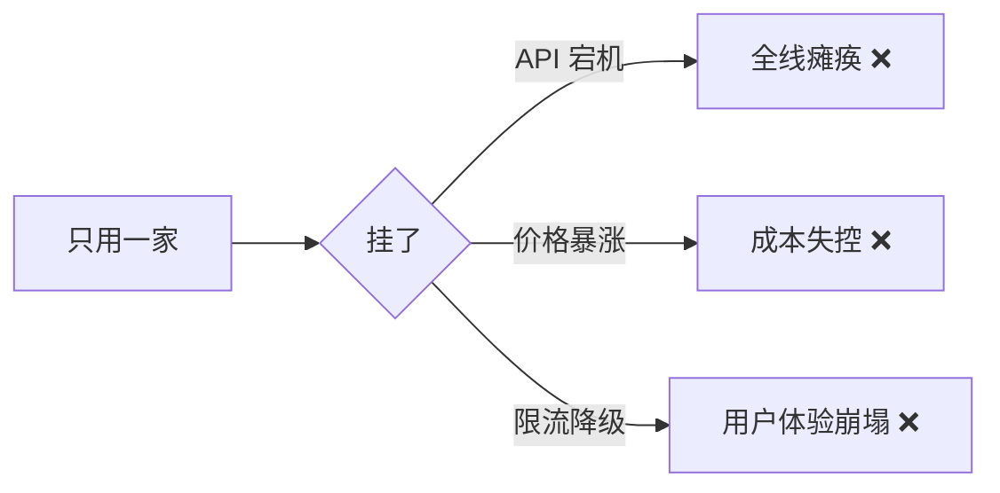
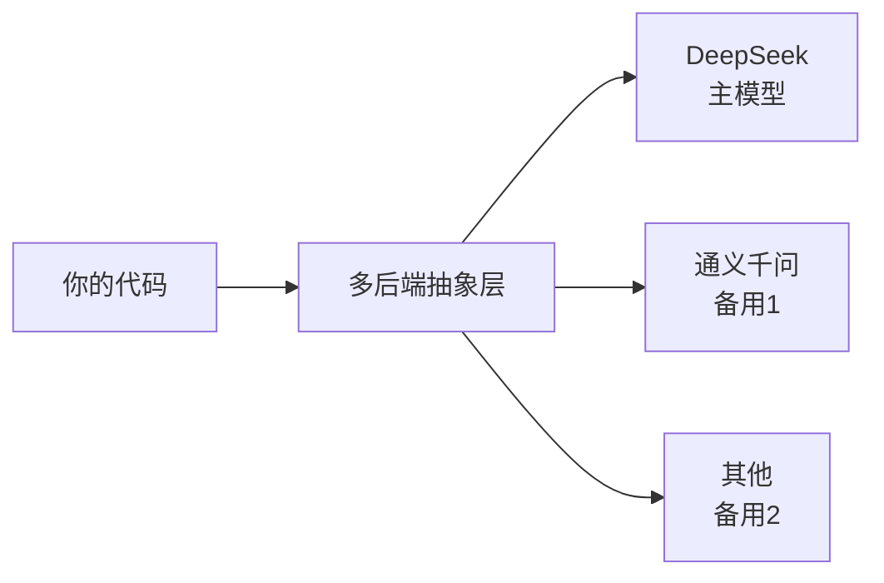
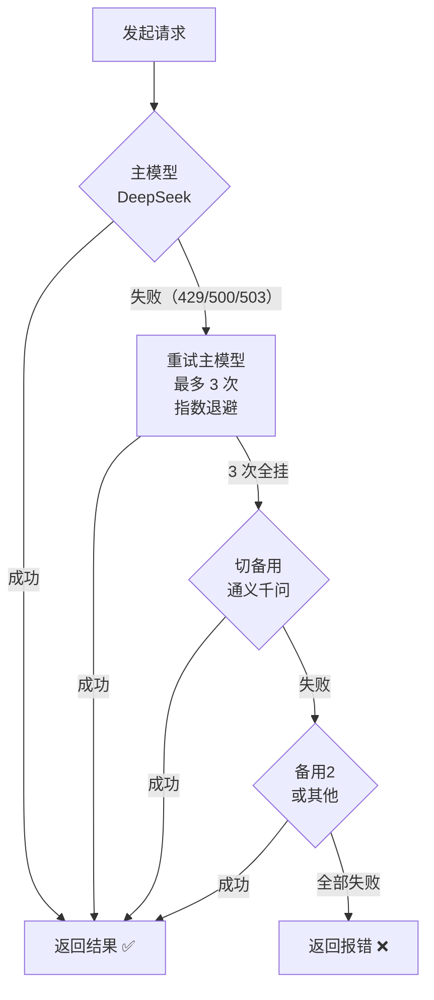

# 多模型后端抽象：统一请求格式、响应结构、错误码、重试/回退逻辑

> **一句话**：生产环境不能只用一家模型——多后端抽象层统一请求/响应/错误码，配合指数退避与自动回退，实现无感换厂商。

---

## 一、为什么需要多后端抽象？

你在生产环境不可能只用一家模型。原因：



**铁律**：生产环境至少配 2~3 家后端，默认走主模型，挂了自动切备用。



上层代码永远不直接调 `OpenAI()`，而是调你的抽象层——```call_model(...)```。

---

## 二、统一请求格式——所有后端长一个样

OpenAI 兼容 API 的请求体都长这样：

```python
request_body = {
    "model": "模型名",          # 各家不同，抽象层自动映射
    "messages": [               # 完全一致
        {"role": "system", "content": "你是个助手"},
        {"role": "user", "content": "你好"},
    ],
    "temperature": 0.7,         # 完全一致
    "max_tokens": 1024,         # 完全一致
    "stream": False,            # 完全一致
    # top_p, stop, tools 等也是共通的
}
```

不同厂商的核心区别只有三个参数：

| 参数 | DeepSeek | 通义千问 | 说明 |
|------|----------|---------|------|
| `api_key` | `DEEPSEEK_API_KEY` | `DASHSCOPE_API_KEY` | 环境变量名不同 |
| `base_url` | `https://api.deepseek.com` | `https://dashscope.aliyuncs.com/compatible-mode/v1` | 请求端点不同 |
| `model` | `deepseek-v4-pro` / `deepseek-v4-flash` | `qwen3.7-plus` / `qwen3.7-turbo` | 模型 ID 不同 |

**抽象层要做的事**：接收统一参数 → 查当前后端配置 → 注入对应的 `api_key` / `base_url` / `model`。

---

## 三、统一响应结构——不管谁家，拿到手的格式一样

所有 OpenAI 兼容后端的响应体也一样：

```python
# 非流式响应结构（所有厂商一致）
response = {
    "id": "chatcmpl-xxx",
    "object": "chat.completion",
    "created": 1700000000,
    "model": "deepseek-v4-pro",
    "choices": [
        {
            "index": 0,
            "message": {
                "role": "assistant",
                "content": "你好！有什么可以帮你的？",
            },
            "finish_reason": "stop",  # stop / length / tool_calls / content_filter
        }
    ],
    "usage": {
        "prompt_tokens": 20,
        "completion_tokens": 10,
        "total_tokens": 30,
    }
}

# 流式 chunk 结构
chunk = {
    "choices": [
        {
            "delta": {"content": "你"},
            "index": 0,
        }
    ]
}
```

**你的抽象层要返回统一的 Python 对象**，而不是各家原始 JSON：

```python
@dataclass
class ModelResponse:
    content: str                         # 提取后的文本
    finish_reason: str                   # stop / length / tool_calls
    usage: dict | None                   # token 用量
    model: str                           # 实际使用的模型名
    raw: dict | None                     # 原始响应（调试用）
```

> **工程铁律**：上层代码只看 `ModelResponse.content`。永远不直接解析 `response.choices[0].message.content`——哪天换了厂商，你不需要改业务代码。

---

## 四、统一错误码——各家异常长一个样

不同厂商的错误码范围不完全相同，但 HTTP 状态码是对齐的：

| HTTP 状态码 | 含义 | 处理方式 |
|------------|------|---------|
| **400** | 请求格式错误 | ❌ 不重试，修代码 |
| **401** | API Key 无效 | ❌ 不重试，检查环境变量 |
| **402** | 余额不足 | ❌ 不重试，去充值 |
| **422** | 参数校验失败 | ❌ 不重试，修参数 |
| **429** | 触发限流 | ✅ 等待后重试 |
| **500** | 服务端错误 | ✅ 重试（有限次） |
| **503** | 服务过载 | ✅ 重试（有限次） |

你的抽象层要把各家 SDK 的异常**统一映射**：

```python
class BackendError(Exception):
    """所有后端异常的基类"""
    def __init__(self, message: str, status_code: int, backend: str):
        self.status_code = status_code
        self.backend = backend
        self.retryable = status_code in {429, 500, 503}
        super().__init__(f"[{backend}] {status_code}: {message}")
```

---

## 五、重试 / 回退逻辑——三板斧



**指数退避**：第 1 次失败等 1s，第 2 次 2s，第 3 次 4s……每次间隔翻倍，加随机抖动（jitter）防止所有客户端同时重试打爆服务器。

```python
import random
import time

def exponential_backoff(attempt: int, base: float = 1.0) -> float:
    """指数退避 + 随机抖动"""
    sleep = base * (2 ** attempt)           # 1s → 2s → 4s → 8s
    jitter = random.uniform(0, 0.5 * sleep) # 最多加 50% 随机
    return sleep + jitter
```

### 完整重试 / 回退实现

```python
import os
import time
import random
from openai import OpenAI, APITimeoutError, RateLimitError, APIStatusError

BACKENDS = {
    "deepseek": {
        "api_key": os.environ["DEEPSEEK_API_KEY"],
        "base_url": "https://api.deepseek.com",
        "models": ["deepseek-v4-pro", "deepseek-v4-flash"],
    },
    "qwen": {
        "api_key": os.environ["DASHSCOPE_API_KEY"],
        "base_url": "https://dashscope.aliyuncs.com/compatible-mode/v1",
        "models": ["qwen3.7-plus", "qwen3.7-turbo"],
    },
}

class BackendError(Exception):
    def __init__(self, message: str, status_code: int, backend: str):
        self.status_code = status_code
        self.backend = backend
        self.retryable = status_code in {429, 500, 503}
        super().__init__(f"[{backend}] {status_code}: {message}")

def call_model(
    messages: list,
    model: str = "deepseek-v4-pro",
    temperature: float = 0.0,
    max_tokens: int = 1024,
    max_retries: int = 3,
    backends: list | None = None,
) -> str:
    """
    统一多后端模型调用。

    参数：
        messages: 消息列表（统一格式）
        model: 首选模型 ID
        temperature: 温度
        max_tokens: 最大输出
        max_retries: 每个后端重试次数
        backends: 后端优先级列表，默认 ["deepseek", "qwen"]

    返回：
        模型输出的文本

    异常：
        所有后端都失败时抛出 BackendError
    """
    if backends is None:
        backends = ["deepseek", "qwen"]

    last_error = None

    for backend_name in backends:
        config = BACKENDS[backend_name]

        for attempt in range(max_retries + 1):
            try:
                client = OpenAI(
                    api_key=config["api_key"],
                    base_url=config["base_url"],
                    timeout=30,
                )

                response = client.chat.completions.create(
                    model=model if backend_name == "deepseek" else config["models"][0],
                    messages=messages,
                    temperature=temperature,
                    max_tokens=max_tokens,
                )

                return response.choices[0].message.content

            except (APITimeoutError, APIStatusError) as e:
                status = getattr(e, "status_code", 500)
                last_error = BackendError(str(e), status, backend_name)

                if not last_error.retryable:
                    break  # 4xx 不重试，直接换后端

                if attempt < max_retries:
                    wait = exponential_backoff(attempt)
                    time.sleep(wait)

            except RateLimitError as e:
                last_error = BackendError(str(e), 429, backend_name)
                wait = exponential_backoff(attempt, base=2.0)
                time.sleep(wait)

        # 当前后端重试用完，切下一个

    raise last_error
```

---

## 六、配置驱动——不改代码换模型

所有后端配置应该从**环境变量或配置文件**读，而不是硬编码：

```python
import json
import os

# 从环境变量读 JSON 配置
BACKEND_CONFIG_JSON = os.environ.get("BACKEND_CONFIG", "{}")
BACKEND_CONFIG = json.loads(BACKEND_CONFIG_JSON)

# 示例环境变量值：
# BACKEND_CONFIG = '{"backends": ["qwen", "deepseek"], "default_model": "qwen3.7-plus"}'
```

---

## 七、流式场景的处理

流式下的多后端抽象稍复杂——需要把 SSE chunk 拼成统一 `ModelResponse`：

```python
def call_model_stream(messages: list, model: str = "deepseek-v4-pro"):
    """流式调用，返回生成器"""
    client = OpenAI(
        api_key=BACKENDS["deepseek"]["api_key"],
        base_url=BACKENDS["deepseek"]["base_url"],
    )

    response = client.chat.completions.create(
        model=model,
        messages=messages,
        stream=True,
    )

    full_content = ""
    for chunk in response:
        delta = chunk.choices[0].delta
        if delta and delta.content:
            full_content += delta.content
            yield delta.content  # 逐块产出

    # 流结束后，上层拿 full_content
```

> 你的 UI 层调 `call_model_stream`，拿到的是生成器——管你背后是 DeepSeek 还是千问，前端/用户无感知。

---

## 八、重试陷阱速查

| 陷阱 | 后果 | 解法 |
|------|------|------|
| 无 jitter 的退避 | 所有客户端同时重试，打爆服务器 | 加随机抖动 |
| 幂等性不检查 | 用户付款请求被重试两次→扣两次钱 | 只对 GET/只读操作自动重试 |
| 流式无法简单重试 | 用户等了一半断掉，重试要从头来 | 前端缓存已收到的内容，重试时传 `上次断点` |
| 超时设太大 | 一个后端卡 60s × 3 次 × 2 后端 = 6 分钟 | 单次超时 ≤ 30s，总耗时设上限 |

---

## 九、完整抽象类

```python
from dataclasses import dataclass, field
from typing import Generator
import os
import time
import random
from openai import OpenAI, APITimeoutError, RateLimitError, APIStatusError

@dataclass
class ModelResponse:
    content: str
    finish_reason: str = "stop"
    usage: dict | None = None
    model: str = ""
    backend: str = ""

class ModelRouter:
    """多模型后端抽象路由"""

    def __init__(self, config: dict | None = None):
        self.backends = config or {
            "deepseek": {
                "api_key": os.getenv("DEEPSEEK_API_KEY"),
                "base_url": "https://api.deepseek.com",
                "models": ["deepseek-v4-pro", "deepseek-v4-flash"],
            },
            "qwen": {
                "api_key": os.getenv("DASHSCOPE_API_KEY"),
                "base_url": "https://dashscope.aliyuncs.com/compatible-mode/v1",
                "models": ["qwen3.7-plus", "qwen3.7-turbo"],
            },
        }
        self.priority = ["deepseek", "qwen"]

    def _client(self, backend: str) -> OpenAI:
        cfg = self.backends[backend]
        return OpenAI(api_key=cfg["api_key"], base_url=cfg["base_url"], timeout=30)

    def _wait(self, attempt: int, base: float = 1.0):
        time.sleep(base * (2 ** attempt) + random.uniform(0, 0.5 * base * (2 ** attempt)))

    def chat(
        self,
        messages: list,
        model: str | None = None,
        temperature: float = 0.0,
        max_tokens: int = 1024,
        stream: bool = False,
        max_retries: int = 3,
    ) -> ModelResponse | Generator[str, None, str]:
        """统一调用入口"""

        if stream:
            return self._chat_stream(messages, model, temperature, max_tokens, max_retries)

        for backend_name in self.priority:
            cfg = self.backends[backend_name]
            client = self._client(backend_name)
            actual_model = model or cfg["models"][0]

            for attempt in range(max_retries + 1):
                try:
                    resp = client.chat.completions.create(
                        model=actual_model,
                        messages=messages,
                        temperature=temperature,
                        max_tokens=max_tokens,
                    )
                    choice = resp.choices[0]
                    return ModelResponse(
                        content=choice.message.content or "",
                        finish_reason=choice.finish_reason or "stop",
                        usage=dict(resp.usage) if resp.usage else None,
                        model=resp.model,
                        backend=backend_name,
                    )
                except (RateLimitError, APITimeoutError):
                    self._wait(attempt, base=2.0)
                except APIStatusError as e:
                    if e.status_code in (500, 503):
                        self._wait(attempt)
                    else:
                        break  # 4xx 不重试

        raise RuntimeError("所有后端均失败")

    def _chat_stream(self, messages, model, temperature, max_tokens, max_retries):
        """流式调用的生成器版本"""
        for backend_name in self.priority:
            cfg = self.backends[backend_name]
            client = self._client(backend_name)
            actual_model = model or cfg["models"][0]

            for attempt in range(max_retries + 1):
                try:
                    resp = client.chat.completions.create(
                        model=actual_model,
                        messages=messages,
                        temperature=temperature,
                        max_tokens=max_tokens,
                        stream=True,
                    )
                    for chunk in resp:
                        delta = chunk.choices[0].delta
                        if delta and delta.content:
                            yield delta.content
                    return  # 流式结束
                except (RateLimitError, APITimeoutError, APIStatusError):
                    if attempt < max_retries:
                        self._wait(attempt)
                    else:
                        break  # 这个后端彻底挂了
            # 切下一个后端重试
        raise RuntimeError("所有后端均失败")


# 使用
router = ModelRouter()
resp = router.chat(
    messages=[{"role": "user", "content": "讲个笑话"}],
    temperature=0.7,
)
print(resp.content)  # 统一的输出
```

## 
> ▶ 对应原理：[[03-自注意力机制与Transformer基础|03-自注意力机制与Transformer基础]]

相关链接

- 目录：[[00-AI]]
- 上一篇：[[02-LLM本质-API调用封装]]
- 下一篇：[[04-Embedding向量化原理+语义搜索场景]]
- 项目实践：[[项目实战/ai-resume笔记/01_技术研读/06_韧性工程#retry.py 逐行走读（49 行全量）|ai-resume: 韧性工程]]
- 项目实践：cr-agent: 三层容错

---
→ [[技术学习清单#LLM 基础]]

## 速记卡（面试闪卡）

**Q1：一句话讲清「多模型后端抽象：统一请求格式、响应结构、错误码、重试/回退逻辑」到底是什么？**
A：你在生产环境不可能只用一家模型。原因：
**铁律**：生产环境至少配 2~3 家后端，默认走主模型，挂了自动切备用。
上层代码永远不直接调 ，而是调你的抽象层——。
---

**Q2：一、为什么需要多后端抽象？ —— 怎么理解？**
A：你在生产环境不可能只用一家模型。原因：
**铁律**：生产环境至少配 2~3 家后端，默认走主模型，挂了自动切备用。
上层代码永远不直接调 ，而是调你的抽象层——。
---

**Q3：二、统一请求格式——所有后端长一个样 —— 怎么理解？**
A：OpenAI 兼容 API 的请求体都长这样：
不同厂商的核心区别只有三个参数：
| 参数 | DeepSeek | 通义千问 | 说明 |
|------|----------|---------|------|
|  |  |  | 环境变量名不同 |
|  |  |  | 请求端点不同 |
|  |  /  |  /  | 模型 ID 不同 |

**Q4：三、统一响应结构——不管谁家，拿到手的格式一样 —— 怎么理解？**
A：所有 OpenAI 兼容后端的响应体也一样：
**你的抽象层要返回统一的 Python 对象**，而不是各家原始 JSON：
**工程铁律**：上层代码只看 。永远不直接解析 ——哪天换了厂商，你不需要改业务代码。
---

**Q5：四、统一错误码——各家异常长一个样 —— 怎么理解？**
A：不同厂商的错误码范围不完全相同，但 HTTP 状态码是对齐的：
| HTTP 状态码 | 含义 | 处理方式 |
|------------|------|---------|
| **400** | 请求格式错误 | ❌ 不重试，修代码 |
| **401** | API Key 无效 | ❌ 不重试，检查环境变量 |
| **402** | 余额不足 | ❌ 不重试，去充值 |

**Q6：核心速记主线有哪些？**
A：抓住这几根：一、为什么需要多后端抽象？、二、统一请求格式——所有后端长一个样、三、统一响应结构——不管谁家，拿到手的格式一样、四、统一错误码——各家异常长一个样、五、重试 / 回退逻辑——三板斧、六、配置驱动——不改代码换模型。

