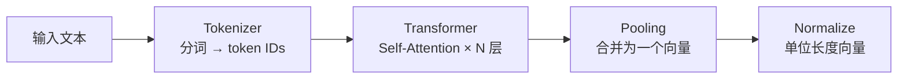
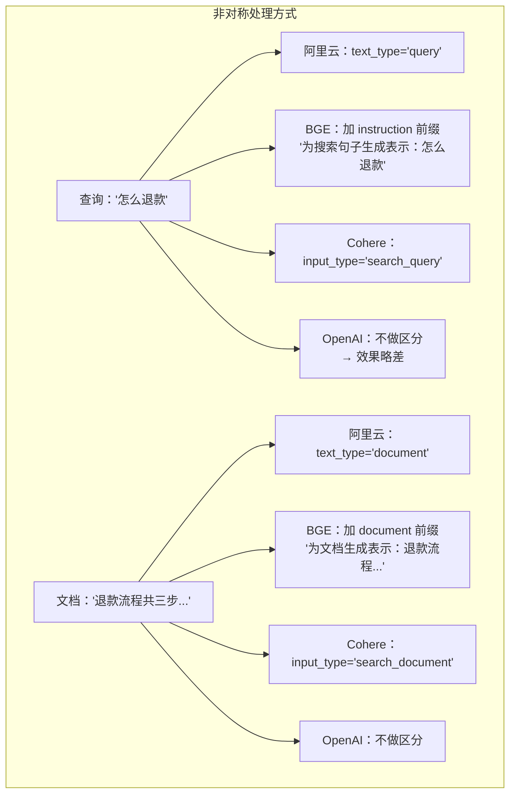
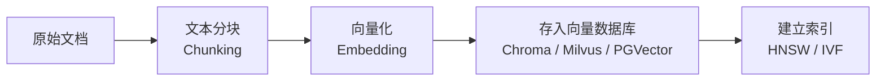
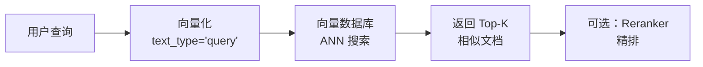
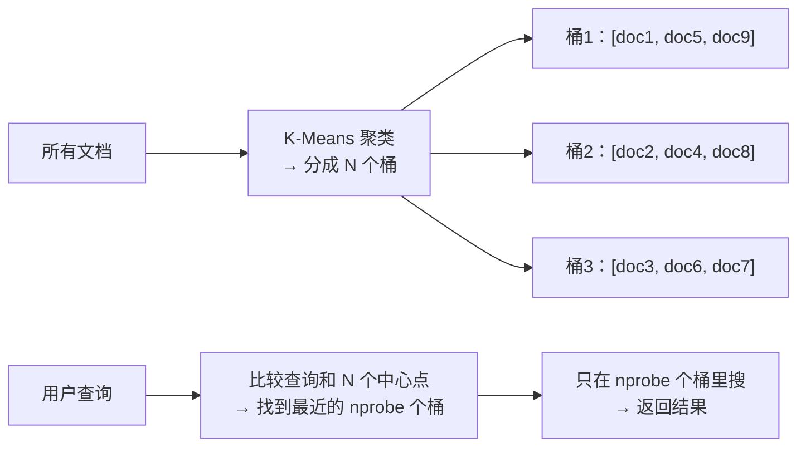
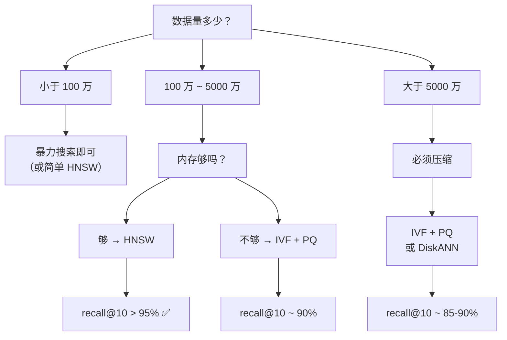
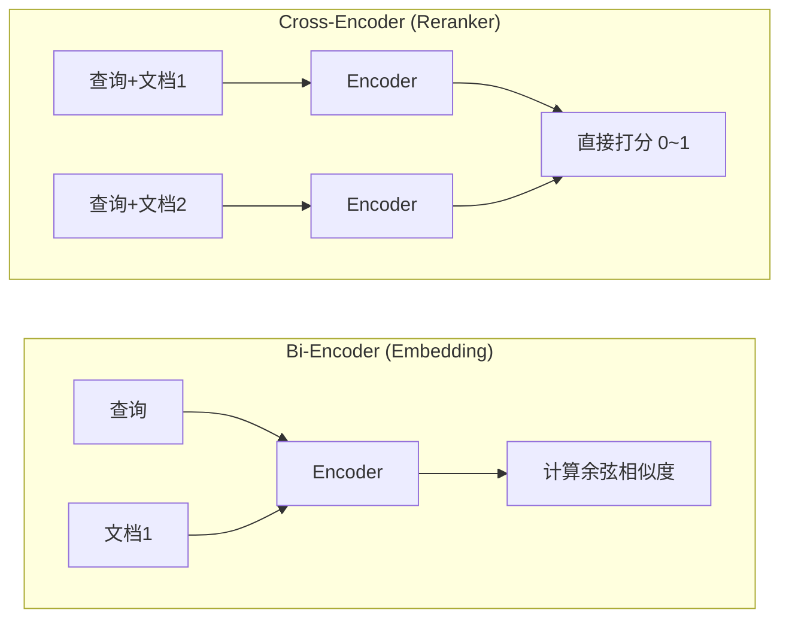
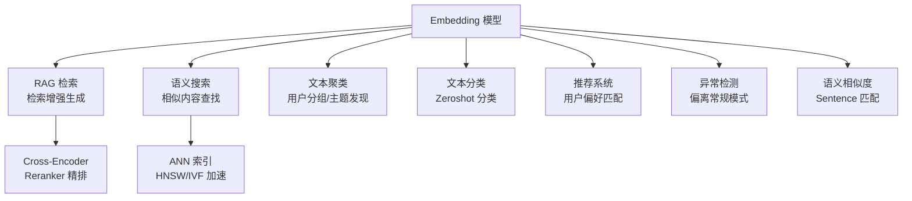

---

title: "Embedding 向量化原理 + 语义搜索场景"

created: "2026-07-15"

tags:

  - 技术学习

  - ai

  - embedding

  - 语义搜索

---

# Embedding 向量化原理 + 语义搜索场景

---

## 一、一句话理解

> Embedding 就是把"意思"变成"位置"——让语义相近的文字在高维空间里挨着，语义无关的文字离得远。

```text

"猫"   → [0.12, -0.45,  0.78,  0.33, ...]  (1024 维)

"猫咪" → [0.13, -0.43,  0.76,  0.31, ...]  ← 离"猫"很近✅

"狗"   → [0.09, -0.50,  0.22, -0.19, ...]  ← 离"猫"稍远但语义相关

"汽车" → [-0.71, 0.18, -0.55, -0.32, ...]  ← 离"猫"很远✅

```

类比：**把每个词/句看成地球上的一个地点，Embedding 就是它的经纬度坐标。** "北京"和"上海"的坐标很近，"北京"和"巴黎"的坐标远。你搜"首都"，系统找到的坐标附近就是北京——哪怕你完全没提"北京"两个字。

---

## 二、原理回顾（概念详解见 [[15-Embedding向量化|理论篇]]）

> 本篇聚焦工程落地（模型选型 / 入库 pipeline / ANN 索引 / 重排 / 评估）。Embedding 的底层原理——Tokenizer→Transformer(Self-Attention)×N→Pooling→Normalize、对比学习训练、余弦/欧氏相似度推导——已在理论篇完整展开，**此处不再复述**，仅留一张总览图与速记要点。



- **本质**：文本 → 高维向量，语义近则距离近；归一化后余弦相似度 = 点积。

- **训练**：对比学习（InfoNCE），让正例向量近、负例远。

- **相似度**：余弦看"方向是否一致"，欧氏看"绝对位置差"；归一化后三者排序等价。

- **对称 vs 非对称**：短查询 vs 长文档用双塔（Query/Document 分别编码）对齐，RAG 检索属非对称。

> 下面直接进入实战：模型怎么选、向量怎么入库、海量向量怎么快速检索。

---

## 四、对称 vs 非对称 Embedding
### 核心定义：一句话区分

| 场景      | 查询和文档的形态    | 例子                   | 典型模型做法              |
| ------- | ----------- | -------------------- | ------------------- |
| **对称**  | 查询≈文档（同形态）  | 句子相似度、文本聚类、去重        | 同一个模型，不加区分          |
| **非对称** | 查询≠文档（不同形态） | **RAG 检索**、搜索引擎、代码搜索 | 双编码器 / text_type 区分 |

### 为什么非对称更难？

**根本原因：短查询和长文档在语义空间中分布完全不同。**

```text

对称场景（STS-语义文本相似度）：

  句子A："今天天气真好"        → 向量

  句子B："今天天气不错"        → 向量

  → 两个句子结构和长度相似，向量空间分布重叠

非对称场景（RAG 检索）：

  查询：  "怎么退款"                    → 向量  (3 个 token)

  文档：  "退款流程：用户在订单页面... → 向量  (200 个 token)

  → 长度差 60 倍，一个是模糊意图，一个是详细过程

```

**语义空间差异的具体表现：**

```text

直接映射到共同空间的问题：

  短查询向量分布：  [稀疏、宽泛、模棱两可]

  长文档向量分布：  [密集、具体、信息丰富]

  如果强塞进同一空间：

    查询和文档的边界模糊 → 相似度分数不可靠

    "怎么退款"可能和"如何申请退货"挨得近（正确）

    但也可能和"怎么种花"莫名其妙近（不应该！）

```

### 训练数据的差异

**对称模型训练数据：**

```text

输入：("今天天气真好", "今天天气不错")    标签：相似度 0.9

输入：("今天天气真好", "我讨厌下雨")      标签：相似度 0.2

```

正负样本都是同长度、同形态的句子对。

**非对称模型训练数据：**

```text

输入：(query="怎么退款",   document="退款流程：用户在订单页面...")    标签：相关

输入：(query="怎么退款",   document="产品A的价格是99元，包含功能...")  标签：不相关

```

模型必须学会：**"3 个词的模糊意图 ≈ 200 个词的详细文档"**。

### 手算例子：为什么对称模型在非对称场景翻车

```text

假设对称模型输出的向量空间（2D 简化）：

查询：  "怎么退款"       → [0.6, 0.4]    ← 向量离原点近（幅值小）

正例：  "退款流程三步"   → [0.9, 0.7]    ← 向量离原点远（幅值大）

负例：  "今天天气真好"   → [0.8, 0.6]    ← 和数据无关，但幅值也和正例接近！

余弦相似度：

  sim(查询, 正例) = (0.6×0.9 + 0.4×0.7) / (│查询│×│正例│) = 0.82 / 0.83 ≈ 0.98

  sim(查询, 负例) = (0.6×0.8 + 0.4×0.6) / (│查询│×│负例│) = 0.72 / 0.76 ≈ 0.95

  问题：正例和负例的相似度太接近了（0.98 vs 0.95）！

  原因：所有文档向量都"又大又长"，彼此天然相似，淹没了查询-正例的小差距

如果用非对称模型（假设 text_type=query 会拉近相关对）：

  查询：  "怎么退款"       → [0.7, 0.3]    ← query 编码器输出不同分布

  正例：  "退款流程三步"   → [0.6, 0.2]    ← document 编码器把向量"缩"了

  负例：  "今天天气真好"   → [0.9, 0.8]    ← 这个文档其实和退款无关

  sim(查询, 正例) = 0.96

  sim(查询, 负例) = 0.78

  差距拉大了！0.96 vs 0.78 → 显著区分正负例 ✅

```

> [!warning] **核心教训：**

> 对称模型下，短查询的向量"幅值小"→长文档的向量"幅值大"→ 所有长文档彼此天然相似 → **正负例的相似度差距被压缩**。非对称模型通过 query/document 分离编码消除这个偏差。

### 各模型的实现方式对比



| 厂商 | 区分方式 | 原理 | 效果 | 价格 |
|------|---------|------|------|------|
| **阿里云百炼** | `text_type='query'/'document'` | 模型内部对不同类型用不同 Attention 权重 | 🟢 最佳 | ¥0.0005/1K |
| **BGE** | instruction 前缀 | 在文本前加固定标识，引导编码方向 | 🟢 好 | 免费（本地） |
| **Cohere** | `input_type` 显式参数 | 训练时就分开 query/doc 数据 | 🟢 好 | $0.0001/1K |
| **OpenAI** | 不做区分 | 同一模型编码两边 | 🟡 一般 | $0.00002/1K |

### 实战判断：你的场景是对称还是非对称？

```text

问自己三个问题：

① 用户查询和文档库的文本类型是否一样？

   一样（句子vs句子）→ 对称 ✅

   不一样（短问句vs长文档）→ 非对称 ✅

② 用户查询是否比文档短得多？

   是（3-10 词 vs 100-500 词）→ 非对称

   否 → 对称

③ 检索目的是一对一匹配还是一对多召回？

   一对一（找相似句子）→ 对称

   一对多（从文档库里找答案）→ 非对称

```

### 非对称检索手写方案

没有 query/document 区分的 API 时，可以手动在查询和文档前后加标记：

```python

query_text = "[QUERY] " + user_query

doc_text  = "[DOC] " + chunk_text

q_vec = get_embedding(query_text)

d_vec = get_embedding(doc_text)

```

比裸用强 10-15% Recall。

---

### 延伸：双塔结构（两塔各自编码，空间对齐）

**双塔 = 非对称 Embedding 的物理实现。**

```text

非对称只是一种"策略思想"，双塔是具体的"工程架构"。

双塔 = Query 塔（左塔） + Document 塔（右塔）

       各自独立编码          最后在同一个向量空间算相似度

```

#### 为什么叫"塔"？

两个 Transformer Encoder 长得像两座并排的高塔，各编各的输入类型，共享同一个输出空间。

#### 和单塔的区别

| 对比 | 单塔（对称） | 双塔（非对称） |
|------|------------|-------------|
| 参数 | 一套 θ | **两套** θq 和 θd |
| 输入 | 同形态文本 | 查询 vs 文档 |
| 输出空间 | 天然一致 | **通过训练对齐** |
| 部署 | 一个模型 | 两个模型（可合并部署） |

#### 对齐方式

有两种对齐方法，都是对比学习：

1. **双塔独立参数**：batch 里 32 对 `(q, d⁺)`，左塔编 32 个 q，右塔编 32 个 d。对每个 qᵢ，它的 d⁺ᵢ 要在 32 个 d 里得分最高，其余 31 个 d 自动成为负例。用 InfoNCE Loss 对齐两塔。

2. **共享参数 + text_type**（阿里云 v4）：同一模型内部根据 `text_type` 走不同分支——同一栋楼、两个入口。效果接近双塔但部署更轻。

#### 工业部署的关键

```text

离线阶段（一次性大批量）：

  所有文档 → Document Tower → 存进向量库（只需要右塔）

在线阶段（每次查询）：

  用户输入 → Query Tower → 出一个向量 → 去向量库 ANN 搜索（只需要左塔）

  → 左塔每次实时算，右塔结果已预存，查的时候不跑右塔

```

#### 双塔的致命缺点

> 双塔的两个塔各自编码，**查询和文档之间全程无交互**（没有 cross-attention）。这就是为什么 Embedding 只能做粗筛——后面必须接 Cross-Encoder 精排才能达到最佳效果。

```text

双塔的优势是效率（预编码），劣势是精度（无交互）。

```

---

## 五、Embedding 模型选型与对比（2026 年更新）
### 4.1 商用 API

| 厂商 | 模型 | 维度（可选） | 价格 | 中文质量 | 支持语言 | 特色 |
|------|------|------------|------|---------|---------|------|
| **阿里云百炼** | `text-embedding-v4` | 2048/1536/**1024**/768/512/256/128/64 | ¥0.0005/1K tokens | ⭐⭐⭐⭐⭐ | 100+ | Qwen3-Embedding 系列，支持 instruct + sparse 向量 + batch，MTEB 68.36 |
| **OpenAI** | `text-embedding-3-small` | 1536/**512** | $0.00002/1K tokens | ⭐⭐⭐ | 50+ | MRL 支持降维，性价比极高 |
| **OpenAI** | `text-embedding-3-large` | **3072**/1024/256 | $0.00013/1K tokens | ⭐⭐⭐⭐ | 50+ | 最高精度，适合重排 |
| **DeepSeek** | 无 Embedding API | - | - | - | - | 目前仅提供 Chat/Reasoner，Embedding 不可用 |
| **Cohere** | `embed-english-v3.0` | 1024 | $0.0001/1K tokens | ⭐⭐ | 英文优先 | 显式 `input_type` 参数 |

### 4.2 开源模型

| 模型 | 参数量 | 维度 | 最大长度 | MTEB | 中文 | 特点 |
|------|-------|------|---------|------|------|------|
| **BAAI/bge-large-zh-v1.5** | 326M | 1024 | 512 | 64+ | ⭐⭐⭐⭐⭐ | 中文 SOTA，需加 instruction prefix |
| **moka-ai/m3e-base** | 102M | 768 | 512 | 59 | ⭐⭐⭐⭐ | 轻量中文，适合快速部署 |
| **moka-ai/m3e-large** | 326M | 1024 | 512 | 61 | ⭐⭐⭐⭐ | 更高精度 |
| **BAAI/bge-m3** | 567M | 1024 | 8192 | 70+ | 多语言 | 支持稠密+稀疏+多向量，超长上下文 |
| **intfloat/multilingual-e5-large** | 335M | 1024 | 512 | 65+ | 多语言 | Microsoft 出品，质量稳定 |
| **jina-embeddings-v3** | 570M | 1024 | 8192 | 64+ | 100+ | 支持任务特定 LoRA 适配器 |

### 4.3 阿里云 text-embedding-v4 深度解析（Qwen3-Embedding 系列）

text-embedding-v4 是 2025-2026 年中文最强 Embedding 模型，属于 **Qwen3-Embedding** 系列。

**核心规格：**

- 支持 8 种维度：2048 / 1536 / 1024（默认）/ 768 / 512 / 256 / 128 / 64

- 批次大小 10，单批次最大 33,000 tokens

- 支持 100+ 语言

- 价格：¥0.0005/1K tokens，Batch 调用仅 ¥0.00025/1K tokens

- 免费额度：100 万 tokens（开通后 90 天内）

**MTEB 性能（关键指标）：**

| 配置 | MTEB 总体 | MTEB 检索 | CMTEB 总体 | CMTEB 检索 |
|------|----------|----------|-----------|-----------|
| v4-512dim | 64.73 | 56.34 | 68.79 | 73.33 |
| v4-1024dim | **68.36** | **59.30** | 70.14 | 73.98 |
| v4-2048dim | 71.58 | 61.97 | **71.99** | **75.01** |

**对比 v3 的升级：**

| 对比项 | text-embedding-v3 | text-embedding-v4 |
|--------|------------------|------------------|
| 基础模型 | - | Qwen3-Embedding |
| 最大维度 | 1024 | 2048 |
| MTEB 检索 (1024dim) | 55.41 | **59.30 (+3.9)** |
| 单批次最大 tokens | 8,192 | 33,000 |
| 支持语言 | 50+ | 100+ |
| 稀疏向量 | 支持 | 支持 |
| Instruct | 支持 | 支持 |

**高级功能：**

1. **切换维度**：通过 `dimensions` 参数降维，灵活性极高。2048→1024 精度下降可控（MTEB 检索 61.97→59.30），但存储减半

2. **text_type**：区分 query 和 document 编码策略，非对称搜索场景必备

3. **instruct**：添加英文任务指令提升特定场景精度，如 `Given a research paper query, retrieve relevant research paper`

4. **稠密+稀疏双向量**：同时输出 dense 和 sparse 向量，支持混合搜索

```python

# 切换维度

resp = client.embeddings.create(

    model="text-embedding-v4",

    input="你好",

    dimensions=256  # 从默认 1024 降到 256

)

```

### 4.4 OpenAI text-embedding-3 系列详解

**text-embedding-3-small**：

- 默认维度 1536，支持通过 `dimensions` 降维到 512 等

- 价格仅 $0.00002/1K tokens，性价比极高

- 支持 Matryoshka Representation Learning（MRL）

**text-embedding-3-large**：

- 默认维度 3072，支持降维到 1024/256

- 价格 $0.00013/1K tokens

- 精度最高

**MRL（Matryoshka Representation Learning）核心原理：**

> MRL 就像俄罗斯套娃——输出的 3072 维向量里，前 256 维已经是一个独立可用的 Embedding，前 512 维是更高精度的版本，直到完整的 3072 维。

```python

# OpenAI 降维使用

resp = client.embeddings.create(

    model="text-embedding-3-small",

    input="Hello world",

    dimensions=512  # 只用前 512 维，精度略降但速度×3

)

```

**MRL 的实战价值：**

- **存储-精度 Trade-off**：降维到 1/3 的维度，精度只下降 2-3 个百分点，但存储和搜索速度大幅提升

- **灵活性**：同一模型，高精度召回时用大维度，低成本快速筛选用小维度

- **训练时**：模型在多个粒度上都优化过，不像普通降维是训练后截断（信息丢失不可控）

---

## 六、稠密向量 vs 稀疏向量
### 5.1 概念对比

| 对比维度 | 稠密向量（Dense） | 稀疏向量（Sparse） |
|---------|-----------------|------------------|
| 表示方式 | 每个维度都有值（[0.12, -0.45, ...]） | 大部分维度为 0，少数有值 |
| 维度 | 128~3072 | 词汇表大小（几万到几十万） |
| 语义能力 | 理解同义词、上下文 | 关键词精确匹配 |
| 计算方式 | 余弦/点积相似度 | 交集运算（更高效） |
| 典型代表 | BGE / text-embedding-v4 | SPLADE / BM25 |

### 5.2 混合搜索：取两者之长

```text

用户搜："苹果公司的总部在哪"

纯稠密搜索（理解语义）：

  → 找到"Apple Inc. 的总部" ✅（同义词"苹果→Apple"）

  → 但可能把"苹果很好吃"也拉进来 ❌

纯稀疏搜索（关键词匹配）：

  → 找到"苹果"+"总部"的相关文档 ✅

  → 但漏掉只写"Apple Cupertino"的文档 ❌

混合搜索（稠密+稀疏融合）：

  → 两者都找到，通过 RRF 融合排序

  → 兼顾语义理解和精确匹配 ✅

```

**text-embedding-v4 支持同时输出稠密+稀疏向量**，调用一次 API 得到两种向量，然后用 RRF（Reciprocal Rank Fusion）融合排序：

```python

# text-embedding-v4 生成稠密+稀疏

resp = dashscope.TextEmbedding.call(

    model="text-embedding-v4",

    input="苹果公司总部在哪",

    output_type="dense&sparse",  # 同时输出两种向量

)

dense_vec = resp.output['embeddings'][0]['embedding']

sparse_vec = resp.output['embeddings'][0]['sparse_embedding']

```

### 5.3 RRF 融合排序

```text

RRF 得分 = Σ 1 / (k + rank_i(文档))

```

k 通常取 60。某文档在稠密搜索中排第 3，稀疏搜索中排第 10，则：

```text

RRF = 1/(60+3) + 1/(60+10) = 0.0159 + 0.0143 = 0.0302

```

> 简单说：**稠密和稀疏各搜各的，最后把排名融合。** 两个方法都排前面的文档 = 最可能正确。

---

## 七、语义搜索的全流程工程
### 6.1 离线入库



**关键点：**

- 分块策略决定检索上限（在 RAG 笔记中详讲）

- 文档向量化的 `text_type='document'`（阿里云）或加 instruction prefix（BGE）

- 入库时可以多生成一个稀疏向量（如果需要混合搜索）

- 索引类型选择影响召回速度和精度

### 6.2 在线查询



### 6.3 ANN（Approximate Nearest Neighbor）算法
#### 为什么不能暴力搜？

```text

知识库 1000 万条文档，每条 1024 维向量

暴力搜索：

  每条查询 → 和 1000 万条都算一次余弦相似度（1024 次乘法）

  = 1000 万 × 1024 ≈ 100 亿次浮点运算

  ≈ 每次查询 ~500ms（单机）→ 用户等半秒，不可接受

ANN 搜索：

  不需要和全部比，只和一小部分比

  每次查询 ~5ms（快 100 倍），精度 recall@10 ≈ 95%

```

**核心思想：牺牲一点点精度，换取大幅速度提升。**

```text

暴力搜索 = 面试 100 人，每个人都面 1 小时 → 找到最合适的，但太慢

ANN 搜索 = 先筛简历挑 10 人，面这 10 个 → 可能错过 1 个最合适的，但快了 10 倍

```

#### 三大主流 ANN 算法

---

#### ① HNSW（Hierarchical Navigable Small World）— 当前最主流

**原理：多层图结构。**

```text

想象一栋图书馆大楼：

  顶层（Penthouse）：  只有几十本最热门书          → 进门先看这里

  中层（二楼）：       几百本比较热门的书           → 缩小范围

  底层（一楼）：       所有书、精确定位             → 找到你要的那本

  你要找一本关于"量子物理"的书：

    顶层 → 热门科学书籍区域      → "物理在这片"

    中层 → 物理分类区域          → "量子物理是下一排"

    底层 → 精确定位到某书架某行  → "就这本"

```

**为什么它快？**

```text

每层是一个"导航图"：

  顶层节点很少（几十个），每个节点连接 2-3 个其他节点

  从这里快速找到"大概方向"

  然后降入下一层，找更精确的位置

  直到最底层，有全部节点，做最后确认

搜索过程 = 从顶层到逐层到底层，每层只走一小段路

          = 不是"全图搜索"，而是"顺着路标走"

```

**构建过程（理解够用）：**

```text

插入新向量时：

  1. 随机决定它的"层高"（大部分在底层，少数在高层）

  2. 从顶层开始，找到它每层的最近邻

  3. 和这些近邻建立双向连接

  4. 如果某个节点的连接数超过 M，删掉最远的连接

效果：

  底层节点密集（连接多），顶层节点稀疏（连接少）

  搜索时从顶层快速"跳"到底层

```

**关键参数：**

| 参数 | 默认值 | 调大 | 调小 |
|------|-------|------|------|
| `M`（每个节点最大连接数） | 16 | 精度更高、但更慢、更占内存 | 更快、更省、但精度下降 |
| `efConstruction`（建索引搜索范围） | 100 | 索引质量更高、建索引更慢 | 索引质量下降、建索引更快 |
| `efSearch`（搜索时搜索范围） | 50 | 搜索精度更高、更慢 | 搜索更快、精度下降 |

**调参口诀：** M 不动（默认够用），efSearch 调精度，efConstruction 调索引质量。

```text

精度不够？→ 增大 efSearch（影响查询速度）

查询太慢？→ 减小 efSearch（影响精度）或 M

内存太高？→ 减小 M（影响精度）

```

**优缺点：**

```text

✅ 优点：

  - 百万级数据搜索 < 5ms

  - recall@10 轻松 95%+

  - 参数直观，容易调优

❌ 缺点：

  - 内存占用高（每个节点存 M 个邻居）

  - 批量插入慢（插入一个要更新多个邻居的连接）

  - 数据量 > 1 亿时，建索引时间以天计

```

---

#### ② IVF（Inverted File Index）— 更省内存

**原理：分桶 + 缩小搜索范围。**

```text

把向量空间划分成若干区域（桶），每个桶有个"中心点"（质心）。

  文档入库时：分配给最近的中心点

  用户查询时：找到最近的 N 个中心点 → 只在这 N 个桶里搜

类比：

  不是全市找餐馆，而是"先看哪个区 → 再看区里哪条街 → 只看这条街"

```

**具体过程：**



**关键参数：**

| 参数 | 含义 | 调大 | 调小 |
|------|------|------|------|
| `nlist`（桶的数量） | 把空间分成几份 | 桶更多、精度更高、但建索引更慢 | 桶更少、更快、但精度下降 |
| `nprobe`（搜索几个桶） | 搜几个最相关的桶 | 精度更高、更慢 | 更快、精度下降 |

**和 HNSW 的对比：**

```text

IVF:   nlist=100, nprobe=10 → 只搜索 10% 的数据 → 快 10 倍，精度 ~90%

HNSW:  不出底层图 → M=16, efSearch=200 → 快 100 倍，精度 ~98%

所以追求精度选 HNSW，追求省内存/大数据量选 IVF。

```

---

#### ③ PQ（Product Quantization）— 极致压缩

不仅加速搜索，更**大幅压缩存储**。

```text

原始向量：1024 维 × 4 字节（float32） = 4KB / 每向量

1000 万条：4KB × 1000 万 = 40GB          ← 全放内存太贵了！

PQ 压缩后：1024 维 → 64 bytes             ← 压缩 64 倍

1000 万条：64 × 1000 万 = 640MB           ← 普通机器随便放

```

**原理：**

```text

1. 把 1024 维切成 8 段，每段 128 维

2. 对每段分别做 K-Means（比如聚成 256 类）

3. 每段只存聚类 ID（1 字节）→ 8 段 = 8 字节

4. 再加上 8 个聚类中心偏移量 → 总共 ~64 字节

```

**代价：** 精度下降（压缩过程有损），但**内存降低 64 倍**。

> **工业界组合拳： IVF + PQ**

> IVF 负责"快速定位到少数桶"，PQ 负责"桶内搜索时快速计算距离"——这是最经典的组合，几乎所有的向量数据库（Faiss、Milvus）默认配置都是 IVF+PQ。

---

#### 算法选型决策树



#### 不同向量数据库的默认算法

| 数据库 | 默认算法 | 其他选项 | 特点 |
|-------|---------|---------|------|
| **Chroma** | HNSW | - | 开箱即用，小项目首选 |
| **Milvus** | IVF_FLAT | HNSW、IVF_PQ、DiskANN | 企业级，支持百亿级 |
| **Faiss** | 自己选 | IVF、HNSW、PQ | 库不是数据库，只做索引 |
| **PGVector** | IVFFlat | HNSW | PostgreSQL 插件，小项目省部署 |
| **Qdrant** | HNSW | - | Rust 实现，性能好 |
| **Weaviate** | HNSW | - | 自带推理管道 |

#### ANN 选型 Q&A

> **Q：HNSW 和 IVFFlat 哪个好？**

>

> **A：** 没有绝对的好坏。HNSW 精度更高（recall@10 95%+ vs 90%）、更快（<5ms vs 10-20ms），但内存占用更高、批量插入慢。IVF 内存友好、插入快、适合 >5000 万的大规模。**创业小项目用 HNSW，大厂百亿级用 IVF+Piggyback。**

> **Q：建索引慢怎么办？**

>

> **A：** 如果是 HNSW，降低 `efConstruction`、减小 `M`。如果还不行，换 IVF（建索引就是一次 K-Means，比 HNSW 的图构建快得多）。如果数据量 >1 亿，考虑分布式或 DiskANN（基于 SSD 的 ANN 索引）。

> **Q：向量维度对 ANN 有什么影响？**

>

> **A：** 维度越高，ANN 效果越差（维度诅咒）。1024 维下 HNSW 表现良好，3072 维（text-embedding-3-large）下可能需要加大 efSearch。**降维（如 2048→1024）在精度损失 <3% 的情况下，搜索速度可能翻倍。**

> **Q：新增数据后需要重建索引吗？**

>

> **A：** HNSW 支持增量插入，但频繁插入会导致图结构退化（精度下降），建议每 N 条插入后重建一次。IVF 的增量插入更友好——新数据直接分到最近的桶就行，不需要重建。**Chroma 和 Milvus 会自动处理增量重建，大部分场景不需要手动触发。**

---

## 八、检索 + 重排：Bi-Encoder vs Cross-Encoder

Embedding 为什么不能直接代替 Reranker？

### 7.1 架构对比



| 对比 | Bi-Encoder（Embedding） | Cross-Encoder（Reranker） |
|------|------------------------|--------------------------|
| 工作方式 | 分别编码查询和文档，再算相似度 | 查询和文档拼接在一起编码，直接输出相似度分数 |
| 文档能否预编码？ | ✅ 可以！离线建好索引 | ❌ 不能，必须在线推理 |
| 速度 | 🟢 极快（百万级 < 10ms） | 🔴 慢（每个文档都要过一遍模型） |
| 精度 | 🟡 中等（失去了查询-文档交互） | 🟢 极高（Attention 可以看到两者交互） |
| 典型应用 | 粗筛：从 100 万文档中找到 Top-100 | 精排：对 Top-100 重排序，取出 Top-5 |

### 7.2 谁能替代谁？

> **Embedding 和 Reranker 不是替代关系，是上下游关系。**

>

> Bi-Encoder 负责"快速过滤"，Cross-Encoder 负责"精确筛选"。

**为什么 Embedding 不能替代 Reranker：**

- Embedding 把查询和文档**分别压缩成一个向量**，信息有损

- 想象一下：把一整篇文档浓缩成 1024 个数字，一定丢了很多细节

- Reranker 把查询和文档**拼接在一起过 Attention**，可以看到"查询中的 A 词是否匹配文档中的 B 词"

- 结论：**Bi-Encoder 是先压缩再匹配，Cross-Encoder 是放在一起看。** 后者和人类阅读更接近，精度自然更高

**典型两阶段 pipeline：**

```text

1. Embedding 检索：所有文档 → 选出 Top-100（耗时 < 10ms）

2. Reranker 重排：Top-100 文档 → 选出 Top-5（耗时 ~500ms）

        ↓

综合效果：接近 Cross-Encoder 的精度，但有 Bi-Encoder 的速度

```

---

## 九、Embedding 的局限与陷阱
### 8.1 你不知道的五个坑

| 陷阱 | 表现 | 原因 | 解决方案 |
|------|------|------|---------|
| **领域漂移** | 通用模型在专业领域（医疗/法律）效果断崖下跌 | 预训练数据不含领域术语 | 用领域数据微调或选领域专用模型 |
| **上下文窗口限制** | 长文档的 Embedding 质量差 | 模型最大长度 512~8192 tokens | 分块后在块级别编码 |
| **信息丢失** | "苹果"=水果还是公司？ | 多义词的歧义无法区分 | 用 Cohere 多向量模型或 Cross-Encoder 精排 |
| **温度不够** | 新词/缩写不在词表中 | Tokenizer 不认识 → subword 碎片化 | 选支持大词表的模型 |
| **维度诅咒** | 高维空间的距离趋同 | 维数越高，向量间距离区别越小 | 用 MRL 降维或改用局部敏感哈希 |

### 8.2 Embedding 检索的失效场景

```text

查询："请帮我查一下 2025 年 3 月 15 日的订单，金额超过 500 元"

Embedding 可能失效的原因：

1. 精确数字匹配不是 Embedding 擅长的事（"2025-03-15"≠"2025年3月15日"）

2. "500元"和"502元"在向量空间几乎一样近

3. 这时候需要 稀疏向量 + 精确过滤 兜底

解决方案：

- 混合搜索（稠密+稀疏+精确过滤）

- 结构化元数据过滤 + Embedding 语义检索并行

```

---

## 十、实战代码：完整语义搜索 Pipeline

```python

import os

import numpy as np

from openai import OpenAI

# ========== 配置 ==========

EMBEDDING_MODEL = "text-embedding-v4"

DIMENSION = 1024

embed_client = OpenAI(

    api_key=os.environ["DASHSCOPE_API_KEY"],

    base_url="https://dashscope.aliyuncs.com/compatible-mode/v1",

)

# ========== 1. 向量化 ==========

def get_embedding(text: str, text_type: str = "document") -> list[float]:

    resp = embed_client.embeddings.create(

        model=EMBEDDING_MODEL,

        input=text,

        dimensions=DIMENSION,

        # 阿里云支持显式指定 text_type

        # extra_body={"text_type": text_type}  # OpenAI 兼容接口暂不支持

    )

    return resp.data[0].embedding

# ========== 2. 构建知识库（离线一步） ==========

documents = [

    "产品 A 的价格是 99 元，包含功能 X 和 Y，支持企业定制",

    "退款流程：在订单页点击申请退款 → 3 个工作日内审核 → 原路返回",

    "客服电话：400-123-4567，工作时间周一至周五 9:00-18:00",

    "产品 B 的价格是 199 元，额外包含功能 Z，适合高级用户",

    "VIP 会员享受 24 小时专属客服，退款优先处理",

    "大额订单（超过 2000 元）需要经理审批后方可退款",

]

# 批量向量化（text-embedding-v4 一次最多处理 10 段）

doc_vectors = []

for doc in documents:

    vec = get_embedding(doc, text_type="document")

    doc_vectors.append(vec)

doc_vectors = np.array(doc_vectors)

# ========== 3. 语义搜索 ==========

def semantic_search(query: str, top_k: int = 3) -> list[tuple[str, float]]:

    # 查询向量化（用 query 模式）

    q_vec = np.array(get_embedding(query, text_type="query"))

    # 计算余弦相似度（向量已归一化，点积 = 余弦）

    scores = doc_vectors @ q_vec

    # 取 Top-K

    top_indices = np.argsort(scores)[-top_k:][::-1]

    return [(documents[i], float(scores[i])) for i in top_indices]

# 测试

query = "怎么退款最快？"

results = semantic_search(query)

print(f"查询：{query}")

for doc, score in results:

    print(f"  [{score:.4f}] {doc}")

```

### 输出示例

```text

查询：怎么退款最快？

  [0.7234] VIP 会员享受 24 小时专属客服，退款优先处理

  [0.6912] 退款流程：在订单页点击申请退款 → 3 个工作日内审核 → 原路返回

  [0.5231] 大额订单（超过 2000 元）需要经理审批后方可退款

```

> [!note] **为什么"VIP 会员退款优先"排名第一？**

> 因为查询中有"最快"这个词，VIP 优先处理的语义和"最快"最接近。传统的关键词匹配会优先匹配"退款"+"流程"，而 Embedding 能理解"最快"≈"优先"。

>

> 这就是 Embedding 的语义理解能力——**不是匹配关键词，而是匹配意图**。

---

## 十一、Embedding 评估体系
### 10.1 MTEB（Massive Text Embedding Benchmark）
#### 一句话：Embedding 模型的"高考"

MTEB 是目前最权威的 Embedding 评测标准。**它不考单个能力，而是考 8 科、58 张卷子，最后算平均分。**

就像高考不是只考数学，而是语数英理综都考——你不能说"我的模型检索特别强，所以总分最高"。MTEB 要看模型在所有维度上的综合表现。

> **MTEB 和 CMTEB 的关系：** MTEB 是国际版（英文为主），CMTEB 是中文版（Chinese MTEB）。**如果一个模型 CMTEB 分数高，说明它中文好。** 中文场景选模型优先看 CMTEB。

#### 8 科考什么？

| 科目 | 内容 | 指标 | 通俗类比 |
|------|------|------|---------|
| **Retrieval（检索）** ⭐⭐⭐⭐ | 给你一个查询，从百万文档里找出最相关的 | **NDCG@10** | 高考数学——最重要的一科 |
| **STS（语义相似度）** | 两句话意思有多接近？"猫在垫子上" vs "猫躺在毯子上" | Spearman 相关系数 | 语文阅读理解 |
| **Classification（分类）** | 这句话是好评还是差评？ | Accuracy | 英语完形填空 |
| **Pair Classification** | 这两句话是不是同一个意思？ | Average Precision | 判断对错题 |
| **Clustering（聚类）** | 按主题把文档自动分组，分对了没？ | V-Measure | 历史题——把事件按朝代归类 |
| **Reranking（重排）** | 给一个排序结果，看排得好不好 | MAP | 给作文排名排对了没 |
| **Summarization（摘要）** | 摘要和原文意思一致吗？ | Spearman | 作文写跑题了没 |
| **Bitext Mining（双语匹配）** | 中文"猫"和英文"cat"配对了没？ | Accuracy | 中英互译配对 |

**Retrieval 为什么最重要？** 因为 Embedding 最核心的应用就是检索（RAG 的基石）。一个模型 STSs 再高、分类再准，如果检索不行，对于 RAG 场景就是废的。所以看 MTEB 时**第一眼先看 Retrieval 分**。

#### MTEB 分数怎么解读？

```text

模型 A：MTEB=68.36,  Retrieval=59.30   ← 综合不错，检索中上

模型 B：MTEB=65.00,  Retrieval=62.00   ← 综合略低，但检索更强！

                                    → 做 RAG 选 B

```

**规律：MTEB 总分和 Retrieval 分不完全正相关。** 有些模型专攻检索（牺牲分类/聚类），有些模型图个平均。**选模型要看你的任务场景。**

#### 分数段参考

| 分数段 | MTEB | CMTEB | 评价 |
|-------|------|-------|------|
| 🏆 旗舰 | 65+ | 70+ | text-embedding-v4 (2048dim)、BGE-M3 |
| 🥇 优秀 | 60-65 | 65-70 | v4(1024dim)、text-embedding-3-large |
| 🥈 中上 | 55-60 | 60-65 | bge-large-zh-v1.5、m3e-large |
| 🥉 够用 | 50-55 | 55-60 | 小模型或旧模型 |
| ❌ 不及格 | <45 | <50 | 淘汰，不要用 |

### 10.2 检索指标速查

| 指标 | 解释 | 关注点 |
|------|------|--------|
| **Recall@K** | Top-K 中命中的相关文档比例 | 有没有漏掉对的 |
| **Precision@K** | Top-K 中真正相关的文档比例 | 有没有标记错的 |
| **MRR** | 第一个正确答案的排名倒数 | 第一个回答对了吗 |
| **NDCG@K** | 考虑了排序位置和结果的相关性等级（0/1/2...） | 排序的质量，**检索最核心指标** |

### 10.3 2026 年 MTEB 排行榜趋势

| 排名 | 模型 | MTEB 检索 | CMTEB 检索 | 特点 |
|------|------|----------|-----------|------|
| 🥇 | text-embedding-v4 (2048dim) | 61.97 | 75.01 | 中文最强 |
| 🥈 | BGE-M3 | 60+ | 72+ | 多语言+超长上下文 |
| 🥉 | text-embedding-3-large | 64+ | 68+ | 英文最强中文次之 |
| 4 | jina-embeddings-v3 | 62+ | 67+ | 任务适配 |
| 5 | multilingual-e5-large | 60+ | 66+ | 稳定通用 |

> **关键趋势：**

> 1. 中文 Embedding 模型（v4/BGE）在 CMTEB 上已显著超越 OpenAI

> 2. MRL（多粒度降维）成为标配

> 3. 混合检索（Dense+Sparse）是提升检索精度的主流方向

> 4. 超长上下文（8192 tokens）解决长文档编码问题

---

## 十二、术语速查（按出现顺序）

> 把本文涉及但可能看不懂的专业词汇，用一句人话说清楚。

| 术语 | 人话解释 |
|------|---------|
| **Transformer** | 一种神经网络结构，核心是 Self-Attention。可以理解成"开会时每个人都能听到所有人的发言"——而不是像 RNN 那样只能"依次传话"。2026 年几乎所有 LLM 和 Embedding 模型都基于它 |
| **Self-Attention（自注意力）** | 句子里的每个词"看"一遍其他所有词，决定"谁更重要"。就像读一句话时，"他"前面的"小明"更有关系，"桌子"就没关系。Self-Attention 就是让模型自己学会这个"有关系"的判断 |
| **Neural Network（神经网络）** | 数学函数的"叠叠乐"——输入一些数字，经过一层层加减乘除，输出另一些数字。层数越多越能学复杂的东西。参数就是这些加减乘除里的系数 |
| **Encoder（编码器）** | 把输入（文本/图片）变成"内部表示"（向量）的模块。Embedding 模型本质上就是一个 Encoder。类比：把中文小说翻译成英文前，先理解成"意思"（内部表示），再转成英文句子 |
| **Hidden State（隐藏状态）** | 神经网络每层中间产出的向量，不是最终输出。就像做菜时半成品——还没出锅，但已经有了"这道菜的味道雏形" |
| **Tokenizer（分词器）** | 把"今天天气真好"切成 ["今天", "天气", "真好"] 并转成数字 ID 的工具。不同的分词器切的颗粒度不同：BPE 切成子词，WordPiece 切成片段，SentencePiece 直接处理原始文本 |
| **BPE（Byte Pair Encoding）** | 最流行的分词算法。从字符开始，反复合并最常见的相邻字符对，直到达到目标词表大小。"调皮"→先有"调""皮"→发现"调皮"经常一起出现→合并为"调皮" |
| **Loss Function（损失函数）** | 衡量"模型答得有多离谱"的数学公式。Loss=0 意味着完美，Loss→大意味着要调整参数。训练就是让 Loss 不断下降的过程 |
| **Softmax** | 把一堆任意大小的数（[-1, 2, 5]）变成"概率"（加起来=1）的数学操作。5→0.87（87%概率），2→0.11，-1→0.02。公式是 `e^x / Σe^x` |
| **Temperature (τ)** | 控制概率分布的"尖锐程度"。τ=1 正常，τ→0 变成"只选最大的"（确定性），τ→∞ 变成"随机选"（混乱）。Embedding 训练和 LLM 生成都用到 |
| **Batch（批次）** | 训练时一次喂给模型的数据量。比如 batch_size=32 -> 看 32 条数据 → 更新一次参数。好处：GPU 并行计算效率高 + batch 内数据可互相做对比学习 |
| **Margin（间隔）** | 要求正样本比负样本"好多少"才算赢。就像考试要求你比第二名至少高 5 分才通过 |
| **Normalize / L2 归一化** | 把向量的长度变成 1（但方向不变）。好处：向量长度统一后余弦相似度 = 点积，算得快。就像把所有尺子按比例缩放到 1 米长，然后只看方向 |
| **BERT** | Google 2018 年提出的模型，可以理解成"双向理解的 Encoder"——看一个词时同时看左边和右边的词。当前 Embedding 模型的主流起点 |
| **K-Means 聚类** | 把数据自动分成 K 组。先随便猜 K 个中心点，然后反复：①给每个点找最近的中心分配组 ②重新计算各组中心。直到中心不再变化 |
| **PCA（主成分分析）** | 把高维向量（比如 1024 维）降成低维（比如 2 维）但尽量保留信息。用于可视化或加速。就像把一个人的"身高/体重/年龄/收入/学历..."缩成"健康指数"一个值 |
| **UMAP** | 比 PCA 更高级的降维方法，能保留数据的局部结构（猫和狗分开，不同品种的狗也分开）。PCA 做不到后面的"也分开" |
| **LoRA** | 一种低成本微调方法。不修改原始大模型参数，而是加一个小"补丁"矩阵，只训练这个补丁。效果接近全量微调，但参数量少 10000 倍 |
| **Cross-Encoder** | 把查询和文档拼接在一起输入模型，让 Attention 看到两者的交互。精度高但慢（每对都要算一次）。重点掌握："为什么 Embedding 模型不能替代 Cross-Encoder？"——因为 Embedding 是分别压缩再比对（有损），Cross-Encoder 是放在一起看（无损交互） |
| **Bi-Encoder** | 查询和文档分别过编码器，各出一个向量，再算余弦相似度。快（可预建索引）但有信息损失。Embedding 模型就属于 Bi-Encoder |
| **ANN（Approximate Nearest Neighbor）** | "近似最近邻"——不保证找到绝对最近的，但保证 99% 的准确率和 100 倍的速度提升。在大规模数据（>10 万条）时几乎必须用 |
| **稀疏向量（Sparse Vector）** | 大部分位置为 0 的向量，比如 [0, 0, 0.5, 0, 0, 0.3, 0...]。每个维度对应一个词，非 0 值代表这个词的重要性。擅长精确关键词匹配 |
| **稠密向量（Dense Vector）** | 每个维度都有值（正负都有），比如 [0.12, -0.45, 0.78, ...]。维度固定（1024 维），信息"压缩"在这些数字里。擅长语义理解 |
| **SPLADE** | 一种能产生稀疏向量的模型。输入"苹果手机"，输出词汇表上的稀疏向量中 "苹果":0.8, "手机":0.7, "iPhone":0.3 等。和稠密 Embedding 互补 |
| **BM25** | 传统关键词检索算法（非 AI，纯统计学）。根据词在文档中出现的频率和在全库中出现的频率打分。重点掌握：**和 Embedding 检索的区别**——BM25 数关键词，Embedding 看意思 |
| **RRF（Reciprocal Rank Fusion）** | 把多个排序结果融合成一个的方法。公式: 得分 = Σ 1/(k + 排名)。"稠密搜索排第 3 + 稀疏搜索排第 10" 比 "稠密搜不到 + 稀疏搜不到" 得分高得多 |
| **NDCG（Normalized Discounted Cumulative Gain）** | 检索排序的核心评估指标。不只关心"第一个答对了吗"，还关心"正确的排在第几位"，并且"非常相关"比"有点相关"权重更高。满分 1.0 |
| **MRR（Mean Reciprocal Rank）** | 只看第一个正确答案的排名倒数。第一个就对→1.0，排第3才找到→1/3。适合 QA 场景 |
| **Recall@K** | Top-K 结果里有多少比例的相关文档被找到了。越高越好。漏掉=低 recall |
| **Precision@K** | Top-K 结果里有多大比例是真正相关的。越高越好。搜出垃圾=低 precision |
| **Quantization（量化）** | 把浮点数（32 位）变成整数（int8 或 binary），存储和计算更快。就像用"对、错"代替"0.87 赞成的概率"——信息有损失但便宜很多 |
| **LLM Backbone** | 用一个已经训练好的大语言模型作为基础骨架，在上面加一层 Embedding 输出头。Qwen3-Embedding 就是用 Qwen3 LLM 做 backbone |
| **BGE（BAAI General Embedding）** | 北京智源研究院（BAAI）开发的中文 Embedding 模型系列，bge-large-zh-v1.5 是中文开源 SOTA。需要加 `instruction` 前缀（如"为搜索句子生成表示："）才能发挥最佳效果 |
| **M3E（Moka Massive Multilingual Embedding）** | 马士兵教育开源的轻量中文 Embedding 模型，m3e-base 只有 102M 参数，适合快速部署和资源受限场景 |
| **Jina Embeddings** | 德国 Jina AI 开发的 Embedding 模型，支持 100+ 语言和超长上下文（8192 tokens），v3 版引入 LoRA 实现任务定制 |
| **MTEB / CMTEB** | 目前最权威的 Embedding 评测基准。MTEB=英文，CMTEB=中文。跑 58 个数据集算平均分。被问"你的模型效果怎么样"可以说"这个模型在 CMTEB 上拿了 xx 分" |

---

## 十三、Embedding 与下游任务的关系全景



| 任务 | Embedding 的角色 | 注意点 |
|------|-----------------|--------|
| **RAG** | 从知识库召回相关文档 | 配合 Reranker 效果更好 |
| **语义搜索** | 计算查询与文档的相似度 | 区分对称/非对称场景 |
| **文本聚类** | 将文本映射到向量空间后 K-Means | 先降维（如 PCA/UMAP）效果更好 |
| **文本分类** | 计算输入与各类别标签的向量相似度 | 零样本分类的基础 |
| **推荐系统** | 用户历史行为的向量平均 → 找相似物品 | 需要定期更新用户向量 |
| **异常检测** | 判断新文本向量与正常样本中心的距离 | 阈值需要根据业务数据校准 |

---

## 十四、2025-2026 Embedding 新趋势

1. **大模型驱动的 Embedding**：Qwen3-Embedding、LLM2Vec 等技术用 LLM backbone 做 Embedding，精度超越传统 BERT 类模型

2. **多模态 Embedding**：阿里 tongyi-embedding-vision-plus / qwen3-vl-embedding 支持文本+图片+视频的统一向量化

3. **超长上下文**：BGE-M3（8192 tokens）解决长文档编码瓶颈

4. **任务特定适配**：jina-embeddings-v3 用 LoRA 实现 task-specific 适配，一个模型搞定多个场景

5. **Embedding 量化**：int8 / binary 量化，精度损失 < 1% 但存储降 4-32 倍

6. **Agent 内嵌 Embedding**：MCP Server / Tool 调用中内嵌 Embedding 检索（如 OpenCode 的 memory_search）

---

> ▶ 对应原理：[[15-Embedding向量化|15-Embedding向量化]]

## 速记卡（面试闪卡）

**Q1：一句话讲清「Embedding 向量化原理 + 语义搜索场景」到底是什么？**

A：Embedding 把"意思"变成"位置"：语义相近的文字在高维空间里挨着、无关的离得远，让机器能按语义而非关键词找东西。

**Q2：Embedding 模型怎么工作？ —— 怎么理解？**

A：像把句子翻译成中文前的"理解"：Tokenizer 把字变数字 ID，Transformer 叠 N 层 Self-Attention 让每个词看懂上下文，Pooling 把整句压成一个向量，L2 归一化成单位长度。英文全称 Pooling（池化）和 Self-Attention（自注意力）。

**Q3：余弦 vs 欧氏怎么选？ —— 怎么理解？**

A：余弦看"你是不是一类人"（方向），欧氏看"你离我多远"（绝对值）。买衣服例子：A 买10件B买1件都只买衣服，余弦判他俩同类=1.0，欧氏却觉得差9。英文全称 Cosine Similarity（余弦相似度）。

**Q4：对称 vs 非对称是什么？ —— 怎么理解？**

A：对称像两个长相一样的句子比相似；非对称像用"怎么退款"短问句去大海捞"退款流程"长文档。前者一个模型，后者靠双塔分别编码。英文全称 Bi-Encoder（双编码器）用两套参数对齐查询和文档。

**Q5：稠密+稀疏+混合检索？ —— 怎么理解？**

A：稠密向量懂同义词（"苹果"≈"Apple"），稀疏向量抠关键词（BM25）。纯稠密可能把"苹果好吃"也捞进来，纯稀疏漏掉只写"Apple Cupertino"的。混合用 RRF 融合排名。英文全称 RRF（Reciprocal Rank Fusion，倒数排名融合）。

**Q6：核心速记主线有哪些？**

- 本质：文本→高维向量，语义近则距离近

- 模型：同 Transformer + 对比学习训练，归一化后余弦=点积

- 相似度：余弦看方向，归一化后排秩等价

- 检索：双塔非对称 + 稠密稀疏混合(RRF) + ANN(HNSW)粗筛 + Cross-Encoder 精排

**口诀**

A：Embedding 把意思变坐标，

近义挨着远义跑；

归一化后余弦等于点积，

双塔分编混合捞。

## 相关链接

- 目录：[[00-AI]]

- 对应原理（概念详解）：[[15-Embedding向量化|15-Embedding向量化]]

- 上一篇：[[03-多模型后端抽象]]

- 下一篇：[[05-Chroma向量数据库安装入库检索]]

- RAG 全链路：[[06-RAG检索增强生成流程]]

- [[笔记/AI与Agent/知识/实战/06-RAG检索增强生成流程|RAG 全链路：Document Loader → 分块 → Embedding → 检索 → 重排 → 生成]]

- [[笔记/AI与Agent/知识/实战/08-混合检索：向量+BM25+RRF融合|混合检索]]

- [[笔记/AI与Agent/知识/实战/05-Chroma向量数据库安装入库检索|Chroma 向量数据库：安装 / 入库 / 检索]]

- [[笔记/AI与Agent/知识/实战/11-AgenticRAG：LLM主动决策多次检索vs传统单次被动检索|Agentic RAG：LLM 主动决策多次检索 vs 传统单次被动检索]]

- [[笔记/AI与Agent/知识/实战/38-Agent成本控制：Token用量分析+三级模型路由+语义缓存|Agent成本控制：Token用量分析 + 三级模型路由 + 语义缓存]]

