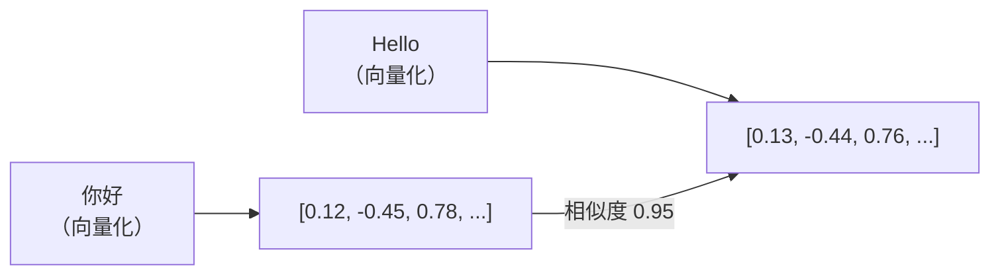
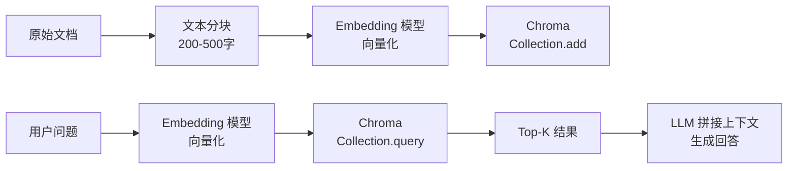

---

title: "Chroma 向量数据库：安装 / 入库 / 检索"

created: "2026-07-15"

tags:

  - 技术学习

  - ai

  - chroma

  - 向量数据库

  - rag

---

# Chroma 向量数据库：安装 / 入库 / 检索

---

> **一句话**：Chroma 就是**向量界的 SQLite**——开箱即用、零配置、轻量级，但能干专业向量数据库 90% 的活。

类比：MySQL 存的是表格（行+列），Chroma 存的是向量（数字列表）。你问"跟这个意思相近的文档有哪些？"，Chroma 翻个底朝天给你找出来。



你和 Chroma 的对话只有四句话：`create_collection` → `add` → `query` → `get`，其他都是这四句的变种。

---

## 一、安装
### 1.1 pip 安装（最常用）

```bash

pip install chromadb              # 完整安装，含默认 Embedding 模型

pip install chromadb --no-deps    # 最小安装，生产用（自己管理依赖）

pip install chromadb==1.5.9       # 指定版本，防升级踩坑

```

> [!warning] 版本锁死警告

> Chroma **数据库迁移不可逆**——升级版本后无法降级。生产环境必须固定版本号。

### 1.2 Docker 部署（多进程/生产用）

```bash

docker pull chromadb/chroma:1.5.3

docker run -p 8000:8000 chromadb/chroma:1.5.3

```

### 1.3 可选依赖

Chroma 默认用 `all-MiniLM-L6-v2`（384 维）做自动向量化，需要 Sentence-Transformers：

```bash

pip install sentence-transformers

```

> 类比：Chroma 是个"快递站"——你扔进去包裹（文本），它自动贴标签（向量化），塞进货架（索引）。Sentence-Transformers 就是那个贴标签的机器。

---

## 二、三种客户端模式

Chroma 提供三个"住法"：

| 模式 | 类 | 数据住哪 | 适合场景 |
|------|---|---------|---------|
| 内存模式 | `chromadb.Client()` | 进程内存，退出没 | 快速试手 / 单元测试 |
| 持久化模式 | `chromadb.PersistentClient(path="./db")` | 磁盘 SQLite，重启还在 | 个人项目 / 生产 |
| 远程模式 | `chromadb.HttpClient(host="...", port=8000)` | 远端 Chroma 服务器 | 分布式 / 多应用共享 |

> 类比：内存模式=**住酒店**（退房就清）、持久化=**买房**（东西一直在）、远程=**租仓库**（东西放别处，远程取）。

```python

import chromadb

# 生产推荐：持久化

client = chromadb.PersistentClient(

    path="./chroma_db",

    settings=chromadb.Settings(

        anonymized_telemetry=False,

        allow_reset=True

    )

)

```

---

## 三、Collection——Chroma 的"表"

Collection 就是 SQL 里的"表"——所有操作都在 Collection 上做。

```python

# 创建（已存在会报错）

collection = client.create_collection(name="my_knowledge_base")

# 幂等创建（推荐）

collection = client.get_or_create_collection(

    name="my_knowledge_base",

    metadata={"description": "我的知识库", "dim": 384}

)

```

**Collection 内部长这样：**

| 字段 | 类型 | 说明 |
|------|------|------|
| `id` | str | 唯一标识，你给或 Chroma 自动生成 |
| `embedding` | float[] | 向量（默认 384 维） |
| `document` | str | 原始文本 |
| `metadata` | dict | 元数据标签（source/type/date 等），用来过滤 |

---

## 四、入库（写入数据）
### 4.1 基础入库

```python

# 单条（自动生成 ID）

collection.add(

    documents=["Chroma 是开源轻量级向量数据库"]

)

# 批量（推荐！性能差 15 倍）

collection.add(

    documents=[

        "RAG 解决大模型幻觉问题",

        "向量数据库是 RAG 核心组件",

        "Chroma 零配置开箱即用"

    ],

    metadatas=[

        {"source": "博客", "type": "RAG"},

        {"source": "博客", "type": "向量数据库"},

        {"source": "官方", "type": "产品"}

    ],

    ids=["doc_001", "doc_002", "doc_003"]

)

```

> [!tip] 批量>单条

> 逐条 add 约 1000 条/秒，批量 ≥ 100 条约 15000 条/秒——**差 15 倍**。这是被问得最多的性能考点。

### 4.2 预生成向量入库

你已经有向量了（比如用 OpenAI 的 `text-embedding-3-small` 算好了 1536 维向量），可以直接塞：

```python

collection.add(

    ids=["vec_001", "vec_002"],

    embeddings=[[0.82, -0.35, ...], [0.67, 0.12, ...]],

    documents=["文档1", "文档2"],

    metadatas=[{"source": "custom"}, {"source": "custom"}]

)

```

### 4.3 更新与删除

```python

# upsert——有就覆盖，没有就新增

collection.upsert(ids=["doc_001"], documents=["新内容"], metadatas=[{"source": "v2"}])

# update——只更新指定字段

collection.update(ids=["doc_001"], documents=["新内容"], metadatas=[{"source": "v3"}])

# 按 ID 删除

collection.delete(ids=["doc_001"])

# 按条件删除

collection.delete(where={"source": "custom"})

```

> `add` vs `upsert`：add = INSERT（重复 ID 报错），upsert = REPLACE（重复 ID 覆盖）。常见陷阱。

### 4.4 入库最佳实践速查

| 实践 | 说明 |
|------|------|
| 批量 ≥ 100 条 | 单次塞越多越快，循环 add 是反模式 |
| 固定版本号 | `pip install chromadb==1.5.9`，升了降不了 |
| 分块 200-500 字 | 保留语义完整性，技术文档可到 3000 |
| 元数据精简 | 只留 source/type/date 必要字段 |
| 持久化 | 生产用 PersistentClient，数据落 SQLite |

---

## 五、自定义嵌入函数

Chroma 默认用 `all-MiniLM-L6-v2`（384 维），但你也可以换别的"贴标签机器"：

```python

from chromadb.utils import embedding_functions

# 本地免费方案（Sentence-Transformers）

ef = embedding_functions.SentenceTransformerEmbeddingFunction(

    model_name="BAAI/bge-small-zh-v1.5"  # 中文优化

)

# 云端方案（OpenAI）

ef_openai = embedding_functions.OpenAIEmbeddingFunction(

    api_key="sk-...",

    model_name="text-embedding-3-small"  # 1536 维

)

collection = client.get_or_create_collection(

    "my_db", embedding_function=ef_openai

)

```

> [!warning] 一山不容二虎

> 同一个 Collection **必须一直用同一个嵌入模型**。混用 = 用尺子量重量，检索全乱套。

**嵌入函数选型对比：**

| 模型 | 维度 | 语言 | 费用 | 适合场景 |
|------|------|------|------|---------|
| all-MiniLM-L6-v2 | 384 | 英文为主 | 免费 | 快速原型 |
| BAAI/bge-small-zh | 512 | 中文优秀 | 免费 | 中文 RAG |
| text-embedding-3-small | 1536 | 多语言 | 💰 | 精度优先 |
| text-embedding-3-large | 3072 | 多语言 | 💰💰 | 最高精度 |

---

## 六、检索
### 6.1 语义搜索（核心）

```python

results = collection.query(

    query_texts=["Chroma 有哪些存储模式？"],

    n_results=5,

    include=["documents", "metadatas", "distances"]

)

for doc, meta, dist in zip(

    results["documents"][0],

    results["metadatas"][0],

    results["distances"][0]

):

    print(f"[距离={dist:.4f}] {doc}")

```

`distances` 越小表示越相似（余弦距离 = 1 - 余弦相似度）。

### 6.2 元数据过滤——先筛再搜

先限范围、再搜语义，精度翻倍：

```python

results = collection.query(

    query_texts=["向量数据库性能"],

    n_results=5,

    where={

        "$and": [

            {"type": "性能优化"},

            {"source": {"$in": ["博客", "官方"]}},

            {"date": {"$gte": "2026-01-01"}}

        ]

    }

)

```

**支持的操作符：**

| 操作符 | 含义 | 示例 |
|--------|------|------|
| `$eq` / `$ne` | 等于/不等于 | `{"type": {"$ne": "广告"}}` |
| `$gt` / `$gte` / `$lt` / `$lte` | 比较 | `{"date": {"$gte": "2026-01-01"}}` |
| `$in` / `$nin` | 在/不在列表 | `{"source": {"$in": ["官方","博客"]}}` |
| `$and` / `$or` / `$not` | 逻辑组合 | 见上例 |

### 6.3 全文过滤（关键词匹配）

```python

results = collection.query(

    query_texts=["AI代理"],

    where_document={"$contains": "Anthropic"}

)

```

> `where` 是**元数据过滤**（结构化字段），`where_document` 是**全文关键词匹配**（文档正文）。两者可以组合用。

### 6.4 按 ID 精确获取

```python

data = collection.get(

    ids=["doc_001", "doc_002"],

    include=["documents", "metadatas", "embeddings"]

)

```

### 6.5 集合管理

```python

count = collection.count()             # 总数

sample = collection.peek(limit=3)      # 预览前3条

collections = client.list_collections() # 列出所有集合

```

---

## 七、HNSW 索引参数调优

Chroma 底层默认用 HNSW（分层可导航小世界图）做索引。如果你嫌默认精度不够，可以自己调：

```python

collection = client.get_or_create_collection(

    name="optimized_db",

    metadata={

        "hnsw:space": "cosine",           # cosine / ip / l2

        "hnsw:ef_construction": 200,       # 建索引精度（默认 100）

        "hnsw:M": 16                        # 每层连接数（默认 16）

    }

)

```

| 参数 | 建议值 | 作用 | 代价 |
|------|--------|------|------|
| `ef_construction` | 100-300 | 索引建得越精细，检索越准 | 建索引变慢 |
| `M` | 8-32 | 每层连接越多，图越稠密 | 内存变大 |
| `hnsw:space` | cosine | 文本类似度首选余弦 | — |

类比：HNSW 就像一个**社交网络**——`M` 是你加了多少好友（好友越多找人越容易），`ef_construction` 是你建好友圈时花了多大力气去认识对的人。

**生产环境实测：** 100 万向量、QPS 2000+、90% 查询 < 50ms、Top-5 召回率 92%。

---

## 八、RAG 链路中的 Chroma



- Embedding 模型详解 → [[04-Embedding向量化原理+语义搜索场景]]

- RAG 全链路实战 → [[06-RAG检索增强生成流程]]

- Agent 架构 → [[15-Agent架构与工具调用]]

---

##

> ▶ 对应原理：[[16-向量数据库|16-向量数据库]]

## 速记卡（面试闪卡）

**Q1：一句话讲清「Chroma 向量数据库：安装 / 入库 / 检索」到底是什么？**

A：Chroma 是向量界的 SQLite：零配置嵌入式向量数据库，四句话搞定建库、入库、检索、取数。

**Q2：三种住法 —— 怎么理解？**

A：像住宿三选一：内存模式是住酒店（退出清空）、持久化 PersistentClient 是买房（重启还在）、远程 HttpClient 是租仓库（放别处远程取）。生产推荐买房。

**Q3：Collection 是什么 —— 怎么理解？**

A：像 SQL 里的「表」，所有操作都在 Collection 上做。每条记录有 id、embedding（向量）、document（原文）、metadata（标签，用来过滤）。创建推荐 get_or_create 幂等写法。

**Q4：入库有坑吗 —— 怎么理解？**

A：像搬家打包：批量 add（≥100 条）比逐条快 15 倍；add 遇重复 ID 报错，upsert 覆盖；同一 Collection 必须一直用同一个嵌入模型，混用等于用尺子量重量。

**Q5：怎么搜得准 —— 怎么理解？**

A：像先划范围再细找：where 是元数据过滤（结构化字段），where_document 是全文关键词；两者可组合。distances 越小越相似（余弦距离 = 1 - 余弦相似度）。

**Q6：核心速记主线有哪些？**

- 三种客户端：内存 / 持久化 / 远程

- Collection 即表，含 id+向量+原文+元数据

- 批量入库快 15 倍，upsert 幂等覆盖

- where 元数据过滤 + where_document 全文

**口诀**

A：Chroma 住三样，酒店买房租仓库

Collection 即表，四字段装向量

批量入库十五倍，同模混用全乱套

元数据先筛再搜，距离小即近邻

相关链接

- 目录：[[00-AI]]

- 上一篇：[[04-Embedding向量化原理+语义搜索场景]]

- 下一篇：[[06-RAG检索增强生成流程]]

- Embedding 基础 → [[04-Embedding向量化原理+语义搜索场景]]

- RAG 全链路 → [[06-RAG检索增强生成流程]]

- Agent 架构 → [[15-Agent架构与工具调用]]

---

→ [[技术学习路线图#Embedding 与语义搜索]]

## 相关链接

- [[笔记/AI与Agent/知识/实战/06-RAG检索增强生成流程|RAG 全链路：Document Loader → 分块 → Embedding → 检索 → 重排 → 生成]]

- [[笔记/AI与Agent/知识/实战/08-混合检索：向量+BM25+RRF融合|混合检索]]

- [[笔记/AI与Agent/知识/实战/14-jieba分词+BM25关键词检索|jieba 分词 + BM25 关键词检索]]

- [[笔记/AI与Agent/知识/实战/13-RAG参数调优：网格搜索实验框架|RAG 参数调优]]

- [[笔记/AI与Agent/知识/实战/10-RAG评估：检索指标+生成指标|RAG 评估]]

