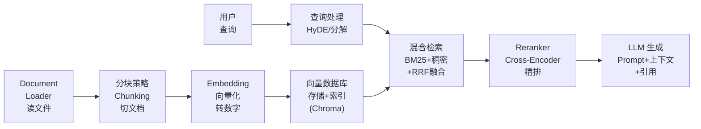
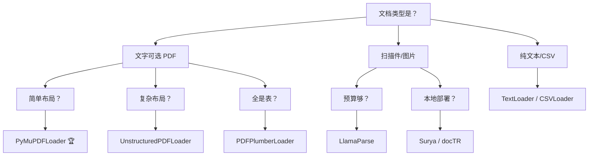
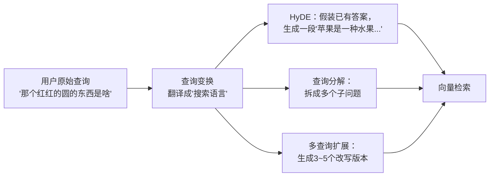
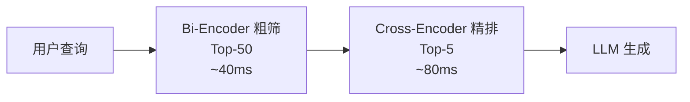
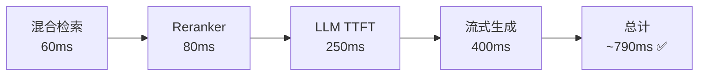

# RAG 全链路：Document Loader → 分块 → Embedding → 检索 → 重排 → 生成

---

## 一、一句话理解

> RAG = 先搜后答。在 LLM 回答之前，先到知识库里翻一遍资料，把相关内容塞进 Prompt，让 LLM 照着资料回答。

类比：**开卷考试 vs 闭卷考试。**

| 纯 LLM（闭卷） | RAG（开卷） |
|---|---|
| 靠训练时记住的知识 | 现场翻书找答案 |
| 知识截止于训练日期 | 知识实时更新 |
| 容易幻觉（编造） | 有据可查（引用原文） |
| 不知道就说不知道（偶尔） | 找不到就说找不到（更可靠） |

---

## 二、2026 关键论断

> 纯 Top-K 余弦相似度 RAG 已死。生产系统至少需要 **混合检索 + 重排 + 系统评估** 三件套。

- 混合检索（BM25 + 稠密 + RRF）比纯向量检索 NDCG@10 高 **15~25 个点**
- Cross-Encoder 重排是 **单一最高 ROI 的升级**：80ms 延迟换两位数召回提升
- 没有评估的 RAG 是盲人摸象——你以为好，实际一测 Recall 可能不到 50%

---

## 三、RAG 全链路总览



RAG 全链路分三个阶段：**离线入库**（一次做好） → **在线检索**（每次查询跑） → **生成**（拼 Prompt 回答）。

---

## 四、Document Loader——文档加载

### 1.1 选错 Loader = 后面全白干

Document Loader 是整个 RAG 管线的入口，质量决定天花板。加载器错了，后续所有环节都在处理垃圾数据。

### 1.2 主流 Loader 选型

| Loader | 适合谁 | 优势 | 避坑 |
|--------|-------|------|------|
| **PyMuPDFLoader** | 文字可选的 PDF | 极速、内存低、大文件友好 | 不支持扫描件 |
| **UnstructuredPDFLoader** | 复杂布局（标题/正文/表格混排） | 自动识别结构+内置 OCR | 依赖重 |
| **PDFPlumberLoader** | 财务报表、数据表 | 表格提取最强 | 纯文本一般 |
| **LlamaParse** | 手写/图表/多模态文档 | VLM 驱动，自动纠错 | 云端付费 |
| **TextLoader** | .txt / .md | 零依赖 | 仅纯文本 |
| **CSVLoader** | 表格数据 | 每行一个 Document | 列格式需固定 |
| **DirectoryLoader** | 批量读文件夹 | 支持 glob 匹配 | 要配 loader_cls |

**2026 推荐路径：**



> [!tip] 重要：为每个 Document 注入丰富的 metadata（source、page、section）。80% 的"RAG 答错"本质是元数据过滤失败——返回了过期或错误范围的文档。

### 1.3 代码示例

```python
from langchain_community.document_loaders import PyMuPDFLoader, TextLoader, CSVLoader, DirectoryLoader

# PDF
loader = PyMuPDFLoader("docs/report.pdf")
docs = loader.load()  # 每页一个 Document
for doc in docs:
    doc.metadata["source"] = "report.pdf"

# 整个目录
loader = DirectoryLoader(path="./docs", glob="**/*.txt", loader_cls=TextLoader)
docs = loader.load()
```

---

## 五、分块策略 Chunking——RAG 质量的第一个天花板

### 2.1 为什么分块决定 RAG 天花板

Embedding 模型有输入长度限制（一般 8192 tokens）。但更重要的原因是：**分块质量直接决定检索能不能找到相关内容。**

| 维度 | 影响 |
|------|------|
| 每块是否包含完整语义单元 | 决定了 LLM 能否理解上下文 |
| 查询能否命中相关块 | 决定了召回率 |
| Token 利用效率 | 决定了运行成本 |

> 实测（500 篇中文技术文档）：语义分块 Recall@5 = 84.2%，比固定分块 67.3% **高出 17 个点**。

### 2.2 四种主流策略

| 策略                | Recall@5 |  速度  | Token 消耗 | 复杂度 | 适用场景     |
| ----------------- | :------: | :--: | :------: | :-: | -------- |
| **固定分块**          |  67.3%   | 🟢 快 |    高     |  低  | 快速原型     |
| **语义分块**          |  84.2%   | 🟡 中 | 低（-32%）  |  高  | 长文档 QA   |
| **递归分块**          |  81.5%   | 🟢 快 |    中     |  中  | 代码/结构化文档 |
| **Late Chunking** |   ~83%   | 🟡 中 |    中     |  高  | 法律/长上下文  |

### 2.3 固定分块（Fixed-size）

最简单的做法：按固定 Token 数切，overlap 保证连续性。

```python
def fixed_chunking(text: str, chunk_size: int = 512, overlap: int = 50):
    tokens = text.split()
    chunks = []
    for i in range(0, len(tokens), chunk_size - overlap):
        chunk = " ".join(tokens[i:i + chunk_size])
        if chunk.strip():
            chunks.append(chunk)
    return chunks
```

> overlap 从 0 提到 50，Recall@5 提升约 **8~12%**——几十个字符的重叠，代价几乎为零，收益却很大。

### 2.4 语义分块（Semantic Chunking）

用 Embedding 算相邻句子的"意思距离"，发现断层就切一刀。

```python
def semantic_chunking(sentences, model, threshold=0.7, max_size=512):
    embeddings = model.encode(sentences)
    chunks, current = [], []
    for i, sent in enumerate(sentences):
        if i > 0:
            sim = cosine_similarity(embeddings[i], embeddings[i-1])
            if sim < threshold:  # 意思变了，切
                chunks.append(" ".join(current))
                current = []
        current.append(sent)
    if current:
        chunks.append(" ".join(current))
    return chunks
```

类比：**看电视剧——画面风格突然变了（转场），你知道换场景了。语义分块就是检测这个"转场"。**

### 2.5 递归分块（RecursiveCharacterTextSplitter）⭐ 最推荐

按优先级递归切：段落 → 行 → 句号 → 分号 → 逗号 → 字符，保证尽量在语义完整处下刀。

```python
from langchain_text_splitters import RecursiveCharacterTextSplitter

splitter = RecursiveCharacterTextSplitter(
    chunk_size=500,
    chunk_overlap=100,
    separators=["\n\n", "\n", "。", "；", "，", " ", ""],
)
chunks = splitter.split_documents(docs)
```

**类比：拆乐高——先拆大模块（段落），再拆小部件（句子），尽量不破坏原有结构。**

### 2.6 chunk_size 怎么选？

| 场景 | chunk_size | overlap | 理由 |
|------|:--------:|:-------:|------|
| 简历解析 | 300~500 | 50~100 | 短文本，小块精准 |
| 技术文档 | 500~1000 | 100~200 | 代码+说明需上下文 |
| 长篇报告 | 1000~2000 | 200~300 | 叙事需要更大窗口 |
| FAQ/客服 | 200~400 | 30~80 | 问答短小独立 |

> 没有万能参数。**从 500/100 开始，有数据了再调。**

---

## 六、Embedding——向量化

### 3.1 一句话

文字 → 向量，语义相近的向量在空间里挨着。详见 [[04-Embedding向量化原理+语义搜索场景]]。

### 3.2 2026 实战选型

| 场景 | 推荐模型 | 维度 | 理由 |
|------|---------|:----:|------|
| 本地/中文/免费 | `BAAI/bge-m3` | 1024 | 多语言统一向量空间，开源 MIT |
| 本地/长文档 | `jina-embeddings-v4` | 1024 | 32K 上下文 |
| 精度最高（有 GPU） | `NV-Embed-v2` / `Qwen3-Embedding` | 4096 | 开源最强 |
| API 省心 | `text-embedding-3-small` | 1536 | $0.02/MTok，性价比之王 |
| 本地轻量 | `Nomic Embed v1.5` | 768 | CPU 可用，274MB |

```python
from chromadb.utils import embedding_functions

# 中文推荐：BGE-M3
ef = embedding_functions.SentenceTransformerEmbeddingFunction(
    model_name="BAAI/bge-m3"
)
```

> ⚠️ 同一个 Collection 必须始终用同一个嵌入模型。混用 = 尺子量重量。

---

## 七、检索 Retrieval——找到最像的几块

### 4.1 Naive RAG 为什么不够？

| 问题 | 表现 | 原因 |
|------|------|------|
| 长尾召回崩塌 | 搜"GB/T 19001-2025"返回一堆无关结果 | 稀有词被 Embedding 抹平了 |
| 宽泛查询精度崩塌 | 搜"请假政策"返回 10 个几乎一样的 HR 段落 | 向量过于接近 |
| 多跳查询断裂 | "我们引入 TCS 那个季度的净利润？" 需要两步推理 | 单次检索不够 |

**2026 年的答案：混合检索（BM25 + 稠密 + RRF）+ 查询变换 + Reranker。**

### 4.2 混合检索——生产标配

| 方法 | 优势 | NDCG@10 | 延迟 |
|------|------|:-------:|:----:|
| BM25（词法） | 精确匹配 SKU/法规编号 | 0.51 | 5ms |
| 稠密（语义） | 近义词、概念匹配 | 0.62 | 40ms |
| **混合+RRF** 🏆 | 覆盖双方弱点 | **0.74** | 55ms |
| 混合+Cross-Encoder | 最高精度 | **0.83** | 130ms |

类比：**BM25 是翻字典（查字面），稠密是找同义词（查意思），两个人一起投票比任何一个人都准。**

### 4.3 RRF（Reciprocal Rank Fusion）——融合之王

```python
def rrf_fuse(results_lists, k=60, top_n=20):
    """无需调参，80% 场景优于学习式融合"""
    scores = {}
    for results in results_lists:
        for rank, doc_id in enumerate(results, start=1):
            scores[doc_id] = scores.get(doc_id, 0) + 1.0 / (k + rank)
    ranked = sorted(scores.items(), key=lambda x: -x[1])
    return [doc_id for doc_id, _ in ranked[:top_n]]
```

RRF 的核心思想：**A 排第 1 + B 排第 10 = 总分 1/61 + 1/70 ≈ 0.031，比只有 A 排第 3（1/63）还高。跨系统的一致性比单一系统的高排名更重要。**

### 4.4 查询变换（Query Transformation）

用户的问题往往不适合直接拿去搜。原因：**搜索需要"关键词密集的陈述句"，但用户问的是"简短模糊的疑问句"。**

类比：你问朋友"那个红红的圆的东西是啥"——朋友知道你在说苹果，因为你们共享语境。但搜索引擎没有这个语境。你需要先把问题**翻译成更接近目标文档的语言**。



#### HyDE（Hypothetical Document Embedding）

**核心思想：** 不搜用户的问题，而是先让 LLM **假装这个问题已经有答案了**，然后搜那段"假答案"。

```python
def hyde_retrieve(query: str, llm, embedder, vector_db, top_k: int = 20) -> list:
    # Step 1: 让 LLM 假装写一段"关于这个问题的文章"
    hypothetical = llm.invoke(
        f"请写一段 100 字左右的段落，详细回答以下问题：\n{query}\n"
        f"要求：陈述句，信息密集，像教科书或百科条目。"
    )
    
    # Step 2: 嵌入这段"假文章"，而不是原问题
    hyde_vec = embedder.encode(hypothetical)
    
    # Step 3: 用假文章的向量去搜
    return vector_db.search(hyde_vec, top_k=top_k)
```

**为什么 HyDE 有效？**

| | 用户 query | 假想答案 |
|---|---|---|
| 长度 | 5~15 词，稀疏 | 100~200 词，密集 |
| 词汇 | 可能没有文档中的关键词 | 覆盖文档常用词汇 |
| 语义 | 模糊意图 | 明确陈述 |
| 嵌入质量 | 向量可能漂移 | 更接近目标文档的分布 |

> 类比：你想在图书馆里找一本"讲好吃红果子的书"，但书名是《苹果栽培技术》。直接用 query 搜 = 对图书管理员说"好吃红果子"，HyDE = 先写一段"苹果是一种蔷薇科水果..."的纸条，再拿纸条去找。纸条和书名的用词更匹配。

**HyDE 的坑：**

| 问题 | 表现 | 对策 |
|------|------|------|
| LLM 生成质量差 | 假答案离题万里 | 给 LLM 更具体的 prompt 模板 |
| 额外延迟 | +200ms LLM 调用 | 小模型（Haiku）做 HyDE |
| 不适合事实性 query | "2025年营收多少？" 假答案可能编错数字 | 这类 query 直接搜，不做 HyDE |

#### 查询分解（Query Decomposition）

用户的一个问题可能包含多个子问题。拆开搜，再合并。

```python
def decompose_query(complex_query: str, llm) -> list[str]:
    """把复杂查询拆成多个独立子查询"""
    prompt = f"""将以下问题拆解为多个独立的子问题，每个子问题只需要检索一个事实。
每个子问题应该可以直接在文档中搜索。

原始问题：{complex_query}

输出格式：
1. [子问题1]
2. [子问题2]
..."""
    response = llm.invoke(prompt)
    # 解析返回的子问题列表
    sub_queries = [line.split(". ", 1)[1] for line in response.strip().split("\n")]
    return sub_queries

# 举例
# 原始："我们引入 TCS 系统的那个季度，净利润是多少？"
# 子问题 1："TCS 系统是什么时候引入的？"
# 子问题 2："[对应季度]的净利润是多少？"
# 第二次检索依赖第一次的结果 → 可以用中间结果拼接最终查询
```

类比：**你问"2019年上映的那部讲太空的国产科幻片票房多少"——正常人会先确定"哦你说的是《流浪地球》"，再查"流浪地球票房"。两次检索，第一次的结果作为第二次的输入。**

#### 多查询扩展（Multi-Query Expansion）

同一个问题，让 LLM 从多个角度改写，然后各自检索，RRF 融合。

```python
def expand_query(query: str, llm, n: int = 5) -> list[str]:
    """生成 n 个不同角度的改写查询"""
    prompt = f"""请从 {n} 个不同的角度改写以下问题。
每个改写应使用不同的词汇和表述方式，覆盖可能的同义词和上下文。

原始问题：{query}

输出每行一个改写："""
    response = llm.invoke(prompt)
    variants = [q.strip() for q in response.strip().split("\n") if q.strip()]
    return [query] + variants  # 包含原版

# 原始："用 Python 怎么读取 CSV 文件？"
# 改写 1："Python 读取 CSV 的方法"
# 改写 2："pandas read_csv 用法"
# 改写 3："Python csv 模块如何解析表格数据"
# 改写 4："python 处理 csv 文件示例代码"

# 各搜各的，RRF 融合结果
all_results = [vector_db.search(q, top_k=10) for q in queries]
final = rrf_fuse(all_results, k=60, top_n=20)
```

#### Step-Back Prompting（退一步思考）

> **实用技巧**：当问题太具体导致搜不到时，先退一步到更抽象的层面。

| 原始查询 | Step-Back 查询 |
|---------|---------------|
| "Python @dataclass 的 frozen=True 有什么作用" | "Python dataclass 的原理和参数"
| "如何用 LangChain 实现 RAG" | "RAG 的通用架构"
| "Chroma 的 ef_construction 怎么调" | "HNSW 索引参数调优"

```python
def step_back(query: str, llm) -> str:
    prompt = f"""原始问题：{query}

这个问题太具体了，可能无法直接匹配到文档。
请生成一个"退一步"的、更通用的查询，来覆盖原始问题所需的背景知识。
通用查询应该是一个完整的知识点名称，而不是一个问题。"""
    return llm.invoke(prompt)
```

#### 四种技术选型速查

| 技术 | 适合场景 | 不适合场景 | 延迟 |
|------|---------|-----------|:----:|
| **HyDE** | 模糊/开放式查询 | 精确事实查询 | +200ms |
| **查询分解** | 多跳推理问题 | 简单事实查询 | +300ms |
| **多查询扩展** | 同义词多/表述多样的领域 | 术语高度统一的领域 | +100ms |
| **Step-Back** | 具体到搜不到、需要背景知识 | 搜索已经能直接命中 | +100ms |

### 4.5 元数据过滤——零成本提效

给每个 chunk 打好标签（来源/日期/分类），检索时前置过滤：

```python
results = collection.query(
    query_texts=["请假政策"],
    n_results=5,
    where={
        "$and": [
            {"category": "HR政策"},
            {"date": {"$gte": "2025-01-01"}}
        ]
    }
)
```

> 80% 的"RAG 答错"本质是元数据过滤失败——搜到了过期文件。

---

## 八、重排 Reranking——让最好的排到最前面

### 5.1 两阶段架构



| 维度 | Bi-Encoder（向量检索） | Cross-Encoder（Reranker） |
|------|----------------------|--------------------------|
| 编码方式 | 分别编码 query 和 doc | 拼接在一起编码 |
| 速度 | 🟢 极快 | 🟡 每对 1~2ms |
| 精度 | 🟡 中 | 🟢 **高**（Attention 能看到交互） |
| 能否预编码？ | ✅ 文档可离线算好 | ❌ 必须在线实时算 |

类比：**Bi-Encoder 是 HR 筛简历（30 秒扫一份，挑出 50 份），Cross-Encoder 是技术面（逐份细看 10 分钟，找出最好的 5 份）。**

### 5.2 2026 主流 Reranker

| 模型 | 参数量 | 语言 | 许可 | 推荐场景 |
|------|:-----:|------|------|---------|
| **bge-reranker-v2-m3** 🏆 | 568M | 中/英/多语言 | MIT 开源 | **中文首选，自部署** |
| bge-reranker-v2-gemma | 2B | 中/英 | 开源 | 精度最高（需 8GB+ 显存） |
| Cohere Rerank v3.5 | 不公开 | 100+ 语言 | API 付费 | 零 GPU |
| Jina Reranker v2 | 278M | 中/英/日/德 | CC BY-NC-4.0 | 评估可用，商用需付费 |

### 5.3 实战代码

```python
from FlagEmbedding import FlagReranker

reranker = FlagReranker('BAAI/bge-reranker-v2-m3', use_fp16=True)

query = "Ubuntu 安装 Docker"
candidates = ["Docker 是容器平台", "sudo apt install docker.io", "Python 用于数据科学"]

scores = reranker.compute_score([[query, c] for c in candidates])
# [2.13, 6.82, -2.34]  ← 负分表示完全不相关！
```

### 5.4 避坑指南

| ❌ 错误                       | ✅ 正确                                |
| -------------------------- | ----------------------------------- |
| 粗检索只取 Top-5，Reranker 没候选可排 | 粗检索至少 Top-20~50                     |
| 用 Reranker 代替向量检索          | 永远两阶段：粗筛 + 精排                       |
| chunk 太碎或太大                | chunk_size 512~1024，overlap 100~200 |
| 忽略许可证直接用 Jina Reranker     | 商用时确认许可证（CC BY-NC ≠ 开源）             |

---

## 九、生成 Generation——最后的拼图

### 6.1 核心公式

```python
def build_rag_prompt(query, chunks):
    context = "\n\n".join(
        f"[Chunk {i}] {chunk['content']}" 
        for i, chunk in enumerate(chunks[:5], 1)
    )
    return f"""请基于以下参考资料回答问题。
如果找不到答案，直接说"根据已有资料无法确定"。
引用时标注【Chunk N】。

【参考资料】
{context}

【问题】
{query}"""
```

### 6.2 2026 Prompt 原则

> **Context over Cleverness**——模型足够聪明了，Prompt 的胜负手不是技巧，而是信息密度和约束清晰度。

| 原则 | 做法 |
|------|------|
| 结构化分隔 | 用标记明确区分 Context / Query / 输出格式 |
| 输出契约 | 明确要求：引用来源、置信度、最大长度 |
| 强制引用 | 每个断言附带【Chunk N】，降低幻觉 |
| Prompt Caching | 稳定部分（System+Context）放前面缓存，省 70~90% 成本 |

### 6.3 幻觉防控

| 手段                 | 做法                      |
| ------------------ | ----------------------- |
| 强制引用               | 每个断言必须附【Chunk N】        |
| 无答案声明              | "找不到就说不知道"，禁止编造         |
| RAGAS Faithfulness | LLM-as-Judge 评估是否忠于检索内容 |
| 置信度分级              | 高/中/低，低置信度标注"仅供参考"      |

---

## 十、RAGAS 评估——别当盲人

### 7.1 四大指标

| 指标 | 含义 | 考什么 |
|------|------|--------|
| **Context Precision** | 检索到的上下文有多少是真正相关的 | 检索的精准度 |
| **Context Recall** | 需要的上下文有多少被检索到了 | 检索的覆盖率 |
| **Faithfulness** | 回答是否忠于检索到的上下文 | 有没有瞎编 |
| **Answer Relevancy** | 回答是否回答了用户的问题 | 有没有答非所问 |

### 7.2 一句话策略

> **先跑 Context Recall 和 Faithfulness——前者查检索漏没漏，后者查 LLM 有没有乱说。两个及格了再优化 Precision 和 Relevancy。**

---

---

## 十一、全链路延迟预算（p95 < 800ms）



---

## 
> ▶ 对应原理：[[13-RAG检索增强生成|13-RAG检索增强生成]]


> ▶ 对应原理：[[39-记忆系统vs-RAG本质区别|39-记忆系统vs-RAG本质区别]]

相关链接

- 目录：[[00-AI]]
- 上一篇：[[05-Chroma向量数据库安装入库检索]]
- 下一篇：[[15-Agent架构与工具调用]]
- Embedding 基础 → [[04-Embedding向量化原理+语义搜索场景]]
- Chroma 实战 → [[05-Chroma向量数据库安装入库检索]]
- Agent 架构 → [[15-Agent架构与工具调用]]
- LangChain 框架 → [[44-LangChain框架入门]]
- 项目实践：[[项目实战/ai-resume笔记/01_技术研读/02_RAG流水线#文件级概览|ai-resume: RAG流水线]]

---

→ [[技术学习清单#RAG]]

## 速记卡（面试闪卡）

**Q1：一句话讲清「RAG 全链路：Document Loader → 分块 → Embedding → 检索 → 重排 → 生成」到底是什么？**
A：RAG = 先搜后答。在 LLM 回答之前，先到知识库里翻一遍资料，把相关内容塞进 Prompt，让 LLM 照着资料回答。
类比：**开卷考试 vs 闭卷考试。**
| 纯 LLM（闭卷） | RAG（开卷） |
|---|---|
| 靠训练时记住的知识 | 现场翻书找答案 |
| 知识截止于训练日期 | 知识实时更新 |
| 容易幻觉（编造） | 有据可查（引用原文） |

**Q2：一、一句话理解 —— 怎么理解？**
A：RAG = 先搜后答。在 LLM 回答之前，先到知识库里翻一遍资料，把相关内容塞进 Prompt，让 LLM 照着资料回答。
类比：**开卷考试 vs 闭卷考试。**
| 纯 LLM（闭卷） | RAG（开卷） |
|---|---|
| 靠训练时记住的知识 | 现场翻书找答案 |
| 知识截止于训练日期 | 知识实时更新 |
| 容易幻觉（编造） | 有据可查（引用原文） |

**Q3：二、2026 关键论断 —— 怎么理解？**
A：纯 Top-K 余弦相似度 RAG 已死。生产系统至少需要 **混合检索 + 重排 + 系统评估** 三件套。
混合检索（BM25 + 稠密 + RRF）比纯向量检索 NDCG@10 高 **15~25 个点**
Cross-Encoder 重排是 **单一最高 ROI 的升级**：80ms 延迟换两位数召回提升
没有评估的 RAG 是盲人摸象——你以为好，实际一测 Recall 可能不到 50%
---

**Q4：三、RAG 全链路总览 —— 怎么理解？**
A：RAG 全链路分三个阶段：**离线入库**（一次做好） → **在线检索**（每次查询跑） → **生成**（拼 Prompt 回答）。
---

**Q5：四、Document Loader——文档加载 —— 怎么理解？**
A：Document Loader 是整个 RAG 管线的入口，质量决定天花板。加载器错了，后续所有环节都在处理垃圾数据。
| Loader | 适合谁 | 优势 | 避坑 |
|--------|-------|------|------|
| **PyMuPDFLoader** | 文字可选的 PDF | 极速、内存低、大文件友好 | 不支持扫描件 |

**Q6：核心速记主线有哪些？**
A：抓住这几根：一、一句话理解、二、2026 关键论断、三、RAG 全链路总览、四、Document Loader——文档加载、五、分块策略 Chunking——RAG 质量的第一个天花板、六、Embedding——向量化。

