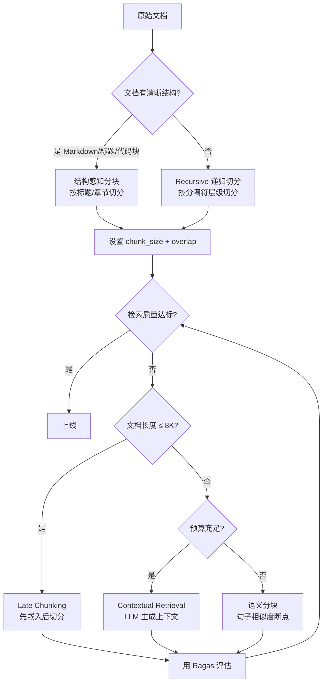

# 分块策略：chunk_size / overlap 选择、语义分块

> **一句话**：分块是 RAG 的"第一公里"，决定了检索质量的天花板——模型再强，喂进去的"碎肉"不对，照样答非所问。
> 

---

## 一、为什么必须分块？——"自助餐装盘"类比

想象你去吃自助餐，有一整头烤牛（完整文档）。你不能把整头牛塞嘴里（LLM 上下文窗口有限），也不能随便剁成肉泥（语义全断），而是要切成大小合适的牛排块（chunk），每块都带点肥瘦相间的完整口感（上下文保留），这样吃起来才爽（检索精准）。

**分块的三个硬约束：**

1. **模型上下文窗口限制**：Embedding 模型通常只吃 512~8192 tokens，LLM 也有输入上限
2. **检索精度要求**：向量检索是"局部匹配"，chunk 太大则关键信息被稀释，太小则上下文断裂
3. **计算成本控制**：chunk 越多 = 向量存储越大 = 检索越慢 = API 花钱越多

> Chunking 是在**上下文完整性、检索精度、计算成本**三者之间做工程取舍。
> 

---

## 二、核心参数：chunk_size 与 overlap

### 2.1 chunk_size（块大小）——"牛排切多大"

chunk_size 是每个文本块的长度（通常以 token 或字符为单位）。它是 RAG 系统中**最核心的超参数之一**，直接决定检索的召回率和准确率。

#### 太大的问题

| 问题 | 通俗解释 | 实际后果 |
| --- | --- | --- |
| 噪声稀释 | 一块牛排里混了太多肥肉（无关内容） | 关键信息被向量空间"平均化"，检索精度下降 |
| 上下文窗口浪费 | 给 LLM 的 prompt 被废话占满 | 生成容易跑偏、啰嗦，甚至幻觉 |
| 计算开销大 | 每块更大 = Embedding 更慢 | 成本飙升 |

> ⚠️ **真实案例**：财报中"净利润 1.2 亿"这个关键数字，如果 chunk_size=2048，它就被淹没在 2000 token 的冗长描述里，向量检索根本定位不到。
> 

#### 太小的问题

| 问题 | 通俗解释 | 实际后果 |
| --- | --- | --- |
| 语义腰斩 | "用户登录失败"被切成"用户登录" + "失败" | 检索到了但 LLM 看不懂完整意思 |
| 上下文断裂 | 前提和结论分到不同块 | LLM 只看到结论不知道为什么 |
| chunk 数量爆炸 | 10 万字文档切成 200 token 的块 = 500+ 块 | 向量库膨胀，检索变慢 |

#### 黄金区间与经验法则

| 文档类型 | 推荐 chunk_size | 理由 |
| --- | --- | --- |
| 通用文档/百科/说明书 | 512~1024 tokens | 信息密度适中，中等块兼顾上下文和精度 |
| 法律/合同/强结构化文档 | 256~512 tokens | 条款独立性强，小块即可完整表达一条法规 |
| 长文章/故事/报告 | 1024~2048 tokens | 叙事连贯性强，需要更大上下文 |
| 问答类/FAQ | 400~600 tokens | 问答对天然边界清晰 |
| 技术文档/代码 | 200~300 tokens | 函数/配置步骤通常较短 |

> 💡 **工程金句**："不要为了 5% 的召回率提升，付出 10 倍的 Embedding 成本。"
> 

#### 三板斧验证法

1. **模型边界法**：chunk_size ≤ Embedding 模型上限（如 512）× 90%（留 10% Buffer）
2. **知识单位法**：统计业务文档中独立知识点的平均 token 数（如法律条文"第 3 条"平均 200 tokens）
3. **黄金文档测试**：在 256 / 512 / 1024 三种尺寸下测试，检查答案是否总在 Top-3

#### 动态评估法（进阶）

51CTO 实测文章通过 70 组不同 chunk_size × overlap 的组合，用 Ragas 评估三个指标：

- **上下文召回率**：最佳组合 chunk_size=768, overlap=0.6，得分 0.78
- **上下文相关性**：最佳组合 chunk_size=512, overlap=0.5，得分 0.8
- **答案正确性**：最佳组合 chunk_size=768, overlap=0.6，得分 0.7

**关键发现**：中等 chunk_size（512~896）在所有指标上平均表现最好，过大或过小都会导致性能下降。

#### 查询类型也会影响最优 chunk_size

| 查询类型 | 推荐 chunk_size | 原因 |
| --- | --- | --- |
| 事实型查询（"公司的注册地址"） | 256~512 tokens | 答案集中在一两句话，小块精准命中 |
| 复杂分析查询（"分析 Q3 营收增长原因"） | 1024+ tokens | 需要跨越多段落的上下文推理 |

> 📌 **AI21 实证研究**：不存在通用最优 chunk_size，同一语料库中不同查询的最优粒度差异可达 5 倍。
> 

---

### 2.2 chunk_overlap（重叠窗口）——"牛排之间留点拼接缝"

overlap 是相邻两个 chunk 之间重复的内容长度。它的存在是为了防止关键信息恰好落在切分点上被"腰斩"。

#### 为什么需要 overlap？

举个残酷的例子：

```text
原文："用户数据加密采用 AES-256 算法，密钥存放在 HSM 中"

如果 chunk_size=10, overlap=0：
  Chunk 1: "用户数据加密采用"
  Chunk 2: "AES-256 算法，密钥存放在 HSM 中"

用户问："数据用什么加密？" → Chunk 1 被检索到，但答案被切断了
用户问："密钥存在哪？" → Chunk 2 被检索到，但缺少"数据加密"的上下文

有了 overlap=5：
  Chunk 1: "用户数据加密采用 AES-256"
  Chunk 2: "采用 AES-256 算法，密钥存放在 HSM 中"
  → 两个 chunk 都包含完整关键信息
```

> 💡 **一句话理解**：overlap 相当于给 LLM 多一次检索命中的机会——关键内容在多个 chunk 里出现，保证上下文语义完整。
> 

#### 经验值

| 来源 | 推荐 overlap 比例 | 对应数值（chunk_size=512） |
| --- | --- | --- |
| 工程通用经验 | chunk_size 的 10%~25% | 50~100 tokens |
| 问答类场景 | 50~80 tokens（固定值） | 50~80 tokens |
| 动态评估最优 | chunk_size 的 50%~60% | 256~307 tokens（偏高） |

> overlap 通常设为 chunk_size 的 10%~20%。太小起不到防切断作用，太大（超过 30%）会导致大量内容重复，引发 Top-K 塌缩和存储膨胀。
> 

#### overlap 太大的副作用

| 副作用 | 解释 | 后果 |
| --- | --- | --- |
| Top-K 塌缩 | 检索结果全是重复段落 | 5 个结果都是"系统错误"开头的 100 字，多样性为零 |
| 存储膨胀 | 20% overlap = 向量库体积 +20% | 成本增加 |
| 噪声干扰 | 重复内容干扰模型判断 | 检索精度反降 |

#### 工程补救方案

1. **Jaccard 相似度去重**：相似度 >0.8 的 chunk 自动合并
2. **MMR（最大边际相关性）**：检索时强制结果多样性，避免返回高度相似的 chunk

---

## 三、分块策略全景图——"从蛮力到智能"



**策略层级递进（从简单到复杂）：**

1. **朴素型（Fixed-Size）**：按固定 token 数切分 → 简单粗暴，可能腰斩句子 → 适合快速验证
2. **启发型（Recursive）**：按分隔符层级递归切分（nn → n → 句号 → 空格）→ ✅ **工业界 Baseline**
3. **结构感知型（Structure-Aware）**：按 Markdown 标题/代码块/表格切分 → 保留文档结构
4. **父子索引（Parent-Child）**：小块检索，大块返回 → 兼顾检索精度和上下文完整性
5. **语义型（Semantic）**：按语义相似度找断点 → 上下文保留好但成本高
6. **Late Chunking**：先嵌入后切分 → 2025 前沿方案
7. **Contextual Retrieval**：LLM 为每块生成上下文说明 → 2025 前沿方案

### 策略对比表

| 策略 | 适用场景 | 工程成本 | 核心风险 |
| --- | --- | --- | --- |
| 朴素型（Fixed-length） | 快速验证/PoC | 低 | 语义腰斩 |
| 启发型（Recursive） | **工业界 Baseline** | 低 | 依赖分隔符质量 |
| 结构感知型 | Markdown/代码/技术文档 | 中 | 需解析文档结构 |
| 父子索引（Parent-Child） | 长文档/产品手册 | 中高 | 需额外存储父级 chunk |
| 语义型（Semantic） | 技术文档/复杂文本 | **高** | 成本爆炸、延迟高 |
| Late Chunking | 长文档（8K tokens 以内） | 中 | 依赖长上下文 Embedding 模型 |
| Contextual Retrieval | 超长文档/复杂语境 | **很高** | 每块调一次 LLM，成本可观 |

> Baseline 先行——永远从 Recursive Character + 512 Tokens + 15% Overlap 开始，工业界 90% 的问题可以解决。
> 

---

## 四、语义分块（Semantic Chunking）深度解析

### 4.1 核心思想——"按意思断句，而不是按字数断句"

传统分块按固定长度或分隔符切，就像用尺子量着切牛排——不管纹理走向，到点就切。语义分块则是**顺着肉的纹理切**——哪里语义发生了突变，就在哪里下刀。

### 4.2 实现原理

**处理流程（5 步）：**

1. 把文档按句子切分（用 NLTK / spaCy / LangChain 的 sentence splitter）
2. 对每个句子生成 Embedding 向量
3. 计算相邻句子向量的**余弦相似度**
4. 当相似度低于阈值（如 0.6）时，认为语义发生了"突变"，在这里切分
5. 相似度高的相邻句子归入同一个 chunk

**判断逻辑：**

```text
句子1 → Embedding1
句子2 → Embedding2 → cos_sim(emb1, emb2) = 0.85 → 连贯，归入同一 chunk
句子3 → Embedding3 → cos_sim(emb2, emb3) = 0.45 → 突变！在这里断开
句子4 → Embedding4 → cos_sim(emb3, emb4) = 0.78 → 连贯，归入新 chunk
```

### 4.3 代码思路

```python
from sentence_transformers import SentenceTransformer
from sklearn.metrics.pairwise import cosine_similarity

def semantic_chunking(text, similarity_threshold=0.7, min_chunk_size=50):
    # 1. 按句子切分
    sentences = split_into_sentences(text)
    # 2. 对每个句子生成 Embedding
    model = SentenceTransformer('all-MiniLM-L6-v2')
    embeddings = model.encode(sentences)
    # 3. 计算相邻句子的余弦相似度
    chunks = []
    current_chunk = [sentences[0]]
    for i in range(1, len(sentences)):
        sim = cosine_similarity([embeddings[i-1]], [embeddings[i]])[0][0]
        if sim < similarity_threshold:
            # 语义突变 → 断开
            chunks.append(' '.join(current_chunk))
            current_chunk = [sentences[i]]
        else:
            # 语义连贯 → 继续累积
            current_chunk.append(sentences[i])
    if current_chunk:
        chunks.append(' '.join(current_chunk))
    return chunks
```

### 4.4 LangChain 中的语义分块

```python
from langchain_experimental.text_splitter import SemanticChunker
from langchain_openai import OpenAIEmbeddings

text_splitter = SemanticChunker(
    OpenAIEmbeddings(),
    breakpoint_threshold_type="percentile",  # 或 "standard_deviation"
    breakpoint_threshold_amount=95,
)
chunks = text_splitter.split_text(document_text)
```

**断点判定方式**（breakpoint_threshold_type）：

- `percentile`：按相似度分布的百分位数判定（默认 95%）
- `standard_deviation`：按标准差判定
- `interquartile`：按四分位距判定

### 4.5 语义分块的优缺点

| 维度 | 评价 |
| --- | --- |
| **优点** | 上下文保留极好；chunk 边界天然贴合语义；减少"腰斩"问题 |
| **缺点** | 需要额外的 Embedding 计算，成本高；对 Embedding 模型质量敏感；chunk 大小不可控；延迟高 |
| **适用** | 技术文档、学术论文等语义边界清晰的场景 |
| **不适用** | FAQ（天然有边界）、实时系统（延迟要求高） |

> ⚠️ **工程警示**："智能切分并非银弹！需离线批处理、计算开销大，且对 Embedding 模型稳定性高度敏感。"
> 

---

## 五、2025-2026 前沿策略

### 5.1 Late Chunking（延迟切分）——"先看书再撕页"

**传统分块**（Early Chunking）的问题：先撕书再分别阅读 → 每页都不知道其他页写了什么。

**Late Chunking** 反其道而行：先把整本书读完（整体 Embedding），再在向量空间里"撕页"（切分向量）。

**对比流程：**

```text
传统 Early Chunking：
  文档 → 先切分 → 逐块 Embedding → 每块向量只含局部语义 ❌ 上下文丢失

Late Chunking：
  文档 → 整篇 Embedding（需长上下文模型）→ 在向量空间切分 → 每块向量含全局语义 ✅
```

**核心步骤：**

1. **整体编码**：将完整文档一次性输入支持长上下文的 Embedding 模型（如 Jina AI 支持 8192 tokens），获取每个 token 的向量表示
2. **延迟切分**：在向量序列上按句子/段落边界切分
3. **片段池化**：对每个片段的 token 向量做平均池化，生成最终 chunk 向量

**效果**：每个 chunk 的向量都"看过"全文，携带全局上下文信息。实验表明，原本与查询"Berlin"余弦相似度只有 0.708 的片段，Late Chunking 后提升到 0.825。

**限制**：依赖长上下文 Embedding 模型，文档超过模型窗口时仍需拆分。

### 5.2 Contextual Retrieval（上下文检索）——"给每块贴个说明书"

由 **Anthropic** 在 2024 年提出，核心思想：用 LLM 为每个 chunk 生成一段上下文说明，拼接到 chunk 前面再 Embedding。

**举例：**

- 原始 chunk："公司收入较上季度增长了 3%"
- LLM 生成的上下文："本段摘自 ACME 公司的 2023 年第二季度财报，上季度营收为 3.14 亿美元。"
- 最终 chunk："本段摘自 ACME 公司的 2023 年第二季度财报...公司收入较上季度增长了 3%"

**效果惊人**：引入 Contextual Retrieval 后，检索失败率下降约 49%，配合 ReRank 总体检索错误率减少 67%。

**成本优化**：利用上下文缓存（如 Claude 的 prompt caching），批量生成上下文的成本可降至原来的 10% 以内。

### 5.3 两种策略对比

| 维度 | Late Chunking | Contextual Retrieval |
| --- | --- | --- |
| 核心思路 | 先嵌入后切分 | 先切分再补上下文 |
| 上下文来源 | Embedding 模型的注意力机制 | LLM 生成的说明文本 |
| 适用文档长度 | ≤ Embedding 模型窗口（如 8K） | 任意长度 |
| 额外成本 | 一次长文本 Embedding | 每块一次 LLM 调用 |
| 效果提升 | 相似度提升 ~12% | 检索失败率下降 ~49% |
| 成熟度 | 较新，依赖长上下文模型 | Anthropic 已验证，工程可落地 |

---

## 六、工程决策框架

### 6.1 决策流程

**逐步决策逻辑：**

1. 文档有清晰结构（Markdown/标题/代码块）？→ **是** → 结构感知分块（按标题/段落切分）
2. 是快速验证/PoC？→ **是** → 朴素分块（Recursive + 512 tokens）
3. 检索质量不达标？→ **否** → 保持当前方案
4. 检索质量不达标？→ **是** → 文档 ≤ 8K tokens？→ **是** → Late Chunking（先嵌入后切分）
5. 文档 > 8K tokens？→ 预算充足？→ **是** → Contextual Retrieval（LLM 生成上下文）
6. 预算不足？→ **语义分块**（句子相似度断点）
7. 所有方案 → 设置 chunk_size + overlap → 用 Ragas/TruLens 评估 → 指标达标则上线

### 6.2 参数选择速查表

| 场景 | chunk_size | overlap | 分块策略 | 理由 |
| --- | --- | --- | --- | --- |
| 快速验证 | 512 | 50~100 | Recursive | 工业界 Baseline，覆盖 90% 场景 |
| FAQ/客服 | 400~600 | 50~80 | 句子分块 | 问答对天然有边界 |
| 法律合同 | 256~512 | 50~100 | 结构感知 | 按条款切，保持法律效力 |
| 技术文档 | 200~300 | 30~60 | 结构感知 | 按函数/配置步骤切 |
| 长篇报告 | 1024~2048 | 100~200 | 父子索引 | 需要大上下文做推理 |
| 学术论文 | 512~1024 | 50~100 | 层级分块 | 按章节/段落分层 |
| 超长文档（高级） | 512~1024 | 50~100 | Contextual Retrieval | LLM 补充上下文 |

### 6.3 元数据——"不是附加项，而是系统粘合剂"

> 💡 "没有元数据的 chunk 是失去户口的流浪汉，召回后难以二次定位。"
> 

每个 chunk 必须携带：

- **来源信息**：文件名、章节标题、页码
- **时间信息**：文档更新时间（用于时效性过滤）
- **类型信息**：文档类型（法律/技术/FAQ）
- **层级路径**：如 `产品手册 > 安装指南 > 步骤三`

**元数据的核心价值——召回前过滤：**

- 金融场景：查询"2025 年 Q1 业绩" → 过滤 `update_time > 2025-01-01`，直接排除 80% 无关文档
- 法律场景：查询"《个人信息保护法》第 12 条" → 过滤 `doc_type=law` + `section=12`

---

---

## 八、总结：工程取舍金字塔

**四层递进策略：**

1. **第 1 层：Baseline 先行** — Recursive + 512 + 15% overlap（覆盖 90% 场景）
2. **第 2 层：结构优于算法** — 能用 Markdown 标题切就别盲切（省 50% 调参时间）
3. **第 3 层：度量驱动** — 用 Ragas/TruLens 建立评估（别凭感觉调参）
4. **第 4 层：针对性优化** — 语义分块 / Late Chunking / Contextual Retrieval

> 🎯 **最后的忠告**：RAG 的"智商"不是由 Embedding 模型决定的，而是由你如何切分文本决定的。别让"智能切分"成为工程成本的黑洞——在业务场景、精度、成本之间，找到那个"刚刚好"的 chunk。
> 

---

## 九、参考资料

- ChunkSize 和 ChunkOverlap 动态评估法 — 51CTO，2025-08
- Chunk 不是越聪明越好：RAG 工程实战中的取舍艺术 — CSDN，2026-01
- 15种 Chunking 方法详解 — CSDN，2026-05
- -RAG 的优化 — CSDN，2026-03
- Late Chunking vs Contextual Retrieval — 51CTO，2025-09
- RAG 检索优化（Chunking / 压缩 / 混合检索） — 博客园，2025-12

---

→ [[技术学习清单#RAG]]

## 
> ▶ 对应原理：[[14-文档解析与分块策略|14-文档解析与分块策略]]

相关链接

- 目录：[[00-AI]]
- 上一篇：[[06-RAG检索增强生成流程]]
- 下一篇：[[08-混合检索：向量 + BM25 + RRF 融合]]
- 项目实践：[[项目实战/ai-resume笔记/01_技术研读/02_RAG流水线#第 2 层：分块引擎|ai-resume: RAG分块引擎]]

---
→ [[技术学习清单#RAG]]

## 速记卡（面试闪卡）

**Q1：一句话讲清「分块策略：chunk_size / overlap 选择、语义分块」到底是什么？**
A：想象你去吃自助餐，有一整头烤牛（完整文档）。你不能把整头牛塞嘴里（LLM 上下文窗口有限），也不能随便剁成肉泥（语义全断），而是要切成大小合适的牛排块（chunk），每块都带点肥瘦相间的完整口感（上下文保留），这样吃起来才爽（检索精准）。

**Q2：一、为什么必须分块？——"自助餐装盘"类比 —— 怎么理解？**
A：想象你去吃自助餐，有一整头烤牛（完整文档）。你不能把整头牛塞嘴里（LLM 上下文窗口有限），也不能随便剁成肉泥（语义全断），而是要切成大小合适的牛排块（chunk），每块都带点肥瘦相间的完整口感（上下文保留），这样吃起来才爽（检索精准）。

**Q3：二、核心参数：chunk_size 与 overlap —— 怎么理解？**
A：chunk_size 是每个文本块的长度（通常以 token 或字符为单位）。它是 RAG 系统中**最核心的超参数之一**，直接决定检索的召回率和准确率。
| 问题 | 通俗解释 | 实际后果 |
| --- | --- | --- |
| 噪声稀释 | 一块牛排里混了太多肥肉（无关内容） | 关键信息被向量空间"平均化"，检索精度下降 |

**Q4：三、分块策略全景图——"从蛮力到智能" —— 怎么理解？**
A：**策略层级递进（从简单到复杂）：**
**朴素型（Fixed-Size）**：按固定 token 数切分 → 简单粗暴，可能腰斩句子 → 适合快速验证
**启发型（Recursive）**：按分隔符层级递归切分（nn → n → 句号 → 空格）→ ✅ **工业界 Baseline**
**结构感知型（Structure-Aware）**：按 Markdown 标题/代码块/表格切分 → 保留文档结构

**Q5：四、语义分块（Semantic Chunking）深度解析 —— 怎么理解？**
A：传统分块按固定长度或分隔符切，就像用尺子量着切牛排——不管纹理走向，到点就切。语义分块则是**顺着肉的纹理切**——哪里语义发生了突变，就在哪里下刀。
**处理流程（5 步）：**
把文档按句子切分（用 NLTK / spaCy / LangChain 的 sentence splitter）
对每个句子生成 Embedding 向量
计算相邻句子向量的**余弦相似度**
当相似度低于阈值（如 0.

**Q6：核心速记主线有哪些？**
A：抓住这几根：一、为什么必须分块？——"自助餐装盘"类比、二、核心参数：chunk_size 与 overlap、三、分块策略全景图——"从蛮力到智能"、四、语义分块（Semantic Chunking）深度解析、五、2025-2026 前沿策略、六、工程决策框架。

