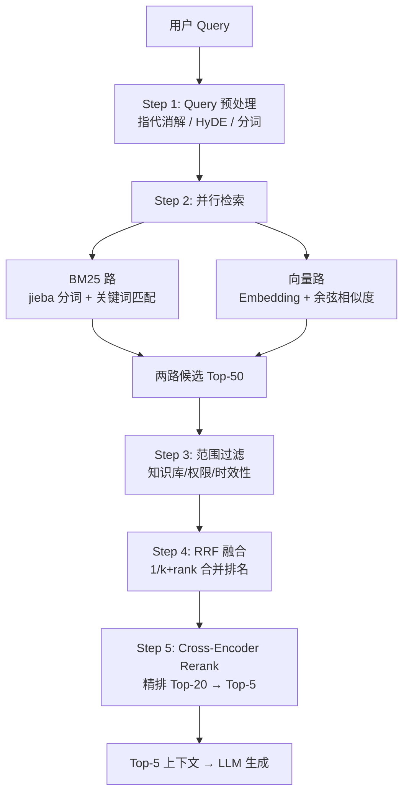

# 混合检索：向量 + BM25 + RRF 融合

> **一句话**：向量检索找"意思相近"，BM25 找"字面对得上"，RRF 把两路结果拼成一份靠谱清单——三剑合璧，召回率和精准率同时起飞。


---

## 一、为什么一种检索不够？——"盲人摸象" analogy

想象你和两个朋友一起摸一头大象：

- **BM25（关键词检索）** 像摸到象鼻的朋友："这有个长长的管子，表面粗糙有纹路" → 精确描述局部特征
- **向量检索（语义检索）** 像摸到象腿的朋友："这是个粗壮的柱子，支撑着庞大身躯" → 理解整体语义

如果只信一个人的描述，你对大象的认知是残缺的。混合检索就是让两个人同时描述，再综合成完整画面。

**两类查询的"翻车"现场：**

| 查询类型 | 只用 BM25 | 只用向量检索 | 结果 |
| --- | --- | --- | --- |
| "报销制度"（标题原词） | ✅ 标题精确命中 | ❌ 语义漂移（可能匹配"费用审批""差旅标准"） | BM25 稳 |
| "如何推销保险产品"（口语改写） | ❌ "推销"和"销售"没对上 | ✅ 语义相近匹配到"保险销售技巧" | 向量稳 |
| "404 状态码"（专业术语） | ✅ 精确命中错误码 | ❌ 可能匹配"HTTP 错误""页面不存在"等泛泛内容 | BM25 稳 |
| "现金价值"（保险术语） | ❌ 通用语境下被日常财务内容淹没 | ⚠️ 可能正确，也可能漂移 | 都不稳，需要混合 |

> BM25 和向量检索解决的是不同类型的'漏找'问题。BM25 对标题、编号和领域术语这类原词明确的内容更稳定，向量检索更适合用户换了一种说法的情况。
> 

---

## 二、向量检索（Dense Retrieval）——"找意思相近的"

### 2.1 核心原理

把查询和文档都转换成**高维向量**（Embedding），在向量空间里计算相似度。语义相近的内容，向量距离就近。

```text
用户问："如何推销保险产品？"
↓ Embedding 模型编码
Query Vector: [0.12, -0.34, 0.89, ...]  (768/1024/1536 维)

文档库：
  Doc1: "保险销售技巧" → Vector1: [0.15, -0.30, 0.85, ...] → cos_sim = 0.92 ✅
  Doc2: "保险产品介绍" → Vector2: [0.08, -0.20, 0.60, ...] → cos_sim = 0.75
  Doc3: "保险理赔流程" → Vector3: [-0.10, 0.40, 0.20, ...] → cos_sim = 0.30
```

### 2.2 向量检索的优缺点

| 维度 | 评价 |
| --- | --- |
| **优势** | 理解语义和同义词；不受关键词变形影响（"推销"≈"销售"）；能处理口语化查询 |
| **劣势** | 对专业术语/错误码/编号等精确匹配弱；短查询容易语义漂移；依赖 Embedding 模型质量 |
| **适用** | 概念搜索、语义相似性查询、用户换说法的情况 |
| **不适用** | 精确术语匹配、短标题查询、需要原词命中的场景 |

### 2.3 常用 Embedding 模型

| 模型 | 维度 | 特点 | 适用场景 |
| --- | --- | --- | --- |
| text-embedding-3-small | 1536 | OpenAI 出品，性价比高 | 通用场景 |
| text-embedding-3-large | 3072 | 精度更高，成本也高 | 高精度需求 |
| bge-m3 | 1024 | 北京智源，开源可本地部署 | 中文场景优选 |
| Jina Embeddings | 768/1024 | 长上下文支持好 | 长文档检索 |
| all-MiniLM-L6-v2 | 384 | 轻量快速，本地运行 | 资源受限场景 |

---

## 三、BM25 检索（Sparse Retrieval）——"找字面对得上的"

### 3.1 什么是 BM25？

BM25（Best Match 25）是信息检索领域最经典的关键词检索算法，基于**概率模型**，计算查询关键词与文档的相关性分数。

> 💡 **通俗理解**：BM25 就像一个"关键词匹配专家"，它判断文档中包含查询关键词的程度，并给出一个相关性分数。
> 

### 3.2 BM25 的核心思想（不用背公式，理解即可）

BM25 公式虽然看起来复杂，但核心就三个要素：

```text
相关性分数 = TF 因子 × IDF 因子 × 长度归一化因子
```

| 因子 | 通俗解释 | 作用 |
| --- | --- | --- |
| **TF（词频）** | 关键词在文档中出现次数越多，越相关 | 但会"饱和"——出现 10 次和 100 次差别不大 |
| **IDF（逆文档频率）** | 关键词在整个文档集合中越稀有，区分度越高 | "发票"比"的"更有区分价值 |
| **长度归一化** | 短文档中出现关键词比长文档中更重要 | 避免 1000 页的书因为词多而获得不公平优势 |

**与 TF-IDF 的区别：**

| 对比维度 | TF-IDF | BM25 |
| --- | --- | --- |
| 词频处理 | 线性增长（词越多分越高） | 饱和函数（超过一定次数不再大幅增长） |
| 文档长度 | 简单归一化 | 更精细的概率模型归一化 |
| 效果 | 基础版本 | 工业标准，效果更稳定 |

### 3.3 BM25 的优缺点

| 维度 | 评价 |
| --- | --- |
| **优势** | 精确匹配关键词；对标题/编号/术语非常稳定；计算速度快；可解释性强 |
| **劣势** | 无法理解语义和同义词；用户换说法就找不到；对长尾查询效果差 |
| **适用** | 精确关键词搜索、文档检索、标题匹配、错误码查询 |
| **不适用** | 语义搜索、同义词查询、口语化表达 |

### 3.4 BM25 在 Python 中的实现

```python
from rank_bm25 import BM25Okapi
import jieba

# 1. 准备文档集
documents = [
    "保险销售技巧与实战",
    "报销制度与费用审批流程",
    "HTTP 404 错误码排查指南",
    "现金价值的计算方法"
]

# 2. 分词（中文用 jieba，英文直接 split）
tokenized_docs = [list(jieba.cut(doc)) for doc in documents]

# 3. 构建 BM25 索引
bm25 = BM25Okapi(tokenized_docs)

# 4. 查询
query = "如何推销保险"
query_tokens = list(jieba.cut(query))
scores = bm25.get_scores(query_tokens)

# 5. 获取 Top-K
import numpy as np
top_indices = np.argsort(scores)[::-1][:3]
for idx in top_indices:
    print(f"Doc {idx}: {documents[idx]} (score: {scores[idx]:.4f})")
```

---

## 四、混合检索架构——"双塔并行，合纵连横"

### 4.1 五步流程



### 4.2 关键设计点

```text
┌─────────────────────────────────────────────────────────────────┐
│                      混合检索五步流程                            │
├─────────────────────────────────────────────────────────────────┤
│  Step 1: 接收用户问题                                            │
│       ↓                                                         │
│  Step 2: 并行检索 ──┬──→ BM25 路线（关键词匹配）                 │
│                    └──→ 向量路线（语义相似度）                    │
│       ↓                                                         │
│  Step 3: 限定资料范围（知识库/文档集过滤）                        │
│       ↓                                                         │
│  Step 4: 融合（RRF / 加权）→ 统一候选清单                        │
│       ↓                                                         │
│  Step 5: 重排序（ReRank）→ 截取 Top-K 交给 LLM                   │
└─────────────────────────────────────────────────────────────────┘
```

### 4.2 关键设计点

**为什么初次检索要多取一些候选？**

> 因为重排只能处理已经找回的内容。如果一开始只拿最终要展示的几条，正确原文排在稍后位置，重排根本看不到它，也就没有机会把它提到前面。
> 

**融合 ≠ 重排：**

| 环节 | 职责 | 解决的问题 |
| --- | --- | --- |
| **融合（Fusion）** | 把多路结果放进同一份候选清单 | "有没有把正确证据带回来" |
| **重排（ReRank）** | 重新比较用户问题和每段候选，把更相关的放到前面 | "找到后排得好不好" |

> 💡 **注意**："重排能不能解决漏召回？" → **不能**。如果正确原文没进入候选集，重排模型再强也找不回来。
> 

---

## 五、RRF 融合算法深度解析——"不看分数，只看排名"

### 5.1 为什么要用 RRF？

两路检索返回的分数不是同一种数值：

- BM25 分数：可能是 0~30 的浮点数
- 向量相似度：可能是 -1~1 的余弦相似度

它们像"百分制成绩"和"五分制评价"——直接相加没有任何意义。

**RRF 的聪明之处**：完全抛弃原始分数，只看**排名位置**。

### 5.2 RRF 核心公式

```text
RRF_score(d) = Σ 1 / (k + rank_r(d))
```

| 符号 | 含义 |
| --- | --- |
| `d` | 某个文档 |
| `rank_r(d)` | 文档 d 在第 r 个检索结果列表中的排名（从 1 开始） |
| `k` | 平滑常数（通常 = 60） |
| `Σ` | 对所有检索系统的贡献求和 |

### 5.3 RRF 计算示例

假设同一个文档在两路检索中的排名：

| 文档 | BM25 排名 | 向量排名 | RRF 计算 | 总分 |
| --- | --- | --- | --- | --- |
| DocA | 第 1 名 | 第 3 名 | 1/(60+1) + 1/(60+3) | **0.0323** |
| DocB | 第 2 名 | 第 1 名 | 1/(60+2) + 1/(60+1) | **0.0325** ✅ |
| DocC | 第 3 名 | 第 2 名 | 1/(60+3) + 1/(60+2) | **0.0321** |
| DocD | 未进入 Top | 第 4 名 | 0 + 1/(60+4) | 0.0156 |

**结果**：DocB 在两路中都靠前，RRF 分数最高，排在第一位！

### 5.4 k 值的作用——"平滑因子"

| k 值 | 效果 | 适用场景 |
| --- | --- | --- |
| k = 10 | 高排名文档优势极大，低排名几乎被忽略 | 强调头部精准度 |
| **k = 60** | **平衡头部和尾部，工业标准值** | **通用场景（推荐）** |
| k = 100 | 更保守，低排名文档也有机会 | 数据量大、强调召回 |

> 💡 **实践建议**："k 通常设为 60，这是经过大量实验验证的经验值。k 越大越保守，低排名的文档贡献不会被过度压制；k 越小头部效应越强。"
> 

### 5.5 RRF 的优缺点

| 维度 | 评价 |
| --- | --- |
| **优势** | 不依赖分数归一化（跨系统兼容性强）；简单高效；通过"多系统共识"提升稳健性；无需训练 |
| **劣势** | 忽略原始相关性分数（可能损失细粒度信号）；需要多次检索（额外延迟）；需处理文档去重 |
| **适用** | 混合检索、多查询检索、多模态检索融合 |

### 5.6 RRF Python 实现

```python
from collections import defaultdict

def reciprocal_rank_fusion(result_lists, k=60):
    """
    RRF 融合算法
    
    result_lists: 多个检索系统的结果列表，每个列表已按相关性排序
                  如 [bm25_results, vector_results]
    k: 平滑常数，默认 60
    """
    scores = defaultdict(float)
    
    for result_list in result_lists:
        for rank, doc_id in enumerate(result_list, start=1):
            # 核心公式：1 / (k + rank)
            scores[doc_id] += 1.0 / (k + rank)
    
    # 按 RRF 分数降序排序
    sorted_results = sorted(
        scores.items(), 
        key=lambda x: x[1], 
        reverse=True
    )
    
    return sorted_results

# 示例
bm25_results = ["doc_A", "doc_B", "doc_C", "doc_D"]
vector_results = ["doc_C", "doc_A", "doc_E", "doc_B"]

fused = reciprocal_rank_fusion([bm25_results, vector_results], k=60)
print(fused)
# 输出: [('doc_A', 0.0325), ('doc_C', 0.0325), ('doc_B', 0.0323), ...]
```

---

## 六、加权融合 vs RRF——"两种融合策略怎么选"

### 6.1 加权融合（Weighted Score Fusion）

把各路的原始分数归一化后加权求和：

```text
final_score = α × normalize(BM25_score) + β × normalize(vector_score)
```

| 维度 | 说明 |
| --- | --- |
| **优点** | 保留了原始分数的细粒度信息；可以灵活调整权重 |
| **缺点** | 需要分数归一化（Z-score / Min-Max）；权重调参困难；不同系统的分数范围差异大 |
| **适用** | 检索系统少（2~3 路）、分数分布稳定、有调参资源 |

### 6.2 RRF 融合

只看排名，不看分数：

```text
RRF_score = Σ 1 / (k + rank_i)
```

| 维度 | 说明 |
| --- | --- |
| **优点** | 无需归一化；对分数分布不敏感；实现简单；跨系统兼容性强 |
| **缺点** | 丢失原始分数信息；k 值需要一定调参 |
| **适用** | 检索系统多、分数分布差异大、追求快速落地 |

### 6.3 对比总结

| 维度 | 加权融合 | RRF |
| --- | --- | --- |
| 是否需归一化 | ✅ 需要 | ❌ 不需要 |
| 是否保留原始分数 | ✅ 保留 | ❌ 只看排名 |
| 调参复杂度 | 高（权重 + 归一化方法） | 低（只有一个 k） |
| 跨系统兼容性 | 差 | 好 |
| 工业界偏好 | 部分场景 | **主流选择** |

> RRF 是工业界的主流选择，因为它简单、稳定、无需调参。加权融合在特定场景下可能更精准，但需要大量实验确定权重，维护成本高。
> 

---

## 七、工程实践——从零搭建混合检索

### 7.1 Milvus 2.5 原生混合检索（推荐方案）

Milvus 2.5 内置了 Sparse-BM25，支持原生混合检索：

```python
from pymilvus import MilvusClient, AnnSearchRequest, RRFRanker

client = MilvusClient(uri="http://localhost:19530")

# 1. 构建稠密向量检索请求
dense_request = AnnSearchRequest(
    data=[query_embedding],      # 查询向量
    anns_field="dense",          # 稠密向量字段
    param={"metric_type": "IP", "params": {"nprobe": 10}},
    limit=50
)

# 2. 构建 BM25 稀疏向量检索请求
bm25_request = AnnSearchRequest(
    data=[query_text],           # 原始查询文本
    anns_field="sparse_bm25",    # BM25 稀疏向量字段
    param={"metric_type": "BM25"},
    limit=50
)

# 3. 使用 RRF 融合
ranker = RRFRanker(k=100)

# 4. 执行混合检索
results = client.hybrid_search(
    collection_name="my_collection",
    reqs=[dense_request, bm25_request],
    ranker=ranker,
    limit=10,
    output_fields=["text"]
)
```

### 7.2 Elasticsearch 混合检索

ES 8.8+ 支持 RRF 原生融合：

```python
# ES 查询示例
POST /my_index/_search
{
  "retriever": {
    "rrf": {
      "retrievers": [
        {
          "standard": {
            "query": {
              "match": {
                "content": "报销制度"
              }
            }
          }
        },
        {
          "knn": {
            "field": "embedding",
            "query_vector": [0.12, -0.34, ...],
            "k": 50
          }
        }
      ],
      "rank_window_size": 50,
      "rank_constant": 60
    }
  }
}
```

### 7.3 纯 Python 实现（教学版）

```python
import numpy as np
from sklearn.metrics.pairwise import cosine_similarity
from rank_bm25 import BM25Okapi
import jieba

class HybridRetriever:
    def __init__(self, documents, embeddings):
        """
        documents: 原始文档列表
        embeddings: 对应的向量列表 (numpy array)
        """
        self.documents = documents
        self.embeddings = np.array(embeddings)
        
        # 构建 BM25 索引
        self.tokenized_docs = [list(jieba.cut(doc)) for doc in documents]
        self.bm25 = BM25Okapi(self.tokenized_docs)
    
    def bm25_search(self, query, top_k=50):
        """BM25 关键词检索"""
        tokens = list(jieba.cut(query))
        scores = self.bm25.get_scores(tokens)
        top_indices = np.argsort(scores)[::-1][:top_k]
        return [(idx, scores[idx]) for idx in top_indices if scores[idx] > 0]
    
    def vector_search(self, query_embedding, top_k=50):
        """向量语义检索"""
        similarities = cosine_similarity(
            [query_embedding], 
            self.embeddings
        )[0]
        top_indices = np.argsort(similarities)[::-1][:top_k]
        return [(idx, similarities[idx]) for idx in top_indices]
    
    def rrf_fusion(self, bm25_results, vector_results, k=60, final_top_k=10):
        """RRF 融合"""
        scores = {}
        
        # BM25 贡献
        for rank, (doc_idx, _) in enumerate(bm25_results, start=1):
            scores[doc_idx] = scores.get(doc_idx, 0) + 1.0 / (k + rank)
        
        # 向量贡献
        for rank, (doc_idx, _) in enumerate(vector_results, start=1):
            scores[doc_idx] = scores.get(doc_idx, 0) + 1.0 / (k + rank)
        
        # 排序并返回
        sorted_docs = sorted(scores.items(), key=lambda x: x[1], reverse=True)
        return sorted_docs[:final_top_k]
    
    def search(self, query, query_embedding, top_k=10):
        """完整混合检索流程"""
        # 1. 两路并行检索
        bm25_results = self.bm25_search(query, top_k=50)
        vector_results = self.vector_search(query_embedding, top_k=50)
        
        # 2. RRF 融合
        fused = self.rrf_fusion(bm25_results, vector_results, k=60, final_top_k=top_k)
        
        # 3. 返回结果
        return [(self.documents[idx], score) for idx, score in fused]
```

---

## 八、参数调优与工程细节

### 8.1 各路检索取多少候选？

| 参数 | 推荐值 | 理由 |
| --- | --- | --- |
| 每路 Top-K | 20~50 | 太少会漏掉正确证据，太多引入噪声 |
| RRF 最终 Top-K | 5~10 | 给 LLM 的上下文窗口有限 |
| RRF k 值 | 60 | 经验标准值，10~100 可调 |

### 8.2 文档去重

跨结果列表需对"同一文档"稳定去重，建议使用复合键：

```python
# 推荐去重键
doc_key = f"{source}:{page}:{hash(chunk_content)}"
```

### 8.3 检索阶段引入重排（ReRank）

RRF 融合后，可以用 Cross-Encoder 做精排：

```text
用户 Query → BM25 Top-50 ──┐
                            ├──→ RRF 融合 Top-20 ──→ Cross-Encoder 重排 ──→ Top-5 给 LLM
用户 Query → 向量 Top-50 ──┘
```

常用 ReRank 模型：

- BGE-Reranker / BGE-Reranker-v2
- Jina Reranker
- Cohere Rerank

---

---

## 十、总结：混合检索的"黄金 Pipeline"

```text
┌─────────────┐    ┌─────────────┐    ┌─────────────┐    ┌─────────────┐
│  用户 Query  │───→│  双路并行    │───→│  RRF 融合    │───→│  ReRank 精排 │───→ LLM
│             │    │  召回 Top-50 │    │  统一 Top-20 │    │  最终 Top-5  │
└─────────────┘    └──────┬──────┘    └─────────────┘    └─────────────┘
                          │
              ┌───────────┴───────────┐
              ↓                       ↓
        ┌─────────┐             ┌─────────┐
        │  BM25   │             │ 向量检索 │
        │ 关键词   │             │ 语义相似 │
        └─────────┘             └─────────┘
```

> 混合检索不是堆方法，而是解决一个具体问题——精确词面和语义改写，可能分别把正确原文带进候选集。RRF 用排名而非分数做融合，简单稳定无需训练。**重排只能调整已找回的内容，不能救回候选集之外的证据**。
> 


## 
> ▶ 对应原理：[[17-语义搜索与混合检索|17-语义搜索与混合检索]]

相关链接

- 项目实践：[[项目实战/ai-resume笔记/01_技术研读/02_RAG流水线#第 4 层：检索链路|ai-resume: RAG流水线]]

---

→ [[技术学习清单#RAG]]

## 速记卡（面试闪卡）

**Q1：一句话讲清「混合检索：向量 + BM25 + RRF 融合」到底是什么？**
A：想象你和两个朋友一起摸一头大象：
**BM25（关键词检索）** 像摸到象鼻的朋友："这有个长长的管子，表面粗糙有纹路" → 精确描述局部特征
**向量检索（语义检索）** 像摸到象腿的朋友："这是个粗壮的柱子，支撑着庞大身躯" → 理解整体语义
如果只信一个人的描述，你对大象的认知是残缺的。混合检索就是让两个人同时描述，再综合成完整画面。

**Q2：一、为什么一种检索不够？——"盲人摸象" analogy —— 怎么理解？**
A：想象你和两个朋友一起摸一头大象：
**BM25（关键词检索）** 像摸到象鼻的朋友："这有个长长的管子，表面粗糙有纹路" → 精确描述局部特征
**向量检索（语义检索）** 像摸到象腿的朋友："这是个粗壮的柱子，支撑着庞大身躯" → 理解整体语义
如果只信一个人的描述，你对大象的认知是残缺的。混合检索就是让两个人同时描述，再综合成完整画面。

**Q3：二、向量检索（Dense Retrieval）——"找意思相近的" —— 怎么理解？**
A：把查询和文档都转换成**高维向量**（Embedding），在向量空间里计算相似度。语义相近的内容，向量距离就近。
| 维度 | 评价 |
| --- | --- |
| **优势** | 理解语义和同义词；不受关键词变形影响（"推销"≈"销售"）；能处理口语化查询 |
| **劣势** | 对专业术语/错误码/编号等精确匹配弱；短查询容易语义漂移；

**Q4：三、BM25 检索（Sparse Retrieval）——"找字面对得上的" —— 怎么理解？**
A：BM25（Best Match 25）是信息检索领域最经典的关键词检索算法，基于**概率模型**，计算查询关键词与文档的相关性分数。
💡 **通俗理解**：BM25 就像一个"关键词匹配专家"，它判断文档中包含查询关键词的程度，并给出一个相关性分数。

**Q5：四、混合检索架构——"双塔并行，合纵连横" —— 怎么理解？**
A：**为什么初次检索要多取一些候选？**
因为重排只能处理已经找回的内容。如果一开始只拿最终要展示的几条，正确原文排在稍后位置，重排根本看不到它，也就没有机会把它提到前面。
**融合 ≠ 重排：**
| 环节 | 职责 | 解决的问题 |
| --- | --- | --- |
| **融合（Fusion）** | 把多路结果放进同一份候选清单 | "有没有把正确证据带回来" |

**Q6：核心速记主线有哪些？**
A：抓住这几根：一、为什么一种检索不够？——"盲人摸象" analogy、二、向量检索（Dense Retrieval）——"找意思相近的"、三、BM25 检索（Sparse Retrieval）——"找字面对得上的"、四、混合检索架构——"双塔并行，合纵连横"、五、RRF 融合算法深度解析——"不看分数，只看排名"、六、加权融合 vs RRF——"两种融合策略怎么选"。

