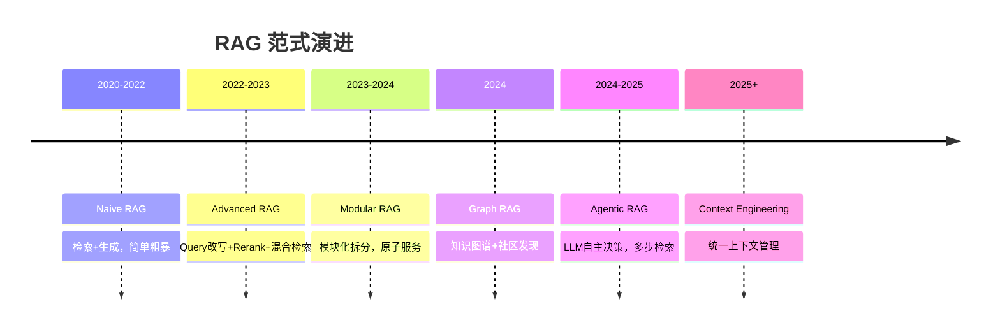
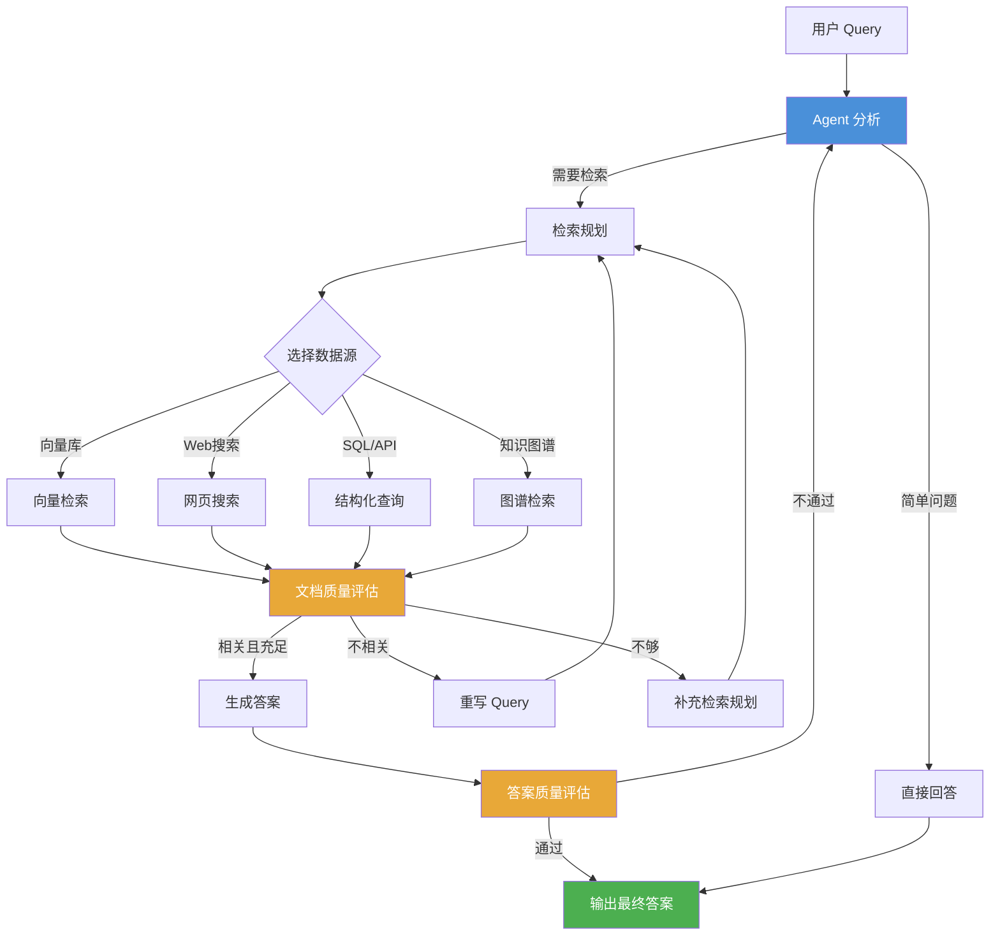
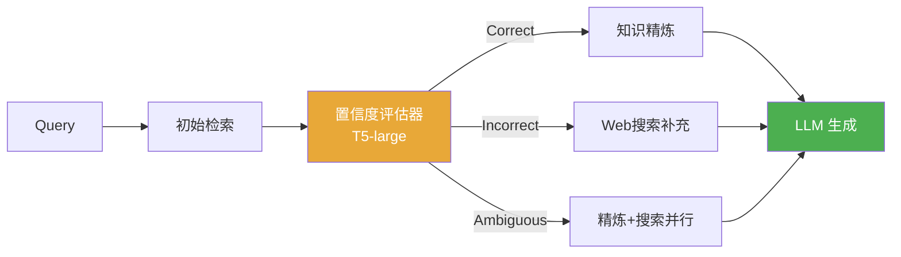
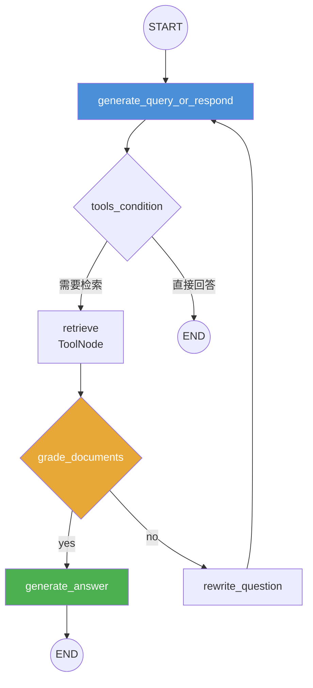

# Agentic RAG：LLM 主动决策多次检索 vs 传统单次被动检索

> **一句话**：Agentic RAG = 在 RAG 的每个关键节点上都让 LLM 做决策，形成"决策→执行→评估→纠错"的闭环。


---

## 一、RAG 范式演进路线：从搬运工到决策者

**想象一下：你在一间巨大的图书馆里找答案。**

- **Naive RAG（2020-2022）**：你问管理员一个问题，他随手从最近的架子上拿一本书给你。对不对全靠运气。
- **Advanced RAG（2022-2023）**：管理员学会了用搜索系统，还懂得给你的问题换个说法再搜一遍（Query 改写），结果好了一些。
- **Modular RAG（2023-2024）**：图书馆拆成了多个专区（向量库、图数据库、SQL），每个区有专门的检索策略。
- **Graph RAG（2024）**：管理员不仅搜书，还理解书和书之间的关系网，能做跨文档推理。
- **Agentic RAG（2024-2025）🔥*：管理员变成了一个***聪明的研究助理**——他会判断你的问题需不需要查资料、从哪里查、查到的够不够、答案对不对，不行就自己换策略再来一轮。

---



---

## 局限 1：检索一次，生成一次（无纠错）

传统 RAG 的流程是线性的：Query → Embedding → 向量检索 → Top-K 文档 → LLM 生成。问题来了——

- **如果检索到的文档**完全不相关？LLM 只能硬编，幻觉概率飙升
- **如果检索到的文档**只覆盖了一半？LLM 没法主动去查缺失的那一半
- **如果用户的原始问题**表述不清？系统不会帮你澄清，直接带着歧义去检索

## 局限 2：无法多步推理（单跳限制）

很多问题需要多跳推理（multi-hop reasoning），比如：

> "2024 年图灵奖获得者的博士导师是谁？他主要研究什么领域？"
>

这需要：先查出 2024 图灵奖得主 → 再查他的导师 → 再查导师的研究领域。传统 RAG 一次检索根本搞不定，它只会把这三个问题混成一个 embedding 去搜，结果可想而知。

## 局限 3：适应性差（一刀切策略）

传统 RAG 对所有问题都用同一套流程——向量检索 + Top-K。但实际上不同类型的问题应该用不同的检索策略：

| **问题类型** | **应该用的策略** | **传统 RAG 实际用的** |
| --- | --- | --- |
| 事实型"Python GIL 是什么？" | 向量检索就够了 | 向量检索 ✓ |
| 比较型"FastAPI vs Flask" | 分别检索再对比 | 混在一起搜 ✗ |
| 实时型"今天北京天气" | Web 搜索/API | 向量库过时数据 ✗ |
| 多跳型"X的导师的研究" | 多步链式检索 | 一次检索 ✗ |
| 简单闲聊"你好" | 不需要检索 | 还是去检索了 ✗ |

---

## 三、Agentic RAG：LLM 接管决策权


核心一句话：Agentic RAG = 在 RAG 的每个关键节点上都让 LLM 做决策，形成"决策→执行→评估→纠错"的闭环。

## Agentic RAG 的完整工作流（12步）

1. 用户输入原始 Query
2. **Agent 分析 Query**——判断：这是简单问题（直接回答）还是复杂问题（需要检索）？
3. **检索规划**——决定从哪些数据源检索：向量库 / Web / SQL / API / 知识图谱
4. **Query 改写/分解**——把复杂问题拆成多个子问题，分别表述优化
5. **执行检索**——调用选定的检索工具
6. **文档质量评估**——判断检索到的文档是否与问题相关
7. **证据充足性检查**——判断已有信息是否足以回答问题
8. 如果不够*→ 回到步骤 2-5，重新规划/改写/检索（***核心循环**）
9. **答案生成**——基于充分的高质量上下文生成回答
10. **答案质量评估**——检查答案是否准确、完整、无幻觉
11. 如果答案不合格*→ 回到步骤 2，重新开始（***第二重循环**）
12. **输出最终答案**

---
## 代码实现：Agentic RAG 核心循环

```python
"""
Agentic RAG 核心循环：LLM 在每个环节做决策，实现自我纠错。
关键区别：传统 RAG 是"检索一次就生成"，Agentic 是"不满意就重来"。
"""
from openai import OpenAI
import json

client = OpenAI(
    api_key=os.getenv("DEEPSEEK_API_KEY"),
    base_url="https://api.deepseek.com",
)

class AgenticRAG:
    """Agentic RAG 循环：决策→检索→评估→再决策"""

    def __init__(self, retriever, llm_model="deepseek-v4-pro"):
        self.retriever = retriever          # 检索器（Chroma/BM25）
        self.model = llm_model
        self.max_rounds = 3                  # 最多检索 3 轮

    def _decide(self, query: str, context: list[str]) -> str:
        """LLM 决策下一步：直接回答 / 检索 / 重写查询"""
        prompt = f"""判断当前状态，只输出一个词：
- answer: 信息充足，可以回答
- retrieve: 需要检索更多信息
- rewrite: 当前查询不清晰，需要重写

用户问题: {query}
已有上下文: {' '.join(context[-3:]) if context else '无'}"""

        resp = client.chat.completions.create(
            model=self.model,
            messages=[{"role": "user", "content": prompt}],
            temperature=0.0,
        )
        return resp.choices[0].message.content.strip().lower()

    def run(self, query: str) -> str:
        """执行 Agentic RAG 循环"""
        context = []

        for round in range(1, self.max_rounds + 1):
            decision = self._decide(query, context)

            if decision == "answer":
                # 信息充足，生成最终回答
                return self._generate(query, context)

            elif decision == "retrieve":
                # 执行检索，结果加入上下文
                docs = self.retriever.search(query)
                context.append(f"第{round}轮检索: {' '.join(docs[:2])}")

            elif decision == "rewrite":
                # LLM 重写查询后重新检索
                query = self._rewrite(query, context)

        # 达到最大轮数，用已有信息生成
        return self._generate(query, context)

    def _rewrite(self, query: str, context: list[str]) -> str:
        """LLM 重写查询"""
        resp = client.chat.completions.create(
            model=self.model,
            messages=[{"role": "user",
                       "content": f"重写这个查询，使其更清晰：{query}"}],
        )
        return resp.choices[0].message.content

    def _generate(self, query: str, context: list[str]) -> str:
        """基于上下文生成最终答案"""
        resp = client.chat.completions.create(
            model=self.model,
            messages=[
                {"role": "system", "content": f"基于以下资料回答问题：{' '.join(context)}"},
                {"role": "user", "content": query},
            ],
        )
        return resp.choices[0].message.content
```




---

## 五、Agentic RAG vs 传统 RAG：全维度对比

| **对比维度** | **传统 RAG** | **Agentic RAG** |
| --- | --- | --- |
| 检索次数 | 固定 1 次 | 动态多次（按需） |
| 检索策略 | 统一向量检索 | 多种策略动态选择（向量/Web/API/SQL/图谱） |
| Query 处理 | 原始 Query 直接 Embedding | LLM 分析/改写/分解子问题 |
| 结果评估 | 无评估，直接用 | 文档相关性 + 证据充足性双重评估 |
| 纠错机制 | 无（错了就错了） | 双重循环：检索纠错 + 答案纠错 |
| 推理能力 | 单跳推理 | 多跳推理 + CoT |
| 响应延迟 | 低（1 次检索+1 次生成） | 高（多步决策+多次检索+多次生成） |
| Token 成本 | 低（1x） | 高（3-5x） |
| 适合场景 | 简单事实型问答 | 复杂多跳/多源/需要验证的场景 |

---

## 六、Agentic RAG 四大核心 Agentic 模式

*Agentic RAG 不是一种固定的架构，而是***四种 agentic 能力的组合运用**：

### 1. 反思模式（Reflection）

Agent 检查自己的输出质量，发现不足就自我修正。

- **文档评估：**"检索到的文档和问题相关吗？"
- **答案评估：**"我生成的答案有幻觉吗？引用准确吗？"
- **典型代表：**Self-RAG（生成中插入 reflection tokens 自主判断）

### 2. 规划模式（Planning）

Agent 把复杂问题拆解成有序的子任务，排优先级，按计划执行。

- **任务分解：**"比较 A 和 B" → 子任务 1: 检索 A 信息；子任务 2: 检索 B 信息；子任务 3: 对比分析
- **动态调整：**执行过程中发现新信息，可以修改后续计划
- **典型代表：**Plan-and-Solve / ReAct 模式

### 3. 工具使用模式（Tool Use）

Agent 根据问题动态选择最合适的工具/数据源。

| **工具/数据源** | **适用场景** | 例子 |
| --- | --- | --- |
| 向量数据库 | 语义相似度匹配 | "什么是 RAG？" |
| BM25 关键词 | 精确术语匹配 | "HTTP 502 错误码" |
| Web 搜索 | 实时/最新信息 | "今天 Python 3.13 发布了吗" |
| SQL 查询 | 结构化数据 | "上月订单金额" |
| 知识图谱 | 实体关系推理 | "X 公司的 CEO 的母校" |
| API 调用 | 特定服务 | "当前股价" |

### 4. 多智能体协作（Multi-Agent）

多个 Agent 分工合作，每个 Agent 专注自己的领域，由一个 Orchestrator 统筹协调。

- **规划 Agent**：负责分析问题、制定检索计划
- **搜索 Agent**：负责向量/文本检索
- **数据库 Agent**：负责 SQL/API 查询
- **图谱 Agent**：负责图数据库查询
- **评估 Agent**：负责文档/答案质量评估
- **澄清 Agent**：负责和用户交互澄清模糊问题


🏭 阿里云 Agentic RAG 2.0 就是多 Agent 架构的工业级落地案例。

---

### 4.1 CRAG（Corrective RAG）—— 纠正性检索增强

**CRAG 是目前工程落地性价比最高**的 Agentic RAG 方案。核心思想：在"检索"和"生成"之间加一道"质检 + 纠错 + 提纯"关卡。

### 三级置信度评估机制

- **Correct（高置信）**：文档高度相关 → 知识精炼（分解-过滤-重组，去粗取精）
- **Incorrect（低置信）**：文档完全无关 → 废弃 + 启动 Web 搜索补充信息
- **Ambiguous（模糊）**：不确定 → 双管齐下（精炼旧信息 + 搜索新信息）



**评估器用的是**`微调后的 T5-large`**，轻量、推理快、算力成本低。整个 CRAG 方案**不需要微调大模型，纯工程层面就能实现。

### 4.2 Self-RAG —— 自主反思检索

**Self-RAG 的核心创新是在生成过程中插入特殊的** `*reflection tokens*`：

| **`Reflection Token`** | 作用 | 示例判断 |
| --- | --- | --- |
| `[Retrieve]` | 是否需要检索 | "这个问题我需要查资料吗？" |
| `[IsRel]` | 文档是否相关 | "这段文档和问题有关吗？" |
| `[IsSup]` | 内容是否支持 | "检索内容能支撑我的回答吗？" |
| `[IsUse]` | 是否有用 | "引用这段内容有帮助吗？" |

**Self-RAG 的优点是**精度最高**（每个 token 生成级别都在反思），但缺点是**需要微调大模型来学习这些 reflection tokens，训练成本高、推理也慢。

### 4.3 Adaptive-RAG —— 自适应路由

**Adaptive-RAG 的思路更简洁：在检索之前先用一个轻量级分类器判断问题的复杂度，然后路由到不同策略**。

- **简单问题**→ No Retrieval（直接让 LLM 回答）
- **中等问题**→ Single Retrieval（传统 RAG 流程）
- **复杂问题**→ Multi-step Retrieval（Agentic 多步检索）

**优点是**效率高（不用所有问题都走复杂流程），缺点是分类器可能误判。

## 三大变体对比总结

| **维度** | **CRAG** | **Self-RAG** | **Adaptive-RAG** |
| --- | --- | --- | --- |
| 核心逻辑 | 检索→评估→纠错→生成 | 生成中自主反思+补充检索 | 前置分类→路由不同策略 |
| 训练成本 | 低（T5 级别） | 高（需微调大模型） | 低（轻量分类器） |
| 精度 | 中高 | 最高 | 中 |
| 延迟 | 中 | 高 | 低 |
| 落地难度 | 低 | 高 | 中 |
| 推荐场景 | 大多数业务首选 | 对精度要求极高 | 问题类型差异大 |


---

## 核心节点设计

| **`节点`** | **功能** | 关键操作 |
| --- | --- | --- |
| `generate_query_or_respond` | LLM 决策：检索还是直接回答 | .bind_tools([retriever_tool]) |
| `retrieve` | 执行向量检索 | ToolNode 包装 retriever_tool |
| `grade_documents` | 评估文档相关性 | 二元评分 yes/no |
| `rewrite_question` | 重写问题后重新检索 | LLM 改写 Query |
| `generate_answer` | 基于上下文生成答案 | LLM 生成 + 引用 |

## 两个核心循环

1. **检索纠错循环**：retrieve → grade_documents → 不相关 → rewrite_question → 重新检索
2. **答案纠错循环**：generate_answer → 答案评估不通过 → 回到 generate_query_or_respond 重新开始



## 核心代码骨架

```python
from langgraph.graph import StateGraph, START, END
from langgraph.prebuilt import ToolNode, tools_condition
from typing import Annotated
from langgraph.graph.message import add_messages

# 定义状态
class MessagesState(TypedDict):
    messages: Annotated[list, add_messages]

# 构建工作流
workflow = StateGraph(MessagesState)

# 添加节点
workflow.add_node("generate_query_or_respond")
workflow.add_node("retrieve", ToolNode([retriever_tool]))
workflow.add_node("grade_documents")
workflow.add_node("rewrite_question")
workflow.add_node("generate_answer")

# 添加边
workflow.add_edge(START, "generate_query_or_respond")
workflow.add_conditional_edges(
    "generate_query_or_respond",
    tools_condition,
    {"tools": "retrieve", END: END}
)
workflow.add_conditional_edges("retrieve", grade_documents, {"yes": "generate_answer", "no": "rewrite_question"})
workflow.add_edge("rewrite_question", "generate_query_or_respond")
workflow.add_edge("generate_answer", END)

# 编译
app = workflow.compile()
```


💡 关键理解：LangGraph 的 conditional_edges 就是实现"Agent 自主决策"的机制——LLM 的输出决定走哪条路。

---

### 1. Token 成本（3-5 倍）

传统 RAG：1 次 Embedding + 1 次 LLM 生成 ≈ 低成本

**Agentic RAG：N 次 LLM 决策 + N 次检索 + N 次文档评估 + M 次答案生成 ≈** 3-5 倍成本

### 2. 响应延迟（显著增加）

每多一个循环就多一轮 LLM 调用。从用户的 200ms 等到 3-10 秒，体验差距巨大。

### 3. LLM 决策不可靠

LLM 经常做出错误判断：明明不相关的文档说相关、明明够的信息说不够。这导致不必要的额外检索，反而浪费 Token 和时间。

### 4. 调试困难

多步决策链路长，出问题时很难定位是哪一环出了问题——是评估器太严？还是改写方向错了？

## 工程师的实用建议


🔨 ⚠️ 不是所有场景都需要 Agentic RAG！
• 简单 FAQ / 事实型问答 → 朴素 RAG + 好 chunking 就够了
• 需要多步推理 / 多数据源 / 高准确率 → Agentic RAG
• 80% 的日常场景，朴素 RAG 就够用

- **渐进式升级路径：**朴素 RAG → 加 Reranker → 加 Query 改写 → 视场景升级 Agentic
- **简化版 Agentic：**用轻量分类器选择检索策略，而非每次都让 LLM 深度思考
- **好的 RAG = 30% 技术 + 70% 数据**（50% 文档清洗 + 30% 评估调优 + 20% 技术选型）

## 开源框架选型金字塔

| **层级** | **框架** | 特点 | 适合 |
| --- | --- | --- | --- |
| 底层（开发者） | LangGraph / LangChain / AutoGen | 灵活，学习成本高 | 需要深度定制 |
| 中层（工程师） | RAGFlow / MaxKB | 平衡易用性和可定制 | 大多数团队 |
| 顶层（业务） | Dify / Coze | 上手快，容易碰壁 | 快速验证 / MVP |


⚠️ 血泪教训：80% 用 Dify/Coze 的团队会在 3 个月内遇到性能瓶颈，因为 RAG 优化高度依赖具体业务场景。

---

### 1. 长上下文 + RAG 深度融合（互补非替代）

**长上下文窗口（128K-1M tokens）能放下更多内容，但RAG 不会被替代**。正确的关系是互补：

- **RAG 做粗筛**：10 万文档 → Top-10 相关文档
- **长上下文做精读**：Top-10 文档 → 深度理解和生成

类比：RAG 是图书管理员的推荐，长上下文是你把推荐的书都翻开细读。两者缺一不可。

### 2. Context Engineering（上下文工程）

**RAG 正在演变为更广义的"Context Engineering"**——不只是检索文档片段，而是统一管理：领域知识、工具描述、交互历史、系统提示词等所有上下文信息。

### 3. 多 Agent 协作成为标配

阿里云 Agentic RAG 2.0 的多 Agent 架构（规划 Agent + Search Agent + DB Agent + Graph Agent + 澄清 Agent）正在成为工业界主流模式。

### 4. 垂直领域 RAG

通用 RAG 越来越不够用，医疗、法律、金融等垂直领域需要定制化的文档处理、评估标准和安全策略。

### 5. Anthropic Contextual Retrieval（2024.9）

- **Contextual Embedding**：用 LLM 给每个 chunk 添加文档级上下文前缀再 embedding
- **Contextual BM25**：同样添加上下文后做关键词检索


📈 效果：检索失败率降低 49%（Anthropic 官方数据）

---

---


## 速记卡（面试闪卡）

**Q1：一句话讲清「Agentic RAG：LLM 主动决策多次检索 vs 传统单次被动检索」到底是什么？**
A：Agentic RAG 让 LLM 在检索每个节点做决策，形成决策-评估-纠错的闭环。

**Q2：一、RAG 演进：从搬运工到决策者 —— 怎么理解？**
A：像图书馆管理员升级：Naive RAG 随手拿书（碰运气），Advanced RAG 会改写查询，Agentic RAG 变成研究助理——自己判断查不查、查哪、够不够、对不对（Agentic loop）。

**Q3：传统 RAG 的三道坎 —— 怎么理解？**
A：像只跑一趟的外卖：检索一次就生成，查偏了只能硬编（幻觉），多跳问题一步到位搞不定，所有问题一刀切策略（Single-shot）。无纠错、无多步、无适应。

**Q4：三、Agentic 怎么干活？—— 不满意就重来 —— 怎么理解？**
A：像带质检的流水线：检索→评估相关性→证据够不够→不够就重写/再查（Reflection），答案不对就重跑（Planning）。双重循环把"错了就错了"变成"错了就改"。

**Q5：四、三大变体与工程现实 —— 怎么理解？**
A：CRAG 检索后加质检（T5 轻量）、Self-RAG 生成中插反思 token（精度最高但贵）、Adaptive-RAG 先分类再路由。现实骨感：成本 3-5 倍、延迟升、决策会出错——80% 场景朴素 RAG 够用。

**Q6：核心速记主线有哪些？**
- 本质：每个节点 LLM 决策，决策→执行→评估→纠错闭环
- 传统三局限：无纠错、单跳、一刀切
- 四大模式：反思 / 规划 / 工具使用 / 多智能体
- 三大变体：CRAG（性价比高）、Self-RAG（精度高）、Adaptive-RAG（路由）
- 落地：成本与延迟翻倍，简单 FAQ 朴素 RAG 即可

**口诀**
A：传统RAG一趟跑，
Agentic会思考；
查不到位重检索，
纠错闭环步步高。

## 相关链接


---

→ [[技术学习路线图#RAG]]
