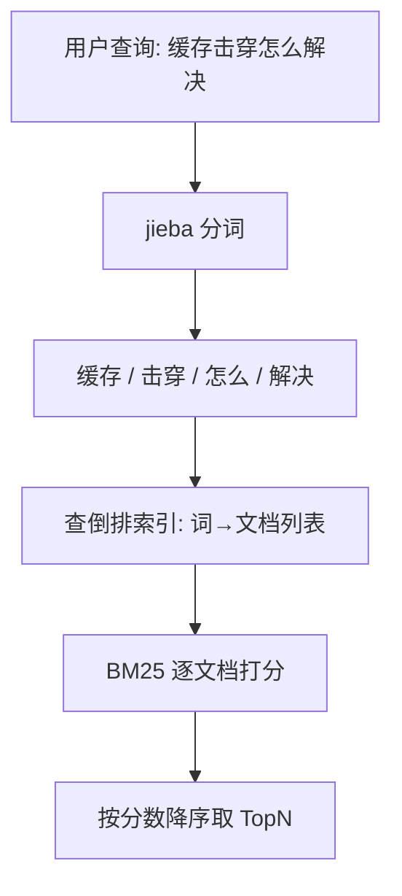
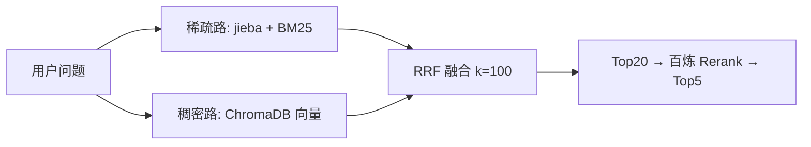

# jieba 分词 + BM25 关键词检索：让机器「按字找资料」也能找得准

> **一句话**：中文没有空格，jieba 是那把「切词刀」；BM25 是那个「打分员」——两者配合，专治语义检索「认不准」的精确标识符。

### 1.1 关键词检索：专治「字面一致」的查询

**关键词检索（Keyword Search）**：把查询和文档都拆成词，然后做**字面匹配**——谁的词重合多、重合得关键，谁就相关。它擅长「精确标识符」类查询：

- 产品型号：`BGE-M3`、`CUDA_ERROR_OUT_OF_MEMORY`
- 错误码：`Error 0x80070005`
- 专业术语：`缓存击穿`、`CAS 指令`

这些词，语义向量（把文字变成一串数字那种）反而「认不准」——因为训练数据里太少，向量编不进去。但关键词检索一字不差就能命中。**所以它是语义检索必不可少的互补项**。（来源：CSDN《RAG 系统必看！混合检索、关键词、语义一次讲清》2025）

### 1.2 jieba：中文分词的「刀」

**jieba**（结巴分词，名字来自「结巴」——切词切得磕磕巴巴的玩笑）是目前中文 NLP（Natural Language Processing，自然语言处理）最常用的事实标准分词库。它把「深度学习是人工智能的核心技术」切成 `[深度学习, 是, 人工智能, 的, 核心, 技术]`。

⚠️ **关键坑**（来源：CSDN 2026 多篇一致指出）：中文用 BM25 **必须先用 jieba 分词**，否则 BM25 会把整句话当成一个超长词，永远匹配不上。而且默认分词会把「深度学习」拆成「深度 / 学习」——专业词被切碎，召回就垮了。解决办法是加载**自定义词典**：

```python
import jieba

# ===== 基础分词 =====
text = "深度学习是人工智能的核心技术"
# cut_all=False: 精确模式，最常用，适合文本分析
words = jieba.lcut(text)
# cut_all=True: 全模式，把所有可能的词都切出来（速度快，但冗余）
words_all = jieba.lcut(text, cut_all=True)
# 在精确模式基础上，对长词再次切分（提高召回）
words_search = jieba.lcut_for_search(text)
# ===== 自定义词典 =====
jieba.add_word("深度学习", freq=10000)   # 让整词不被切开
jieba.add_word("大语言模型", freq=5000)  # 高 freq 提高成词概率
jieba.load_userdict("resume_terms.txt")  # 简历领域专有词表

# ===== 词性标注 =====
import jieba.posseg as pseg
for word, flag in pseg.cut("我在北京工作"):
    print(f"{word}/{flag}")
# ===== TF-IDF 关键词提取 =====
import jieba.analyse
keywords = jieba.analyse.extract_tags(
    "深度学习是人工智能的核心技术，深度学习在图像识别中应用广泛",
    topK=3,             # 取前 3 个关键词
    withWeight=True     # 带上权重分数
)
# ===== TextRank 关键词提取（基于图算法，不需要语料库）=====
keywords_tr = jieba.analyse.textrank(
    "深度学习是人工智能的核心技术，深度学习在图像识别中应用广泛",
    topK=3
)
# ['深度学习', '人工智能', '技术']
```

### 1.3 BM25：比 TF-IDF 更懂「分寸」的打分

**BM25 = Best Matching 25（最佳匹配 25）**，是概率检索模型下的打分算法，也是 TF-IDF（Term Frequency-Inverse Document Frequency，词频-逆文档频率）的改进版。它对每个查询词算一个分数再加总：

```text
Score(文档, 查询) = Σ   IDF(w) · [ TF(w)·(k1+1) ] / [ TF(w) + k1·(1−b+b·|D|/avgdl) ]
                      w∈查询
```

别被公式吓到，它其实就三件事（来源：CSDN《RAG 检索系统核心技术深度解析》2025）：

1. **IDF（Inverse Document Frequency，逆文档频率）**：这个词越稀有越值钱。「的」满世界都是，IDF 接近 0；「击穿」很少见，IDF 很高。
2. **词频饱和（k1，默认 1.2）**：一个词出现 100 次 ≠ 比出现 10 次重要 10 倍。BM25 用饱和曲线压住它——出现越多，边际贡献越低，避免「苹果」刷屏碾压优质文档。
3. **文档长度归一化（b，默认 0.75）**：长文档天然包含更多词、容易高分，b 把它拉回来；b=1 完全归一化，b=0 不管长度。

## 一、原理拆解：从一句话到排行榜

关键词检索的内部流程，本质是先建一张「词 → 哪些文档有它」的表（叫**倒排索引，Inverted Index**），查询时查表、打分、排序。



**倒排索引长啥样**（来源：CSDN 同上）：文档1「猫吃鱼」→ `[猫,吃,鱼]`；文档3「狗吃骨头」→ `[狗,吃,骨头]`。建出「猫→[doc1]」「吃→[doc1,doc3]」「鱼→[doc1]」。查「猫吃鱼」时，doc1 命中 3 个词 → 最相关。就是这么朴实。

**关键词 vs 语义，一张表看清边界**（来源：CSDN《混合检索、关键词、语义一次讲清》2025）：

| 场景 | 纯语义检索 | 纯关键词(BM25) | 混合检索 |
|-|-|-|-|
| 同义词理解（提升代码质量→提高可维护性） | ✅ | ❌ | ✅ |
| 精确术语（BGE-M3 模型） | ❌ | ✅ | ✅ |
| 产品型号/错误码 | ❌ | ✅ | ✅ |
| 长尾罕见词 | ❌ | ✅ | ✅ |
| 口语化/拼写容错 | ✅ | 部分 | ✅ |

结论很明确：**只有混合检索在所有场景都能覆盖**。这也是为什么「生产级 RAG 必须用混合检索」成了共识（来源同上）。

## 二、混合检索：两路并行 + RRF 融合

既然语义和关键词各有盲区，那就**两路都跑，再把结果合并**。合并最常用 **RRF（Reciprocal Rank Fusion，倒数排名融合）**：不看各自分数绝对值，只看「排名」——排第 1 的权重高，排第 100 的权重低。

```text
RRF_score(文档) = Σ  1 / (k + rank_i(文档))
                 i∈两路
```

k 通常取 60（Milvus 默认），**你项目里取的是 k=100**（来源：你项目 `CLAUDE.md` 调优记录 `rrf_k 60→100`）。排名越靠前，分母越小、分数越高；两路都靠前的文档会被推到最顶。



这条链路几乎就是**你简历项目 `ai-resume-analyzer` 的检索主干**：ChromaDB 稠密余弦（语义）＋ jieba/BM25 稀疏（关键词）→ RRF(k=100) 融合出 Top20 → 百炼 `qwen3-vl-rerank` 精排到 Top5。实测 composite_score 因此 +5.9%（0.5146→0.5448）。（来源：项目 `CLAUDE.md` 六阶段调优）


---

→ [[技术学习路线图#RAG]]

## 速记卡（面试闪卡）
**Q1：一句话讲清「jieba 分词 + BM25 关键词检索」到底是什么？**
A：中文没有空格，jieba 是那把「切词刀」，BM25 是那个「打分员」——两者配合，专治语义检索「认不准」的精确标识符（型号、错误码、术语）。

**Q2：二、它是什么 / 为什么需要它——怎么理解？**
A：关键词检索（Keyword Search）把查询和文档都拆成词做字面匹配，谁的词重合多、重合得关键谁就相关。它擅长「精确标识符」类查询：产品型号（BGE-M3、CUDA_ERROR_OUT_OF_MEMORY）、错误码（Error 0x80070005）、专业术语（缓存击穿、CAS 指令）。这些词语义向量反而认不准——训练数据里太少，编不进去；但关键词检索一字不差就能命中，所以它是语义检索必不可少的互补项。

**Q3：1.2 jieba——中文分词的「刀」怎么理解？**
A：jieba（结巴分词）是中文 NLP（Natural Language Processing，自然语言处理）事实标准分词库，把「深度学习是人工智能的核心技术」切成「[深度学习, 是, 人工智能, 的, 核心, 技术]」。关键坑：中文用 BM25 必须先用 jieba 分词，否则整句被当一个超长词永远匹配不上；默认还会把「深度学习」切成「深度/学习」，要用 jieba.add_word 加载自定义词典防专业词被切碎。还有全模式、搜索引擎模式、词性标注（pseg）、TF-IDF / TextRank 关键词提取。

**Q4：1.3 BM25——比 TF-IDF 更懂「分寸」的打分怎么理解？**
A：BM25 = Best Matching 25（最佳匹配 25），是概率检索模型下的打分算法、TF-IDF（Term Frequency-Inverse Document Frequency，词频-逆文档频率）的改进版。三件事：IDF（Inverse Document Frequency，逆文档频率）越稀有越值钱；词频饱和（k1 默认 1.2）压住刷屏词；文档长度归一化（b 默认 0.75）拉回长文档。

**Q5：四、混合检索——两路并行 + RRF 融合怎么理解？**
A：语义和关键词各有盲区，所以两路都跑再合并。合并最常用 RRF（Reciprocal Rank Fusion，倒数排名融合）：不看各自分数绝对值，只看排名——RRF_score = Σ 1/(k + rank_i)，k 通常取 60（Milvus 默认），你项目里取 k=100。这条链路几乎就是你简历项目 ai-resume-analyzer 的检索主干：ChromaDB 稠密余弦 + jieba/BM25 稀疏 → RRF(k=100) → 百炼 qwen3-vl-rerank 精排，实测 composite_score +5.9%。

**Q6：核心速记主线有哪些？**
A：二、它是什么 / 为什么需要它（关键词检索互补语义）、1.2 jieba（切词刀 + 自定义词典）、1.3 BM25（概率打分三要素）、三、原理拆解（倒排索引 Inverted Index）、四、混合检索（两路并行 + RRF 融合）。

**口诀**
A：中文无空格，jieba 先切词；
BM25 打分员，专治精确词；
两路并行 RRF，k 取六十最稳实。

## 相关链接

- 目录：[[00-AI]]
- 上一篇：[[13-RAG参数调优：网格搜索实验框架]]
- 下一篇：[[15-Agent架构与工具调用]]

---
→ [[技术学习路线图#RAG]]
