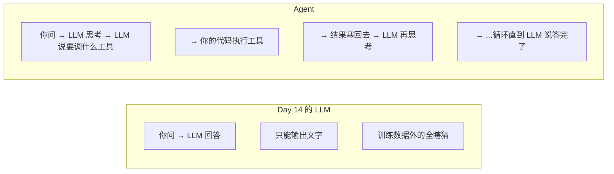
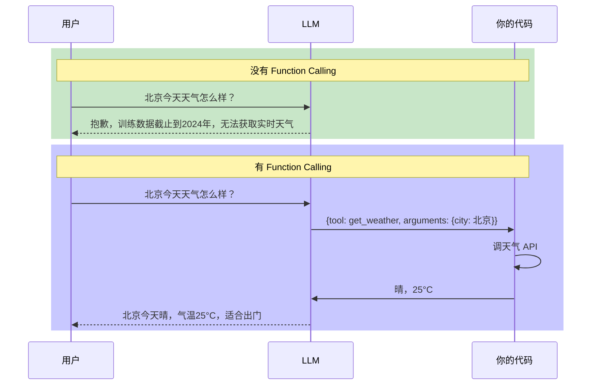
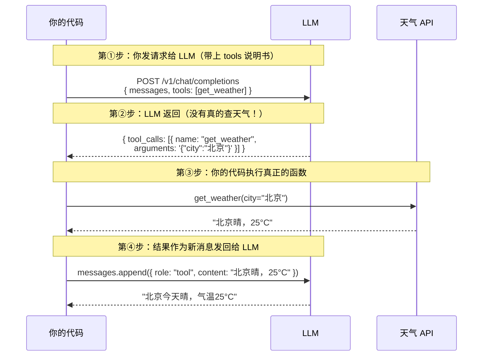
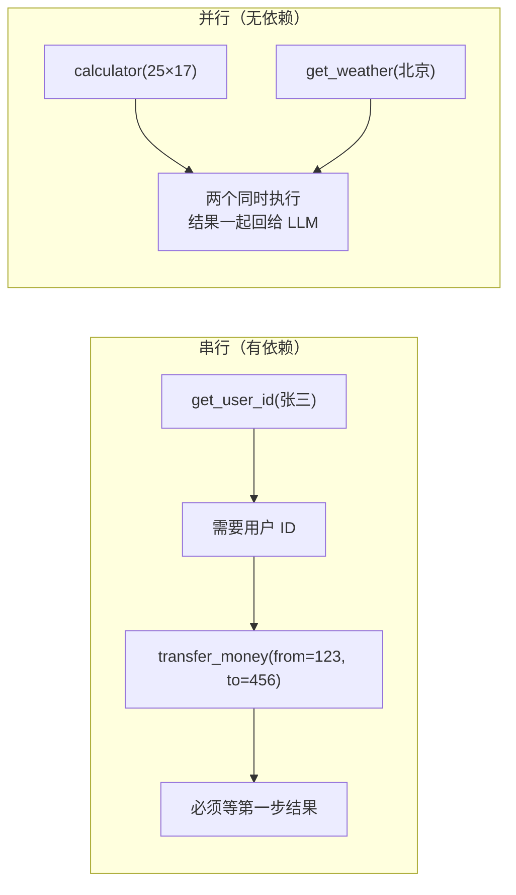
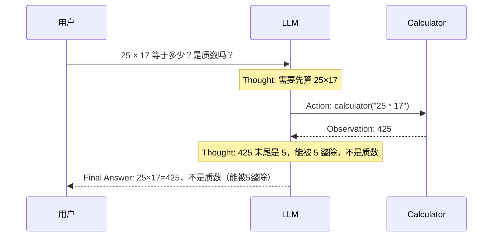
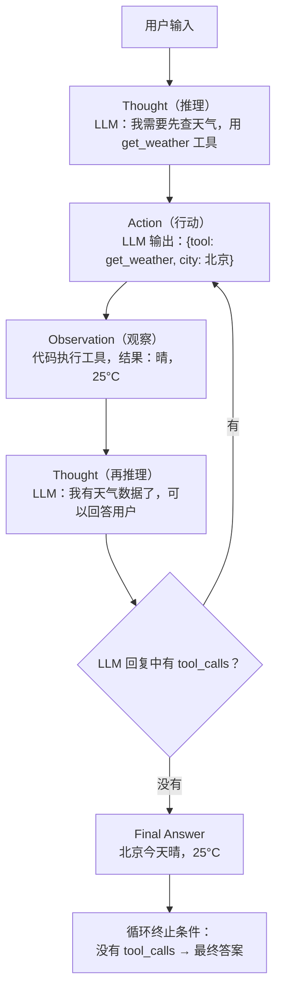
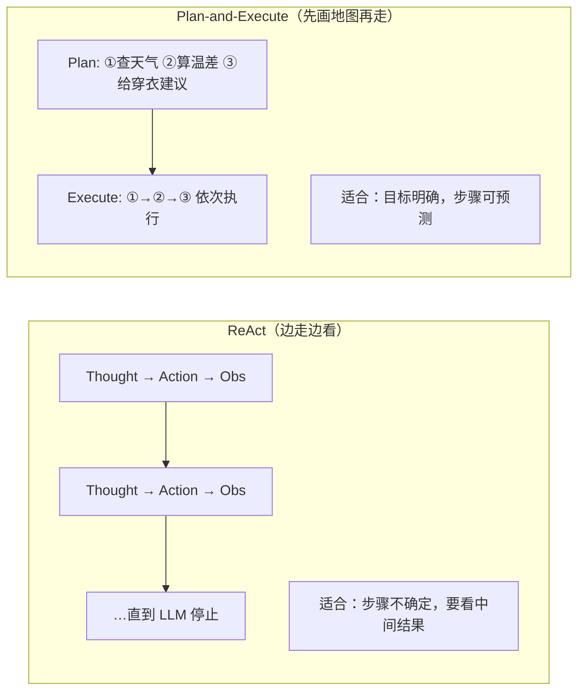
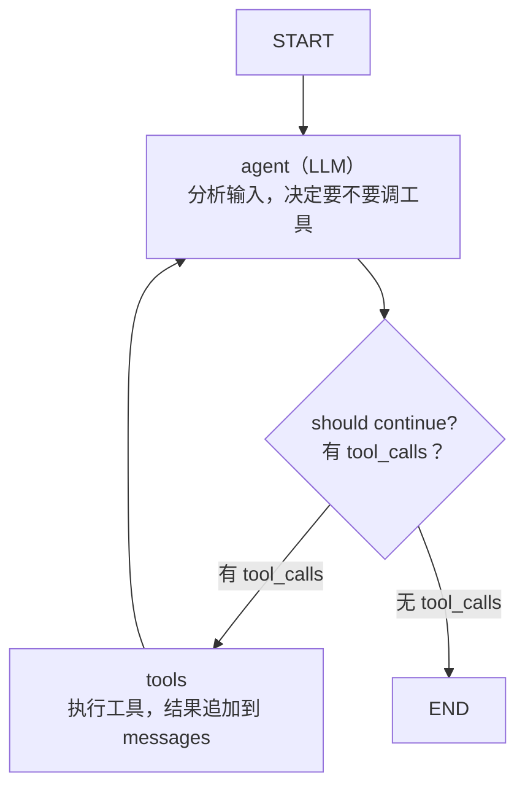
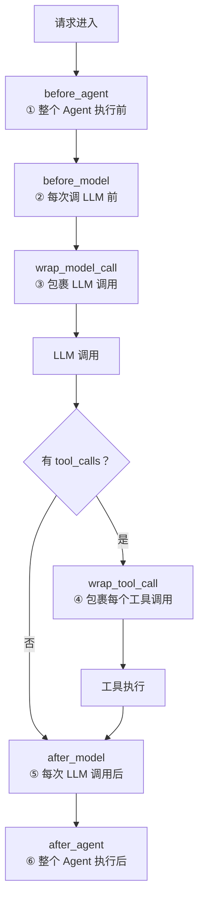
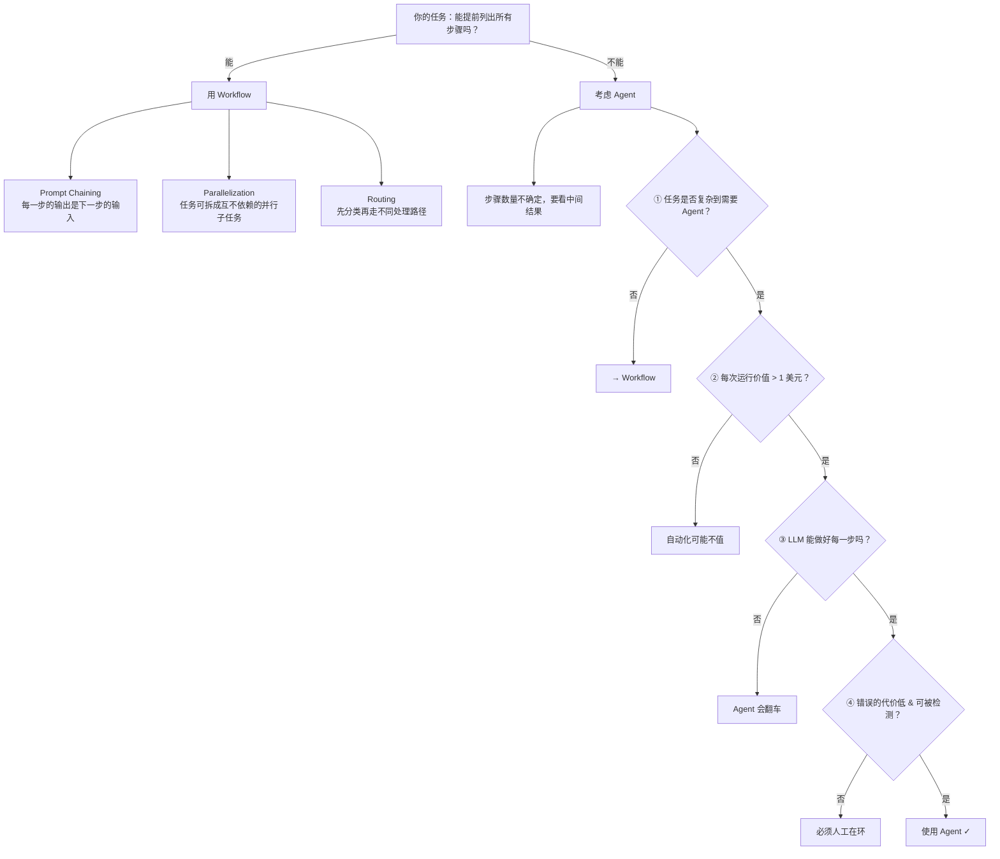

> **一句话**：Agent = LLM + 工具 + 循环——LLM负责决策（该调什么工具），代码负责执行（真的去调），循环负责串联，让LLM从"能说"变成"能做"。

# Agent架构与工具调用

---

## 开篇：Agent 到底多了什么？

Day 14 学了 LLM 的本质（参数做数学运算 → 输出文字）。Day 15 学了 LangChain（把拼消息→调API→拆响应工程化）。

**今天要回答的问题：让 LLM 从"能说"变成"能做"，到底多了什么？**



**Agent 多出来的三个东西：**
1. 工具（Tool）— LLM 的手。能查天气、调 API、读文件、写数据库
2. 循环（Loop）— LLM 不是一次回答，而是"想→做→看结果→再想"
3. 决策（Reasoning）— LLM 自己判断"现在该用哪个工具、传什么参数、什么时候停"

> [!note] Agent = LLM + 工具 + 循环。LLM 负责决策（"该调什么"），你的代码负责执行（"真的去调"），循环负责串联。

---

## 一、Function Calling

### 一个问题秒懂



### Function Calling 的物理过程



> [!note] LLM **从不执行函数**。它只输出一个 JSON 说"我想调 X 函数，参数是 Y"。你的代码收到这个 JSON 后去执行，结果塞回对话上下文。**模型的职责 = 决策，代码的职责 = 执行。**

### 工具定义的五个要素

```python
tool_definition = {
    "type": "function",
    "function": {
        "name": "get_weather",                 # 工具名：唯一标识
        "description": (                       # 描述：LLM 靠这个判断何时用
            "查询指定城市的实时天气，返回温度、湿度、天气状况。"
        ),
        "parameters": {
            "type": "object",
            "properties": {
                "city": {
                    "type": "string",
                    "description": "城市名，中文，如'北京'",
                },
                "unit": {
                    "type": "string",
                    "enum": ["celsius", "fahrenheit"],
                    "description": "温度单位",
                },
            },
            "required": ["city"],
        },
    },
}
```

| 要素 | LLM 用它做什么 | 写烂了的后果 |
|------|---------------|-------------|
| `name` | 指定"我要调哪个工具" | 名字太像另一个工具 → 选错 |
| `description` | 判断"什么时候该调" | 该调不调，不该调乱调 |
| `parameters.properties` | 知道"要传什么参数" | 参数名写错 → LLM 瞎编 |
| `parameters.enum` | 限制参数取值范围 | `unit: "摄氏度"` |
| `required` | 知道"哪些参数必须传" | 漏传必填参数 → 报错 |

### 手动实现一次 Function Calling

```python
import os
import json
from openai import OpenAI

# ① 真正要执行的函数
def get_weather(city: str, unit: str = "celsius") -> str:
    data = {
        "北京": {"celsius": "晴，25°C", "fahrenheit": "晴，77°F"},
        "上海": {"celsius": "多云，28°C", "fahrenheit": "多云，82°F"},
    }
    return data.get(city, {}).get(unit, f"未找到{city}的天气数据")

def calculator(expression: str) -> str:
    allowed_chars = set("0123456789+-*/().% ")
    if not all(c in allowed_chars for c in expression):
        return "错误：表达式包含不允许的字符"
    try:
        return str(eval(expression))
    except Exception as e:
        return f"计算错误：{e}"

# ② 工具的"说明书"
TOOLS = [
    {
        "type": "function",
        "function": {
            "name": "get_weather",
            "description": "查询指定城市的实时天气。当用户问'某地天气'时使用。",
            "parameters": {
                "type": "object",
                "properties": {
                    "city": {"type": "string", "description": "城市名，中文"},
                    "unit": {"type": "string", "enum": ["celsius", "fahrenheit"]},
                },
                "required": ["city"],
            },
        },
    },
    {
        "type": "function",
        "function": {
            "name": "calculator",
            "description": "计算数学表达式。当用户需要算数时使用。",
            "parameters": {
                "type": "object",
                "properties": {
                    "expression": {"type": "string", "description": "数学表达式"},
                },
                "required": ["expression"],
            },
        },
    },
]

TOOL_MAP = {"get_weather": get_weather, "calculator": calculator}

client = OpenAI(
    api_key=os.environ["DEEPSEEK_API_KEY"],
    base_url="https://api.deepseek.com",
)

# ③ 核心：一次对话回合
def run_agent_turn(messages: list[dict]) -> list[dict]:
    response = client.chat.completions.create(
        model="deepseek-v4-pro",
        messages=messages,
        tools=TOOLS,
        tool_choice="auto",
        temperature=0.0,
    )
    msg = response.choices[0].message

    if not msg.tool_calls:
        messages.append({"role": "assistant", "content": msg.content})
        return messages

    messages.append({
        "role": "assistant",
        "content": msg.content or "",
        "tool_calls": [{"id": tc.id, "type": "function",
                        "function": {"name": tc.function.name, "arguments": tc.function.arguments}}
                       for tc in msg.tool_calls],
    })

    for tc in msg.tool_calls:
        func = TOOL_MAP[tc.function.name]
        args = json.loads(tc.function.arguments)
        result = func(**args)
        print(f"🔧 执行工具: {tc.function.name}({args}) → {result}")
        messages.append({"role": "tool", "tool_call_id": tc.id, "content": result})

    return messages

# 测试
if __name__ == "__main__":
    messages = [{"role": "user", "content": "北京今天天气怎么样？"}]
    messages = run_agent_turn(messages)
    messages = run_agent_turn(messages)
    print(f"最终回复: {messages[-1]['content']}")
```

### Function Calling 运行时变量速查

| 变量 | 类型 | 实际值 |
|------|------|--------|
| `msg.tool_calls` | `list` | `[{id, type, function}]` |
| `tc.function.name` | `str` | `"get_weather"` |
| `tc.function.arguments` | **`str`** | `"{\"city\":\"北京\"}"` ⚠️ 是字符串不是 dict |
| `args = json.loads(...)` | `dict` | `{"city": "北京"}` |
| `func(**args)` | — | `func(city="北京")` |

> [!warning] **最容易搞混的一个**：`tc.function.arguments` 是**字符串**，必须 `json.loads()` 解析后才能当 dict 用。

### 并行调用 vs 串行调用



> [!tip] 参数里有没有上一步的输出？有 → 串行。没有 → 可以并行。这是 Agent 效率的核心——尽量让 LLM 把互不依赖的工具调用打包成一轮。

---

## 二、ReAct

### ReAct 是什么

> ReAct = Reasoning（推理）+ Acting（行动）。Google + Princeton 2022 年的论文提出。核心思想：让 LLM 交替输出"思考"和"行动"，而不是一步到位给答案。

有 ReAct 的 Agent 工作流程：



### ReAct 循环的可视化



### 所有框架殊途同归的 6 行核心循环

不管你用 LangChain、OpenAI Agents SDK、Anthropic Claude Agent SDK——底层全是这个：

```python
# 这就是 Agent 的全部秘密。六行代码。
while not done:
    response = call_llm(messages, tools)              # ① 调 LLM，带上工具列表
    if response.has_tool_calls():                     # ② LLM 说"我要调工具"？
        results = execute_tools(response.tool_calls)   # ③ 你的代码执行
        messages.extend(results)                      # ④ 结果塞回对话上下文
    else:                                             # ⑤ LLM 没说要调工具
        done = True                                   # ⑥ → 这就是最终答案，停
        return response.text
```

**优雅之处**：tool_calls 的存在与否就是循环的"继续"和"停止"信号。不需要额外的分类器、不需要特殊标记。LLM 决定何时停。

> [!note] Agent 循环不是 LLM 在跑——是你的 `while` 循环在跑。每次循环调一次 LLM。LLM 只负责说"下一步干什么"，你的代码负责执行和判断。

### 为什么 ReAct 比"一步到位"强

| | 一步到位（纯 LLM） | ReAct Agent |
|------|------|------|
| 数学计算 | 靠"记忆"算，大数容易错 | 调 calculator，精确 |
| 实时信息 | 训练数据截止后的全瞎猜 | 调搜索/天气 API |
| 复杂多步任务 | "一口气"回答，中间步骤不可见 | 每步可观察、可纠错 |
| 出错时 | 不知道哪一步错了 | 从 Observation 能看到哪步出问题 |
| Token 消耗 | 1 次调用 | N 次调用（每次带全量上下文） |

**代价也很明显**：Agent 的 Token 消耗是普通对话的 ~4 倍（Anthropic 2026 数据）。

### ReAct 的变体：Plan-and-Execute



你的简历分析项目就是典型的 Plan-and-Execute——解析→提取→评分→落库，步骤是固定的。

---

> 关于 Tool Definition 设计原则（description 怎么写、参数怎么约束、错误怎么返回），详见 [[16-Tool Description设计铁律]]。

---

## 三、手写一个完整 ReAct Agent

```python
import os
import json
from openai import OpenAI

# ① 定义工具函数
def get_weather(city: str, unit: str = "celsius") -> str:
    data = {
        "北京": {"celsius": "晴，25°C，湿度40%", "fahrenheit": "晴，77°F"},
        "上海": {"celsius": "多云，28°C，湿度65%", "fahrenheit": "多云，82°F"},
    }
    return data.get(city, {}).get(unit, f"未找到{city}的天气数据")

def search_knowledge(query: str) -> str:
    knowledge = {
        "Python": "Python 是一种解释型高级编程语言，广泛用于 Web 开发、数据科学和 AI。",
        "FastAPI": "FastAPI 是一个现代 Python Web 框架，基于 Starlette + Pydantic。",
        "RAG": "RAG 将外部知识库检索结果注入 LLM 上下文，减少幻觉。",
    }
    for key, value in knowledge.items():
        if key.lower() in query.lower():
            return value
    return f"未找到关于'{query}'的相关知识"

def calculator(expression: str) -> str:
    allowed = set("0123456789+-*/().% ^")
    if not all(c in allowed for c in expression):
        return "错误：表达式包含不允许的字符"
    try:
        return str(eval(expression.replace("^", "**")))
    except Exception as e:
        return f"计算错误：{e}"

# ② 工具定义
TOOLS = [{...}, {...}, {...}]  # 与上一章类似，略
TOOL_MAP = {"get_weather": get_weather, "search_knowledge": search_knowledge,
            "calculator": calculator}

# ③ ReAct Agent 核心循环
class SimpleReactAgent:
    def __init__(self, client: OpenAI, model: str, tools: list, tool_map: dict):
        self.client = client
        self.model = model
        self.tools = tools
        self.tool_map = tool_map
        self.max_steps = 10

    def run(self, user_input: str, system_prompt: str = "你是一个有用的助手") -> str:
        messages = [
            {"role": "system", "content": system_prompt},
            {"role": "user", "content": user_input},
        ]

        for step in range(1, self.max_steps + 1):
            print(f"\n--- 第 {step} 轮 ---")
            response = self.client.chat.completions.create(
                model=self.model, messages=messages, tools=self.tools,
                tool_choice="auto", temperature=0.0,
            )
            msg = response.choices[0].message

            if not msg.tool_calls:
                print(f"✅ Agent 回答: {msg.content[:100]}...")
                return msg.content

            tool_call_msgs = []
            for tc in msg.tool_calls:
                tool_call_msgs.append({"id": tc.id, "type": "function",
                    "function": {"name": tc.function.name, "arguments": tc.function.arguments}})

            messages.append({"role": "assistant", "content": msg.content or "",
                             "tool_calls": tool_call_msgs})

            for tc in msg.tool_calls:
                func = self.tool_map[tc.function.name]
                args = json.loads(tc.function.arguments)
                result = func(**args)
                print(f"🔧 {tc.function.name}({args}) → {result[:80]}")
                messages.append({"role": "tool", "tool_call_id": tc.id, "content": result})

        return "错误：Agent 超过最大循环步数"

# ④ 测试
if __name__ == "__main__":
    client = OpenAI(api_key=os.environ["DEEPSEEK_API_KEY"],
                    base_url="https://api.deepseek.com")
    agent = SimpleReactAgent(client=client, model="deepseek-v4-pro",
                             tools=TOOLS, tool_map=TOOL_MAP)
    result = agent.run("北京今天天气怎么样？")
    print(f"\n最终结果:\n{result}")
```

---

## 四、LangChain create_agent

### 上手

```python
from langchain.agents import create_agent
from langchain_openai import ChatOpenAI
from langchain_core.tools import tool

@tool
def get_weather(city: str, unit: str = "celsius") -> str:
    """查询指定城市的实时天气。当用户询问某地当前天气时使用。"""
    data = {"北京": "晴，25°C", "上海": "多云，28°C"}
    return data.get(city, f"未找到{city}的天气数据")

@tool
def calculator(expression: str) -> str:
    """计算数学表达式。当用户需要算数时使用。"""
    allowed = set("0123456789+-*/().% ")
    if not all(c in allowed for c in expression):
        return f"错误：表达式含非法字符"
    try:
        return str(eval(expression))
    except Exception as e:
        return f"计算错误：{e}"

model = ChatOpenAI(api_key=os.environ["DEEPSEEK_API_KEY"],
                   base_url="https://api.deepseek.com",
                   model="deepseek-v4-pro", temperature=0.0)

agent = create_agent(
    model=model,
    tools=[get_weather, calculator],
    system_prompt="你是一个有用的助手，可以使用工具来回答用户问题。",
)

result = agent.invoke({
    "messages": [{"role": "user", "content": "北京天气怎么样？25*17等于多少？"}],
})
final_messages = result["messages"]
print(final_messages[-1].content)
```

### `create_agent` 底层在做什么

你调用 `create_agent` 的时候，LangChain 自动在 LangGraph 里构建了这张图：



**和手写的区别**：手写是 `while` 循环，`create_agent` 是 LangGraph 的 StateGraph。底层逻辑一模一样，LangGraph 多了持久化/断点续跑/人工审批等能力。

### Middleware：无侵入扩展 Agent

`create_agent` 最大的创新是 Middleware 系统——6 个标准 Hook 点：



```python
# 实用例子：加人工审批
from langchain.agents.middleware import HumanInTheLoopMiddleware

agent = create_agent(
    model=model,
    tools=[transfer_money, check_balance],
    middleware=[HumanInTheLoopMiddleware()],
)

# 实用例子：自动压缩超长上下文
from langchain.agents.middleware import SummarizationMiddleware

agent = create_agent(
    model=model,
    tools=[...],
    middleware=[SummarizationMiddleware(max_tokens=2000)],
)
```

---

## 五、Agent vs Workflow

### 定义

```text
Workflow（工作流）= LLM + 工具 + 固定代码路径
  你提前写好了"第1步→第2步→第3步"，LLM 只在需要推理的地方出场

Agent（智能体）= LLM + 工具 + LLM 自己决定路径
  LLM 自己判断下一步干什么、调什么工具、什么时候停
```

### 决策框架



---

## 速查表

### Function Calling 最小请求

```python
response = client.chat.completions.create(
    model="deepseek-v4-pro",
    messages=[{"role": "user", "content": "北京天气？"}],
    tools=[{ "type": "function", "function": { "name": "get_weather", ... } }],
    tool_choice="auto",
)
```

### Agent 循环骨架

```python
while not done:
    response = call_llm(messages, tools)
    if response.tool_calls:
        for tc in response.tool_calls:
            result = execute(tc.name, tc.arguments)
            messages.append({"role": "tool", "tool_call_id": tc.id, "content": result})
    else:
        done = True
        return response.text
```

### LangChain create_agent

```python
from langchain.agents import create_agent
from langchain_openai import ChatOpenAI

agent = create_agent(ChatOpenAI(model="..."), tools=[...])
result = agent.invoke({"messages": [{"role": "user", "content": "..."}]})
```

### Tool 设计速记

```text
✅ 任务级工具（schedule_event）  >  ❌ CRUD 零散工具
✅ enum 约束参数                 >  ❌ 自由文本
✅ minimum/maximum 约束数字       >  ❌ 裸 number
✅ 返回错误字符串                 >  ❌ 抛异常
✅ description 写"何时用何时不用" >  ❌ "获取XX"
✅ 工具返回结果精简               >  ❌ 全量 JSON 原样返回
```

### Agent vs Workflow

```text
能提前列出所有步骤？→ Workflow
步骤数取决于中间结果？→ Agent
```

---

- 目录：[[00-AI]]
- 上一篇：[[06-RAG检索增强生成流程]]
- 下一篇：[[16-Tool Description设计铁律]]
- 项目实践：[[项目实战/ai-resume笔记/01_技术研读/03_LangGraph状态机#graph.py逐行走读|ai-resume: LangGraph]]
- 项目实践：[[项目实战/cr-agent笔记/01-技术研读/01-Supervisor-Worker编排与StateGraph|cr-agent: Supervisor-Worker编排]]

## 
> ▶ 对应原理：[[23-Agent架构与核心组件|23-Agent架构与核心组件]]


> ▶ 对应原理：[[24-ReAct框架与规划能力|24-ReAct框架与规划能力]]


> ▶ 对应原理：[[25-Function-Calling工具调用|25-Function-Calling工具调用]]

相关链接

- 目录：[[00-AI]]
- 上一篇：[[06-RAG检索增强生成流程]]
- 下一篇：[[16-Tool Description设计铁律]]
- 项目实践：[[项目实战/ai-resume笔记/01_技术研读/03_LangGraph状态机#graph.py 逐行走读|ai-resume: LangGraph状态机]]
- 项目实践：[[项目实战/cr-agent笔记/01-技术研读/01-Supervisor-Worker编排与StateGraph#🔴 记忆级：graph.py + state.py 逐行精读|cr-agent: Supervisor-Worker编排]]

---
→ [[技术学习清单#Agent 架构（核心）]]

## 速记卡（面试闪卡）

**Q1：一句话讲清「Agent架构与工具调用」到底是什么？**
A：Day 14 学了 LLM 的本质（参数做数学运算 → 输出文字）。Day 15 学了 LangChain（把拼消息→调API→拆响应工程化）。
**今天要回答的问题：让 LLM 从"能说"变成"能做"，到底多了什么？**
**Agent 多出来的三个东西：**
工具（Tool）— LLM 的手。

**Q2：开篇：Agent 到底多了什么？ —— 怎么理解？**
A：Day 14 学了 LLM 的本质（参数做数学运算 → 输出文字）。Day 15 学了 LangChain（把拼消息→调API→拆响应工程化）。
**今天要回答的问题：让 LLM 从"能说"变成"能做"，到底多了什么？**
**Agent 多出来的三个东西：**
工具（Tool）— LLM 的手。

**Q3：一、Function Calling —— 怎么理解？**
A：[!note] LLM **从不执行函数**。它只输出一个 JSON 说"我想调 X 函数，参数是 Y"。你的代码收到这个 JSON 后去执行，结果塞回对话上下文。**模型的职责 = 决策，代码的职责 = 执行。**
| 要素 | LLM 用它做什么 | 写烂了的后果 |
|------|---------------|-------------|
|  | 指定"我要调哪个工具" | 名字太像另一个工具 → 选错 |

**Q4：二、ReAct —— 怎么理解？**
A：ReAct = Reasoning（推理）+ Acting（行动）。Google + Princeton 2022 年的论文提出。核心思想：让 LLM 交替输出"思考"和"行动"，而不是一步到位给答案。
有 ReAct 的 Agent 工作流程：
不管你用 LangChain、OpenAI Agents SDK、Anthropic Claude Agent SDK——底层全是这个：

**Q5：三、手写一个完整 ReAct Agent —— 怎么理解？**
A：---

**Q6：核心速记主线有哪些？**
A：抓住这几根：开篇：Agent 到底多了什么？、一、Function Calling、二、ReAct、三、手写一个完整 ReAct Agent、四、LangChain create_agent、五、Agent vs Workflow。

