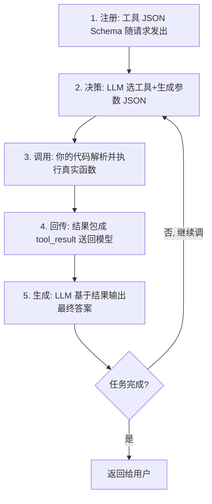

---

title: "工具系统：定义→注册→发现→调用"

tags:

  - 技术学习

  - ai

  - agent

created: "2026-07-21"

---

# 工具系统：定义→注册→发现→调用

> **一句话**：工具系统是Agent的手脚——通过Function Calling让LLM输出结构化JSON来决定调哪个函数、传什么参数，但模型只决策、代码才执行。

## 一、它是什么 / 为什么需要它
### 1.1 裸 LLM 的死穴

LLM 本质是个「统计文本生成器」，有三个根本限制（来源：腾讯云《解读 Function Calling》2025；meta-intelligence《Function Calling 完全指南》）：

1. **知识会过期**：训练截止后的事不知道。

2. **碰不了动态世界**：实时股价、天气、当前日期、数据库记录——它够不着。

3. **做不了真实操作**：它的输出只是文本 token，**不产生任何外部副作用**（不能在数据库建记录、不能发邮件）。

**Function Calling（函数调用）** 就是来补这三个洞的：让 LLM 从「只会说话」变成「能办事情」。它使模型输出一个**结构化的 JSON 调用指令**，由你的应用代码去真正执行（来源：taskade《Function Calling in LLMs 2026》；掘金《深度解析 Function Calling》）。

> **Function Calling = 让 LLM 输出「调哪个函数 + 什么参数」的 JSON，而不是自然语言答案**。模型不执行，你的代码执行。

### 1.2 追溯一句：为什么不用「提示词硬挤 JSON」

2023 年 6 月 OpenAI 推出 Function Calling API 之前，开发者靠 prompt 逼模型输出 `ACTION: search("x")` 这种字符串，再用正则抠出来——极不稳定，模型常漏字段、格式错、夹废话。Function Calling 通过**微调 + 约束解码（Constrained Decoding）**，把 JSON 解析错误率从 prompt 法的 15–25% 降到接近 0%（来源 meta-intelligence）。现在 Anthropic / Google / Mistral 全部兼容 JSON Schema 这套思路。

## 二、原理拆解：工具系统的四个阶段

工具系统拆成 **定义 → 注册 → 发现 → 调用** 四步，下面逐步讲。

### 1.1 定义（Definition）：给工具写「身份证」

定义一个工具，就是写一个 **JSON Schema（JSON 模式，一种描述数据结构的国际标准，OpenAPI/YAML 都用它）** 对象。它告诉模型：这个工具叫啥、能干啥、要什么参数。核心四字段（来源：腾讯云 2025；taskade 2026）：

- `name`：唯一标识，建议 `动词_名词`（如 `get_weather`、`search_knowledge_base`）。

- `description`：**最关键字段**——描述功能 + 何时该用 + 返回啥。模型主要靠它做选择，写得准不准确直接决定调用准确率（Gorilla 研究：精确 description 可提升参数准确率 30%+，来源 meta-intelligence）。

- `parameters`：参数定义（类型、是否必填、释义），用 JSON Schema 描述。

- `required`：必填参数清单。

骨架长这样（来源：腾讯云 2025）：

```json

{

  "type": "function",

  "function": {

    "name": "get_current_weather",

    "description": "获取指定城市的当前天气，用户问温度/天气时用",

    "parameters": {

      "type": "object",

      "properties": {

        "location": { "type": "string", "description": "城市名，如'北京'" },

        "unit": { "type": "string", "enum": ["celsius", "fahrenheit"] }

      },

      "required": ["location"]

    }

  }

}

```

### 1.1.1 Python 工具注册实战（OpenAI Function Calling 示例）

```python

import openai

import json

# 工具描述是 LLM 选择工具的核心依据，必须写清功能、参数、边界

tools = [

    {

        "type": "function",

        "function": {

            "name": "get_current_weather",                  # 唯一标识：动词_名词

            "description": "获取指定城市的当前天气。"         # 最关键字段：功能+何时用

                          "当用户问天气/温度/下雨等问题时调用此工具。",

            "parameters": {

                "type": "object",

                "properties": {

                    "location": {

                        "type": "string",

                        "description": "城市名称，如'北京'、'上海'"

                    },

                    "unit": {

                        "type": "string",

                        "enum": ["celsius", "fahrenheit"],  # 枚举约束：防止无效值

                        "description": "温度单位，默认摄氏度"

                    }

                },

                "required": ["location"]                     # 必填参数列表

            }

        }

    }

]

# ===== Step 2: 真实函数实现（在后端代码中，LLM 绝不见到）=====

def get_current_weather(location: str, unit: str = "celsius") -> dict:

    """真实执行天气查询的业务函数。

    Args:

        location: 城市名称

        unit: 温度单位

    Returns:

        包含温度、天气状况的字典

    """

    # 调用真实天气 API（示例用假数据）

    return {

        "location": location,

        "temperature": 22 if unit == "celsius" else 72,

        "unit": unit,

        "condition": "晴天",

    }

# LLM 只输出函数名，你的代码用映射表找到真实函数执行

available_functions = {

    "get_current_weather": get_current_weather,

}

# ===== Step 4: 完整对话循环 =====

def run_agent_with_tools(user_query: str) -> str:

    """Agent 对话循环：LLM 决策 → 代码执行 → 结果回传"""

    messages = [{"role": "user", "content": user_query}]

    # 第一轮：LLM 看到工具描述后，决定是否调用

    response = openai.chat.completions.create(

        model="gpt-4o",

        messages=messages,

        tools=tools,                       # 注册工具：把 Schema 发给模型

        tool_choice="auto",                # auto=模型自判 / none=不调 / required=必须调

    )

    response_message = response.choices[0].message

    # 检查 LLM 是否决定调工具

    if response_message.tool_calls:        # tool_calls 非空 = LLM 想调工具

        messages.append(response_message)  # 把 LLM 的调用指令加入对话

        for tool_call in response_message.tool_calls:

            # 解析 LLM 生成的参数 JSON

            function_name = tool_call.function.name

            function_args = json.loads(tool_call.function.arguments)

            # 执行真实函数（LLM 只决策，代码才执行）

            function_to_call = available_functions[function_name]

            result = function_to_call(**function_args)

            # 把结果包成 tool 消息回传

            messages.append({

                "role": "tool",

                "tool_call_id": tool_call.id,       # 必须和调用时的 id 一致

                "content": json.dumps(result, ensure_ascii=False),

            })

        # 第二轮：LLM 基于工具结果生成最终回答

        second_response = openai.chat.completions.create(

            model="gpt-4o",

            messages=messages,

        )

        return second_response.choices[0].message.content

    # 没调工具 → 直接返回 LLM 的文本回答

    return response_message.content

# ===== 使用示例 =====

if __name__ == "__main__":

    answer = run_agent_with_tools("北京今天天气怎么样？")

    print(answer)

    # 输出示例："北京今天晴天，气温22°C，适合出行。"

```

开发者在每次请求里，把这个（些）工具描述随用户问题一起发给 LLM（OpenAI 用 `tools` 数组；Anthropic 用 `tools` 数组的 `tool_use` block；Google Gemini 类似）。这就是「**注册**」——相当于把《办事权限手册》递给新人。注意：注册的只是**描述**，不是函数本体；真实函数代码始终在你后端。（来源 taskade 2026；CSDN《Function Calling 工程实战》）

### 1.3 发现 / 决策（Discovery & Decision）：模型选工具

用户输入自然语言，LLM 结合工具描述做**语义推理**（不是关键词匹配）：判断要不要调工具、调哪个、缺什么参数。这一步模型完全靠微调学到的「自然语言意图 → API 调用」映射来做（来源：腾讯云 2025）。模型若觉得不需要工具，就直接文本回答。

### 1.4 调用（Invocation）：模型出 JSON，代码真执行

如果决定调工具，模型输出一个 `tool_call` 对象（含唯一 `id`、函数 `name`、参数 `arguments` JSON 字符串）。**到这里，模型的工作结束**。你的应用代码：解析 JSON → 校验参数 → 执行真实函数（查库/调 API）→ 把结果包成 `tool_result` 消息回传模型 → 模型据此生成最终答案。这步就是「行政真去办事」（来源：taskade 2026；掘金 2025）。

完整 5 步链路一张图：



## 三、工程要点与边界
### 2.1 模型只决策、代码才执行（安全边界）

这是铁律：**LLM 本身绝不执行任何函数**（来源：腾讯云 2025；taskade 2026）。所有高危操作（改库、发邮件、退款）必须由你的本地代码管控。这叫「关注点分离（Separation of Concerns）」——模型管「想」，代码管「做」，权限、密钥、审计全在你手里。

### 2.2 Schema 设计六原则（让模型调得准）

来源 meta-intelligence《Function Calling 完全指南》+ ToolAlpaca 实验结论：

1. **善用 enum 约束离散值**（如 `unit: ["celsius","fahrenheit"]`）——防止无效值。

2. **description 里给具体示例**（如「关键词如'无线蓝牙耳机'」）。

3. **区分 required / optional**——别全设必填，降低调用门槛。

4. **避免超过三层的嵌套结构**——嵌套越深参数错误率越高。

5. **参数数量控制在 5–8 个以内**——过多增加认知负担。

6. **类型要精确**——用 `integer` 而非 `number`，用 `format: date` 约束字符串。

另外：工具数超过 20 个时，靠 description 明确「边界条件」（如「仅用于产品搜索，问订单请用 get_order_status」）能把选错率降约 40%（来源 ToolLLM 实验，meta-intelligence）。

### 2.3 主流平台差异

| 平台 | 机制 | 特色 |
|-|-|-|
| OpenAI | `tools` 数组 + `tool_calls` | `parallel function calling` 并行调；`tool_choice` 控 auto/required/none；GPT-4o 起 `Structured Outputs`（`strict:true`）保 100% 符合 schema |
| Anthropic Claude | `tool_use` content block | `extended thinking` 先展示推理；高风险工具鼓励 human-in-the-loop 确认 |
| 开源（Gorilla/ToolLLaMA） | 微调 | 7B–13B 经训练即可胜任多数工具调用；Gorilla 用检索增强解决 API 版本过时 |

（来源 meta-intelligence 2025 / taskade 2026）

## 速记卡（面试闪卡）

**Q1：一句话讲清「工具系统：定义 → 注册 → 发现 → 调用」到底是什么？**

A：工具系统通过 Function Calling 让 LLM 输出结构化 JSON 决定调哪个函数、传什么参数，模型只决策、代码才执行。

**Q2：二、它是什么 / 为什么需要它 —— 怎么理解？**

A：像给只会说话的参谋配手脚：裸 LLM 知识会过期、碰不了实时世界、做不了真实操作。Function Calling（函数调用）让它输出「调哪个函数+什么参数」的 JSON，由你的代码去执行。

**Q3：三、原理拆解：工具系统的四个阶段 —— 怎么理解？**

A：像办事四步走：定义（写 JSON Schema「身份证」，description 最关键）、注册（把 Schema 递给模型）、发现（LLM 语义推理选工具）、调用（模型出 JSON、代码真执行）。模型只决策不执行。

**Q4：四、工程要点与边界 —— 怎么理解？**

A：铁律是「关注点分离（Separation of Concerns）」：LLM 绝不执行函数，高危操作由你代码管控；Schema 设计六原则（enum 约束、给示例、控必填、浅嵌套、5–8 参数、精确类型）让模型调得准。

**Q5：五、完整调用链路（注册→决策→调用→回传→生成） —— 怎么理解？**

A：像一次完整办事闭环：① 注册 Schema 随请求发 ② LLM 选工具出参数 JSON ③ 代码解析执行真函数 ④ 结果包成 tool_result 回传 ⑤ 模型据此生成最终答案，可多轮循环。

**Q6：核心速记主线有哪些？**

- 工具系统 = 定义→注册→发现→调用 四阶段

- Function Calling 让 LLM 输出 JSON 而非自然语言

- 铁律：模型只决策、代码才执行（关注点分离）

- Schema 设计六原则；超 20 工具靠 description 边界降选错率

**口诀**

A：工具四步定义起，注册发现调用连；

JSON 出模型决策，代码执行才真干；

描述写清调得准，只决策不越权；

关注分离保安全，手脚听脑不瞎窜。

## 相关链接

---

→ [[技术学习路线图#Agent 架构（核心）]]

