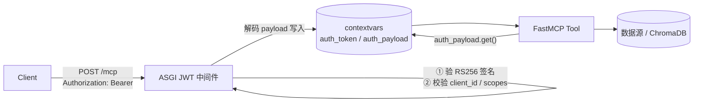
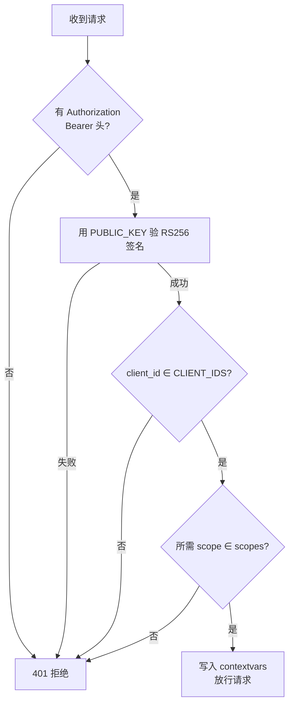

> **一句话**：用FastMCP把Python函数变成MCP工具，JWT中间件统一验身份，contextvars在异步并发下安全传递当前用户——三者串成生产级多租户安全Server。

# MCP Server 实现：FastMCP + JWT 认证中间件 + contextvars

---

## 一、开篇：你家的专属电器，也得能插上标准口

第 8 篇讲了 MCP 是 AI 世界的「USB-C 标准插槽」。但标准再好，得有人去**实现那个插头**——也就是**自己写一个 MCP Server**，把你的能力按规范暴露出去。

生活类比接着用：你给自己家做了个超好用的榨汁机（你的检索 / 查询能力），别人（AI 应用）想用。

- 不按标准？那每台想用它的机器都得给你单独配一根线（N×M 噩梦）。
- 按 MCP 标准做插头（写 MCP Server）？任何支持 MCP 的 Host 插上就能用。

但还有一层：**插头做出来了，不等于谁都能插**。榨汁机接的是 220V 电网，你总不能让路人随便按开关吧？所以 Server 一旦跑在网上、暴露能力，就等于**开门**——不装锁（认证），就是**裸奔**。

本文就讲三件事怎么串起来：

1. **FastMCP** —— 用 Python 几行代码把 MCP Server 写出来（不用手搓 JSON-RPC）。
2. **JWT 认证中间件** —— 在每个请求到达工具前，先验明身份。
3. **contextvars** —— 把验出来的「当前用户」安全地在并发请求间隔离传递，工具随用随取。

---

## 二、FastMCP 是什么：把协议细节降到装饰器

**FastMCP** 是目前用 Python 构建 MCP Server 最顺手的**生产级框架**（源码即 FastMCP 3）。官方 SDK 当然也能写，但 FastMCP 把底层协议（JSON-RPC 2.0、握手、能力发现）全封装了，开发者只写业务逻辑。

最小骨架（感觉级，非生产代码）：

```python
from fastmcp import FastMCP

mcp = FastMCP("Demo Server")          # ① 一个 FastMCP 实例 = 一个 Server

@mcp.tool                              # ② 普通函数 + 装饰器 = 一个 Tool
def add(a: int, b: int) -> int:
    """Add two numbers"""             # ③ docstring 就是给模型的「使用说明」
    return a + b

if __name__ == "__main__":
    mcp.run(transport="http", port=8000)   # ④ 跑成 HTTP 服务
```

关键点：

- **自动 Schema**：FastMCP 根据函数签名 + docstring 自动生成工具的 JSON Schema，客户端（和模型）直接看懂怎么调、怎么传参。
- **三类能力装饰器**：`@mcp.tool`（可执行动作）、`@mcp.resource(...)`（只读数据，如 `config://version`）、`@mcp.prompt`（提示词模板）。
- **Context 参数**：工具里加 `ctx: Context` 就能用日志、进度、读资源、反向调 LLM（Sampling）。
- **传输选择**：`stdio`（本地，Server 作子进程）、`streamable-http`（生产推荐，单 `/mcp` 端点）、`sse`（旧，兼容）。

> 一句话：FastMCP 让「写 MCP Server」从「手写协议」变成「写普通 Python 函数 + 贴装饰器」。

### 1.1 三能力怎么注册（骨架级）

```text
@mcp.tool()                 def search_kb(q: str) -> list: ...   # Tools：动作，模型自主触发
@mcp.resource("resume://list")  def list_resumes() -> list: ... # Resources：只读数据，按需读
@mcp.prompt()               def review_template() -> str: ...   # Prompts：提示词模板，Host 复用
```

> 工具描述（docstring）写错，模型就选错工具——这是第 8 篇反复强调的「工具描述即 API 文档」。

---

## 三、为什么 MCP Server 必须认证（不装锁 = 裸奔）

暴露一个 MCP Server，等于把一个能力入口挂到网上。不认证的后果：

- **任意人可调用**：你的 `delete_all_data` 工具谁都能触发。
- **多租户数据泄露**：A 公司的请求读到了 B 公司的知识库（如果你的 RAG 服务多客户共用）。
- **无法审计**：出了事查不到是谁干的。

### 2.1 JWT 是什么（先拆全称）

**JWT = JSON Web Token（JSON 网络令牌）**，是一种把「身份信息 + 权限」编码进令牌、并用密码学签名防篡改的开放标准。客户端每次请求在头里带 `Authorization: Bearer <JWT>`，Server 验签即可信其身份，**无需查库**。

> MCP 规范本身推荐 **OAuth 2.1 + PKCE**（用户面对的应用，如用 Google/GitHub 登录）。但 JWT Bearer 是**服务间通信 / 编程环境**的实用方案——FastMCP 从 2.6.0 起内置 `BearerAuthProvider` 支持它，用**非对称加密**（RS256）验签：Server 只持公钥，私钥在签发方（IdP），互不暴露。

### 2.2 两条路：内置 vs 自定义中间件

| 方式 | 做法 | 适合 |
|-|-|-|
| **内置 `BearerAuthProvider`** | `BearerAuthProvider(jwks_uri=..., issuer=..., audience=..., required_scopes=[...])`，工具内 `get_access_token()` 取声明 | 大多数场景，省心、合规、JWKS 自动轮换 |
| **自定义 ASGI JWT 中间件 + contextvars** | 自己写中间件验签，把 payload 写进 `contextvars`，工具 `auth_payload.get()` 取 | 需要完全控制、或要和现有网关 / contextvars 体系打通（本文重点） |

> 经验法则：**能用内置就别自己造**。但你要理解和能讲清楚中间件机制——「你知道它底层怎么回事」。

---

## 四、JWT 认证中间件：在工具之前验明正身

中间件（middleware）夹在「请求到达工具」之前，统一做一件事：**先验身份，再放行**。它是 ASGI 层的一个包装函数，拦截每个 `POST /mcp` 请求。

骨架（感觉级）：

```python
from contextvars import ContextVar

auth_token: ContextVar = ContextVar("auth_token", default=None)
auth_payload: ContextVar = ContextVar("auth_payload", default=None)

async def jwt_middleware(app, scope, receive, send):
    headers = dict(scope.get("headers", []))
    auth = headers.get(b"authorization", b"").decode()       # ① 取 Bearer 头
    payload = verify_rs256(auth, PUBLIC_KEY)                 # ② 用 PUBLIC_KEY 验 RS256 签名，失败即 401
    check_claims(payload)                                     # ③ 校验 client_id / scopes
    auth_token.set(auth)                                      # ④ 验过即写入 contextvars，放行
    auth_payload.set(payload)
    await app(scope, receive, send)
```

中间件做的四步（对应上面注释）：

1. 取 `Authorization: Bearer <token>`；
2. 用 **PUBLIC_KEY** 验 **RS256** 签名（篡改即失败 → 401）；
3. 校验业务声明：`client_id ∈ CLIENT_IDS`、所需 `scopes`（如 `client_super`）满足；
4. 把原始 token + 解码 payload 写进 **contextvars**，放行请求。



---

## 五、contextvars：每请求隔离的「上下文保险箱」

这是本文第二个核心，也是很多初学者会写错的地方。

### 4.1 它解决什么问题

工具函数需要「当前是谁在调用」——用来做租户隔离、权限判断、审计日志。最直觉的写法是用**全局变量**存 user_id。但 MCP Server 是**异步并发**的：一个事件循环同时服务很多请求。全局变量会**跨请求串味**——请求 A 刚写完 user=A，请求 B 一覆盖，A 的工具读到就成了 B 的用户。**这是生产级数据泄露 bug**。

### 4.2 为什么不用 threading.local

`threading.local` 是「每线程一份」的变量。但 **asyncio 下协程可能在不同线程间跳**，而且单线程事件循环里多个协程共享同一线程——`threading.local` 在异步并发里**不可靠**。

### 4.3 contextvars 才是对的

**contextvars（上下文变量）** 是 Python 专为「asyncio 并发下每请求隔离」设计的机制：

- 每个请求 / 协程有自己的**上下文副本**；
- 在中间件里 `auth_payload.set(payload)`，只有**当前这次请求链路**能 `.get()` 到；
- 请求结束自动隔离，**绝不串到别的请求**。

工具里随用随取（无需把 user_id 当参数层层传）：

```python
@mcp.tool
def greet(name: str) -> str:
    payload = auth_payload.get()        # 当前请求的 JWT 声明，并发安全
    user_id = payload["sub"]            # 不会读到别的请求的用户
    return f"Hello {user_id}!"
```

> 关键结论：**工具不依赖 HTTP 请求对象**，保持传输无关（transport-agnostic）——换 stdio / http 都不用改工具代码。这正是 contextvars 比「传参」优雅的地方。

---

## 六、三者怎么串成一条链（核心架构）

一次调用完整走通：

```text
Client ──POST /mcp + Bearer JWT──▶ JWT 中间件
                                      │ ① 验 RS256 签名
                                      │ ② 查 client_id / scopes
                                      │ ③ 解码 payload → 写 contextvars
                                      ▼
                                  FastMCP Tool
                                      │ ④ auth_payload.get() 取当前用户
                                      ▼
                                  数据源（ChromaDB / 业务库）
```

价值总结：

- **认证集中**：所有工具不用各自写验签逻辑。
- **身份随用随取**：工具不碰 HTTP 对象，靠 contextvars 拿当前用户，并发安全。
- **传输无关**：stdio / http 下工具代码一致。

---

## 七、JWT 中间件校验决策流（边界情形）

把中间件的判断画清楚，讲边界时直接用：



边界情形（高优补充，**只验签名远远不够**）：

- **无 token / 格式错**（不是 `Bearer xxx`） → 401，连工具都进不去。
- **签名对但已过期（exp）** → 验签阶段必须查 `exp`，过期即拒（JWT 自带过期声明）。
- **签名对但 issuer / audience 不对** → 拒绝（防 A 系统签的 token 拿来调 B 系统；2026-07-28 RC 进一步要求按 RFC 9207 校验 `iss`）。
- **scope 不够** → 拒绝（最小权限，不是「能验过就全放行」）。
- **算法混淆攻击** → 强制用 RS256 验签，拒绝 `alg: none` 或把 RS256 当 HS256 的混淆请求。

---

## 八、内置 BearerAuthProvider：不想自写中间件时用它

如果不需要完全自定义，FastMCP 内置更省心（生产推荐 JWKS 自动轮换密钥）：

```python
from fastmcp import FastMCP
from fastmcp.server.auth import BearerAuthProvider         # 内置 Bearer 认证
from fastmcp.server.dependencies import get_access_token    # 工具内取已验证的 token

# 配置 Bearer 认证提供者
auth = BearerAuthProvider(
    jwks_uri="https://idp/.well-known/jwks.json",          # JWKS 端点：公钥自动轮换
    issuer="https://idp",                                   # 签发方：防跨系统冒用
    audience="my-mcp",                                     # 受众：本服务的标识
    required_scopes=["data:read"],                          # 最小权限：必备 scope
)
mcp = FastMCP("Secure Server", auth=auth)                  # 带认证的 Server

@mcp.tool
async def get_user_data(user_id: str):
    """获取用户数据（需认证）

    Args:
        user_id: 用户 ID
    """
    token = get_access_token()                              # 框架已帮你验过并注入
    # 细粒度权限校验：检查是否具备访问特定用户数据的 scope
    if f"data:read:user:{user_id}" not in token.scopes:
        raise ToolError("权限不足")                          # scope 不满足 → 拒绝
    return {...}
```

对比小结：内置方案框架帮你做验签 + 注入 `AccessToken`；自定义中间件方案你自建 contextvars 通道。两者目标一致——**让工具拿得到「已验证的当前用户」**。

---

## 九、生产细节（高优补充，安全审查必问）

- **Stateless HTTP 模式**：水平扩容时开启 `stateless_http=True`。MCP 默认 Streamable HTTP 维护服务端 session（内存），多实例 + 负载均衡下请求可能被路由到不同实例导致失败；无状态模式每次请求新建上下文，无需会话亲和。⚠️ 注意 2026-07-28 RC 已把「协议级会话」整体移除（见第 8 篇），届时无状态成为默认——**应用状态请用 JWT / 显式句柄携带，别依赖协议会话**。
- **显式句柄模式（explicit handle）**：RC 下跨调用要保状态，工具返回一个 `handle_id`，模型后续调用当普通参数传回（如 `basket_id`）。这比藏在传输元数据里的会话状态更可见、可组合。
- **密钥走环境变量**：`PUBLIC_KEY`、`CLIENT_IDS` 等绝不硬编码，用 env 注入（conduid.com / mcpmarket.cn 示例均如此）。
- **Host 校验**：FastMCP 默认只放 `localhost / 127.0.0.1 / host.docker.internal`，防 Host 头攻击 / DNS 重绑定（2026 spec 还要求校验 `Origin` 头，失败返 403）。
- **Tool Annotations（工具注解）**：给工具打 `readOnly / destructive / idempotent / openWorld` 元数据，客户端层据此自动批准只读、要求确认危险操作——治理基础（gofastmcp.com）。
- **审计日志**：谁在什么时候调了什么工具（Permit.io 等中间件可接，fastmcp.wiki 示例），金融 / 企业场景强制。
- **默认拒绝（default-deny）**：未认证看不到任何工具；未知分组只看到公开工具——「默认关闭」比「默认开放」强得多（coles.codes）。
- **测试不依赖 IdP**：用 `StaticTokenVerifier` 或 `RSAKeyPair.generate()` 本地造真 JWT；或直接 `auth_context_var.set(...)` 注入测试身份，全程离线可跑（coles.codes）。

---

##
> ▶ 对应原理：[[26-MCP协议核心概念|26-MCP协议核心概念]]


> ▶ 对应原理：[[50-MCP认证中间件与安全模型|50-MCP认证中间件与安全模型]]


## 速记卡（面试闪卡）

**Q1：一句话讲清「MCP Server 实现：FastMCP + JWT 认证中间件 + contextvars」到底是什么？**
A：用 FastMCP 写 MCP Server，JWT 中间件验身份，contextvars 在异步并发下安全传用户。

**Q2：二、FastMCP 是什么：把协议细节降到装饰器 —— 怎么理解？**
A：像把"手写协议"变成"贴便利贴"——FastMCP 把 JSON-RPC 2.0、握手、能力发现全封装，只写业务函数加 @mcp.tool/@mcp.resource/@mcp.prompt。自动从签名+docstring 生成 JSON Schema，transport 可选 stdio/streamable-http/sse。

**Q3：三、为什么 MCP Server 必须认证（不装锁 = 裸奔） —— 怎么理解？**
A：像榨汁机插 220V 不能让路人乱按——Server 暴露即"开门"，不装锁（认证）就是裸奔：任意人可调 delete_all_data、多租户数据互泄、出事无法审计。JWT 把身份信息编码进令牌、密码学签名防篡改。

**Q4：四、JWT 认证中间件：在工具之前验明正身 —— 怎么理解？**
A：像小区门禁——中间件夹在请求到工具之前（ASGI 层），四步：取 Bearer 头→用公钥验 RS256 签名→校验 client_id/scopes→写 contextvars 放行。只验签名不够，还要查 exp/iss/aud/scope 防边界攻击。

**Q5：五、contextvars：每请求隔离的「上下文保险箱」 —— 怎么理解？**
A：像每个快递员单独的随身包——全局变量在异步并发下会跨请求串味（数据泄露），threading.local 在 asyncio 也不可靠；contextvars 每请求独立上下文，中间件 set 只有当前链路 get 得到，结束自动隔离，工具运输无关。

**Q6：核心速记主线有哪些？**
- FastMCP 用装饰器把 MCP 协议细节降到几行 Python，自动生成 JSON Schema
- 不认证=裸奔：任意调用、多租户泄露、无法审计，JWT 签名防篡改
- JWT 中间件 ASGI 层先验身份再放行，四步验签+写 contextvars
- contextvars 解决异步并发每请求隔离，工具运输无关、并发安全

**口诀**
A：FastMCP 写工具，协议降装饰
不装锁就裸奔，JWT 先验身
中间件守门前，contextvars 隔请求
并发不串味，多租户安稳

相关链接


---
→ [[技术学习路线图#Agent 架构（核心）]]
## 相关链接

- [[笔记/AI与Agent/知识/实战/21-MCPTransport：StreamableHTTP→ASGI子应用挂载+JSON-RPC2.0|MCP Transport：Streamable HTTP → ASGI 子应用挂载 + JSON-RPC 2.0]]
- [[笔记/AI与Agent/知识/实战/23-MCPTool-Resource定义与注册模式|MCP Tool/Resource 定义与注册模式]]
- [[笔记/AI与Agent/知识/实战/22-MCPClient：自定义客户端+JSON-RPCoverHTTP+连接池+幂等重连|MCP Client：自定义客户端 + JSON-RPC over HTTP + 连接池 + 幂等重连]]
- [[笔记/AI与Agent/知识/实战/31-短期记忆：当前任务轨迹+工具结果缓存|短期记忆：当前任务轨迹 + 工具结果缓存]]
- [[笔记/AI与Agent/知识/实战/15-Agent架构与工具调用|Agent架构与工具调用]]
