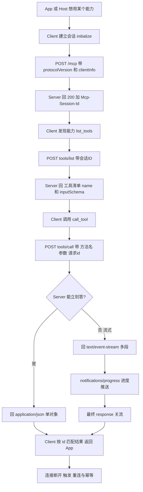
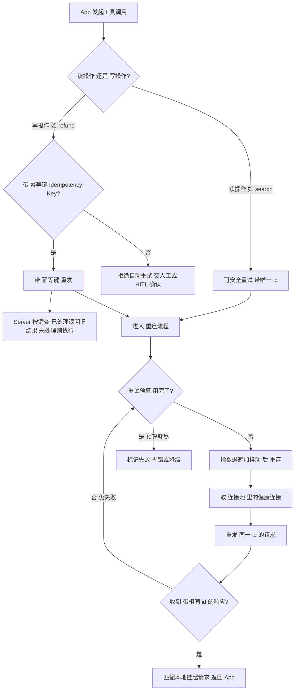

> **一句话**：MCP Client是Host与Server之间的接线员——连接池复用省握手、幂等键防重复执行、断线退避重连，三道防线保生产级可靠调用。

# MCP Client：自定义客户端 + JSON-RPC over HTTP + 连接池 + 幂等重连

MCP 协议里，**Server 暴露能力，Client 消费能力**。

## 二、为什么需要"自定义"客户端？官方的不够吗？

短答：**官方 Client 90% 场景够用，但生产环境你迟早要自己掌控连接。**

FastMCP / 官方 SDK 自带 `Client`，开箱即用：

```python
from fastmcp import Client

# 创建客户端：传入 Server 的 MCP 端点 URL
client = Client("https://example.com/mcp")    # 自动选 HTTP 传输

async with client:                             # async with 管理连接生命周期
    tools = await client.list_tools()          # 问菜单：Server 有哪些工具
    r = await client.call_tool(                # 下单：调用具体工具
        "search",                              # 工具名
        {"q": "RAG"}                           # 参数（JSON 对象）
    )
```

够简单，但生产里有几个它**默认不帮你兜底**的事，逼你走上"自定义"之路：

| 诉求 | 官方默认 | 自定义客户端要解决 |
|-|-|-|
| 连接池 / 复用 | 仅 STDIO 的 `keep_alive=True` 复用子进程；HTTP 每次 `async with` 重建 | 多 Server 连接池、统一复用、限流 |
| 重连 + 幂等 | Streamable HTTP 有"自动重连"，但**幂等靠你自己** | 写操作重发会重复扣款，需幂等键 |
| 可观测性 | 靠 OpenTelemetry（v3.0+） | 自己埋 trace_id / 耗时 / 失败率 |
| 多 Server 路由 | 手动一个一个连 | `ConnectionPool` 按名字管理多 Server |
| 自定义头部 / 认证 | 支持 `BearerAuth` | 动态 JWT、租户头、`X-*` 透传 |

所以"自定义客户端"不是"重写协议"，而是**在官方 Client 之上包一层工程化外壳**：把连接、重试、幂等、池化、监控都管起来。（来源：fastmcp.wiki 客户端传输、CSDN FastMCP Client 实践、字节 youthcamp 第 9 章）

## 三、JSON-RPC over HTTP：Client 和 Server 到底怎么"对话"

**JSON-RPC（JSON Remote Procedure Call，JSON 远程过程调用）** 是 MCP 的"说话格式"——一种极简的远程调用协议，请求和响应都是 JSON。

**HTTP（HyperText Transfer Protocol，超文本传输协议）** 是"送信的邮路"。把两者拼起来就是：**用 HTTP 这个邮路，寄 JSON-RPC 格式的信**。

### 2.1 一封信长啥样（请求）

```json
{
  "jsonrpc": "2.0",
  "method": "tools/call",
  "params": { "name": "search", "arguments": {"q": "RAG"} },
  "id": 7
}
```

- `jsonrpc: "2.0"` —— 声明用 JSON-RPC 2.0 版本
- `method` —— 要 Server 干啥（`initialize` / `tools/list` / `tools/call` / `resources/read` …）
- `params` —— 参数
- `id` —— **本次请求的唯一编号**。Server 回信时原样带回，Client 靠它把"回信"对上"寄出的信"（这就是后面幂等重连的关键）

### 2.2 两种"信"：有回执 vs 没回执

- **请求（Request）**：带 `id`，Server **必须回**一封同样 `id` 的响应。
- **通知（Notification）：不带 `id`，Server 收到就处理，不回**（如 `notifications/initialized`、进度通知）。Client 发完拉倒。

### 2.3 HTTP 邮路的具体规矩（Streamable HTTP 版，见第 ⑩ 篇）

- 主通道是 **POST** 一个端点（如 `/mcp`），body 是上面的 JSON
- 请求头带 `Accept: application/json, text/event-stream` —— 告诉 Server"我既能收普通 JSON，也能收流式 SSE"
- Server 在 `initialize` 响应头里回 `Mcp-Session-Id`（稳定版）—— **会话身份证**，后续请求都得带上
- 能立刻答就回 `application/json`；要流式推就回 `text/event-stream`（SSE，Server-Sent Events，服务端推送事件）

> 类比：`id` 像快递单号，你寄出时拿单号，收到货时对照单号确认"这是我买的那个"；`Mcp-Session-Id` 像你在这家店的会员会话，点单时得报上会员号，店员才记得你之前点了啥。

⚠️ **准确性硬约束**：**当前稳定版（2025-11-25）不支持 JSON-RPC 批处理**（2025-06-18 已移除，见第 ⑩ 篇）。所以 Client 每个 POST 只发**单个** JSON-RPC 消息，不要写"一次发一批"的过时代码。（来源：MCP 官方 release notes / Speakeasy 版本对照）

## 四、自定义 Client 的调用全流程

一个"能打"的自定义 Client 核心就四步：**建会话 → 问能力 → 调工具 → 断线重连**。



（图 1：自定义 MCP Client 标准调用流。来源：CSDN 手写 Client、AWS 中文博客、fastmcp.wiki）

## 五、连接池（Connection Pool）：别每次打电话都重新拨号

### 4.1 为什么需要池

如果你每调一次工具就 `async with client:` 新建连接、握手、建 Session、用完销毁——**开销爆炸**：

- TCP 三次握手 + **TLS（Transport Layer Security，传输层安全协议，即 HTTPS 加密层）** 握手：几百毫秒起步
- MCP `initialize` 建会话：又一轮往返
- 高频调用下，握手时间可能比真正的工具执行还长

**连接池** = 提前建好一批连接放着，谁要用谁拿，用完归还，不销毁。类比：公司不让你每次寄快递都现买手机号，而是给你配一群"长期在线的接线员"，随用随叫。

### 4.2 两种层面的"复用"

| 层面 | 机制 | 说明 |
|-|-|-|
| STDIO 传输 | `keep_alive=True`（默认） | FastMCP 在多个 `async with` 间**复用同一个子进程**，省去反复启动进程（来源：fastmcp.wiki、generalzy） |
| HTTP 传输 | HTTP `keep-alive` + 客户端连接池 | 同一 TCP 连接上复用多个 HTTP 请求；`httpx.AsyncClient` 自带连接池（用 `httpx.Limits` 控大小），省 TCP/TLS 握手 |
| 多 Server | `ConnectionPool` | 一个池管理 N 个 Server 的连接，按名字取（来源：字节 youthcamp 第 9 章） |

> 🔴 高优补充：`httpx.AsyncClient` 本身就是连接池实现——你项目里的 `httpx.AsyncClient` 单例已经天然有池，关键是把"`limits`、`max_connections`、健康检查、多 Server 路由"显式管起来，而不是"有个单例"就完事。

### 4.3 手写一个多 Server 连接池（骨架级）

字节 youthcamp 第 9 章给了一个清晰的 `ConnectionPool` 思路——管理"连接名 → MCPConnection"的字典，每个连接自己负责 `connect / reconnect / 健康检查`：

```python
class ConnectionPool:
    """连接池：管理多个 MCP Server 的连接，按名路由"""

    def __init__(self):
        self.connections: dict[str, MCPConnection] = {}  # name → connection 映射

    async def add_server(self, config):
        """注册一个 Server 到连接池"""
        conn = MCPConnection(config)                     # 创建连接对象
        if await conn.connect():                         # 握手建会话（initialize）
            self.connections[config.name] = conn          # 按 Server 名登记
        return config.name in self.connections            # 返回是否注册成功
```

池的管理要点（🔴 高优增量）：

- **池大小上限**：别无限建，按下游 Server 承受能力设（如 50），超了排队或报错
- **健康检查**：定期 `client.ping()`，死的踢掉重连
- **粘滞连接**：同一会话尽量落到同一后端（但第 ⑩ 篇说过：HTTP 负载均衡下 sticky session 不靠谱，因为前端 `fetch` 不转发 Cookie → 优先选**无状态模式**，2026-07-28 之后协议层直接无状态）

## 六、幂等重连（Idempotent Reconnect）：断线重拨，但别重复下单

这是本篇**最值钱**的一块。

### 5.1 为什么"重连"和"幂等"必须绑在一起讲

网络抖动太常见了。Client 发了个"退款 100 元"的请求，Server 其实**已经执行了**，但响应在半路丢了，Client 以为"没收到 = 失败了"，于是**重发**。结果：用户被退了两次 100 元。

**幂等（Idempotent，指多次执行结果相同）** 就是为解决这个：让"同一个操作执行一次和执行多次，副作用只发生一次"。

> 类比：你打电话让接线员"给张三退 100 元"。如果电话断了你重拨，得让后厨知道"这还是刚才那笔退款，别再退一遍"。怎么让后厨知道？——每笔退款带个**唯一单据号（幂等键）**，后厨看到重复单据号就直接返回上次结果。

### 5.2 三道防线（请求 ID / 幂等键 / 重试预算）



（图 2：连接池 + 幂等重连决策流。来源：AWS 中文博客重试、CSDN 手写 Client 的 reconnect、第 ⑥ 篇失败处理、第 ⑦ 篇幂等键）

三道防线的具体做法：

**① 请求 ID 去重（transport 层）**  
每个请求生成唯一 `id`（自增或 UUID）。Client 本地维护 `id → 挂起 future` 的表；收到响应按 `id` 配对，**同一个 id 的重复响应直接丢弃**。这是 JSON-RPC 协议自带的机制（见 §2.1）。

**② 业务幂等键（Idempotency-Key，应用层）**  
对写操作（退款/改单，见第 ⑦ 篇），Client 生成一个业务幂等键（如 `order_id + action`），放进请求头或参数。Server 端用这个键做去重表（内存/Redis），重复键直接返回首次结果。**键由 Client 生成，Server 去重**——这是"谁发起谁负责"的原则。

**③ 重试预算 + 指数退避 + 抖动（Retry Budget）**

- 别无限重试（会把下游打挂）。设上限，如 3 次
- 退避用**指数退避（Exponential Backoff）**：第 1 次等 1s，第 2 次 2s，第 3 次 4s
- 加**抖动（Jitter）**：在退避时间上叠加随机量，避免一堆 Client 同时重连把 Server 冲垮（"重试风暴"）

```python
from tenacity import retry, stop_after_attempt, wait_exponential

class ResilientClient:
    """带重试预算的 MCP 客户端"""

    @retry(
        stop=stop_after_attempt(3),                      # 重试预算：最多 3 次
        wait=wait_exponential(multiplier=1, min=4, max=10) # 指数退避：4s→8s→10s max
    )
    async def send_request(self, **kwargs):
        """发送 JSON-RPC 请求（自动重试）
        
        重试策略：
        - 第 1 次失败 → 等 4s 再试
        - 第 2 次失败 → 等 8s 再试
        - 第 3 次失败 → 不再重试，抛出异常
        - 抖动（jitter）：tenacity 默认添加微小随机偏移，防重试风暴
        """
        return await super().send_request(**kwargs)
```

（来源：百度云 MCP 实战的 tenacity 重试示例、AWS 中文博客、第 ⑥ 篇重试）

### 5.3 断线恢复（Resumability）—— 稳定版特性，RC 有变

**稳定版（2025-03-26 至 2025-11-25）**：Streamable HTTP 支持**可恢复性（Resumability）**——SSE 事件带全局唯一 `id`，断线后客户端用 `Last-Event-ID` 头重连，Server 把漏掉的流式事件补发回来，不用整个会话重建。官方 Python SDK 的 `StreamableHTTPTransport`**已内置自动重连**：`DEFAULT_RECONNECTION_DELAY_MS=1000`、`MAX_RECONNECTION_ATTEMPTS=2`，就是靠 `last-event-id` 重放。（来源：deepwiki Python SDK 4.3）

> 🔴 **版本红线（必看）**：2026-07-28 无状态 RC **移除了 Resumable SSE 流**（"Resumable SSE streams via Last-Event-ID are not supported"）。也就是说，无状态化之后，断线恢复不再是协议层能力，要靠应用层自己用"显式 handle（如 basket_id）"做状态恢复（呼应第 ⑩ 篇 3.3）。写代码以 SDK 版本为准。

## 七、手写 vs 用官方 Client：怎么选（对比表）

| 维度 | 手写 `HttpMCPClient`（如 AWS 示例） | 官方 `fastmcp.Client` |
|-|-|-|
| 上手成本 | 高，要自己拼 JSON-RPC、管 Session | 低，`Client(url)` 一行 |
| 传输选择 | 手动 | 自动推断（HTTP/STDIO/SSE） |
| 连接复用 | 自己写池 | STDIO `keep_alive` 自带；HTTP 靠 httpx 连接池 |
| 重连 / 幂等 | 自己写（reconnect/idempotency-key） | 自动重连自带；幂等仍需自己加 |
| 认证 | 手写 header | `BearerAuth("token")` 辅助类 |
| 适用 | 特殊协议、嵌入式、深度定制 | 90% 生产场景 |

> 实战建议：**先用官方 Client 跑通，再把"池 + 幂等 + 监控"包一层**当自定义 Client。除非你要钻协议细节或塞进受限环境，否则别从零手写（来源：chatforest FastMCP 生产指南、fastmcp.wiki）。

官方 Client 连接示例（含认证与 SSL）：

```python
from fastmcp import Client
from fastmcp.client.auth import BearerAuth

# 创建带认证的客户端
client = Client(
    "https://api.example.com/mcp",                       # Server 端点
    auth=BearerAuth("your-token-here"),                   # Bearer 认证：自动加 Authorization 头
)
async with client:                                        # 管理连接生命周期
    tools = await client.list_tools()                     # 发现 Server 能力
    # 之后就可以 call_tool 了
```

## 速记卡（面试闪卡）

**Q1：一句话讲清「MCP Client：自定义客户端 + JSON-RPC over HTTP + 连接池 + 幂等重连」到底是什么？**
A：短答：**官方 Client 90% 场景够用，但生产环境你迟早要自己掌控连接。**
FastMCP / 官方 SDK 自带 ，开箱即用：
够简单，但生产里有几个它**默认不帮你兜底**的事，逼你走上"自定义"之路：
| 诉求 | 官方默认 | 自定义客户端要解决 |
|-|-|-|
| 连接池 / 复用 | 仅 STDIO 的  复用子进程；

**Q2：二、为什么需要"自定义"客户端？官方的不够吗？ —— 怎么理解？**
A：短答：**官方 Client 90% 场景够用，但生产环境你迟早要自己掌控连接。**
FastMCP / 官方 SDK 自带 ，开箱即用：
够简单，但生产里有几个它**默认不帮你兜底**的事，逼你走上"自定义"之路：
| 诉求 | 官方默认 | 自定义客户端要解决 |
|-|-|-|
| 连接池 / 复用 | 仅 STDIO 的  复用子进程；

**Q3：三、JSON-RPC over HTTP：Client 和 Server 到底怎么"对话" —— 怎么理解？**
A：**JSON-RPC（JSON Remote Procedure Call，JSON 远程过程调用）** 是 MCP 的"说话格式"——一种极简的远程调用协议，请求和响应都是 JSON。
**HTTP（HyperText Transfer Protocol，超文本传输协议）** 是"送信的邮路"。把两者拼起来就是：**用 HTTP 这个邮路，寄 JSON-RPC 格式的信**。

**Q4：四、自定义 Client 的调用全流程 —— 怎么理解？**
A：一个"能打"的自定义 Client 核心就四步：**建会话 → 问能力 → 调工具 → 断线重连**。
（图 1：自定义 MCP Client 标准调用流。来源：CSDN 手写 Client、AWS 中文博客、fastmcp.wiki）

**Q5：五、连接池（Connection Pool）：别每次打电话都重新拨号 —— 怎么理解？**
A：如果你每调一次工具就  新建连接、握手、建 Session、用完销毁——**开销爆炸**：
TCP 三次握手 + **TLS（Transport Layer Security，传输层安全协议，即 HTTPS 加密层）** 握手：几百毫秒起步
MCP  建会话：又一轮往返
高频调用下，握手时间可能比真正的工具执行还长
**连接池** = 提前建好一批连接放着，谁要用谁拿，用完归还，不销毁。

**Q6：核心速记主线有哪些？**
A：抓住这几根：二、为什么需要"自定义"客户端？官方的不够吗？、三、JSON-RPC over HTTP：Client 和 Server 到底怎么"对话"、四、自定义 Client 的调用全流程、五、连接池（Connection Pool）：别每次打电话都重新拨号、六、幂等重连（Idempotent Reconnect）：断线重拨，但别重复下单、七、手写 vs 用官方 Client：怎么选（对比表）。


## 相关链接

- 项目实践：[[项目实战/ai-resume笔记/01_技术研读/05_MCP协议#MCP Client 实现|ai-resume: MCP协议]]
- 项目实践：[[项目实战/cr-agent笔记/01-技术研读/07-MCP协议实战#🔴 记忆级|cr-agent: MCP协议实战]]

---
→ [[技术学习清单#Agent 架构（核心）]]
