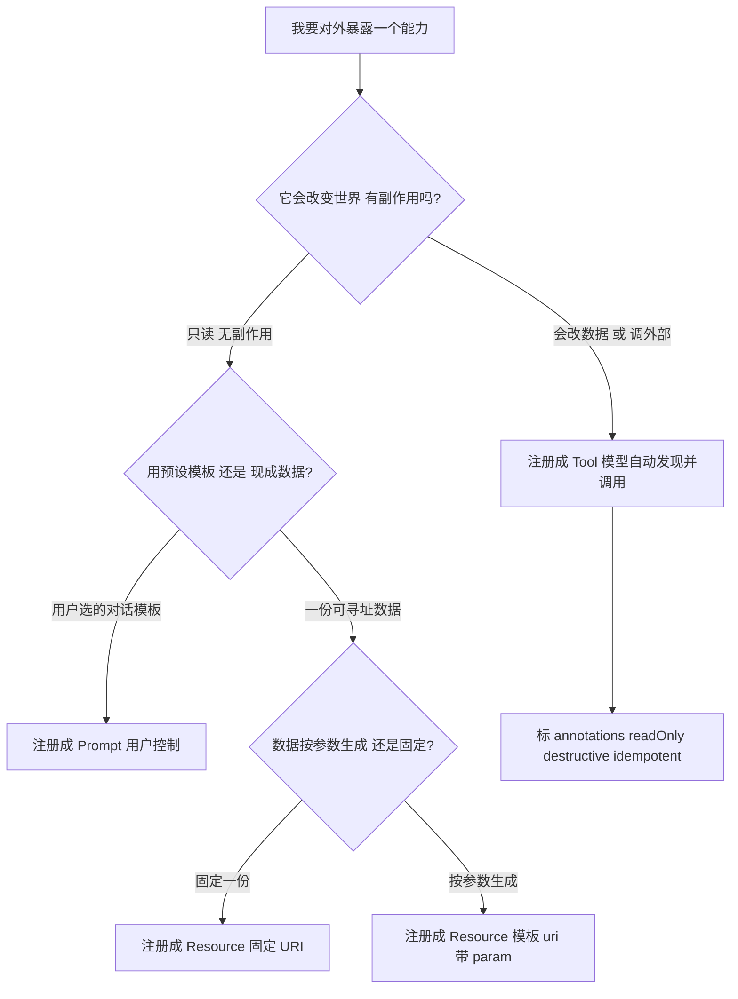
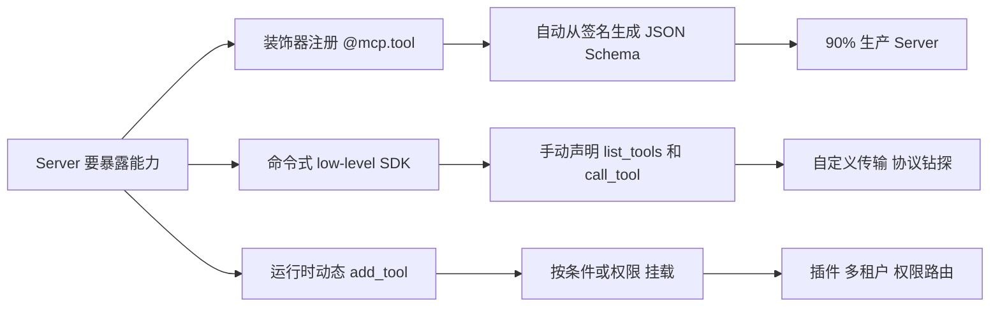

---

title: "MCP Tool/Resource 定义与注册模式"

tags:

  - 技术学习

  - ai

  - agent

created: "2026-07-21"

---


# MCP Tool/Resource 定义与注册模式

> **一句话**：Tool是模型控制的动作（做）、Resource是应用控制的只读数据（读）、Prompt是用户控制的模板——三种注册模式（装饰器/命令式/动态）各有所用，annotations不可信。


## 一、三种原语的控制权不同


MCP 规范对三者"谁说了算"有明确定位，这是理解它们的核心：


| 原语 | 谁控制（who controls） | 本质 | 有无副作用 | 类比 |
|-|-|-|-|-|
| **Tool** | **模型控制**（Model-controlled） | 执行动作 / 函数 | 可能有（改世界） | 菜谱步骤 / `POST` |
| **Resource** | **应用控制**（Application-controlled） | 读取数据 / 上下文 | 无（只读） | 食材 / `GET` |
| **Prompt** | **用户控制**（User-controlled） | 预设指令模板 | 无 | 话术卡片 |


> 规范原文强调：Tool 是**模型自动发现并调用**的；Resource 由**应用**（Host）决定何时注入上下文；Prompt 由**用户**主动选。这个"控制权"区别决定了你该把能力注册成哪种。（来源：MCP 官方规范 Tools/Resources/Prompts 章节）





（图 1：三原语选择决策流。来源：MCP 官方规范控制权定位 + 本系列设计）


## 二、Tool 定义：一个工具长什么样（逐字段拆解）


Tool 是 Server 暴露给模型调用的"函数"。一个 Tool 的完整定义字段如下（以 2025-06-18 规范为准，版本差异见 §6）：


```json

{

  "name": "get_weather",

  "title": "天气信息提供者",

  "description": "获取某个地点的当前天气信息",

  "inputSchema": {

    "type": "object",

    "properties": { "location": { "type": "string", "description": "城市名或邮编" } },

    "required": ["location"]

  },

  "outputSchema": {

    "type": "object",

    "properties": { "temperature": { "type": "number" } }

  },

  "annotations": {

    "readOnlyHint": true,

    "destructiveHint": false,

    "idempotentHint": true,

    "openWorldHint": false

  }

}

```


逐字段解释（全称 + 通俗）：


- **name（名称）**：工具的**唯一标识符**，模型靠它路由调用（如 `tools/call` 的 `params.name`）。规范建议长度 **1–128 字符、大小写敏感**。（来源：MCP 规范 2025-11-25 draft / SEP-986 工具命名指南）

- **title（显示名，可选）：给人看的友好名（如 UI 展示）。2025-06-18 起引入**，旧版 2024-11-05 没有此字段。

- **description（描述）：人/模型可读的功能说明**——这是 LLM 决定"要不要调这个工具"的关键依据，必须写清楚。

- **inputSchema（输入模式）**：用 **JSON Schema（JSON 模式，一种描述 JSON 数据结构的规范）** 定义参数。默认按 **JSON Schema 2020-12** 解释（若未写 `$schema`）。无参数时写 `{ "type": "object" }`。

- **outputSchema（输出模式，可选）：同样用 JSON Schema 定义返回结构。2025-06-18 起引入**。有了它，Server 应返回符合该模式的结构化结果，Client 也应据此校验。

- **annotations（注解，可选）：描述工具行为的元信息（见 §4）。规范明确：客户端 MUST 视 annotations 为不可信，除非来自可信 Server。**


### 1.1 Tool 调用与结果


客户端发 `tools/call` → Server 回结果。结果可含多类型内容（文本 / 图像 / 音频 / 资源链接 / 嵌入资源），并支持**结构化输出**`structuredContent`（2025-06-18+）。`structuredContent` 是一份可预测结构的 JSON，让模型不必解析非结构化文本。（来源：腾讯云 MCP 演进史 / 掘金 2025-06-18 详解）


### 1.2 错误处理（两种，别混）


- **协议错误（Protocol Error）**：JSON-RPC 标准错误，如未知工具 `-32602 Invalid params`、未知方法 `-32601`。直接走 JSON-RPC 错误通道。

- **工具执行错误（Execution Error）**：工具本身跑起来了但业务失败（API 限流、无效输入），在结果里用 **`isError: true`** 返回，不抛协议错。


> 🔴 **高优细节（2025-11-25 SEP-1303）**：规范**明确建议把"输入校验错误"作为 Tool Execution Error（`isError: true`）返回，而不是 Protocol Error**。原因：模型能读到 `isError` 结果里的错误信息并**自我纠正**；若用协议错，模型拿不到业务上下文。所以"参数不合法"别用 `-32602` 甩锅，写成 `isError:true` 的结果更友好。（来源：MCP changelog SEP-1303）

>

> 区分点：协议错误 = "调用姿势不对/工具不存在"；执行错误 = "工具跑了但业务挂了"。两者排查路径不同。（来源：MCP 官方规范 Tools 章节）


## 三、Resource 定义：一份只读数据长什么样


Resource 是 Server 暴露的"只读上下文"，通过 **URI（Uniform Resource Identifier，统一资源标识符，类似网址但更通用）** 寻址。


```json

{

  "uri": "file:///project/report.md",

  "name": "项目周报",

  "description": "本周项目进度报告",

  "mimeType": "text/markdown",

  "size": 1024,

  "annotations": { "audience": ["user", "assistant"], "priority": 0.7 }

}

```


逐字段：


- **uri（资源标识）：唯一键**，格式如 `scheme://path`（例：`file:///docs/report.md`、`config://app-settings`）。Server 据此定位并返回内容。

- **name / description**：同 Tool，给人/模型看的名字与说明。

- **mimeType（媒体类型）**：内容格式，如 `text/markdown`、`image/png`，决定客户端怎么渲染。

- **size（大小，可选）**：字节数。

- **annotations（注解，可选）**：与 Tool 共用同一套注解格式（含 audience / priority / lastModified 等元信息）。


### 2.1 Resource 模板（带参数的资源）


单个资源是"一份数据"，但很多数据是按参数生成的（如"读某个路径的文件"）。MCP 支持 **Resource Template（资源模板）**：URI 里用 `{param}` 占位，调用时填实参。


```python

@mcp.resource("file:///{path}")         # 资源模板：{path} 是动态参数

def read_file(path: str) -> str:

    """读取指定路径的文件内容"""          # docstring → description

    with open(path, encoding="utf-8") as f:

        return f.read()

```


客户端用 `resources/templates/list` 发现模板，用 `resources/read` 带实参读取。（来源：FastMCP 实战 CSDN/掘金、MCP 规范 Resources 章节）


## 四、Tool Annotations（注解）：告诉主机"这工具危险吗"


这是 Tool 专属、也最容易被忽略的字段。四个 hint（提示）描述工具行为，主机（Host）据此决定"要不要弹确认框 / 能不能自动重试"：


| 注解字段 | 含义 | 主机可能的行为 |
|-|-|-|
| `readOnlyHint: true` | 只读，不改世界 | 可自动执行，无需确认 |
| `destructiveHint: true` | 破坏性、不可撤销 | **要求用户明确确认** |
| `idempotentHint: true` | 幂等，重复执行安全 | 可安全重试（呼应第 ⑥⑦⑪ 篇） |
| `openWorldHint: true` | 影响外部开放系统 | 谨慎执行 |


> 🔴 **重要安全提醒（规范原文）：客户端 MUST 把 annotations 当不可信**，除非来自可信 Server。即"工具自己说自己只读"不等于真只读——主机仍要按第 ⑦ 篇的"三道闸门"做确认与权限控制。annotations 是"建议"，不是"保证"。


## 五、注册模式：怎么把能力"挂"到 Server 上


"定义"解决了"长啥样"，"注册"解决"怎么让 Server 认领它"。常见三种模式：


### 4.1 装饰器注册（FastMCP，最常用，推荐）


```python

from fastmcp import FastMCP

mcp = FastMCP("MyServer")                               # 创建 Server 实例


@mcp.tool()                                              # 装饰器：注册为 Tool

def search(q: str) -> str:

    """在知识库检索"""                                    # docstring → Tool 的 description

    # FastMCP 自动将函数签名转成 inputSchema，返回类型转成 outputSchema

    ...


@mcp.resource("config://settings")                       # 装饰器：注册为 Resource

def get_settings() -> str:

    """返回配置"""                                        # URI 是 config://settings

    ...

```


FastMCP 会**自动从函数签名 + 类型注解 + docstring 生成符合规范的 JSON Schema**（inputSchema）。支持同步 / `async def`，同步函数丢进内置线程池不阻塞事件循环。（来源：FastMCP 实战 CSDN/掘金）


### 4.2 命令式 / 底层 SDK 注册（精细控制）


不依赖装饰器，用底层 `mcp.server.low_level` 手动声明：


```python

from mcp.server.low_level import Server

server = Server("raw")                                   # 底层 Server 实例


@server.list_tools()                                     # 手动声明"列出所有工具"的处理函数

async def list_tools(): ...                              # 返回 Tool 清单（含 name/description/inputSchema）


@server.call_tool()                                      # 手动声明"调用工具"的处理函数

async def call_tool(name, arguments): ...                 # 根据 name 分发到具体函数并执行

```


适合要完全控制协议行为、写自定义传输或极特殊 Server 的场景（呼应第 ⑨ 篇"何时用 raw SDK"）。


### 4.3 运行时动态注册（按需挂载）


能力不是写死在代码里，而是运行时根据条件 `add` 上去：


```python

mcp.add_tool(search_fn)                                  # 运行时动态把函数注册成 Tool

# 适合：插件系统、多租户按权限暴露不同工具集、条件性加载

```


适合**插件化 / 多租户 / 按权限动态暴露能力**——比如不同租户只看到自己被授权的工具（呼应第 ⑨ 篇 contextvars 多租户隔离）。


### 4.4 三种模式对比


| 模式 | 上手 | Schema 生成 | 控制粒度 | 适用 |
|-|-|-|-|-|
| 装饰器（FastMCP） | 极简 | 自动 | 中 | 90% 生产 Server |
| 命令式（low-level SDK） | 复杂 | 手动 | 细 | 自定义传输 / 协议钻探 |
| 运行时动态 | 中 | 看写法 | 动态 | 插件 / 多租户 / 权限路由 |





（图 2：三种注册模式与适用场景。来源：FastMCP 实战、第 ⑨ 篇）


## 六、版本差异（准确性红线，务必分清）


MCP 规范演进快，字段随版本变。写代码前先确认目标版本：


| 字段 / 能力 | 2024-11-05 | 2025-06-18 | 2025-11-25 | 2026-07-28 RC |
|-|-|-|-|-|
| `name` / `description` / `inputSchema` | ✅ | ✅ | ✅ | ✅ |
| `title`（显示名） | ❌ | ✅ 新增 | ✅ | ✅ |
| `outputSchema` | ❌ | ✅ 新增 | ✅ | ✅ |
| `structuredContent`（结构化输出） | ❌ | ✅ 新增 | ✅ | ✅ |
| `annotations`（四 hint） | 部分 | ✅ | ✅ | ✅ |
| Resource 模板 `{param}` | ✅ | ✅ | ✅ | ✅ |
| JSON-RPC 批处理 | ❌ | ❌（2025-03-26 加、本版移除） | ❌ | ❌ |
| JSON Schema 默认 2020-12 | ❌ | ❌ | ✅（SEP-1613） | ✅ |
| 输入错误→`isError`（SEP-1303） | ❌ | ❌ | ✅ 建议 | ✅ |
| 工具图标 metadata（SEP-973） | ❌ | ❌ | ✅ | ✅ |
| `tools/list` 缓存 `ttlMs`/`cacheScope` | 基础分页 | 基础 | 增强 | ✅（正式） |
| Resumable SSE / `Last-Event-ID` | ✅ | ✅ | ✅ | ❌ 移除 |


> 🔴 **实战建议**：**以你依赖的 SDK / Server 实际支持版本为准**。写 `outputSchema` / `title` 时若对接旧版客户端可能不识别——先 `initialize` 协商 `protocolVersion`（见第 ⑧ 篇握手）。如不确定，标注"以官方文档为准"。2026-07-28 是 RC（最终版同日发布），生产建议先锁 2025-11-25。


## 速记卡（面试闪卡）


**Q1：一句话讲清「MCP Tool/Resource 定义与注册模式」到底是什么？**

A：MCP 把对外能力分成 Tool、Resource、Prompt 三类原语，并用装饰器、命令式、动态三种模式注册到 Server。


**Q2：二、三种原语的控制权不同 —— 怎么理解？**

A：像点菜：Tool 是厨师按你点的菜自动做（模型控制 Model-controlled）；Resource 是服务员端来的现成菜（应用控制 Application-controlled）；Prompt 是你递给厨师的小纸条（用户控制 User-controlled）。谁控制决定能力该注册成哪种。


**Q3：三、Tool 定义：一个工具长什么样（逐字段拆解） —— 怎么理解？**

A：像填一张快递单：name 是单号（模型靠它路由，1~128 字符），description 是说明（模型据此决定调不调），inputSchema 用 JSON Schema 定义参数，annotations 是'易碎/危险'标签——但规范说客户端 MUST 把 annotations 当不可信。业务出错用 isError:true 返回，让模型读到信息自我纠正。


**Q4：四、Resource 定义：一份只读数据长什么样 —— 怎么理解？**

A：像图书馆带编号的书：用 URI（Uniform Resource Identifier，统一资源标识符）当索书号定位，mimeType 是类型，size 是页数。Resource Template 像'按书名生成'的占位索书号 {param}，客户端用 resources/read 带实参读取——适合按参数生成的一份数据。


**Q5：五、Tool Annotations（注解）：告诉主机"这工具危险吗" —— 怎么理解？**

A：像工具上的四个警示贴：readOnlyHint（只读可自动执行）、destructiveHint（破坏性要用户确认）、idempotentHint（幂等可安全重试）、openWorldHint（动外网要谨慎）。但规范明确：工具自己说'只读'不等于真只读，主机仍要按闸门确认。


**Q6：核心速记主线有哪些？**

- 三类原语：Tool 模型控制（做）、Resource 应用控制（读）、Prompt 用户控制（选）

- Tool 字段：name 路由、description 决策依据、inputSchema 用 JSON Schema、annotations 不可信

- 错误分两种：协议错走 JSON-RPC，业务错用 isError:true 返回

- 三种注册模式：装饰器 FastMCP（自动生成 Schema）、low-level SDK（精细）、运行时动态 add_tool（按权限）


**口诀**

A：Tool 模型做，Resource 应用读；

Prompt 用户选，控制权各属；

注册三模式，装饰器最熟；

annotations 别轻信，出错用 isError。


## 相关链接


---

→ [[技术学习路线图#Agent 架构（核心）]]

