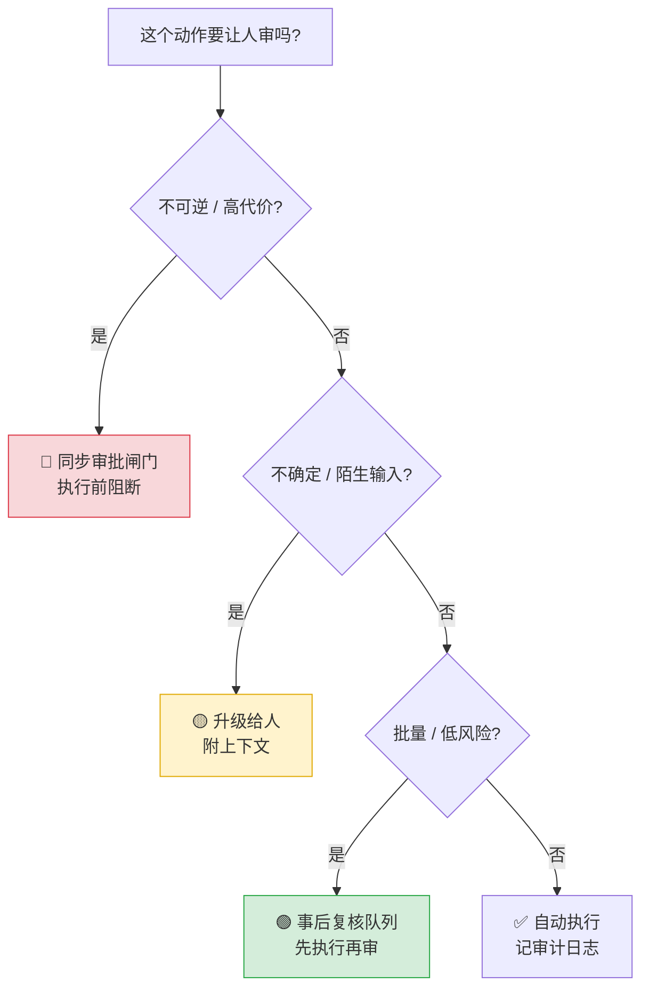

---

title: "Human-in-the-loop：人工介入兜底与敏感操作审批机制"

tags:

  - 技术学习

  - ai

  - agent

created: "2026-07-21"

---

# Human-in-the-loop：人工介入兜底与敏感操作审批机制

> **一句话**：HITL不是把Agent关掉变回人肉工具，而是给自动机装可控的刹车——危险动作执行前暂停等人审批（同步闸门），低风险自己跑，框架级硬原语而非Prompt软约束。

## 一、原理速览

**HITL（Human-in-the-loop）** = 在 Agent 自动执行流程里预设**暂停点**，到了这些点就停下来等人类决策（批准/拒绝/修改/直接回答），人类给完信号再从原处接着跑。它把「要不要让人把关」从写在 prompt 里的软约束升级成**框架级别的硬性原语**。

### SA-ROC 三区框架

| 区 | 风险 | 行为 |

|---|------|------|

| 🟢 Green | 低风险高置信 | 自动执行 |

| 🟡 Gray | 中风险中置信 | 必须人审 |

| 🔴 Red | 不可逆高代价 | 仅人操作 |

### 三种交互模式

| 模式 | 什么时候用 | 代价 |

|------|-----------|------|

| 同步闸门 | 不可逆、代价高的动作（删库/转账） | 延迟最高；依赖 reviewer 在线 |

| 异步升级 | 中风险、可并行的决策 | 拒绝后的恢复路径要预先设计 |

| 并行反馈 | 低风险常规操作 + 异常触发 | 必须动作可回滚 |

### LangGraph HITL 三原语

- **interrupt**：显式暂停点，抛出 HITLRequest 给客户端

- **Checkpoint**：由 checkpointer（MemorySaver/Postgres/Redis）在中断点保存完整 graph state

- **Command(resume=value)**：同 thread_id 恢复执行

四种决策类型：`approve`（按原样执行）、`reject`（不执行，附原因）、`edit`（改参数后执行）、`respond`（人直接给结果）。

### 生产级 HITL 五大模式

1. **审批闸门（Approval Gates）**：特定动作（deploy/delete/send_email/改库）执行前必审

2. **置信度阈值（Confidence Thresholds）**：高置信自动跑，低置信暂停给人

3. **升级流（Escalation Flows）**：Agent 卡住/遇陌生输入时转交人

4. **事后复核（Review Queues）**：低风险动作先执行，全部进队列等人定期审

5. **渐进授权（Staged Autonomy）**：新能力先「全审批」，数据证明可靠后「毕业」

**防审批疲劳**：按工具类别 + 参数检查精细 Gate，不给 reviewer 甩 40 行上下文。**分级路由**：按动作类别和 reviewer 专长分派。**审计轨迹**：每次决策落日志，合规（EU AI Act 第 14 条）+ 校准阈值（批准率 >90% 闸门太宽，<70% 太窄）。



## 二、代码实现
### 骨架级示意

```python

def approval_node(state):

    decision = interrupt({"action": state["pending_action"]})  # 暂停,等人

    if decision["approved"]:

        return Command(goto="execute")   # 恢复后走执行

    return Command(goto="reject")         # 否则走拒绝分支

# 恢复: agent.invoke(Command(resume={"approved": True}), config)

```

### LangGraph HITL 完整代码

```python

from langgraph.graph import StateGraph, START, END

from langgraph.checkpoint.memory import MemorySaver

from langgraph.types import interrupt, Command

from typing import TypedDict, Optional

# ===== 1. 定义图状态 =====

class AgentState(TypedDict):

    task: str

    pending_action: Optional[dict]

    approved: bool

    result: str

# ===== 2. 定义各节点 =====

def plan_node(state: AgentState) -> AgentState:

    return {

        "pending_action": {

            "tool": "send_email",

            "params": {"to": "all@company.com", "subject": "系统升级通知"}

        }

    }

def approval_node(state: AgentState) -> AgentState:

    decision = interrupt({

        "action": state["pending_action"],

        "question": f"确认执行 {state['pending_action']['tool']}?",

    })

    return {"approved": decision.get("decision") == "approve"}

def execute_node(state: AgentState) -> AgentState:

    action = state["pending_action"]

    result = f"已执行 {action['tool']}，参数: {action['params']}"

    return {"result": result}

def reject_node(state: AgentState) -> AgentState:

    return {"result": "操作已被人工拒绝，任务取消。"}

# ===== 3. 构建图 =====

def build_hitl_graph():

    builder = StateGraph(AgentState)

    builder.add_node("plan", plan_node)

    builder.add_node("approval", approval_node)

    builder.add_node("execute", execute_node)

    builder.add_node("reject", reject_node)

    builder.add_edge(START, "plan")

    builder.add_edge("plan", "approval")

    builder.add_conditional_edges(

        "approval",

        lambda s: "execute" if s["approved"] else "reject",

        {"execute": "execute", "reject": "reject"}

    )

    builder.add_edge("execute", END)

    builder.add_edge("reject", END)

    return builder.compile()

# ===== 4. 运行与恢复 =====

checkpointer = MemorySaver()

graph = build_hitl_graph()

graph.checkpointer = checkpointer

config = {"configurable": {"thread_id": "user-session-001"}}

try:

    result = graph.invoke({"task": "通知全体员工系统升级"}, config)

except Exception as e:

    print(f"等待审批: {e}")

resume_result = graph.invoke(

    Command(resume={"decision": "approve", "reason": "确认无误"}),

    config

)

print(resume_result["result"])

# ===== 5. 前端审批卡数据结构 =====

HITL_REQUEST_EXAMPLE = {

    "type": "hitl_request",

    "thread_id": "user-session-001",

    "action": {

        "tool": "send_email",

        "params": {"to": "all@company.com", "subject": "系统升级通知"}

    },

    "decision_options": ["approve", "reject", "edit"],

    "timestamp": "2026-07-21T10:30:00Z",

}

```

核心就三样：`interrupt()` 抛、`Command(goto=...)` 分流、`Command(resume=...)` 续命。checkpointer 负责存盘。

### 2026 三大框架统一审批原语

| 框架 | 审批 API | 默认姿态 |

|------|---------|---------|

| Microsoft Agent Framework | 工具审批中间件 | 技能提供方带来的工具**默认需审批** |

| LangChain / LangGraph | HumanInTheLoopMiddleware（interrupt_on 映射） | 默认关，按工具开 |

| OpenAI Agents SDK | needsApproval（本地工具）/ require_approval（MCP 服务器） | 按工具/MCP 逐个开 |

##

> ▶ 对应原理：[[55-Agent安全防护与权限分级|55-Agent安全防护与权限分级]]

> ▶ 对应原理：[[56-Human-in-the-loop人工介入|56-Human-in-the-loop人工介入]]

## 速记卡（面试闪卡）

**Q1：一句话讲清「Human-in-the-loop：人工介入兜底与敏感操作审批机制」到底是什么？**

A：HITL 是给自动机装可控刹车：危险动作执行前暂停等人审批，低风险自己跑，框架级硬原语。

**Q2：一、原理：三区与三模式 —— 怎么理解？**

A：SA-ROC 三区（红/黄/绿，按风险分级）：绿区自动、灰区必人审、红区仅人操作。三种交互：同步闸门（拦删库转账，延迟最高）、异步升级（中风险并行）、并行反馈（低风险可回滚）。本质是把把关从 prompt 软约束升级成框架硬原语。

**Q3：二、LangGraph 三原语 —— 怎么理解？**

A：LangGraph HITL 三原语：interrupt（显式暂停点，抛 HITLRequest 给客户端）、Checkpoint（检查点，在中断处存完整 graph state）、Command(resume=value)（同 thread_id 恢复执行）。四种决策：approve/reject/edit/respond。

**Q4：三、生产级五大模式 —— 怎么理解？**

A：生产五大模式：审批闸门（deploy/delete/send_email 前必审）、置信度阈值（低置信暂停）、升级流（卡住转交人）、事后复核队列（低风险先执行再审）、渐进授权（新能力先全审批，可靠后毕业）。防审批疲劳靠精细 Gate + 审计轨迹（合规 EU AI Act 第 14 条）。

**Q5：四、三大框架统一原语 —— 怎么理解？**

A：2026 三大框架都给了审批原语：Microsoft Agent Framework 用工具审批中间件（自带工具默认需审批）；LangChain/LangGraph 用 HumanInTheLoopMiddleware（默认关、按工具开）；OpenAI Agents SDK 用 needsApproval/require_approval（按工具/MCP 开）。

**Q6：核心速记主线有哪些？**

- HITL 是框架级硬原语，不是 prompt 软约束

- 三区分级：绿自动 / 灰人审 / 红仅人操作

- 三原语：interrupt 暂停、Checkpoint 存盘、Command 恢复

- 五大模式 + 防审批疲劳：精细 Gate + 审计轨迹

**口诀**

A：自动机装刹车，危险先审批；

绿区自动跑，红区人操作。

interrupt 暂停，checkpoint 存；

command 来恢复，框架硬原语。

相关链接

---

→ [[技术学习路线图#Agent 架构（核心）]]

相关链接

---

→

**Q5：核心速记主线有哪些？**

A：抓住这几根：一、原理速览、二、代码实现、。

## 相关链接

- [[笔记/AI与Agent/知识/实战/27-指数退避重试：ExponentialBackoff+Jitter|指数退避重试：Exponential Backoff + Jitter]]

- [[笔记/AI与Agent/知识/实战/26-工具幂等性与副作用控制：防止重复执行的工程手段|工具幂等性与副作用控制：防止重复执行的工程手段]]

- [[笔记/AI与Agent/知识/实战/28-降级路径（Degradation）：某环节失败→回退到次优但可用方案|降级路径（Degradation）：某环节失败→回退到次优但可用方案]]

- [[笔记/AI与Agent/知识/实战/12-Self-RAG：自我反思+自纠正闭环|Self-RAG：自我反思+自纠正闭环]]

- [[笔记/AI与Agent/知识/实战/41-错误Patch回滚-验证-再尝试机制|错误Patch回滚+验证+再尝试机制]]

